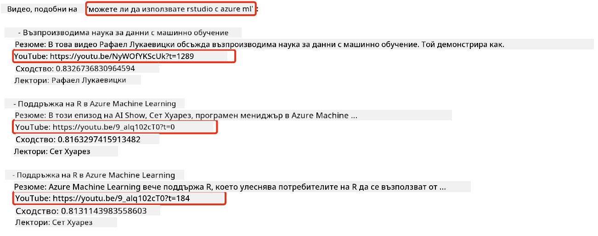
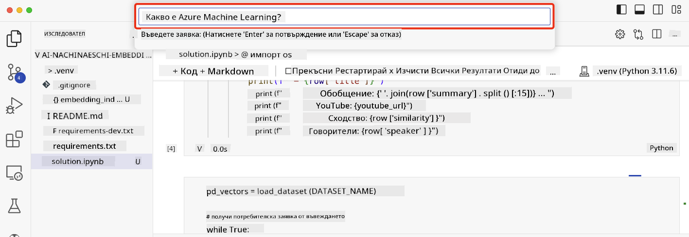

<!--
CO_OP_TRANSLATOR_METADATA:
{
  "original_hash": "d46aad0917a1a342d613e2c13d457da5",
  "translation_date": "2025-05-19T18:43:22+00:00",
  "source_file": "08-building-search-applications/README.md",
  "language_code": "bg"
}
-->
# Създаване на приложения за търсене

[](https://aka.ms/gen-ai-lesson8-gh?WT.mc_id=academic-105485-koreyst)

> > _Кликнете върху изображението по-горе, за да гледате видео от този урок_

Големите езикови модели (LLMs) не са само чатботове и генериране на текст. Възможно е също така да се изградят приложения за търсене, използвайки вградени представяния. Вградените представяния са числови представяния на данни, известни още като вектори, и могат да се използват за семантично търсене на данни.

В този урок ще създадете приложение за търсене за нашия образователен стартъп. Нашият стартъп е неправителствена организация, която предоставя безплатно образование на ученици в развиващите се страни. Стартъпът има голям брой видеоклипове в YouTube, които учениците могат да използват, за да научат повече за AI. Стартъпът иска да създаде приложение за търсене, което позволява на учениците да търсят видеоклип в YouTube, като въвеждат въпрос.

Например, ученик може да въведе 'Какво представляват Jupyter Notebooks?' или 'Какво е Azure ML', и приложението за търсене ще върне списък с видеоклипове в YouTube, които са релевантни за въпроса, и още по-добре, приложението за търсене ще върне връзка към мястото във видеото, където се намира отговорът на въпроса.

## Въведение

В този урок ще разгледаме:

- Семантично срещу ключово търсене.
- Какво представляват текстовите вградени представяния.
- Създаване на индекс за текстови вградени представяния.
- Търсене в индекс за текстови вградени представяния.

## Цели на обучението

След завършване на този урок ще можете:

- Да разграничавате семантично и ключово търсене.
- Да обясните какво представляват текстовите вградени представяния.
- Да създадете приложение, използващо вградени представяния за търсене на данни.

## Защо да създадем приложение за търсене?

Създаването на приложение за търсене ще ви помогне да разберете как да използвате вградени представяния за търсене на данни. Ще научите също така как да изградите приложение за търсене, което може да се използва от учениците за бързо намиране на информация.

Урокът включва индекс на вградени представяния на транскрипциите от YouTube канала на Microsoft [AI Show](https://www.youtube.com/playlist?list=PLlrxD0HtieHi0mwteKBOfEeOYf0LJU4O1). AI Show е YouTube канал, който ви учи за AI и машинно обучение. Индексът на вградени представяния съдържа вградени представяния за всяка от транскрипциите в YouTube до октомври 2023 г. Ще използвате индекса на вградени представяния, за да създадете приложение за търсене за нашия стартъп. Приложението за търсене връща връзка към мястото във видеото, където се намира отговорът на въпроса. Това е чудесен начин за учениците да намерят необходимата им информация бързо.

Следва пример за семантично търсене за въпроса 'можете ли да използвате rstudio с azure ml?'. Вижте URL адреса в YouTube, ще видите, че URL адресът съдържа времеви маркер, който ви отвежда до мястото във видеото, където се намира отговорът на въпроса.



## Какво е семантично търсене?

Може би се чудите какво е семантично търсене? Семантичното търсене е техника за търсене, която използва семантиката или значението на думите в заявката, за да върне релевантни резултати.

Ето пример за семантично търсене. Да кажем, че искате да купите кола, може да потърсите 'моята мечтана кола', семантичното търсене разбира, че не `dreaming` за кола, а всъщност търсите да купите вашата `ideal` кола. Семантичното търсене разбира вашето намерение и връща релевантни резултати. Алтернативата е `keyword search`, което буквално би търсило мечти за коли и често връща нерелевантни резултати.

## Какво представляват текстовите вградени представяния?

[Текстовите вградени представяния](https://en.wikipedia.org/wiki/Word_embedding?WT.mc_id=academic-105485-koreyst) са техника за представяне на текст, използвана в [обработката на естествен език](https://en.wikipedia.org/wiki/Natural_language_processing?WT.mc_id=academic-105485-koreyst). Текстовите вградени представяния са семантични числови представяния на текст. Вградените представяния се използват за представяне на данни по начин, който е лесен за разбиране от машината. Има много модели за изграждане на текстови вградени представяния, в този урок ще се фокусираме върху генерирането на вградени представяния, използвайки модела за вградени представяния на OpenAI.

Ето пример, представете си, че следният текст е в транскрипция от един от епизодите на AI Show YouTube канала:

```text
Today we are going to learn about Azure Machine Learning.
```

Ще предадем текста на OpenAI Embedding API и той ще върне следното вградено представяне, състоящо се от 1536 числа, известни като вектор. Всяко число във вектора представлява различен аспект на текста. За краткост, ето първите 10 числа във вектора.

```python
[-0.006655829958617687, 0.0026128944009542465, 0.008792596869170666, -0.02446001023054123, -0.008540431968867779, 0.022071078419685364, -0.010703742504119873, 0.003311325330287218, -0.011632772162556648, -0.02187200076878071, ...]
```

## Как се създава индексът на вградени представяния?

Индексът на вградени представяния за този урок беше създаден с поредица от Python скриптове. Ще намерите скриптовете заедно с инструкции в [README](./scripts/README.md?WT.mc_id=academic-105485-koreyst) в папката 'scripts' за този урок. Не е необходимо да изпълнявате тези скриптове, за да завършите урока, тъй като индексът на вградени представяния е предоставен за вас.

Скриптовете извършват следните операции:

1. Транскрипцията за всеки видеоклип в YouTube от плейлиста [AI Show](https://www.youtube.com/playlist?list=PLlrxD0HtieHi0mwteKBOfEeOYf0LJU4O1) се изтегля.
2. Използвайки [OpenAI Functions](https://learn.microsoft.com/azure/ai-services/openai/how-to/function-calling?WT.mc_id=academic-105485-koreyst), се прави опит за извличане на името на говорителя от първите 3 минути на транскрипцията в YouTube. Името на говорителя за всеки видеоклип се съхранява в индекс на вградени представяния, наречен `embedding_index_3m.json`.
3. Текстът на транскрипцията след това се разделя на **3-минутни текстови сегменти**. Сегментът включва около 20 думи, които се припокриват със следващия сегмент, за да се гарантира, че вграденото представяне за сегмента не е прекъснато и да се осигури по-добър контекст за търсене.
4. Всеки текстов сегмент след това се предава на OpenAI Chat API, за да се обобщи текстът в 60 думи. Обобщението също се съхранява в индекс на вградени представяния `embedding_index_3m.json`.
5. Накрая, текстът на сегмента се предава на OpenAI Embedding API. Embedding API връща вектор от 1536 числа, които представляват семантичното значение на сегмента. Сегментът заедно с вектора на OpenAI Embedding се съхранява в индекс на вградени представяния `embedding_index_3m.json`.

### Векторни бази данни

За простота на урока индексът на вградени представяния се съхранява в JSON файл, наречен `embedding_index_3m.json` и се зарежда в Pandas DataFrame. В производствени условия обаче индексът на вградени представяния би се съхранявал във векторна база данни като [Azure Cognitive Search](https://learn.microsoft.com/training/modules/improve-search-results-vector-search?WT.mc_id=academic-105485-koreyst), [Redis](https://cookbook.openai.com/examples/vector_databases/redis/readme?WT.mc_id=academic-105485-koreyst), [Pinecone](https://cookbook.openai.com/examples/vector_databases/pinecone/readme?WT.mc_id=academic-105485-koreyst), [Weaviate](https://cookbook.openai.com/examples/vector_databases/weaviate/readme?WT.mc_id=academic-105485-koreyst), и други.

## Разбиране на косинусова подобност

Научихме за текстовите вградени представяния, следващата стъпка е да научим как да използваме текстовите вградени представяния за търсене на данни и по-конкретно да намерим най-подобните вградени представяния на дадена заявка, използвайки косинусова подобност.

### Какво е косинусова подобност?

Косинусовата подобност е мярка за подобност между два вектора, ще я чуете и като `nearest neighbor search`. За да извършите търсене с косинусова подобност, трябва да _векторизирате_ текста на _заявката_ с помощта на OpenAI Embedding API. След това изчислете _косинусовата подобност_ между вектора на заявката и всеки вектор в индекса на вградени представяния. Запомнете, индексът на вградени представяния има вектор за всеки текстов сегмент от транскрипцията в YouTube. Накрая сортирайте резултатите по косинусова подобност и текстовите сегменти с най-висока косинусова подобност са най-подобни на заявката.

От математическа гледна точка, косинусовата подобност измерва косинуса на ъгъла между два вектора, проектирани в многомерно пространство. Това измерване е полезно, защото ако два документа са далеч един от друг по евклидово разстояние поради размер, те все пак могат да имат по-малък ъгъл между тях и следователно по-висока косинусова подобност. За повече информация относно уравненията за косинусова подобност, вижте [Cosine similarity](https://en.wikipedia.org/wiki/Cosine_similarity?WT.mc_id=academic-105485-koreyst).

## Създаване на вашето първо приложение за търсене

След това ще научим как да създадем приложение за търсене, използвайки вградени представяния. Приложението за търсене ще позволи на учениците да търсят видеоклип, като въведат въпрос. Приложението за търсене ще върне списък с видеоклипове, които са релевантни за въпроса. Приложението за търсене ще върне също така връзка към мястото във видеото, където се намира отговорът на въпроса.

Това решение беше създадено и тествано на Windows 11, macOS и Ubuntu 22.04, използвайки Python 3.10 или по-нова версия. Можете да изтеглите Python от [python.org](https://www.python.org/downloads/?WT.mc_id=academic-105485-koreyst).

## Задание - създаване на приложение за търсене, за да се подпомогнат учениците

Представихме нашия стартъп в началото на този урок. Сега е време да дадем възможност на учениците да създадат приложение за търсене за своите оценки.

В това задание ще създадете услугите Azure OpenAI, които ще се използват за създаване на приложението за търсене. Ще създадете следните услуги Azure OpenAI. Ще ви трябва абонамент за Azure, за да завършите това задание.

### Стартирайте Azure Cloud Shell

1. Влезте в [Azure портал](https://portal.azure.com/?WT.mc_id=academic-105485-koreyst).
2. Изберете иконата на Cloud Shell в горния десен ъгъл на Azure портал.
3. Изберете **Bash** за тип на средата.

#### Създаване на ресурсна група

> За тези инструкции използваме ресурсната група с име "semantic-video-search" в East US.
> Можете да промените името на ресурсната група, но когато променяте местоположението на ресурсите,
> проверете [таблицата за наличност на моделите](https://aka.ms/oai/models?WT.mc_id=academic-105485-koreyst).

```shell
az group create --name semantic-video-search --location eastus
```

#### Създаване на ресурс за Azure OpenAI Service

От Azure Cloud Shell изпълнете следната команда, за да създадете ресурс за Azure OpenAI Service.

```shell
az cognitiveservices account create --name semantic-video-openai --resource-group semantic-video-search \
    --location eastus --kind OpenAI --sku s0
```

#### Получаване на крайна точка и ключове за използване в това приложение

От Azure Cloud Shell изпълнете следните команди, за да получите крайна точка и ключове за ресурса Azure OpenAI Service.

```shell
az cognitiveservices account show --name semantic-video-openai \
   --resource-group  semantic-video-search | jq -r .properties.endpoint
az cognitiveservices account keys list --name semantic-video-openai \
   --resource-group semantic-video-search | jq -r .key1
```

#### Разгръщане на модела за вградени представяния на OpenAI

От Azure Cloud Shell изпълнете следната команда, за да разположите модела за вградени представяния на OpenAI.

```shell
az cognitiveservices account deployment create \
    --name semantic-video-openai \
    --resource-group  semantic-video-search \
    --deployment-name text-embedding-ada-002 \
    --model-name text-embedding-ada-002 \
    --model-version "2"  \
    --model-format OpenAI \
    --sku-capacity 100 --sku-name "Standard"
```

## Решение

Отворете [решението в notebook](../../../08-building-search-applications/python/aoai-solution.ipynb) в GitHub Codespaces и следвайте инструкциите в Jupyter Notebook.

Когато изпълните notebook, ще бъдете подканени да въведете заявка. Полето за въвеждане ще изглежда така:



## Чудесна работа! Продължете обучението си

След като завършите този урок, разгледайте нашата [колекция за обучение по генеративен AI](https://aka.ms/genai-collection?WT.mc_id=academic-105485-koreyst), за да продължите да повишавате знанията си по генеративен AI!

Продължете към Урок 9, където ще разгледаме как да [създаваме приложения за генериране на изображения](../09-building-image-applications/README.md?WT.mc_id=academic-105485-koreyst)!

**Отказ от отговорност**:  
Този документ е преведен с помощта на AI услуга за превод [Co-op Translator](https://github.com/Azure/co-op-translator). Въпреки че се стремим към точност, моля, имайте предвид, че автоматизираните преводи могат да съдържат грешки или неточности. Оригиналният документ на неговия роден език трябва да се счита за авторитетен източник. За критична информация се препоръчва професионален човешки превод. Ние не носим отговорност за каквито и да било недоразумения или погрешни интерпретации, произтичащи от използването на този превод.