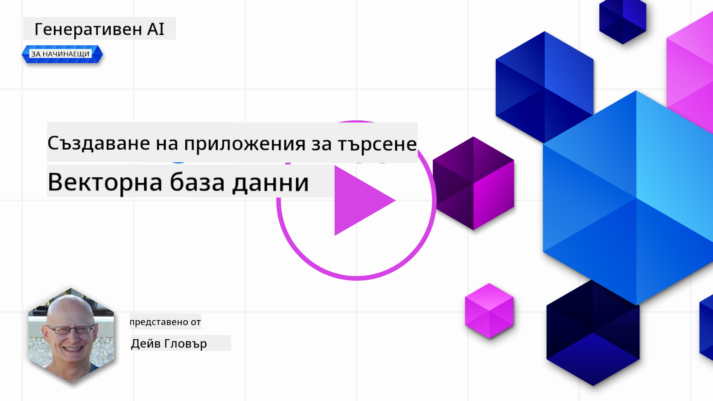
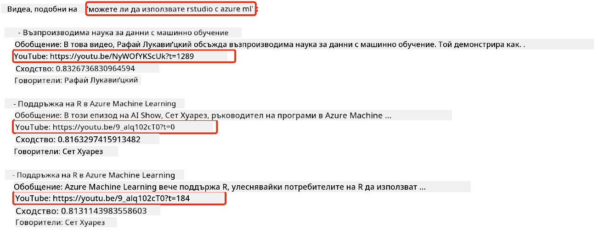
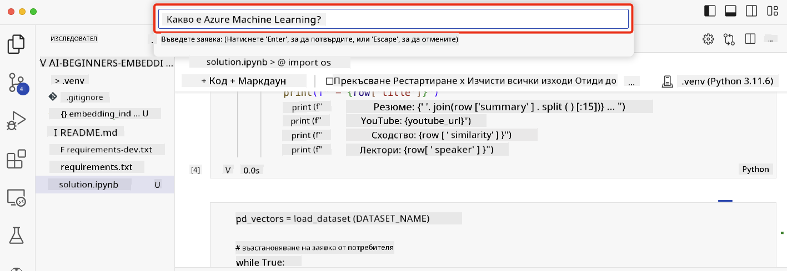

<!--
CO_OP_TRANSLATOR_METADATA:
{
  "original_hash": "d46aad0917a1a342d613e2c13d457da5",
  "translation_date": "2025-06-25T16:43:27+00:00",
  "source_file": "08-building-search-applications/README.md",
  "language_code": "bg"
}
-->
# Създаване на Приложения за Търсене

[](https://aka.ms/gen-ai-lesson8-gh?WT.mc_id=academic-105485-koreyst)

> > _Кликнете върху изображението по-горе, за да гледате видеото на този урок_

Големите Езикови Модели (LLMs) предлагат повече от чатботове и генериране на текст. Възможно е също така да се създават приложения за търсене, използвайки Ембединг. Ембедингите са числови представяния на данни, известни още като вектори, и могат да се използват за семантично търсене на данни.

В този урок ще създадете приложение за търсене за нашия образователен стартъп. Нашият стартъп е неправителствена организация, която предоставя безплатно образование на ученици в развиващите се страни. Стартъпът ни разполага с голям брой YouTube видеа, които учениците могат да използват, за да учат за AI. Стартъпът иска да създаде приложение за търсене, което позволява на учениците да търсят YouTube видео, като въведат въпрос.

Например, ученик може да въведе 'Какво представляват Jupyter Notebook?' или 'Какво е Azure ML' и приложението за търсене ще върне списък с YouTube видеа, които са релевантни на въпроса, и още по-добре, приложението за търсене ще върне линк към мястото във видеото, където се намира отговорът на въпроса.

## Въведение

В този урок ще разгледаме:

- Семантично vs Ключово търсене.
- Какво представляват Текстовите Ембединг.
- Създаване на Индекс за Текстови Ембединг.
- Търсене в Индекс за Текстови Ембединг.

## Учебни Цели

След завършване на този урок, ще можете:

- Да разграничите семантичното от ключовото търсене.
- Да обясните какво представляват Текстовите Ембединг.
- Да създадете приложение, използващо Ембединг за търсене на данни.

## Защо да създавате приложение за търсене?

Създаването на приложение за търсене ще ви помогне да разберете как да използвате Ембединг за търсене на данни. Ще научите също как да създадете приложение за търсене, което може да бъде използвано от ученици, за да намират информация бързо.

Урокът включва Индекс за Ембединг на YouTube транскрипции за YouTube канала Microsoft [AI Show](https://www.youtube.com/playlist?list=PLlrxD0HtieHi0mwteKBOfEeOYf0LJU4O1). AI Show е YouTube канал, който ви учи за AI и машинно обучение. Индексът за Ембединг съдържа Ембедингите за всяка от YouTube транскрипциите до октомври 2023. Ще използвате Индекса за Ембединг, за да създадете приложение за търсене за нашия стартъп. Приложението за търсене връща линк към мястото във видеото, където се намира отговорът на въпроса. Това е чудесен начин за учениците да намират необходимата им информация бързо.

Следното е пример за семантично запитване за въпроса 'можете ли да използвате rstudio с azure ml?'. Вижте YouTube URL-а, ще видите, че URL-ът съдържа времеви маркер, който ви отвежда до мястото във видеото, където се намира отговорът на въпроса.



## Какво е семантично търсене?

Сега може би се чудите, какво е семантично търсене? Семантичното търсене е техника за търсене, която използва семантиката, или значението, на думите в запитването, за да върне релевантни резултати.

Ето пример за семантично търсене. Да кажем, че искате да купите кола, може да потърсите 'моята мечтана кола', семантичното търсене разбира, че не говорите за мечта за кола, а по-скоро търсите да купите вашата мечтана кола. Семантичното търсене разбира вашето намерение и връща релевантни резултати. Алтернативата е ключовото търсене, което буквално търси мечти за коли и често връща нерелевантни резултати.

## Какво представляват Текстовите Ембединг?

[Текстовите ембединг](https://en.wikipedia.org/wiki/Word_embedding?WT.mc_id=academic-105485-koreyst) са техника за представяне на текст, използвана в [обработката на естествен език](https://en.wikipedia.org/wiki/Natural_language_processing?WT.mc_id=academic-105485-koreyst). Текстовите ембединг са семантични числови представяния на текст. Ембедингите се използват за представяне на данни по начин, който е лесен за разбиране от машина. Съществуват много модели за създаване на текстови ембединг, в този урок ще се фокусираме върху генериране на ембединг, използвайки модела на OpenAI за ембединг.

Ето пример, представете си следния текст в транскрипция от един от епизодите на YouTube канала AI Show:

```text
Today we are going to learn about Azure Machine Learning.
```

Ще предадем текста на OpenAI Embedding API и той ще върне следния ембединг, състоящ се от 1536 числа, известни още като вектор. Всяко число във вектора представлява различен аспект на текста. За краткост, ето първите 10 числа във вектора.

```python
[-0.006655829958617687, 0.0026128944009542465, 0.008792596869170666, -0.02446001023054123, -0.008540431968867779, 0.022071078419685364, -0.010703742504119873, 0.003311325330287218, -0.011632772162556648, -0.02187200076878071, ...]
```

## Как се създава индексът за ембединг?

Индексът за ембединг за този урок е създаден с поредица от Python скриптове. Ще намерите скриптовете заедно с инструкции в [README](./scripts/README.md?WT.mc_id=academic-105485-koreyst) в папката 'scripts' за този урок. Не е необходимо да изпълнявате тези скриптове, за да завършите урока, тъй като индексът за ембединг е предоставен за вас.

Скриптовете изпълняват следните операции:

1. Транскрипцията за всяко YouTube видео в плейлиста [AI Show](https://www.youtube.com/playlist?list=PLlrxD0HtieHi0mwteKBOfEeOYf0LJU4O1) се изтегля.
2. С помощта на [OpenAI Functions](https://learn.microsoft.com/azure/ai-services/openai/how-to/function-calling?WT.mc_id=academic-105485-koreyst) се прави опит за извличане на името на говорителя от първите 3 минути на YouTube транскрипцията. Името на говорителя за всяко видео се съхранява в индекса за ембединг, наречен `embedding_index_3m.json`.
3. Текстът на транскрипцията след това се разделя на **3-минутни текстови сегменти**. Сегментът включва около 20 думи, припокриващи се от следващия сегмент, за да се гарантира, че ембедингът за сегмента не е прекъснат и да се предостави по-добър контекст за търсене.
4. Всеки текстов сегмент след това се предава на OpenAI Chat API, за да обобщи текста в 60 думи. Обобщението също се съхранява в индекса за ембединг `embedding_index_3m.json`.
5. Накрая, текстът на сегмента се предава на OpenAI Embedding API. Embedding API връща вектор от 1536 числа, които представляват семантичното значение на сегмента. Сегментът заедно с вектора на OpenAI ембединг се съхранява в индекс за ембединг `embedding_index_3m.json`.

### Векторни Бази Данни

За опростяване на урока индексът за ембединг се съхранява в JSON файл, наречен `embedding_index_3m.json` и се зарежда в Pandas DataFrame. Въпреки това, в продукция, индексът за ембединг би се съхранявал във векторна база данни като [Azure Cognitive Search](https://learn.microsoft.com/training/modules/improve-search-results-vector-search?WT.mc_id=academic-105485-koreyst), [Redis](https://cookbook.openai.com/examples/vector_databases/redis/readme?WT.mc_id=academic-105485-koreyst), [Pinecone](https://cookbook.openai.com/examples/vector_databases/pinecone/readme?WT.mc_id=academic-105485-koreyst), [Weaviate](https://cookbook.openai.com/examples/vector_databases/weaviate/readme?WT.mc_id=academic-105485-koreyst), за да споменем само няколко.

## Разбиране на косинусова подобност

Научихме за текстовите ембединг, следващата стъпка е да научим как да използваме текстовите ембединг за търсене на данни и по-специално как да намерим най-подобните ембединг към дадено запитване, използвайки косинусова подобност.

### Какво е косинусова подобност?

Косинусовата подобност е мярка за подобност между два вектора, ще чуете също, че се нарича `nearest neighbor search`. За да извършите търсене с косинусова подобност, трябва да _векторизирате_ текста на _запитването_ с помощта на OpenAI Embedding API. След това изчислете _косинусовата подобност_ между вектора на запитването и всеки вектор в индекса за ембединг. Запомнете, индексът за ембединг има вектор за всеки текстов сегмент на YouTube транскрипция. Накрая, сортирайте резултатите по косинусова подобност и текстовите сегменти с най-висока косинусова подобност са най-подобни на запитването.

От математическа гледна точка, косинусовата подобност измерва косинуса на ъгъла между два вектора, проектирани в многомерно пространство. Това измерване е полезно, защото ако два документа са далеч един от друг по евклидово разстояние поради размер, те все още могат да имат по-малък ъгъл между тях и следователно по-висока косинусова подобност. За повече информация относно уравненията за косинусова подобност, вижте [Косинусова подобност](https://en.wikipedia.org/wiki/Cosine_similarity?WT.mc_id=academic-105485-koreyst).

## Създаване на вашето първо приложение за търсене

След това ще научим как да създадем приложение за търсене, използвайки ембединг. Приложението за търсене ще позволи на учениците да търсят видео, като въведат въпрос. Приложението за търсене ще върне списък с видеа, които са релевантни на въпроса. Приложението за търсене ще върне също така линк към мястото във видеото, където се намира отговорът на въпроса.

Това решение беше създадено и тествано на Windows 11, macOS и Ubuntu 22.04, използвайки Python 3.10 или по-нова версия. Можете да изтеглите Python от [python.org](https://www.python.org/downloads/?WT.mc_id=academic-105485-koreyst).

## Задание - създаване на приложение за търсене, за да се помогне на учениците

Представихме нашия стартъп в началото на този урок. Сега е време да помогнем на учениците да създадат приложение за търсене за техните оценки.

В това задание ще създадете Azure OpenAI Services, които ще бъдат използвани за създаване на приложението за търсене. Ще създадете следните Azure OpenAI Services. Ще ви трябва Azure абонамент, за да завършите това задание.

### Стартиране на Azure Cloud Shell

1. Влезте в [Azure портала](https://portal.azure.com/?WT.mc_id=academic-105485-koreyst).
2. Изберете иконата на Cloud Shell в горния десен ъгъл на Azure портала.
3. Изберете **Bash** за типа на средата.

#### Създаване на ресурсна група

> За тези инструкции използваме ресурсна група, наречена "semantic-video-search" в East US.
> Можете да промените името на ресурсната група, но при промяна на местоположението за ресурсите,
> проверете [таблицата за наличност на модели](https://aka.ms/oai/models?WT.mc_id=academic-105485-koreyst).

```shell
az group create --name semantic-video-search --location eastus
```

#### Създаване на ресурс за Azure OpenAI Service

От Azure Cloud Shell, изпълнете следната команда, за да създадете ресурс за Azure OpenAI Service.

```shell
az cognitiveservices account create --name semantic-video-openai --resource-group semantic-video-search \
    --location eastus --kind OpenAI --sku s0
```

#### Получаване на крайна точка и ключове за използване в това приложение

От Azure Cloud Shell, изпълнете следните команди, за да получите крайна точка и ключове за ресурса на Azure OpenAI Service.

```shell
az cognitiveservices account show --name semantic-video-openai \
   --resource-group  semantic-video-search | jq -r .properties.endpoint
az cognitiveservices account keys list --name semantic-video-openai \
   --resource-group semantic-video-search | jq -r .key1
```

#### Деплойване на модела за OpenAI Embedding

От Azure Cloud Shell, изпълнете следната команда, за да деплойнете модела за OpenAI Embedding.

```shell
az cognitiveservices account deployment create \
    --name semantic-video-openai \
    --resource-group  semantic-video-search \
    --deployment-name text-embedding-ada-002 \
    --model-name text-embedding-ada-002 \
    --model-version "2"  \
    --model-format OpenAI \
    --sku-capacity 100 --sku-name "Standard"
```

## Решение

Отворете [решението в notebook](../../../08-building-search-applications/python/aoai-solution.ipynb) в GitHub Codespaces и следвайте инструкциите в Jupyter Notebook.

Когато изпълните notebook-а, ще бъдете подканени да въведете запитване. Полето за въвеждане ще изглежда така:



## Отлична работа! Продължете своето обучение

След завършване на този урок, разгледайте нашата [колекция за обучение по Генеративен AI](https://aka.ms/genai-collection?WT.mc_id=academic-105485-koreyst), за да продължите да развивате своите знания по Генеративен AI!

Отидете на Урок 9, където ще разгледаме как да [създавате приложения за генериране на изображения](../09-building-image-applications/README.md?WT.mc_id=academic-105485-koreyst)!

**Отказ от отговорност**:  
Този документ е преведен с помощта на AI услуга за превод [Co-op Translator](https://github.com/Azure/co-op-translator). Докато се стремим към точност, моля, имайте предвид, че автоматизираните преводи може да съдържат грешки или неточности. Оригиналният документ на неговия роден език трябва да се счита за авторитетен източник. За критична информация се препоръчва професионален човешки превод. Не носим отговорност за никакви недоразумения или погрешни тълкувания, произтичащи от използването на този превод.