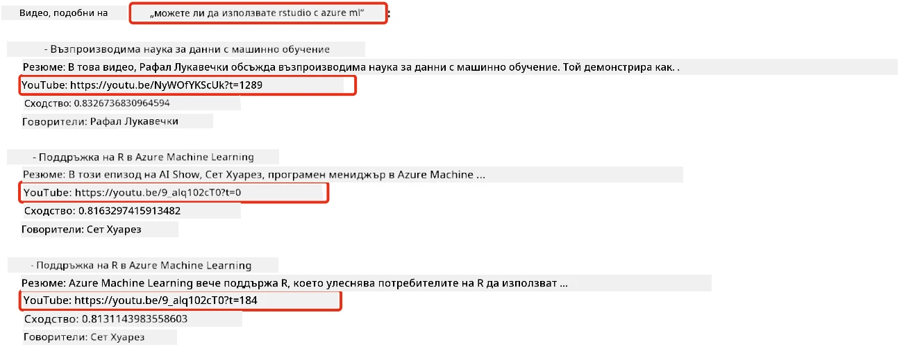
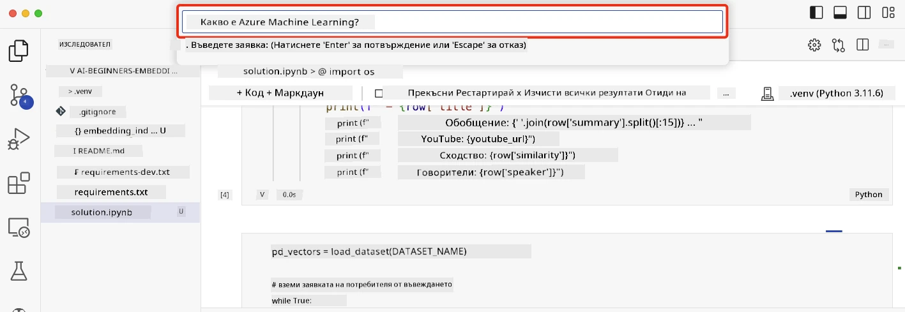

# Създаване на търсещи приложения

[](https://youtu.be/W0-nzXjOjr0?si=GcsqiTTvd7RKbo7V)

> > _Кликнете върху горната снимка, за да гледате видеото на този урок_

Големите езикови модели не са само чатботове и генериране на текст. Възможно е също така да се създават търсещи приложения с помощта на Вграждания. Вгражданията са числови представяния на данни, известни още като вектори, и могат да се използват за семантично търсене на данни.

В този урок ще създадете търсещо приложение за нашия образователен стартъп. Нашият стартъп е неправителствена организация, която предоставя безплатно образование на студенти в развиващите се страни. Имаме голямо количество видеоклипове в YouTube, които студентите могат да използват, за да учат за AI. Нашият стартъп иска да изгради търсещо приложение, което позволява на студентите да търсят видеоклип в YouTube, като въвеждат въпрос.

Например, студент може да напише „Какво са Jupyter Notebooks?“ или „Какво е Azure ML“ и търсещото приложение ще върне списък с видеоклипове в YouTube, релевантни на въпроса, а още по-добре – търсещото приложение ще върне линк към мястото във видеото, където се намира отговорът на въпроса.

## Въведение

В този урок ще разгледаме:

- Семантично срещу търсене по ключова дума.
- Какво са текстовите вграждания.
- Създаване на индекс на текстови вграждания.
- Търсене в индекс на текстови вграждания.

## Образователни цели

След завършване на този урок ще можете да:

- Различавате семантичното от търсенето по ключова дума.
- Обяснявате какво са текстовите вграждания.
- Създавате приложение, използващо вграждания за търсене на данни.

## Защо да създадем търсещо приложение?

Създаването на търсещо приложение ще ви помогне да разберете как да използвате вграждания за търсене на данни. Ще научите и как да изградите търсещо приложение, което студентите да използват, за да намират информация бързо.

Урокът включва индекс на вграждания на транскрипции на видеоклипове в YouTube от канала Microsoft [AI Show](https://www.youtube.com/playlist?list=PLlrxD0HtieHi0mwteKBOfEeOYf0LJU4O1). AI Show е YouTube канал, който ви учи за AI и машинно обучение. Индексът на вгражданията съдържа вгражданията за всяка от транскрипциите на видеоклиповете до октомври 2023 г. Ще използвате този индекс, за да създадете търсещо приложение за нашия стартъп. Приложението връща линк към мястото във видеото, където е отговорът на въпроса. Това е отличен начин студентите бързо да намерят необходимата им информация.

Следва пример за семантичен заявка за въпроса „може ли да използвате rstudio с azure ml?“. Вижте URL адреса на YouTube – ще видите, че включва отметка за време, която ви отвежда до мястото във видеото, където е отговорът.



## Какво е семантично търсене?

Може би се чудите какво е семантичното търсене? Семантичното търсене е техника за търсене, която използва семантиката, или значението на думите в заявката, за да върне релевантни резултати.

Ето един пример за семантично търсене. Да кажем, че търсите да купите кола, може да напишете „мечтаната ми кола“, семантичното търсене разбира, че не `мечтаете` за кола, а че търсите да закупите своята `идеална` кола. Семантичното търсене разбира намерението ви и връща релевантни резултати. Алтернативата е `търсене по ключова дума`, което буквално ще търси мечти за коли и често връща нерелевантни резултати.

## Какво са текстовите вграждания?

[Текстовите вграждания](https://en.wikipedia.org/wiki/Word_embedding?WT.mc_id=academic-105485-koreyst) са техника за представяне на текст, използвана в [обработката на естествен език](https://en.wikipedia.org/wiki/Natural_language_processing?WT.mc_id=academic-105485-koreyst). Текстовите вграждания са семантични числови представяния на текст. Те се използват за представяне на данни по начин, лесен за разчитане от машина. Съществуват много модели за създаване на текстови вграждания, в този урок ще се фокусираме върху генерирането им с помощта на OpenAI Embedding Model.

Ето един пример, представете си следния текст от транскрипция на един от епизодите на AI Show канала в YouTube:

```text
Today we are going to learn about Azure Machine Learning.
```

Ще подадем текста към OpenAI Embedding API и той ще върне следното вграждане, състоящо се от 1536 числа, известни още като вектор. Всяко число във вектора представлява различен аспект от текста. За краткост, ето първите 10 числа във вектора.

```python
[-0.006655829958617687, 0.0026128944009542465, 0.008792596869170666, -0.02446001023054123, -0.008540431968867779, 0.022071078419685364, -0.010703742504119873, 0.003311325330287218, -0.011632772162556648, -0.02187200076878071, ...]
```

## Как се създава индексът на вгражданията?

Индексът на вгражданията за този урок е създаден с поредица от Python скриптове. Ще намерите скриптовете заедно с инструкции в [README](./scripts/README.md?WT.mc_id=academic-105485-koreyst) в папката 'scripts' за този урок. Не е нужно да изпълнявате тези скриптове, за да завършите урока, тъй като индексът на вгражданията е предоставен за вас.

Скриптовете извършват следните операции:

1. Изтегля се транскрипцията за всеки видеоклип в плейлиста [AI Show](https://www.youtube.com/playlist?list=PLlrxD0HtieHi0mwteKBOfEeOYf0LJU4O1).
2. С помощта на [OpenAI функциите](https://learn.microsoft.com/azure/ai-foundry/openai/how-to/function-calling?WT.mc_id=academic-105485-koreyst) се прави опит да се извлече името на говорещия от първите 3 минути на транскрипцията. Името на говорещия за всеки видеоклип се съхранява в индекса `embedding_index_3m.json`.
3. След това текстът на транскрипцията се разделя на **текстови сегменти по 3 минути**. В сегмента има около 20 думи припокриване от следващия сегмент, за да се гарантира, че вграждането на сегмента не се прекъсва и за да се предостави по-добър контекст при търсене.
4. Всеки текстов сегмент се подава на OpenAI Chat API за обобщаване на текста в 60 думи. Обобщението също се съхранява в индекса `embedding_index_3m.json`.
5. Накрая текстът на сегмента се подава на OpenAI Embedding API. API-то връща вектор от 1536 числа, който представлява семантичното значение на сегмента. Сегментът заедно с вектора се съхраняват в индекса `embedding_index_3m.json`.

### Векторни бази данни

За по-простота на урока, индексът на вгражданията се съхранява в JSON файл с име `embedding_index_3m.json` и се зарежда в Pandas DataFrame. В продукционна среда обаче, индексът би бил съхраняван във векторна база данни като [Azure Cognitive Search](https://learn.microsoft.com/training/modules/improve-search-results-vector-search?WT.mc_id=academic-105485-koreyst), [Redis](https://cookbook.openai.com/examples/vector_databases/redis/readme?WT.mc_id=academic-105485-koreyst), [Pinecone](https://cookbook.openai.com/examples/vector_databases/pinecone/readme?WT.mc_id=academic-105485-koreyst), [Weaviate](https://cookbook.openai.com/examples/vector_databases/weaviate/readme?WT.mc_id=academic-105485-koreyst) и други.

## Разбиране на косинусното сходство

Научихме за текстовите вграждания, следващата стъпка е да се научим как да ги използваме за търсене на данни, и по-специално как да намираме най-подобните вграждания на дадена заявка чрез косинусно сходство.

### Какво е косинусно сходство?

Косинусното сходство е мярка за сходство между два вектора, често наричано и `търсене на най-близкия съсед`. За да изпълните търсене по косинусно сходство, трябва да _векторизирате_ текста на _заявката_ с помощта на OpenAI Embedding API. След това изчислявате _косинусното сходство_ между вектора на заявката и всеки вектор в индекса на вгражданията. Запомнете, индексът съдържа вектор за всеки текстов сегмент на транскрипцията. Накрая сортирате резултатите по косинусно сходство и текстовите сегменти с най-висока стойност са най-близките до заявката.

От математическа гледна точка, косинусното сходство измерва косинуса на ъгъла между два вектора, проектирани в многоизмерно пространство. Това измерване е полезно, защото ако два документа са далеч по евклидово разстояние заради размер, те все пак могат да имат по-малък ъгъл между тях и съответно по-високо косинусно сходство. За повече информация относно уравненията на косинусното сходство вижте [Косинусно сходство](https://en.wikipedia.org/wiki/Cosine_similarity?WT.mc_id=academic-105485-koreyst).

## Създаване на вашето първо търсещо приложение

След това ще се научим как да изградим търсещо приложение с помощта на вграждания. То ще позволява на студентите да търсят видео, като въвеждат въпрос. Приложението ще върне списък с видеоклипове, релевантни на въпроса. Освен това ще върне и линк към мястото във видеото, където е отговорът.

Това решение е създадено и тествано под Windows 11, macOS и Ubuntu 22.04, използвайки Python 3.10 или по-нова версия. Можете да изтеглите Python от [python.org](https://www.python.org/downloads/?WT.mc_id=academic-105485-koreyst).

## Задание - създаване на търсещо приложение, за да помогнем на студентите

Представихме нашия стартъп в началото на урока. Сега е време да дадем възможност на студентите да изградят търсещо приложение за своите оценки.

В това задание ще създадете Azure OpenAI услугите, които ще се използват за изграждането на търсещото приложение. Ще създадете следните Azure OpenAI услуги. За да завършите заданието, ще ви трябва Azure абонамент.

### Стартирайте Azure Cloud Shell

1. Влезте в [Azure портала](https://portal.azure.com/?WT.mc_id=academic-105485-koreyst).
2. Изберете иконата Cloud Shell в горния десен ъгъл на портала.
3. Изберете **Bash** като тип на средата.

#### Създайте ресурсна група

> За тези инструкции използваме ресурсната група със име "semantic-video-search" в регион East US.
> Можете да смените името на ресурсната група, но при смяна на локацията,
> проверете [таблицата за наличност на моделите](https://aka.ms/oai/models?WT.mc_id=academic-105485-koreyst).

```shell
az group create --name semantic-video-search --location eastus
```

#### Създайте ресурс на Azure OpenAI услуги

В Azure Cloud Shell изпълнете следната команда, за да създадете ресурс на Azure OpenAI услуги.

```shell
az cognitiveservices account create --name semantic-video-openai --resource-group semantic-video-search \
    --location eastus --kind OpenAI --sku s0
```

#### Вземете endpoint и ключове за използване в това приложение

В Azure Cloud Shell изпълнете следните команди, за да получите endpoint и ключове за ресурса Azure OpenAI услуги.

```shell
az cognitiveservices account show --name semantic-video-openai \
   --resource-group  semantic-video-search | jq -r .properties.endpoint
az cognitiveservices account keys list --name semantic-video-openai \
   --resource-group semantic-video-search | jq -r .key1
```

#### Разположете OpenAI Embedding модела

В Azure Cloud Shell стартирайте следната команда, за да разположите OpenAI Embedding модела.

```shell
az cognitiveservices account deployment create \
    --name semantic-video-openai \
    --resource-group  semantic-video-search \
    --deployment-name text-embedding-ada-002 \
    --model-name text-embedding-ada-002 \
    --model-version "2"  \
    --model-format OpenAI \
    --sku-capacity 100 --sku-name "Standard"
```

## Решение

Отворете [решението в notebook](./python/aoai-solution.ipynb?WT.mc_id=academic-105485-koreyst) в GitHub Codespaces и следвайте инструкциите в Jupyter Notebook.

Когато стартирате notebook-а, ще бъдете подканени да въведете заявка. Полето за въвеждане ще изглежда така:



## Отлична работа! Продължете с обучението си

След като завършите урока, разгледайте нашата [колекция за обучение по Генеративен AI](https://aka.ms/genai-collection?WT.mc_id=academic-105485-koreyst) за да продължите да развивате знанията си в Генеративния AI!

Продължете към Урок 9, където ще разгледаме как да [създадем приложения за генериране на изображения](../09-building-image-applications/README.md?WT.mc_id=academic-105485-koreyst)!

---

<!-- CO-OP TRANSLATOR DISCLAIMER START -->
**Отказ от отговорност**:
Този документ е преведен с помощта на AI преводачески услуга [Co-op Translator](https://github.com/Azure/co-op-translator). Въпреки че се стремим към точност, моля имайте предвид, че автоматизираните преводи могат да съдържат грешки или неточности. Оригиналният документ на неговия роден език трябва да се счита за авторитетен източник. За критична информация се препоръчва професионален човешки превод. Ние не носим отговорност за каквито и да е недоразумения или неправилни тълкувания, произтичащи от използването на този превод.
<!-- CO-OP TRANSLATOR DISCLAIMER END -->