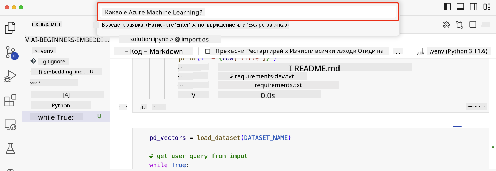

<!--
CO_OP_TRANSLATOR_METADATA:
{
  "original_hash": "d46aad0917a1a342d613e2c13d457da5",
  "translation_date": "2025-07-09T13:02:39+00:00",
  "source_file": "08-building-search-applications/README.md",
  "language_code": "bg"
}
-->
# Създаване на търсещи приложения

[](https://aka.ms/gen-ai-lesson8-gh?WT.mc_id=academic-105485-koreyst)

> > _Кликнете върху изображението по-горе, за да гледате видеото на този урок_

Големите езикови модели не са само за чатботове и генериране на текст. Също така е възможно да се създават търсещи приложения, използвайки Embeddings. Embeddings са числови представяния на данни, известни още като вектори, и могат да се използват за семантично търсене на информация.

В този урок ще създадете търсещо приложение за нашия образователен стартъп. Нашият стартъп е неправителствена организация, която предоставя безплатно образование на студенти в развиващите се страни. Имаме голям брой видеа в YouTube, които студентите могат да използват, за да научат повече за AI. Нашият стартъп иска да създаде търсещо приложение, което позволява на студентите да търсят YouTube видео, като напишат въпрос.

Например, студент може да напише „Какво са Jupyter Notebooks?“ или „Какво е Azure ML“ и търсещото приложение ще върне списък с YouTube видеа, които са релевантни на въпроса, а още по-добре – приложението ще върне и линк към мястото във видеото, където се намира отговорът.

## Въведение

В този урок ще разгледаме:

- Семантично срещу ключово търсене.
- Какво са текстови Embeddings.
- Създаване на индекс с текстови Embeddings.
- Търсене в индекс с текстови Embeddings.

## Цели на обучението

След завършване на този урок ще можете да:

- Различавате семантичното от ключовото търсене.
- Обясните какво представляват текстовите Embeddings.
- Създадете приложение, използващо Embeddings за търсене на данни.

## Защо да създадем търсещо приложение?

Създаването на търсещо приложение ще ви помогне да разберете как да използвате Embeddings за търсене на данни. Също така ще научите как да изградите приложение, което студентите могат да използват, за да намират информация бързо.

Урокът включва индекс с Embeddings на транскрипти от YouTube видеа на канала Microsoft [AI Show](https://www.youtube.com/playlist?list=PLlrxD0HtieHi0mwteKBOfEeOYf0LJU4O1). AI Show е YouTube канал, който ви учи за AI и машинно обучение. Индексът съдържа Embeddings за всеки транскрипт до октомври 2023 г. Ще използвате този индекс, за да създадете търсещо приложение за нашия стартъп. Приложението връща линк към мястото във видеото, където се намира отговорът на въпроса. Това е отличен начин студентите бързо да намерят нужната им информация.

По-долу е пример за семантичен заявка за въпроса „може ли да използвате rstudio с azure ml?“. Обърнете внимание на URL адреса в YouTube – той съдържа времева отметка, която ви отвежда точно до мястото във видеото с отговора.


## Какво е семантично търсене?

Може би се питате какво е семантично търсене? Семантичното търсене е техника, която използва значението на думите в заявката, за да върне релевантни резултати.

Ето един пример за семантично търсене. Да кажем, че търсите да купите кола и напишете „колата на мечтите ми“. Семантичното търсене разбира, че не „мечтаете“ за кола, а търсите вашата „идеална“ кола. То разбира намерението ви и връща релевантни резултати. Алтернативата е „ключово търсене“, което буквално търси за мечти за коли и често връща нерелевантни резултати.

## Какво са текстови Embeddings?

[Текстовите embeddings](https://en.wikipedia.org/wiki/Word_embedding?WT.mc_id=academic-105485-koreyst) са техника за представяне на текст, използвана в [обработката на естествен език](https://en.wikipedia.org/wiki/Natural_language_processing?WT.mc_id=academic-105485-koreyst). Те са семантични числови представяния на текст. Embeddings се използват, за да представят данни по начин, който е лесен за разбиране от машина. Съществуват много модели за създаване на текстови embeddings, в този урок ще се фокусираме върху генерирането им с помощта на OpenAI Embedding Model.

Ето един пример – представете си, че следният текст е част от транскрипт на епизод от AI Show YouTube канала:

```text
Today we are going to learn about Azure Machine Learning.
```

Ще подадем текста към OpenAI Embedding API и той ще върне embedding, състоящ се от 1536 числа, известен още като вектор. Всяко число във вектора представя различен аспект на текста. За краткост, ето първите 10 числа от вектора.

```python
[-0.006655829958617687, 0.0026128944009542465, 0.008792596869170666, -0.02446001023054123, -0.008540431968867779, 0.022071078419685364, -0.010703742504119873, 0.003311325330287218, -0.011632772162556648, -0.02187200076878071, ...]
```

## Как се създава индексът с Embeddings?

Индексът с Embeddings за този урок е създаден с поредица от Python скриптове. Ще ги намерите заедно с инструкции в [README](./scripts/README.md?WT.mc_id=academic-105485-koreyst) в папката 'scripts' за този урок. Не е нужно да изпълнявате тези скриптове, за да завършите урока, тъй като индексът с Embeddings е предоставен.

Скриптовете извършват следните операции:

1. Изтегля се транскриптът за всяко YouTube видео от плейлиста [AI Show](https://www.youtube.com/playlist?list=PLlrxD0HtieHi0mwteKBOfEeOYf0LJU4O1).
2. С помощта на [OpenAI Functions](https://learn.microsoft.com/azure/ai-services/openai/how-to/function-calling?WT.mc_id=academic-105485-koreyst) се опитва да се извлече името на говорещия от първите 3 минути на транскрипта. Името на говорещия за всяко видео се съхранява в индекса `embedding_index_3m.json`.
3. Текстът на транскрипта се разделя на **текстови сегменти от 3 минути**. Във всеки сегмент има около 20 думи припокриване с следващия сегмент, за да се гарантира, че embedding-ът не се прекъсва и да се осигури по-добър контекст за търсене.
4. Всеки сегмент се подава към OpenAI Chat API, който го обобщава до 60 думи. Резюмето също се съхранява в индекса `embedding_index_3m.json`.
5. Накрая текстът на сегмента се подава към OpenAI Embedding API. API-то връща вектор от 1536 числа, които представят семантичното значение на сегмента. Сегментът заедно с embedding вектора се съхраняват в индекса `embedding_index_3m.json`.

### Векторни бази данни

За опростяване на урока, индексът с Embeddings се съхранява в JSON файл с име `embedding_index_3m.json` и се зарежда в Pandas DataFrame. В продукционна среда обаче индексът би се съхранявал във векторна база данни като [Azure Cognitive Search](https://learn.microsoft.com/training/modules/improve-search-results-vector-search?WT.mc_id=academic-105485-koreyst), [Redis](https://cookbook.openai.com/examples/vector_databases/redis/readme?WT.mc_id=academic-105485-koreyst), [Pinecone](https://cookbook.openai.com/examples/vector_databases/pinecone/readme?WT.mc_id=academic-105485-koreyst), [Weaviate](https://cookbook.openai.com/examples/vector_databases/weaviate/readme?WT.mc_id=academic-105485-koreyst) и други.

## Разбиране на косинусова прилика

Научихме за текстовите embeddings, следващата стъпка е да разберем как да ги използваме за търсене на данни и по-специално как да намерим най-близките embeddings до дадена заявка, използвайки косинусова прилика.

### Какво е косинусова прилика?

Косинусовата прилика измерва сходството между два вектора, често наричано и „търсене на най-близък съсед“. За да извършите търсене по косинусова прилика, трябва да _векторизирате_ текста на _заявката_ с помощта на OpenAI Embedding API. След това изчислявате _косинусовата прилика_ между векторa на заявката и всеки вектор в индекса с Embeddings. Помнете, че индексът съдържа вектор за всеки текстов сегмент от транскрипта на YouTube. Накрая сортирате резултатите по косинусова прилика и текстовите сегменти с най-висока стойност са най-близки до заявката.

От математическа гледна точка, косинусовата прилика измерва косинуса на ъгъла между два вектора, проектирани в многомерно пространство. Това измерване е полезно, защото ако два документа са далеч един от друг по Евклидово разстояние заради размера си, те все пак могат да имат по-малък ъгъл помежду си и съответно по-висока косинусова прилика. За повече информация вижте [Cosine similarity](https://en.wikipedia.org/wiki/Cosine_similarity?WT.mc_id=academic-105485-koreyst).

## Създаване на първото ви търсещо приложение

Следващата стъпка е да научим как да създадем търсещо приложение, използвайки Embeddings. Приложението ще позволи на студентите да търсят видео, като напишат въпрос. То ще върне списък с видеа, релевантни на въпроса, както и линк към мястото във видеото, където се намира отговорът.

Това решение е разработено и тествано на Windows 11, macOS и Ubuntu 22.04 с Python 3.10 или по-нова версия. Можете да изтеглите Python от [python.org](https://www.python.org/downloads/?WT.mc_id=academic-105485-koreyst).

## Задача – създаване на търсещо приложение за студентите

В началото на урока представихме нашия стартъп. Сега е време да дадем възможност на студентите да създадат търсещо приложение за своите оценки.

В тази задача ще създадете Azure OpenAI услуги, които ще се използват за изграждане на търсещото приложение. Ще създадете следните Azure OpenAI услуги. За да завършите задачата, ще ви е необходим абонамент за Azure.

### Стартиране на Azure Cloud Shell

1. Влезте в [Azure портала](https://portal.azure.com/?WT.mc_id=academic-105485-koreyst).
2. Изберете иконата Cloud Shell в горния десен ъгъл на портала.
3. Изберете **Bash** като тип на средата.

#### Създаване на ресурсна група

> За тези инструкции използваме ресурсна група с име "semantic-video-search" в регион East US.
> Можете да промените името на ресурсната група, но при смяна на локацията,
> проверете [таблицата за наличност на модели](https://aka.ms/oai/models?WT.mc_id=academic-105485-koreyst).

```shell
az group create --name semantic-video-search --location eastus
```

#### Създаване на ресурс за Azure OpenAI Service

От Azure Cloud Shell изпълнете следната команда, за да създадете ресурс за Azure OpenAI Service.

```shell
az cognitiveservices account create --name semantic-video-openai --resource-group semantic-video-search \
    --location eastus --kind OpenAI --sku s0
```

#### Вземане на endpoint и ключове за използване в приложението

От Azure Cloud Shell изпълнете следните команди, за да получите endpoint и ключове за ресурса Azure OpenAI Service.

```shell
az cognitiveservices account show --name semantic-video-openai \
   --resource-group  semantic-video-search | jq -r .properties.endpoint
az cognitiveservices account keys list --name semantic-video-openai \
   --resource-group semantic-video-search | jq -r .key1
```

#### Деплойване на OpenAI Embedding модела

От Azure Cloud Shell изпълнете следната команда, за да деплойнете OpenAI Embedding модела.

```shell
az cognitiveservices account deployment create \
    --name semantic-video-openai \
    --resource-group  semantic-video-search \
    --deployment-name text-embedding-ada-002 \
    --model-name text-embedding-ada-002 \
    --model-version "2"  \
    --model-format OpenAI \
    --sku-capacity 100 --sku-name "Standard"
```

## Решение

Отворете [решението в notebook](../../../08-building-search-applications/python/aoai-solution.ipynb) в GitHub Codespaces и следвайте инструкциите в Jupyter Notebook.

Когато стартирате notebook-а, ще бъдете подканени да въведете заявка. Полето за въвеждане ще изглежда така:



## Отлична работа! Продължете да учите

След като завършите този урок, разгледайте нашата [колекция за обучение по генеративен AI](https://aka.ms/genai-collection?WT.mc_id=academic-105485-koreyst), за да продължите да развивате знанията си в областта на генеративния AI!

Преминете към урок 9, където ще разгледаме как да [създаваме приложения за генериране на изображения](../09-building-image-applications/README.md?WT.mc_id=academic-105485-koreyst)!

**Отказ от отговорност**:  
Този документ е преведен с помощта на AI преводаческа услуга [Co-op Translator](https://github.com/Azure/co-op-translator). Въпреки че се стремим към точност, моля, имайте предвид, че автоматизираните преводи могат да съдържат грешки или неточности. Оригиналният документ на неговия роден език трябва да се счита за авторитетен източник. За критична информация се препоръчва професионален човешки превод. Ние не носим отговорност за каквито и да е недоразумения или неправилни тълкувания, произтичащи от използването на този превод.