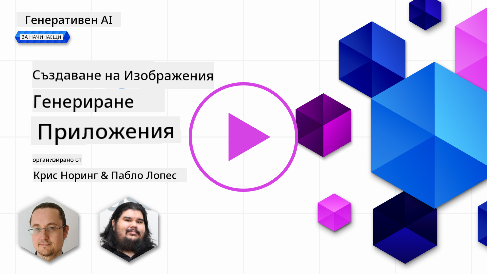

<!--
CO_OP_TRANSLATOR_METADATA:
{
  "original_hash": "ef74ad58fc01f7ad80788f79505f9816",
  "translation_date": "2025-08-26T19:26:58+00:00",
  "source_file": "09-building-image-applications/README.md",
  "language_code": "bg"
}
-->
# Създаване на приложения за генериране на изображения

[](https://aka.ms/gen-ai-lesson9-gh?WT.mc_id=academic-105485-koreyst)

Генерирането на текст не е единственото, което могат LLM моделите. Възможно е също така да се създават изображения по текстови описания. Изображенията като модалност са изключително полезни в различни сфери – от медицински технологии, архитектура, туризъм, разработка на игри и други. В тази глава ще разгледаме двата най-популярни модела за генериране на изображения – DALL-E и Midjourney.

## Въведение

В този урок ще разгледаме:

- Генериране на изображения и защо е полезно.
- DALL-E и Midjourney – какво представляват и как работят.
- Как да създадете приложение за генериране на изображения.

## Учебни цели

След като завършите този урок, ще можете да:

- Създавате приложение за генериране на изображения.
- Определяте граници за вашето приложение с помощта на метаподкани.
- Работите с DALL-E и Midjourney.

## Защо да създадем приложение за генериране на изображения?

Приложенията за генериране на изображения са чудесен начин да изследвате възможностите на генеративния изкуствен интелект. Те могат да се използват например за:

- **Редактиране и синтез на изображения**. Можете да създавате изображения за различни случаи на употреба, като редактиране и синтез на изображения.

- **Приложение в различни индустрии**. Могат да се използват за създаване на изображения за различни индустрии като медицински технологии, туризъм, разработка на игри и други.

## Сценарий: Edu4All

В този урок ще продължим да работим със стартиращата ни компания Edu4All. Учениците ще създават изображения за своите задачи – какви точно ще са изображенията зависи от тях, но може да са илюстрации към собствена приказка, нов герой за историята им или помощ за визуализиране на идеи и концепции.

Ето какво биха могли да генерират учениците на Edu4All, ако работят в час за паметници:


с помощта на подкана като

> "Куче до Айфеловата кула на сутрешна слънчева светлина"

## Какво са DALL-E и Midjourney?

[DALL-E](https://openai.com/dall-e-2?WT.mc_id=academic-105485-koreyst) и [Midjourney](https://www.midjourney.com/?WT.mc_id=academic-105485-koreyst) са два от най-популярните модела за генериране на изображения, които ви позволяват да използвате подкани за създаване на изображения.

### DALL-E

Да започнем с DALL-E – това е генеративен AI модел, който създава изображения по текстови описания.

> [DALL-E е комбинация от два модела – CLIP и diffused attention](https://towardsdatascience.com/openais-dall-e-and-clip-101-a-brief-introduction-3a4367280d4e?WT.mc_id=academic-105485-koreyst).

- **CLIP** е модел, който създава ембединг (числови представяния на данни) от изображения и текст.

- **Diffused attention** е модел, който създава изображения от ембединг. DALL-E е обучен върху набор от изображения и текст и може да се използва за създаване на изображения по текстови описания. Например, DALL-E може да генерира изображение на котка с шапка или куче с ирокез.

### Midjourney

Midjourney работи по подобен начин на DALL-E – генерира изображения по текстови подкани. Midjourney също може да се използва за създаване на изображения с подкани като „котка с шапка“ или „куче с ирокез“.


_Източник: Wikipedia, изображение, генерирано от Midjourney_

## Как работят DALL-E и Midjourney

Първо, [DALL-E](https://arxiv.org/pdf/2102.12092.pdf?WT.mc_id=academic-105485-koreyst). DALL-E е генеративен AI модел, базиран на трансформър архитектура с _авторегресивен трансформър_.

_Авторегресивният трансформър_ определя как моделът създава изображения по текстови описания – генерира по един пиксел наведнъж, като използва вече създадените пиксели, за да създаде следващия. Това преминава през няколко слоя на невронна мрежа, докато изображението стане завършено.

Чрез този процес DALL-E контролира атрибути, обекти, характеристики и други в изображението, което създава. DALL-E 2 и 3 обаче дават още по-голям контрол върху генерираното изображение.

## Създаване на първото ви приложение за генериране на изображения

Какво ви е нужно, за да създадете приложение за генериране на изображения? Трябват ви следните библиотеки:

- **python-dotenv** – силно препоръчително е да използвате тази библиотека, за да пазите тайните си в _.env_ файл, отделно от кода.
- **openai** – тази библиотека ще използвате, за да работите с OpenAI API.
- **pillow** – за работа с изображения в Python.
- **requests** – за изпращане на HTTP заявки.

## Създаване и разполагане на Azure OpenAI модел

Ако все още не сте го направили, следвайте инструкциите на страницата [Microsoft Learn](https://learn.microsoft.com/azure/ai-foundry/openai/how-to/create-resource?pivots=web-portal),
за да създадете Azure OpenAI ресурс и модел. Изберете DALL-E 3 като модел.

## Създаване на приложението

1. Създайте файл _.env_ със следното съдържание:

   ```text
   AZURE_OPENAI_ENDPOINT=<your endpoint>
   AZURE_OPENAI_API_KEY=<your key>
   AZURE_OPENAI_DEPLOYMENT="dall-e-3"
   ```

   Намерете тази информация в Azure OpenAI Foundry Portal за вашия ресурс в секцията "Deployments".

1. Съберете горните библиотеки във файл _requirements.txt_ по следния начин:

   ```text
   python-dotenv
   openai
   pillow
   requests
   ```

1. След това създайте виртуална среда и инсталирайте библиотеките:

   ```bash
   python3 -m venv venv
   source venv/bin/activate
   pip install -r requirements.txt
   ```

   За Windows използвайте следните команди, за да създадете и активирате виртуалната среда:

   ```bash
   python3 -m venv venv
   venv\Scripts\activate.bat
   ```

1. Добавете следния код във файл с име _app.py_:

    ```python
    import openai
    import os
    import requests
    from PIL import Image
    import dotenv
    from openai import OpenAI, AzureOpenAI
    
    # import dotenv
    dotenv.load_dotenv()
    
    # configure Azure OpenAI service client 
    client = AzureOpenAI(
      azure_endpoint = os.environ["AZURE_OPENAI_ENDPOINT"],
      api_key=os.environ['AZURE_OPENAI_API_KEY'],
      api_version = "2024-02-01"
      )
    try:
        # Create an image by using the image generation API
        generation_response = client.images.generate(
                                prompt='Bunny on horse, holding a lollipop, on a foggy meadow where it grows daffodils',
                                size='1024x1024', n=1,
                                model=os.environ['AZURE_OPENAI_DEPLOYMENT']
                              )

        # Set the directory for the stored image
        image_dir = os.path.join(os.curdir, 'images')

        # If the directory doesn't exist, create it
        if not os.path.isdir(image_dir):
            os.mkdir(image_dir)

        # Initialize the image path (note the filetype should be png)
        image_path = os.path.join(image_dir, 'generated-image.png')

        # Retrieve the generated image
        image_url = generation_response.data[0].url  # extract image URL from response
        generated_image = requests.get(image_url).content  # download the image
        with open(image_path, "wb") as image_file:
            image_file.write(generated_image)

        # Display the image in the default image viewer
        image = Image.open(image_path)
        image.show()

    # catch exceptions
    except openai.InvalidRequestError as err:
        print(err)
   ```

Нека обясним този код:

- Първо импортираме нужните библиотеки, включително OpenAI, dotenv, requests и Pillow.

  ```python
  import openai
  import os
  import requests
  from PIL import Image
  import dotenv
  ```

- След това зареждаме променливите на средата от файла _.env_.

  ```python
  # import dotenv
  dotenv.load_dotenv()
  ```

- След това конфигурираме клиента за Azure OpenAI услугата

  ```python
  # Get endpoint and key from environment variables
  client = AzureOpenAI(
      azure_endpoint = os.environ["AZURE_OPENAI_ENDPOINT"],
      api_key=os.environ['AZURE_OPENAI_API_KEY'],
      api_version = "2024-02-01"
      )
  ```

- След това генерираме изображението:

  ```python
  # Create an image by using the image generation API
  generation_response = client.images.generate(
                        prompt='Bunny on horse, holding a lollipop, on a foggy meadow where it grows daffodils',
                        size='1024x1024', n=1,
                        model=os.environ['AZURE_OPENAI_DEPLOYMENT']
                      )
  ```

  Горният код връща JSON обект, който съдържа URL на генерираното изображение. Можем да използваме този URL, за да изтеглим изображението и да го запишем във файл.

- Накрая отваряме изображението и използваме стандартния image viewer, за да го покажем:

  ```python
  image = Image.open(image_path)
  image.show()
  ```

### Повече подробности за генерирането на изображението

Нека разгледаме кода, който генерира изображението, по-подробно:

    ```python
      generation_response = client.images.generate(
                                prompt='Bunny on horse, holding a lollipop, on a foggy meadow where it grows daffodils',
                                size='1024x1024', n=1,
                                model=os.environ['AZURE_OPENAI_DEPLOYMENT']
                            )
    ```

- **prompt** – това е текстовата подкана, която се използва за генериране на изображението. В случая използваме подкана "Зайче на кон, държи близалка, в мъглива поляна с нарциси".
- **size** – размерът на генерираното изображение. В случая генерираме изображение с размер 1024x1024 пиксела.
- **n** – броят на генерираните изображения. В случая генерираме две изображения.
- **temperature** – параметър, който контролира случайността на изхода на генеративния AI модел. Стойността е между 0 и 1, като 0 означава детерминиран изход, а 1 – напълно случаен. Стойността по подразбиране е 0.7.

Има още неща, които можете да правите с изображенията, които ще разгледаме в следващата секция.

## Допълнителни възможности за работа с изображения

Видяхте как с няколко реда Python може да се генерира изображение. Но има и още възможности.

Можете също така да:

- **Правите редакции**. Като предоставите съществуващо изображение, маска и подкана, можете да променяте изображението. Например, можете да добавите нещо към определена част от изображението. Представете си нашето зайче – можете да му добавите шапка. Това става като подадете изображението, маска (която определя зоната за промяна) и текстова подкана какво да се направи.
> Note: това не се поддържа в DALL-E 3.

Ето пример с GPT Image:

    ```python
    response = client.images.edit(
        model="gpt-image-1",
        image=open("sunlit_lounge.png", "rb"),
        mask=open("mask.png", "rb"),
        prompt="A sunlit indoor lounge area with a pool containing a flamingo"
    )
    image_url = response.data[0].url
    ```

  Основното изображение съдържа само шезлонга с басейн, но крайното изображение ще има и фламинго:

<div style="display: flex; justify-content: space-between; align-items: center; margin: 20px 0;">
  
  
  
</div>

- **Създавате вариации**. Идеята е да вземете съществуващо изображение и да поискате да се създадат вариации. За да създадете вариация, подавате изображение и текстова подкана и код като този:

  ```python
  response = openai.Image.create_variation(
    image=open("bunny-lollipop.png", "rb"),
    n=1,
    size="1024x1024"
  )
  image_url = response['data'][0]['url']
  ```

  > Note, това се поддържа само в OpenAI

## Temperature

Temperature е параметър, който контролира случайността на изхода на генеративния AI модел. Стойността е между 0 и 1, като 0 означава детерминиран изход, а 1 – напълно случаен. Стойността по подразбиране е 0.7.

Нека видим пример как работи temperature, като пуснем тази подкана два пъти:

> Подкана: "Зайче на кон, държи близалка, в мъглива поляна с нарциси"


Сега нека пуснем същата подкана отново, за да видим, че няма да получим едно и също изображение два пъти:


Както виждате, изображенията са подобни, но не са еднакви. Нека пробваме да сменим стойността на temperature на 0.1 и да видим какво ще стане:

```python
 generation_response = client.images.create(
        prompt='Bunny on horse, holding a lollipop, on a foggy meadow where it grows daffodils',    # Enter your prompt text here
        size='1024x1024',
        n=2
    )
```

### Промяна на temperature

Нека се опитаме да направим отговора по-детерминиран. Можем да забележим, че при двете изображения, които генерирахме, на първото има зайче, а на второто – кон, така че изображенията се различават доста.

Затова ще променим кода и ще зададем temperature на 0, така:

```python
generation_response = client.images.create(
        prompt='Bunny on horse, holding a lollipop, on a foggy meadow where it grows daffodils',    # Enter your prompt text here
        size='1024x1024',
        n=2,
        temperature=0
    )
```

Когато стартирате този код, ще получите тези две изображения:

- 
- 

Тук ясно се вижда, че изображенията си приличат много повече.

## Как да определите граници за вашето приложение с метаподкани

С нашето демо вече можем да генерираме изображения за нашите клиенти. Но трябва да създадем някои граници за приложението.

Например, не искаме да се генерират изображения, които не са подходящи за работа или не са подходящи за деца.

Това може да стане с _метаподкани_. Метаподканите са текстови подкани, които се използват за контрол на изхода на генеративния AI модел. Например, можем да използваме метаподкани, за да гарантираме, че генерираните изображения са подходящи за работа или за деца.

### Как работи това?

Как работят метаподканите?

Метаподканите са текстови подкани, които се използват за контрол на изхода на генеративния AI модел. Те се поставят преди основната текстова подкана и се използват за контрол на изхода на модела, като се вграждат в приложенията, за да управляват резултата. Подканата и метаподканата се обединяват в един текстов низ.

Ето пример за метаподкана:

```text
You are an assistant designer that creates images for children.

The image needs to be safe for work and appropriate for children.

The image needs to be in color.

The image needs to be in landscape orientation.

The image needs to be in a 16:9 aspect ratio.

Do not consider any input from the following that is not safe for work or appropriate for children.

(Input)

```

Сега нека видим как можем да използваме метаподкани в нашето демо.

```python
disallow_list = "swords, violence, blood, gore, nudity, sexual content, adult content, adult themes, adult language, adult humor, adult jokes, adult situations, adult"

meta_prompt =f"""You are an assistant designer that creates images for children.

The image needs to be safe for work and appropriate for children.

The image needs to be in color.

The image needs to be in landscape orientation.

The image needs to be in a 16:9 aspect ratio.

Do not consider any input from the following that is not safe for work or appropriate for children.
{disallow_list}
"""

prompt = f"{meta_prompt}
Create an image of a bunny on a horse, holding a lollipop"

# TODO add request to generate image
```

От горната подкана се вижда как всички създавани изображения вземат предвид метаподканата.

## Задача – да дадем възможност на учениците

В началото на този урок представихме Edu4All. Сега е време да дадем възможност на учениците да генерират изображения за своите задачи.

Учениците ще създават изображения за своите задачи, съдържащи паметници – какви точно паметници ще изберат, зависи от тях. Задачата им е да използват креативността си и да поставят тези паметници в различни контексти.

## Решение

Ето едно възможно решение:

```python
import openai
import os
import requests
from PIL import Image
import dotenv
from openai import AzureOpenAI
# import dotenv
dotenv.load_dotenv()

# Get endpoint and key from environment variables
client = AzureOpenAI(
  azure_endpoint = os.environ["AZURE_OPENAI_ENDPOINT"],
  api_key=os.environ['AZURE_OPENAI_API_KEY'],
  api_version = "2024-02-01"
  )


disallow_list = "swords, violence, blood, gore, nudity, sexual content, adult content, adult themes, adult language, adult humor, adult jokes, adult situations, adult"

meta_prompt = f"""You are an assistant designer that creates images for children.

The image needs to be safe for work and appropriate for children.

The image needs to be in color.

The image needs to be in landscape orientation.

The image needs to be in a 16:9 aspect ratio.

Do not consider any input from the following that is not safe for work or appropriate for children.
{disallow_list}
"""

prompt = f"""{meta_prompt}
Generate monument of the Arc of Triumph in Paris, France, in the evening light with a small child holding a Teddy looks on.
""""

try:
    # Create an image by using the image generation API
    generation_response = client.images.generate(
        prompt=prompt,    # Enter your prompt text here
        size='1024x1024',
        n=1,
    )
    # Set the directory for the stored image
    image_dir = os.path.join(os.curdir, 'images')

    # If the directory doesn't exist, create it
    if not os.path.isdir(image_dir):
        os.mkdir(image_dir)

    # Initialize the image path (note the filetype should be png)
    image_path = os.path.join(image_dir, 'generated-image.png')

    # Retrieve the generated image
    image_url = generation_response.data[0].url  # extract image URL from response
    generated_image = requests.get(image_url).content  # download the image
    with open(image_path, "wb") as image_file:
        image_file.write(generated_image)

    # Display the image in the default image viewer
    image = Image.open(image_path)
    image.show()

# catch exceptions
except openai.BadRequestError as err:
    print(err)
```

## Страхотна работа! Продължете с ученето
След като завършите този урок, разгледайте нашата [колекция за обучение по Генеративен ИИ](https://aka.ms/genai-collection?WT.mc_id=academic-105485-koreyst), за да продължите да развивате знанията си в областта на Генеративния ИИ!

Преминете към Урок 10, където ще разгледаме как да [създаваме AI приложения с малко код](../10-building-low-code-ai-applications/README.md?WT.mc_id=academic-105485-koreyst)

---

**Отказ от отговорност**:
Този документ е преведен с помощта на AI услуга за превод [Co-op Translator](https://github.com/Azure/co-op-translator). Въпреки че се стремим към точност, имайте предвид, че автоматизираните преводи могат да съдържат грешки или неточности. Оригиналният документ на неговия роден език трябва да се счита за авторитетен източник. За критична информация се препоръчва професионален човешки превод. Не носим отговорност за недоразумения или погрешни тълкувания, произтичащи от използването на този превод.