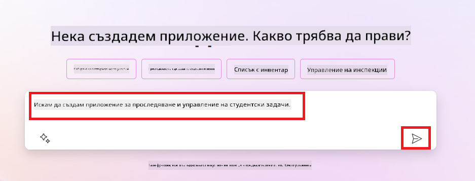
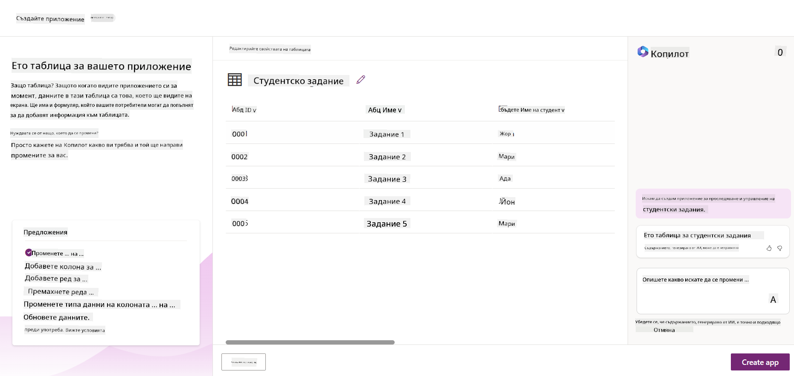
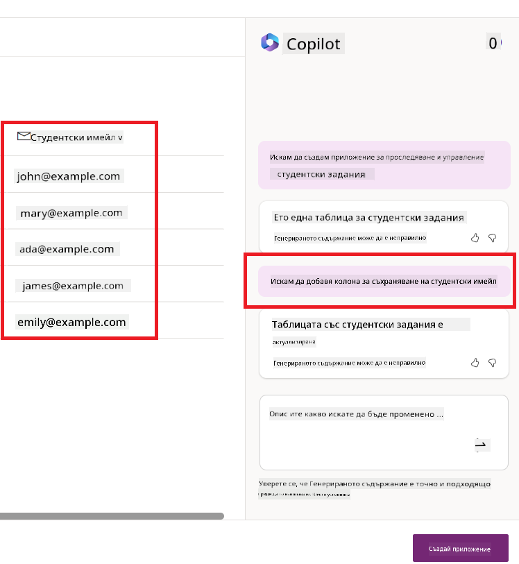
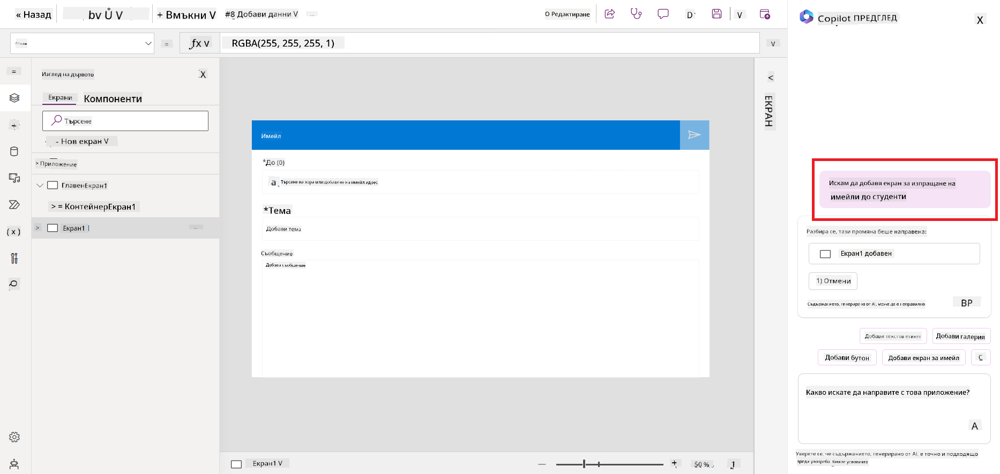
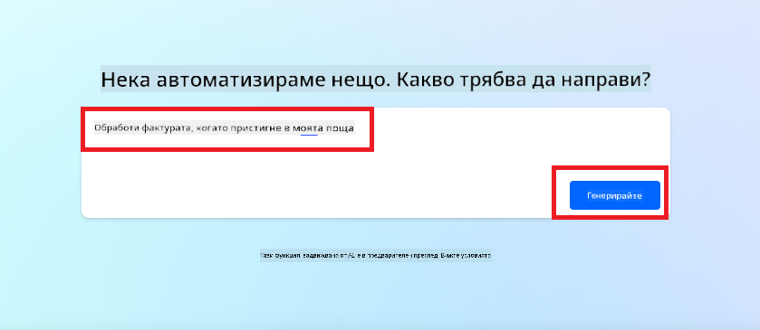
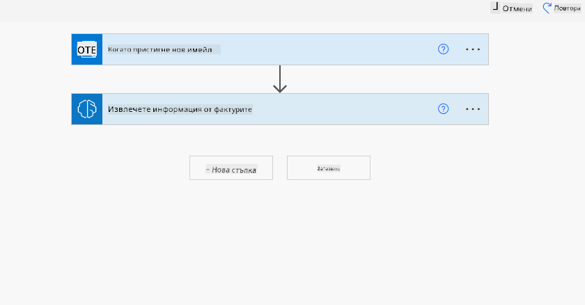
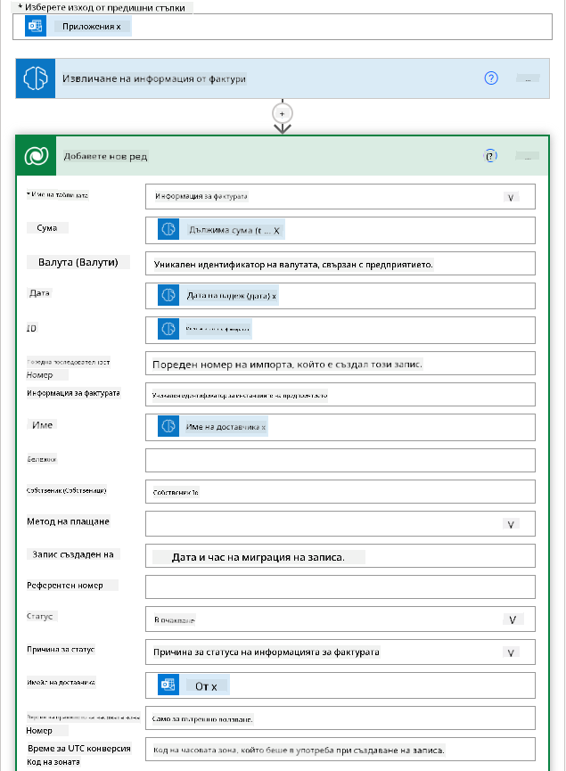
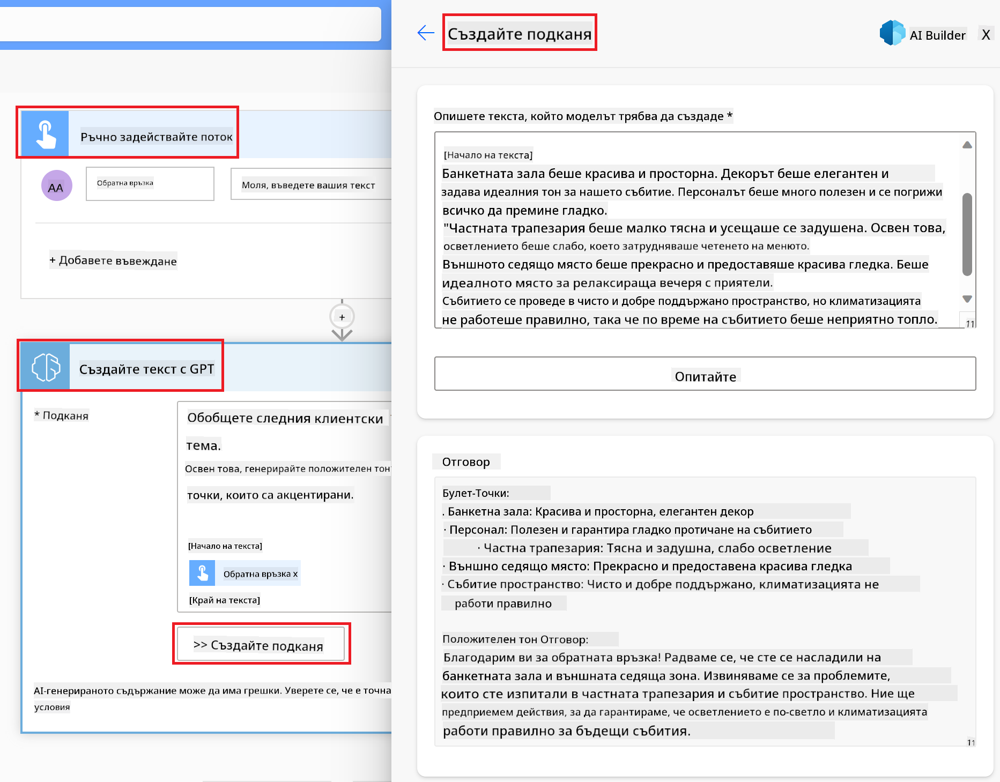

<!--
CO_OP_TRANSLATOR_METADATA:
{
  "original_hash": "f5ff3b6204a695a117d6f452403c95f7",
  "translation_date": "2025-05-19T21:08:44+00:00",
  "source_file": "10-building-low-code-ai-applications/README.md",
  "language_code": "bg"
}
-->
# Създаване на AI приложения с нисък код

> _(Кликнете върху изображението по-горе, за да видите видеото на този урок)_

## Въведение

Сега, след като научихме как да изграждаме приложения за генериране на изображения, нека поговорим за нисък код. Генеративният AI може да се използва за различни области, включително нисък код, но какво представлява ниският код и как можем да добавим AI към него?

Създаването на приложения и решения стана по-лесно за традиционните разработчици и неразработчици чрез използването на платформи за разработка с нисък код. Платформите за разработка с нисък код ви позволяват да изграждате приложения и решения с малко или никакъв код. Това се постига чрез предоставяне на визуална среда за разработка, която ви позволява да плъзгате и пускате компоненти, за да изграждате приложения и решения. Това ви позволява да изграждате приложения и решения по-бързо и с по-малко ресурси. В този урок ще се задълбочим в това как да използваме нисък код и как да подобрим разработката с нисък код с AI, използвайки Power Platform.

Power Platform предоставя на организациите възможността да дадат на своите екипи възможността да изграждат свои собствени решения чрез интуитивна среда с нисък или никакъв код. Тази среда помага да се опрости процесът на изграждане на решения. С Power Platform решенията могат да бъдат изградени за дни или седмици, вместо за месеци или години. Power Platform се състои от пет ключови продукта: Power Apps, Power Automate, Power BI, Power Pages и Copilot Studio.

Този урок обхваща:

- Въведение в генеративния AI в Power Platform
- Въведение в Copilot и как да го използваме
- Използване на генеративен AI за изграждане на приложения и потоци в Power Platform
- Разбиране на AI моделите в Power Platform с AI Builder

## Цели на обучението

До края на този урок ще можете да:

- Разбирате как работи Copilot в Power Platform.

- Изградите приложение за проследяване на студентски задачи за нашия стартъп в областта на образованието.

- Изградите поток за обработка на фактури, който използва AI за извличане на информация от фактури.

- Прилагате най-добрите практики при използването на модела GPT AI за създаване на текст.

Инструментите и технологиите, които ще използвате в този урок, са:

- **Power Apps**, за приложението за проследяване на студентски задачи, което предоставя среда за разработка с нисък код за изграждане на приложения за проследяване, управление и взаимодействие с данни.

- **Dataverse**, за съхранение на данните за приложението за проследяване на студентски задачи, където Dataverse ще предостави платформа за данни с нисък код за съхранение на данните на приложението.

- **Power Automate**, за потока за обработка на фактури, където ще имате среда за разработка с нисък код за изграждане на работни потоци за автоматизиране на процеса на обработка на фактури.

- **AI Builder**, за модела AI за обработка на фактури, където ще използвате предварително изградени AI модели за обработка на фактурите за нашия стартъп.

## Генеративен AI в Power Platform

Подобряването на разработката и приложенията с нисък код с генеративен AI е ключова област на фокус за Power Platform. Целта е да се даде възможност на всеки да изгражда приложения, сайтове, табла и да автоматизира процеси с AI, _без да се изисква експертност в областта на науката за данни_. Тази цел се постига чрез интегриране на генеративния AI в преживяването за разработка с нисък код в Power Platform под формата на Copilot и AI Builder.

### Как работи това?

Copilot е AI асистент, който ви позволява да изграждате решения в Power Platform, като описвате вашите изисквания в серия от разговорни стъпки, използвайки естествен език. Например, можете да инструктирате вашия AI асистент да посочи какви полета ще използва вашето приложение и той ще създаде както приложението, така и подлежащия модел на данни или можете да уточните как да настроите поток в Power Automate.

Можете да използвате функционалностите, управлявани от Copilot, като функция в екраните на вашето приложение, за да позволите на потребителите да откриват прозрения чрез разговорни взаимодействия.

AI Builder е възможност за AI с нисък код, достъпна в Power Platform, която ви позволява да използвате AI модели, за да ви помогне да автоматизирате процеси и да предсказвате резултати. С AI Builder можете да въведете AI във вашите приложения и потоци, които се свързват с вашите данни в Dataverse или в различни облачни източници на данни, като SharePoint, OneDrive или Azure.

Copilot е наличен във всички продукти на Power Platform: Power Apps, Power Automate, Power BI, Power Pages и Power Virtual Agents. AI Builder е наличен в Power Apps и Power Automate. В този урок ще се фокусираме върху това как да използваме Copilot и AI Builder в Power Apps и Power Automate, за да изградим решение за нашия стартъп в областта на образованието.

### Copilot в Power Apps

Като част от Power Platform, Power Apps предоставя среда за разработка с нисък код за изграждане на приложения за проследяване, управление и взаимодействие с данни. Това е пакет от услуги за разработка на приложения с мащабируема платформа за данни и възможност за свързване с облачни услуги и данни на място. Power Apps ви позволява да изграждате приложения, които работят на браузъри, таблети и телефони и могат да бъдат споделени с колеги. Power Apps улеснява потребителите в разработката на приложения с прост интерфейс, така че всеки бизнес потребител или професионален разработчик може да създаде персонализирани приложения. Преживяването при разработка на приложения също се подобрява с генеративния AI чрез Copilot.

Функцията за AI асистент Copilot в Power Apps ви позволява да опишете какъв вид приложение ви е необходимо и каква информация искате вашето приложение да проследява, събира или показва. Copilot след това генерира отзивчиво Canvas приложение въз основа на вашето описание. След това можете да персонализирате приложението, за да отговаря на вашите нужди. AI Copilot също генерира и предлага таблица Dataverse с полетата, които трябва да съхранявате данните, които искате да проследявате, и някои примерни данни. Ще разгледаме какво е Dataverse и как можете да го използвате в Power Apps в този урок по-късно. След това можете да персонализирате таблицата, за да отговаря на вашите нужди, използвайки функцията за AI Copilot асистент чрез разговорни стъпки. Тази функция е лесно достъпна от началния екран на Power Apps.

### Copilot в Power Automate

Като част от Power Platform, Power Automate позволява на потребителите да създават автоматизирани работни потоци между приложения и услуги. Той помага да се автоматизират повтарящи се бизнес процеси, като комуникация, събиране на данни и одобрения на решения. Неговият прост интерфейс позволява на потребителите с всякаква техническа компетентност (от начинаещи до опитни разработчици) да автоматизират работните задачи. Преживяването при разработка на работни потоци също се подобрява с генеративния AI чрез Copilot.

Функцията за AI асистент Copilot в Power Automate ви позволява да опишете какъв вид поток ви е необходим и какви действия искате вашият поток да извършва. Copilot след това генерира поток въз основа на вашето описание. След това можете да персонализирате потока, за да отговаря на вашите нужди. AI Copilot също генерира и предлага действията, които трябва да извършите, за да автоматизирате задачата, която искате. Ще разгледаме какво представляват потоците и как можете да ги използвате в Power Automate в този урок по-късно. След това можете да персонализирате действията, за да отговарят на вашите нужди, използвайки функцията за AI Copilot асистент чрез разговорни стъпки. Тази функция е лесно достъпна от началния екран на Power Automate.

## Задание: Управление на студентски задачи и фактури за нашия стартъп, използвайки Copilot

Нашият стартъп предоставя онлайн курсове на студенти. Стартъпът е нараснал бързо и сега се бори да се справи с търсенето на своите курсове. Стартъпът ви е наел като разработчик на Power Platform, за да им помогнете да изградят решение с нисък код, което да им помогне да управляват своите студентски задачи и фактури. Решението им трябва да може да им помогне да проследяват и управляват студентските задачи чрез приложение и да автоматизират процеса на обработка на фактури чрез работен поток. От вас се изисква да използвате генеративен AI, за да разработите решението.

Когато започвате да използвате Copilot, можете да използвате [Библиотеката с подкани на Power Platform Copilot](https://github.com/pnp/powerplatform-prompts?WT.mc_id=academic-109639-somelezediko), за да започнете с подканите. Тази библиотека съдържа списък с подкани, които можете да използвате за изграждане на приложения и потоци с Copilot. Можете също така да използвате подканите в библиотеката, за да получите представа как да опишете вашите изисквания на Copilot.

### Изграждане на приложение за проследяване на студентски задачи за нашия стартъп

Образователите в нашия стартъп се борят да следят студентските задачи. Те използват електронна таблица за проследяване на задачите, но това е станало трудно за управление, тъй като броят на студентите се е увеличил. Те са ви помолили да създадете приложение, което ще им помогне да проследяват и управляват студентските задачи. Приложението трябва да им позволи да добавят нови задачи, да преглеждат задачи, да актуализират задачи и да изтриват задачи. Приложението трябва също да позволи на образователите и студентите да преглеждат задачите, които са били оценени, и тези, които не са били оценени.

Ще изградите приложението, използвайки Copilot в Power Apps, следвайки стъпките по-долу:

1. Отидете на началния екран на [Power Apps](https://make.powerapps.com?WT.mc_id=academic-105485-koreyst).

1. Използвайте текстовото поле на началния екран, за да опишете приложението, което искате да създадете. Например, **_Искам да създам приложение за проследяване и управление на студентски задачи_**. Кликнете върху бутона **Изпрати**, за да изпратите подкана на AI Copilot.

1. AI Copilot ще предложи таблица Dataverse с полетата, които трябва да съхранявате данните, които искате да проследявате, и някои примерни данни. След това можете да персонализирате таблицата, за да отговаря на вашите нужди, използвайки функцията за AI Copilot асистент чрез разговорни стъпки.

   > **Важно**: Dataverse е подлежащата платформа за данни за Power Platform. Това е платформа за данни с нисък код за съхранение на данните на приложението. Това е напълно управлявана услуга, която сигурно съхранява данни в облака на Microsoft и е предоставена във вашата среда на Power Platform. Тя идва с вградени възможности за управление на данни, като класификация на данни, произход на данни, контрол на достъпа на ниво детайл и други. Можете да научите повече за Dataverse [тук](https://docs.microsoft.com/powerapps/maker/data-platform/data-platform-intro?WT.mc_id=academic-109639-somelezediko).

   

1. Образователите искат да изпращат имейли на студентите, които са предали своите задачи, за да ги информират за напредъка на техните задачи. Можете да използвате Copilot, за да добавите ново поле към таблицата за съхранение на имейла на студента. Например, можете да използвате следната подкана, за да добавите ново поле към таблицата: **_Искам да добавя колона за съхранение на имейл на студента_**. Кликнете върху бутона **Изпрати**, за да изпратите подкана на AI Copilot.

1. AI Copilot ще генерира ново поле и след това можете да персонализирате полето, за да отговаря на вашите нужди.

1. След като сте готови с таблицата, кликнете върху бутона **Създаване на приложение**, за да създадете приложението.

1. AI Copilot ще генерира отзивчиво Canvas приложение въз основа на вашето описание. След това можете да персонализирате приложението, за да отговаря на вашите нужди.

1. За да могат образователите да изпращат имейли на студентите, можете да използвате Copilot, за да добавите нов екран към приложението. Например, можете да използвате следната подкана, за да добавите нов екран към приложението: **_Искам да добавя екран за изпращане на имейли на студентите_**. Кликнете върху бутона **Изпрати**, за да изпратите подкана на AI Copilot.

1. AI Copilot ще генерира нов екран и след това можете да персонализирате екрана, за да отговаря на вашите нужди.

1. След като сте готови с приложението, кликнете върху бутона **Запазване**, за да запазите приложението.

1. За да споделите приложението с образователите, кликнете върху бутона **Споделяне** и след това кликнете отново върху бутона **Споделяне**. След това можете да споделите приложението с образователите, като въведете техните имейл адреси.

> **Вашето домашно**: Приложението, което току-що създадохте, е добро начало, но може да бъде подобрено. С функцията за имейл образователите могат да изпращат имейли на студентите само ръчно, като трябва да въведат техните имейли. Можете ли да използвате Copilot, за да изградите автоматизация, която ще позволи на образователите да изпращат имейли на студентите автоматично, когато те предадат своите задачи? Вашият намек е, че с правилната подкана можете да използвате Copilot в Power Automate, за да изградите това.

### Изграждане на таблица за информация за фактури за нашия стартъп

Финансовият екип на нашия стартъп се бори да следи фактурите. Те използват електронна таблица за проследяване на фактурите, но това е станало трудно за управление, тъй като броят на фактурите се е увеличил. Те са ви помолили да създадете таблица, която ще им помогне да съхраняват, проследяват и управляват информацията за получените фактури. Таблицата трябва да се използва за изграждане на автоматизация, която ще извлича цялата информация за фактурите и ще я съхранява в таблицата. Таблицата трябва също да позволява на финансовия екип да преглежда фактурите, които са платени, и тези,
текст. - **Анализ на настроението**: Този модел открива положителни, отрицателни, неутрални или смесени настроения в текста. - **Четец на визитки**: Този модел извлича информация от визитки. - **Разпознаване на текст**: Този модел извлича текст от изображения. - **Откриване на обекти**: Този модел открива и извлича обекти от изображения. - **Обработка на документи**: Този модел извлича информация от формуляри. - **Обработка на фактури**: Този модел извлича информация от фактури. С персонализираните AI модели можете да внесете ваш собствен модел в AI Builder, така че да функционира като всеки персонализиран модел на AI Builder, позволявайки ви да обучите модела с ваши данни. Можете да използвате тези модели, за да автоматизирате процеси и предсказвате резултати както в Power Apps, така и в Power Automate. Когато използвате ваш собствен модел, има ограничения, които се прилагат. Прочетете повече за тези [ограничения](https://learn.microsoft.com/ai-builder/byo-model#limitations?WT.mc_id=academic-105485-koreyst). 

## Задача #2 - Изграждане на поток за обработка на фактури за нашия стартъп

Финансовият екип има трудности с обработката на фактури. Те използват електронна таблица за следене на фактурите, но това става трудно за управление, тъй като броят на фактурите се увеличава. Те са ви помолили да създадете работен поток, който ще им помогне да обработват фактури с помощта на AI. Работният поток трябва да им позволи да извличат информация от фактури и да съхраняват информацията в таблица в Dataverse. Работният поток трябва също да им позволи да изпращат имейл до финансовия екип с извлечената информация. Сега, когато знаете какво е AI Builder и защо трябва да го използвате, нека разгледаме как можете да използвате модела за обработка на фактури в AI Builder, който разгледахме по-рано, за да изградите работен поток, който ще помогне на финансовия екип да обработва фактури. За да изградите работен поток, който ще помогне на финансовия екип да обработва фактури с помощта на модела за обработка на фактури в AI Builder, следвайте следните стъпки:

1. Отидете на началния екран на [Power Automate](https://make.powerautomate.com?WT.mc_id=academic-105485-koreyst).
2. Използвайте текстовата зона на началния екран, за да опишете работния поток, който искате да създадете. Например, **_Обработете фактура, когато пристигне в моята пощенска кутия_**. Натиснете бутона **Изпрати**, за да изпратите запитването до AI Copilot. 
3. AI Copilot ще предложи действията, които трябва да извършите, за да автоматизирате задачата. Можете да натиснете бутона **Следващ**, за да преминете към следващите стъпки.
4. На следващата стъпка Power Automate ще ви подкани да настроите връзките, необходими за потока. След като сте готови, натиснете бутона **Създай поток**, за да създадете потока.
5. AI Copilot ще генерира поток и можете да го персонализирате, за да отговаря на вашите нужди.
6. Актуализирайте задействащия елемент на потока и задайте **Папка** на папката, където ще се съхраняват фактурите. Например, можете да зададете папката на **Входящи**. Натиснете **Покажи разширени опции** и задайте **Само с прикачени файлове** на **Да**. Това ще гарантира, че потокът се изпълнява само когато в папката се получи имейл с прикачен файл.
7. Премахнете следните действия от потока: **HTML към текст**, **Compose**, **Compose 2**, **Compose 3** и **Compose 4**, тъй като няма да ги използвате.
8. Премахнете действието **Условие** от потока, тъй като няма да го използвате. Трябва да изглежда като следния екран: 
9. Натиснете бутона **Добави действие** и потърсете **Dataverse**. Изберете действието **Добави нов ред**.
10. На действието **Извличане на информация от фактури** актуализирайте **Файл на фактурата**, за да сочи към **Съдържание на прикачения файл** от имейла. Това ще гарантира, че потокът извлича информация от прикачената фактура.
11. Изберете **Таблица**, която сте създали по-рано. Например, можете да изберете таблицата **Информация за фактури**. Изберете динамично съдържание от предишното действие, за да попълните следните полета: - ID - Сума - Дата - Име - Статус - Задайте **Статус** на **В очакване**. - Имейл на доставчика - Използвайте динамичното съдържание **От** от задействащия елемент **Когато пристигне нов имейл**. 
12. След като сте готови с потока, натиснете бутона **Запази**, за да запазите потока. След това можете да тествате потока, като изпратите имейл с фактура до папката, която сте посочили в задействащия елемент.

> **Вашето домашно**: Потокът, който току-що създадохте, е добро начало, сега трябва да помислите как можете да изградите автоматизация, която ще позволи на нашия финансов екип да изпрати имейл до доставчика, за да го актуализира със състоянието на неговата фактура. Вашият намек: потокът трябва да се изпълнява, когато състоянието на фактурата се промени.

## Използване на AI модел за генериране на текст в Power Automate

Моделът за създаване на текст с GPT в AI Builder ви позволява да генерирате текст въз основа на запитване и се захранва от Microsoft Azure OpenAI Service. С тази възможност можете да включите технологията GPT (Generative Pre-Trained Transformer) във вашите приложения и потоци, за да изградите разнообразие от автоматизирани потоци и приложения с полезни инсайти.

GPT моделите преминават през обширно обучение върху огромни количества данни, което им позволява да произвеждат текст, който силно наподобява човешки език, когато им бъде предоставено запитване. Когато се интегрират с автоматизация на работни потоци, AI моделите като GPT могат да се използват за оптимизиране и автоматизиране на широк спектър от задачи.

Например, можете да изградите потоци, които автоматично генерират текст за разнообразие от случаи на употреба, като: чернови на имейли, описания на продукти и други. Можете също така да използвате модела за генериране на текст за различни приложения, като чатботове и приложения за обслужване на клиенти, които позволяват на агенти за обслужване на клиенти да отговарят ефективно и ефикасно на запитвания от клиенти.

За да научите как да използвате този AI модел в Power Automate, преминете през модула [Добавете интелигентност с AI Builder и GPT](https://learn.microsoft.com/training/modules/ai-builder-text-generation/?WT.mc_id=academic-109639-somelezediko).

## Отлична работа! Продължете да учите

След като завършите този урок, разгледайте нашата [Колекция за обучение на генеративен AI](https://aka.ms/genai-collection?WT.mc_id=academic-105485-koreyst), за да продължите да подобрявате своите знания за генеративния AI!

Отидете на Урок 11, където ще разгледаме как да [интегрираме генеративен AI с извикване на функции](../11-integrating-with-function-calling/README.md?WT.mc_id=academic-105485-koreyst)!

**Отказ от отговорност**: 
Този документ е преведен с помощта на AI услуга за превод [Co-op Translator](https://github.com/Azure/co-op-translator). Въпреки че се стремим към точност, моля, имайте предвид, че автоматизираните преводи могат да съдържат грешки или неточности. Оригиналният документ на неговия роден език трябва да се счита за авторитетен източник. За критична информация се препоръчва професионален човешки превод. Не носим отговорност за недоразумения или погрешни интерпретации, произтичащи от използването на този превод.