# Създаване на AI приложения с нисък код

> _(Кликнете върху изображението по-горе, за да гледате видео на този урок)_

## Въведение

След като научихме как да създаваме приложения за генериране на изображения, нека поговорим за ниския код. Генеративният ИИ може да се използва в различни области, включително нискокодовите решения, но какво е нисък код и как можем да добавим ИИ към него?

Създаването на приложения и решения стана по-лесно както за традиционните разработчици, така и за нетехнически потребители чрез използването на платформи за разработка с нисък код. Тези платформи ви позволяват да създавате приложения и решения с много малко или без никакъв код. Това се постига чрез предлагане на визуална среда за разработка, която ви позволява да плъзгате и пускате компоненти за изграждане на приложения и решения. Това ви позволява да създавате приложения и решения по-бързо и с по-малко ресурси. В този урок ще разгледаме подробно как да използваме нисък код и как да подобрим разработката с нисък код с помощта на ИИ чрез Power Platform.

Power Platform предоставя на организациите възможност да овластят своите екипи да създават собствени решения чрез интуитивна среда за нискокодова или безкодовата разработка. Тази среда помага да се опрости процесът на създаване на решения. С Power Platform решенията могат да се създават за дни или седмици, вместо за месеци или години. Power Platform се състои от пет основни продукта: Power Apps, Power Automate, Power BI, Power Pages и Copilot Studio.

Този урок покрива:

- Въведение в Генеративния ИИ в Power Platform
- Въведение в Copilot и как да го използваме
- Използване на Генеративния ИИ за изграждане на приложения и потоци в Power Platform
- Разбиране на ИИ модели в Power Platform с AI Builder
- Създаване на интелигентни агенти с Microsoft Copilot Studio

## Учебни цели

Към края на този урок ще можете:

- Да разбирате как работи Copilot в Power Platform.

- Да създадете приложение за проследяване на студентски задачи за нашия образователен стартъп.

- Да изградите поток за обработка на фактури, който използва ИИ за извличане на информация от фактурите.

- Да прилагате добри практики при използването на модела Create Text с GPT.

- Да разбирате какво е Microsoft Copilot Studio и как да създавате интелигентни агенти с него.

Инструментите и технологиите, които ще използвате в този урок, са:

- **Power Apps**, за приложението за проследяване на студентски задачи, което осигурява среда за нискокодова разработка за създаване на приложения за проследяване, управление и взаимодействие с данни.

- **Dataverse**, за съхраняване на данните за приложението за проследяване на задачи, където Dataverse осигурява нискокодова платформа за данни за съхранение на данните на приложението.

- **Power Automate**, за потока за обработка на фактури, където ще имате нискокодова среда за разработка за изграждане на работни потоци за автоматизиране на процеса на обработка на фактури.

- **AI Builder**, за ИИ модела за обработка на фактури, където ще използвате предварително изградени ИИ модели за обработка на фактурите за нашия стартъп.

## Генеративен ИИ в Power Platform

Подобряването на нискокодовата разработка и приложения с генеративен ИИ е ключова област за Power Platform. Целта е да позволи на всеки да създава приложения, сайтове, табла и да автоматизира процеси с ИИ, _без необходимост от експертни познания в областта на данните_. Тази цел се постига чрез интегриране на генеративния ИИ в нискокодова разработъчна среда в Power Platform под формата на Copilot и AI Builder.

### Как работи това?

Copilot е ИИ асистент, който ви позволява да изграждате решения в Power Platform като описвате изискванията си с поредица от разговорни стъпки, използвайки естествен език. Например, можете да инструктирате вашия ИИ асистент кои полета да използва вашето приложение и той ще създаде както приложението, така и основния модел на данните, или можете да определите как да настроите поток в Power Automate.

Можете да използвате функционалности с Copilot като функция в екраните на вашето приложение, за да позволите на потребителите да откриват прозрения чрез разговорни взаимодействия.

AI Builder е нискокодова ИИ възможност, налична в Power Platform, която ви позволява да използвате ИИ модели, за да автоматизирате процеси и да предвиждате резултати. С AI Builder можете да донесете ИИ в приложенията и потоките си, които се свързват с вашите данни в Dataverse или в различни облачни източници на данни, като SharePoint, OneDrive или Azure.

Copilot е наличен във всички продукти на Power Platform: Power Apps, Power Automate, Power BI, Power Pages и Copilot Studio (бивш Power Virtual Agents). AI Builder е наличен в Power Apps и Power Automate. В този урок ще се фокусираме върху това как да използваме Copilot и AI Builder в Power Apps и Power Automate за създаване на решение за нашия образователен стартъп.

### Copilot в Power Apps

Като част от Power Platform, Power Apps предоставя нискокодова среда за разработка за изграждане на приложения за проследяване, управление и взаимодействие с данни. Това е пакет от услуги за разработка на приложения със скалируема платформа за данни и възможност за свързване към облачни услуги и локални данни. Power Apps ви позволява да изграждате приложения, които работят в браузъри, таблети и телефони, и могат да се споделят с колеги. Power Apps улеснява потребителите да влязат в разработката на приложения с прост интерфейс, така че всеки бизнес потребител или професионален разработчик може да създаде персонализирани приложения. Изживяването при разработка на приложения е подобрено и с генеративен ИИ чрез Copilot.

Функцията AI Copilot в Power Apps ви позволява да опишете какъв вид приложение ви е необходимо и каква информация искате приложението да проследява, събира или показва. Copilot след това генерира отзивчиво Canvas приложение въз основа на вашето описание. След това можете да персонализирате приложението според вашите нужди. AI Copilot също генерира и предлага таблица в Dataverse с полетата, които трябва да съхраняват данните, които искате да проследявате, и с примерни данни. По-късно в този урок ще разгледаме какво е Dataverse и как да го използвате в Power Apps. След това можете да персонализирате таблицата според нуждите си, като използвате функцията AI Copilot за помощник чрез разговорни стъпки. Тази функция е лесно достъпна от началния екран на Power Apps.

### Copilot в Power Automate

Като част от Power Platform, Power Automate позволява на потребителите да създават автоматизирани работни потоци между приложения и услуги. Помага да се автоматизират повтарящи се бизнес процеси като комуникация, събиране на данни и одобрения на решения. Простият му интерфейс позволява на потребители от всяко техническо ниво (от начинаещи до опитни разработчици) да автоматизират работните си задачи. Изживяването при създаване на работни потоци също е подобрено с генеративен ИИ чрез Copilot.

Функцията AI Copilot в Power Automate ви позволява да опишете какъв вид поток ви е необходим и какви действия искате потокът да изпълнява. Copilot след това генерира поток въз основа на вашето описание. След това можете да персонализирате потока, за да отговори на вашите нужди. AI Copilot също генерира и предлага действията, необходими за изпълнение на задачата, която искате да автоматизирате. По-късно в този урок ще разгледаме какво са потоците и как да ги използвате в Power Automate. След това можете да персонализирате действията според нуждите си, използвайки функцията AI Copilot чрез разговорни стъпки. Тази функция е лесно достъпна от началния екран на Power Automate.

## Създаване на интелигентни агенти с Microsoft Copilot Studio

[Microsoft Copilot Studio](https://learn.microsoft.com/microsoft-copilot-studio/fundamentals-what-is-copilot-studio?WT.mc_id=academic-105485-koreyst) (бивш Power Virtual Agents) е нискокодовият член на Power Platform за създаване на **ИИ агенти** — разговорни копилоти, които могат да отговарят на въпроси, предприемат действия и автоматизират задачи от името на вашите потребители. Както и при останалите продукти на Power Platform, тези агенти се създават чрез визуален, естествено-езиков опит: описвате какво искате агентът да прави, а Copilot Studio помага да се оформят инструкциите, знанията и действията му.

За нашия образователен стартъп можете да изградите агент, който отговаря на въпроси от студенти за курсове, проверява срокове за задачи и дори изпраща електронна поща на преподавател — всичко това без писане на код.

Ето някои от най-новите възможности, които правят Copilot Studio мощен:

- **Генеративни отговори от вашите знания**. Вместо да създавате всяка беседа ръчно, можете да свържете **източници на знания** — публични уебсайтове, SharePoint, OneDrive, Dataverse, качени файлове или корпоративни данни чрез конектори — и агентът генерира обосновани отговори от тях.

- **Генеративна оркестрация**. Вместо да се разчита на твърдо кодирани задействащи фрази, агентът използва ИИ, за да разбере заявката и динамично да реши кои знания, теми и действия да комбинира, включително вериги от няколко стъпки.

- **Действия и конектори**. Агентите могат да *правят* неща, а не само да си чатят. Можете да дадете на агента действия, подкрепени от над 1,500 предварително изградени конектори на Power Platform, потоци от Power Automate, персонализирани REST API, подкани или сървъри със **Model Context Protocol (MCP)**.

- **Автономни агенти**. Агентите не са ограничени до отговаряне в чат прозорец. Можете да създадете **автономни агенти**, които се задействат от събития — като нов имейл, нов запис в Dataverse или качен файл — и след това действат във фонов режим за изпълнение на задача.

- **Многоагентска оркестрация**. Агентите могат да извикват други агенти. Агент на Copilot Studio може да прехвърля задачата на или да бъде разширен от други агенти, включително агенти, публикувани в Microsoft 365 Copilot и агенти, създадени в Microsoft Foundry.

- **Избор на модел**. Освен вградените модели, можете да донесете модели от каталога с модели на Microsoft Foundry, за да персонализирате начина, по който агентът разсъждава и отговаря.

- **Публикувайте навсякъде**. След като е създаден, агентът може да бъде публикуван в множество канали — Microsoft Teams, Microsoft 365 Copilot, уебсайт или персонализирано приложение и други — със сигурност, удостоверяване и аналитика, управлявани през администраторския опит на Power Platform.

Можете да започнете да създавате първия си агент на [copilotstudio.microsoft.com](https://copilotstudio.microsoft.com?WT.mc_id=academic-105485-koreyst) и да научите повече в [документацията на Microsoft Copilot Studio](https://learn.microsoft.com/microsoft-copilot-studio/?WT.mc_id=academic-105485-koreyst).

## Задача: Управление на студентски задачи и фактури за нашия стартъп, използвайки Copilot

Нашият стартъп предлага онлайн курсове на студенти. Стартъпът бързо се разраства и сега има затруднения да отговори на търсенето на курсовете си. Те са наели вас като разработчик на Power Platform, за да им помогнете да създадат нискокодово решение, което да управлява студентските задачи и фактури. Решението трябва да им помогне да проследяват и управляват студентските задачи чрез приложение и да автоматизира процеса на обработка на фактури чрез работен поток. Вие сте помолени да използвате Генеративен ИИ за разработване на решението.

Когато започвате да използвате Copilot, можете да използвате [Power Platform Copilot Prompt Library](https://github.com/pnp/powerplatform-prompts?WT.mc_id=academic-109639-somelezediko), за да започнете с препоръчаните подкани. Тази библиотека съдържа списък с подкани, които можете да използвате за създаване на приложения и потоци с Copilot. Можете също да използвате подсказките в библиотеката, за да добиете представа как да опишете вашите изисквания към Copilot.

### Създайте приложение за проследяване на студентски задачи за нашия стартъп

Образователният екип на нашия стартъп се затруднява с проследяването на студентските задачи. Те използват електронна таблица за това, но с нарастването на броя на студентите става трудно за управление. Те ви помолиха да изградите приложение, което да им помогне да проследяват и управляват студентските задачи. Приложението трябва да им позволи да добавят нови задачи, да виждат задачите, да актуализират и изтриват задачи. Приложението трябва също да позволи на преподаватели и студенти да виждат задачите, които са оценени и тези, които не са оценени.

Ще изградите приложението с помощта на Copilot в Power Apps, следвайки стъпките по-долу:

1. Отидете на началния екран на [Power Apps](https://make.powerapps.com?WT.mc_id=academic-105485-koreyst).

1. Използвайте текстовото поле на началния екран, за да опишете приложението, което искате да изградите. Например, **_Искам да създам приложение за проследяване и управление на студентски задачи_**. Натиснете бутона **Изпрати**, за да изпратите подкана на AI Copilot.

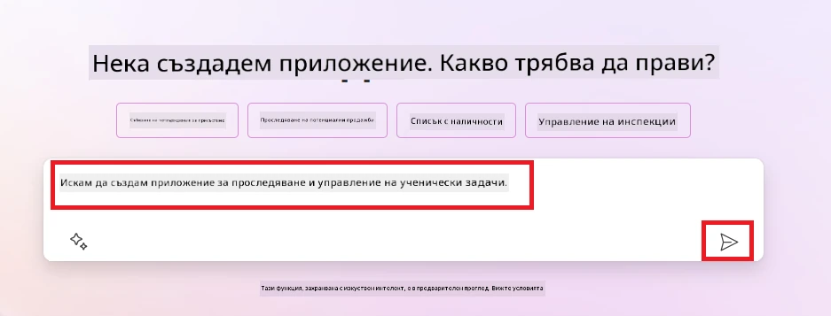

1. AI Copilot ще предложи таблица в Dataverse с полетата, които са необходими за съхраняване на данните, които искате да проследявате, както и примерни данни. След това можете да персонализирате таблицата, за да отговаря на вашите нужди, използвайки функцията AI Copilot чрез разговорни стъпки.

   > **Важно**: Dataverse е основната платформа за данни на Power Platform. Това е нискокодова платформа за данни за съхранение на данните на приложението. Това е напълно управлявана услуга, която съхранява данните сигурно в Microsoft Cloud и е предоставена във вашата Power Platform среда. Тя разполага с вградени възможности за управление на данни, като класификация на данни, проследимост на данни, фино управление на достъпа и други. Можете да научите повече за Dataverse [тук](https://learn.microsoft.com/power-apps/maker/data-platform/data-platform-intro?WT.mc_id=academic-109639-somelezediko).

   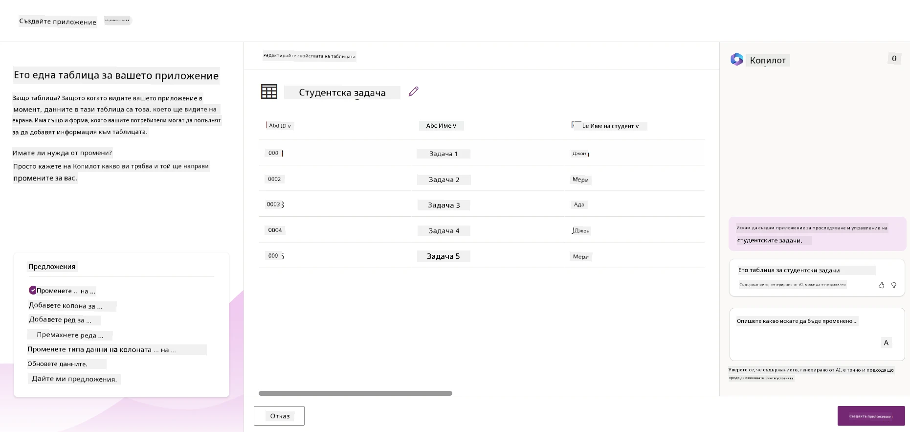

1. Преподавателите искат да изпращат имейли до студентите, които са подали своите задачи, за да ги информират за напредъка. Можете да използвате Copilot, за да добавите ново поле в таблицата за съхранение на имейл адресите на студентите. Например, можете да използвате следната подкана, за да добавите ново поле: **_Искам да добавя колона за съхраняване на имейл адрес на студент_**. Натиснете бутона **Изпрати**, за да изпратите подкана на AI Copilot.

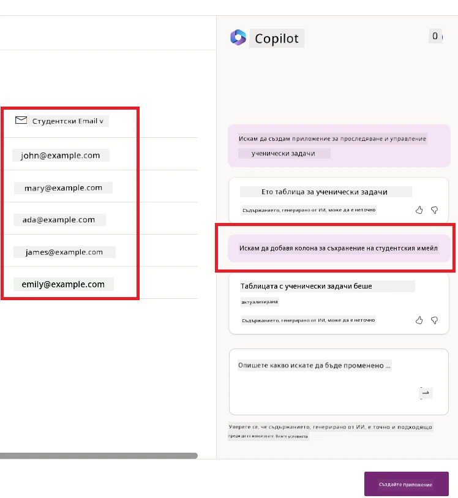

1. AI Copilot ще генерира ново поле и след това можете да го персонализирате според вашите нужди.

1. След като приключите с таблицата, кликнете върху бутона **Create app**, за да създадете приложението.

1. AI Copilot ще генерира отзивчиво Canvas приложение въз основа на вашето описание. След това можете да персонализирате приложението, за да отговаря на вашите нужди.

1. За преподаватели, които искат да изпращат имейли на студенти, можете да използвате Copilot, за да добавите нов екран към приложението. Например, можете да използвате следната заявка за добавяне на нов екран към приложението: **_Искам да добавя екран за изпращане на имейли на студенти_**. Кликнете върху бутона **Send**, за да изпратите заявката към AI Copilot.

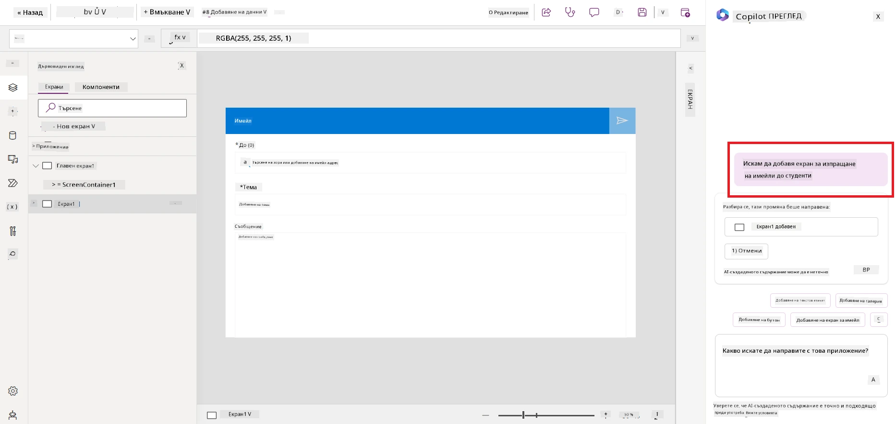

1. AI Copilot ще генерира нов екран и след това можете да го персонализирате според нуждите си.

1. След като приключите с приложението, кликнете върху бутона **Save**, за да запазите приложението.

1. За да споделите приложението с преподавателите, кликнете върху бутона **Share**, след което отново кликнете върху бутона **Share**. След това можете да споделите приложението с преподавателите, като въведете техните имейл адреси.

> **Вашата задача**: Приложението, което току-що създадохте, е добър старт, но може да бъде подобрено. С функцията за имейли преподавателите могат само ръчно да изпращат имейли на студенти, като трябва да въвеждат техните имейл адреси. Можете ли да използвате Copilot, за да създадете автоматизация, която да позволи на преподавателите автоматично да изпращат имейли на студентите, когато те предават своите задания? Подсказката ви е, че с правилната заявка можете да използвате Copilot в Power Automate, за да го реализирате.

### Създаване на таблица с информация за фактурите за нашия стартиращ бизнес

Финансовият екип на нашия стартиращ бизнес има затруднения да следи фактурите. Те са използвали електронна таблица за проследяване на фактурите, но това става трудно за управление с увеличаването на броя на фактурите. Те са ви помолили да създадете таблица, която ще им помогне да съхраняват, проследяват и управляват информацията на получените фактури. Таблицата трябва да бъде използвана за създаване на автоматизация, която ще извлича всички данни от фактурите и ще ги съхранява в таблицата. Таблицата също така трябва да позволява на финансовия екип да вижда фактурите, които са платени, и тези, които не са платени.

Power Platform има подлежащa платформа за данни, наречена Dataverse, която ви позволява да съхранявате данните за вашите приложения и решения. Dataverse предоставя нискокодовa платформа за съхранение на данни за приложението. Това е напълно управлявана услуга, която съхранява данните сигурно в Microsoft Cloud и е осигурена във вашата Power Platform среда. Тя идва с вградени възможности за управление на данни, като класификация на данни, проследяване на произхода на данни, прецизен контрол на достъпа и други. Можете да научите повече [за Dataverse тук](https://learn.microsoft.com/power-apps/maker/data-platform/data-platform-intro?WT.mc_id=academic-109639-somelezediko).

Защо трябва да използваме Dataverse за нашия стартиращ бизнес? Стандартните и персонализирани таблици в Dataverse предоставят сигурна и базирана в облак опция за съхранение на вашите данни. Таблиците ви позволяват да съхранявате различни видове данни, подобно на начина, по който може да използвате няколко работни листа в една Excel работна книга. Можете да използвате таблици, за да съхранявате данни, специфични за вашата организация или бизнес нужди. Някои от предимствата, които нашия стартиращ бизнес ще получи от използването на Dataverse, включват, но не се ограничават до:

- **Лесно управление**: както метаданните, така и данните се съхраняват в облака, така че не е нужно да се притеснявате за детайлите как са съхранени или управлявани. Можете да се съсредоточите върху изграждането на вашите приложения и решения.

- **Сигурност**: Dataverse предоставя сигурна и базирана в облак опция за съхранение на вашите данни. Можете да контролирате кой има достъп до данните в таблиците ви и как може да ги използва чрез базирана на роли сигурност.

- **Богати метаданни**: Типовете данни и връзките се използват директно в Power Apps

- **Логика и валидиране**: Можете да използвате бизнес правила, изчисляеми полета и правила за валидиране, за да налагате бизнес логика и да поддържате точността на данните.

Сега, когато знаете какво е Dataverse и защо трябва да го използвате, нека разгледаме как можете да използвате Copilot, за да създадете таблица в Dataverse, която да отговаря на изискванията на нашия финансов екип.

> **Забележка**: Ще използвате тази таблица в следващия раздел, за да създадете автоматизация, която ще извлича всички данни от фактурите и ще ги съхранява в таблицата.

За да създадете таблица в Dataverse с помощта на Copilot, следвайте стъпките по-долу:

1. Отидете на началния екран на [Power Apps](https://make.powerapps.com?WT.mc_id=academic-105485-koreyst).

2. В лявото навигационно меню изберете **Tables**, след което кликнете върху **Describe the new Table**.

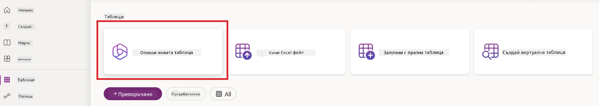

1. На екрана **Describe the new Table** използвайте текстовото поле, за да опишете таблицата, която искате да създадете. Например, **_Искам да създам таблица за съхранение на информация за фактури_**. Кликнете върху бутона **Send**, за да изпратите заявката към AI Copilot.

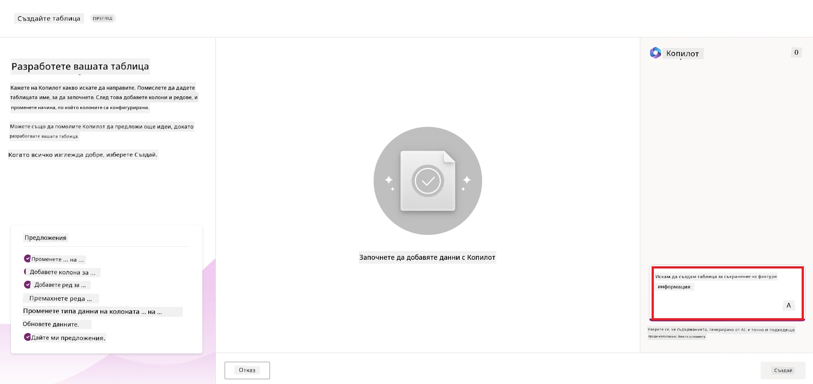

1. AI Copilot ще предложи Dataverse таблица с необходимите полета за съхраняване на данните, които искате да следите, както и някои примерни данни. След това можете да персонализирате таблицата според нуждите си, използвайки асистента на AI Copilot чрез разговорни стъпки.

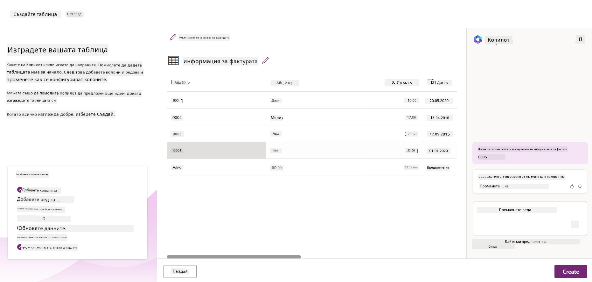

1. Финансовият екип иска да изпрати имейл на доставчика, за да го информира за текущото състояние на тяхната фактура. Можете да използвате Copilot, за да добавите ново поле в таблицата за съхранение на имейл адреса на доставчика. Например, можете да използвате следната заявка за добавяне на ново поле в таблицата: **_Искам да добавя колона за съхранение на имейл адрес на доставчик_**. Кликнете върху бутона **Send**, за да изпратите заявката към AI Copilot.

1. AI Copilot ще генерира ново поле и след това можете да го персонализирате според вашите нужди.

1. След като приключите с таблицата, кликнете върху бутона **Create**, за да създадете таблицата.

## AI модели в Power Platform с AI Builder

AI Builder е нискокодова AI функционалност, налична в Power Platform, която ви позволява да използвате AI модели, за да автоматизирате процеси и да предсказвате резултати. С AI Builder можете да внесете AI в приложенията и потоковете си, които се свързват с данни в Dataverse или в различни облачни източници на данни, като SharePoint, OneDrive или Azure.

## Предефинирани AI модели срещу персонализирани AI модели

AI Builder предоставя два вида AI модели: Предефинирани AI модели и Персонализирани AI модели. Предефинираните AI модели са готови за използване модели, обучени от Microsoft и налични в Power Platform. Те ви помагат да добавите интелигентност към приложенията и потоковете си без да се налага да събирате данни, след което да изграждате, обучавате и публикувате свои собствени модели. Можете да използвате тези модели за автоматизиране на процеси и предсказване на резултати.

Някои от предефинираните AI модели, налични в Power Platform, включват:

- **Извличане на ключови фрази**: Този модел извлича ключови фрази от текст.
- **Откриване на език**: Този модел разпознава езика на даден текст.
- **Анализ на настроения**: Този модел разпознава положително, отрицателно, неутрално или смесено настроение в текста.
- **Четец на визитни картички**: Този модел извлича информация от визитни картички.
- **Разпознаване на текст**: Този модел извлича текст от изображения.
- **Откриване на обекти**: Този модел открива и извлича обекти от изображения.
- **Обработка на документи**: Този модел извлича информация от формуляри.
- **Обработка на фактури**: Този модел извлича информация от фактури.

С персонализираните AI модели можете да внесете свой собствен модел в AI Builder, който да функционира като всеки персонализиран AI модел в AI Builder, позволявайки ви да обучите модела с вашите собствени данни. Можете да използвате тези модели за автоматизиране на процеси и предсказване на резултати както в Power Apps, така и в Power Automate. При използването на собствен модел има ограничени права, които се прилагат. Прочетете повече за тези [ограничения](https://learn.microsoft.com/ai-builder/byo-model#limitations?WT.mc_id=academic-105485-koreyst).

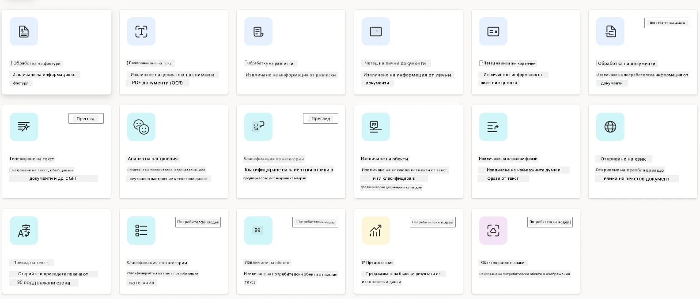

## Задача #2 - Създаване на поток за обработка на фактури за нашия стартиращ бизнес

Финансовият екип има затруднения при обработката на фактурите. Те са използвали електронна таблица за проследяване на фактурите, но с нарастването на броя на фактурите това става трудно за управление. Те ви помолиха да създадете работен поток, който да им помогне да обработват фактурите с помощта на AI. Работният поток трябва да им позволи да извличат информация от фактурите и да я съхраняват в таблица в Dataverse. Работният поток трябва също така да им позволи да изпращат имейл на финансовия екип с извлечената информация.

Сега, след като знаете какво е AI Builder и защо да го използвате, нека разгледаме как можете да използвате AI модела за обработка на фактури в AI Builder, който разгледахме по-рано, за да създадете работен поток, който да помогне на финансовия екип да обработва фактури.

За да създадете работен поток, който да помогне на финансовия екип да обработва фактури с помощта на AI модела за обработка на фактури в AI Builder, следвайте стъпките по-долу:

1. Отидете на началния екран на [Power Automate](https://make.powerautomate.com?WT.mc_id=academic-105485-koreyst).

2. Използвайте текстовото поле на началния екран, за да опишете работния поток, който искате да създадете. Например, **_Обработи фактура, когато пристигне в моята пощенска кутия_**. Кликнете върху бутона **Send**, за да изпратите заявката към AI Copilot.

   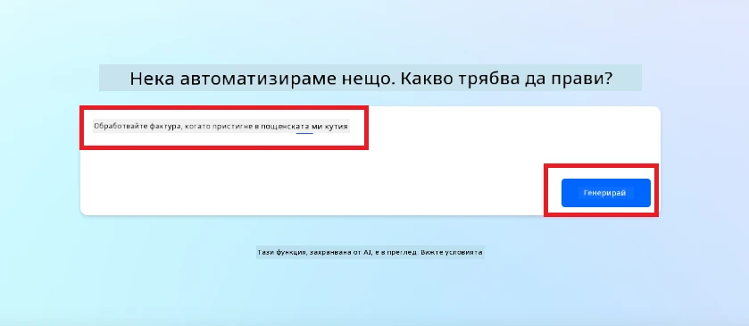

3. AI Copilot ще предложи действия, които трябва да изпълните, за да автоматизирате задачата. Можете да кликнете върху бутона **Next**, за да преминете през следващите стъпки.

4. На следващата стъпка Power Automate ще ви подкани да настроите необходимите връзки за потока. След като приключите, кликнете върху бутона **Create flow**, за да създадете потока.

5. AI Copilot ще генерира поток и след това можете да го персонализирате според нуждите си.

6. Актуализирайте тригъра на потока и задайте **Folder** на папката, където ще се съхраняват фактурите. Например, можете да зададете папката на **Inbox**. Кликнете на **Show advanced options** и задайте **Only with Attachments** на **Yes**. Това ще гарантира, че потокът ще се изпълнява само, когато в папката пристигне имейл с прикачен файл.

7. Премахнете следните действия от потока: **HTML to text**, **Compose**, **Compose 2**, **Compose 3** и **Compose 4**, тъй като няма да ги използвате.

8. Премахнете действието **Condition** от потока, тъй като няма да го използвате. Той трябва да изглежда както на следния екран:

   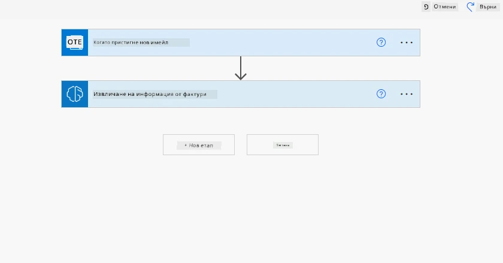

9. Кликнете върху бутона **Add an action** и потърсете **Dataverse**. Изберете действието **Add a new row**.

10. В действието **Extract Information from invoices** актуализирайте **Invoice File**, за да сочи към **Attachment Content** от имейла. Това ще гарантира, че потокът извлича информация от прикачения файл на фактурата.

11. Изберете таблицата, която създадохте по-рано. Например, можете да изберете таблицата **Invoice Information**. Използвайте динамичното съдържание от предходното действие, за да попълните следните полета:

    - ID
    - Amount
    - Date
    - Name
    - Status - Задайте **Status** на **Pending**.
    - Supplier Email - Използвайте динамичното съдържание **From** от тригъра **When a new email arrives**.

    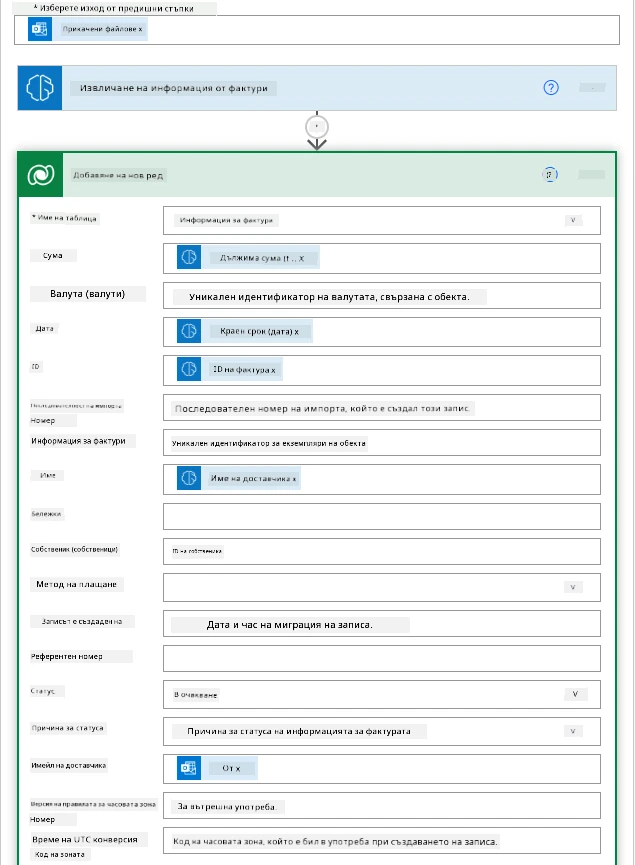

12. След като приключите с потока, кликнете върху бутона **Save**, за да го запазите. След това можете да тествате потока, като изпратите имейл с фактура към папката, която сте задали в тригъра.

> **Вашата задача**: Потокът, който току-що създадохте, е добър старт, но сега трябва да помислите как да създадете автоматизация, която да позволи на нашия финансов екип да изпраща имейл на доставчика, за да го информира за текущото състояние на тяхната фактура. Подсказката ви: потокът трябва да се изпълнява, когато статусът на фактурата се промени.

## Използване на AI модел за генериране на текст в Power Automate

AI моделът Create Text with GPT в AI Builder ви позволява да генерирате текст на база заявка и е базиран на Microsoft Azure OpenAI Service. С тази функционалност можете да включите GPT (Generative Pre-Trained Transformer) технологията в приложенията и потоковете си, за да създавате разнообразни автоматизирани потоци и аналитични приложения.

GPT моделите преминават обширно обучение върху големи обеми данни, което им позволява да генерират текст, който много прилича на човешки език, когато им бъде предоставена заявка. Когато се интегрират с автоматизация на работни потоци, AI модели като GPT могат да бъдат използвани за опростяване и автоматизиране на широк спектър от задачи.

Например, можете да създадете потоци, които автоматично генерират текст за различни случаи, като чернови на имейли, описания на продукти и други. Можете също така да използвате модела за генериране на текст за различни приложения, като чатботове и приложения за обслужване на клиенти, които позволяват на агентите да отговарят ефективно и бързо на клиентските запитвания.

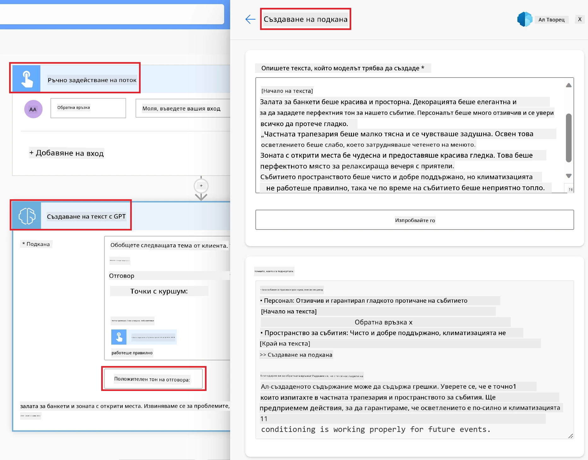

За да научите как да използвате този AI модел в Power Automate, преминете през модула [Добавяне на изкуствен интелект с AI Builder и GPT](https://learn.microsoft.com/training/modules/ai-builder-text-generation/?WT.mc_id=academic-109639-somelezediko).

## Чудесна работа! Продължете обучението си

След като завършите този урок, разгледайте нашата [Колекция за обучение по генеративен AI](https://aka.ms/genai-collection?WT.mc_id=academic-105485-koreyst), за да надградите знанията си по генеративен AI!

Искате ли да персонализирате и да извлечете повече от Copilot? Разгледайте [Awesome Copilot](https://github.com/github/awesome-copilot?WT.mc_id=academic-105485-koreyst) — колекция от инструкции, агенти, умения и конфигурации, създадена от общността, която ще ви помогне да използвате GitHub Copilot максимално.

Отидете на урок 11, където ще разгледаме как да [интегрираме генеративен AI с Function Calling](../11-integrating-with-function-calling/README.md?WT.mc_id=academic-105485-koreyst)!

---

<!-- CO-OP TRANSLATOR DISCLAIMER START -->
**Отказ от отговорност**:
Този документ е преведен с помощта на AI преводачески услуга [Co-op Translator](https://github.com/Azure/co-op-translator). Въпреки че се стремим към точност, моля имайте предвид, че автоматизираните преводи могат да съдържат грешки или неточности. Оригиналният документ на неговия роден език трябва да се счита за авторитетен източник. За критична информация се препоръчва професионален човешки превод. Ние не носим отговорност за каквито и да е недоразумения или неправилни тълкувания, произтичащи от използването на този превод.
<!-- CO-OP TRANSLATOR DISCLAIMER END -->