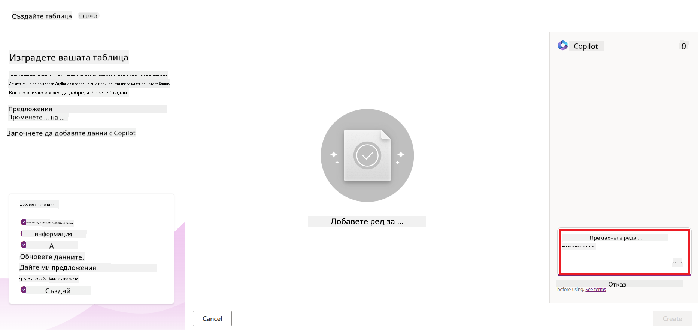
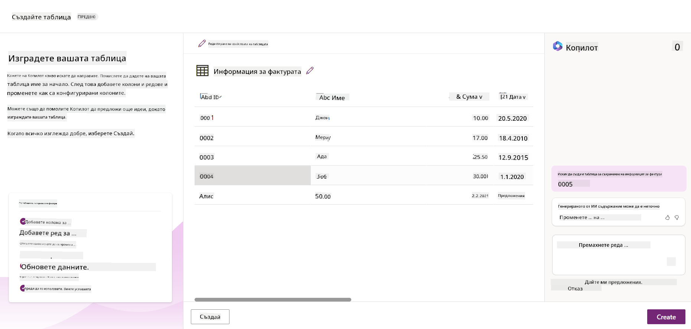
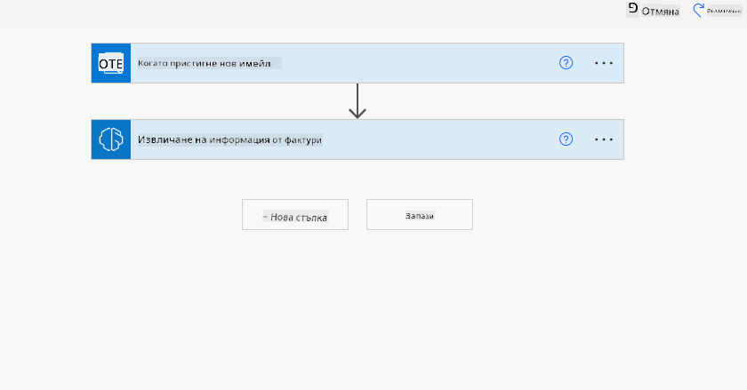
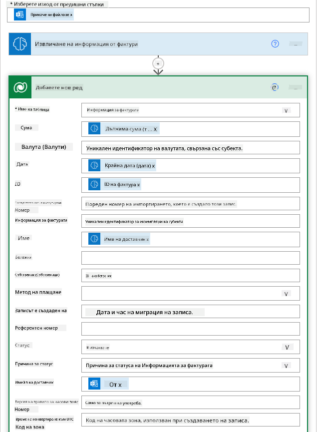

<!--
CO_OP_TRANSLATOR_METADATA:
{
  "original_hash": "f5ff3b6204a695a117d6f452403c95f7",
  "translation_date": "2025-07-09T14:14:22+00:00",
  "source_file": "10-building-low-code-ai-applications/README.md",
  "language_code": "bg"
}
-->
# Създаване на AI приложения с нисък код

> _(Кликнете върху изображението по-горе, за да гледате видеото на този урок)_

## Въведение

След като вече научихме как да създаваме приложения за генериране на изображения, нека поговорим за ниския код. Генеративният AI може да се използва в различни области, включително нисък код, но какво всъщност е нисък код и как можем да добавим AI към него?

Създаването на приложения и решения стана по-лесно както за традиционните разработчици, така и за хора без технически опит чрез използването на платформи за разработка с нисък код. Тези платформи позволяват да се изграждат приложения и решения с малко или без никакъв код. Това се постига чрез визуална среда за разработка, която позволява плъзгане и пускане на компоненти за създаване на приложения и решения. По този начин можете да създавате приложения и решения по-бързо и с по-малко ресурси. В този урок ще разгледаме подробно как да използваме нисък код и как да подобрим разработката с нисък код чрез AI, използвайки Power Platform.

Power Platform дава възможност на организациите да овластят своите екипи да създават собствени решения чрез интуитивна среда с нисък или без код. Тази среда опростява процеса на създаване на решения. С Power Platform решенията могат да се изграждат за дни или седмици, вместо за месеци или години. Power Platform включва пет основни продукта: Power Apps, Power Automate, Power BI, Power Pages и Copilot Studio.

В този урок ще разгледаме:

- Въведение в генеративния AI в Power Platform  
- Въведение в Copilot и как да го използваме  
- Използване на генеративен AI за създаване на приложения и потоци в Power Platform  
- Разбиране на AI моделите в Power Platform с AI Builder  

## Цели на обучението

Към края на този урок ще можете да:

- Разберете как работи Copilot в Power Platform.  
- Създадете приложение за проследяване на студентски задачи за нашия образователен стартъп.  
- Създадете поток за обработка на фактури, който използва AI за извличане на информация от фактурите.  
- Прилагате добри практики при използване на AI модела Create Text с GPT.  

Инструментите и технологиите, които ще използвате в този урок, са:

- **Power Apps** – за приложението за проследяване на студентски задачи, което предоставя среда за разработка с нисък код за създаване на приложения за проследяване, управление и взаимодействие с данни.  
- **Dataverse** – за съхранение на данните на приложението за проследяване на студентски задачи, като Dataverse осигурява платформа с нисък код за съхранение на данни.  
- **Power Automate** – за потока за обработка на фактури, където ще имате среда с нисък код за създаване на работни потоци за автоматизиране на процеса по обработка на фактури.  
- **AI Builder** – за AI модела за обработка на фактури, където ще използвате предварително изградени AI модели за обработка на фактурите на нашия стартъп.  

## Генеративен AI в Power Platform

Подобряването на разработката с нисък код и приложенията чрез генеративен AI е ключова област на фокус за Power Platform. Целта е да се даде възможност на всеки да създава AI-задвижвани приложения, сайтове, табла и да автоматизира процеси с AI, _без да е необходима експертиза в областта на науката за данни_. Тази цел се постига чрез интегриране на генеративен AI в средата за разработка с нисък код в Power Platform под формата на Copilot и AI Builder.

### Как работи това?

Copilot е AI асистент, който ви позволява да създавате решения в Power Platform, като описвате вашите изисквания чрез серия от разговорни стъпки, използвайки естествен език. Например, можете да инструктирате AI асистента да посочи какви полета ще използва вашето приложение и той ще създаде както приложението, така и основния модел на данни, или можете да опишете как да настроите поток в Power Automate.

Можете да използвате функционалности, управлявани от Copilot, като функция в екраните на вашето приложение, за да позволите на потребителите да откриват прозрения чрез разговорни взаимодействия.

AI Builder е възможност за AI с нисък код, налична в Power Platform, която ви позволява да използвате AI модели, за да автоматизирате процеси и да предсказвате резултати. С AI Builder можете да добавите AI към вашите приложения и потоци, които се свързват с данни в Dataverse или в различни облачни източници на данни, като SharePoint, OneDrive или Azure.

Copilot е наличен във всички продукти на Power Platform: Power Apps, Power Automate, Power BI, Power Pages и Power Virtual Agents. AI Builder е наличен в Power Apps и Power Automate. В този урок ще се фокусираме върху това как да използваме Copilot и AI Builder в Power Apps и Power Automate, за да създадем решение за нашия образователен стартъп.

### Copilot в Power Apps

Като част от Power Platform, Power Apps предоставя среда за разработка с нисък код за създаване на приложения за проследяване, управление и взаимодействие с данни. Това е набор от услуги за разработка на приложения с мащабируема платформа за данни и възможност за свързване с облачни услуги и локални данни. Power Apps ви позволява да създавате приложения, които работят в браузъри, таблети и телефони и могат да се споделят с колеги. Power Apps улеснява потребителите в разработката на приложения с прост интерфейс, така че всеки бизнес потребител или професионален разработчик да може да създава персонализирани приложения. Опитът при разработката на приложения се подобрява и чрез генеративен AI чрез Copilot.

Функцията AI асистент Copilot в Power Apps ви позволява да опишете какъв вид приложение ви трябва и каква информация искате приложението да проследява, събира или показва. Copilot след това генерира отзивчиво Canvas приложение въз основа на вашето описание. След това можете да персонализирате приложението според нуждите си. AI Copilot също така генерира и предлага Dataverse таблица с полетата, необходими за съхранение на данните, които искате да проследявате, както и примерни данни. По-късно в този урок ще разгледаме какво е Dataverse и как можете да го използвате в Power Apps. След това можете да персонализирате таблицата според нуждите си, използвайки AI Copilot чрез разговорни стъпки. Тази функция е лесно достъпна от началния екран на Power Apps.

### Copilot в Power Automate

Като част от Power Platform, Power Automate позволява на потребителите да създават автоматизирани работни потоци между приложения и услуги. Той помага за автоматизиране на повтарящи се бизнес процеси като комуникация, събиране на данни и одобрения на решения. Простият му интерфейс позволява на потребители с всякакво техническо ниво (от начинаещи до опитни разработчици) да автоматизират работни задачи. Опитът при разработка на работни потоци също се подобрява чрез генеративен AI чрез Copilot.

Функцията AI асистент Copilot в Power Automate ви позволява да опишете какъв вид поток ви трябва и какви действия искате потокът да изпълнява. Copilot след това генерира поток въз основа на вашето описание. След това можете да персонализирате потока според нуждите си. AI Copilot също така генерира и предлага действията, необходими за изпълнение на задачата, която искате да автоматизирате. По-късно в този урок ще разгледаме какво са потоците и как да ги използвате в Power Automate. След това можете да персонализирате действията според нуждите си, използвайки AI Copilot чрез разговорни стъпки. Тази функция е лесно достъпна от началния екран на Power Automate.

## Задача: Управление на студентски задачи и фактури за нашия стартъп, използвайки Copilot

Нашият стартъп предлага онлайн курсове на студенти. Стартапът се развива бързо и вече изпитва затруднения да отговори на търсенето на курсовете си. Те ви наеха като разработчик в Power Platform, за да им помогнете да създадат решение с нисък код, което да им помогне да управляват студентските задачи и фактурите. Решението трябва да им позволи да проследяват и управляват студентските задачи чрез приложение и да автоматизират процеса по обработка на фактури чрез работен поток. Помолени сте да използвате генеративен AI за разработване на решението.

Когато започвате да използвате Copilot, можете да използвате [Power Platform Copilot Prompt Library](https://github.com/pnp/powerplatform-prompts?WT.mc_id=academic-109639-somelezediko), за да се запознаете с примерни заявки. Тази библиотека съдържа списък с подсказки, които можете да използвате за създаване на приложения и потоци с Copilot. Можете също така да използвате подсказките, за да добиете представа как да опишете изискванията си към Copilot.

### Създаване на приложение за проследяване на студентски задачи за нашия стартъп

Преподавателите в нашия стартъп имат затруднения да следят студентските задачи. Те използват електронна таблица, но с увеличаването на броя на студентите това става трудно за управление. Те ви помолиха да създадете приложение, което да им помогне да проследяват и управляват студентските задачи. Приложението трябва да им позволи да добавят нови задачи, да преглеждат, актуализират и изтриват задачи. Приложението трябва също да позволява на преподаватели и студенти да виждат кои задачи са оценени и кои не.

Ще създадете приложението, използвайки Copilot в Power Apps, като следвате стъпките по-долу:

1. Отидете на [началния екран на Power Apps](https://make.powerapps.com?WT.mc_id=academic-105485-koreyst).

1. Използвайте текстовото поле на началния екран, за да опишете приложението, което искате да създадете. Например, **_Искам да създам приложение за проследяване и управление на студентски задачи_**. Натиснете бутона **Send**, за да изпратите заявката към AI Copilot.

1. AI Copilot ще предложи Dataverse таблица с полетата, необходими за съхранение на данните, които искате да проследявате, както и примерни данни. След това можете да персонализирате таблицата според нуждите си, използвайки AI Copilot чрез разговорни стъпки.

   > **Важно**: Dataverse е основната платформа за данни на Power Platform. Това е платформа с нисък код за съхранение на данните на приложението. Тя е напълно управлявана услуга, която съхранява данните сигурно в Microsoft Cloud и е предоставена във вашата Power Platform среда. Разполага с вградени възможности за управление на данни, като класификация на данни, проследяване на произхода на данните, детайлен контрол на достъпа и други. Можете да научите повече за Dataverse [тук](https://docs.microsoft.com/powerapps/maker/data-platform/data-platform-intro?WT.mc_id=academic-109639-somelezediko).

   

1. Преподавателите искат да изпращат имейли на студентите, които са предали задачите си, за да ги информират за напредъка. Можете да използвате Copilot, за да добавите ново поле в таблицата за съхранение на имейл адресите на студентите. Например, използвайте следната заявка: **_Искам да добавя колона за съхранение на имейл на студент_**. Натиснете бутона **Send**, за да изпратите заявката към AI Copilot.

1. AI Copilot ще генерира новото поле и след това можете да го персонализирате според нуждите си.

1. След като приключите с таблицата, натиснете бутона **Create app**, за да създадете приложението.

1. AI Copilot ще генерира отзивчиво Canvas приложение въз основа на вашето описание. След това можете да персонализирате приложението според нуждите си.

1. За да могат преподавателите да изпращат имейли на студентите, можете да използвате Copilot, за да добавите нов екран към приложението. Например, използвайте следната заявка: **_Искам да добавя екран за изпращане на имейли до студенти_**. Натиснете бутона **Send**, за да изпратите заявката към AI Copilot.

1. AI Copilot ще генерира новия екран и след това можете да го персонализирате според нуждите си.

1. След като приключите с приложението, натиснете бутона **Save**, за да го запазите.

1. За да споделите приложението с преподавателите, натиснете бутона **Share**, след което отново натиснете **Share**. Можете да споделите приложението, като въведете техните имейл адреси.

> **Вашата домашна задача**: Приложението, което току-що създадохте, е добър старт, но може да бъде подобрено. С функцията за имейли преподавателите могат да изпращат имейли на студентите само ръчно, като въвеждат имейлите им. Можете ли да използвате Copilot, за да създадете автоматизация, която да позволява на преподавателите автоматично да изпращат имейли на студентите, когато те предадат задачите си? Подсказката ви е, че с правилната заявка можете да използвате Copilot в Power Automate, за да създадете това.

### Създаване на таблица с информация за фактури за нашия стартъп

Финансовият екип на нашия стартъп има затруднения да следи фактурите. Те използват електронна таблица, но с увеличаването на броя на фактурите това става трудно за управление. Те ви помолиха да създадете таблица, която да им помогне да съхраняват, проследяват и управляват информацията за получените фактури. Таблицата трябва да се използва за създаване на автоматизация, която да извлича цялата информация от фактурите и да я съхранява в таблицата. Таблицата трябва също да позволява на финансовия екип да вижда кои фактури са платени и кои не.

Power Platform разполага с основна платформа за данни, наречена Dataverse, която ви позволява да съхранявате данните за вашите приложения и решения. Dataverse предоставя платформа с нисък код за съхранение на данните на приложението. Това е напълно управлявана услуга, която съхранява данните сигурно в Microsoft Cloud и е предоставена във вашата Power Platform среда. Тя разполага с вградени възможности за управление на данни, като класификация на данни, проследяване на произхода на данните, детайлен контрол на достъпа и други. Можете да научите повече [за Dataverse тук](https://docs.microsoft.com/powerapps/maker/data-platform/data-platform-intro?WT.mc_id=academic-109639-somelezediko).

Защо да използваме Dataverse за нашия стартъп? Стандартните и персонализирани таблици в Dataverse предоставят сигурна и базирана в облака опция за съхранение на вашите данни. Таблиците ви позволяват да съхранявате различни типове дан
- **Лесно за управление**: Как метаданните, така и данните се съхраняват в облака, така че не е нужно да се притеснявате за детайлите как са съхранени или управлявани. Можете да се съсредоточите върху създаването на вашите приложения и решения.

- **Сигурно**: Dataverse предлага сигурен и базиран в облака вариант за съхранение на вашите данни. Можете да контролирате кой има достъп до данните в таблиците ви и как може да ги използва чрез ролево базирана сигурност.

- **Богати метаданни**: Типовете данни и връзките се използват директно в Power Apps.

- **Логика и валидиране**: Можете да използвате бизнес правила, изчисляеми полета и правила за валидиране, за да наложите бизнес логика и да поддържате точността на данните.

Сега, когато знаете какво е Dataverse и защо да го използвате, нека разгледаме как можете да използвате Copilot, за да създадете таблица в Dataverse, която да отговаря на изискванията на нашия финансов екип.

> **Note** : Ще използвате тази таблица в следващия раздел, за да изградите автоматизация, която ще извлича цялата информация за фактурите и ще я съхранява в таблицата.

За да създадете таблица в Dataverse с помощта на Copilot, следвайте стъпките по-долу:

1. Отидете на началния екран на [Power Apps](https://make.powerapps.com?WT.mc_id=academic-105485-koreyst).

2. В лявата навигационна лента изберете **Tables**, след което кликнете на **Describe the new Table**.

3. В екрана **Describe the new Table** използвайте текстовото поле, за да опишете таблицата, която искате да създадете. Например, **_Искам да създам таблица за съхранение на информация за фактури_**. Натиснете бутона **Send**, за да изпратите заявката към AI Copilot.

4. AI Copilot ще предложи Dataverse таблица с полетата, необходими за съхранение на данните, които искате да следите, както и примерни данни. След това можете да персонализирате таблицата според нуждите си, използвайки функцията на AI Copilot чрез разговорни стъпки.

5. Финансовият екип иска да изпрати имейл на доставчика, за да го информира за текущия статус на фактурата. Можете да използвате Copilot, за да добавите ново поле в таблицата за съхранение на имейл адреса на доставчика. Например, използвайте следната заявка, за да добавите нова колона: **_Искам да добавя колона за съхранение на имейл на доставчика_**. Натиснете бутона **Send**, за да изпратите заявката към AI Copilot.

6. AI Copilot ще генерира ново поле и след това можете да го персонализирате според нуждите си.

7. След като приключите с таблицата, кликнете на бутона **Create**, за да създадете таблицата.

## AI модели в Power Platform с AI Builder

AI Builder е възможност за нискокодово използване на изкуствен интелект в Power Platform, която ви позволява да използвате AI модели за автоматизиране на процеси и прогнозиране на резултати. С AI Builder можете да внедрите AI във вашите приложения и потоци, които се свързват с данни в Dataverse или в различни облачни източници на данни, като SharePoint, OneDrive или Azure.

## Предварително изградени AI модели срещу персонализирани AI модели

AI Builder предлага два вида AI модели: Предварително изградени AI модели и Персонализирани AI модели. Предварително изградени AI модели са готови за използване модели, обучени от Microsoft и налични в Power Platform. Те ви помагат да добавите интелигентност към вашите приложения и потоци, без да се налага да събирате данни и да изграждате, обучавате и публикувате свои собствени модели. Можете да използвате тези модели за автоматизиране на процеси и прогнозиране на резултати.

Някои от предварително изградени AI модели, налични в Power Platform, включват:

- **Key Phrase Extraction**: Този модел извлича ключови фрази от текст.
- **Language Detection**: Този модел разпознава езика на текста.
- **Sentiment Analysis**: Този модел разпознава положителни, отрицателни, неутрални или смесени настроения в текста.
- **Business Card Reader**: Този модел извлича информация от визитки.
- **Text Recognition**: Този модел извлича текст от изображения.
- **Object Detection**: Този модел разпознава и извлича обекти от изображения.
- **Document processing**: Този модел извлича информация от формуляри.
- **Invoice Processing**: Този модел извлича информация от фактури.

С персонализираните AI модели можете да внесете свой собствен модел в AI Builder, така че той да функционира като всеки друг персонализиран AI модел, позволявайки ви да обучавате модела с ваши собствени данни. Можете да използвате тези модели за автоматизиране на процеси и прогнозиране на резултати както в Power Apps, така и в Power Automate. При използване на собствен модел има приложими ограничения. Прочетете повече за тези [ограничения](https://learn.microsoft.com/ai-builder/byo-model#limitations?WT.mc_id=academic-105485-koreyst).

## Задача #2 - Създаване на поток за обработка на фактури за нашия стартъп

Финансовият екип има затруднения с обработката на фактури. Те използват електронна таблица за проследяване на фактурите, но това става трудно за управление с увеличаването на броя на фактурите. Те ви помолиха да създадете работен поток, който да им помогне да обработват фактурите с помощта на AI. Работният поток трябва да им позволи да извличат информация от фактурите и да я съхраняват в таблица в Dataverse. Също така трябва да им позволи да изпращат имейл до финансовия екип с извлечената информация.

Сега, когато знаете какво е AI Builder и защо да го използвате, нека разгледаме как можете да използвате AI модела Invoice Processing в AI Builder, който разгледахме по-рано, за да създадете работен поток, който да помогне на финансовия екип при обработката на фактури.

За да създадете работен поток, който да помогне на финансовия екип при обработката на фактури с помощта на AI модела Invoice Processing в AI Builder, следвайте стъпките по-долу:

1. Отидете на началния екран на [Power Automate](https://make.powerautomate.com?WT.mc_id=academic-105485-koreyst).

2. Използвайте текстовото поле на началния екран, за да опишете работния поток, който искате да създадете. Например, **_Обработи фактура, когато пристигне в пощенската ми кутия_**. Натиснете бутона **Send**, за да изпратите заявката към AI Copilot.

   

3. AI Copilot ще предложи действията, които трябва да изпълните, за да автоматизирате задачата. Можете да кликнете на бутона **Next**, за да преминете през следващите стъпки.

4. На следващата стъпка Power Automate ще ви подкани да настроите необходимите връзки за потока. След като приключите, кликнете на бутона **Create flow**, за да създадете потока.

5. AI Copilot ще генерира поток, който след това можете да персонализирате според нуждите си.

6. Актуализирайте тригъра на потока и задайте **Folder** на папката, в която ще се съхраняват фактурите. Например, можете да зададете папката на **Inbox**. Кликнете на **Show advanced options** и задайте **Only with Attachments** на **Yes**. Това ще гарантира, че потокът се изпълнява само когато в папката пристигне имейл с прикачен файл.

7. Премахнете следните действия от потока: **HTML to text**, **Compose**, **Compose 2**, **Compose 3** и **Compose 4**, тъй като няма да ги използвате.

8. Премахнете действието **Condition** от потока, тъй като няма да го използвате. Трябва да изглежда като на следния екран:

   

9. Кликнете на бутона **Add an action** и потърсете **Dataverse**. Изберете действието **Add a new row**.

10. В действието **Extract Information from invoices** актуализирайте **Invoice File**, за да сочи към **Attachment Content** от имейла. Това ще гарантира, че потокът извлича информация от прикачения файл с фактурата.

11. Изберете таблицата, която създадохте по-рано. Например, можете да изберете таблицата **Invoice Information**. Използвайте динамичното съдържание от предишното действие, за да попълните следните полета:

    - ID
    - Amount
    - Date
    - Name
    - Status - Задайте **Status** на **Pending**.
    - Supplier Email - Използвайте динамичното съдържание **From** от тригъра **When a new email arrives**.

    

12. След като приключите с потока, кликнете на бутона **Save**, за да го запазите. След това можете да тествате потока, като изпратите имейл с фактура към папката, която сте задали в тригъра.

> **Вашето домашно**: Потокът, който току-що създадохте, е добър старт, сега трябва да помислите как да изградите автоматизация, която да позволи на финансовия ни екип да изпраща имейл до доставчика, за да го информира за текущия статус на фактурата. Подсказка: потокът трябва да се изпълнява, когато статусът на фактурата се промени.

## Използване на AI модел за генериране на текст в Power Automate

Моделът Create Text with GPT в AI Builder ви позволява да генерирате текст на базата на подадена заявка и се захранва от Microsoft Azure OpenAI Service. С тази възможност можете да интегрирате GPT (Generative Pre-Trained Transformer) технология във вашите приложения и потоци, за да създавате разнообразни автоматизирани потоци и полезни приложения.

GPT моделите преминават през обширно обучение върху огромни обеми данни, което им позволява да генерират текст, който много прилича на човешки език, когато им се подаде заявка. Когато са интегрирани с автоматизация на работни потоци, AI модели като GPT могат да се използват за опростяване и автоматизиране на широк спектър от задачи.

Например, можете да създавате потоци, които автоматично генерират текст за различни случаи на употреба, като чернови на имейли, описания на продукти и други. Можете също да използвате модела за генериране на текст за различни приложения, като чатботове и приложения за обслужване на клиенти, които помагат на агентите да отговарят ефективно и бързо на запитванията на клиентите.

За да научите как да използвате този AI модел в Power Automate, преминете през модула [Add intelligence with AI Builder and GPT](https://learn.microsoft.com/training/modules/ai-builder-text-generation/?WT.mc_id=academic-109639-somelezediko).

## Отлична работа! Продължете с обучението си

След като завършите този урок, разгледайте нашата [Generative AI Learning collection](https://aka.ms/genai-collection?WT.mc_id=academic-105485-koreyst), за да продължите да развивате знанията си за генеративен AI!

Отидете на урок 11, където ще разгледаме как да [интегрираме генеративен AI с Function Calling](../11-integrating-with-function-calling/README.md?WT.mc_id=academic-105485-koreyst)!

**Отказ от отговорност**:  
Този документ е преведен с помощта на AI преводаческа услуга [Co-op Translator](https://github.com/Azure/co-op-translator). Въпреки че се стремим към точност, моля, имайте предвид, че автоматизираните преводи могат да съдържат грешки или неточности. Оригиналният документ на неговия роден език трябва да се счита за авторитетен източник. За критична информация се препоръчва професионален човешки превод. Ние не носим отговорност за каквито и да е недоразумения или неправилни тълкувания, произтичащи от използването на този превод.