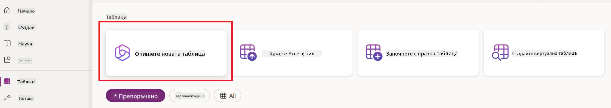
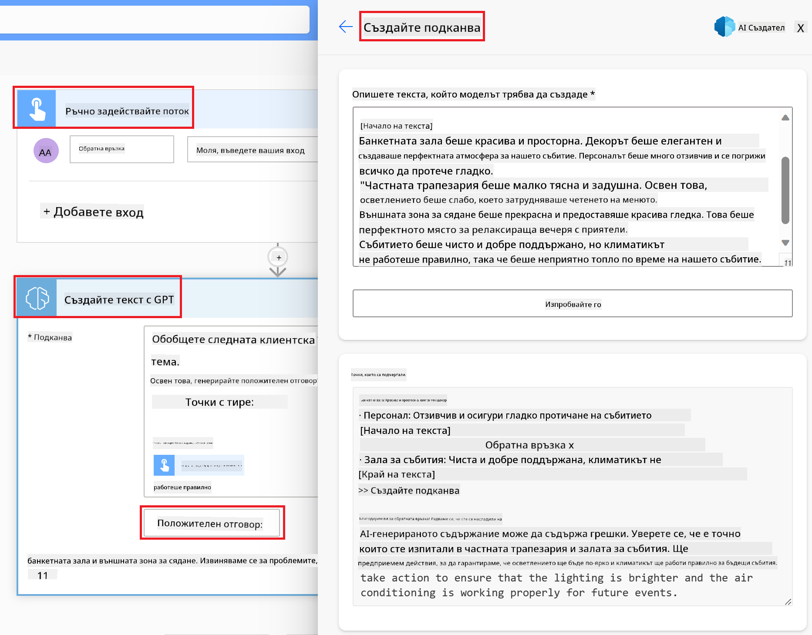

<!--
CO_OP_TRANSLATOR_METADATA:
{
  "original_hash": "846ac8e3b7dcfb697d3309fec05f0fea",
  "translation_date": "2025-10-17T22:18:44+00:00",
  "source_file": "10-building-low-code-ai-applications/README.md",
  "language_code": "bg"
}
-->
# Създаване на AI приложения с нисък код

> _(Кликнете върху изображението по-горе, за да гледате видеото към този урок)_

## Въведение

След като научихме как да създаваме приложения за генериране на изображения, нека поговорим за ниския код. Генеративният AI може да се използва в различни области, включително нисък код, но какво всъщност представлява ниският код и как можем да добавим AI към него?

Създаването на приложения и решения стана по-лесно както за традиционните разработчици, така и за хора без опит в програмирането, благодарение на платформите за разработка с нисък код. Тези платформи позволяват създаването на приложения и решения с малко или никакъв код, като предоставят визуална среда за разработка, която позволява влачене и пускане на компоненти. Това прави процеса на разработка по-бърз и изисква по-малко ресурси. В този урок ще разгледаме подробно как да използваме ниския код и как да го подобрим с помощта на AI чрез Power Platform.

Power Platform предоставя на организациите възможността да овластят своите екипи да създават собствени решения чрез интуитивна среда с нисък или никакъв код. Тази среда опростява процеса на създаване на решения. С Power Platform решенията могат да бъдат създадени за дни или седмици, вместо за месеци или години. Power Platform включва пет основни продукта: Power Apps, Power Automate, Power BI, Power Pages и Copilot Studio.

Този урок обхваща:

- Въведение в генеративния AI в Power Platform
- Въведение в Copilot и как да го използваме
- Използване на генеративен AI за създаване на приложения и потоци в Power Platform
- Разбиране на AI моделите в Power Platform с AI Builder

## Цели на обучението

До края на този урок ще можете:

- Да разберете как работи Copilot в Power Platform.

- Да създадете приложение за проследяване на задачи на ученици за нашия образователен стартъп.

- Да създадете поток за обработка на фактури, който използва AI за извличане на информация от фактури.

- Да приложите най-добрите практики при използване на модела Create Text с GPT AI.

Инструментите и технологиите, които ще използвате в този урок, са:

- **Power Apps**, за приложението за проследяване на задачи на ученици, което предоставя среда за разработка с нисък код за създаване на приложения за проследяване, управление и взаимодействие с данни.

- **Dataverse**, за съхранение на данните за приложението за проследяване на задачи на ученици, където Dataverse предоставя платформа за данни с нисък код за съхранение на данните на приложението.

- **Power Automate**, за потока за обработка на фактури, където ще имате среда за разработка с нисък код за създаване на работни потоци за автоматизиране на процеса на обработка на фактури.

- **AI Builder**, за AI модела за обработка на фактури, където ще използвате предварително изградени AI модели за обработка на фактурите за нашия стартъп.

## Генеративен AI в Power Platform

Подобряването на разработката и приложенията с нисък код чрез генеративен AI е ключова област на фокус за Power Platform. Целта е да се даде възможност на всеки да създава приложения, сайтове, табла и да автоматизира процеси с AI, _без да е необходима експертиза в областта на науката за данни_. Тази цел се постига чрез интегриране на генеративен AI в средата за разработка с нисък код в Power Platform под формата на Copilot и AI Builder.

### Как работи това?

Copilot е AI асистент, който ви позволява да създавате решения в Power Platform, като описвате вашите изисквания в серия от разговорни стъпки, използвайки естествен език. Например, можете да инструктирате вашия AI асистент какви полета да използва вашето приложение и той ще създаде както приложението, така и основния модел на данни, или можете да уточните как да настроите поток в Power Automate.

Можете да използвате функционалностите, управлявани от Copilot, като функция в екраните на вашето приложение, за да позволите на потребителите да откриват информация чрез разговорни взаимодействия.

AI Builder е възможност за AI с нисък код, налична в Power Platform, която ви позволява да използвате AI модели, за да автоматизирате процеси и да предвиждате резултати. С AI Builder можете да добавите AI към вашите приложения и потоци, които се свързват с вашите данни в Dataverse или в различни облачни източници на данни, като SharePoint, OneDrive или Azure.

Copilot е наличен във всички продукти на Power Platform: Power Apps, Power Automate, Power BI, Power Pages и Power Virtual Agents. AI Builder е наличен в Power Apps и Power Automate. В този урок ще се фокусираме върху това как да използваме Copilot и AI Builder в Power Apps и Power Automate, за да създадем решение за нашия образователен стартъп.

### Copilot в Power Apps

Като част от Power Platform, Power Apps предоставя среда за разработка с нисък код за създаване на приложения за проследяване, управление и взаимодействие с данни. Това е набор от услуги за разработка на приложения със скалируема платформа за данни и възможност за свързване с облачни услуги и локални данни. Power Apps позволява създаването на приложения, които работят на браузъри, таблети и телефони и могат да бъдат споделяни с колеги. Power Apps улеснява потребителите в разработката на приложения с прост интерфейс, така че всеки бизнес потребител или професионален разработчик да може да създава персонализирани приложения. Опитът в разработката на приложения също се подобрява с генеративен AI чрез Copilot.

Функцията AI асистент Copilot в Power Apps ви позволява да опишете какъв тип приложение ви е необходимо и каква информация искате вашето приложение да проследява, събира или показва. Copilot след това генерира адаптивно Canvas приложение въз основа на вашето описание. Можете да персонализирате приложението според вашите нужди. AI Copilot също генерира и предлага таблица в Dataverse с полетата, които са ви необходими за съхранение на данните, които искате да проследявате, както и примерни данни. Ще разгледаме какво представлява Dataverse и как можете да го използвате в Power Apps по-късно в този урок. След това можете да персонализирате таблицата според вашите нужди, използвайки функцията AI Copilot асистент чрез разговорни стъпки. Тази функция е лесно достъпна от началния екран на Power Apps.

### Copilot в Power Automate

Като част от Power Platform, Power Automate позволява на потребителите да създават автоматизирани работни потоци между приложения и услуги. Той помага за автоматизиране на повтарящи се бизнес процеси като комуникация, събиране на данни и одобрения на решения. Неговият прост интерфейс позволява на потребителите с всякаква техническа компетентност (от начинаещи до опитни разработчици) да автоматизират работни задачи. Опитът в разработката на работни потоци също се подобрява с генеративен AI чрез Copilot.

Функцията AI асистент Copilot в Power Automate ви позволява да опишете какъв тип поток ви е необходим и какви действия искате вашият поток да изпълнява. Copilot след това генерира поток въз основа на вашето описание. Можете да персонализирате потока според вашите нужди. AI Copilot също генерира и предлага действията, които са ви необходими за изпълнение на задачата, която искате да автоматизирате. Ще разгледаме какво представляват потоците и как можете да ги използвате в Power Automate по-късно в този урок. След това можете да персонализирате действията според вашите нужди, използвайки функцията AI Copilot асистент чрез разговорни стъпки. Тази функция е лесно достъпна от началния екран на Power Automate.

## Задача: Управление на задачи на ученици и фактури за нашия стартъп, използвайки Copilot

Нашият стартъп предоставя онлайн курсове на ученици. Стартъпът се разраства бързо и вече се затруднява да се справи с нарастващото търсене на своите курсове. Стартъпът ви е наел като разработчик на Power Platform, за да им помогнете да създадат решение с нисък код, което да им помогне да управляват задачите на учениците и фактурите. Решението трябва да им помогне да проследяват и управляват задачите на учениците чрез приложение и да автоматизират процеса на обработка на фактури чрез работен поток. От вас се изисква да използвате генеративен AI, за да разработите решението.

Когато започвате да използвате Copilot, можете да използвате [Power Platform Copilot Prompt Library](https://github.com/pnp/powerplatform-prompts?WT.mc_id=academic-109639-somelezediko), за да започнете с подканите. Тази библиотека съдържа списък с подканящи фрази, които можете да използвате за създаване на приложения и потоци с Copilot. Можете също така да използвате подканите в библиотеката, за да получите идея как да опишете вашите изисквания на Copilot.

### Създаване на приложение за проследяване на задачи на ученици за нашия стартъп

Преподавателите в нашия стартъп се затрудняват да проследяват задачите на учениците. Те използват електронна таблица за проследяване на задачите, но това става трудно за управление, тъй като броят на учениците се увеличава. Те са ви помолили да създадете приложение, което да им помогне да проследяват и управляват задачите на учениците. Приложението трябва да им позволява да добавят нови задачи, да преглеждат задачи, да актуализират задачи и да изтриват задачи. Приложението трябва също така да позволява на преподавателите и учениците да виждат задачите, които са оценени, и тези, които не са оценени.

Ще създадете приложението, използвайки Copilot в Power Apps, следвайки стъпките по-долу:

1. Отидете на началния екран на [Power Apps](https://make.powerapps.com?WT.mc_id=academic-105485-koreyst).

1. Използвайте текстовото поле на началния екран, за да опишете приложението, което искате да създадете. Например, **_Искам да създам приложение за проследяване и управление на задачи на ученици_**. Кликнете върху бутона **Изпрати**, за да изпратите подканата на AI Copilot.

1. AI Copilot ще предложи таблица в Dataverse с полетата, които са ви необходими за съхранение на данните, които искате да проследявате, както и примерни данни. След това можете да персонализирате таблицата според вашите нужди, използвайки функцията AI Copilot асистент чрез разговорни стъпки.

   > **Важно**: Dataverse е основната платформа за данни за Power Platform. Това е платформа за данни с нисък код за съхранение на данните на приложението. Това е напълно управлявана услуга, която сигурно съхранява данни в Microsoft Cloud и е предоставена във вашата Power Platform среда. Тя идва с вградени възможности за управление на данни, като класификация на данни, произход на данни, фино управление на достъпа и други. Можете да научите повече за Dataverse [тук](https://docs.microsoft.com/powerapps/maker/data-platform/data-platform-intro?WT.mc_id=academic-109639-somelezediko).

   

1. Преподавателите искат да изпращат имейли на учениците, които са предали своите задачи, за да ги информират за напредъка на задачите им. Можете да използвате Copilot, за да добавите ново поле към таблицата за съхранение на имейлите на учениците. Например, можете да използвате следната подканяща фраза, за да добавите ново поле към таблицата: **_Искам да добавя колона за съхранение на имейлите на учениците_**. Кликнете върху бутона **Изпрати**, за да изпратите подканата на AI Copilot.

1. AI Copilot ще генерира ново поле и след това можете да го персонализирате според вашите нужди.

1. След като приключите с таблицата, кликнете върху бутона **Създай приложение**, за да създадете приложението.

1. AI Copilot ще генерира адаптивно Canvas приложение въз основа на вашето описание. След това можете да персонализирате приложението според вашите нужди.

1. За преподавателите да изпращат имейли на учениците, можете да използвате Copilot, за да добавите нов екран към приложението. Например, можете да използвате следната подканяща фраза, за да добавите нов екран към приложението: **_Искам да добавя екран за изпращане на имейли на учениците_**. Кликнете върху бутона **Изпрати**, за да изпратите подканата на AI Copilot.

1. AI Copilot ще генерира нов екран и след това можете да персонализирате екрана според вашите нужди.

1. След като приключите с приложението, кликнете върху бутона **Запази**, за да запазите приложението.

1. За да споделите приложението с преподавателите, кликнете върху бутона **Сподели**, а след това отново върху бутона **Сподели**. След това можете да споделите приложението с преподавателите, като въведете техните имейл адреси.

> **Вашето домашно задание**: Приложението, което току-що създадохте, е добро начало, но може да бъде подобрено. С функцията за имейли преподавателите могат да изпращат имейли на учениците само ръчно, като трябва да въвеждат техните имейли. Можете ли да използвате Copilot, за да създадете автоматизация, която ще позволи на преподавателите да изпращат имейли на учениците автоматично, когато те предадат своите задачи? Вашият намек е, че с правилната подканяща фраза можете да използвате Copilot в Power Automate, за да създадете това.

### Създаване на таблица за информация за фактури за нашия стартъп

Финансовият екип на нашия стартъп се затруднява да проследява фактурите. Те използват електронна таблица за проследяване на фактурите, но това става трудно за управление, тъй като броят на фактурите се увеличава. Те са ви помолили да създадете таблица, която да им помогне да съхраняват, проследяват и управляват информацията за получените фактури. Таблицата трябва да се използва за създаване на автоматизация, която ще извлича цялата информация за фактурите и ще я съхранява в таблицата. Таблицата трябва също така да позволява на финансовия екип да вижда фактурите, които са платени, и тези, които не са платени.

Power Platform има основна платформа за данни, наречена Dataverse, която ви позволява да съхранявате данните за вашите приложения и решения. Dataverse предоставя платформа за данни с нисък код за съхранение на данните на приложението. Това е напълно управлявана услуга, която сигурно
Защо да използваме Dataverse за нашия стартъп? Стандартните и персонализирани таблици в Dataverse предоставят сигурна и базирана в облака опция за съхранение на вашите данни. Таблиците ви позволяват да съхранявате различни типове данни, подобно на това как бихте използвали множество работни листове в една Excel работна книга. Можете да използвате таблици за съхранение на данни, които са специфични за вашата организация или бизнес нужди. Някои от предимствата, които нашият стартъп ще получи от използването на Dataverse, включват, но не се ограничават до:

- **Лесно управление**: Както метаданните, така и данните се съхраняват в облака, така че не е нужно да се притеснявате за детайлите как се съхраняват или управляват. Можете да се фокусирате върху изграждането на вашите приложения и решения.

- **Сигурност**: Dataverse предоставя сигурна и базирана в облака опция за съхранение на вашите данни. Можете да контролирате кой има достъп до данните в таблиците и как може да ги достъпва, използвайки роля базирана сигурност.

- **Богати метаданни**: Типовете данни и връзките се използват директно в Power Apps.

- **Логика и валидиране**: Можете да използвате бизнес правила, изчислени полета и правила за валидиране, за да наложите бизнес логика и да поддържате точността на данните.

Сега, когато знаете какво е Dataverse и защо трябва да го използвате, нека разгледаме как можете да използвате Copilot, за да създадете таблица в Dataverse, която да отговаря на изискванията на нашия финансов екип.

> **Note** : Ще използвате тази таблица в следващия раздел, за да създадете автоматизация, която ще извлича цялата информация за фактурите и ще я съхранява в таблицата.

За да създадете таблица в Dataverse, използвайки Copilot, следвайте стъпките по-долу:

1. Отидете на началния екран на [Power Apps](https://make.powerapps.com?WT.mc_id=academic-105485-koreyst).

2. В лявата навигационна лента изберете **Tables** и след това кликнете върху **Describe the new Table**.

3. На екрана **Describe the new Table** използвайте текстовото поле, за да опишете таблицата, която искате да създадете. Например, **_Искам да създам таблица за съхранение на информация за фактури_**. Кликнете върху бутона **Send**, за да изпратите заявката към AI Copilot.

4. AI Copilot ще предложи таблица в Dataverse с полетата, които са ви необходими за съхранение на данните, които искате да проследявате, и примерни данни. След това можете да персонализирате таблицата според вашите нужди, използвайки помощната функция на AI Copilot чрез разговорни стъпки.

5. Финансовият екип иска да изпрати имейл на доставчика, за да го информира за текущия статус на неговата фактура. Можете да използвате Copilot, за да добавите ново поле към таблицата за съхранение на имейла на доставчика. Например, можете да използвате следната заявка, за да добавите ново поле към таблицата: **_Искам да добавя колона за съхранение на имейла на доставчика_**. Кликнете върху бутона **Send**, за да изпратите заявката към AI Copilot.

6. AI Copilot ще генерира ново поле и след това можете да персонализирате полето според вашите нужди.

7. След като приключите с таблицата, кликнете върху бутона **Create**, за да създадете таблицата.

## AI модели в Power Platform с AI Builder

AI Builder е възможност за AI с нисък код, налична в Power Platform, която ви позволява да използвате AI модели, за да автоматизирате процеси и да предвиждате резултати. С AI Builder можете да добавите AI към вашите приложения и потоци, които се свързват с вашите данни в Dataverse или в различни облачни източници на данни, като SharePoint, OneDrive или Azure.

## Предварително изградени AI модели срещу персонализирани AI модели

AI Builder предоставя два типа AI модели: предварително изградени AI модели и персонализирани AI модели. Предварително изградени AI модели са готови за използване AI модели, които са обучени от Microsoft и са налични в Power Platform. Те ви помагат да добавите интелигентност към вашите приложения и потоци, без да се налага да събирате данни и след това да изграждате, обучавате и публикувате свои собствени модели. Можете да използвате тези модели за автоматизиране на процеси и предвиждане на резултати.

Някои от предварително изградените AI модели, налични в Power Platform, включват:

- **Извличане на ключови фрази**: Този модел извлича ключови фрази от текст.
- **Разпознаване на език**: Този модел разпознава езика на текста.
- **Анализ на настроения**: Този модел разпознава положителни, отрицателни, неутрални или смесени настроения в текста.
- **Четец на визитни картички**: Този модел извлича информация от визитни картички.
- **Разпознаване на текст**: Този модел извлича текст от изображения.
- **Разпознаване на обекти**: Този модел разпознава и извлича обекти от изображения.
- **Обработка на документи**: Този модел извлича информация от формуляри.
- **Обработка на фактури**: Този модел извлича информация от фактури.

С персонализирани AI модели можете да добавите свой собствен модел в AI Builder, така че той да функционира като всеки персонализиран модел на AI Builder, позволявайки ви да обучавате модела, използвайки свои собствени данни. Можете да използвате тези модели за автоматизиране на процеси и предвиждане на резултати както в Power Apps, така и в Power Automate. Когато използвате свой собствен модел, има ограничения, които се прилагат. Прочетете повече за тези [ограничения](https://learn.microsoft.com/ai-builder/byo-model#limitations?WT.mc_id=academic-105485-koreyst).

## Задача #2 - Създаване на поток за обработка на фактури за нашия стартъп

Финансовият екип има затруднения с обработката на фактури. Те използват електронна таблица за проследяване на фактурите, но това става трудно за управление, тъй като броят на фактурите се увеличава. Те ви помолиха да създадете работен поток, който ще им помогне да обработват фактури, използвайки AI. Работният поток трябва да им позволи да извличат информация от фактури и да съхраняват информацията в таблица в Dataverse. Работният поток трябва също така да им позволи да изпращат имейл до финансовия екип с извлечената информация.

Сега, когато знаете какво е AI Builder и защо трябва да го използвате, нека разгледаме как можете да използвате AI модела за обработка на фактури в AI Builder, който разгледахме по-рано, за да създадете работен поток, който ще помогне на финансовия екип да обработва фактури.

За да създадете работен поток, който ще помогне на финансовия екип да обработва фактури, използвайки AI модела за обработка на фактури в AI Builder, следвайте стъпките по-долу:

1. Отидете на началния екран на [Power Automate](https://make.powerautomate.com?WT.mc_id=academic-105485-koreyst).

2. Използвайте текстовото поле на началния екран, за да опишете работния поток, който искате да създадете. Например, **_Обработи фактура, когато пристигне в моята пощенска кутия_**. Кликнете върху бутона **Send**, за да изпратите заявката към AI Copilot.

   

3. AI Copilot ще предложи действията, които трябва да изпълните, за да автоматизирате задачата, която искате. Можете да кликнете върху бутона **Next**, за да преминете към следващите стъпки.

4. В следващата стъпка Power Automate ще ви подкани да настроите необходимите връзки за потока. След като приключите, кликнете върху бутона **Create flow**, за да създадете потока.

5. AI Copilot ще генерира поток и след това можете да го персонализирате според вашите нужди.

6. Актуализирайте тригера на потока и задайте **Folder** на папката, където ще се съхраняват фактурите. Например, можете да зададете папката на **Inbox**. Кликнете върху **Show advanced options** и задайте **Only with Attachments** на **Yes**. Това ще гарантира, че потокът се изпълнява само когато имейл с прикачен файл бъде получен в папката.

7. Премахнете следните действия от потока: **HTML to text**, **Compose**, **Compose 2**, **Compose 3** и **Compose 4**, защото няма да ги използвате.

8. Премахнете действието **Condition** от потока, защото няма да го използвате. Трябва да изглежда като следния екран:

   

9. Кликнете върху бутона **Add an action** и потърсете **Dataverse**. Изберете действието **Add a new row**.

10. В действието **Extract Information from invoices** актуализирайте **Invoice File**, за да сочи към **Attachment Content** от имейла. Това ще гарантира, че потокът извлича информация от прикачения файл на фактурата.

11. Изберете таблицата, която създадохте по-рано. Например, можете да изберете таблицата **Invoice Information**. Изберете динамичното съдържание от предишното действие, за да попълните следните полета:

    - ID
    - Amount
    - Date
    - Name
    - Status - Задайте **Status** на **Pending**.
    - Supplier Email - Използвайте динамичното съдържание **From** от тригера **When a new email arrives**.

    

12. След като приключите с потока, кликнете върху бутона **Save**, за да запазите потока. След това можете да тествате потока, като изпратите имейл с фактура до папката, която сте посочили в тригера.

> **Вашето домашно**: Потокът, който току-що създадохте, е добро начало, сега трябва да помислите как можете да създадете автоматизация, която ще позволи на нашия финансов екип да изпрати имейл на доставчика, за да го информира за текущия статус на неговата фактура. Вашият намек: потокът трябва да се изпълнява, когато статусът на фактурата се промени.

## Използване на AI модел за генериране на текст в Power Automate

Моделът Create Text with GPT AI в AI Builder ви позволява да генерирате текст въз основа на заявка и се захранва от Microsoft Azure OpenAI Service. С тази възможност можете да интегрирате GPT (Generative Pre-Trained Transformer) технология в вашите приложения и потоци, за да създавате разнообразни автоматизирани потоци и полезни приложения.

GPT моделите преминават през обширно обучение върху огромни количества данни, което им позволява да произвеждат текст, който много прилича на човешки език, когато им бъде предоставена заявка. Когато се интегрират с автоматизация на работни потоци, AI модели като GPT могат да бъдат използвани за оптимизиране и автоматизиране на широк спектър от задачи.

Например, можете да създавате потоци за автоматично генериране на текст за различни случаи на употреба, като: чернови на имейли, описания на продукти и други. Можете също така да използвате модела за генериране на текст за различни приложения, като чатботове и приложения за обслужване на клиенти, които позволяват на агентите за обслужване на клиенти да отговарят ефективно и ефикасно на запитванията на клиентите.

За да научите как да използвате този AI модел в Power Automate, преминете през модула [Add intelligence with AI Builder and GPT](https://learn.microsoft.com/training/modules/ai-builder-text-generation/?WT.mc_id=academic-109639-somelezediko).

## Отлична работа! Продължете с обучението си

След като завършите този урок, разгледайте нашата [Generative AI Learning collection](https://aka.ms/genai-collection?WT.mc_id=academic-105485-koreyst), за да продължите да развивате знанията си за Generative AI!

Преминете към Урок 11, където ще разгледаме как да [интегрираме Generative AI с Function Calling](../11-integrating-with-function-calling/README.md?WT.mc_id=academic-105485-koreyst)!

---

**Отказ от отговорност**:  
Този документ е преведен с помощта на AI услуга за превод [Co-op Translator](https://github.com/Azure/co-op-translator). Въпреки че се стремим към точност, моля, имайте предвид, че автоматизираните преводи могат да съдържат грешки или неточности. Оригиналният документ на неговия роден език трябва да се счита за авторитетен източник. За критична информация се препоръчва професионален човешки превод. Ние не носим отговорност за каквито и да било недоразумения или погрешни интерпретации, произтичащи от използването на този превод.