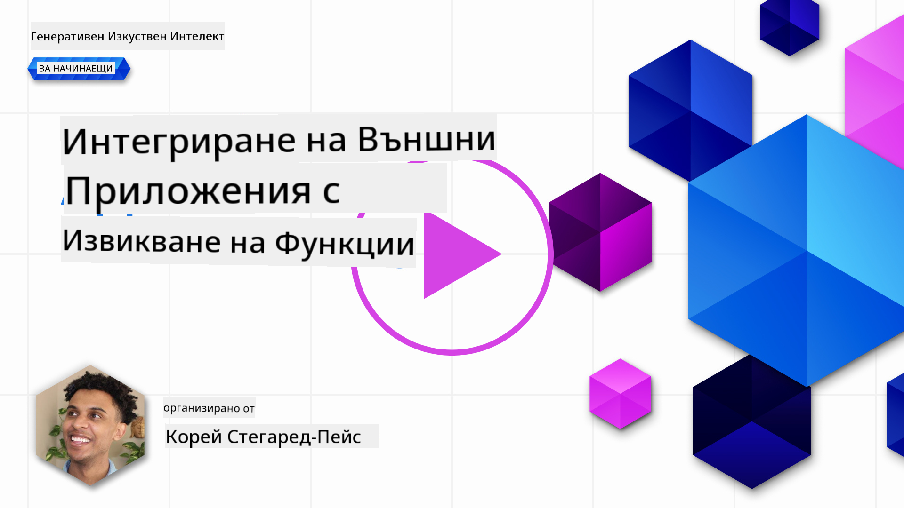
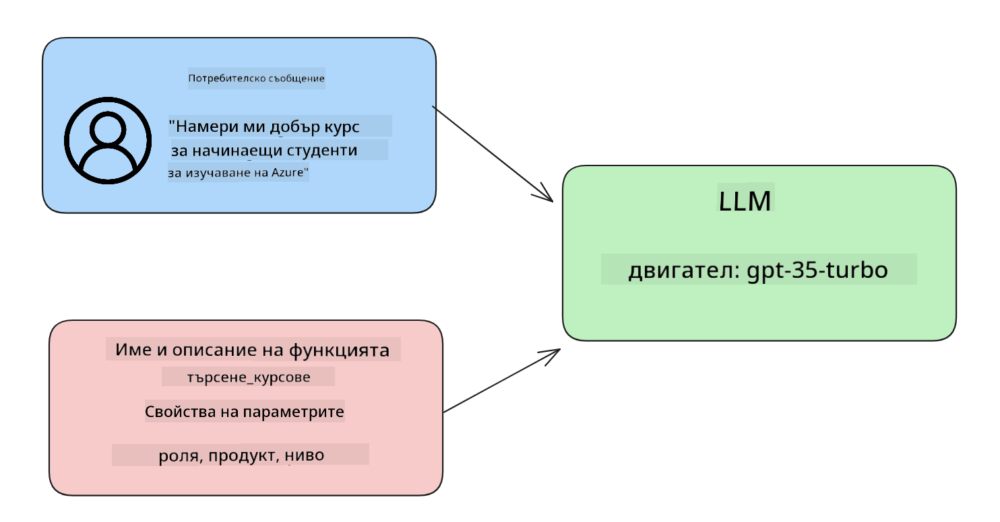

<!--
CO_OP_TRANSLATOR_METADATA:
{
  "original_hash": "77a48a201447be19aa7560706d6f93a0",
  "translation_date": "2025-07-09T14:43:46+00:00",
  "source_file": "11-integrating-with-function-calling/README.md",
  "language_code": "bg"
}
-->
# Интегриране с извикване на функции

[](https://aka.ms/gen-ai-lesson11-gh?WT.mc_id=academic-105485-koreyst)

Досега научихте доста от предишните уроци. Въпреки това, можем да се усъвършенстваме още. Някои от нещата, които можем да подобрим, са как да получим по-последователен формат на отговорите, за да улесним работата с тях по-нататък. Също така, може да искаме да добавим данни от други източници, за да обогатим още повече нашето приложение.

Гореспоменатите проблеми са тези, които този раздел цели да реши.

## Въведение

В този урок ще разгледаме:

- Обяснение какво е извикване на функции и кога се използва.
- Създаване на извикване на функция с Azure OpenAI.
- Как да интегрираме извикване на функция в приложение.

## Цели на обучението

Към края на този урок ще можете да:

- Обясните целта на използването на извикване на функции.
- Настроите извикване на функция с помощта на Azure OpenAI Service.
- Проектирате ефективни извиквания на функции за конкретния случай на вашето приложение.

## Сценарий: Подобряване на нашия чатбот с функции

За този урок искаме да създадем функция за нашия образователен стартъп, която позволява на потребителите да използват чатбот, за да намерят технически курсове. Ще препоръчваме курсове, които отговарят на нивото им на умения, текущата им роля и интересуващата ги технология.

За да изпълним този сценарий, ще използваме комбинация от:

- `Azure OpenAI` за създаване на чат изживяване за потребителя.
- `Microsoft Learn Catalog API`, който помага на потребителите да намерят курсове според техните заявки.
- `Function Calling`, за да вземем заявката на потребителя и да я изпратим към функция, която да направи API заявката.

За да започнем, нека разгледаме защо изобщо бихме искали да използваме извикване на функции:

## Защо извикване на функции

Преди извикването на функции, отговорите от LLM бяха неструктурирани и непоследователни. Разработчиците трябваше да пишат сложен код за валидация, за да могат да обработват всяка възможна вариация на отговор. Потребителите не можеха да получат отговори на въпроси като "Какво е текущото време в Стокхолм?". Това се дължи на ограничението на моделите да работят само с данни, с които са били обучени.

Извикването на функции е функция на Azure OpenAI Service, която преодолява следните ограничения:

- **Последователен формат на отговорите**. Ако можем по-добре да контролираме формата на отговора, можем по-лесно да интегрираме отговора в други системи.
- **Външни данни**. Възможност за използване на данни от други източници в приложението в контекста на чат.

## Илюстриране на проблема чрез сценарий

> Препоръчваме да използвате [включения тетрадка](python/aoai-assignment.ipynb), ако искате да изпълните долния сценарий. Можете и просто да четете, докато илюстрираме проблем, който функциите могат да помогнат да се реши.

Нека разгледаме пример, който илюстрира проблема с формата на отговора:

Да кажем, че искаме да създадем база данни със студентски данни, за да можем да им предложим подходящ курс. По-долу имаме две описания на студенти, които са много сходни по съдържание.

1. Създаване на връзка с нашия Azure OpenAI ресурс:

   ```python
   import os
   import json
   from openai import AzureOpenAI
   from dotenv import load_dotenv
   load_dotenv()

   client = AzureOpenAI(
   api_key=os.environ['AZURE_OPENAI_API_KEY'],  # this is also the default, it can be omitted
   api_version = "2023-07-01-preview"
   )

   deployment=os.environ['AZURE_OPENAI_DEPLOYMENT']
   ```

   По-долу е Python код за конфигуриране на връзката с Azure OpenAI, където задаваме `api_type`, `api_base`, `api_version` и `api_key`.

1. Създаване на две описания на студенти с променливите `student_1_description` и `student_2_description`.

   ```python
   student_1_description="Emily Johnson is a sophomore majoring in computer science at Duke University. She has a 3.7 GPA. Emily is an active member of the university's Chess Club and Debate Team. She hopes to pursue a career in software engineering after graduating."

   student_2_description = "Michael Lee is a sophomore majoring in computer science at Stanford University. He has a 3.8 GPA. Michael is known for his programming skills and is an active member of the university's Robotics Club. He hopes to pursue a career in artificial intelligence after finishing his studies."
   ```

   Искаме да изпратим горните описания на студенти към LLM, за да анализира данните. Тези данни по-късно могат да се използват в нашето приложение и да се изпратят към API или да се съхранят в база данни.

1. Нека създадем два идентични промпта, в които инструктираме LLM каква информация ни интересува:

   ```python
   prompt1 = f'''
   Please extract the following information from the given text and return it as a JSON object:

   name
   major
   school
   grades
   club

   This is the body of text to extract the information from:
   {student_1_description}
   '''

   prompt2 = f'''
   Please extract the following information from the given text and return it as a JSON object:

   name
   major
   school
   grades
   club

   This is the body of text to extract the information from:
   {student_2_description}
   '''
   ```

   Горните промпти инструктират LLM да извлече информация и да върне отговора във формат JSON.

1. След като настроим промптите и връзката с Azure OpenAI, сега ще изпратим промптите към LLM, използвайки `openai.ChatCompletion`. Съхраняваме промпта в променливата `messages` и задаваме ролята `user`. Това имитира съобщение от потребител, изпратено към чатбот.

   ```python
   # response from prompt one
   openai_response1 = client.chat.completions.create(
   model=deployment,
   messages = [{'role': 'user', 'content': prompt1}]
   )
   openai_response1.choices[0].message.content

   # response from prompt two
   openai_response2 = client.chat.completions.create(
   model=deployment,
   messages = [{'role': 'user', 'content': prompt2}]
   )
   openai_response2.choices[0].message.content
   ```

Сега можем да изпратим и двете заявки към LLM и да разгледаме получения отговор, като го намерим така: `openai_response1['choices'][0]['message']['content']`.

1. Накрая можем да конвертираме отговора във формат JSON, като извикаме `json.loads`:

   ```python
   # Loading the response as a JSON object
   json_response1 = json.loads(openai_response1.choices[0].message.content)
   json_response1
   ```

   Отговор 1:

   ```json
   {
     "name": "Emily Johnson",
     "major": "computer science",
     "school": "Duke University",
     "grades": "3.7",
     "club": "Chess Club"
   }
   ```

   Отговор 2:

   ```json
   {
     "name": "Michael Lee",
     "major": "computer science",
     "school": "Stanford University",
     "grades": "3.8 GPA",
     "club": "Robotics Club"
   }
   ```

   Въпреки че промптите са еднакви и описанията са сходни, виждаме, че стойностите на свойството `Grades` са форматирани по различен начин, например понякога получаваме формата `3.7`, а друг път `3.7 GPA`.

   Този резултат се дължи на това, че LLM приема неструктурирани данни под формата на написания промпт и връща също неструктурирани данни. Нуждаем се от структуриран формат, за да знаем какво да очакваме при съхранение или използване на тези данни.

Тогава как решаваме проблема с форматирането? Чрез използване на извикване на функции можем да сме сигурни, че ще получим обратно структурирани данни. При използване на извикване на функции, LLM всъщност не извиква или изпълнява функции. Вместо това създаваме структура, която LLM трябва да следва в отговорите си. След това използваме тези структурирани отговори, за да знаем коя функция да изпълним в нашите приложения.


След това можем да вземем това, което функцията връща, и да го изпратим обратно към LLM. LLM ще отговори с естествен език, за да отговори на заявката на потребителя.

## Приложения на извикване на функции

Има много различни случаи, в които извикването на функции може да подобри вашето приложение, като например:

- **Извикване на външни инструменти**. Чатботовете са отлични в предоставянето на отговори на въпроси от потребителите. Чрез използване на извикване на функции, чатботовете могат да използват съобщенията от потребителите, за да изпълнят определени задачи. Например, студент може да поиска от чатбота да "Изпрати имейл на моя преподавател, че имам нужда от повече помощ по този предмет". Това може да направи извикване на функция `send_email(to: string, body: string)`.

- **Създаване на заявки към API или база данни**. Потребителите могат да търсят информация с естествен език, която се преобразува в форматирана заявка или API повикване. Пример за това може да бъде учител, който пита "Кои са студентите, които са завършили последното задание", което може да извика функция с име `get_completed(student_name: string, assignment: int, current_status: string)`.

- **Създаване на структурирани данни**. Потребителите могат да вземат блок текст или CSV и да използват LLM, за да извлекат важна информация от него. Например, студент може да преобразува статия от Wikipedia за мирни споразумения, за да създаде AI флашкарти. Това може да стане чрез функция `get_important_facts(agreement_name: string, date_signed: string, parties_involved: list)`.

## Създаване на първото ви извикване на функция

Процесът на създаване на извикване на функция включва 3 основни стъпки:

1. **Извикване** на Chat Completions API с листа на вашите функции и съобщение от потребител.
2. **Четене** на отговора на модела, за да се извърши действие, т.е. изпълнение на функция или API повикване.
3. **Извършване** на друго извикване към Chat Completions API с отговора от вашата функция, за да използвате тази информация за създаване на отговор към потребителя.



### Стъпка 1 - създаване на съобщения

Първата стъпка е да създадем съобщение от потребител. То може да се зададе динамично, като вземете стойността от текстов вход, или можете да зададете стойност тук. Ако това е първият ви път да работите с Chat Completions API, трябва да дефинираме `role` и `content` на съобщението.

`role` може да бъде `system` (създаване на правила), `assistant` (моделът) или `user` (крайният потребител). За извикване на функции ще зададем `user` и примерен въпрос.

```python
messages= [ {"role": "user", "content": "Find me a good course for a beginner student to learn Azure."} ]
```

Чрез задаване на различни роли, на LLM става ясно дали системата казва нещо или потребителят, което помага за изграждане на история на разговора, върху която LLM може да надгражда.

### Стъпка 2 - създаване на функции

След това ще дефинираме функция и параметрите ѝ. Тук ще използваме само една функция, наречена `search_courses`, но можете да създадете и няколко функции.

> **Важно** : Функциите се включват в системното съобщение към LLM и се броят към наличните токени, които имате.

По-долу създаваме функциите като масив от елементи. Всеки елемент е функция и има свойства `name`, `description` и `parameters`:

```python
functions = [
   {
      "name":"search_courses",
      "description":"Retrieves courses from the search index based on the parameters provided",
      "parameters":{
         "type":"object",
         "properties":{
            "role":{
               "type":"string",
               "description":"The role of the learner (i.e. developer, data scientist, student, etc.)"
            },
            "product":{
               "type":"string",
               "description":"The product that the lesson is covering (i.e. Azure, Power BI, etc.)"
            },
            "level":{
               "type":"string",
               "description":"The level of experience the learner has prior to taking the course (i.e. beginner, intermediate, advanced)"
            }
         },
         "required":[
            "role"
         ]
      }
   }
]
```

Нека опишем всяка функция по-подробно:

- `name` - Името на функцията, която искаме да бъде извикана.
- `description` - Описание как работи функцията. Тук е важно да бъдем конкретни и ясни.
- `parameters` - Списък със стойности и формат, които искаме моделът да използва в отговора си. Масивът `parameters` съдържа елементи с следните свойства:
  1.  `type` - Типът данни, в който ще се съхраняват свойствата.
  1.  `properties` - Списък със специфичните стойности, които моделът ще използва в отговора си.
      1. `name` - Ключът е името на свойството, което моделът ще използва във форматирания отговор, например `product`.
      1. `type` - Типът данни на това свойство, например `string`.
      1. `description` - Описание на конкретното свойство.

Има и опционално свойство `required` - задължително свойство за изпълнение на извикването на функцията.

### Стъпка 3 - Извършване на извикването на функция

След като дефинираме функция, сега трябва да я включим в извикването към Chat Completion API. Това става чрез добавяне на `functions` към заявката. В този случай `functions=functions`.

Има и опция да зададете `function_call` на `auto`. Това означава, че ще оставим LLM да реши коя функция да извика въз основа на съобщението на потребителя, вместо да я задаваме ние.

Ето малко код по-долу, където извикваме `ChatCompletion.create`, като задаваме `functions=functions` и `function_call="auto"`, давайки на LLM възможността да избира кога да извика предоставените функции:

```python
response = client.chat.completions.create(model=deployment,
                                        messages=messages,
                                        functions=functions,
                                        function_call="auto")

print(response.choices[0].message)
```

Отговорът, който получаваме, изглежда така:

```json
{
  "role": "assistant",
  "function_call": {
    "name": "search_courses",
    "arguments": "{\n  \"role\": \"student\",\n  \"product\": \"Azure\",\n  \"level\": \"beginner\"\n}"
  }
}
```

Тук виждаме как функцията `search_courses` е била извикана и с какви аргументи, изброени в свойството `arguments` в JSON отговора.

Заключението е, че LLM е успял да намери данните, които да съответстват на аргументите на функцията, като ги е извлякъл от стойността, подадена в параметъра `messages` в извикването на чат завършване. По-долу е припомняне на стойността на `messages`:

```python
messages= [ {"role": "user", "content": "Find me a good course for a beginner student to learn Azure."} ]
```

Както виждате, `student`, `Azure` и `beginner` са извлечени от `messages` и зададени като вход към функцията. Използването на функции по този начин е отличен начин да се извлече информация от промпт, но и да се осигури структура на LLM и да се създаде многократно използваема функционалност.

Следва да видим как можем да използваме това в нашето приложение.

## Интегриране на извиквания на функции в приложение

След като тествахме форматирания отговор от LLM, сега можем да го интегрираме в приложение.

### Управление на потока

За да го интегрираме в нашето приложение, нека предприемем следните стъпки:

1. Първо, нека направим извикване към OpenAI услугите и съхраним съобщението в променлива, наречена `response_message`.

   ```python
   response_message = response.choices[0].message
   ```

1. Сега ще дефинираме функцията, която ще извика Microsoft Learn API, за да получи списък с курсове:

   ```python
   import requests

   def search_courses(role, product, level):
     url = "https://learn.microsoft.com/api/catalog/"
     params = {
        "role": role,
        "product": product,
        "level": level
     }
     response = requests.get(url, params=params)
     modules = response.json()["modules"]
     results = []
     for module in modules[:5]:
        title = module["title"]
        url = module["url"]
        results.append({"title": title, "url": url})
     return str(results)
   ```

   Обърнете внимание, че сега създаваме реална Python функция, която съответства на имената на функциите, въведени в променливата `functions`. Също така правим реални външни API повиквания, за да вземем нужните данни. В този случай използваме Microsoft Learn API, за да търсим обучителни модули.

Добре, създадохме променливата `functions` и съответстваща Python функция, как да кажем на LLM как да ги свърже, за да бъде извикана нашата Python функция?

1. За да проверим дали трябва да извикаме Python функция, трябва да разгледаме отговора на LLM и да видим дали `function_call` е част от него и да извикаме посочената функция. Ето как можете да направите тази проверка:

   ```python
   # Check if the model wants to call a function
   if response_message.function_call.name:
    print("Recommended Function call:")
    print(response_message.function_call.name)
    print()

    # Call the function.
    function_name = response_message.function_call.name

    available_functions = {
            "search_courses": search_courses,
    }
    function_to_call = available_functions[function_name]

    function_args = json.loads(response_message.function_call.arguments)
    function_response = function_to_call(**function_args)

    print("Output of function call:")
    print(function_response)
    print(type(function_response))


    # Add the assistant response and function response to the messages
    messages.append( # adding assistant response to messages
        {
            "role": response_message.role,
            "function_call": {
                "name": function_name,
                "arguments": response_message.function_call.arguments,
            },
            "content": None
        }
    )
    messages.append( # adding function response to messages
        {
            "role": "function",
            "name": function_name,
            "content":function_response,
        }
    )
   ```

   Тези три реда гарантират, че извличаме името на функцията, аргументите и извършваме извикването:

   ```python
   function_to_call = available_functions[function_name]

   function_args = json.loads(response_message.function_call.arguments)
   function_response = function_to_call(**function_args)
   ```

   По-долу е изходът от изпълнението на нашия код:

   **Изход**

   ```Recommended Function call:
   {
     "name": "search_courses",
     "arguments": "{\n  \"role\": \"student\",\n  \"product\": \"Azure\",\n  \"level\": \"beginner\"\n}"
   }

   Output of function call:
   [{'title': 'Describe concepts of cryptography', 'url': 'https://learn.microsoft.com/training/modules/describe-concepts-of-cryptography/?
   WT.mc_id=api_CatalogApi'}, {'title': 'Introduction to audio classification with TensorFlow', 'url': 'https://learn.microsoft.com/en-
   us/training/modules/intro-audio-classification-tensorflow/?WT.mc_id=api_CatalogApi'}, {'title': 'Design a Performant Data Model in Azure SQL
   Database with Azure Data Studio', 'url': 'https://learn.microsoft.com/training/modules/design-a-data-model-with-ads/?
   WT.mc_id=api_CatalogApi'}, {'title': 'Getting started with the Microsoft Cloud Adoption Framework for Azure', 'url':
   'https://learn.microsoft.com/training/modules/cloud-adoption-framework-getting-started/?WT.mc_id=api_CatalogApi'}, {'title': 'Set up the
   Rust development environment', 'url': 'https://learn.microsoft.com/training/modules/rust-set-up-environment/?WT.mc_id=api_CatalogApi'}]
   <class 'str'>
   ```

1. Сега ще изпратим обновеното съобщение, `messages`, към LLM, за да получим отговор на естествен език, вместо JSON формат от API.

   ```python
   print("Messages in next request:")
   print(messages)
   print()

   second_response = client.chat.completions.create(
      messages=messages,
      model=deployment,
      function_call="auto",
      functions=functions,
      temperature=0
         )  # get a new response from GPT where it can see the function response


   print(second_response.choices[0].message)
   ```

   **Изход**

   ```python
   {
     "role": "assistant",
     "content": "I found some good courses for beginner students to learn Azure:\n\n1. [Describe concepts of cryptography] (https://learn.microsoft.com/training/modules/describe-concepts-of-cryptography/?WT.mc_id=api_CatalogApi)\n2. [Introduction to audio classification with TensorFlow](https://learn.microsoft.com/training/modules/intro-audio-classification-tensorflow/?WT.mc_id=api_CatalogApi)\n3. [Design a Performant Data Model in Azure SQL Database with Azure Data Studio](https://learn.microsoft.com/training/modules/design-a-data-model-with-ads/?WT.mc_id=api_CatalogApi)\n4. [Getting started with the Microsoft Cloud Adoption Framework for Azure](https://learn.microsoft.com/training/modules/cloud-adoption-framework-getting-started/?WT.mc_id=api_CatalogApi)\n5. [Set up the Rust development environment](https://learn.microsoft.com/training/modules/rust-set-up-environment/?WT.mc_id=api_CatalogApi)\n\nYou can click on the links to access the courses."
   }

   ```

## Задача

За да продължите обучението си по Azure OpenAI Function Calling, можете да създадете:

- Повече параметри на функцията, които да помогнат на обучаващите се да намерят повече курсове.
- Да създадете друго извикване на функция, което взема повече информация от обучаващия се, като например родния му език.
- Да добавите обработка на грешки, когато извикването на функция и/или API заявката не връщат подходящи курсове.
## Отлична работа! Продължавай напред

След като завършите този урок, разгледайте нашата [Generative AI Learning collection](https://aka.ms/genai-collection?WT.mc_id=academic-105485-koreyst), за да продължите да развивате знанията си за Генеративния ИИ!

Отидете на Урок 12, където ще разгледаме как да [проектираме UX за AI приложения](../12-designing-ux-for-ai-applications/README.md?WT.mc_id=academic-105485-koreyst)!

**Отказ от отговорност**:  
Този документ е преведен с помощта на AI преводаческа услуга [Co-op Translator](https://github.com/Azure/co-op-translator). Въпреки че се стремим към точност, моля, имайте предвид, че автоматизираните преводи могат да съдържат грешки или неточности. Оригиналният документ на неговия роден език трябва да се счита за авторитетен източник. За критична информация се препоръчва професионален човешки превод. Ние не носим отговорност за каквито и да е недоразумения или неправилни тълкувания, произтичащи от използването на този превод.