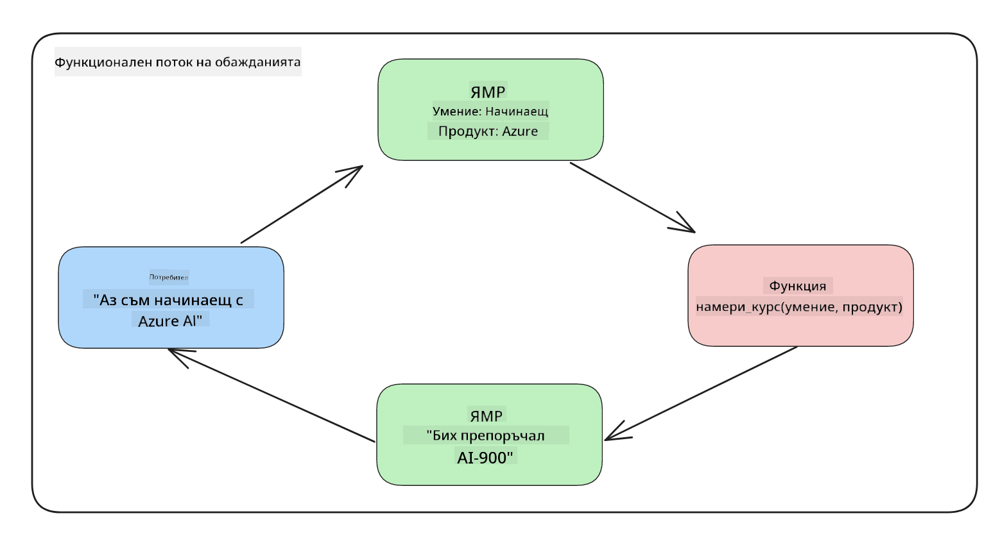
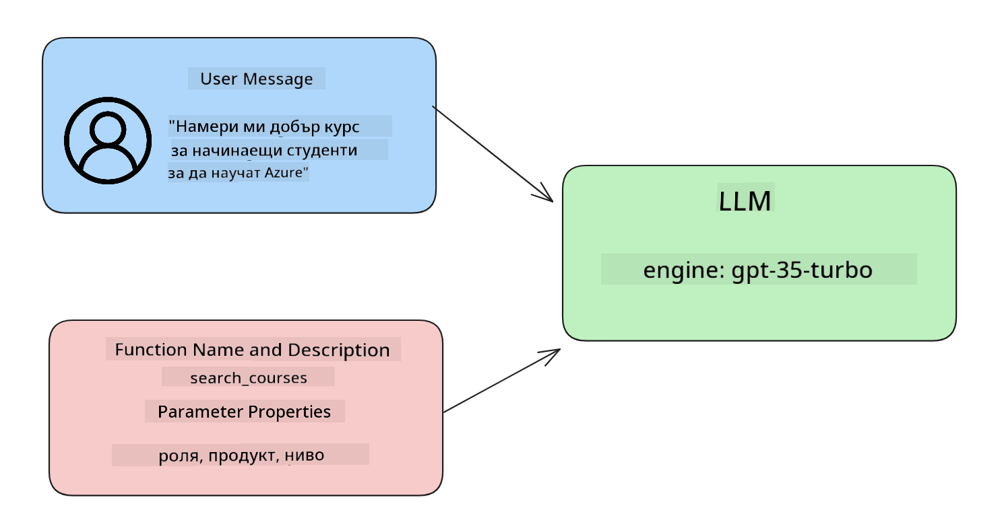

<!--
CO_OP_TRANSLATOR_METADATA:
{
  "original_hash": "77a48a201447be19aa7560706d6f93a0",
  "translation_date": "2025-05-19T21:38:32+00:00",
  "source_file": "11-integrating-with-function-calling/README.md",
  "language_code": "bg"
}
-->
# Интегриране с извикване на функции

[](https://aka.ms/gen-ai-lesson11-gh?WT.mc_id=academic-105485-koreyst)

Научихте доста досега в предишните уроци. Въпреки това, можем да се подобрим още повече. Някои неща, които можем да адресираме, са как да получим по-консистентен формат на отговор, за да улесним работата с отговора надолу по веригата. Освен това може да искаме да добавим данни от други източници, за да обогатим допълнително нашето приложение.

Споменатите по-горе проблеми са това, което тази глава се стреми да разреши.

## Въведение

Този урок ще обхване:

- Обяснение какво представлява извикването на функции и неговите случаи на употреба.
- Създаване на извикване на функция с помощта на Azure OpenAI.
- Как да интегрирате извикване на функция в приложение.

## Цели на обучението

До края на този урок ще можете:

- Да обясните целта на използването на извикване на функции.
- Настройка на извикване на функция с помощта на Azure OpenAI Service.
- Проектиране на ефективни извиквания на функции за вашия случай на употреба в приложението.

## Сценарий: Подобряване на нашия чатбот с функции

За този урок искаме да създадем функция за нашия стартап за образование, която позволява на потребителите да използват чатбот за намиране на технически курсове. Ще препоръчваме курсове, които отговарят на тяхното ниво на умения, текуща роля и интерес към технологиите.

За да завършим този сценарий, ще използваме комбинация от:

- `Azure OpenAI` за създаване на чат преживяване за потребителя.
- `Microsoft Learn Catalog API` за помощ на потребителите да намерят курсове въз основа на тяхната заявка.
- `Function Calling` за вземане на запитването на потребителя и изпращането му към функция за изпълнение на API заявка.

За да започнем, нека разгледаме защо бихме искали да използваме извикване на функции на първо място:

## Защо извикване на функции

Преди извикването на функции, отговорите от LLM бяха неструктурирани и непоследователни. Разработчиците трябваше да пишат сложен код за валидиране, за да се уверят, че могат да се справят с всяка вариация на отговор. Потребителите не можеха да получат отговори като "Какво е текущото време в Стокхолм?". Това е така, защото моделите бяха ограничени до времето, когато данните бяха обучени.

Извикването на функции е функция на Azure OpenAI Service, за да преодолее следните ограничения:

- **Консистентен формат на отговор**. Ако можем да контролираме по-добре формата на отговора, можем по-лесно да интегрираме отговора надолу по веригата към други системи.
- **Външни данни**. Възможност за използване на данни от други източници на приложение в контекста на чат.

## Илюстрация на проблема чрез сценарий

> Препоръчваме ви да използвате [включения бележник](../../../11-integrating-with-function-calling/python/aoai-assignment.ipynb), ако искате да изпълните следния сценарий. Можете също така просто да четете, докато се опитваме да илюстрираме проблем, където функциите могат да помогнат за решаването му.

Нека разгледаме примера, който илюстрира проблема с формата на отговора:

Да кажем, че искаме да създадем база данни с данни за ученици, за да можем да им предложим правилния курс. По-долу имаме две описания на ученици, които са много сходни по данните, които съдържат.

1. Създайте връзка към нашия ресурс Azure OpenAI:

   ```python
   import os
   import json
   from openai import AzureOpenAI
   from dotenv import load_dotenv
   load_dotenv()

   client = AzureOpenAI(
   api_key=os.environ['AZURE_OPENAI_API_KEY'],  # this is also the default, it can be omitted
   api_version = "2023-07-01-preview"
   )

   deployment=os.environ['AZURE_OPENAI_DEPLOYMENT']
   ```

   По-долу е даден Python код за конфигуриране на нашата връзка с Azure OpenAI, където задаваме `api_type`, `api_base`, `api_version` and `api_key`.

1. Creating two student descriptions using variables `student_1_description` and `student_2_description`.

   ```python
   student_1_description="Emily Johnson is a sophomore majoring in computer science at Duke University. She has a 3.7 GPA. Emily is an active member of the university's Chess Club and Debate Team. She hopes to pursue a career in software engineering after graduating."

   student_2_description = "Michael Lee is a sophomore majoring in computer science at Stanford University. He has a 3.8 GPA. Michael is known for his programming skills and is an active member of the university's Robotics Club. He hopes to pursue a career in artificial intelligence after finishing his studies."
   ```

   Искаме да изпратим горните описания на учениците на LLM, за да анализираме данните. Тези данни могат по-късно да бъдат използвани в нашето приложение и да бъдат изпратени на API или съхранени в база данни.

1. Нека създадем две идентични подканяния, в които инструктираме LLM каква информация ни интересува:

   ```python
   prompt1 = f'''
   Please extract the following information from the given text and return it as a JSON object:

   name
   major
   school
   grades
   club

   This is the body of text to extract the information from:
   {student_1_description}
   '''

   prompt2 = f'''
   Please extract the following information from the given text and return it as a JSON object:

   name
   major
   school
   grades
   club

   This is the body of text to extract the information from:
   {student_2_description}
   '''
   ```

   Горните подканяния инструктират LLM да извлече информация и да върне отговора във формат JSON.

1. След като настроим подканянията и връзката с Azure OpenAI, сега ще изпратим подканянията към LLM, използвайки `openai.ChatCompletion`. We store the prompt in the `messages` variable and assign the role to `user`. Това е за имитация на съобщение от потребител, написано на чатбот.

   ```python
   # response from prompt one
   openai_response1 = client.chat.completions.create(
   model=deployment,
   messages = [{'role': 'user', 'content': prompt1}]
   )
   openai_response1.choices[0].message.content

   # response from prompt two
   openai_response2 = client.chat.completions.create(
   model=deployment,
   messages = [{'role': 'user', 'content': prompt2}]
   )
   openai_response2.choices[0].message.content
   ```

Сега можем да изпратим и двете заявки към LLM и да разгледаме отговора, който получаваме, като го намерим така: `openai_response1['choices'][0]['message']['content']`.

1. Lastly, we can convert the response to JSON format by calling `json.loads`:

   ```python
   # Loading the response as a JSON object
   json_response1 = json.loads(openai_response1.choices[0].message.content)
   json_response1
   ```

   Отговор 1:

   ```json
   {
     "name": "Emily Johnson",
     "major": "computer science",
     "school": "Duke University",
     "grades": "3.7",
     "club": "Chess Club"
   }
   ```

   Отговор 2:

   ```json
   {
     "name": "Michael Lee",
     "major": "computer science",
     "school": "Stanford University",
     "grades": "3.8 GPA",
     "club": "Robotics Club"
   }
   ```

   Въпреки че подканянията са еднакви и описанията са сходни, виждаме стойности на `Grades` property formatted differently, as we can sometimes get the format `3.7` or `3.7 GPA` for example.

   This result is because the LLM takes unstructured data in the form of the written prompt and returns also unstructured data. We need to have a structured format so that we know what to expect when storing or using this data

So how do we solve the formatting problem then? By using functional calling, we can make sure that we receive structured data back. When using function calling, the LLM does not actually call or run any functions. Instead, we create a structure for the LLM to follow for its responses. We then use those structured responses to know what function to run in our applications.



We can then take what is returned from the function and send this back to the LLM. The LLM will then respond using natural language to answer the user's query.

## Use Cases for using function calls

There are many different use cases where function calls can improve your app like:

- **Calling External Tools**. Chatbots are great at providing answers to questions from users. By using function calling, the chatbots can use messages from users to complete certain tasks. For example, a student can ask the chatbot to "Send an email to my instructor saying I need more assistance with this subject". This can make a function call to `send_email(to: string, body: string)`

- **Create API or Database Queries**. Users can find information using natural language that gets converted into a formatted query or API request. An example of this could be a teacher who requests "Who are the students that completed the last assignment" which could call a function named `get_completed(student_name: string, assignment: int, current_status: string)`

- **Creating Structured Data**. Users can take a block of text or CSV and use the LLM to extract important information from it. For example, a student can convert a Wikipedia article about peace agreements to create AI flashcards. This can be done by using a function called `get_important_facts(agreement_name: string, date_signed: string, parties_involved: list)`

## Creating Your First Function Call

The process of creating a function call includes 3 main steps:

1. **Calling** the Chat Completions API with a list of your functions and a user message.
2. **Reading** the model's response to perform an action i.e. execute a function or API Call.
3. **Making** another call to Chat Completions API with the response from your function to use that information to create a response to the user.



### Step 1 - creating messages

The first step is to create a user message. This can be dynamically assigned by taking the value of a text input or you can assign a value here. If this is your first time working with the Chat Completions API, we need to define the `role` and the `content` of the message.

The `role` can be either `system` (creating rules), `assistant` (the model) or `user` (the end-user). For function calling, we will assign this as `user` и примерен въпрос.

```python
messages= [ {"role": "user", "content": "Find me a good course for a beginner student to learn Azure."} ]
```

Чрез назначаване на различни роли става ясно на LLM дали системата казва нещо или потребителят, което помага за изграждането на история на разговор, върху която LLM може да се основава.

### Стъпка 2 - създаване на функции

След това ще дефинираме функция и параметрите на тази функция. Ще използваме само една функция тук, наречена `search_courses` but you can create multiple functions.

> **Important** : Functions are included in the system message to the LLM and will be included in the amount of available tokens you have available.

Below, we create the functions as an array of items. Each item is a function and has properties `name`, `description` and `parameters`:

```python
functions = [
   {
      "name":"search_courses",
      "description":"Retrieves courses from the search index based on the parameters provided",
      "parameters":{
         "type":"object",
         "properties":{
            "role":{
               "type":"string",
               "description":"The role of the learner (i.e. developer, data scientist, student, etc.)"
            },
            "product":{
               "type":"string",
               "description":"The product that the lesson is covering (i.e. Azure, Power BI, etc.)"
            },
            "level":{
               "type":"string",
               "description":"The level of experience the learner has prior to taking the course (i.e. beginner, intermediate, advanced)"
            }
         },
         "required":[
            "role"
         ]
      }
   }
]
```

Нека опишем всяка инстанция на функцията по-подробно по-долу:

- `name` - The name of the function that we want to have called.
- `description` - This is the description of how the function works. Here it's important to be specific and clear.
- `parameters` - A list of values and format that you want the model to produce in its response. The parameters array consists of items where the items have the following properties:
  1.  `type` - The data type of the properties will be stored in.
  1.  `properties` - List of the specific values that the model will use for its response
      1. `name` - The key is the name of the property that the model will use in its formatted response, for example, `product`.
      1. `type` - The data type of this property, for example, `string`.
      1. `description` - Description of the specific property.

There's also an optional property `required` - required property for the function call to be completed.

### Step 3 - Making the function call

After defining a function, we now need to include it in the call to the Chat Completion API. We do this by adding `functions` to the request. In this case `functions=functions`.

There is also an option to set `function_call` to `auto`. This means we will let the LLM decide which function should be called based on the user message rather than assigning it ourselves.

Here's some code below where we call `ChatCompletion.create`, note how we set `functions=functions` and `function_call="auto"` и по този начин даваме на LLM избора кога да извика функциите, които му предоставяме:

```python
response = client.chat.completions.create(model=deployment,
                                        messages=messages,
                                        functions=functions,
                                        function_call="auto")

print(response.choices[0].message)
```

Отговорът, който се връща, изглежда така:

```json
{
  "role": "assistant",
  "function_call": {
    "name": "search_courses",
    "arguments": "{\n  \"role\": \"student\",\n  \"product\": \"Azure\",\n  \"level\": \"beginner\"\n}"
  }
}
```

Тук можем да видим как функцията `search_courses` was called and with what arguments, as listed in the `arguments` property in the JSON response.

The conclusion the LLM was able to find the data to fit the arguments of the function as it was extracting it from the value provided to the `messages` parameter in the chat completion call. Below is a reminder of the `messages` стойност:

```python
messages= [ {"role": "user", "content": "Find me a good course for a beginner student to learn Azure."} ]
```

Както можете да видите, `student`, `Azure` and `beginner` was extracted from `messages` and set as input to the function. Using functions this way is a great way to extract information from a prompt but also to provide structure to the LLM and have reusable functionality.

Next, we need to see how we can use this in our app.

## Integrating Function Calls into an Application

After we have tested the formatted response from the LLM, we can now integrate this into an application.

### Managing the flow

To integrate this into our application, let's take the following steps:

1. First, let's make the call to the OpenAI services and store the message in a variable called `response_message`.

   ```python
   response_message = response.choices[0].message
   ```

1. Сега ще дефинираме функцията, която ще извика Microsoft Learn API, за да получи списък с курсове:

   ```python
   import requests

   def search_courses(role, product, level):
     url = "https://learn.microsoft.com/api/catalog/"
     params = {
        "role": role,
        "product": product,
        "level": level
     }
     response = requests.get(url, params=params)
     modules = response.json()["modules"]
     results = []
     for module in modules[:5]:
        title = module["title"]
        url = module["url"]
        results.append({"title": title, "url": url})
     return str(results)
   ```

   Обърнете внимание как сега създаваме действителна Python функция, която съответства на имената на функциите, въведени в `functions` variable. We're also making real external API calls to fetch the data we need. In this case, we go against the Microsoft Learn API to search for training modules.

Ok, so we created `functions` variables and a corresponding Python function, how do we tell the LLM how to map these two together so our Python function is called?

1. To see if we need to call a Python function, we need to look into the LLM response and see if `function_call` е част от него и извиква посочената функция. Ето как можете да направите споменатата проверка по-долу:

   ```python
   # Check if the model wants to call a function
   if response_message.function_call.name:
    print("Recommended Function call:")
    print(response_message.function_call.name)
    print()

    # Call the function.
    function_name = response_message.function_call.name

    available_functions = {
            "search_courses": search_courses,
    }
    function_to_call = available_functions[function_name]

    function_args = json.loads(response_message.function_call.arguments)
    function_response = function_to_call(**function_args)

    print("Output of function call:")
    print(function_response)
    print(type(function_response))


    # Add the assistant response and function response to the messages
    messages.append( # adding assistant response to messages
        {
            "role": response_message.role,
            "function_call": {
                "name": function_name,
                "arguments": response_message.function_call.arguments,
            },
            "content": None
        }
    )
    messages.append( # adding function response to messages
        {
            "role": "function",
            "name": function_name,
            "content":function_response,
        }
    )
   ```

   Тези три реда осигуряват извличането на името на функцията, аргументите и извършването на извикването:

   ```python
   function_to_call = available_functions[function_name]

   function_args = json.loads(response_message.function_call.arguments)
   function_response = function_to_call(**function_args)
   ```

   По-долу е изходът от изпълнението на нашия код:

   **Изход**

   ```Recommended Function call:
   {
     "name": "search_courses",
     "arguments": "{\n  \"role\": \"student\",\n  \"product\": \"Azure\",\n  \"level\": \"beginner\"\n}"
   }

   Output of function call:
   [{'title': 'Describe concepts of cryptography', 'url': 'https://learn.microsoft.com/training/modules/describe-concepts-of-cryptography/?
   WT.mc_id=api_CatalogApi'}, {'title': 'Introduction to audio classification with TensorFlow', 'url': 'https://learn.microsoft.com/en-
   us/training/modules/intro-audio-classification-tensorflow/?WT.mc_id=api_CatalogApi'}, {'title': 'Design a Performant Data Model in Azure SQL
   Database with Azure Data Studio', 'url': 'https://learn.microsoft.com/training/modules/design-a-data-model-with-ads/?
   WT.mc_id=api_CatalogApi'}, {'title': 'Getting started with the Microsoft Cloud Adoption Framework for Azure', 'url':
   'https://learn.microsoft.com/training/modules/cloud-adoption-framework-getting-started/?WT.mc_id=api_CatalogApi'}, {'title': 'Set up the
   Rust development environment', 'url': 'https://learn.microsoft.com/training/modules/rust-set-up-environment/?WT.mc_id=api_CatalogApi'}]
   <class 'str'>
   ```

1. Сега ще изпратим актуализираното съобщение, `messages` към LLM, за да можем да получим отговор на естествен език вместо отговор във формат API JSON.

   ```python
   print("Messages in next request:")
   print(messages)
   print()

   second_response = client.chat.completions.create(
      messages=messages,
      model=deployment,
      function_call="auto",
      functions=functions,
      temperature=0
         )  # get a new response from GPT where it can see the function response


   print(second_response.choices[0].message)
   ```

   **Изход**

   ```python
   {
     "role": "assistant",
     "content": "I found some good courses for beginner students to learn Azure:\n\n1. [Describe concepts of cryptography] (https://learn.microsoft.com/training/modules/describe-concepts-of-cryptography/?WT.mc_id=api_CatalogApi)\n2. [Introduction to audio classification with TensorFlow](https://learn.microsoft.com/training/modules/intro-audio-classification-tensorflow/?WT.mc_id=api_CatalogApi)\n3. [Design a Performant Data Model in Azure SQL Database with Azure Data Studio](https://learn.microsoft.com/training/modules/design-a-data-model-with-ads/?WT.mc_id=api_CatalogApi)\n4. [Getting started with the Microsoft Cloud Adoption Framework for Azure](https://learn.microsoft.com/training/modules/cloud-adoption-framework-getting-started/?WT.mc_id=api_CatalogApi)\n5. [Set up the Rust development environment](https://learn.microsoft.com/training/modules/rust-set-up-environment/?WT.mc_id=api_CatalogApi)\n\nYou can click on the links to access the courses."
   }

   ```

## Задание

За да продължите обучението си по Azure OpenAI Function Calling, можете да изградите:

- Повече параметри на функцията, които могат да помогнат на обучаващите се да намерят повече курсове.
- Създайте друго извикване на функция, което взема повече информация от обучаващия се, като неговия роден език
- Създайте обработка на грешки, когато извикването на функция и/или API заявката не връща подходящи курсове

Подсказка: Следвайте страницата [Learn API reference documentation](https://learn.microsoft.com/training/support/catalog-api-developer-reference?WT.mc_id=academic-105485-koreyst), за да видите как и къде са налични тези данни.

## Страхотна работа! Продължете пътешествието

След завършване на този урок, разгледайте нашата [Generative AI Learning collection](https://aka.ms/genai-collection?WT.mc_id=academic-105485-koreyst), за да продължите да подобрявате знанията си за Generative AI!

Преминете към урок 12, където ще разгледаме как да [проектираме UX за AI приложения](../12-designing-ux-for-ai-applications/README.md?WT.mc_id=academic-105485-koreyst)!

**Отказ от отговорност**:  
Този документ е преведен с помощта на AI услуга за превод [Co-op Translator](https://github.com/Azure/co-op-translator). Докато се стремим към точност, моля, имайте предвид, че автоматизираните преводи може да съдържат грешки или неточности. Оригиналният документ на неговия роден език трябва да се счита за авторитетен източник. За критична информация се препоръчва професионален човешки превод. Не носим отговорност за каквито и да е недоразумения или погрешни интерпретации, произтичащи от използването на този превод.