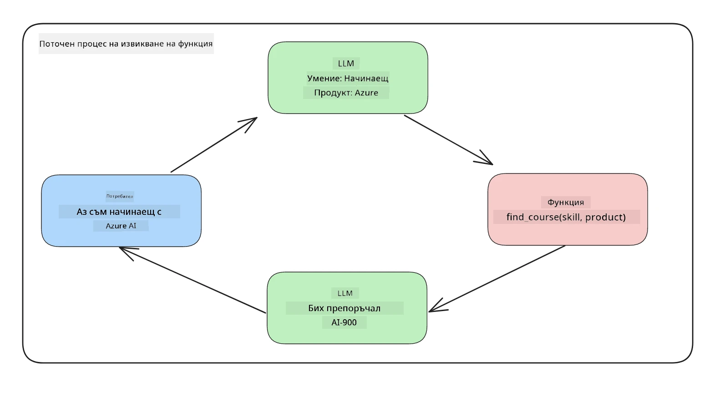
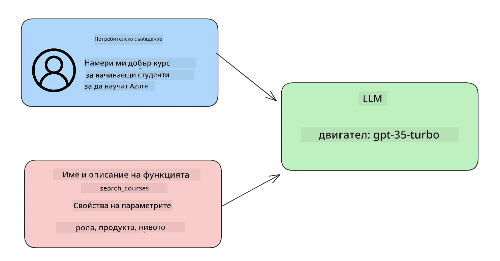

# Интеграция с извикване на функции

[](https://youtu.be/DgUdCLX8qYQ?si=f1ouQU5HQx6F8Gl2)

Досега научихте немалко неща в предишните уроци. Въпреки това, можем да подобрим още. Някои от нещата, които можем да адресираме, са как да получим по-последователен формат на отговорите, за да улесним работата с отговора по-нататък. Също така, може да искаме да добавим данни от други източници, за да обогатим допълнително нашето приложение.

Проблемите, споменати по-горе, са тези, които този раздел се стреми да реши.

## Въведение

Този урок ще обхване:

- Обяснение какво представлява извикването на функции и неговите случаи на употреба.
- Създаване на извикване на функция чрез Azure OpenAI.
- Как да интегрираме извикване на функция в приложение.

## Цели на обучението

В края на този урок ще можете:

- Да обясните целта на използването на извикване на функции.
- Да настроите Извикване на Функция с помощта на Azure OpenAI Service.
- Да проектирате ефективни извиквания на функции за случая на вашето приложение.

## Сценарий: Подобряване на нашия чатбот с функции

За този урок искаме да изградим функция за нашия стартиращ образователен проект, която позволява на потребителите да използват чатбот за намиране на технически курсове. Ще препоръчваме курсове, които пасват на тяхното ниво на умения, текуща роля и интересна технология.

За да завършим този сценарий, ще използваме комбинация от:

- `Azure OpenAI` за създаване на чат изживяване за потребителя.
- `Microsoft Learn Catalog API` за помощ на потребителите да намират курсове според техните заявки.
- `Извикване на Функция` за взимане на заявката на потребителя и изпращането ѝ към функция, която да направи API заявката.

За да започнем, нека разгледаме защо бихме искали първо да използваме извикване на функции:

## Защо Извикване на Функции

Преди извикването на функции, отговорите от LLM бяха неструктурирани и непоследователни. Разработчиците трябваше да пишат сложен код за валидиране, за да могат да обработят всяко възможно отклонение в отговора. Потребителите не можеха да получат отговори като „Какво е времето в момента в Стокхолм?“. Това е така, защото моделите бяха ограничени до времето, в което данните са били обучени.

Извикването на функции е функция на Azure OpenAI Service, която преодолява следните ограничения:

- **Последователен формат на отговорите**. Ако можем по-добре да контролираме формата на отговора, по-лесно можем да интегрираме отговора към други системи.
- **Външни данни**. Възможност за използване на данни от други източници на приложението в чат контекст.

## Илюстриране на проблема чрез сценарий

> Препоръчваме ви да използвате [включения ноутбук](./python/aoai-assignment.ipynb?WT.mc_id=academic-105485-koreyst), ако искате да изпълните посочения сценарий. Можете също просто да четете, докато се опитваме да илюстрираме проблем, при който функциите могат да помогнат да се реши проблемът.

Нека разгледаме пример, който илюстрира проблема с формата на отговора:

Да кажем, че искаме да създадем база данни с данни за студенти, за да можем да предлагаме подходящ курс на тях. По-долу имаме две описания на студенти, които са много сходни по данните, които съдържат.

1. Създайте връзка с нашия ресурс Azure OpenAI:

   ```python
   import os
   import json
   from openai import OpenAI
   from dotenv import load_dotenv
   load_dotenv()

   # API за отговори се предоставя от Azure OpenAI (Microsoft Foundry) v1
   # крайна точка, затова насочваме OpenAI клиента към <your-endpoint>/openai/v1/.
   endpoint = os.environ['AZURE_OPENAI_ENDPOINT']
   client = OpenAI(
   api_key=os.environ['AZURE_OPENAI_API_KEY'],
   base_url=f"{endpoint.rstrip('/')}/openai/v1/",
   )

   deployment=os.environ['AZURE_OPENAI_DEPLOYMENT']
   ```

   По-долу е даден Python код за конфигуриране на нашата връзка към Azure OpenAI. Тъй като използваме краен възел v1, трябва само да зададем `api_key` и `base_url` (не е необходим `api_version`).

1. Създаване на две описания на студенти с променливи `student_1_description` и `student_2_description`.

   ```python
   student_1_description="Emily Johnson is a sophomore majoring in computer science at Duke University. She has a 3.7 GPA. Emily is an active member of the university's Chess Club and Debate Team. She hopes to pursue a career in software engineering after graduating."

   student_2_description = "Michael Lee is a sophomore majoring in computer science at Stanford University. He has a 3.8 GPA. Michael is known for his programming skills and is an active member of the university's Robotics Club. He hopes to pursue a career in artificial intelligence after finishing his studies."
   ```

   Искаме да изпратим горните описания на студенти към LLM за анализ на данните. Тези данни впоследствие могат да се използват в нашето приложение и да се изпратят до API или да се съхранят в база данни.

1. Нека създадем два еднакви заявки, в които инструктираме LLM каква информация ни интересува:

   ```python
   prompt1 = f'''
   Please extract the following information from the given text and return it as a JSON object:

   name
   major
   school
   grades
   club

   This is the body of text to extract the information from:
   {student_1_description}
   '''

   prompt2 = f'''
   Please extract the following information from the given text and return it as a JSON object:

   name
   major
   school
   grades
   club

   This is the body of text to extract the information from:
   {student_2_description}
   '''
   ```

   Горните заявки инструктират LLM да извлече информация и да върне отговора в JSON формат.

1. След настройване на заявките и връзката към Azure OpenAI, сега ще изпратим заявките към LLM, като използваме `client.responses.create`. Съхраняваме заявката в променливата `input` и определяме ролята като `user`. Това имитира съобщение от потребител, написано в чатбота.

   ```python
   # отговор от първия подкана
   openai_response1 = client.responses.create(
   model=deployment,
   input = [{'role': 'user', 'content': prompt1}],
   store=False,
   )
   openai_response1.output_text

   # отговор от втория подкана
   openai_response2 = client.responses.create(
   model=deployment,
   input = [{'role': 'user', 'content': prompt2}],
   store=False,
   )
   openai_response2.output_text
   ```

Сега можем да изпратим и двете заявки към LLM и да прегледаме получения отговор, като го намерим така `openai_response1.output_text`.

1. Накрая можем да конвертираме отговора във формат JSON, като извикаме `json.loads`:

   ```python
   # Зареждане на отговора като JSON обект
   json_response1 = json.loads(openai_response1.output_text)
   json_response1
   ```

   Отговор 1:

   ```json
   {
     "name": "Emily Johnson",
     "major": "computer science",
     "school": "Duke University",
     "grades": "3.7",
     "club": "Chess Club"
   }
   ```

   Отговор 2:

   ```json
   {
     "name": "Michael Lee",
     "major": "computer science",
     "school": "Stanford University",
     "grades": "3.8 GPA",
     "club": "Robotics Club"
   }
   ```

   Въпреки че заявките са еднакви, а описанията са сходни, виждаме стойностите на свойството `Grades` форматирани по различен начин, например, понякога получаваме формата `3.7`, а друг път `3.7 GPA`.

   Този резултат е защото LLM обработва неструктурирани данни във формата на писмения текст и връща също неструктурирани данни. Нуждаем се от структуриран формат, за да знаем какво да очакваме при съхранение или използване на тези данни.

Така как решаваме проблема с форматирането? Чрез използване на извикване на функции можем да сме сигурни, че ще получим обратно структурирани данни. При използването на извикване на функции LLM всъщност не изпълнява или извиква каквито и да е функции. Вместо това, ние създаваме структура, която LLM трябва да следва за своите отговори. След това използваме тези структурирани отговори, за да знаем коя функция да изпълним в нашите приложения.



След това можем да вземем това, което е върнато от функцията, и да го изпратим обратно на LLM. LLM ще отговори с естествен език, за да отговори на запитването на потребителя.

## Случаи на употреба за използване на извиквания на функции

Има много случаи на употреба, където извиквания на функции могат да подобрят вашето приложение, като например:

- **Извикване на външни инструменти**. Чатботовете са отлични в предоставянето на отговори на въпроси от потребителите. Чрез използване на извикване на функции, чатботовете могат да използват съобщения от потребителите, за да изпълнят определени задачи. Например, студент може да помоли чатбота да „Изпрати имейл на моя преподавател, че имам нужда от повече помощ по този предмет“. Това може да направи извикване на функция `send_email(to: string, body: string)`

- **Създаване на заявки към API или база данни**. Потребителите могат да намерят информация, използвайки естествен език, който се преобразува във формат на заявка или API повикване. Пример за това може да бъде учител, който пита „Кои са студентите, които са завършили последното задание“, което може да извика функция на име `get_completed(student_name: string, assignment: int, current_status: string)`

- **Създаване на структурирани данни**. Потребителите могат да вземат текстов блок или CSV и да използват LLM, за да извлекат важна информация от него. Например, студент може да конвертира уики-статия за мирни споразумения в AI флашкарти. Това може да стане чрез функция, наречена `get_important_facts(agreement_name: string, date_signed: string, parties_involved: list)`

## Създаване на първото ви извикване на функция

Процесът на създаване на извикване на функция включва 3 основни стъпки:

1. **Извикване** на Responses API с лист от вашите функции (инструменти) и съобщение от потребител.
2. **Четене** на отговора на модела, за да се изпълни действие, т.е. извършване на функция или API повикване.
3. **Извършване** на още едно повикване към Responses API с отговора от вашата функция, за да използвате тази информация за създаване на отговор към потребителя.



### Стъпка 1 - създаване на съобщения

Първата стъпка е да създадем съобщение от потребителя. Това може да се зададе динамично чрез стойност от текстово поле или можете да зададете стойност тук. Ако това е първият ви път с Responses API, трябва да дефинираме `role` и `content` на съобщението.

`role` може да бъде `system` (създаване на правила), `assistant` (моделът) или `user` (крайният потребител). За извикване на функции ще зададем `user` и примерен въпрос.

```python
messages= [ {"role": "user", "content": "Find me a good course for a beginner student to learn Azure."} ]
```

С определяне на различни роли е ясно за LLM дали системата казва нещо или потребителят, което помага да се изгражда история на разговора, върху която LLM може да надгражда.

### Стъпка 2 - създаване на функции

След това ще дефинираме функция и нейните параметри. Ще използваме само една функция, наречена `search_courses`, но можете да създадете множество функции.

> **Важно** : Функциите се включват в системното съобщение към LLM и ще се броят към наличните токени, които имате.

По-долу създаваме функциите като масив от елементи. Всеки елемент е инструмент в плосък формат на Responses API, с свойства `type`, `name`, `description` и `parameters`:

```python
functions = [
   {
      "type":"function",
      "name":"search_courses",
      "description":"Retrieves courses from the search index based on the parameters provided",
      "parameters":{
         "type":"object",
         "properties":{
            "role":{
               "type":"string",
               "description":"The role of the learner (i.e. developer, data scientist, student, etc.)"
            },
            "product":{
               "type":"string",
               "description":"The product that the lesson is covering (i.e. Azure, Power BI, etc.)"
            },
            "level":{
               "type":"string",
               "description":"The level of experience the learner has prior to taking the course (i.e. beginner, intermediate, advanced)"
            }
         },
         "required":[
            "role"
         ]
      }
   }
]
```

Да опишем всяка функция по-подробно по-долу:

- `name` - Името на функцията, която искаме да се извика.
- `description` - Описание на това как работи функцията. Тук е важно да сме конкретни и ясни.
- `parameters` - Списък със стойности и формат, които искате моделът да произведе в отговора си. Масивът parameters се състои от елементи със следните свойства:
  1.  `type` - Типът данни, в който ще се съхраняват свойствата.
  1.  `properties` - Списък със специфичните стойности, които моделът ще използва за своя отговор
      1. `name` - Ключът е името на свойството, което моделът ще използва във форматирания отговор, например `product`.
      1. `type` - Типът данни на това свойство, например `string`.
      1. `description` - Описание на специфичното свойство.

Има и опционално свойство `required` - задължително свойство за завършване на извикването на функцията.

### Стъпка 3 - Извършване на извикването на функцията

След дефиниране на функцията, сега трябва да я включим в повикването към Responses API. Това става чрез добавяне на `tools` в заявката. В този случай `tools=functions`.

Съществува и опция да се зададе `tool_choice` на `auto`. Това означава, че ще позволим на LLM да реши коя функция да извика въз основа на потребителското съобщение, вместо да я задаваме ние.

Ето код по-долу, в който извикваме `client.responses.create`, забележете как задаваме `tools=functions` и `tool_choice="auto"`, като по този начин даваме избор на LLM кога да извика функциите, които му предоставяме:

```python
response = client.responses.create(model=deployment,
                                        input=messages,
                                        tools=functions,
                                        tool_choice="auto",
                                        store=False)

print(response.output)
```

Отговорът, който получаваме, вече включва елемент `function_call` в `response.output`, който изглежда така:

```json
{
  "type": "function_call",
  "name": "search_courses",
  "call_id": "call_abc123",
  "arguments": "{\n  \"role\": \"student\",\n  \"product\": \"Azure\",\n  \"level\": \"beginner\"\n}"
}
```

Тук можем да видим как е извикана функцията `search_courses` и с какви аргументи, както е посочено в свойството `arguments` в JSON отговора.

Заключението е, че LLM е успял да намери данните, които пасват на аргументите на функцията, като ги извлича от стойността, предоставена на параметъра `input` в повикването на Responses API. По-долу е напомнянето за стойността на `messages`:

```python
messages= [ {"role": "user", "content": "Find me a good course for a beginner student to learn Azure."} ]
```

Както виждате, `student`, `Azure` и `beginner` бяха извлечени от `messages` и зададени като вход към функцията. Използването на функции по този начин е отличен начин за извличане на информация от заявка, но и за предоставяне на структура на LLM и осигуряване на многократна употреба на функционалността.

След това трябва да видим как можем да използваме това в нашето приложение.

## Интегриране на извиквания на функции в приложение

След като тествахме форматирания отговор от LLM, сега можем да го интегрираме в приложение.

### Управление на потока

За да го интегрираме в нашето приложение, нека предприемем следните стъпки:

1. Първо, нека направим повикване към услугите OpenAI и извлечем елементите за извикване на функции от отговора `output`.

   ```python
   response_items = response.output
   tool_calls = [item for item in response_items if item.type == "function_call"]
   ```

1. Сега ще дефинираме функцията, която ще извърши обаждане към Microsoft Learn API, за да получи списък с курсове:

   ```python
   import requests

   def search_courses(role, product, level):
     url = "https://learn.microsoft.com/api/catalog/"
     params = {
        "role": role,
        "product": product,
        "level": level
     }
     response = requests.get(url, params=params)
     modules = response.json()["modules"]
     results = []
     for module in modules[:5]:
        title = module["title"]
        url = module["url"]
        results.append({"title": title, "url": url})
     return str(results)
   ```

   Забележете как сега създаваме реална Python функция, която съответства на имената на функциите, въведени в променливата `functions`. Също така правим реални външни API повиквания, за да вземем необходимите данни. В този случай се обръщаме към Microsoft Learn API, за да търсим учебни модули.

Добре, създадохме променлива `functions` и съответната Python функция, как да кажем на LLM как да ги съпостави, за да бъде извикана нашата Python функция?

1. За да видите дали трябва да извикате Python функция, трябва да погледнете отговора на LLM и да проверите дали има елемент `function_call` и да извикате посочената функция. Ето как можете да направите тази проверка по-долу:

   ```python
   # Проверете дали моделът иска да извика функция
   if tool_calls:
    for tool_call in tool_calls:
     print("Recommended Function call:")
     print(tool_call.name)
     print()

     # Извикайте функцията.
     function_name = tool_call.name

     available_functions = {
             "search_courses": search_courses,
     }
     function_to_call = available_functions[function_name]

     function_args = json.loads(tool_call.arguments)
     function_response = function_to_call(**function_args)

     print("Output of function call:")
     print(function_response)
     print(type(function_response))

     # Добавете извикването на функцията и резултата от нея обратно в разговора.
     # Елементът function_call на модела трябва да бъде добавен преди изхода му.
     messages.append(tool_call)  # елементът function_call на асистента
     messages.append( # резултатът от функцията
         {
             "type": "function_call_output",
             "call_id": tool_call.call_id,
             "output": function_response,
         }
     )
   ```

   Тези три реда осигуряват извличането на името на функцията, аргументите и извършването на повикването:

   ```python
   function_to_call = available_functions[function_name]

   function_args = json.loads(tool_call.arguments)
   function_response = function_to_call(**function_args)
   ```

   По-долу е изходът от стартиране на нашия код:

   **Изход**

   ```Recommended Function call:
   {
     "name": "search_courses",
     "arguments": "{\n  \"role\": \"student\",\n  \"product\": \"Azure\",\n  \"level\": \"beginner\"\n}"
   }

   Output of function call:
   [{'title': 'Describe concepts of cryptography', 'url': 'https://learn.microsoft.com/training/modules/describe-concepts-of-cryptography/?
   WT.mc_id=api_CatalogApi'}, {'title': 'Introduction to audio classification with TensorFlow', 'url': 'https://learn.microsoft.com/en-
   us/training/modules/intro-audio-classification-tensorflow/?WT.mc_id=api_CatalogApi'}, {'title': 'Design a Performant Data Model in Azure SQL
   Database with Azure Data Studio', 'url': 'https://learn.microsoft.com/training/modules/design-a-data-model-with-ads/?
   WT.mc_id=api_CatalogApi'}, {'title': 'Getting started with the Microsoft Cloud Adoption Framework for Azure', 'url':
   'https://learn.microsoft.com/training/modules/cloud-adoption-framework-getting-started/?WT.mc_id=api_CatalogApi'}, {'title': 'Set up the
   Rust development environment', 'url': 'https://learn.microsoft.com/training/modules/rust-set-up-environment/?WT.mc_id=api_CatalogApi'}]
   <class 'str'>
   ```

1. Сега ще изпратим актуализираното съобщение `messages` към LLM, за да получим отговор на естествен език, вместо JSON форматиран API отговор.

   ```python
   print("Messages in next request:")
   print(messages)
   print()

   second_response = client.responses.create(
      input=messages,
      model=deployment,
      tool_choice="auto",
      tools=functions,
      temperature=0,
      store=False,
         )  # получаване на нов отговор от модела, където може да види отговора на функцията


   print(second_response.output_text)
   ```

   **Изход**

   ```text
   I found some good courses for beginner students to learn Azure:

   1. [Describe concepts of cryptography](https://learn.microsoft.com/training/modules/describe-concepts-of-cryptography/?WT.mc_id=api_CatalogApi)
   2. [Introduction to audio classification with TensorFlow](https://learn.microsoft.com/training/modules/intro-audio-classification-tensorflow/?WT.mc_id=api_CatalogApi)
   3. [Design a Performant Data Model in Azure SQL Database with Azure Data Studio](https://learn.microsoft.com/training/modules/design-a-data-model-with-ads/?WT.mc_id=api_CatalogApi)
   4. [Getting started with the Microsoft Cloud Adoption Framework for Azure](https://learn.microsoft.com/training/modules/cloud-adoption-framework-getting-started/?WT.mc_id=api_CatalogApi)
   5. [Set up the Rust development environment](https://learn.microsoft.com/training/modules/rust-set-up-environment/?WT.mc_id=api_CatalogApi)

   You can click on the links to access the courses.
   ```

## Задача

За да продължите обучението си по Azure OpenAI Извикване на Функции, можете да разработите:

- Още параметри на функцията, които могат да помогнат на обучаващите се да намерят повече курсове.

- Създайте друго извикване на функция, което приема повече информация от учащия, като например неговия роден език
- Създайте обработка на грешки, когато извикването на функцията и/или извикването на API не върнат подходящи курсове

Подсказка: Следвайте страницата с [Learn API reference documentation](https://learn.microsoft.com/training/support/catalog-api-developer-reference?WT.mc_id=academic-105485-koreyst), за да видите как и къде са налични тези данни.

## Чудесна работа! Продължете пътуването

След завършване на този урок, разгледайте нашата [колекция за обучение по Генеративен AI](https://aka.ms/genai-collection?WT.mc_id=academic-105485-koreyst), за да продължите да развивате знанията си за Генеративния AI!

Отидете на Урок 12, където ще разгледаме как да [проектираме UX за AI приложения](../12-designing-ux-for-ai-applications/README.md?WT.mc_id=academic-105485-koreyst)!

---

<!-- CO-OP TRANSLATOR DISCLAIMER START -->
**Отказ от отговорност**:
Този документ е преведен с помощта на AI преводачески услуга [Co-op Translator](https://github.com/Azure/co-op-translator). Въпреки че се стремим към точност, моля имайте предвид, че автоматизираните преводи могат да съдържат грешки или неточности. Оригиналният документ на неговия роден език трябва да се счита за авторитетен източник. За критична информация се препоръчва професионален човешки превод. Ние не носим отговорност за каквито и да е недоразумения или неправилни тълкувания, произтичащи от използването на този превод.
<!-- CO-OP TRANSLATOR DISCLAIMER END -->