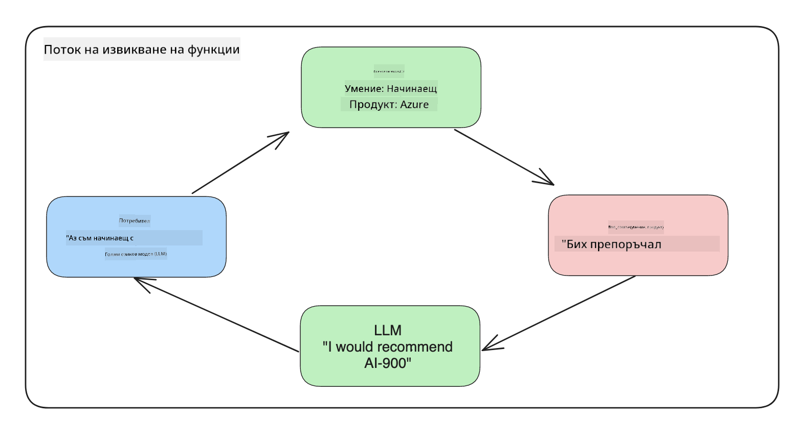
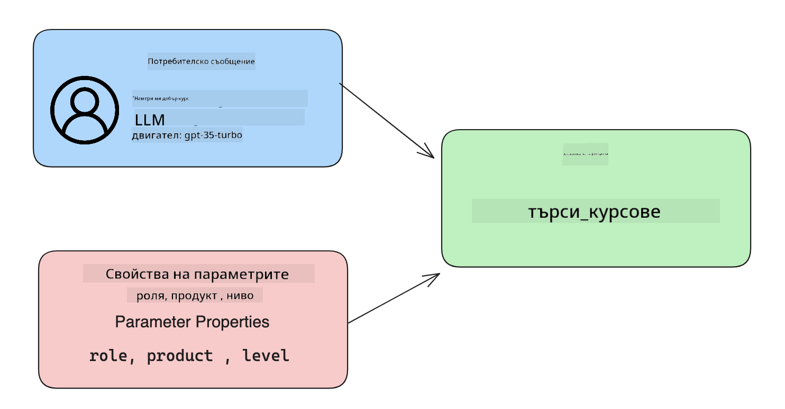

<!--
CO_OP_TRANSLATOR_METADATA:
{
  "original_hash": "f6f84f9ef2d066cd25850cab93580a50",
  "translation_date": "2025-10-17T22:15:32+00:00",
  "source_file": "11-integrating-with-function-calling/README.md",
  "language_code": "bg"
}
-->
# Интегриране с извикване на функции

[](https://youtu.be/DgUdCLX8qYQ?si=f1ouQU5HQx6F8Gl2)

Досега научихте доста неща в предишните уроци. Въпреки това, можем да се подобрим още. Някои от нещата, които можем да адресираме, са как да получим по-консистентен формат на отговорите, за да улесним работата с тях в следващите етапи. Освен това, може да искаме да добавим данни от други източници, за да обогатим допълнително нашето приложение.

Тези проблеми са основният фокус на тази глава.

## Въведение

Този урок ще обхване:

- Обяснение какво е извикване на функции и неговите приложения.
- Създаване на извикване на функция с Azure OpenAI.
- Как да интегрираме извикване на функция в приложение.

## Цели на обучението

До края на този урок ще можете:

- Да обясните целта на използването на извикване на функции.
- Да настроите извикване на функция с Azure OpenAI Service.
- Да проектирате ефективни извиквания на функции за вашето приложение.

## Сценарий: Подобряване на нашия чатбот с функции

За този урок искаме да изградим функция за нашия стартъп в образованието, която позволява на потребителите да използват чатбот за намиране на технически курсове. Ще препоръчваме курсове, които отговарят на тяхното ниво на умения, текуща роля и интерес към технологии.

За да завършим този сценарий, ще използваме комбинация от:

- `Azure OpenAI`, за да създадем чат изживяване за потребителя.
- `Microsoft Learn Catalog API`, за да помогнем на потребителите да намерят курсове въз основа на техните заявки.
- `Извикване на функции`, за да вземем заявката на потребителя и да я изпратим към функция, която прави API заявка.

За да започнем, нека разгледаме защо бихме искали да използваме извикване на функции:

## Защо извикване на функции

Преди извикването на функции, отговорите от LLM бяха неструктурирани и неконсистентни. Разработчиците трябваше да пишат сложен код за валидиране, за да се уверят, че могат да обработят всяка вариация на отговор. Потребителите не можеха да получат отговори като "Какво е текущото време в Стокхолм?". Това е така, защото моделите бяха ограничени до времето, когато данните са били обучени.

Извикването на функции е функция на Azure OpenAI Service, която преодолява следните ограничения:

- **Консистентен формат на отговорите**. Ако можем да контролираме формата на отговорите, можем по-лесно да интегрираме отговорите в други системи.
- **Външни данни**. Възможност за използване на данни от други източници на приложение в контекста на чат.

## Илюстриране на проблема чрез сценарий

> Препоръчваме ви да използвате [включената тетрадка](./python/aoai-assignment.ipynb?WT.mc_id=academic-105485-koreyst), ако искате да изпълните долния сценарий. Можете също така просто да четете, докато илюстрираме проблем, който функциите могат да помогнат да се реши.

Нека разгледаме пример, който илюстрира проблема с формата на отговорите:

Да кажем, че искаме да създадем база данни с данни за студенти, за да можем да им предложим подходящ курс. По-долу имаме две описания на студенти, които са много сходни в данните, които съдържат.

1. Създайте връзка към нашия Azure OpenAI ресурс:

   ```python
   import os
   import json
   from openai import AzureOpenAI
   from dotenv import load_dotenv
   load_dotenv()

   client = AzureOpenAI(
   api_key=os.environ['AZURE_OPENAI_API_KEY'],  # this is also the default, it can be omitted
   api_version = "2023-07-01-preview"
   )

   deployment=os.environ['AZURE_OPENAI_DEPLOYMENT']
   ```

   По-долу е даден Python код за конфигуриране на нашата връзка към Azure OpenAI, където задаваме `api_type`, `api_base`, `api_version` и `api_key`.

1. Създаване на две описания на студенти, използвайки променливите `student_1_description` и `student_2_description`.

   ```python
   student_1_description="Emily Johnson is a sophomore majoring in computer science at Duke University. She has a 3.7 GPA. Emily is an active member of the university's Chess Club and Debate Team. She hopes to pursue a career in software engineering after graduating."

   student_2_description = "Michael Lee is a sophomore majoring in computer science at Stanford University. He has a 3.8 GPA. Michael is known for his programming skills and is an active member of the university's Robotics Club. He hopes to pursue a career in artificial intelligence after finishing his studies."
   ```

   Искаме да изпратим горните описания на студенти към LLM, за да анализираме данните. Тези данни могат по-късно да бъдат използвани в нашето приложение и да бъдат изпратени към API или съхранени в база данни.

1. Нека създадем два идентични подканващи текста, в които инструктираме LLM каква информация ни интересува:

   ```python
   prompt1 = f'''
   Please extract the following information from the given text and return it as a JSON object:

   name
   major
   school
   grades
   club

   This is the body of text to extract the information from:
   {student_1_description}
   '''

   prompt2 = f'''
   Please extract the following information from the given text and return it as a JSON object:

   name
   major
   school
   grades
   club

   This is the body of text to extract the information from:
   {student_2_description}
   '''
   ```

   Горните подканващи текстове инструктират LLM да извлече информация и да върне отговор в JSON формат.

1. След като настроим подканващите текстове и връзката към Azure OpenAI, сега ще изпратим подканващите текстове към LLM, използвайки `openai.ChatCompletion`. Съхраняваме подканващия текст в променливата `messages` и задаваме ролята на `user`. Това е за да имитираме съобщение от потребител, написано към чатбот.

   ```python
   # response from prompt one
   openai_response1 = client.chat.completions.create(
   model=deployment,
   messages = [{'role': 'user', 'content': prompt1}]
   )
   openai_response1.choices[0].message.content

   # response from prompt two
   openai_response2 = client.chat.completions.create(
   model=deployment,
   messages = [{'role': 'user', 'content': prompt2}]
   )
   openai_response2.choices[0].message.content
   ```

Сега можем да изпратим и двата заявки към LLM и да разгледаме отговора, който получаваме, като го намерим по следния начин: `openai_response1['choices'][0]['message']['content']`.

1. Накрая можем да конвертираме отговора в JSON формат, като извикаме `json.loads`:

   ```python
   # Loading the response as a JSON object
   json_response1 = json.loads(openai_response1.choices[0].message.content)
   json_response1
   ```

   Отговор 1:

   ```json
   {
     "name": "Emily Johnson",
     "major": "computer science",
     "school": "Duke University",
     "grades": "3.7",
     "club": "Chess Club"
   }
   ```

   Отговор 2:

   ```json
   {
     "name": "Michael Lee",
     "major": "computer science",
     "school": "Stanford University",
     "grades": "3.8 GPA",
     "club": "Robotics Club"
   }
   ```

   Въпреки че подканващите текстове са еднакви и описанията са сходни, виждаме стойности на свойството `Grades`, форматирани по различен начин, като понякога получаваме формата `3.7` или `3.7 GPA`, например.

   Този резултат се дължи на това, че LLM приема неструктурирани данни под формата на написан подканващ текст и връща също неструктурирани данни. Трябва да имаме структуриран формат, за да знаем какво да очакваме при съхранение или използване на тези данни.

Как тогава да решим проблема с форматирането? Чрез използване на извикване на функции можем да се уверим, че получаваме обратно структурирани данни. При използване на извикване на функции, LLM всъщност не извиква или изпълнява никакви функции. Вместо това създаваме структура, която LLM да следва за своите отговори. След това използваме тези структурирани отговори, за да знаем каква функция да изпълним в нашите приложения.



След това можем да вземем това, което е върнато от функцията, и да го изпратим обратно към LLM. LLM след това ще отговори, използвайки естествен език, за да отговори на заявката на потребителя.

## Приложения за използване на извиквания на функции

Има много различни приложения, където извикванията на функции могат да подобрят вашето приложение, като например:

- **Извикване на външни инструменти**. Чатботовете са чудесни за предоставяне на отговори на въпроси от потребители. Чрез използване на извикване на функции, чатботовете могат да използват съобщения от потребители, за да изпълняват определени задачи. Например, студент може да поиска от чатбота: "Изпрати имейл на моя преподавател, че имам нужда от повече помощ по този предмет". Това може да направи извикване на функция `send_email(to: string, body: string)`.

- **Създаване на API или заявки към база данни**. Потребителите могат да намират информация, използвайки естествен език, който се конвертира в форматирана заявка или API заявка. Пример за това може да бъде учител, който пита: "Кои са студентите, които завършиха последното задание", което може да извика функция, наречена `get_completed(student_name: string, assignment: int, current_status: string)`.

- **Създаване на структурирани данни**. Потребителите могат да вземат блок текст или CSV и да използват LLM, за да извлекат важна информация от него. Например, студент може да конвертира статия от Wikipedia за мирни споразумения, за да създаде AI флашкарти. Това може да се направи чрез функция, наречена `get_important_facts(agreement_name: string, date_signed: string, parties_involved: list)`.

## Създаване на първото ви извикване на функция

Процесът на създаване на извикване на функция включва 3 основни стъпки:

1. **Извикване** на API за завършване на чат с списък на вашите функции и съобщение от потребителя.
2. **Четене** на отговора на модела, за да се извърши действие, т.е. изпълнение на функция или API заявка.
3. **Извършване** на друго извикване към API за завършване на чат с отговора от вашата функция, за да използвате тази информация за създаване на отговор към потребителя.



### Стъпка 1 - създаване на съобщения

Първата стъпка е да създадете съобщение от потребителя. Това може да бъде динамично зададено, като се вземе стойността на текстов вход или можете да зададете стойност тук. Ако това е първият ви опит с API за завършване на чат, трябва да дефинирате `role` и `content` на съобщението.

`role` може да бъде `system` (създаване на правила), `assistant` (моделът) или `user` (крайният потребител). За извикване на функции ще го зададем като `user` и примерен въпрос.

```python
messages= [ {"role": "user", "content": "Find me a good course for a beginner student to learn Azure."} ]
```

Чрез задаване на различни роли става ясно на LLM дали системата казва нещо или потребителят, което помага за изграждане на история на разговора, върху която LLM може да се базира.

### Стъпка 2 - създаване на функции

След това ще дефинираме функция и параметрите на тази функция. Ще използваме само една функция тук, наречена `search_courses`, но можете да създадете множество функции.

> **Важно**: Функциите са включени в системното съобщение към LLM и ще бъдат включени в наличния брой токени, които имате.

По-долу създаваме функциите като масив от елементи. Всеки елемент е функция и има свойства `name`, `description` и `parameters`:

```python
functions = [
   {
      "name":"search_courses",
      "description":"Retrieves courses from the search index based on the parameters provided",
      "parameters":{
         "type":"object",
         "properties":{
            "role":{
               "type":"string",
               "description":"The role of the learner (i.e. developer, data scientist, student, etc.)"
            },
            "product":{
               "type":"string",
               "description":"The product that the lesson is covering (i.e. Azure, Power BI, etc.)"
            },
            "level":{
               "type":"string",
               "description":"The level of experience the learner has prior to taking the course (i.e. beginner, intermediate, advanced)"
            }
         },
         "required":[
            "role"
         ]
      }
   }
]
```

Нека опишем всяка инстанция на функцията по-подробно:

- `name` - Името на функцията, която искаме да бъде извикана.
- `description` - Това е описанието на начина, по който функцията работи. Тук е важно да бъдете конкретни и ясни.
- `parameters` - Списък от стойности и формат, които искате моделът да произведе в своя отговор. Масивът от параметри се състои от елементи, където елементите имат следните свойства:
  1.  `type` - Типът данни, в който ще се съхраняват свойствата.
  1.  `properties` - Списък на специфичните стойности, които моделът ще използва за своя отговор.
      1. `name` - Ключът е името на свойството, което моделът ще използва в своя форматиран отговор, например `product`.
      1. `type` - Типът данни на това свойство, например `string`.
      1. `description` - Описание на специфичното свойство.

Има и опционално свойство `required` - задължително свойство за завършване на извикването на функцията.

### Стъпка 3 - Извършване на извикване на функция

След като дефинираме функция, сега трябва да я включим в извикването към API за завършване на чат. Правим това, като добавяме `functions` към заявката. В този случай `functions=functions`.

Има и опция да зададем `function_call` на `auto`. Това означава, че ще оставим LLM да реши коя функция трябва да бъде извикана въз основа на съобщението на потребителя, вместо да я задаваме сами.

Ето малко код по-долу, където извикваме `ChatCompletion.create`, обърнете внимание как задаваме `functions=functions` и `function_call="auto"` и по този начин даваме на LLM избора кога да извика предоставените от нас функции:

```python
response = client.chat.completions.create(model=deployment,
                                        messages=messages,
                                        functions=functions,
                                        function_call="auto")

print(response.choices[0].message)
```

Отговорът, който се връща, изглежда така:

```json
{
  "role": "assistant",
  "function_call": {
    "name": "search_courses",
    "arguments": "{\n  \"role\": \"student\",\n  \"product\": \"Azure\",\n  \"level\": \"beginner\"\n}"
  }
}
```

Тук можем да видим как функцията `search_courses` е била извикана и с какви аргументи, както е посочено в свойството `arguments` в JSON отговора.

Заключението е, че LLM е успял да намери данните, които да отговарят на аргументите на функцията, като ги е извлякъл от стойността, предоставена на параметъра `messages` в извикването на завършване на чат. По-долу е напомняне за стойността на `messages`:

```python
messages= [ {"role": "user", "content": "Find me a good course for a beginner student to learn Azure."} ]
```

Както виждате, `student`, `Azure` и `beginner` са извлечени от `messages` и зададени като вход към функцията. Използването на функции по този начин е чудесен начин за извличане на информация от подканващ текст, но също така и за предоставяне на структура на LLM и за използване на функционалност, която може да се използва многократно.

Следващата стъпка е да видим как можем да използваме това в нашето приложение.

## Интегриране на извиквания на функции в приложение

След като сме тествали форматирания отговор от LLM, сега можем да го интегрираме в приложение.

### Управление на потока

За да интегрираме това в нашето приложение, нека предприемем следните стъпки:

1. Първо, нека направим извикване към OpenAI услугите и съхраним съобщението в променлива, наречена `response_message`.

   ```python
   response_message = response.choices[0].message
   ```

1. Сега ще дефинираме функцията, която ще извика Microsoft Learn API, за да получи списък с курсове:

   ```python
   import requests

   def search_courses(role, product, level):
     url = "https://learn.microsoft.com/api/catalog/"
     params = {
        "role": role,
        "product": product,
        "level": level
     }
     response = requests.get(url, params=params)
     modules = response.json()["modules"]
     results = []
     for module in modules[:5]:
        title = module["title"]
        url = module["url"]
        results.append({"title": title, "url": url})
     return str(results)
   ```

   Обърнете внимание как сега създаваме реална Python функция, която съответства на имената на функциите, въведени в променливата `functions`. Също така правим реални външни API извиквания, за да извлечем необходимите данни. В този случай използваме Microsoft Learn API, за да търсим обучителни модули.

Добре, създадохме променливи `functions` и съответстваща Python функция, как да кажем на LLM как да ги свърже, така че нашата Python функция да бъде извикана?

1. За да видим дали трябва да извикаме Python функция, трябва да разгледаме отговора на LLM и да видим дали `function_call` е част от него и да извикаме посочената функция. Ето как можете да направите споменатата проверка по-долу:

   ```python
   # Check if the model wants to call a function
   if response_message.function_call.name:
    print("Recommended Function call:")
    print(response_message.function_call.name)
    print()

    # Call the function.
    function_name = response_message.function_call.name

    available_functions = {
            "search_courses": search_courses,
    }
    function_to_call = available_functions[function_name]

    function_args = json.loads(response_message.function_call.arguments)
    function_response = function_to_call(**function_args)

    print("Output of function call:")
    print(function_response)
    print(type(function_response))


    # Add the assistant response and function response to the messages
    messages.append( # adding assistant response to messages
        {
            "role": response_message.role,
            "function_call": {
                "name": function_name,
                "arguments": response_message.function_call.arguments,
            },
            "content": None
        }
    )
    messages.append( # adding function response to messages
        {
            "role": "function",
            "name": function_name,
            "content":function_response,
        }
    )
   ```

   Тези три реда гарантират, че извличаме името на функцията, аргументите и правим извикването:

   ```python
   function_to_call = available_functions[function_name]

   function_args = json.loads(response_message.function_call.arguments)
   function_response = function_to_call(**function_args)
   ```

   По-долу е изходът от изпълнението на нашия код:

   **Изход**

   ```Recommended Function call:
   {
     "name": "search_courses",
     "arguments": "{\n  \"role\": \"student\",\n  \"product\": \"Azure\",\n  \"level\": \"beginner\"\n}"
   }

   Output of function call:
   [{'title': 'Describe concepts of cryptography', 'url': 'https://learn.microsoft.com/training/modules/describe-concepts-of-cryptography/?
   WT.mc_id=api_CatalogApi'}, {'title': 'Introduction to audio classification with TensorFlow', 'url': 'https://learn.microsoft.com/en-
   us/training/modules/intro-audio-classification-tensorflow/?WT.mc_id=api_CatalogApi'}, {'title': 'Design a Performant Data Model in Azure SQL
   Database with Azure Data Studio', 'url': 'https://learn.microsoft.com/training/modules/design-a-data-model-with-ads/?
   WT.mc_id=api_CatalogApi'}, {'title': 'Getting started with the Microsoft Cloud Adoption Framework for Azure', 'url':
   'https://learn.microsoft.com/training/modules/cloud-adoption-framework-getting-started/?WT.mc_id=api_CatalogApi'}, {'title': 'Set up the
   Rust development environment', 'url': 'https://learn.microsoft.com/training/modules/rust-set-up-environment/?WT.mc_id=api_CatalogApi'}]
   <class 'str'>
   ```

1. Сега ще изпратим актуализираното съобщение, `messages`, към LLM, за да можем да получим отговор на естествен език вместо API JSON форматиран отговор.

   ```python
   print("Messages in next request:")
   print(messages)
   print()

   second_response = client.chat.completions.create(
      messages=messages,
      model=deployment,
      function_call="auto",
      functions=functions,
      temperature=0
         )  # get a new response from GPT where it can see the function response


   print(second_response.choices[0].message)
   ```

   **Изход**

   ```python
   {
     "role": "assistant",
     "content": "I found some good courses for beginner students to learn Azure:\n\n1. [Describe concepts of cryptography] (https://learn.microsoft.com/training/modules/describe-concepts-of-cryptography/?WT.mc_id=api_CatalogApi)\n2. [Introduction to audio classification with TensorFlow](https://learn.microsoft.com/training/modules/intro-audio-classification-tensorflow/?WT.mc_id=api_CatalogApi)\n3. [Design a Performant Data Model in Azure SQL Database with Azure Data Studio](https://learn.microsoft.com/training/modules/design-a-data-model-with-ads/?WT.mc_id=api_CatalogApi)\n4. [Getting started with the Microsoft Cloud Adoption Framework for Azure](https://learn.microsoft.com/training/modules/cloud-adoption-framework-getting-started/?WT.mc_id=api_CatalogApi)\n5. [Set up the Rust development environment](https://learn.microsoft.com/training/modules/rust-set-up-environment/?WT.mc_id=api_CatalogApi)\n\nYou can click on the links to access the courses."
   }

   ```

## Задание

За да продължите обучението си за Azure OpenAI Function Calling, можете да изградите:

- Повече параметри на функцията, които могат да помогнат на обучаващите се да намерят повече курсове.
- Създайте друго извикване на функция, което взема повече информация от обучаващия се, като например неговия роден език.
- Създайте обработка на грешки, когато извикването на функцията и/или API извикването не връща подходящи курсове.

Съвет: Следвайте страницата [Learn API reference documentation](https://learn.microsoft.com/training/support/catalog-api-developer-reference?WT.mc_id=academic-105485-koreyst), за да видите как и къде са налични тези данни.

## Страхотна работа! Продължете напред

След като завършите този урок, разгледайте нашата [Generative AI Learning collection](https://aka.ms/genai-collection?WT.mc_id=academic-105485-koreyst), за да продължите да развивате знанията си за Генеративен AI!

Преминете към Урок 12, където ще разгледаме как да [проектираме UX за AI приложения](../12-designing-ux-for-ai-applications/README.md?WT.mc_id=academic-105485-koreyst)!

---

**Отказ от отговорност**:  
Този документ е преведен с помощта на AI услуга за превод [Co-op Translator](https://github.com/Azure/co-op-translator). Въпреки че се стремим към точност, моля, имайте предвид, че автоматизираните преводи може да съдържат грешки или неточности. Оригиналният документ на неговия роден език трябва да се счита за авторитетен източник. За критична информация се препоръчва професионален човешки превод. Ние не носим отговорност за каквито и да е недоразумения или погрешни интерпретации, произтичащи от използването на този превод.