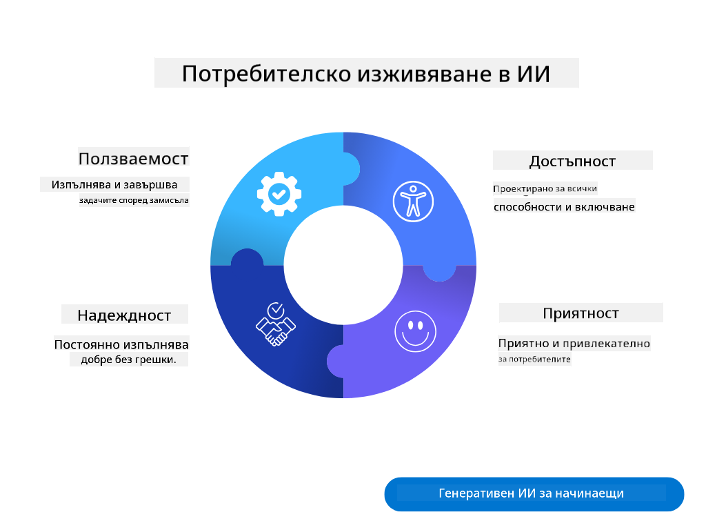
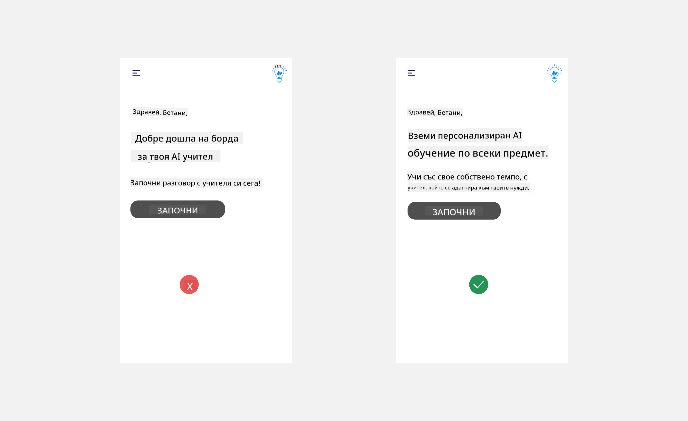
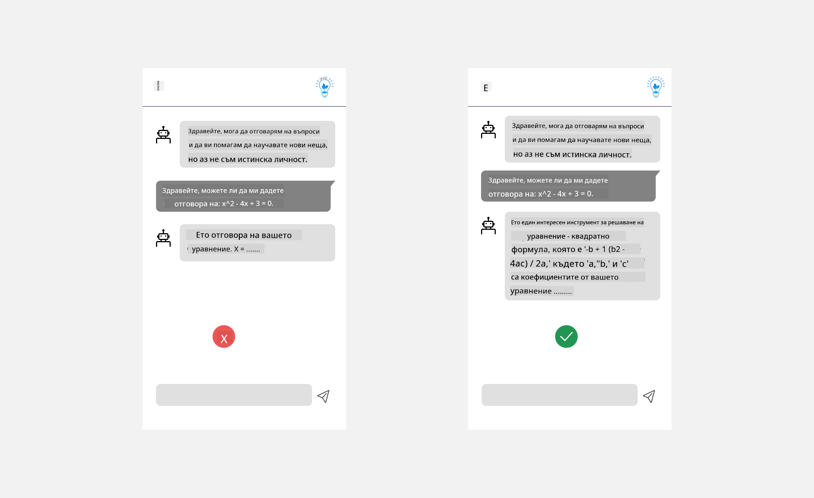
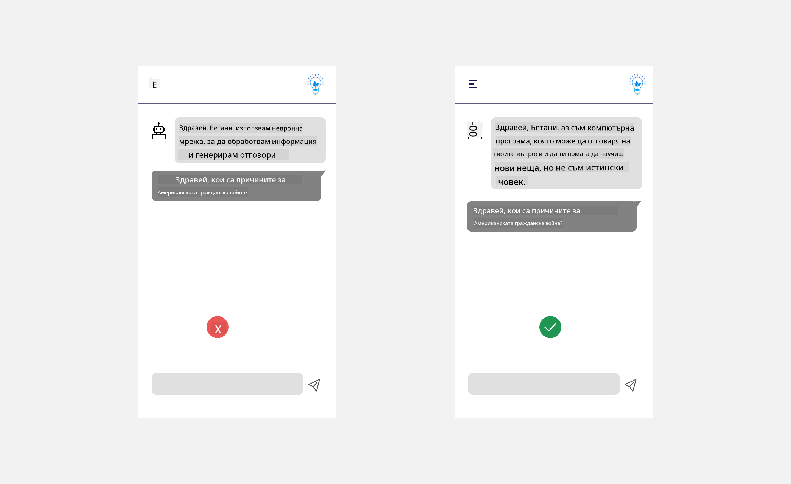
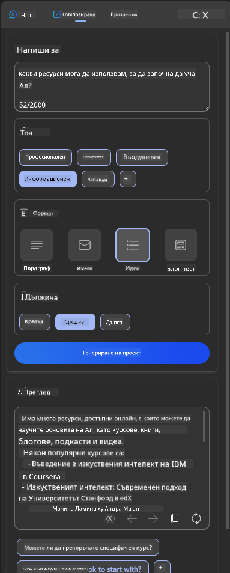
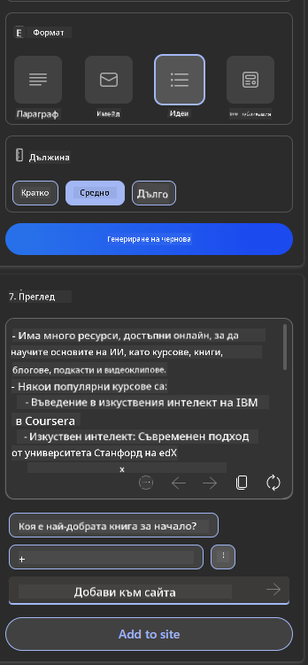

<!--
CO_OP_TRANSLATOR_METADATA:
{
  "original_hash": "747668e4c53d067369f06e9ec2e6313e",
  "translation_date": "2025-08-26T19:28:07+00:00",
  "source_file": "12-designing-ux-for-ai-applications/README.md",
  "language_code": "bg"
}
-->
# Дизайн на потребителското изживяване (UX) за AI приложения

> _(Кликнете върху изображението по-горе, за да гледате видеото към този урок)_

Потребителското изживяване е много важен аспект при създаването на приложения. Потребителите трябва да могат да използват вашето приложение ефективно, за да изпълняват задачи. Ефективността е важна, но също така трябва да проектирате приложенията така, че да могат да се използват от всички – да бъдат _достъпни_. Тази глава се фокусира върху тази област, за да създадете приложение, което хората могат и искат да използват.

## Въведение

Потребителското изживяване е начинът, по който потребителят взаимодейства и използва даден продукт или услуга – било то система, инструмент или дизайн. При разработката на AI приложения, разработчиците не само се стремят към ефективно потребителско изживяване, но и към етично такова. В този урок ще разгледаме как да създаваме приложения с изкуствен интелект (AI), които отговарят на нуждите на потребителите.

Урокът обхваща следните теми:

- Въведение в потребителското изживяване и разбиране на нуждите на потребителите
- Дизайн на AI приложения за доверие и прозрачност
- Дизайн на AI приложения за сътрудничество и обратна връзка

## Учебни цели

След този урок ще можете да:

- Разбирате как да създавате AI приложения, които отговарят на нуждите на потребителите.
- Проектирате AI приложения, които насърчават доверие и сътрудничество.

### Предварителни знания

Отделете време да прочетете повече за [потребителското изживяване и дизайн мисленето.](https://learn.microsoft.com/training/modules/ux-design?WT.mc_id=academic-105485-koreyst)

## Въведение в потребителското изживяване и разбиране на нуждите на потребителите

В нашия измислен стартъп в сферата на образованието имаме два основни типа потребители – учители и ученици. Всеки от тях има различни нужди. Дизайн, ориентиран към потребителя, поставя потребителя в центъра, за да гарантира, че продуктите са релевантни и полезни за тези, за които са предназначени.

Приложението трябва да бъде **полезно, надеждно, достъпно и приятно**, за да осигури добро потребителско изживяване.

### Ползваемост

Да бъде полезно означава, че приложението има функционалности, които съответстват на предназначението му, например автоматизиране на процеса на оценяване или генериране на флашкарти за преговор. Приложение, което автоматизира оценяването, трябва точно и ефективно да присъжда оценки на работите на учениците според предварително зададени критерии. По същия начин, приложение за флашкарти трябва да може да създава релевантни и разнообразни въпроси на база наличните данни.

### Надеждност

Да бъде надеждно означава, че приложението може да изпълнява задачите си последователно и без грешки. Но, както и хората, AI не е съвършен и може да допуска грешки. Приложенията могат да срещнат грешки или неочаквани ситуации, които изискват човешка намеса или корекция. Как се справяте с грешките? В последната част на този урок ще разгледаме как AI системите и приложенията се проектират за сътрудничество и обратна връзка.

### Достъпност

Да бъде достъпно означава да се разшири потребителското изживяване и за хора с различни възможности, включително хора с увреждания, така че никой да не бъде изключен. Следвайки насоките и принципите за достъпност, AI решенията стават по-инклузивни, използваеми и полезни за всички потребители.

### Приятност

Да бъде приятно означава, че приложението е приятно за използване. Привлекателното потребителско изживяване може да има положителен ефект върху потребителя, да го насърчи да се върне към приложението и да увеличи приходите на бизнеса.

Не всеки проблем може да бъде решен с AI. AI се използва, за да подобри потребителското изживяване – било чрез автоматизиране на ръчни задачи или персонализиране на изживяването.

## Дизайн на AI приложения за доверие и прозрачност

Изграждането на доверие е от ключово значение при проектирането на AI приложения. Доверието гарантира, че потребителят е уверен, че приложението ще свърши работата, ще дава последователни резултати и че резултатите са това, от което потребителят има нужда. Рисковете тук са недоверие и прекомерно доверие. Недоверието възниква, когато потребителят няма или има малко доверие в AI системата, което води до отхвърляне на приложението. Прекомерното доверие се появява, когато потребителят надценява възможностите на AI системата и ѝ се доверява твърде много. Например, автоматизирана система за оценяване при прекомерно доверие може да накара учителя да не преглежда част от работите, за да провери дали системата оценява правилно. Това може да доведе до несправедливи или неточни оценки за учениците или до пропуснати възможности за обратна връзка и подобрение.

Два начина да поставите доверието в центъра на дизайна са обяснимостта и контролът.

### Обяснимост

Когато AI помага при вземането на решения, като например предаване на знания на бъдещите поколения, е важно учителите и родителите да разбират как се вземат решенията от AI. Това е обяснимост – разбирането как AI приложенията вземат решения. Дизайнът за обяснимост включва добавяне на детайли, които показват как AI е стигнал до даден резултат. Аудиторията трябва да е наясно, че резултатът е генериран от AI, а не от човек. Например, вместо да пишете "Започнете чат с вашия преподавател сега", кажете "Използвайте AI преподавател, който се адаптира към вашите нужди и ви помага да учите със собствено темпо."

Друг пример е как AI използва потребителски и лични данни. Например, потребител с роля "ученик" може да има ограничения според своята роля. AI може да не разкрива отговорите на въпросите, но може да насочва потребителя как да реши даден проблем.

Още един важен аспект на обяснимостта е опростяването на обясненията. Учениците и учителите не са AI експерти, затова обясненията за това какво може и не може приложението трябва да са опростени и лесни за разбиране.

### Контрол

Генеративният AI създава сътрудничество между AI и потребителя, където например потребителят може да променя подсказките за различни резултати. Освен това, след като се генерира резултат, потребителите трябва да могат да го променят, за да имат усещане за контрол. Например, при използване на Bing можете да персонализирате подсказката според формат, тон и дължина. Също така можете да правите промени в резултата, както е показано по-долу:

Друга функция в Bing, която дава контрол на потребителя върху приложението, е възможността да избира дали да предоставя данни, които AI използва. За училищно приложение, ученик може да иска да използва своите бележки, както и ресурсите на учителя за подготовка.

> При проектиране на AI приложения е важно да се внимава потребителите да не се доверяват прекомерно и да не очакват нереалистични възможности. Един от начините е да се създаде "триене" между подсказките и резултатите – напомняйте на потребителя, че това е AI, а не човек.

## Дизайн на AI приложения за сътрудничество и обратна връзка

Както споменахме по-рано, генеративният AI създава сътрудничество между потребителя и AI. В повечето случаи потребителят въвежда подсказка, а AI генерира резултат. Ами ако резултатът е грешен? Как приложението се справя с грешки? Дали AI обвинява потребителя или отделя време да обясни грешката?

AI приложенията трябва да са създадени така, че да получават и дават обратна връзка. Това не само помага на AI системата да се подобрява, но и изгражда доверие у потребителите. В дизайна трябва да има обратна връзка – например просто палец нагоре или надолу за резултата.

Друг начин е ясно да се комуникират възможностите и ограниченията на системата. Когато потребителят направи грешка, като поиска нещо извън възможностите на AI, трябва да има начин да се реагира, както е показано по-долу.

Системните грешки са често срещани при приложенията, когато потребителят има нужда от информация извън обхвата на AI или приложението има лимит на броя въпроси/предмети, за които може да генерира обобщения. Например, AI приложение, обучено само с данни по История и Математика, може да не може да отговаря на въпроси по География. За да се избегне това, AI системата може да отговори: "Съжалявам, нашият продукт е обучен с данни по следните предмети....., не мога да отговоря на въпроса, който зададохте."

AI приложенията не са съвършени и ще допускат грешки. Когато проектирате вашите приложения, трябва да осигурите възможност за обратна връзка от потребителите и обработка на грешки по начин, който е прост и лесен за разбиране.

## Задача

Вземете някое AI приложение, което сте създали досега, и помислете как да приложите следните стъпки:

- **Приятност:** Помислете как да направите приложението си по-приятно. Добавяте ли обяснения навсякъде? Насърчавате ли потребителя да изследва? Как формулирате съобщенията за грешки?

- **Ползваемост:** Ако създавате уеб приложение, уверете се, че може да се навигира както с мишка, така и с клавиатура.

- **Доверие и прозрачност:** Не се доверявайте напълно на AI и неговите резултати – помислете как бихте включили човек в процеса за проверка на резултатите. Също така обмислете и приложете други начини за постигане на доверие и прозрачност.

- **Контрол:** Дайте на потребителя контрол върху данните, които предоставя на приложението. Реализирайте начин, по който потребителят може да избира дали да участва или не в събирането на данни в AI приложението.

## Продължете с ученето!

След като завършите този урок, разгледайте нашата [колекция за обучение по генеративен AI](https://aka.ms/genai-collection?WT.mc_id=academic-105485-koreyst), за да продължите да развивате знанията си!

Преминете към Урок 13, където ще разгледаме как да [осигурим сигурността на AI приложенията](../13-securing-ai-applications/README.md?WT.mc_id=academic-105485-koreyst)!

---

**Отказ от отговорност**:  
Този документ е преведен с помощта на AI услуга за превод [Co-op Translator](https://github.com/Azure/co-op-translator). Въпреки че се стремим към точност, имайте предвид, че автоматизираните преводи могат да съдържат грешки или неточности. Оригиналният документ на неговия роден език трябва да се счита за авторитетен източник. За критична информация се препоръчва професионален човешки превод. Не носим отговорност за недоразумения или погрешни тълкувания, възникнали от използването на този превод.