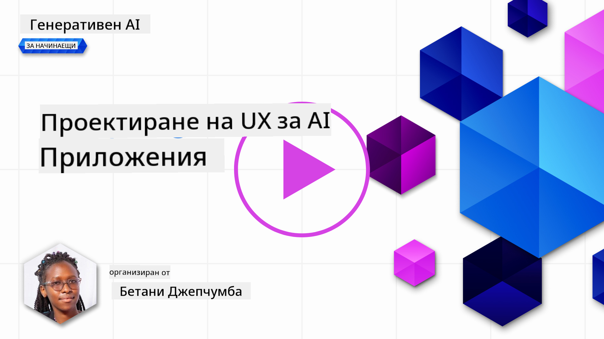
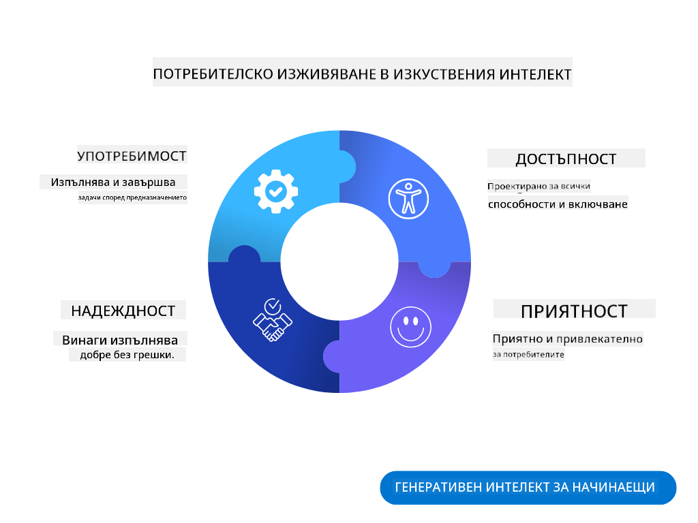
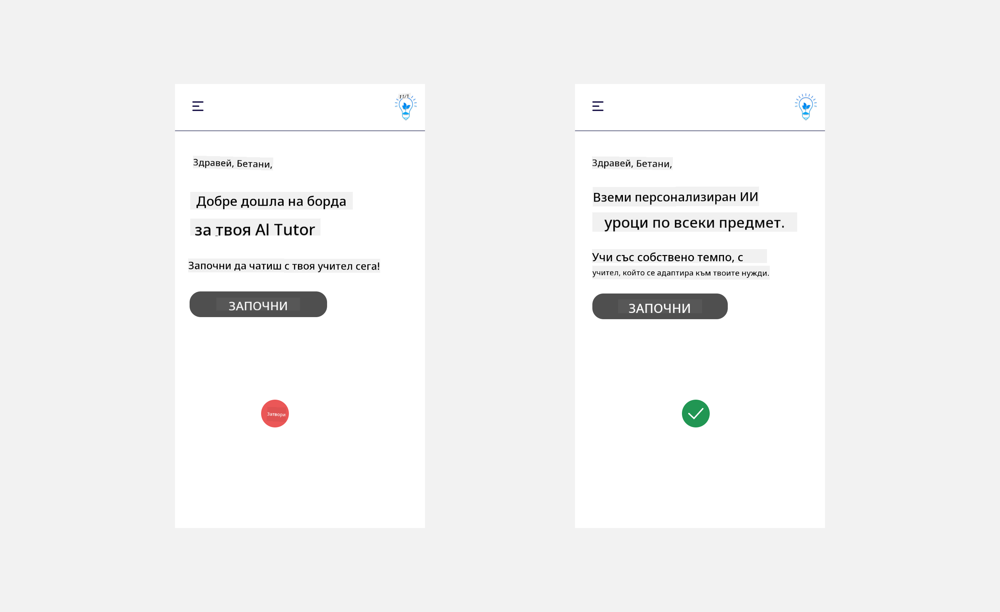
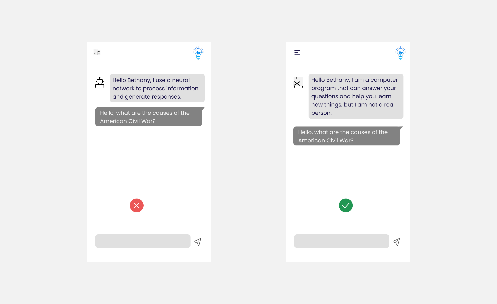
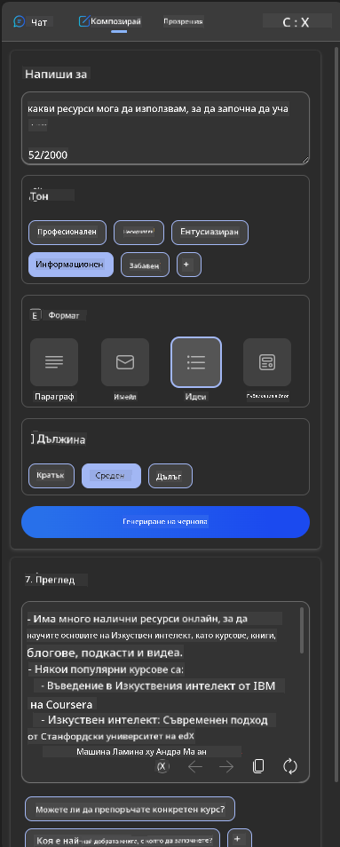
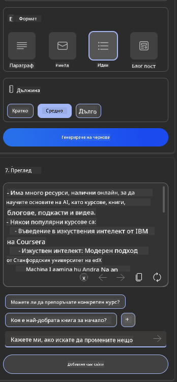
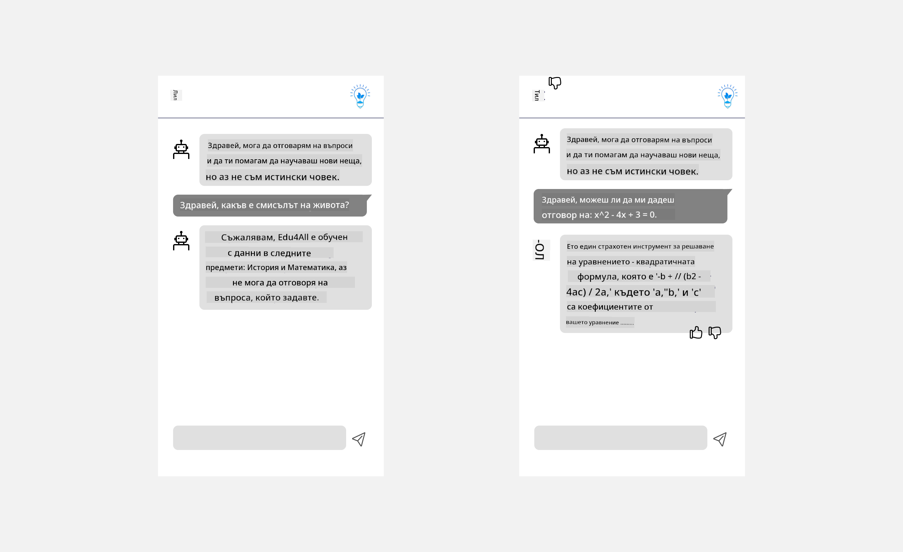

<!--
CO_OP_TRANSLATOR_METADATA:
{
  "original_hash": "ec385b41ee50579025d50cc03bfb3a25",
  "translation_date": "2025-05-19T22:06:22+00:00",
  "source_file": "12-designing-ux-for-ai-applications/README.md",
  "language_code": "bg"
}
-->
# Дизайн на потребителско изживяване за AI приложения

> _(Кликнете върху изображението по-горе, за да гледате видеото на този урок)_

Потребителското изживяване е много важен аспект при създаването на приложения. Потребителите трябва да могат да използват вашето приложение по ефективен начин за изпълнение на задачи. Да бъдеш ефективен е едно нещо, но също така трябва да проектирате приложения така, че да могат да бъдат използвани от всеки, за да ги направите _достъпни_. Тази глава ще се фокусира върху тази област, за да можете да проектирате приложение, което хората могат и искат да използват.

## Въведение

Потребителското изживяване е начинът, по който потребителят взаимодейства и използва даден продукт или услуга, било то система, инструмент или дизайн. При разработването на AI приложения, разработчиците не само се фокусират върху осигуряването на ефективно потребителско изживяване, но и върху етичното му използване. В този урок ще разгледаме как да създадем приложения с изкуствен интелект (AI), които отговарят на нуждите на потребителите.

Урокът ще обхване следните области:

- Въведение в потребителското изживяване и разбиране на нуждите на потребителите
- Дизайн на AI приложения за доверие и прозрачност
- Дизайн на AI приложения за сътрудничество и обратна връзка

## Цели на обучението

След като преминете този урок, ще можете да:

- Разберете как да създавате AI приложения, които отговарят на нуждите на потребителите.
- Проектирате AI приложения, които насърчават доверието и сътрудничеството.

### Предпоставки

Отделете време и прочетете повече за [потребителското изживяване и дизайн мисленето.](https://learn.microsoft.com/training/modules/ux-design?WT.mc_id=academic-105485-koreyst)

## Въведение в потребителското изживяване и разбиране на нуждите на потребителите

В нашия измислен образователен стартъп имаме двама основни потребители, учители и ученици. Всеки от тези потребители има уникални нужди. Дизайн, ориентиран към потребителя, приоритизира потребителя, като гарантира, че продуктите са релевантни и полезни за тези, за които са предназначени.

Приложението трябва да бъде **полезно, надеждно, достъпно и приятно**, за да осигури добро потребителско изживяване.

### Употреба

Да бъде полезно означава, че приложението има функционалност, която съответства на предназначението му, като например автоматизиране на процеса на оценяване или генериране на флашкарти за преговор. Приложение, което автоматизира процеса на оценяване, трябва да може точно и ефективно да присвоява оценки на работата на учениците въз основа на предварително определени критерии. По същия начин, приложение, което генерира флашкарти за преговор, трябва да може да създава релевантни и разнообразни въпроси въз основа на своите данни.

### Надеждност

Да бъде надеждно означава, че приложението може да изпълнява задачата си последователно и без грешки. Въпреки това, AI, както и хората, не е съвършен и може да бъде податлив на грешки. Приложенията могат да срещнат грешки или неочаквани ситуации, които изискват човешка намеса или корекция. Как се справяте с грешките? В последната част на този урок ще разгледаме как AI системите и приложенията са проектирани за сътрудничество и обратна връзка.

### Достъпност

Да бъде достъпно означава да се разшири потребителското изживяване до потребители с различни способности, включително тези с увреждания, като се гарантира, че никой не е изключен. Следвайки насоките и принципите за достъпност, AI решенията стават по-инклузивни, използваеми и полезни за всички потребители.

### Приятност

Да бъде приятно означава, че приложението е приятно за използване. Привлекателното потребителско изживяване може да има положителен ефект върху потребителя, като го насърчи да се върне към приложението и увеличи приходите на бизнеса.

Не всяко предизвикателство може да бъде решено с AI. AI идва, за да допълни вашето потребителско изживяване, било то автоматизиране на ръчни задачи или персонализиране на потребителски изживявания.

## Дизайн на AI приложения за доверие и прозрачност

Изграждането на доверие е от решаващо значение при проектирането на AI приложения. Доверието гарантира, че потребителят е уверен, че приложението ще свърши работата, ще предостави резултати последователно и че резултатите са това, от което потребителят се нуждае. Риск в тази област е недоверие и прекомерно доверие. Недоверието възниква, когато потребителят има малко или никакво доверие в AI система, което води до отхвърляне на вашето приложение. Прекомерното доверие възниква, когато потребителят надценява възможностите на AI система, което води до твърде голямо доверие в AI системата. Например, автоматизирана система за оценяване в случай на прекомерно доверие може да доведе до това учителят да не проверява някои от работите, за да се увери, че системата за оценяване работи добре. Това може да доведе до несправедливи или неточни оценки за учениците или пропуснати възможности за обратна връзка и подобрение.

Два начина да се гарантира, че доверието е поставено в центъра на дизайна, са обяснимостта и контролът.

### Обяснимост

Когато AI помага при вземането на решения, като предаване на знания на бъдещите поколения, е от съществено значение учителите и родителите да разбират как се вземат решенията от AI. Това е обяснимост - разбиране как AI приложенията вземат решения. Проектирането за обяснимост включва добавяне на подробности за примери за това, което AI приложение може да направи. Например, вместо "Започнете с AI учител", системата може да използва: "Обобщете вашите бележки за по-лесно преговаряне с помощта на AI."

Друг пример е как AI използва потребителски и лични данни. Например, потребител с персона студент може да има ограничения въз основа на своята персона. AI може да не е в състояние да разкрие отговори на въпроси, но може да помогне на потребителя да мисли как да реши даден проблем.

Последната ключова част от обяснимостта е опростяването на обясненията. Учениците и учителите може да не са експерти по AI, следователно обясненията за това какво приложението може или не може да направи трябва да бъдат опростени и лесни за разбиране.

### Контрол

Генеративният AI създава сътрудничество между AI и потребителя, където например потребителят може да модифицира команди за различни резултати. Освен това, след като се генерира изход, потребителите трябва да могат да модифицират резултатите, давайки им усещане за контрол. Например, когато използвате Bing, можете да персонализирате вашата команда въз основа на формат, тон и дължина. Освен това можете да добавяте промени към вашия изход и да модифицирате изхода, както е показано по-долу:

Друга функция в Bing, която позволява на потребителя да има контрол върху приложението, е възможността да се включва и изключва от данните, които AI използва. За училищно приложение ученикът може да иска да използва своите бележки, както и ресурсите на учителите като материали за преговор.

> При проектирането на AI приложения, намерението е ключово, за да се гарантира, че потребителите не се доверяват прекомерно, създавайки нереалистични очаквания за възможностите му. Един начин да направите това е чрез създаване на триене между командите и резултатите. Напомняйте на потребителя, че това е AI, а не човек

## Дизайн на AI приложения за сътрудничество и обратна връзка

Както беше споменато по-рано, генеративният AI създава сътрудничество между потребителя и AI. Повечето взаимодействия са с потребител, който въвежда команда, а AI генерира изход. Какво става, ако изходът е неправилен? Как приложението се справя с грешките, ако се появят? Обвинява ли AI потребителя или отделя време да обясни грешката?

AI приложенията трябва да бъдат създадени, за да получават и дават обратна връзка. Това не само помага на AI системата да се подобри, но и изгражда доверие с потребителите. Обратната връзка трябва да бъде включена в дизайна, например чрез просто палец нагоре или надолу върху изхода.

Друг начин за справяне с това е ясно да се комуникират възможностите и ограниченията на системата. Когато потребителят направи грешка, изисквайки нещо извън възможностите на AI, трябва да има начин да се справи с това, както е показано по-долу.

Системните грешки са често срещани при приложения, където потребителят може да се нуждае от помощ с информация извън обхвата на AI или приложението може да има ограничение за това колко въпроси/предмети може да генерира обобщения. Например, AI приложение, обучено с данни за ограничени предмети, като История и Математика, може да не може да се справи с въпроси по География. За да се смекчи това, AI системата може да даде отговор като: "Съжалявам, нашият продукт е обучен с данни по следните предмети....., не мога да отговоря на въпроса, който зададохте."

AI приложенията не са перфектни, следователно те са склонни да правят грешки. Когато проектирате вашите приложения, трябва да се уверите, че създавате възможност за обратна връзка от потребителите и обработка на грешки по начин, който е прост и лесен за обяснение.

## Задание

Вземете някое AI приложение, което сте създали досега, и обмислете внедряването на следните стъпки в приложението си:

- **Приятност:** Обмислете как можете да направите вашето приложение по-приятно. Добавяте ли обяснения навсякъде? Насърчавате ли потребителя да изследва? Как формулирате съобщенията за грешки?

- **Употреба:** Създаване на уеб приложение. Уверете се, че вашето приложение е навигируемо както с мишка, така и с клавиатура.

- **Доверие и прозрачност:** Не се доверявайте напълно на AI и неговия изход, обмислете как бихте добавили човек в процеса за проверка на изхода. Също така, обмислете и внедрете други начини за постигане на доверие и прозрачност.

- **Контрол:** Дайте на потребителя контрол върху данните, които предоставя на приложението. Внедрете начин, по който потребителят може да се включва и изключва от събирането на данни в AI приложението.

## Продължете с вашето обучение!

След като завършите този урок, разгледайте нашата [колекция за обучение по генеративен AI](https://aka.ms/genai-collection?WT.mc_id=academic-105485-koreyst), за да продължите да развивате знанията си за генеративния AI!

Преминете към Урок 13, където ще разгледаме как да [осигурим сигурност на AI приложенията](../13-securing-ai-applications/README.md?WT.mc_id=academic-105485-koreyst)!

**Отказ от отговорност**: 
Този документ е преведен с помощта на AI услуга за превод [Co-op Translator](https://github.com/Azure/co-op-translator). Въпреки че се стремим към точност, моля, имайте предвид, че автоматизираните преводи може да съдържат грешки или неточности. Оригиналният документ на неговия роден език трябва да се счита за авторитетен източник. За критична информация се препоръчва професионален човешки превод. Не носим отговорност за недоразумения или неправилни интерпретации, възникнали от използването на този превод.