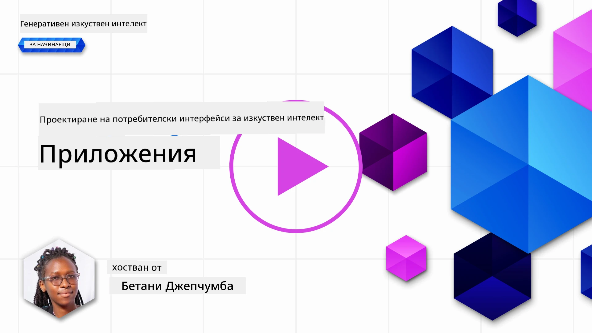
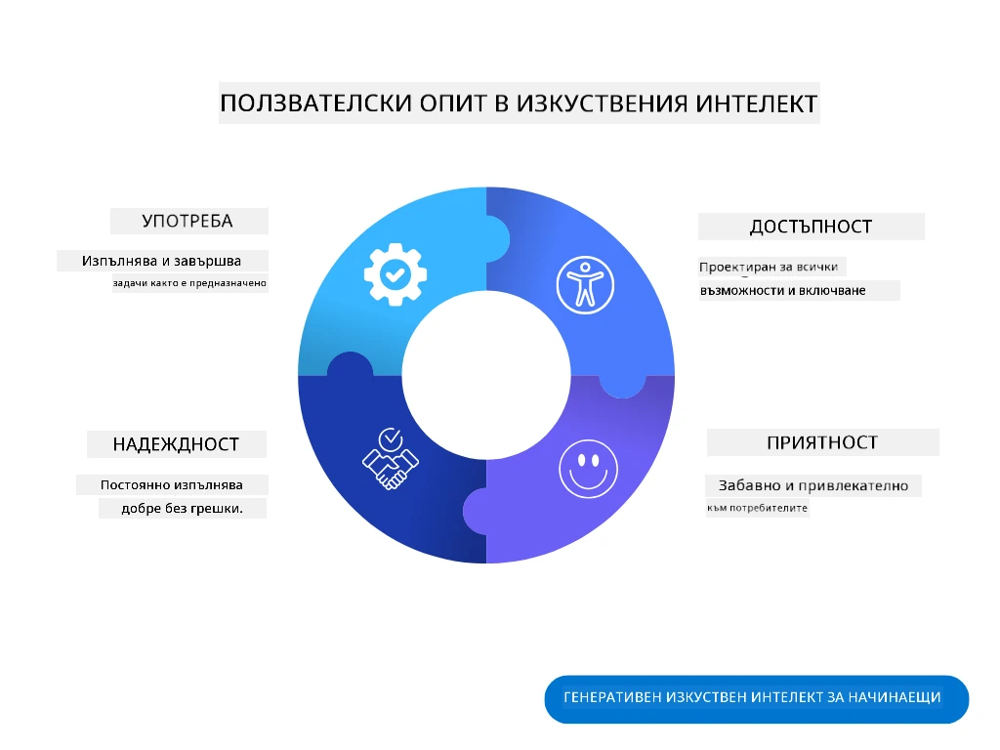
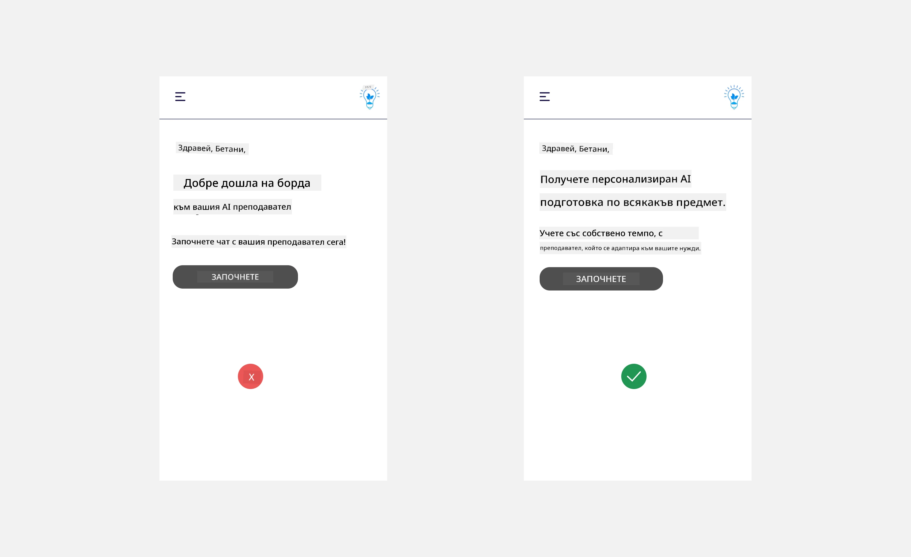
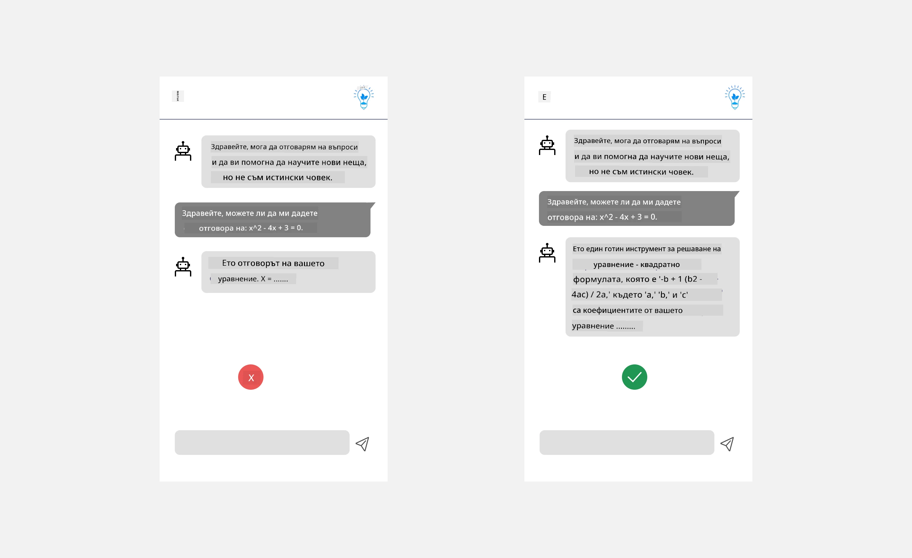
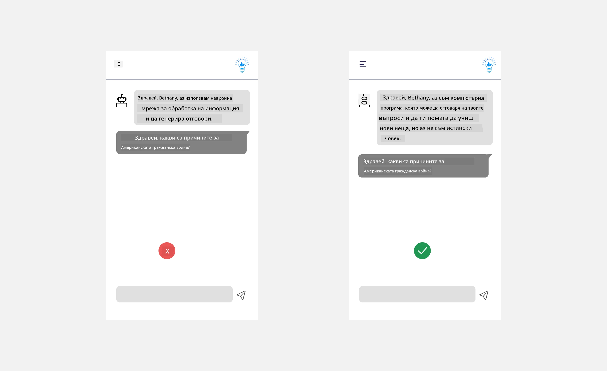
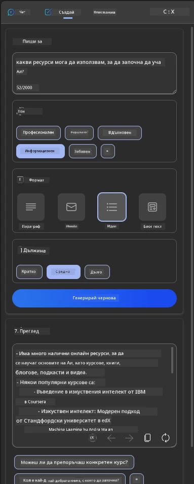
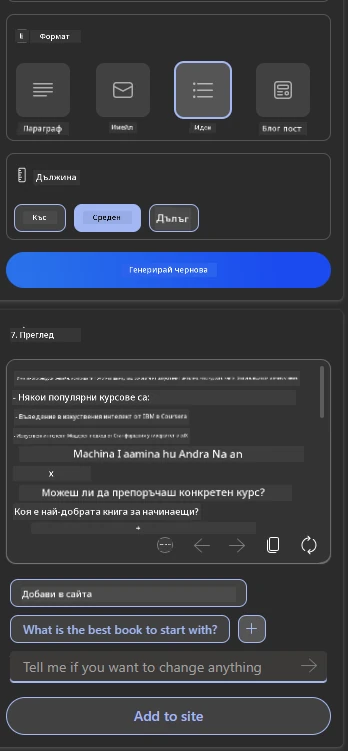
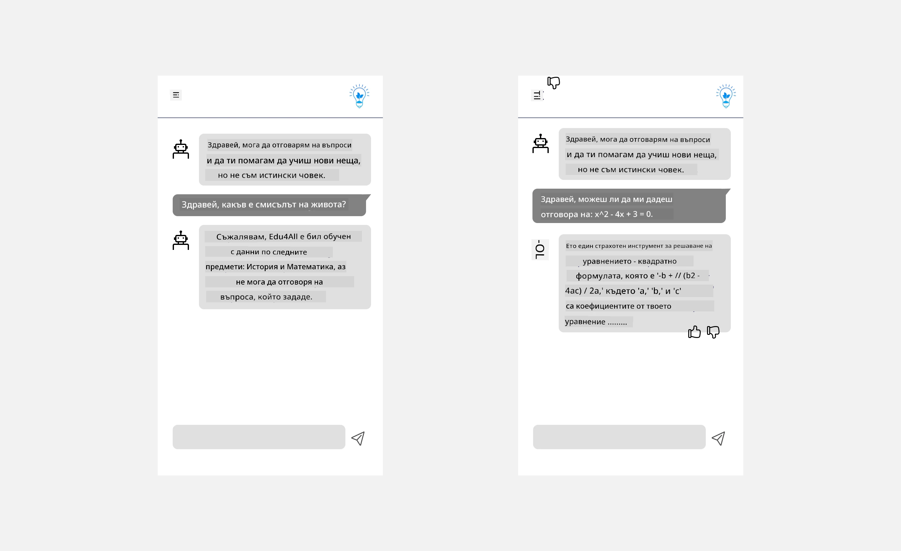

# Проектиране на UX за AI приложения

> _(Кликнете върху изображението по-горе, за да гледате видеото на този урок)_

Потребителското преживяване е много важен аспект при изграждането на приложения. Потребителите трябва да могат да използват вашето приложение по ефективен начин, за да изпълняват задачи. Бъдещата ефективност е едно нещо, но също така трябва да проектирате приложения, които да могат да се използват от всички, за да ги направите _достъпни_. Тази глава ще се съсредоточи върху тази област, за да се надяваме, че накрая ще проектирате приложение, което хората могат и искат да използват.

## Въведение

Потребителското преживяване е как потребителят взаимодейства и използва конкретен продукт или услуга, било то система, инструмент или дизайн. При разработването на AI приложения, разработчиците не само се фокусират върху ефективността на потребителското изживяване, но и върху етиката. В този урок ще разгледаме как да изградим приложения с изкуствен интелект (AI), които отговарят на нуждите на потребителите.

Урокът ще обхване следните области:

- Въведение в потребителското изживяване и разбиране на нуждите на потребителите
- Проектиране на AI приложения за доверие и прозрачност
- Проектиране на AI приложения за сътрудничество и обратна връзка

## Учебни цели

След този урок ще можете да:

- Разберете как да изградите AI приложения, които отговарят на нуждите на потребителите.
- Проектирайте AI приложения, които насърчават доверието и сътрудничеството.

### Предварителни изисквания

Отделете време и прочетете повече за [потребителското преживяване и дизайн мисленето.](https://learn.microsoft.com/training/modules/ux-design?WT.mc_id=academic-105485-koreyst)

## Въведение в потребителското изживяване и разбиране на нуждите на потребителите

В нашия въображаем стартъп в областта на образованието имаме двама основни потребители - учители и ученици. Всеки от двамата потребители има уникални нужди. Проектиране, ориентирано към потребителя, поставя приоритет на потребителя, като гарантира, че продуктите са релевантни и полезни за тези, за които са предназначени.

Приложението трябва да е **полезно, надеждно, достъпно и приятно** за осигуряване на добро потребителско изживяване.

### Полезност

Да бъде полезно означава, че приложението има функционалност, отговаряща на целта му, като например автоматизиране на процеса на оценяване или генериране на флашкарти за преговор. Приложение, което автоматизира процеса на оценяване, трябва да може точно и ефективно да присъжда оценки на работата на учениците въз основа на предварително определени критерии. По същия начин приложението, което генерира преговорни флашкарти, трябва да създава релевантни и разнообразни въпроси въз основа на данните си.

### Надеждност

Да бъде надеждно означава, че приложението може да изпълнява задачата си последователно и без грешки. Въпреки това, AI, точно като хората, не е перфектен и може да допуска грешки. Приложенията могат да срещнат грешки или неочаквани ситуации, които изискват човешка намеса или корекция. Как се справяте с грешките? В последната част на този урок ще разгледаме как системите и приложенията с AI са проектирани за сътрудничество и обратна връзка.

### Достъпност

Да бъде достъпно означава, че потребителското изживяване се разширява към потребители с различни възможности, включително такива с увреждания, като се гарантира, че никой не е изключен. Следвайки насоките и принципите за достъпност, AI решенията стават по-всеобхватни, използваеми и полезни за всички потребители.

### Приятно

Да бъде приятно означава, че приложението е приятно за използване. Привлекателното потребителско изживяване може да окаже положително въздействие върху потребителя, насърчавайки го да се връща към приложението и увеличавайки приходите на бизнеса.

Не всяко предизвикателство може да бъде решено с AI. AI идва, за да допълни вашето потребителско изживяване, било то автоматизиране на ръчни задачи или персонализиране на потребителските преживявания.

## Проектиране на AI приложения за доверие и прозрачност

Изграждането на доверие е критично при проектирането на AI приложения. Доверието гарантира, че потребителят е уверен, че приложението ще свърши работа, ще доставя резултати последователно и резултатите са това, от което потребителят се нуждае. Риск в тази област е недоверието и прекомерното доверие. Недоверието се появява, когато потребителят има малко или никакво доверие в AI система, което води до отхвърляне на вашето приложение. Прекомерното доверие възниква, когато потребителят надценява способностите на AI система, което води до прекалено доверие в AI системата. Например, автоматизирана система за оценяване при прекомерно доверие може да накара учителя да не прегледа някои от работите, за да гарантира, че системата за оценяване работи добре. Това може да доведе до несправедливи или неточни оценки за учениците или пропуснати възможности за обратна връзка и подобрение.

Два начина за поставяне на доверието в центъра на дизайна са обяснимост и контрол.

### Обяснимост

Когато AI помага за информиране на решения, като например предаването на знания на бъдещите поколения, е от съществено значение учителите и родителите да разбират как се вземат AI решенията. Това е обяснимост - разбирането как AI приложенията правят решения. Проектирането за обяснимост включва добавяне на детайли, които подчертават как AI е стигнал до резултата. Аудиторията трябва да е наясно, че резултатът е генериран от AI, а не от човека. Например, вместо да казвате "Започнете чат с вашия учител сега", кажете "Използвайте AI учител, който се адаптира към вашите нужди и ви помага да учите със свое темпо."

Друг пример е как AI използва потребителски и лични данни. Например потребител с ролята студент може да има ограничения на базата на своята роля. AI може да не е в състояние да разкрие отговори на въпроси, но може да помогне на потребителя да размишлява върху това как може да реши даден проблем.

Последната ключова част от обяснимостта е опростяването на обясненията. Учениците и учителите може да не са експерти по AI, затова обясненията за това какво приложението може или не може да направи трябва да са опростени и лесни за разбиране.

### Контрол

Генеративният AI създава сътрудничество между AI и потребителя, където например потребителят може да модифицира заявките за различни резултати. Освен това, след като се генерира резултат, потребителите трябва да могат да го променят, давайки им усещане за контрол. Например при използването на Microsoft Copilot (преди Bing Chat) можете да персонализирате заявката си според формат, тон и дължина. Освен това можете да добавяте промени към изхода и да го модифицирате, както е показано по-долу:

Друга функция в Microsoft Copilot, която позволява на потребителя да има контрол върху приложението, е възможността да се включва или изключва използването на данните от AI. За училищно приложение, ученик може да иска да използва своите бележки, както и ресурсите на учителите като материал за преговор.

> При проектирането на AI приложения преднамереността е ключова за гарантиране, че потребителите не се доверяват прекалено, като създават нереалистични очаквания за възможностите му. Един начин да го направите е чрез създаване на триене между заявките и резултатите. Напомняне на потребителя, че това е AI, а не друг човек

## Проектиране на AI приложения за сътрудничество и обратна връзка

Както беше споменато по-рано, генеративният AI създава сътрудничество между потребителя и AI. Повечето взаимодействия са с потребител, въвеждащ заявка, и AI, който генерира резултат. Какво става, ако резултатът е грешен? Как приложението се справя с грешки, ако възникнат? Обвинява ли AI потребителя или отделя време да обясни грешката?

AI приложенията трябва да бъдат изградени да получават и дават обратна връзка. Това не само помага на AI системата да се подобри, но и изгражда доверие с потребителите. В дизайна трябва да бъде включен цикъл за обратна връзка, например прост палец нагоре или надолу върху резултата.

Друг начин за справяне с това е ясно да се комуникират възможностите и ограниченията на системата. Когато потребител прави грешка, искайки нещо извън възможностите на AI, трябва да има и начин за справяне с това, както е показано по-долу.

Грешките в системата са често срещани при приложения, където потребителят може да се нуждае от помощ с информация извън обхвата на AI или приложението може да има ограничение за броя въпроси/теми, за които потребителят може да генерира резюмета. Например, AI приложение, обучено с данни за ограничени предмети като история и математика, може да не може да обработи въпроси по география. За да се смекчи това, AI системата може да даде отговор като: "Извинете, нашият продукт е обучен с данни в следните предмети....., не мога да отговоря на зададения въпрос."

AI приложенията не са перфектни, затова е неизбежно да правят грешки. При проектирането на вашите приложения трябва да осигурите място за обратна връзка от потребителите и управление на грешки по начин, който е прост и лесно обясним.

## Задание

Вземете всяко AI приложение, което сте изградили досега, и обмислете да приложите следните стъпки във вашето приложение:

- **Приятно:** Обмислете как можете да направите приложението си по-приятно. Добавяте ли обяснения навсякъде? Насърчавате ли потребителя да изследва? Как формулирате съобщенията за грешки?

- **Полезност:** Ако изграждате уеб приложение, уверете се, че е навигируемо както с мишка, така и с клавиатура.

- **Доверие и прозрачност:** Не се доверявайте напълно на AI и неговия изход. Обмислете как бихте добавили човек в процеса за проверка на резултата. Също така обмислете и приложете други начини за постигане на доверие и прозрачност.

- **Контрол:** Дайте на потребителя контрол върху данните, които предоставя на приложението. Внедрете начин потребителят да може да се включва и изключва от събирането на данни в AI приложението.

<!-- ## [Post-lecture quiz](../../../12-designing-ux-for-ai-applications/quiz-url) -->

## Продължете да учите!

След като завършите този урок, разгледайте нашата [колекция за обучение по генеративен AI](https://aka.ms/genai-collection?WT.mc_id=academic-105485-koreyst), за да продължите да повишавате знанията си за генеративен AI!

Отидете към урок 13, където ще разгледаме как да [осигурим AI приложения](../13-securing-ai-applications/README.md?WT.mc_id=academic-105485-koreyst)!

---

<!-- CO-OP TRANSLATOR DISCLAIMER START -->
**Отказ от отговорност**:
Този документ е преведен с помощта на AI преводачески услуга [Co-op Translator](https://github.com/Azure/co-op-translator). Въпреки че се стремим към точност, моля имайте предвид, че автоматизираните преводи могат да съдържат грешки или неточности. Оригиналният документ на неговия роден език трябва да се счита за авторитетен източник. За критична информация се препоръчва професионален човешки превод. Ние не носим отговорност за каквито и да е недоразумения или неправилни тълкувания, произтичащи от използването на този превод.
<!-- CO-OP TRANSLATOR DISCLAIMER END -->