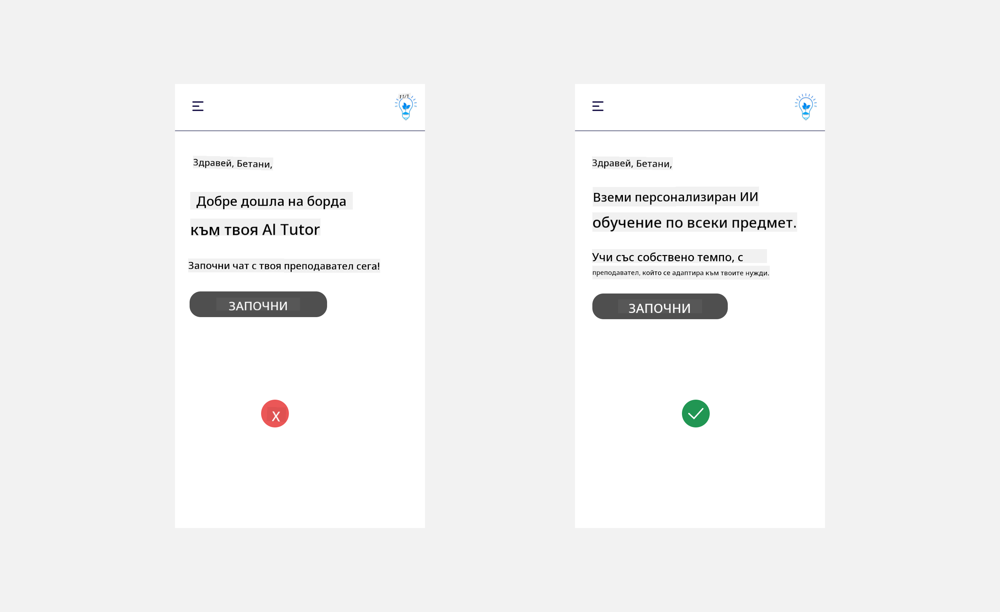

<!--
CO_OP_TRANSLATOR_METADATA:
{
  "original_hash": "78bbeed50fd4dc9fdee931f5daf98cb3",
  "translation_date": "2025-10-17T22:14:45+00:00",
  "source_file": "12-designing-ux-for-ai-applications/README.md",
  "language_code": "bg"
}
-->
# Проектиране на UX за AI приложения

> _(Кликнете върху изображението по-горе, за да гледате видеото на този урок)_

Потребителското изживяване е много важен аспект при създаването на приложения. Потребителите трябва да могат да използват вашето приложение ефективно, за да изпълняват задачи. Ефективността е едно нещо, но трябва също така да проектирате приложения така, че да могат да бъдат използвани от всички, за да ги направите _достъпни_. Тази глава ще се фокусира върху тази област, за да ви помогне да създадете приложение, което хората могат и искат да използват.

## Въведение

Потребителското изживяване е начинът, по който потребителят взаимодейства с и използва конкретен продукт или услуга, било то система, инструмент или дизайн. При разработването на AI приложения, разработчиците не само се фокусират върху осигуряването на ефективно потребителско изживяване, но и върху етичността. В този урок ще разгледаме как да създаваме приложения с изкуствен интелект (AI), които отговарят на нуждите на потребителите.

Урокът ще обхване следните области:

- Въведение в потребителското изживяване и разбиране на нуждите на потребителите
- Проектиране на AI приложения за доверие и прозрачност
- Проектиране на AI приложения за сътрудничество и обратна връзка

## Цели на обучението

След като преминете този урок, ще можете:

- Да разберете как да създавате AI приложения, които отговарят на нуждите на потребителите.
- Да проектирате AI приложения, които насърчават доверие и сътрудничество.

### Предварителни изисквания

Отделете време и прочетете повече за [потребителското изживяване и дизайн мисленето.](https://learn.microsoft.com/training/modules/ux-design?WT.mc_id=academic-105485-koreyst)

## Въведение в потребителското изживяване и разбиране на нуждите на потребителите

В нашия измислен стартъп за образование имаме два основни типа потребители: учители и ученици. Всеки от тези два типа потребители има уникални нужди. Дизайнът, ориентиран към потребителя, поставя потребителя на първо място, като гарантира, че продуктите са подходящи и полезни за тези, за които са предназначени.

Приложението трябва да бъде **полезно, надеждно, достъпно и приятно**, за да предостави добро потребителско изживяване.

### Полезност

Да бъде полезно означава, че приложението има функционалност, която съответства на предназначението му, като например автоматизиране на процеса на оценяване или генериране на учебни карти за преговор. Приложение, което автоматизира процеса на оценяване, трябва да може точно и ефективно да присвоява оценки на работата на учениците въз основа на предварително определени критерии. По същия начин, приложение, което генерира учебни карти, трябва да може да създава подходящи и разнообразни въпроси въз основа на наличните данни.

### Надеждност

Да бъде надеждно означава, че приложението може да изпълнява задачите си последователно и без грешки. Въпреки това, AI, както и хората, не е перфектен и може да бъде податлив на грешки. Приложенията могат да срещнат грешки или неочаквани ситуации, които изискват човешка намеса или корекция. Как се справяте с грешките? В последната част на този урок ще разгледаме как AI системите и приложенията са проектирани за сътрудничество и обратна връзка.

### Достъпност

Да бъде достъпно означава да се разшири потребителското изживяване до потребители с различни способности, включително тези с увреждания, като се гарантира, че никой не е изключен. Следвайки насоките и принципите за достъпност, AI решенията стават по-инклузивни, удобни и полезни за всички потребители.

### Приятност

Да бъде приятно означава, че приложението е приятно за използване. Привлекателното потребителско изживяване може да има положително въздействие върху потребителя, като го насърчи да се върне към приложението и да увеличи приходите на бизнеса.

Не всяко предизвикателство може да бъде решено с AI. AI се използва за подобряване на потребителското изживяване, било то автоматизиране на ръчни задачи или персонализиране на потребителски изживявания.

## Проектиране на AI приложения за доверие и прозрачност

Изграждането на доверие е от решаващо значение при проектирането на AI приложения. Доверието гарантира, че потребителят е уверен, че приложението ще свърши работата, ще предостави резултати последователно и че резултатите са това, което потребителят очаква. Рискът в тази област е недоверие и прекомерно доверие. Недоверието възниква, когато потребителят има малко или никакво доверие в AI системата, което води до отхвърляне на вашето приложение. Прекомерното доверие възниква, когато потребителят надценява способностите на AI системата, което води до прекомерно доверие в нея. Например, автоматизирана система за оценяване в случай на прекомерно доверие може да доведе до това учителят да не проверява някои от работите, за да се увери, че системата за оценяване работи правилно. Това може да доведе до несправедливи или неточни оценки за учениците или пропуснати възможности за обратна връзка и подобрение.

Два начина да се гарантира, че доверието е поставено в центъра на дизайна, са обяснимост и контрол.

### Обяснимост

Когато AI помага за вземане на решения, като например предаване на знания на бъдещите поколения, е важно учителите и родителите да разбират как се вземат решенията от AI. Това е обяснимост - разбирането как AI приложенията вземат решения. Проектирането за обяснимост включва добавяне на подробности, които подчертават как AI е стигнал до даден резултат. Аудиторията трябва да е наясно, че резултатът е генериран от AI, а не от човек. Например, вместо да се казва "Започнете чат с вашия преподавател сега", може да се каже "Използвайте AI преподавател, който се адаптира към вашите нужди и ви помага да учите със собствено темпо."

Друг пример е как AI използва потребителски и лични данни. Например, потребител с персона ученик може да има ограничения, базирани на неговата персона. AI може да не успее да разкрие отговори на въпроси, но може да помогне на потребителя да се замисли как да реши даден проблем.

Последната ключова част от обяснимостта е опростяването на обясненията. Учениците и учителите може да не са експерти по AI, затова обясненията за това какво приложението може или не може да направи трябва да бъдат опростени и лесни за разбиране.

### Контрол

Генеративният AI създава сътрудничество между AI и потребителя, където например потребителят може да модифицира запитванията за различни резултати. Освен това, след като бъде генериран резултат, потребителите трябва да могат да го модифицират, което им дава усещане за контрол. Например, когато използвате Bing, можете да персонализирате запитването си въз основа на формат, тон и дължина. Освен това можете да правите промени в резултата и да го модифицирате, както е показано по-долу:

Друга функция в Bing, която позволява на потребителя да има контрол върху приложението, е възможността да се включва и изключва събирането на данни, които AI използва. За училищно приложение, ученик може да иска да използва своите бележки, както и ресурсите на учителите като учебен материал.

> При проектирането на AI приложения, намерението е ключово за гарантиране, че потребителите не се доверяват прекомерно, създавайки нереалистични очаквания за неговите способности. Един начин да се постигне това е чрез създаване на "триене" между запитванията и резултатите. Напомняне на потребителя, че това е AI, а не друг човек.

## Проектиране на AI приложения за сътрудничество и обратна връзка

Както беше споменато по-рано, генеративният AI създава сътрудничество между потребителя и AI. Повечето взаимодействия се състоят в това, че потребителят въвежда запитване, а AI генерира резултат. Какво се случва, ако резултатът е грешен? Как приложението се справя с грешки, ако възникнат? Дали AI обвинява потребителя или отделя време да обясни грешката?

AI приложенията трябва да бъдат проектирани така, че да могат да получават и предоставят обратна връзка. Това не само помага на AI системата да се подобри, но и изгражда доверие с потребителите. В дизайна трябва да бъде включен цикъл за обратна връзка, пример за който може да бъде прост бутон за харесване или нехаресване на резултата.

Друг начин за справяне с това е ясно да се комуникират възможностите и ограниченията на системата. Когато потребителят направи грешка, като поиска нещо извън възможностите на AI, трябва да има начин да се справи с това, както е показано по-долу.

Системните грешки са често срещани при приложения, където потребителят може да се нуждае от помощ с информация извън обхвата на AI или приложението може да има ограничение за броя въпроси/предмети, за които потребителят може да генерира резюмета. Например, AI приложение, обучено с данни за ограничен брой предмети, като История и Математика, може да не успее да отговори на въпроси, свързани с География. За да се справи с това, AI системата може да даде отговор като: "Съжалявам, нашият продукт е обучен с данни за следните предмети....., не мога да отговоря на въпроса, който зададохте."

AI приложенията не са перфектни, следователно те са склонни към грешки. При проектирането на вашите приложения трябва да се уверите, че създавате възможност за обратна връзка от потребителите и справяне с грешки по начин, който е прост и лесно разбираем.

## Задача

Вземете някое AI приложение, което сте създали досега, и обмислете да приложите следните стъпки в него:

- **Приятност:** Помислете как можете да направите приложението си по-приятно. Добавяте ли обяснения навсякъде? Насърчавате ли потребителя да изследва? Как формулирате съобщенията за грешки?

- **Полезност:** Ако създавате уеб приложение, уверете се, че то може да се навигира както с мишка, така и с клавиатура.

- **Доверие и прозрачност:** Не се доверявайте напълно на AI и неговите резултати, помислете как бихте добавили човек в процеса за проверка на резултатите. Също така обмислете и приложете други начини за постигане на доверие и прозрачност.

- **Контрол:** Дайте на потребителя контрол върху данните, които предоставя на приложението. Реализирайте начин, по който потребителят може да се включи или изключи от събирането на данни в AI приложението.

<!-- ## [Тест след лекцията](../../../12-designing-ux-for-ai-applications/quiz-url) -->

## Продължете обучението си!

След като завършите този урок, разгледайте нашата [колекция за обучение по генеративен AI](https://aka.ms/genai-collection?WT.mc_id=academic-105485-koreyst), за да продължите да развивате знанията си за генеративен AI!

Преминете към Урок 13, където ще разгледаме как да [осигурим безопасността на AI приложенията](../13-securing-ai-applications/README.md?WT.mc_id=academic-105485-koreyst)!

---

**Отказ от отговорност**:  
Този документ е преведен с помощта на AI услуга за превод [Co-op Translator](https://github.com/Azure/co-op-translator). Въпреки че се стремим към точност, моля, имайте предвид, че автоматизираните преводи може да съдържат грешки или неточности. Оригиналният документ на неговия роден език трябва да се счита за авторитетен източник. За критична информация се препоръчва професионален човешки превод. Ние не носим отговорност за каквито и да е недоразумения или погрешни интерпретации, произтичащи от използването на този превод.