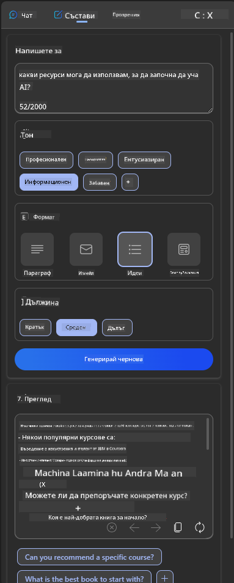

<!--
CO_OP_TRANSLATOR_METADATA:
{
  "original_hash": "ec385b41ee50579025d50cc03bfb3a25",
  "translation_date": "2025-07-09T15:05:07+00:00",
  "source_file": "12-designing-ux-for-ai-applications/README.md",
  "language_code": "bg"
}
-->
# Проектиране на UX за AI приложения

> _(Кликнете върху изображението по-горе, за да гледате видеото на този урок)_

Потребителското изживяване е много важен аспект при създаването на приложения. Потребителите трябва да могат да използват вашето приложение ефективно, за да изпълняват задачи. Ефективността е едно, но също така трябва да проектирате приложения, които да могат да се използват от всички, за да ги направите _достъпни_. Тази глава ще се фокусира върху тази област, за да можете в крайна сметка да създадете приложение, което хората могат и искат да използват.

## Въведение

Потребителското изживяване е начинът, по който потребителят взаимодейства и използва конкретен продукт или услуга, било то система, инструмент или дизайн. При разработването на AI приложения, разработчиците не само се стремят да осигурят ефективно потребителско изживяване, но и етично. В този урок разглеждаме как да създадем приложения с изкуствен интелект (AI), които отговарят на нуждите на потребителите.

Урокът ще обхване следните теми:

- Въведение в потребителското изживяване и разбиране на нуждите на потребителите
- Проектиране на AI приложения за доверие и прозрачност
- Проектиране на AI приложения за сътрудничество и обратна връзка

## Цели на обучението

След като преминете този урок, ще можете да:

- Разберете как да създавате AI приложения, които отговарят на нуждите на потребителите.
- Проектирате AI приложения, които насърчават доверието и сътрудничеството.

### Предварителни изисквания

Отделете време да прочетете повече за [потребителското изживяване и дизайн мисленето.](https://learn.microsoft.com/training/modules/ux-design?WT.mc_id=academic-105485-koreyst)

## Въведение в потребителското изживяване и разбиране на нуждите на потребителите

В нашия измислен образователен стартъп имаме двама основни потребители – учители и ученици. Всеки от тях има уникални нужди. Дизайнът, ориентиран към потребителя, поставя потребителя на първо място, като гарантира, че продуктите са релевантни и полезни за тези, за които са предназначени.

Приложението трябва да бъде **полезно, надеждно, достъпно и приятно**, за да осигури добро потребителско изживяване.

### Полезност

Да бъде полезно означава, че приложението има функционалност, която съответства на предназначението му, например автоматизиране на процеса на оценяване или генериране на флашкарти за преговор. Приложение, което автоматизира оценяването, трябва да може точно и ефективно да присвоява оценки на работата на учениците според предварително зададени критерии. По същия начин приложение, което генерира флашкарти за преговор, трябва да създава релевантни и разнообразни въпроси въз основа на своите данни.

### Надеждност

Да бъде надеждно означава, че приложението може да изпълнява задачата си последователно и без грешки. Въпреки това, AI, както и хората, не е съвършен и може да допуска грешки. Приложенията могат да срещнат грешки или неочаквани ситуации, които изискват човешка намеса или корекция. Как се справяте с грешките? В последната част на този урок ще разгледаме как AI системите и приложенията са проектирани за сътрудничество и обратна връзка.

### Достъпност

Да бъде достъпно означава да се разшири потребителското изживяване към потребители с различни възможности, включително хора с увреждания, като се гарантира, че никой не е изключен. Следвайки насоките и принципите за достъпност, AI решенията стават по-инклузивни, удобни за ползване и полезни за всички потребители.

### Приятно изживяване

Да бъде приятно означава, че приложението е приятно за използване. Привлекателното потребителско изживяване може да има положително въздействие върху потребителя, като го насърчава да се връща към приложението и увеличава приходите на бизнеса.

Не всеки проблем може да бъде решен с AI. AI идва, за да допълни вашето потребителско изживяване, било то чрез автоматизиране на ръчни задачи или персонализиране на потребителските изживявания.

## Проектиране на AI приложения за доверие и прозрачност

Изграждането на доверие е от ключово значение при проектирането на AI приложения. Доверието гарантира, че потребителят е уверен, че приложението ще свърши работата, ще доставя резултати последователно и резултатите са това, от което потребителят се нуждае. Риск в тази област са недоверието и прекаленото доверие. Недоверието възниква, когато потребителят има малко или никакво доверие в AI система, което води до отхвърляне на приложението. Прекаленото доверие се появява, когато потребителят надценява възможностите на AI системата, което води до прекалено доверие в нея. Например, при автоматизирана система за оценяване, прекаленото доверие може да доведе до това учителят да не преглежда някои от работите, за да се увери, че системата работи правилно. Това може да доведе до несправедливи или неточни оценки за учениците или пропуснати възможности за обратна връзка и подобрение.

Два начина да се гарантира, че доверието е в центъра на дизайна, са обяснимостта и контрола.

### Обяснимост

Когато AI помага при вземането на решения, като например предаване на знания на бъдещите поколения, е критично учителите и родителите да разбират как се вземат решенията от AI. Това е обяснимост – разбирането как AI приложенията вземат решения. Проектирането за обяснимост включва добавяне на примери за това какво може да направи AI приложението. Например, вместо "Започнете с AI учител", системата може да използва: "Обобщете бележките си за по-лесен преговор с помощта на AI."

Друг пример е как AI използва потребителски и лични данни. Например, потребител с персона ученик може да има ограничения, базирани на своята персона. AI може да не може да разкрие отговори на въпроси, но може да помогне на потребителя да помисли как да реши даден проблем.

Последната ключова част от обяснимостта е опростяването на обясненията. Учениците и учителите може да не са експерти по AI, затова обясненията за това какво приложението може или не може да направи трябва да са опростени и лесни за разбиране.

### Контрол

Генеративният AI създава сътрудничество между AI и потребителя, където например потребителят може да променя подканите за различни резултати. Освен това, след като се генерира резултат, потребителите трябва да могат да го променят, което им дава усещане за контрол. Например, при използване на Bing можете да настроите подканата си според формат, тон и дължина. Освен това можете да добавяте промени към резултата и да го модифицирате, както е показано по-долу:

Друга функция в Bing, която позволява на потребителя да контролира приложението, е възможността да се включва и изключва използването на данните от AI. За училищно приложение ученик може да иска да използва своите бележки, както и ресурсите на учителите като материал за преговор.

> При проектирането на AI приложения, умишлеността е ключова, за да се гарантира, че потребителите не се доверяват прекалено и не създават нереалистични очаквания за възможностите му. Един от начините да се постигне това е чрез създаване на съпротива между подканите и резултатите. Напомняйки на потребителя, че това е AI, а не друг човек.

## Проектиране на AI приложения за сътрудничество и обратна връзка

Както беше споменато по-рано, генеративният AI създава сътрудничество между потребителя и AI. Повечето взаимодействия са с потребител, който въвежда подканваща фраза, и AI, който генерира резултат. Какво се случва, ако резултатът е грешен? Как приложението се справя с грешки, ако възникнат? Обвинява ли AI потребителя или отделя време да обясни грешката?

AI приложенията трябва да бъдат изградени така, че да получават и дават обратна връзка. Това не само помага на AI системата да се подобрява, но и изгражда доверие с потребителите. В дизайна трябва да бъде включен цикъл за обратна връзка, например прост бутон с палец нагоре или надолу за оценка на резултата.

Друг начин за справяне с това е ясно да се комуникират възможностите и ограниченията на системата. Когато потребителят направи грешка, като поиска нещо извън възможностите на AI, трябва да има начин да се обработи това, както е показано по-долу.

Системните грешки са често срещани при приложения, където потребителят може да се нуждае от помощ с информация извън обхвата на AI или приложението може да има ограничение за броя въпроси/предмети, за които потребителят може да генерира обобщения. Например, AI приложение, обучено с данни по ограничени предмети, например История и Математика, може да не може да отговаря на въпроси по География. За да се избегне това, AI системата може да даде отговор като: "Съжаляваме, нашият продукт е обучен с данни по следните предмети..., не мога да отговоря на зададения въпрос."

AI приложенията не са съвършени, затова е неизбежно да допускат грешки. При проектирането на вашите приложения трябва да осигурите възможност за обратна връзка от потребителите и обработка на грешки по начин, който е прост и лесен за обяснение.

## Задача

Вземете някое от AI приложенията, които сте създали досега, и обмислете да приложите следните стъпки във вашето приложение:

- **Приятно изживяване:** Помислете как можете да направите приложението си по-приятно. Добавяте ли обяснения навсякъде? Насърчавате ли потребителя да изследва? Как формулирате съобщенията за грешки?

- **Полезност:** Създавате уеб приложение. Уверете се, че приложението ви може да се навигира както с мишка, така и с клавиатура.

- **Доверие и прозрачност:** Не се доверявайте напълно на AI и неговите резултати, обмислете как бихте включили човек в процеса за проверка на резултатите. Също така обмислете и приложете други начини за постигане на доверие и прозрачност.

- **Контрол:** Дайте на потребителя контрол върху данните, които предоставя на приложението. Внедрете начин потребителят да може да се включва и изключва от събирането на данни в AI приложението.

## Продължете обучението си!

След като завършите този урок, разгледайте нашата [колекция за обучение по генеративен AI](https://aka.ms/genai-collection?WT.mc_id=academic-105485-koreyst), за да продължите да развивате знанията си в областта на генеративния AI!

Преминете към Урок 13, където ще разгледаме как да [защитим AI приложенията](../13-securing-ai-applications/README.md?WT.mc_id=academic-105485-koreyst)!

**Отказ от отговорност**:  
Този документ е преведен с помощта на AI преводаческа услуга [Co-op Translator](https://github.com/Azure/co-op-translator). Въпреки че се стремим към точност, моля, имайте предвид, че автоматизираните преводи могат да съдържат грешки или неточности. Оригиналният документ на неговия роден език трябва да се счита за авторитетен източник. За критична информация се препоръчва професионален човешки превод. Ние не носим отговорност за каквито и да е недоразумения или неправилни тълкувания, произтичащи от използването на този превод.