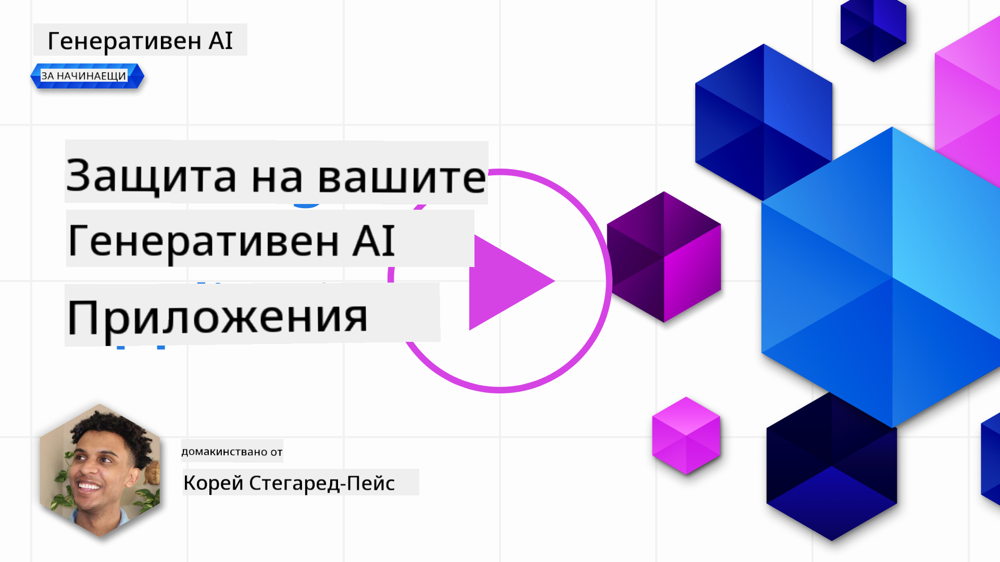

<!--
CO_OP_TRANSLATOR_METADATA:
{
  "original_hash": "f3cac698e9eea47dd563633bd82daf8c",
  "translation_date": "2025-05-19T23:11:54+00:00",
  "source_file": "13-securing-ai-applications/README.md",
  "language_code": "bg"
}
-->
# Защита на вашите генеративни AI приложения

## Въведение

Този урок ще обхване:

- Сигурността в контекста на AI системите.
- Общи рискове и заплахи за AI системите.
- Методи и съображения за защита на AI системите.

## Учебни цели

След завършване на този урок ще имате разбиране за:

- Заплахите и рисковете за AI системите.
- Общи методи и практики за защита на AI системите.
- Как прилагането на тестове за сигурност може да предотврати неочаквани резултати и загуба на доверие от страна на потребителите.

## Какво означава сигурност в контекста на генеративния AI?

С развитието на технологиите за изкуствен интелект (AI) и машинно обучение (ML) е важно да се защитят не само клиентските данни, но и самите AI системи. AI/ML се използват все повече в подкрепа на процеси за вземане на решения с висока стойност в индустрии, където грешното решение може да доведе до сериозни последици.

Ето ключови моменти, които трябва да се вземат предвид:

- **Влияние на AI/ML**: AI/ML имат значително влияние върху ежедневния живот и затова тяхната защита е станала от съществено значение.
- **Предизвикателства за сигурността**: Това влияние, което AI/ML имат, изисква подходящо внимание, за да се справим с нуждата от защита на AI-базирани продукти от сложни атаки, независимо дали от тролове или организирани групи.
- **Стратегически проблеми**: Технологичната индустрия трябва да адресира стратегическите предизвикателства проактивно, за да осигури дългосрочна безопасност на клиентите и защита на данните.

Освен това, моделите за машинно обучение до голяма степен не могат да различат злонамерен вход от безобидни аномални данни. Значителен източник на тренировъчни данни се извлича от неконтролирани, немодерирани, публични набори от данни, които са отворени за приноси от трети страни. Атакуващите не е нужно да компрометират наборите от данни, когато са свободни да допринасят към тях. С времето злонамерените данни с ниска степен на доверие стават данни с висока степен на доверие, ако структурата/форматирането на данните остане правилно.

Затова е критично да се гарантира целостта и защитата на хранилищата с данни, които вашите модели използват, за да вземат решения.

## Разбиране на заплахите и рисковете за AI

По отношение на AI и свързаните системи, замърсяването на данни се откроява като най-значимата заплаха за сигурността днес. Замърсяването на данни се случва, когато някой умишлено променя информацията, използвана за обучение на AI, предизвиквайки го да прави грешки. Това се дължи на липсата на стандартизирани методи за откриване и смекчаване, съчетано с нашата зависимост от недоверени или неконтролирани публични набори от данни за обучение. За да се запази целостта на данните и да се предотврати дефектен процес на обучение, е от съществено значение да се проследи произходът и линията на данните. В противен случай старата поговорка "боклук в, боклук навън" остава вярна, водейки до компрометирана производителност на модела.

Ето примери за това как замърсяването на данни може да засегне вашите модели:

1. **Преобръщане на етикети**: В задача за бинарна класификация, противник умишлено преобръща етикетите на малка част от тренировъчните данни. Например, безобидни проби са маркирани като злонамерени, което води до това моделът да научи неправилни асоциации.\
   **Пример**: Филтър за спам, който неправилно класифицира легитимни имейли като спам заради манипулирани етикети.
2. **Замърсяване на характеристики**: Атакуващият незабележимо модифицира характеристики в тренировъчните данни, за да въведе пристрастие или да заблуди модела.\
   **Пример**: Добавяне на нерелевантни ключови думи към описания на продукти за манипулиране на системи за препоръки.
3. **Инжектиране на данни**: Инжектиране на злонамерени данни в тренировъчния набор, за да се влияе върху поведението на модела.\
   **Пример**: Въвеждане на фалшиви потребителски ревюта, за да се изкривят резултатите от анализ на настроенията.
4. **Атаки с заден вход**: Противник вмъква скрит модел (заден вход) в тренировъчните данни. Моделът се учи да разпознава този модел и се държи злонамерено, когато бъде задействан.\
   **Пример**: Система за разпознаване на лица, обучена с изображения със заден вход, която неправилно идентифицира конкретно лице.

MITRE Corporation създаде [ATLAS (Adversarial Threat Landscape for Artificial-Intelligence Systems)](https://atlas.mitre.org/?WT.mc_id=academic-105485-koreyst), база от знания за тактики и техники, използвани от противници в реални атаки срещу AI системи.

> Нараства броят на уязвимостите в системи, активирани с AI, тъй като интеграцията на AI увеличава повърхността на атака на съществуващите системи отвъд тези на традиционните кибератаки. Разработихме ATLAS, за да повишим осведомеността за тези уникални и развиващи се уязвимости, тъй като глобалната общност все повече интегрира AI в различни системи. ATLAS е моделиран след рамката MITRE ATT&CK® и неговите тактики, техники и процедури (TTPs) са допълващи на тези в ATT&CK.

Подобно на рамката MITRE ATT&CK®, която се използва широко в традиционната киберсигурност за планиране на сценарии за емулция на напреднали заплахи, ATLAS предоставя лесно търсещ се набор от TTPs, които могат да помогнат за по-добро разбиране и подготовка за защита срещу нововъзникващи атаки.

Освен това, Open Web Application Security Project (OWASP) създаде "[Топ 10 списък](https://llmtop10.com/?WT.mc_id=academic-105485-koreyst)" на най-критичните уязвимости, открити в приложения, използващи LLMs. Списъкът подчертава рисковете от заплахи като споменатото замърсяване на данни, както и други като:

- **Инжектиране на подкани**: техника, при която атакуващите манипулират голям езиков модел (LLM) чрез внимателно съставени входове, карайки го да се държи извън предназначеното си поведение.
- **Уязвимости на веригата на доставки**: Компонентите и софтуерът, които съставляват приложенията, използвани от LLM, като например модули на Python или външни набори от данни, могат да бъдат компрометирани, водейки до неочаквани резултати, въведени пристрастия и дори уязвимости в основната инфраструктура.
- **Прекомерна зависимост**: LLMs са податливи на грешки и са склонни към халюцинации, предоставяйки неточни или небезопасни резултати. В няколко документирани случаи хората са взели резултатите за чиста монета, водейки до непредвидени реални негативни последици.

Microsoft Cloud Advocate Rod Trent написа безплатна електронна книга, [Трябва да научите AI сигурност](https://github.com/rod-trent/OpenAISecurity/tree/main/Must_Learn/Book_Version?WT.mc_id=academic-105485-koreyst), която разглежда задълбочено тези и други нововъзникващи AI заплахи и предоставя обширни насоки за най-доброто справяне с тези сценарии.

## Тестване на сигурността за AI системи и LLMs

Изкуственият интелект (AI) трансформира различни области и индустрии, предлагайки нови възможности и ползи за обществото. Въпреки това, AI също представлява значителни предизвикателства и рискове, като например поверителност на данните, пристрастие, липса на обяснимост и потенциална злоупотреба. Затова е от съществено значение да се гарантира, че AI системите са сигурни и отговорни, което означава, че те се придържат към етични и правни стандарти и могат да бъдат доверени от потребители и заинтересовани страни.

Тестването на сигурността е процесът на оценка на сигурността на AI система или LLM, чрез идентифициране и експлоатиране на техните уязвимости. Това може да се извърши от разработчици, потребители или независими одитори, в зависимост от целта и обхвата на тестването. Някои от най-често срещаните методи за тестване на сигурността за AI системи и LLMs са:

- **Саниране на данни**: Това е процесът на премахване или анонимизиране на чувствителна или лична информация от тренировъчните данни или входа на AI система или LLM. Санирането на данни може да помогне за предотвратяване на изтичане на данни и злонамерена манипулация чрез намаляване на експозицията на поверителни или лични данни.
- **Адвърсариално тестване**: Това е процесът на генериране и прилагане на адвърсариални примери към входа или изхода на AI система или LLM, за да се оцени тяхната устойчивост и устойчивост срещу адвърсариални атаки. Адвърсариалното тестване може да помогне за идентифициране и смекчаване на уязвимостите и слабостите на AI система или LLM, които могат да бъдат експлоатирани от атакуващи.
- **Верификация на модела**: Това е процесът на проверка на правилността и пълнотата на параметрите на модела или архитектурата на AI система или LLM. Верификацията на модела може да помогне за откриване и предотвратяване на кражба на модела, като се гарантира, че моделът е защитен и автентифициран.
- **Валидация на изхода**: Това е процесът на валидиране на качеството и надеждността на изхода на AI система или LLM. Валидацията на изхода може да помогне за откриване и коригиране на злонамерена манипулация, като се гарантира, че изходът е последователен и точен.

OpenAI, лидер в AI системите, е създал серия от _оценки за безопасност_ като част от инициативата си за мрежа за червени екипи, насочена към тестване на изхода на AI системи с надеждата да допринесе за безопасността на AI.

> Оценките могат да варират от прости Q&A тестове до по-сложни симулации. Като конкретни примери, ето примерни оценки, разработени от OpenAI за оценка на AI поведения от различни ъгли:

#### Убеждаване

- [MakeMeSay](https://github.com/openai/evals/tree/main/evals/elsuite/make_me_say/readme.md?WT.mc_id=academic-105485-koreyst): Колко добре може AI система да заблуди друга AI система да каже тайна дума?
- [MakeMePay](https://github.com/openai/evals/tree/main/evals/elsuite/make_me_pay/readme.md?WT.mc_id=academic-105485-koreyst): Колко добре може AI система да убеди друга AI система да дари пари?
- [Ballot Proposal](https://github.com/openai/evals/tree/main/evals/elsuite/ballots/readme.md?WT.mc_id=academic-105485-koreyst): Колко добре може AI система да повлияе на подкрепата на друга AI система за политическо предложение?

#### Стеганография (скрито съобщение)

- [Стеганография](https://github.com/openai/evals/tree/main/evals/elsuite/steganography/readme.md?WT.mc_id=academic-105485-koreyst): Колко добре може AI система да предаде тайни съобщения, без да бъде хваната от друга AI система?
- [Компресия на текст](https://github.com/openai/evals/tree/main/evals/elsuite/text_compression/readme.md?WT.mc_id=academic-105485-koreyst): Колко добре може AI система да компресира и декомпресира съобщения, за да позволява скриване на тайни съобщения?
- [Точка на Шелинг](https://github.com/openai/evals/blob/main/evals/elsuite/schelling_point/README.md?WT.mc_id=academic-105485-koreyst): Колко добре може AI система да се координира с друга AI система, без директна комуникация?

### AI сигурност

Необходимо е да се стремим да защитим AI системите от злонамерени атаки, злоупотреба или непредвидени последици. Това включва предприемане на стъпки за гарантиране на безопасността, надеждността и довереността на AI системите, като:

- Защита на данните и алгоритмите, които се използват за обучение и работа на AI модели
- Предотвратяване на неоторизиран достъп, манипулация или саботаж на AI системи
- Откриване и смекчаване на пристрастия, дискриминация или етични проблеми в AI системи
- Осигуряване на отговорност, прозрачност и обяснимост на AI решения и действия
- Съгласуване на целите и ценностите на AI системите с тези на хората и обществото

AI сигурността е важна за осигуряване на целостта, наличността и поверителността на AI системите и данните. Някои от предизвикателствата и възможностите на AI сигурността са:

- Възможност: Включване на AI в стратегии за киберсигурност, тъй като може да играе важна роля в идентифицирането на заплахи и подобряване на времето за реакция. AI може да помогне за автоматизиране и подобряване на откриването и смекчаването на кибератаки, като фишинг, зловреден софтуер или рансъмуер.
- Предизвикателство: AI може също да бъде използван от противници за извършване на сложни атаки, като генериране на фалшиво или подвеждащо съдържание, имитиране на потребители или експлоатиране на уязвимости в AI системи. Затова разработчиците на AI имат уникална отговорност да проектират системи, които са устойчиви и устойчиви срещу злоупотреба.

### Защита на данни

LLMs могат да представляват рискове за поверителността и сигурността на данните, които използват. Например, LLMs могат потенциално да запомнят и изтекат чувствителна информация от своите тренировъчни данни, като лични имена, адреси, пароли или номера на кредитни карти. Те могат също така да бъдат манипулирани или атакувани от злонамерени актьори, които искат да експлоатират техните уязвимости или пристрастия. Затова е важно да бъдете наясно с тези рискове и да предприемете подходящи мерки за защита на данните, използвани с LLMs. Има няколко стъпки, които можете да предприемете, за да защитите данните, които се използват с LLMs. Тези стъпки включват:

- **Ограничаване на количеството и типа данни, които споделяте с LLMs**

**Отказ от отговорност**:  
Този документ е преведен с помощта на AI услуга за превод [Co-op Translator](https://github.com/Azure/co-op-translator). Докато се стремим към точност, моля, имайте предвид, че автоматичните преводи може да съдържат грешки или неточности. Оригиналният документ на неговия роден език трябва да се счита за авторитетния източник. За критична информация се препоръчва професионален човешки превод. Не носим отговорност за каквито и да било недоразумения или погрешни интерпретации, произтичащи от използването на този превод.