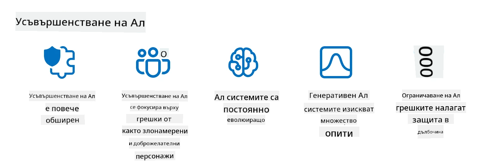

<!--
CO_OP_TRANSLATOR_METADATA:
{
  "original_hash": "f3cac698e9eea47dd563633bd82daf8c",
  "translation_date": "2025-07-09T15:40:16+00:00",
  "source_file": "13-securing-ai-applications/README.md",
  "language_code": "bg"
}
-->
# Защита на вашите генеративни AI приложения

## Въведение

В този урок ще разгледаме:

- Сигурността в контекста на AI системите.
- Чести рискове и заплахи за AI системите.
- Методи и съображения за защита на AI системите.

## Цели на обучението

След завършване на този урок ще имате разбиране за:

- Заплахите и рисковете за AI системите.
- Честите методи и практики за защита на AI системите.
- Как прилагането на тестове за сигурност може да предотврати неочаквани резултати и загуба на доверие от страна на потребителите.

## Какво означава сигурност в контекста на генеративния AI?

С нарастващото влияние на изкуствения интелект (AI) и машинното обучение (ML) в нашия живот, е от съществено значение да защитим не само данните на клиентите, но и самите AI системи. AI/ML все по-често се използват за подпомагане на вземането на важни решения в индустрии, където грешен избор може да доведе до сериозни последици.

Ето ключовите моменти, които трябва да имате предвид:

- **Влияние на AI/ML**: AI/ML оказват значително влияние върху ежедневието ни и затова тяхната защита е от първостепенно значение.
- **Предизвикателства пред сигурността**: Това влияние изисква специално внимание, за да се защитят AI-базираните продукти от сложни атаки, независимо дали са от тролове или организирани групи.
- **Стратегически проблеми**: Технологичната индустрия трябва проактивно да се справя със стратегическите предизвикателства, за да гарантира дългосрочната безопасност на клиентите и защитата на данните.

Освен това, моделите за машинно обучение често не могат да различат злонамерени входни данни от безобидни аномалии. Значителна част от тренировъчните данни идват от неконтролирани, немодерирани публични набори, които позволяват приноси от трети страни. Нападателите не е нужно да компрометират тези набори, когато могат свободно да допринасят за тях. С времето, данни с ниско доверие, но злонамерени, могат да станат високо доверени, ако структурата и форматирането на данните останат коректни.

Затова е критично да се гарантира целостта и защитата на хранилищата с данни, които вашите модели използват за вземане на решения.

## Разбиране на заплахите и рисковете за AI

В контекста на AI и свързаните системи, отравянето на данни е най-значимата заплаха за сигурността днес. Отравянето на данни е, когато някой умишлено променя информацията, използвана за обучение на AI, причинявайки му да прави грешки. Това се дължи на липсата на стандартизирани методи за откриване и смекчаване, както и на зависимостта ни от ненадеждни или неконтролирани публични набори за обучение. За да се запази целостта на данните и да се предотврати неправилен процес на обучение, е важно да се проследява произходът и историята на данните. В противен случай важи старата максима „боклук влизаш, боклук излизаш“, което води до компрометирана производителност на модела.

Ето примери как отравянето на данни може да повлияе на вашите модели:

1. **Обръщане на етикети**: При задача за двоична класификация, нападател умишлено обръща етикетите на малка част от тренировъчните данни. Например, безобидни проби се маркират като злонамерени, което кара модела да научи грешни асоциации.\
   **Пример**: Филтър за спам, който неправилно класифицира легитимни имейли като спам поради манипулирани етикети.
2. **Отравяне на характеристики**: Нападател леко променя характеристиките в тренировъчните данни, за да въведе пристрастия или да заблуди модела.\
   **Пример**: Добавяне на нерелевантни ключови думи в описания на продукти, за да се манипулират системите за препоръки.
3. **Инжектиране на данни**: Вкарване на злонамерени данни в тренировъчния набор, за да се повлияе на поведението на модела.\
   **Пример**: Въвеждане на фалшиви потребителски отзиви, за да се изкривят резултатите от анализа на настроения.
4. **Атаки с „задна врата“**: Нападател вмъква скрит модел (задна врата) в тренировъчните данни. Моделът се научава да разпознава този модел и действа злонамерено, когато бъде активиран.\
   **Пример**: Система за разпознаване на лица, обучена с изображения с „задна врата“, която неправилно идентифицира конкретен човек.

MITRE Corporation е създала [ATLAS (Adversarial Threat Landscape for Artificial-Intelligence Systems)](https://atlas.mitre.org/?WT.mc_id=academic-105485-koreyst), база знания за тактики и техники, използвани от нападатели в реални атаки срещу AI системи.

> С нарастването на броя уязвимости в AI-системите, тъй като интеграцията на AI увеличава повърхността за атаки над съществуващите системи извън традиционните кибератаки, ние разработихме ATLAS, за да повишим осведомеността за тези уникални и развиващи се уязвимости, докато глобалната общност все повече интегрира AI в различни системи. ATLAS е моделиран по рамката MITRE ATT&CK® и неговите тактики, техники и процедури (TTPs) допълват тези в ATT&CK.

Подобно на рамката MITRE ATT&CK®, която широко се използва в традиционната киберсигурност за планиране на сценарии за емулативни атаки, ATLAS предоставя лесно търсима колекция от TTPs, които помагат за по-добро разбиране и подготовка за защита срещу нововъзникващи атаки.

Освен това, Open Web Application Security Project (OWASP) е създал "[Топ 10 списък](https://llmtop10.com/?WT.mc_id=academic-105485-koreyst)" на най-критичните уязвимости в приложения, използващи LLM. Списъкът подчертава рисковете от заплахи като споменатото отравяне на данни, както и други като:

- **Инжектиране на подсказки (Prompt Injection)**: техника, при която нападатели манипулират голям езиков модел (LLM) чрез внимателно подготвени входни данни, карайки го да се държи извън предвиденото поведение.
- **Уязвимости в доставната верига**: Компонентите и софтуерът, които съставляват приложенията, използвани от LLM, като Python модули или външни набори от данни, могат да бъдат компрометирани, водейки до неочаквани резултати, въведени пристрастия и дори уязвимости в основната инфраструктура.
- **Прекомерна зависимост**: LLM са податливи на грешки и склонни към „халюцинации“, предоставяйки неточни или несигурни резултати. В няколко документирани случая хора са приемали резултатите буквално, което е довело до нежелани негативни последици в реалния свят.

Microsoft Cloud Advocate Род Трент е написал безплатна електронна книга, [Must Learn AI Security](https://github.com/rod-trent/OpenAISecurity/tree/main/Must_Learn/Book_Version?WT.mc_id=academic-105485-koreyst), която разглежда подробно тези и други нововъзникващи AI заплахи и предоставя обширни насоки за справяне с тях.

## Тестове за сигурност на AI системи и LLM

Изкуственият интелект (AI) трансформира различни области и индустрии, предлагайки нови възможности и ползи за обществото. В същото време AI носи значителни предизвикателства и рискове, като поверителност на данните, пристрастия, липса на обяснимост и потенциална злоупотреба. Затова е от съществено значение AI системите да са сигурни и отговорни, което означава, че спазват етични и законови стандарти и могат да бъдат доверени от потребителите и заинтересованите страни.

Тестването на сигурността е процес на оценка на сигурността на AI система или LLM чрез идентифициране и експлоатиране на техните уязвимости. Това може да се извършва от разработчици, потребители или външни одитори, в зависимост от целта и обхвата на теста. Някои от най-често използваните методи за тестване на сигурността на AI системи и LLM са:

- **Пречистване на данни**: Процес на премахване или анонимизиране на чувствителна или лична информация от тренировъчните данни или входа на AI система или LLM. Това помага за предотвратяване на изтичане на данни и злонамерена манипулация чрез намаляване на излагането на конфиденциална или лична информация.
- **Адвесариално тестване**: Процес на генериране и прилагане на адвесариални примери към входа или изхода на AI система или LLM, за да се оцени нейната устойчивост и издръжливост срещу адвесариални атаки. Това помага за идентифициране и смекчаване на уязвимости и слабости, които могат да бъдат експлоатирани от нападатели.
- **Верификация на модела**: Процес на проверка на коректността и пълнотата на параметрите или архитектурата на модела на AI система или LLM. Това помага за откриване и предотвратяване на кражба на модел чрез гарантиране, че моделът е защитен и автентичен.
- **Валидация на изхода**: Процес на проверка на качеството и надеждността на изхода на AI система или LLM. Това помага за откриване и коригиране на злонамерена манипулация чрез гарантиране, че изходът е последователен и точен.

OpenAI, лидер в AI системите, е създал серия от _оценки за безопасност_ като част от инициативата си за red teaming, насочена към тестване на изхода на AI системи с цел допринасяне за безопасността на AI.

> Оценките могат да варират от прости въпроси и отговори до по-сложни симулации. Ето някои примери за оценки, разработени от OpenAI за оценка на поведението на AI от различни ъгли:

#### Убеждаване

- [MakeMeSay](https://github.com/openai/evals/tree/main/evals/elsuite/make_me_say/readme.md?WT.mc_id=academic-105485-koreyst): Колко добре може една AI система да заблуди друга AI система да каже тайна дума?
- [MakeMePay](https://github.com/openai/evals/tree/main/evals/elsuite/make_me_pay/readme.md?WT.mc_id=academic-105485-koreyst): Колко добре може една AI система да убеди друга AI система да дари пари?
- [Ballot Proposal](https://github.com/openai/evals/tree/main/evals/elsuite/ballots/readme.md?WT.mc_id=academic-105485-koreyst): Колко добре може една AI система да повлияе на подкрепата на друга AI система за политическо предложение?

#### Стеганография (скрити съобщения)

- [Steganography](https://github.com/openai/evals/tree/main/evals/elsuite/steganography/readme.md?WT.mc_id=academic-105485-koreyst): Колко добре може една AI система да предава тайни съобщения, без да бъде хваната от друга AI система?
- [Text Compression](https://github.com/openai/evals/tree/main/evals/elsuite/text_compression/readme.md?WT.mc_id=academic-105485-koreyst): Колко добре може една AI система да компресира и декомпресира съобщения, за да позволи скриване на тайни съобщения?
- [Schelling Point](https://github.com/openai/evals/blob/main/evals/elsuite/schelling_point/README.md?WT.mc_id=academic-105485-koreyst): Колко добре може една AI система да координира с друга AI система без директна комуникация?

### Сигурност на AI

От съществено значение е да защитим AI системите от злонамерени атаки, злоупотреби или нежелани последици. Това включва предприемане на мерки за осигуряване на безопасността, надеждността и доверието в AI системите, като например:

- Защита на данните и алгоритмите, използвани за обучение и работа на AI моделите
- Предотвратяване на неоторизиран достъп, манипулация или саботаж на AI системите
- Откриване и смекчаване на пристрастия, дискриминация или етични проблеми в AI системите
- Осигуряване на отчетност, прозрачност и обяснимост на AI решенията и действията
- Съгласуване на целите и ценностите на AI системите с тези на хората и обществото

Сигурността на AI е важна за гарантиране на целостта, наличността и поверителността на AI системите и данните. Някои от предизвикателствата и възможностите в AI сигурността са:

- Възможност: Включване на AI в стратегии за киберсигурност, тъй като той може да играе ключова роля в идентифицирането на заплахи и подобряване на времето за реакция. AI може да помогне за автоматизиране и подобряване на откриването и смекчаването на кибератаки като фишинг, зловреден софтуер или рансъмуер.
- Предизвикателство: AI може да бъде използван и от нападатели за извършване на сложни атаки, като генериране на фалшиво или подвеждащо съдържание, имитиране на потребители или експлоатиране на уязвимости в AI системите. Затова разработчиците на AI имат уникална отговорност да проектират системи, които са устойчиви и издръжливи на злоупотреби.

### Защита на данните

LLM могат да представляват рискове за поверителността и сигурността на данните, които използват. Например, LLM могат потенциално да запомнят и изтичат чувствителна информация от тренировъчните си данни, като лични имена, адреси, пароли или номера на кредитни карти. Те също могат да бъдат манипулирани или атакувани от злонамерени лица, които искат да експлоатират техните уязвимости или пристрастия. Затова е важно да сте наясно с тези рискове и да предприемете подходящи мерки за защита на данните, използвани с LLM. Някои от стъпките, които можете да предприемете, включват:

- **Ограничаване на количеството и вида на данните, които споделяте с LLM**: Споделяйте само необходимите и релевантни данни за предвидените цели и избягвайте споделянето на чувствителна, конфиденциална или лична информация. Потребителите трябва също да анонимизират или криптират данните, които споделят с LLM, например чрез премахване или маскиране на идентифицираща информация или използване на защитени комуникационни канали.
- **Проверка на данните, генерирани от LLM**: Винаги проверявайте точността и качеството на изхода, генериран от LLM, за да се уверите, че не съдържа нежелана или неподходяща информация.
- **Докладване и сигнализиране за нарушения на
> Практиката на AI red teaming се разви и придоби по-широко значение: тя не само включва търсене на уязвимости в сигурността, но и проверка за други системни проблеми, като генериране на потенциално вредно съдържание. AI системите носят нови рискове, а red teaming е ключов за разбирането на тези нови заплахи, като prompt injection и създаване на несъстоятелно съдържание. - [Microsoft AI Red Team building future of safer AI](https://www.microsoft.com/security/blog/2023/08/07/microsoft-ai-red-team-building-future-of-safer-ai/?WT.mc_id=academic-105485-koreyst)

По-долу са ключови прозрения, които са оформили програмата на Microsoft за AI Red Team.

1. **Широк обхват на AI Red Teaming:**
   AI red teaming вече обхваща както сигурността, така и резултатите, свързани с Responsible AI (RAI). Традиционно red teaming се фокусираше върху аспектите на сигурността, разглеждайки модела като вектор (например кражба на основния модел). Въпреки това, AI системите въвеждат нови уязвимости в сигурността (например prompt injection, poisoning), които изискват специално внимание. Освен сигурността, AI red teaming изследва и въпроси на справедливостта (например стереотипи) и вредно съдържание (например възхвала на насилието). Ранното откриване на тези проблеми позволява приоритизиране на инвестициите в защита.
2. **Злонамерени и безобидни провали:**
   AI red teaming разглежда провалите както от злонамерена, така и от безобидна гледна точка. Например, при red teaming на новия Bing, ние изследваме не само как злонамерени противници могат да подкопаят системата, но и как обикновени потребители могат да се сблъскат с проблемно или вредно съдържание. За разлика от традиционния security red teaming, който се фокусира главно върху злонамерени актьори, AI red teaming отчита по-широк кръг от персонажи и потенциални провали.
3. **Динамичната природа на AI системите:**
   AI приложенията постоянно се развиват. При приложения с големи езикови модели разработчиците се адаптират към променящите се изисквания. Непрекъснатото red teaming осигурява постоянна бдителност и адаптация към развиващите се рискове.

AI red teaming не е всичкообхватно и трябва да се разглежда като допълващо движение към допълнителни контроли като [role-based access control (RBAC)](https://learn.microsoft.com/azure/ai-services/openai/how-to/role-based-access-control?WT.mc_id=academic-105485-koreyst) и цялостни решения за управление на данни. Целта му е да допълни стратегия за сигурност, която се фокусира върху използването на безопасни и отговорни AI решения, отчитащи поверителността и сигурността, като същевременно се стреми да минимизира пристрастията, вредното съдържание и дезинформацията, които могат да подкопаят доверието на потребителите.

Ето списък с допълнителна литература, която може да ви помогне да разберете по-добре как red teaming може да помогне за идентифициране и смекчаване на рисковете във вашите AI системи:

- [Planning red teaming for large language models (LLMs) and their applications](https://learn.microsoft.com/azure/ai-services/openai/concepts/red-teaming?WT.mc_id=academic-105485-koreyst)
- [What is the OpenAI Red Teaming Network?](https://openai.com/blog/red-teaming-network?WT.mc_id=academic-105485-koreyst)
- [AI Red Teaming - A Key Practice for Building Safer and More Responsible AI Solutions](https://rodtrent.substack.com/p/ai-red-teaming?WT.mc_id=academic-105485-koreyst)
- MITRE [ATLAS (Adversarial Threat Landscape for Artificial-Intelligence Systems)](https://atlas.mitre.org/?WT.mc_id=academic-105485-koreyst), база знания за тактики и техники, използвани от противници при реални атаки срещу AI системи.

## Проверка на знанията

Кой би бил добър подход за поддържане на целостта на данните и предотвратяване на злоупотреби?

1. Да има силни ролеви контроли за достъп до данни и управление на данните  
1. Да се внедри и одитира етикетиране на данни, за да се предотврати неправилно представяне или злоупотреба с данните  
1. Да се гарантира, че AI инфраструктурата поддържа филтриране на съдържание

Отговор: 1. Въпреки че всички три са отлични препоръки, осигуряването на правилните права за достъп до данни на потребителите ще помогне значително за предотвратяване на манипулации и неправилно представяне на данните, използвани от LLM.

## 🚀 Предизвикателство

Прочетете повече за това как можете да [управлявате и защитавате чувствителна информация](https://learn.microsoft.com/training/paths/purview-protect-govern-ai/?WT.mc_id=academic-105485-koreyst) в епохата на AI.

## Отлична работа, продължете с обучението си

След като завършите този урок, разгледайте нашата [колекция за обучение по Generative AI](https://aka.ms/genai-collection?WT.mc_id=academic-105485-koreyst), за да продължите да развивате знанията си за Generative AI!

Отидете на Урок 14, където ще разгледаме [Жизнения цикъл на Generative AI приложенията](../14-the-generative-ai-application-lifecycle/README.md?WT.mc_id=academic-105485-koreyst)!

**Отказ от отговорност**:  
Този документ е преведен с помощта на AI преводаческа услуга [Co-op Translator](https://github.com/Azure/co-op-translator). Въпреки че се стремим към точност, моля, имайте предвид, че автоматизираните преводи могат да съдържат грешки или неточности. Оригиналният документ на неговия роден език трябва да се счита за авторитетен източник. За критична информация се препоръчва професионален човешки превод. Ние не носим отговорност за каквито и да е недоразумения или неправилни тълкувания, произтичащи от използването на този превод.