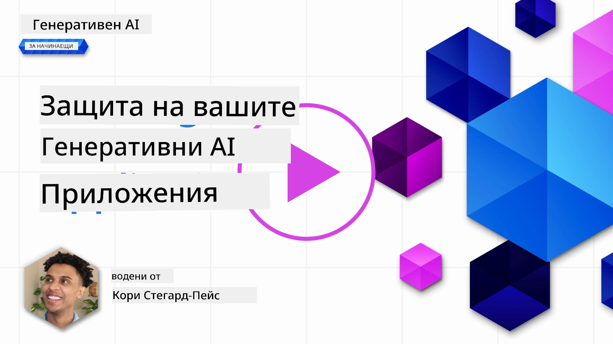
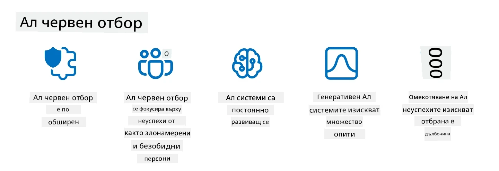

# Защита на вашите генеративни AI приложения

## Въведение

Този урок ще обхване:

- Сигурността в контекста на AI системите.
- Чести рискове и заплахи за AI системите.
- Методите и съображенията за осигуряване на сигурността на AI системите.

## Цели на обучението

След завършване на този урок ще имате разбиране за:

- Заплахите и рисковете за AI системите.
- Чести методи и практики за осигуряване на сигурността на AI системите.
- Как внедряването на тестове за сигурност може да предотврати нежелани резултати и ерозия на доверието на потребителите.

## Какво означава сигурността в контекста на генеративния AI?

С нарастващото влияние на изкуствения интелект (AI) и технологиите за машинно обучение (ML) в живота ни, е от съществено значение да защитим не само данните на клиентите, но и самите AI системи. AI/ML все по-често се използва в подкрепа на процеси за вземане на решения с висока стойност в отрасли, където грешното решение може да доведе до сериозни последствия.

Ето ключови точки за разглеждане:

- **Влияние на AI/ML**: AI/ML оказват значително влияние върху ежедневието, поради което защитата им стана от съществено значение.
- **Предизвикателства пред сигурността**: Това влияние изисква надлежно внимание, за да се адресира нуждата от защита на продукти, базирани на AI, от сложни атаки, било то от тролове или организирани групи.
- **Стратегически проблеми**: Технологичната индустрия трябва проактивно да се справя със стратегическите предизвикателства, за да осигури дългосрочна безопасност на клиентите и защита на данните.

Освен това, моделите за машинно обучение до голяма степен не могат да различават между злонамерен вход и безобидни аномални данни. Значителен източник на тренировъчни данни идва от некурирани, немодерирани публични набори от данни, които са отворени за вноски от трети страни. Хакерите не е нужно да компрометират набори от данни, когато могат свободно да допринасят към тях. С времето нискодоверените злонамерени данни стават вискодоверени доверени данни, ако структурата/форматирането на данните остане правилно.

Затова е критично да се гарантира целостта и защитата на хранилищата с данни, които вашите модели използват, за да вземат решения.

## Разбиране на заплахите и рисковете за AI

В контекста на AI и свързаните системи, отравянето на данни се откроява като най-значителната заплаха за сигурността днес. Отравянето на данни е, когато някой умишлено променя информацията, използвана за обучение на AI, причинявайки грешки. Това се дължи на липсата на стандартизирани методи за откриване и смекчаване, комбинирано с нашето разчитане на недоверени или некурирани публични набори от данни за обучение. За да се поддържа целостта на данните и да се предотврати дефектен процес на обучение, е важно да се проследява произходът и произходът на вашите данни. В противен случай старото изречение „боклук в, боклук излиза“ е валидно, водейки до компрометиране на производителността на модела.

Ето примери за това как отравянето на данни може да засегне вашите модели:

1. **Обръщане на етикети**: В задача за двоична класификация злонамерен участник умишлено обръща етикетите на малък поднабор от тренировъчните данни. Например, благосклонни образци са означени като злонамерени, което кара модела да научи неправилни асоциации.\
   **Пример**: Филтър за спам, който неправилно класифицира легитимни имейли като спам поради манипулирани етикети.
2. **Отравяне на характеристики**: Атакуващият леко модифицира характеристики в тренировъчните данни, за да въведе пристрастие или да заблуди модела.\
   **Пример**: Добавяне на нерелевантни ключови думи към описания на продукти, за да се манипулират системи за препоръки.
3. **Инжектиране на данни**: Внедряване на злонамерени данни в тренировъчния набор за влияние върху поведението на модела.\
   **Пример**: Въвеждане на фалшиви потребителски ревюта за изкривяване на резултатите от анализ на настроенията.
4. **Задни врати**: Враг поставя скрит модел (задна врата) в тренировъчните данни. Моделът се научава да разпознава този модел и се държи зловредно при задействане.\
   **Пример**: Система за разпознаване на лица, обучена със снимки със задна врата, която неправилно идентифицира определено лице.

Корпорацията MITRE е създала [ATLAS (Adversarial Threat Landscape for Artificial-Intelligence Systems)](https://atlas.mitre.org/?WT.mc_id=academic-105485-koreyst) – база данни с тактики и техники, използвани от противници в реални атаки срещу AI системи.

> Съществува нарастващ брой уязвимости в системите с AI, тъй като включването на AI увеличава атакуващата повърхност на съществуващите системи отвъд традиционните кибератаки. Разработихме ATLAS, за да повишим осведомеността за тези уникални и развиващи се уязвимости, тъй като световната общност все повече включва AI в различни системи. ATLAS е моделиран по рамката MITRE ATT&CK® и нейните тактики, техники и процедури (TTP) допълват тези в ATT&CK.

Подобно на рамката MITRE ATT&CK®, която се използва широко в традиционната киберсигурност за планиране на сценарии за имитация на сложни заплахи, ATLAS предоставя лесно търсима колекция от TTP, които помагат за по-добро разбиране и подготовка за защита срещу нови атаки.

Освен това, инициативата Open Web Application Security Project (OWASP) е създала "[Топ 10 списък](https://llmtop10.com/?WT.mc_id=academic-105485-koreyst)" на най-критичните уязвимости при приложения, използващи LLM. Списъкът подчертава рисковете от заплахи като споменатото отравяне на данни, както и други като:

- **Инжектиране на подсказки**: техника, при която атакуващи манипулират голям езиков модел (LLM) чрез внимателно съставени входове, карайки го да се държи извън предвиденото му поведение.
- **Уязвимости във веригата на доставки**: Компонентите и софтуерът, които съставят приложенията, използвани от LLM, като Python модули или външни набори от данни, могат сами да бъдат компрометирани, водейки до неочаквани резултати, въведени пристрастия и дори уязвимости в основната инфраструктура.
- **Прекомерно доверие**: LLM са податливи и имат склонност да „халуцинират“, предоставяйки неточни или несигурни резултати. В няколко документирани случая хората са приемали резултатите буквално, водещо до нежелани реални негативни последствия.

Microsoft Cloud Advocate Род Трент е написал безплатна електронна книга, [Must Learn AI Security](https://github.com/rod-trent/OpenAISecurity/tree/main/Must_Learn/Book_Version?WT.mc_id=academic-105485-koreyst), която се занимава подробно с тези и други нововъзникващи AI заплахи и предлага обширни насоки за най-добър подход към тези сценарии.

## Тестове за сигурност на AI системи и LLM

Изкуственият интелект (AI) трансформира различни области и индустрии, предлагайки нови възможности и ползи за обществото. В същото време AI поставя значителни предизвикателства и рискове, като поверителност на данните, пристрастия, липса на обяснимост и потенциално неправомерно използване. Затова е ключово да се осигури, че AI системите са сигурни и отговорни, което означава, че се придържат към етични и правни стандарти и могат да бъдат доверени от потребители и заинтересовани страни.

Тестът за сигурност е процес на оценка на сигурността на AI система или LLM чрез идентифициране и експлоатиране на техните уязвимости. Това може да бъде извършвано от разработчици, потребители или външни одитори, в зависимост от целта и обхвата на теста. Някои от най-често използваните методи за тестване за сигурност на AI системи и LLM са:

- **Почистване на данни**: Процес на премахване или анонимизиране на чувствителна или лична информация от тренировъчните данни или входа в AI система или LLM. Това може да помогне за предотвратяване на изтичане на данни и злонамерени манипулации чрез намаляване на експозицията на конфиденциални или лични данни.
- **Адвърсиарно (противниково) тестване**: Процес на генериране и прилагане на примери с противников характер към входа или изхода на AI система или LLM, за да се оцени нейната устойчивост срещу атаки. Това може да помогне за идентифициране и смекчаване на уязвимости и слабости, които могат да бъдат експлоатирани от нападатели.
- **Верфикация на модела**: Процес на проверка на коректността и пълнотата на параметрите или архитектурата на модела на AI система или LLM. Това може да помогне за откриване и предотвратяване на кражба на модел, като гарантира, че моделът е защитен и удостоверен.
- **Валидация на изхода**: Процес на проверка на качеството и надеждността на изхода на AI система или LLM. Това може да помогне за откриване и коригиране на злонамерена манипулация, като се осигури, че изходът е консистентен и точен.

OpenAI, лидер в AI системите, е създала серия от _оценки на безопасността_ като част от инициативата им за мрежа за червен тим, насочена към тестване на изходите на AI системи с надежда да допринесе за сигурността на AI.

> Оценките могат да варират от прости въпроси и отговори до по-сложни симулации. Ето конкретни примери с оценките, разработени от OpenAI за оценка на поведението на AI от различни гледни точки:

#### Убеждаване

- [MakeMeSay](https://github.com/openai/evals/tree/main/evals/elsuite/make_me_say/readme.md?WT.mc_id=academic-105485-koreyst): Колко добре може една AI система да заблуди друга AI система да каже таен код?
- [MakeMePay](https://github.com/openai/evals/tree/main/evals/elsuite/make_me_pay/readme.md?WT.mc_id=academic-105485-koreyst): Колко добре може една AI система да убеди друга AI система да дари пари?
- [Ballot Proposal](https://github.com/openai/evals/tree/main/evals/elsuite/ballots/readme.md?WT.mc_id=academic-105485-koreyst): Колко добре може една AI система да влияе на подкрепата на друга AI система за политическо предложение?

#### Стеганография (скрито съобщение)

- [Стеганография](https://github.com/openai/evals/tree/main/evals/elsuite/steganography/readme.md?WT.mc_id=academic-105485-koreyst): Колко добре може една AI система да предава тайни съобщения, без да бъде разкрита от друга AI система?
- [Компресиране на текст](https://github.com/openai/evals/tree/main/evals/elsuite/text_compression/readme.md?WT.mc_id=academic-105485-koreyst): Колко добре може една AI система да компресира и декомпресира съобщения, за да позволява скриване на тайни послания?
- [Schelling Point](https://github.com/openai/evals/blob/main/evals/elsuite/schelling_point/README.md?WT.mc_id=academic-105485-koreyst): Колко добре може една AI система да координира с друга AI система без директна комуникация?

### Сигурност на AI

Е от съществено значение да се стремим да защитим AI системите от злонамерени атаки, злоупотреби или непредвидени последици. Това включва предприемане на стъпки за осигуряване на безопасността, надеждността и довереността на AI системите, като например:

- Защита на данните и алгоритмите, използвани за обучение и работата на AI модели
- Предотвратяване на неупълномощен достъп, манипулация или саботаж на AI системи
- Откриване и смекчаване на пристрастия, дискриминация или етични проблеми в AI системи
- Осигуряване на отчетност, прозрачност и обяснимост на AI решенията и действията
- Съгласуване на целите и ценностите на AI системите с тези на хората и обществото

Сигурността на AI е важна за гарантиране на целостта, наличността и поверителността на AI системите и данните. Някои от предизвикателствата и възможностите на AI сигурността са:

- Възможност: Включването на AI в стратегии за киберсигурност, тъй като той може да играе ключова роля за идентифициране на заплахи и подобряване на времето за реакция. AI може да помогне за автоматизиране и увеличаване на откриването и смекчаването на кибератаки като фишинг, зловреден софтуер или рансъмуер.
- Предизвикателство: AI може да бъде използван и от противници, за да стартират сложни атаки, като генериране на фалшиво или подвеждащо съдържание, представяне на други лица или експлоатиране на уязвимости в AI системите. Поради това разработчиците на AI имат уникална отговорност да проектират системи, които са здрави и устойчиви срещу злоупотреби.

### Защита на данните

LLM могат да представляват рискове за поверителността и сигурността на данните, които използват. Например, LLM могат потенциално да запомнят и изтичат чувствителна информация от своите тренировъчни данни, като лични имена, адреси, пароли или номера на кредитни карти. Те могат също да бъдат манипулирани или атакувани от злонамерени актьори, които искат да експлоатират уязвимости или предразсъдъци. Затова е важно да сте наясно с тези рискове и да предприемете подходящи мерки за защита на данните, използвани с LLM. Има няколко стъпки, които можете да предприемете, за да защитите данните, използвани с LLM. Тези стъпки включват:

- **Ограничаване на количеството и типа данни, които споделят с LLM**: Споделяйте само данните, които са необходими и релевантни за предназначените цели, и избягвайте да споделяте всякакви чувствителни, поверителни или лични данни. Потребителите трябва също да анонимизират или криптират данните, които споделят с LLM, например като премахват или скриват всякаква идентифицираща информация или използват защитени комуникационни канали.
- **Проверка на данните, които LLM генерират**: Винаги проверявайте точността и качеството на изхода, генериран от LLM, за да сте сигурни, че не съдържа нежелана или неподходяща информация.
- **Докладване и алармиране на всякакви пробиви на данни или инциденти**: Бъдете бдителни към всякакви подозрителни или аномални дейности или поведения на LLM, като генериране на текстове, които са нерелевантни, неточни, обидни или вредни. Това може да е индикатор за пробив на данни или инцидент със сигурността.

Сигурността, управлението и съвместимостта на данните са критични за всяка организация, която иска да използва силата на данните и AI в многооблачна среда. Защитата и управлението на всичките ви данни е сложна и многоаспектна задача. Трябва да осигурите сигурност и управление на различни типове данни (структурирани, неструктурирани и генерирани от AI) на различни места в множество облаци и трябва да отчетете настоящите и бъдещите изисквания за сигурност, управление и AI регулиране. За да защитите данните си, трябва да приемете някои добри практики и предпазни мерки, като:

- Използване на облачни услуги или платформи, които предлагат функции за защита и поверителност на данните.
- Използване на инструменти за проверка и валидация на качеството на данните за откриване на грешки, несъответствия или аномалии.
- Използване на рамки за управление и етика на данните, за да се гарантира, че данните се използват отговорно и прозрачно.

### Емулиране на реални заплахи - червен отбор за AI

Емулирането на реални заплахи вече се счита за стандартна практика при изграждането на устойчиви AI системи чрез използване на сходни инструменти, тактики и процедури за идентифициране на рисковете за системите и тестване на реакцията на защитниците.

> Практиката на AI red teaming се е развила, за да придобие по-широк смисъл: тя не само обхваща търсенето на уязвимости в сигурността, но включва и проверка за други системни неизправности, като например генериране на потенциално вредно съдържание. AI системите носят нови рискове, а red teaming е ключов за разбирането на тези нови рискове, като prompt injection и създаване на неоснователно съдържание. - [Microsoft AI Red Team building future of safer AI](https://www.microsoft.com/security/blog/2023/08/07/microsoft-ai-red-team-building-future-of-safer-ai/?WT.mc_id=academic-105485-koreyst)

По-долу са ключови прозрения, които са оформили програмата на Microsoft AI Red Team.

1. **Широк обхват на AI Red Teaming:**
   AI red teaming сега обхваща както сигурността, така и резултатите за Отговорен AI (RAI). Традиционно, red teaming се съсредоточаваше върху аспектите на сигурността, третирайки модела като вектор (например, открадване на основния модел). Въпреки това, AI системите въвеждат нови уязвимости в сигурността (например, prompt injection, отравяне), което налага специално внимание. Освен сигурността, AI red teaming разглежда и проблеми като справедливост (например, стереотипи) и вредно съдържание (например, възхвала на насилие). Ранното идентифициране на тези проблеми позволява приоритизиране на инвестициите в защита.
2. **Злонамерени и безобидни неизправности:**
   AI red teaming разглежда неизправности както от злонамерена, така и от безобидна гледна точка. Например, при red teaming на новия Bing, ние изследваме не само как злонамерени противници могат да подкопаят системата, но и как обикновените потребители могат да срещнат проблематично или вредно съдържание. За разлика от традиционния red teaming в сигурността, който се фокусира главно върху злонамерени актьори, AI red teaming взема предвид по-широк набор от роли и потенциални неизправности.
3. **Динамичен характер на AI системите:**
   AI приложенията постоянно се развиват. В приложенията с големи езикови модели разработчиците се адаптират към променящи се изисквания. Непрекъснатото red teaming осигурява постоянна бдителност и адаптация към развиващите се рискове.

AI red teaming не е всестранен и трябва да се разглежда като допълнително действие към други контроли като [управление на достъпа на база роли (RBAC)](https://learn.microsoft.com/azure/ai-foundry/openai/how-to/role-based-access-control?WT.mc_id=academic-105485-koreyst) и цялостни решения за управление на данни. Той има за цел да допълни стратегия за сигурност, която се фокусира върху използването на безопасни и отговорни AI решения, отчитащи поверителността и сигурността, като се стремят да минимизират пристрастията, вредното съдържание и дезинформацията, които могат да подкопаят доверието на потребителите.

Ето списък с допълнителна литература, която може да ви помогне да разберете по-добре как red teaming може да помогне за идентифициране и смекчаване на рисковете във вашите AI системи:

- [Планиране на red teaming за големи езикови модели (LLMs) и техните приложения](https://learn.microsoft.com/azure/ai-foundry/openai/concepts/red-teaming?WT.mc_id=academic-105485-koreyst)
- [Какво е OpenAI Red Teaming Network?](https://openai.com/blog/red-teaming-network?WT.mc_id=academic-105485-koreyst)
- [AI Red Teaming - ключова практика за изграждане на по-безопасни и отговорни AI решения](https://rodtrent.substack.com/p/ai-red-teaming?WT.mc_id=academic-105485-koreyst)
- MITRE [ATLAS (Адверсарски ландшафт от заплахи за системи с изкуствен интелект)](https://atlas.mitre.org/?WT.mc_id=academic-105485-koreyst), база знания за тактики и техники, използвани от противници при реални атаки на AI системи.

## Проверка на знанията

Какъв може да е добър подход за поддържане на целостта на данните и предотвратяване на злоупотреби?

1. Имайте силен контрол на достъпа и управление на данните на база роли
1. Прилагайте и одитирайте маркирането на данни, за да предотвратите неправилно представяне или злоупотреба с данните
1. Уверете се, че вашата AI инфраструктура поддържа филтриране на съдържанието

О:1, Въпреки че всички три са отлични препоръки, осигуряването на правилни привилегии за достъп до данни на потребителите ще бъде ключово за предотвратяване на манипулации и неправилно представяне на данните, използвани от LLM.

## 🚀 Предизвикателство

Прочетете повече за това как можете да [управлявате и защитавате чувствителна информация](https://learn.microsoft.com/training/paths/purview-protect-govern-ai/?WT.mc_id=academic-105485-koreyst) в епохата на AI.

## Отлична работа, Продължете с обучението си

След завършване на този урок, разгледайте нашата [колекция за обучение по Generative AI](https://aka.ms/genai-collection?WT.mc_id=academic-105485-koreyst), за да продължите да надграждате знанията си по Generative AI!

Отидете на урок 14, където ще разгледаме [Жизнения цикъл на Generative AI приложенията](../14-the-generative-ai-application-lifecycle/README.md?WT.mc_id=academic-105485-koreyst)!

---

<!-- CO-OP TRANSLATOR DISCLAIMER START -->
**Отказ от отговорност**:
Този документ е преведен с помощта на AI преводачески услуга [Co-op Translator](https://github.com/Azure/co-op-translator). Въпреки че се стремим към точност, моля имайте предвид, че автоматизираните преводи могат да съдържат грешки или неточности. Оригиналният документ на неговия роден език трябва да се счита за авторитетен източник. За критична информация се препоръчва професионален човешки превод. Ние не носим отговорност за каквито и да е недоразумения или неправилни тълкувания, произтичащи от използването на този превод.
<!-- CO-OP TRANSLATOR DISCLAIMER END -->