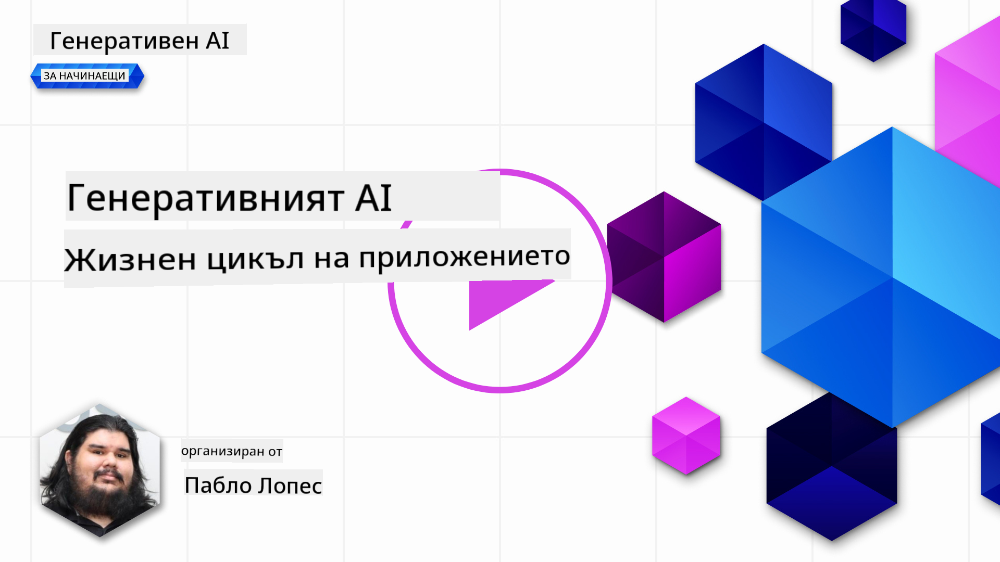
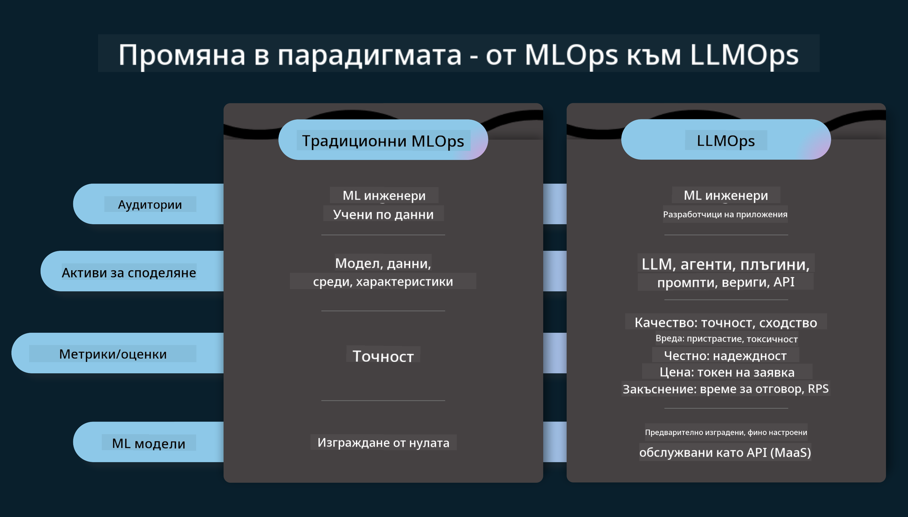
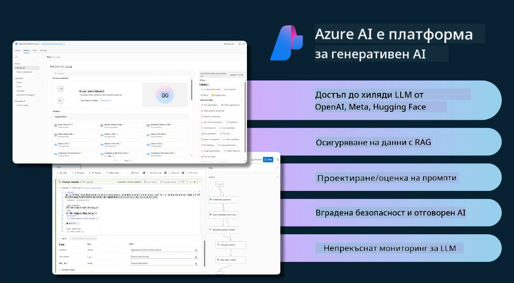
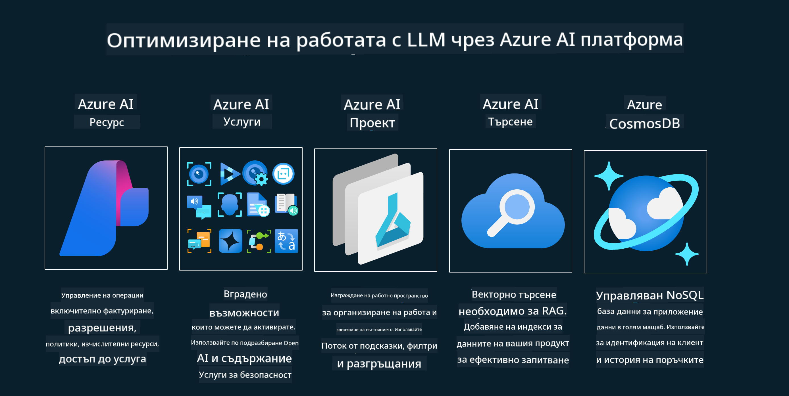
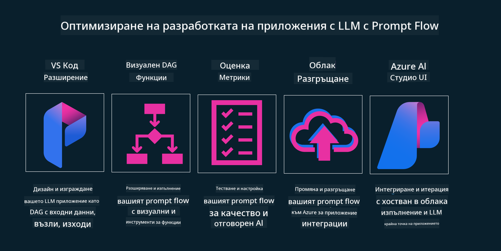

<!--
CO_OP_TRANSLATOR_METADATA:
{
  "original_hash": "27a5347a5022d5ef0a72ab029b03526a",
  "translation_date": "2025-05-20T00:56:38+00:00",
  "source_file": "14-the-generative-ai-application-lifecycle/README.md",
  "language_code": "bg"
}
-->

# Жизненият цикъл на приложенията за генеративен изкуствен интелект

Важен въпрос за всички AI приложения е значимостта на AI функциите, тъй като AI е бързо развиваща се област. За да гарантирате, че вашето приложение остава актуално, надеждно и стабилно, трябва да го наблюдавате, оценявате и подобрявате непрекъснато. Тук идва жизненият цикъл на генеративния изкуствен интелект.

Жизненият цикъл на генеративния изкуствен интелект е рамка, която ви води през етапите на разработване, внедряване и поддържане на генеративно AI приложение. Тя ви помага да определите вашите цели, да измерите вашето представяне, да идентифицирате вашите предизвикателства и да приложите вашите решения. Също така ви помага да приведете вашето приложение в съответствие с етичните и правните стандарти на вашата област и вашите заинтересовани страни. Следвайки жизнения цикъл на генеративния изкуствен интелект, можете да гарантирате, че вашето приложение винаги предоставя стойност и удовлетворява вашите потребители.

## Въведение

В тази глава ще:

- Разберете промяната на парадигмата от MLOps към LLMOps
- Жизненият цикъл на LLM
- Инструменти за жизнен цикъл
- Метрики и оценка на жизнения цикъл

## Разберете промяната на парадигмата от MLOps към LLMOps

LLM са нов инструмент в арсенала на изкуствения интелект, те са невероятно мощни в задачи за анализ и генериране за приложения, но тази мощност има някои последствия върху това как оптимизираме AI и класическите задачи на машинното обучение.

С това ни е необходима нова парадигма, за да адаптираме този инструмент динамично, с правилните стимули. Можем да категоризираме по-старите AI приложения като "ML Apps" и по-новите AI приложения като "GenAI Apps" или просто "AI Apps", отразявайки основните технологии и техники, използвани по това време. Това променя нашия разказ по много начини, вижте следното сравнение.

Забележете, че в LLMOps сме по-фокусирани върху разработчиците на приложения, използвайки интеграции като ключова точка, използвайки "Модели като услуга" и мислейки за следните точки за метрики.

- Качество: Качество на отговора
- Вреда: Отговорен AI
- Честност: Обоснованост на отговора (Има ли смисъл? Правилно ли е?)
- Цена: Бюджет за решение
- Закъснение: Средно време за отговор на токен

## Жизненият цикъл на LLM

Първо, за да разберем жизнения цикъл и промените, нека отбележим следващата инфографика.

Както може да забележите, това е различно от обичайните жизнени цикли на MLOps. LLM имат много нови изисквания, като подканяне, различни техники за подобряване на качеството (Фина настройка, RAG, Метаподканвания), различна оценка и отговорност с отговорен AI, и накрая, нови метрики за оценка (Качество, Вреда, Честност, Цена и Закъснение).

Например, вижте как идеяме. Използвайки инженеринг на подканвания, за да експериментираме с различни LLM, за да изследваме възможности и да тестваме дали тяхната хипотеза може да е правилна.

Обърнете внимание, че това не е линейно, а интегрирани цикли, итеративни и с общ цикъл.

Как бихме могли да изследваме тези стъпки? Нека разгледаме в детайли как можем да изградим жизнен цикъл.

Това може да изглежда малко сложно, нека се фокусираме върху трите големи стъпки първо.

1. Идеиране/Изследване: Изследване, тук можем да изследваме според нуждите на нашия бизнес. Прототипиране, създаване на [PromptFlow](https://microsoft.github.io/promptflow/index.html?WT.mc_id=academic-105485-koreyst) и тестване дали е достатъчно ефективно за нашата хипотеза.
2. Изграждане/Подобряване: Имплементация, сега започваме да оценяваме за по-големи набори от данни, имплементираме техники, като фина настройка и RAG, за да проверим устойчивостта на нашето решение. Ако не е, преимплементирането му, добавянето на нови стъпки в нашия поток или преструктурирането на данните, може да помогне. След тестване на нашия поток и нашия мащаб, ако работи и проверим нашите метрики, е готово за следващата стъпка.
3. Операционализиране: Интеграция, сега добавяме системи за мониторинг и предупреждения към нашата система, внедряване и интеграция на приложения към нашето приложение.

След това имаме общия цикъл на управление, фокусиращ се върху сигурност, съответствие и управление.

Поздравления, сега вашето AI приложение е готово за работа и оперативно. За практически опит, погледнете [Демо на чат на Contoso.](https://nitya.github.io/contoso-chat/?WT.mc_id=academic-105485-koreys)

Сега, какви инструменти можем да използваме?

## Инструменти за жизнен цикъл

За инструменти, Microsoft предоставя [Azure AI Platform](https://azure.microsoft.com/solutions/ai/?WT.mc_id=academic-105485-koreys) и [PromptFlow](https://microsoft.github.io/promptflow/index.html?WT.mc_id=academic-105485-koreyst), за да улесни и направи вашия цикъл лесен за изпълнение и готов за работа.

[Azure AI Platform](https://azure.microsoft.com/solutions/ai/?WT.mc_id=academic-105485-koreys) ви позволява да използвате [AI Studio](https://ai.azure.com/?WT.mc_id=academic-105485-koreys). AI Studio е уеб портал, който ви позволява да изследвате модели, примери и инструменти. Управление на вашите ресурси, потоци за разработка на UI и SDK/CLI опции за разработка на код на първо място.

Azure AI ви позволява да използвате множество ресурси, за да управлявате вашите операции, услуги, проекти, векторно търсене и нужди от бази данни.

Изградете от Proof-of-Concept (POC) до мащабни приложения с PromptFlow:

- Проектирайте и изграждайте приложения от VS Code, с визуални и функционални инструменти
- Тествайте и финна настройка на вашите приложения за качествен AI, с лекота.
- Използвайте Azure AI Studio за интеграция и итерация с облака, Push и Deploy за бърза интеграция.

## Страхотно! Продължете да учите!

Невероятно, сега научете повече за това как структурираме приложение, за да използваме концепциите с [Contoso Chat App](https://nitya.github.io/contoso-chat/?WT.mc_id=academic-105485-koreyst), за да видите как Cloud Advocacy добавя тези концепции в демонстрации. За повече съдържание, разгледайте нашата [сесия на Ignite!
](https://www.youtube.com/watch?v=DdOylyrTOWg)

Сега, проверете Урок 15, за да разберете как [Retrieval Augmented Generation и векторни бази данни](../15-rag-and-vector-databases/README.md?WT.mc_id=academic-105485-koreyst) влияят на генеративния AI и за да направите по-ангажиращи приложения!

**Отказ от отговорност**:  
Този документ е преведен с помощта на AI услуга за превод [Co-op Translator](https://github.com/Azure/co-op-translator). Въпреки че се стремим към точност, моля, имайте предвид, че автоматизираните преводи може да съдържат грешки или неточности. Оригиналният документ на родния му език трябва да се счита за авторитетния източник. За критична информация се препоръчва професионален човешки превод. Не носим отговорност за недоразумения или погрешни тълкувания, произтичащи от използването на този превод.