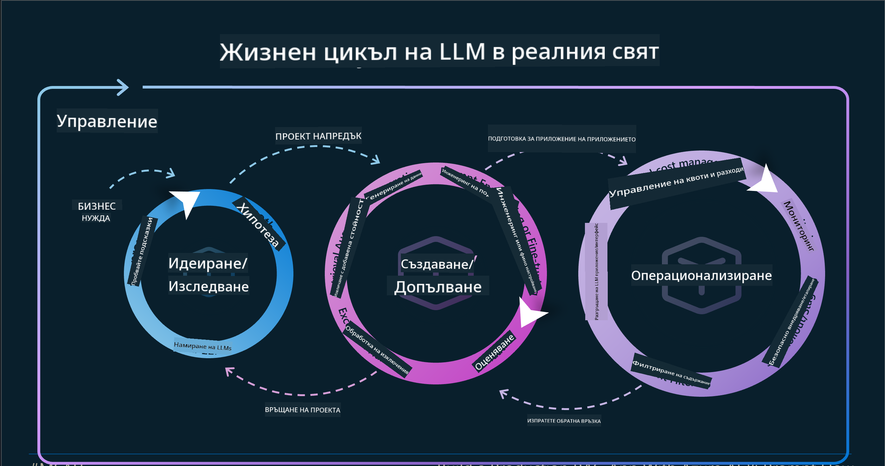

<!--
CO_OP_TRANSLATOR_METADATA:
{
  "original_hash": "df44972d5575ea8cef3c52ee31696d04",
  "translation_date": "2025-12-19T17:07:19+00:00",
  "source_file": "14-the-generative-ai-application-lifecycle/README.md",
  "language_code": "bg"
}
-->

# Жизненият цикъл на приложението за генеративен ИИ

Един важен въпрос за всички ИИ приложения е релевантността на ИИ функциите, тъй като ИИ е бързо развиваща се област, за да се гарантира, че вашето приложение остава релевантно, надеждно и стабилно, трябва да го наблюдавате, оценявате и подобрявате непрекъснато. Тук влиза в игра жизненият цикъл на генеративния ИИ.

Жизненият цикъл на генеративния ИИ е рамка, която ви води през етапите на разработване, внедряване и поддържане на генеративно ИИ приложение. Тя ви помага да дефинирате целите си, да измервате представянето си, да идентифицирате предизвикателствата си и да прилагате решенията си. Също така ви помага да съобразите приложението си с етичните и правни стандарти на вашата област и заинтересованите страни. Следвайки жизнения цикъл на генеративния ИИ, можете да гарантирате, че вашето приложение винаги доставя стойност и удовлетворява потребителите ви.

## Въведение

В тази глава ще:

- Разберете парадигмата на прехода от MLOps към LLMOps
- Жизненият цикъл на LLM
- Инструменти за жизнения цикъл
- Метрики и оценка на жизнения цикъл

## Разберете парадигмата на прехода от MLOps към LLMOps

LLM са нов инструмент в арсенала на изкуствения интелект, те са изключително мощни в задачите за анализ и генериране за приложения, но тази мощ има някои последици за това как оптимизираме задачите на ИИ и класическото машинно обучение.

С това имаме нужда от нова парадигма, за да адаптираме този инструмент динамично, с правилните стимули. Можем да категоризираме по-старите ИИ приложения като "ML приложения" и по-новите ИИ приложения като "GenAI приложения" или просто "ИИ приложения", отразявайки основната технология и техники, използвани по това време. Това променя нашия разказ по няколко начина, вижте следното сравнение.

Обърнете внимание, че в LLMOps сме по-фокусирани върху разработчиците на приложения, използвайки интеграции като ключова точка, използвайки "Модели като услуга" и мислейки за следните метрики.

- Качество: Качество на отговора
- Вреда: Отговорен ИИ
- Честност: Обоснованост на отговора (Има ли смисъл? Правилен ли е?)
- Разходи: Бюджет на решението
- Закъснение: Средно време за отговор на токен

## Жизненият цикъл на LLM

Първо, за да разберем жизнения цикъл и модификациите, нека отбележим следната инфографика.

Както може да забележите, това е различно от обичайните жизнени цикли в MLOps. LLM имат много нови изисквания, като подсказване, различни техники за подобряване на качеството (Фино настройване, RAG, Мета-подсказки), различна оценка и отговорност с отговорен ИИ, накрая нови метрики за оценка (Качество, Вреда, Честност, Разходи и Закъснение).

Например, погледнете как генерираме идеи. Използваме инженеринг на подсказки, за да експериментираме с различни LLM, за да изследваме възможности и да тестваме дали тяхната хипотеза може да е вярна.

Обърнете внимание, че това не е линеен процес, а интегрирани цикли, итеративни и с общ цикъл.

Как можем да изследваме тези стъпки? Нека разгледаме подробно как можем да изградим жизнен цикъл.

Това може да изглежда малко сложно, нека се фокусираме първо върху трите големи стъпки.

1. Генериране на идеи/Изследване: Изследване, тук можем да изследваме според бизнес нуждите си. Прототипиране, създаване на [PromptFlow](https://microsoft.github.io/promptflow/index.html?WT.mc_id=academic-105485-koreyst) и тестване дали е достатъчно ефективно за нашата хипотеза.
1. Изграждане/Усъвършенстване: Имплементация, сега започваме да оценяваме за по-големи набори от данни, прилагаме техники като фино настройване и RAG, за да проверим устойчивостта на нашето решение. Ако не работи, повторното му имплементиране, добавянето на нови стъпки в нашия поток или преструктуриране на данните може да помогне. След тестване на нашия поток и мащаб, ако работи и проверим метриките, е готово за следващата стъпка.
1. Операционализиране: Интеграция, сега добавяме системи за наблюдение и аларми към нашата система, внедряване и интеграция на приложението в нашето приложение.

След това имаме общия цикъл на управление, фокусирайки се върху сигурност, съответствие и управление.

Поздравления, сега имате готово и работещо ИИ приложение. За практическо изживяване, разгледайте [демото Contoso Chat.](https://nitya.github.io/contoso-chat/?WT.mc_id=academic-105485-koreys)

Сега, какви инструменти можем да използваме?

## Инструменти за жизнения цикъл

За инструменти Microsoft предоставя [Azure AI Platform](https://azure.microsoft.com/solutions/ai/?WT.mc_id=academic-105485-koreys) и [PromptFlow](https://microsoft.github.io/promptflow/index.html?WT.mc_id=academic-105485-koreyst), които улесняват и правят вашия цикъл лесен за изпълнение и готов за използване.

[Azure AI Platform](https://azure.microsoft.com/solutions/ai/?WT.mc_id=academic-105485-koreys) ви позволява да използвате [AI Studio](https://ai.azure.com/?WT.mc_id=academic-105485-koreys). AI Studio е уеб портал, който ви позволява да изследвате модели, примери и инструменти. Управлявате ресурсите си, разработвате UI потоци и имате SDK/CLI опции за разработка с приоритет върху кода.

Azure AI ви позволява да използвате множество ресурси за управление на операциите, услугите, проектите, нуждите от векторно търсене и бази данни.

Конструирайте, от Proof-of-Concept (POC) до приложения в голям мащаб с PromptFlow:

- Проектирайте и изграждайте приложения от VS Code с визуални и функционални инструменти
- Тествайте и фино настройвайте приложенията си за качествен ИИ с лекота.
- Използвайте Azure AI Studio за интеграция и итерация с облака, натискане и внедряване за бърза интеграция.

## Страхотно! Продължете обучението си!

Удивително, сега научете повече за това как структурираме приложение, за да използваме концепциите с [Contoso Chat App](https://nitya.github.io/contoso-chat/?WT.mc_id=academic-105485-koreyst), за да видите как Cloud Advocacy добавя тези концепции в демонстрации. За повече съдържание, разгледайте нашата [Ignite сесия!](https://www.youtube.com/watch?v=DdOylyrTOWg)

Сега, разгледайте урок 15, за да разберете как [Retrieval Augmented Generation и векторни бази данни](../15-rag-and-vector-databases/README.md?WT.mc_id=academic-105485-koreyst) влияят на генеративния ИИ и да създавате по-ангажиращи приложения!

---

<!-- CO-OP TRANSLATOR DISCLAIMER START -->
**Отказ от отговорност**:  
Този документ е преведен с помощта на AI преводаческа услуга [Co-op Translator](https://github.com/Azure/co-op-translator). Въпреки че се стремим към точност, моля, имайте предвид, че автоматизираните преводи могат да съдържат грешки или неточности. Оригиналният документ на неговия роден език трябва да се счита за авторитетен източник. За критична информация се препоръчва професионален човешки превод. Ние не носим отговорност за каквито и да е недоразумения или неправилни тълкувания, произтичащи от използването на този превод.
<!-- CO-OP TRANSLATOR DISCLAIMER END -->