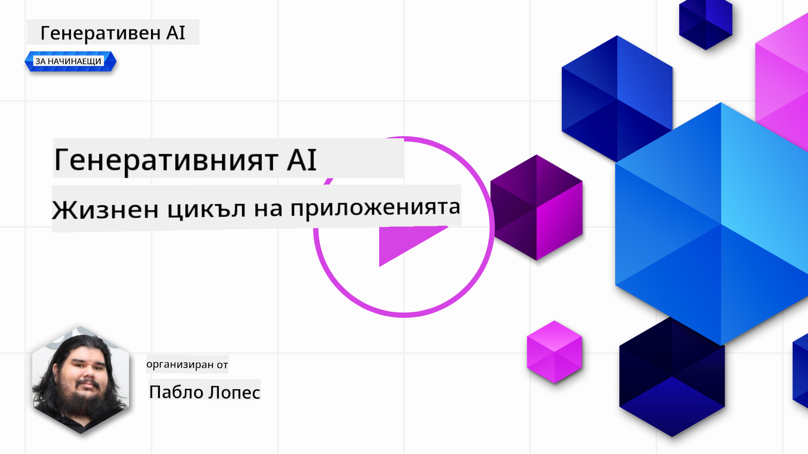
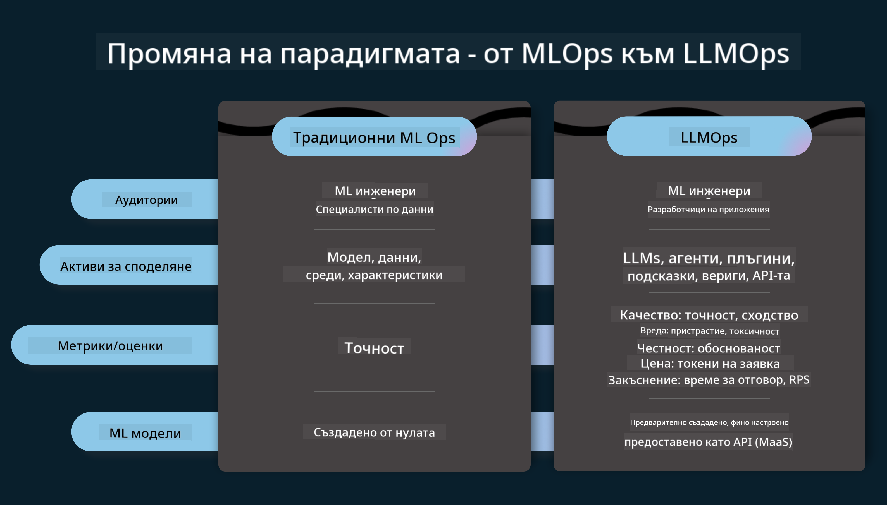
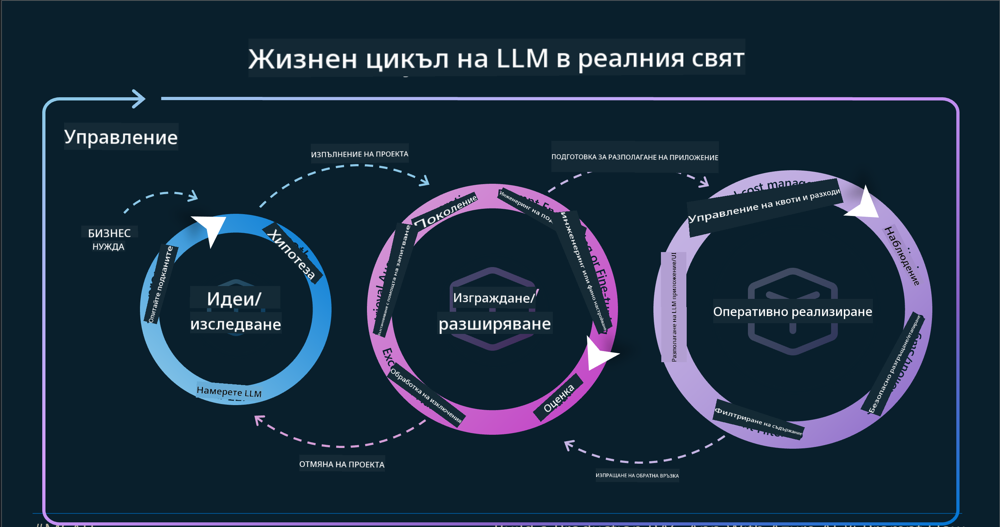
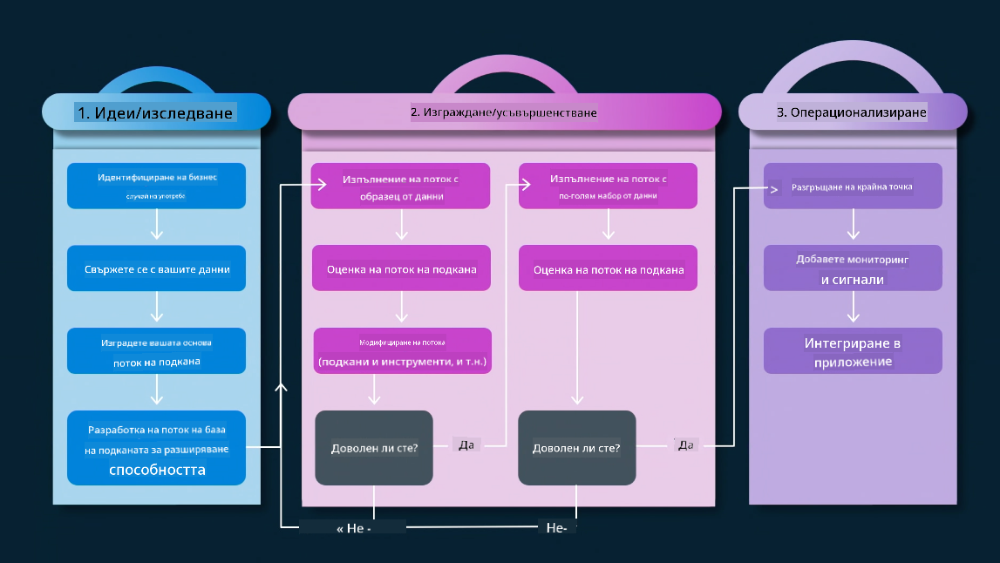
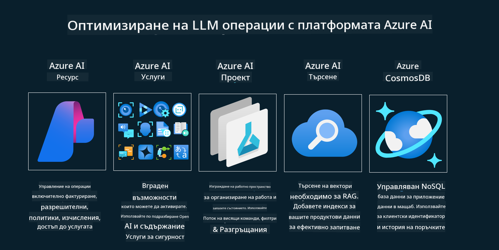
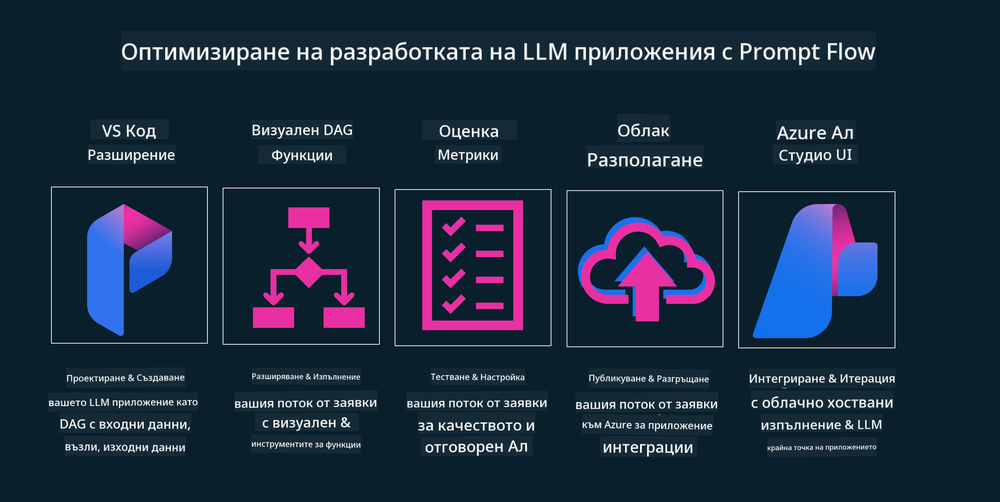

<!--
CO_OP_TRANSLATOR_METADATA:
{
  "original_hash": "27a5347a5022d5ef0a72ab029b03526a",
  "translation_date": "2025-06-25T22:11:03+00:00",
  "source_file": "14-the-generative-ai-application-lifecycle/README.md",
  "language_code": "bg"
}
-->

# Жизнен цикъл на генеративните AI приложения

Важен въпрос за всички AI приложения е релевантността на AI функциите, тъй като AI е бързо развиваща се област. За да гарантирате, че вашето приложение остава релевантно, надеждно и стабилно, трябва да го наблюдавате, оценявате и подобрявате непрекъснато. Тук влиза в действие жизненият цикъл на генеративния AI.

Жизненият цикъл на генеративния AI е рамка, която ви води през етапите на разработване, внедряване и поддържане на генеративно AI приложение. Тя ви помага да определите вашите цели, да измерите вашето представяне, да идентифицирате вашите предизвикателства и да внедрите вашите решения. Тя също така ви помага да приведете приложението си в съответствие с етичните и правните стандарти на вашата област и вашите заинтересовани страни. Следвайки жизнения цикъл на генеративния AI, можете да гарантирате, че вашето приложение винаги предоставя стойност и удовлетворява потребителите.

## Въведение

В тази глава ще:

- Разберете промяната на парадигмата от MLOps към LLMOps
- Жизненият цикъл на LLM
- Инструменти за жизнения цикъл
- Метрикация и оценка на жизнения цикъл

## Разберете промяната на парадигмата от MLOps към LLMOps

LLM-ите са нов инструмент в арсенала на изкуствения интелект, те са изключително мощни в задачи за анализ и генериране за приложения, но тази мощност има някои последици за това как оптимизираме AI и класическите задачи за машинно обучение.

С това ни е необходима нова парадигма, за да адаптираме този инструмент в динамика, с правилните стимули. Можем да категоризираме по-старите AI приложения като "ML Apps" и по-новите AI приложения като "GenAI Apps" или просто "AI Apps", отразявайки основната технология и техники, използвани по това време. Това променя нашия разказ по различни начини, погледнете следното сравнение.

Забележете, че в LLMOps сме по-фокусирани върху разработчиците на приложения, използвайки интеграции като ключова точка, използвайки "Models-as-a-Service" и мислейки в следните точки за метрики.

- Качество: Качество на отговора
- Вреда: Отговорен AI
- Честност: Обоснованост на отговора (Има ли смисъл? Коректен ли е?)
- Цена: Бюджет на решението
- Забавяне: Средно време за отговор на токен

## Жизненият цикъл на LLM

Първо, за да разберем жизнения цикъл и модификациите, нека отбележим следващата инфографика.

Както може да забележите, това е различно от обичайните жизнени цикли от MLOps. LLM-ите имат много нови изисквания, като Prompting, различни техники за подобряване на качеството (Fine-Tuning, RAG, Meta-Prompts), различна оценка и отговорност с отговорен AI, и накрая, нови метрики за оценка (Качество, Вреда, Честност, Цена и Забавяне).

Например, погледнете как идеите. Използвайки инженеринг на подканите за експериментиране с различни LLM-и, за да изследвате възможностите да проверите дали техните хипотези могат да бъдат правилни.

Забележете, че това не е линейно, а интегрирани цикли, итеративни и с обхващащ цикъл.

Как бихме могли да изследваме тези стъпки? Нека навлезем в детайли как бихме могли да изградим жизнен цикъл.

Това може да изглежда малко сложно, нека се фокусираме върху трите големи стъпки първо.

1. Идеи/Изследване: Изследване, тук можем да изследваме според нашите бизнес нужди. Прототипиране, създаване на [PromptFlow](https://microsoft.github.io/promptflow/index.html?WT.mc_id=academic-105485-koreyst) и тестване дали е достатъчно ефективно за нашата хипотеза.
2. Изграждане/Увеличаване: Имплементация, сега започваме да оценяваме за по-големи набори от данни, прилагаме техники като Fine-tuning и RAG, за да проверим устойчивостта на нашето решение. Ако не е, преимплементирането му, добавянето на нови стъпки в нашия поток или преструктурирането на данните може да помогне. След тестване на нашия поток и нашия мащаб, ако работи и проверим нашите метрики, е готово за следващата стъпка.
3. Операционализиране: Интеграция, сега добавяне на системи за мониторинг и предупреждения към нашата система, внедряване и интеграция на приложението към нашето приложение.

След това имаме обхващащия цикъл на управление, фокусирайки се върху сигурността, съответствието и управлението.

Поздравления, сега вашето AI приложение е готово за работа и оперативно. За практически опит, погледнете [Демо на Contoso Chat.](https://nitya.github.io/contoso-chat/?WT.mc_id=academic-105485-koreys)

Сега, какви инструменти можем да използваме?

## Инструменти за жизнения цикъл

За инструментите, Microsoft предоставя [Azure AI Platform](https://azure.microsoft.com/solutions/ai/?WT.mc_id=academic-105485-koreys) и [PromptFlow](https://microsoft.github.io/promptflow/index.html?WT.mc_id=academic-105485-koreyst), които улесняват и правят вашия цикъл лесен за имплементация и готов за работа.

[Azure AI Platform](https://azure.microsoft.com/solutions/ai/?WT.mc_id=academic-105485-koreys), ви позволява да използвате [AI Studio](https://ai.azure.com/?WT.mc_id=academic-105485-koreys). AI Studio е уеб портал, който ви позволява да изследвате модели, примери и инструменти. Управление на вашите ресурси, потоци за разработка на потребителски интерфейс и опции за SDK/CLI за разработка с код.

Azure AI, ви позволява да използвате множество ресурси, за да управлявате вашите операции, услуги, проекти, търсене на вектори и нужди от бази данни.

Конструирайте, от доказателство за концепция (POC) до приложения в голям мащаб с PromptFlow:

- Проектирайте и изграждайте приложения от VS Code, с визуални и функционални инструменти
- Тествайте и финализирайте вашите приложения за качествен AI, с лекота.
- Използвайте Azure AI Studio за интеграция и итерация с облака, пускайте и внедрявайте за бърза интеграция.

## Чудесно! Продължете с обучението си!

Удивително, сега научете повече за това как структурираме приложение, за да използваме концепциите с [Contoso Chat App](https://nitya.github.io/contoso-chat/?WT.mc_id=academic-105485-koreyst), за да проверите как Cloud Advocacy добавя тези концепции в демонстрации. За повече съдържание, разгледайте нашата [сесия на Ignite!
](https://www.youtube.com/watch?v=DdOylyrTOWg)

Сега, проверете Урок 15, за да разберете как [Възстановително генериране и векторни бази данни](../15-rag-and-vector-databases/README.md?WT.mc_id=academic-105485-koreyst) влияят на генеративния AI и как да направите приложенията по-ангажиращи!

**Отказ от отговорност**:  
Този документ е преведен с помощта на AI услуга за превод [Co-op Translator](https://github.com/Azure/co-op-translator). Въпреки че се стремим към точност, моля, имайте предвид, че автоматизираните преводи могат да съдържат грешки или неточности. Оригиналният документ на неговия роден език трябва да се счита за авторитетен източник. За критична информация се препоръчва професионален човешки превод. Не носим отговорност за недоразумения или неправилни тълкувания, произтичащи от използването на този превод.