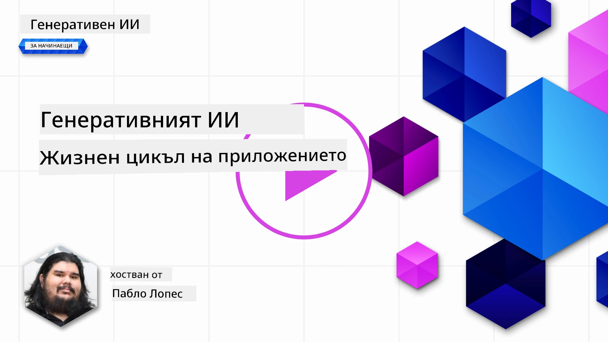
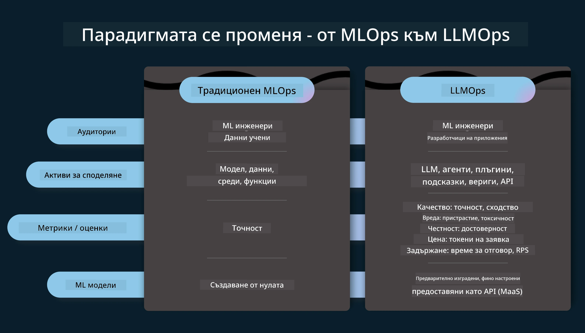
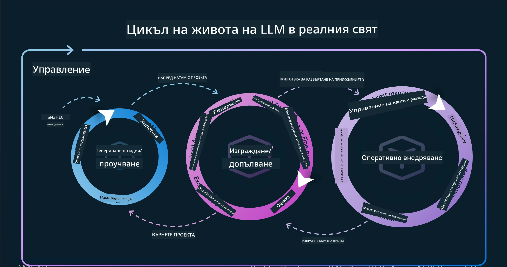
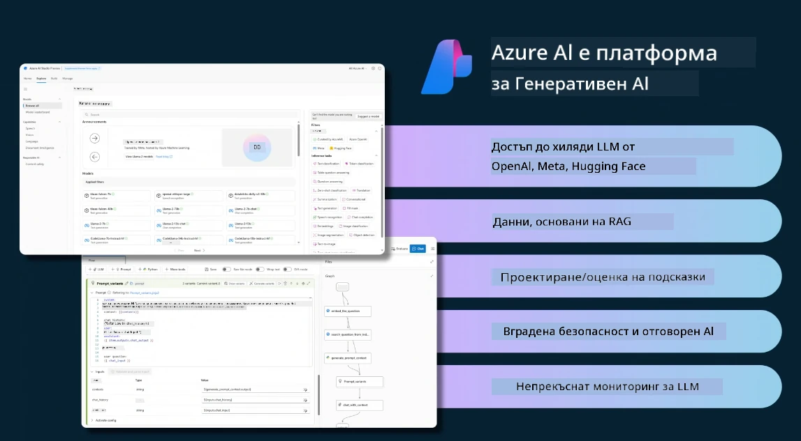
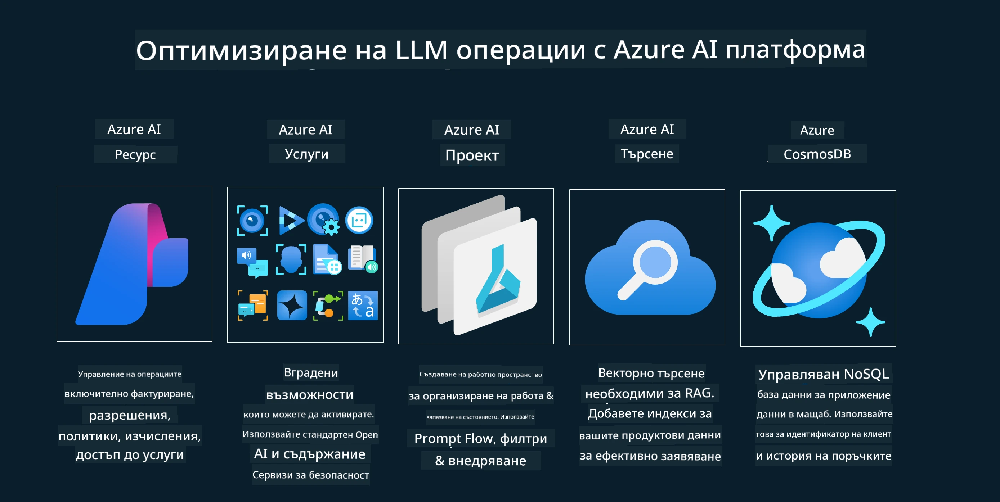
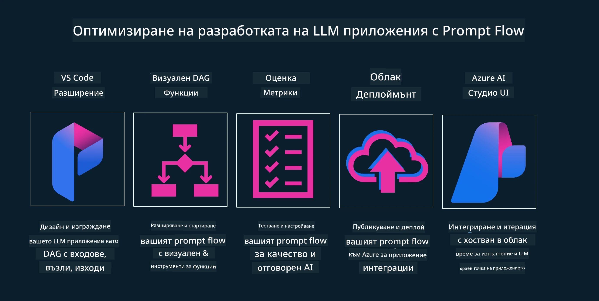

# Жизненият цикъл на генеративните AI приложения

Един важен въпрос за всички AI приложения е релевантността на AI функциите, тъй като AI е бързо развиваща се област, за да сте сигурни, че приложението ви остава релевантно, надеждно и устойчиво, трябва да го наблюдавате, оценявате и подобрявате непрекъснато. Именно тук влиза в действие жизненият цикъл на генеративния AI.

Жизненият цикъл на генеративния AI е рамка, която ви насочва през етапите на разработка, внедряване и поддръжка на генеративно AI приложение. Той ви помага да определите вашите цели, да измервате вашето представяне, да идентифицирате вашите предизвикателства и да прилагате вашите решения. Също така ви помага да съобразите приложението си с етичните и правните стандарти на вашата област и заинтересованите страни. Като следвате жизнения цикъл на генеративния AI, можете да гарантирате, че вашето приложение винаги доставя стойност и задоволява вашите потребители.

## Въведение

В тази глава ще:

- Разберете парадигмата на преминаване от MLOps към LLMOps
- Жизнен цикъл на LLM
- Инструменти за жизнения цикъл
- Метрификация и оценка на жизнения цикъл

## Разберете парадигмата на преминаване от MLOps към LLMOps

LLM-ите са нов инструмент в арсенала на изкуствения интелект, те са изключително мощни в задачите за анализ и генериране за приложения, но тази мощ има някои последици за начина, по който оптимизираме AI и класическите машинно-обучителни задачи.

За това ни е нужна нова парадигма, за да адаптираме този инструмент по динамичен начин и с правилните стимули. Можем да категоризираме по-старите AI приложения като "ML приложения", а по-новите AI приложения като "GenAI приложения" или просто "AI приложения", отразявайки водещата технология и техники, използвани в дадения момент. Това променя нашия разказ по няколко начина, вижте следното сравнение.

Обърнете внимание, че при LLMOps се фокусираме повече върху разработчиците на приложения, използвайки интеграции като ключова точка, използвайки "Модели като услуга" и мислейки върху следните точки за метрики.

- Качество: Качество на отговора
- Вреда: Отговорен AI
- Честност: Свързаност на отговора (Има ли смисъл? Коректен ли е?)
- Разходи: Бюджет на решението
- Задържане: Средно време за отговор на токен

## Жизнен цикъл на LLM

Първо, за да разберем жизнения цикъл и модификациите, нека отбележим следната инфографика.

Както може да забележите, това е различно от обичайните жизнени цикли в MLOps. LLM имат много нови изисквания, като Prompting, различни техники за подобряване на качеството (Финна настройка, RAG, Meta-Prompts), различна оценка и отговорност с отговорен AI, и накрая нови оценъчни метрики (Качество, Вреда, Честност, Разходи и Задържане).

Например, вижте как генерираме идеи. Използвайки инженерство на промпти за експериментиране с различни LLM, за да изследваме възможности и да тестваме дали хипотезата им може да бъде вярна.

Обърнете внимание, че това не е линеен процес, а интегрирани цикли, итеративни и с общ цикъл.

Как можем да изследваме тези стъпки? Нека разгледаме подробно как бихме могли да изградим жизнен цикъл.

Това може да изглежда малко сложно, нека се съсредоточим първо върху трите големи стъпки.

1. Генериране на идеи/Изследване: Тук можем да изследваме според нашите бизнес нужди. Прототипиране, създаване на [PromptFlow](https://microsoft.github.io/promptflow/index.html?WT.mc_id=academic-105485-koreyst) и тестване дали е достатъчно ефективно за нашата хипотеза.
1. Създаване/Допълване: Изпълнение, сега започваме да оценяваме за по-големи набори от данни, прилагаме техники като Финна настройка и RAG, за да проверим здравината на нашето решение. Ако не успее, повторното му изпълнение, добавяне на нови стъпки в нашия поток или преструктуриране на данните може да помогне. След тестване на потока и мащаба, ако работи и метриките са добри, е готов за следващата стъпка.
1. Операционализиране: Интеграция, сега добавяме системи за мониторинг и аларми, внедряване и интеграция на приложението с нашето приложение.

След това имаме общия цикъл за управление, съсредоточен върху сигурността, съответствието и управлението.

Поздравления, сега вашето AI приложение е готово и опериращо. За практическо преживяване, разгледайте [Demота на Contoso Chat](https://nitya.github.io/contoso-chat/?WT.mc_id=academic-105485-koreyst).

Сега, какви инструменти можем да използваме?

## Инструменти за жизнения цикъл

За инструменти Microsoft предоставя [Azure AI платформата](https://azure.microsoft.com/solutions/ai/?WT.mc_id=academic-105485-koreyst), а [PromptFlow](https://microsoft.github.io/promptflow/index.html?WT.mc_id=academic-105485-koreyst) улесняват и правят вашия цикъл лесен за прилагане и готов за използване.

[Azure AI платформата](https://azure.microsoft.com/solutions/ai/?WT.mc_id=academic-105485-koreyst) ви позволява да използвате [AI Studio](https://ai.azure.com/?WT.mc_id=academic-105485-koreyst). AI Studio е уеб портал, който ви позволява да изследвате модели, примери и инструменти. Управлявате вашите ресурси, UI потоци за разработка и опции за SDK/CLI за Code-First разработка.

Azure AI ви позволява да използвате множество ресурси, за да управлявате вашите операции, услуги, проекти, търсене в вектори и бази данни.

Конструирайте, от Proof-of-Concept(POC) до големи мащабни приложения с PromptFlow:

- Проектирайте и създавайте приложения от VS Code, с визуални и функционални инструменти
- Тествайте и фина настройвайте вашите приложения за качествен AI лесно.
- Използвайте Azure AI Studio за интеграция и итерация с облака, бързо внедряване и разполагане.

## Страхотно! Продължете вашето обучение!

Удивително, сега научете повече за това как структурираме приложение, за да използваме концепциите с [Contoso Chat App](https://nitya.github.io/contoso-chat/?WT.mc_id=academic-105485-koreyst), за да видите как Cloud Advocacy добавя тези концепции в демонстрациите. За повече съдържание, разгледайте нашата [Ignite разширена сесия!
](https://www.youtube.com/watch?v=DdOylyrTOWg)

Сега, проверете Урок 15, за да разберете как [Retrieval Augmented Generation и векторни бази данни](../15-rag-and-vector-databases/README.md?WT.mc_id=academic-105485-koreyst) влияят на генеративния AI и да създавате по-ангажиращи приложения!

---

<!-- CO-OP TRANSLATOR DISCLAIMER START -->
**Отказ от отговорност**:
Този документ е преведен с помощта на AI преводаческа услуга [Co-op Translator](https://github.com/Azure/co-op-translator). Въпреки че се стремим към точност, моля, имайте предвид, че автоматизираните преводи може да съдържат грешки или неточности. Оригиналният документ на неговия роден език трябва да се счита за авторитетен източник. За критична информация се препоръчва професионален превод от човек. Ние не носим отговорност за каквито и да е недоразумения или неправилни тълкувания, произтичащи от използването на този превод.
<!-- CO-OP TRANSLATOR DISCLAIMER END -->