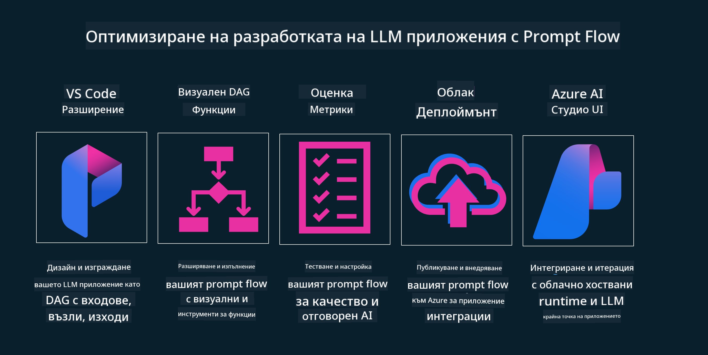

<!--
CO_OP_TRANSLATOR_METADATA:
{
  "original_hash": "b9d32511b27373a1b21b5789d4fda057",
  "translation_date": "2025-10-17T22:20:03+00:00",
  "source_file": "14-the-generative-ai-application-lifecycle/README.md",
  "language_code": "bg"
}
-->

# Жизнен цикъл на приложенията за генеративен AI

Важен въпрос за всички AI приложения е релевантността на AI функциите, тъй като AI е бързо развиваща се област. За да гарантирате, че вашето приложение остава актуално, надеждно и устойчиво, трябва непрекъснато да го наблюдавате, оценявате и подобрявате. Тук идва ролята на жизнения цикъл на генеративния AI.

Жизненият цикъл на генеративния AI е рамка, която ви насочва през етапите на разработване, внедряване и поддържане на приложение за генеративен AI. Тя ви помага да определите целите си, да измерите представянето си, да идентифицирате предизвикателствата си и да приложите решенията си. Освен това ви помага да съобразите приложението си с етичните и правни стандарти на вашата област и вашите заинтересовани страни. Следвайки жизнения цикъл на генеративния AI, можете да гарантирате, че вашето приложение винаги предоставя стойност и удовлетворява потребителите.

## Въведение

В тази глава ще:

- Разберете промяната на парадигмата от MLOps към LLMOps
- Жизнен цикъл на LLM
- Инструменти за жизнения цикъл
- Метрики и оценка на жизнения цикъл

## Разберете промяната на парадигмата от MLOps към LLMOps

LLM са нов инструмент в арсенала на изкуствения интелект. Те са изключително мощни за задачи, свързани с анализ и генериране за приложения, но тази мощност има последствия за начина, по който оптимизираме задачите на AI и класическото машинно обучение.

Затова ни е необходима нова парадигма, за да адаптираме този инструмент динамично и с правилните стимули. Можем да категоризираме по-старите AI приложения като "ML приложения" и по-новите AI приложения като "GenAI приложения" или просто "AI приложения", отразявайки основните технологии и техники, използвани по това време. Това променя нашия подход в много аспекти, вижте следното сравнение.

Забележете, че в LLMOps сме по-фокусирани върху разработчиците на приложения, използвайки интеграции като ключова точка, използвайки "Модели като услуга" и мислейки за следните точки за метрики:

- Качество: Качество на отговорите
- Вреда: Отговорен AI
- Честност: Обоснованост на отговорите (Има ли смисъл? Точни ли са?)
- Разходи: Бюджет за решение
- Забавяне: Средно време за отговор на токен

## Жизнен цикъл на LLM

Първо, за да разберем жизнения цикъл и модификациите, нека разгледаме следната инфографика.

Както може да забележите, това е различно от обичайните жизнени цикли на MLOps. LLM имат много нови изисквания, като създаване на подсказки, различни техники за подобряване на качеството (Fine-Tuning, RAG, Meta-Prompts), различна оценка и отговорност с отговорен AI, и накрая, нови метрики за оценка (Качество, Вреда, Честност, Разходи и Забавяне).

Например, погледнете как създаваме идеи. Използваме инженеринг на подсказки, за да експериментираме с различни LLM и да изследваме възможности, за да проверим дали хипотезата ни може да е вярна.

Забележете, че това не е линейно, а интегрирани цикли, итеративни и с общ цикъл.

Как можем да изследваме тези стъпки? Нека разгледаме подробно как можем да изградим жизнен цикъл.

Това може да изглежда малко сложно, нека се фокусираме върху трите основни стъпки.

1. Създаване на идеи/Изследване: Изследване, тук можем да изследваме според нуждите на нашия бизнес. Прототипиране, създаване на [PromptFlow](https://microsoft.github.io/promptflow/index.html?WT.mc_id=academic-105485-koreyst) и тестване дали е достатъчно ефективно за нашата хипотеза.
2. Създаване/Подобряване: Имплементация, сега започваме да оценяваме за по-големи набори от данни, прилагаме техники като Fine-tuning и RAG, за да проверим устойчивостта на нашето решение. Ако не е достатъчно, можем да го преработим, да добавим нови стъпки в нашия поток или да преструктурираме данните. След тестване на нашия поток и мащаб, ако работи и проверим нашите метрики, е готово за следващата стъпка.
3. Оперативно внедряване: Интеграция, сега добавяме системи за мониторинг и известия към нашата система, внедряване и интеграция на приложението към нашето приложение.

След това имаме общия цикъл на управление, фокусирайки се върху сигурността, съответствието и управлението.

Поздравления, сега вашето AI приложение е готово за работа и оперативно. За практически опит, разгледайте [Contoso Chat Demo.](https://nitya.github.io/contoso-chat/?WT.mc_id=academic-105485-koreys)

Сега, какви инструменти можем да използваме?

## Инструменти за жизнения цикъл

За инструментите Microsoft предоставя [Azure AI Platform](https://azure.microsoft.com/solutions/ai/?WT.mc_id=academic-105485-koreys) и [PromptFlow](https://microsoft.github.io/promptflow/index.html?WT.mc_id=academic-105485-koreyst), които улесняват и правят вашия цикъл лесен за имплементация и готов за работа.

[Azure AI Platform](https://azure.microsoft.com/solutions/ai/?WT.mc_id=academic-105485-koreys) ви позволява да използвате [AI Studio](https://ai.azure.com/?WT.mc_id=academic-105485-koreys). AI Studio е уеб портал, който ви позволява да изследвате модели, примери и инструменти, да управлявате вашите ресурси, да разработвате UI потоци и да използвате SDK/CLI опции за разработка с код.

Azure AI ви позволява да използвате множество ресурси за управление на вашите операции, услуги, проекти, нужди от векторно търсене и бази данни.

Създайте, от Proof-of-Concept (POC) до приложения в голям мащаб с PromptFlow:

- Проектирайте и изграждайте приложения от VS Code, с визуални и функционални инструменти
- Тествайте и настройвайте вашите приложения за качествен AI с лекота.
- Използвайте Azure AI Studio за интеграция и итерация с облака, Push и Deploy за бърза интеграция.

## Чудесно! Продължете обучението си!

Страхотно, сега научете повече за това как структурираме приложение, за да използваме концепциите с [Contoso Chat App](https://nitya.github.io/contoso-chat/?WT.mc_id=academic-105485-koreyst), за да видите как Cloud Advocacy добавя тези концепции в демонстрации. За повече съдържание, разгледайте нашата [сесия на Ignite!](https://www.youtube.com/watch?v=DdOylyrTOWg)

Сега, разгледайте Урок 15, за да разберете как [Retrieval Augmented Generation и Векторни бази данни](../15-rag-and-vector-databases/README.md?WT.mc_id=academic-105485-koreyst) влияят на генеративния AI и как да създавате по-ангажиращи приложения!

---

**Отказ от отговорност**:  
Този документ е преведен с помощта на AI услуга за превод [Co-op Translator](https://github.com/Azure/co-op-translator). Въпреки че се стремим към точност, моля, имайте предвид, че автоматизираните преводи може да съдържат грешки или неточности. Оригиналният документ на неговия роден език трябва да се счита за авторитетен източник. За критична информация се препоръчва професионален човешки превод. Не носим отговорност за недоразумения или погрешни интерпретации, произтичащи от използването на този превод.