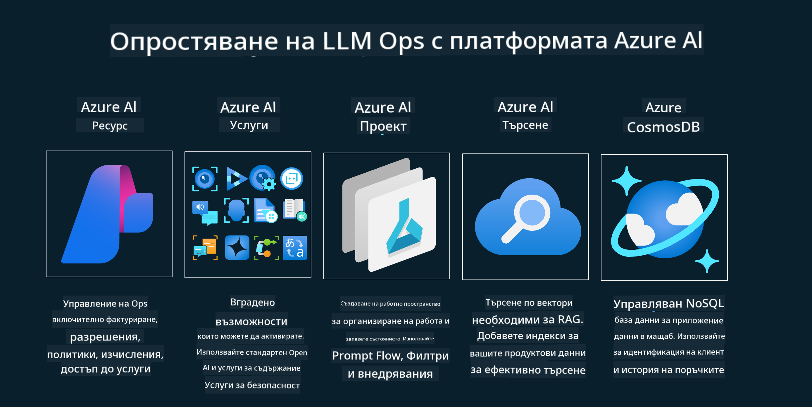

<!--
CO_OP_TRANSLATOR_METADATA:
{
  "original_hash": "27a5347a5022d5ef0a72ab029b03526a",
  "translation_date": "2025-07-09T15:58:56+00:00",
  "source_file": "14-the-generative-ai-application-lifecycle/README.md",
  "language_code": "bg"
}
-->

# Жизненият цикъл на генеративните AI приложения

Важен въпрос за всички AI приложения е релевантността на AI функциите, тъй като AI е бързо развиваща се област. За да гарантирате, че вашето приложение остава актуално, надеждно и стабилно, трябва непрекъснато да го наблюдавате, оценявате и подобрявате. Тук влиза в игра жизненият цикъл на генеративния AI.

Жизненият цикъл на генеративния AI е рамка, която ви води през етапите на разработка, внедряване и поддръжка на генеративно AI приложение. Той ви помага да дефинирате целите си, да измервате представянето, да идентифицирате предизвикателствата и да прилагате решенията си. Също така ви помага да съобразите приложението си с етичните и правни стандарти на вашата област и заинтересованите страни. Следвайки жизнения цикъл на генеративния AI, можете да сте сигурни, че приложението ви винаги носи стойност и удовлетворява потребителите.

## Въведение

В тази глава ще:

- Разберете парадигмата на прехода от MLOps към LLMOps
- Жизненият цикъл на LLM
- Инструменти за жизнения цикъл
- Метрики и оценка на жизнения цикъл

## Разберете парадигмата на прехода от MLOps към LLMOps

LLM са нов инструмент в арсенала на изкуствения интелект, те са изключително мощни в задачите за анализ и генериране за приложения, но тази мощност има последствия за начина, по който оптимизираме AI и класическите машинно-обучителни задачи.

Затова ни е нужна нова парадигма, за да адаптираме този инструмент динамично и с правилните стимули. Можем да категоризираме по-старите AI приложения като "ML приложения", а по-новите като "GenAI приложения" или просто "AI приложения", отразявайки основните технологии и техники, използвани по това време. Това променя нашия разказ по няколко начина, вижте следното сравнение.

Обърнете внимание, че при LLMOps се фокусираме повече върху разработчиците на приложения, използвайки интеграции като ключов елемент, използвайки "Модели като услуга" и мислейки за следните метрики.

- Качество: Качество на отговора
- Вреда: Отговорен AI
- Честност: Обоснованост на отговора (Има ли смисъл? Правилен ли е?)
- Разходи: Бюджет на решението
- Закъснение: Средно време за отговор на токен

## Жизненият цикъл на LLM

Първо, за да разберем жизнения цикъл и промените, нека разгледаме следната инфографика.

Както може да забележите, това е различно от обичайните жизнени цикли в MLOps. LLM имат много нови изисквания, като подсказване (Prompting), различни техники за подобряване на качеството (Фино настройване, RAG, Мета-подсказки), различна оценка и отговорност с отговорен AI, и накрая нови метрики за оценка (Качество, Вреда, Честност, Разходи и Закъснение).

Например, вижте как генерираме идеи. Използваме инженерство на подсказки, за да експериментираме с различни LLM и да изследваме възможности, за да проверим дали хипотезата ни може да е вярна.

Обърнете внимание, че това не е линеен процес, а интегрирани цикли, итеративни и с общ цикъл.

Как можем да разгледаме тези стъпки? Нека влезем в детайли как да изградим жизнения цикъл.

Това може да изглежда малко сложно, нека първо се фокусираме върху трите основни стъпки.

1. Генериране на идеи/Изследване: Тук можем да изследваме според бизнес нуждите. Прототипиране, създаване на [PromptFlow](https://microsoft.github.io/promptflow/index.html?WT.mc_id=academic-105485-koreyst) и тестване дали е достатъчно ефективно за нашата хипотеза.
1. Изграждане/Усъвършенстване: Имплементация, сега започваме да оценяваме с по-големи набори от данни, прилагаме техники като фино настройване и RAG, за да проверим устойчивостта на решението. Ако не е достатъчно, повторното му имплементиране, добавянето на нови стъпки или преструктуриране на данните може да помогне. След тестване на потока и мащаба, ако работи и метриките са добри, е готово за следващата стъпка.
1. Операционализиране: Интеграция, сега добавяме системи за мониторинг и аларми, внедряване и интеграция на приложението.

След това имаме общия цикъл на управление, съсредоточен върху сигурността, съответствието и управлението.

Поздравления, вече имате готово и работещо AI приложение. За практическо преживяване, разгледайте [Contoso Chat Demo.](https://nitya.github.io/contoso-chat/?WT.mc_id=academic-105485-koreys)

А сега, какви инструменти можем да използваме?

## Инструменти за жизнения цикъл

За инструменти Microsoft предоставя [Azure AI Platform](https://azure.microsoft.com/solutions/ai/?WT.mc_id=academic-105485-koreys) и [PromptFlow](https://microsoft.github.io/promptflow/index.html?WT.mc_id=academic-105485-koreyst), които улесняват и правят цикъла ви лесен за изпълнение и готов за работа.

[Azure AI Platform](https://azure.microsoft.com/solutions/ai/?WT.mc_id=academic-105485-koreys) ви позволява да използвате [AI Studio](https://ai.azure.com/?WT.mc_id=academic-105485-koreys). AI Studio е уеб портал, който ви позволява да изследвате модели, примери и инструменти. Управлявате ресурсите си, разработвате UI потоци и имате SDK/CLI опции за разработка с приоритет върху кода.

Azure AI ви позволява да използвате множество ресурси за управление на операциите, услугите, проектите, векторното търсене и нуждите от бази данни.

Създавайте от Proof-of-Concept (POC) до големи приложения с PromptFlow:

- Проектирайте и изграждайте приложения от VS Code с визуални и функционални инструменти
- Тествайте и фино настройвайте приложенията си за качествен AI лесно
- Използвайте Azure AI Studio за интеграция и итерация с облака, бързо внедряване и разгръщане

## Страхотно! Продължете с обучението!

Чудесно, сега научете повече за това как структурираме приложение, за да използваме концепциите с [Contoso Chat App](https://nitya.github.io/contoso-chat/?WT.mc_id=academic-105485-koreyst), за да видите как Cloud Advocacy прилага тези концепции в демонстрации. За още съдържание, разгледайте нашата [Ignite сесия!](https://www.youtube.com/watch?v=DdOylyrTOWg)

Сега преминете към Урок 15, за да разберете как [Retrieval Augmented Generation и векторни бази данни](../15-rag-and-vector-databases/README.md?WT.mc_id=academic-105485-koreyst) влияят на генеративния AI и как да създавате по-ангажиращи приложения!

**Отказ от отговорност**:  
Този документ е преведен с помощта на AI преводаческа услуга [Co-op Translator](https://github.com/Azure/co-op-translator). Въпреки че се стремим към точност, моля, имайте предвид, че автоматизираните преводи могат да съдържат грешки или неточности. Оригиналният документ на неговия роден език трябва да се счита за авторитетен източник. За критична информация се препоръчва професионален човешки превод. Ние не носим отговорност за каквито и да е недоразумения или неправилни тълкувания, произтичащи от използването на този превод.