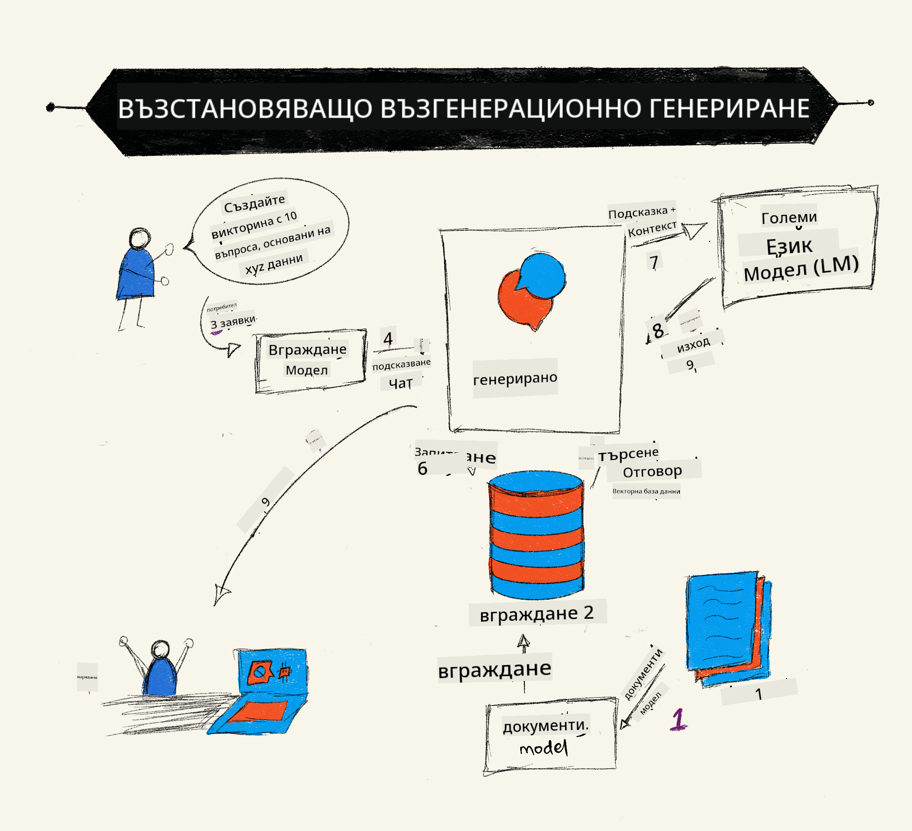
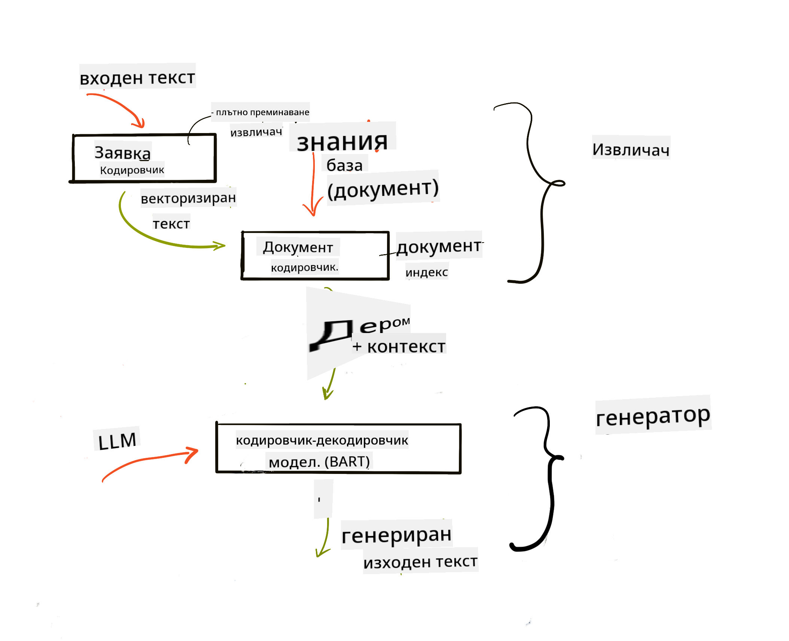

<!--
CO_OP_TRANSLATOR_METADATA:
{
  "original_hash": "e2861bbca91c0567ef32bc77fe054f9e",
  "translation_date": "2025-05-20T01:43:14+00:00",
  "source_file": "15-rag-and-vector-databases/README.md",
  "language_code": "bg"
}
-->
# Извличане на обогатено поколение (RAG) и векторни бази данни

[](https://aka.ms/gen-ai-lesson15-gh?WT.mc_id=academic-105485-koreyst)

В урока за приложения за търсене накратко научихме как да интегрирате собствените си данни в големи езикови модели (LLMs). В този урок ще се задълбочим в концепциите за обосноваване на вашите данни в приложението ви LLM, механиката на процеса и методите за съхранение на данни, включително както вграждания, така и текст.

> **Очаквайте скоро видео**

## Въведение

В този урок ще разгледаме следното:

- Въведение в RAG, какво представлява и защо се използва в изкуствения интелект (ИИ).

- Разбиране какво представляват векторните бази данни и създаване на такава за нашето приложение.

- Практически пример за това как да интегрирате RAG в приложение.

## Цели на обучението

След завършване на този урок ще можете да:

- Обясните значението на RAG в извличането и обработката на данни.

- Настроите RAG приложение и обосновете вашите данни към LLM

- Ефективна интеграция на RAG и векторни бази данни в LLM приложения.

## Нашият сценарий: подобряване на нашите LLMs със собствени данни

За този урок искаме да добавим собствени бележки в стартиращото образование, което позволява на чатбота да получава повече информация по различни теми. Използвайки бележките, които имаме, учащите ще могат да учат по-добре и да разбират различните теми, което ще улесни преговора за изпитите им. За да създадем нашия сценарий, ще използваме:

- `Azure OpenAI:` LLM, който ще използваме за създаване на нашия чатбот

- `AI for beginners' lesson on Neural Networks`: това ще бъдат данните, върху които обосноваваме нашия LLM

- `Azure AI Search` и `Azure Cosmos DB:` векторна база данни за съхранение на нашите данни и създаване на индекс за търсене

Потребителите ще могат да създават тренировъчни тестове от своите бележки, ревизионни карти и да ги обобщават в кратки прегледи. За да започнем, нека разгледаме какво представлява RAG и как работи:

## Извличане на обогатено поколение (RAG)

Чатбот, задвижван от LLM, обработва потребителски подканяния, за да генерира отговори. Той е проектиран да бъде интерактивен и да се ангажира с потребителите по широк спектър от теми. Въпреки това, неговите отговори са ограничени до предоставения контекст и основните му обучителни данни. Например, GPT-4 има ограничение на знанията до септември 2021 г., което означава, че му липсват знания за събития, които са се случили след този период. Освен това, данните, използвани за обучение на LLMs, изключват поверителна информация, като лични бележки или ръководство за продукти на компанията.

### Как работят RAGs (Извличане на обогатено поколение)



Да предположим, че искате да внедрите чатбот, който създава тестове от вашите бележки, ще ви трябва връзка с базата от знания. Тук RAG идва на помощ. RAGs работят по следния начин:

- **База от знания:** Преди извличането тези документи трябва да бъдат вкарани и предварително обработени, обикновено чрез разбиване на големи документи на по-малки части, трансформирането им в текстови вграждания и съхраняването им в база данни.

- **Потребителско запитване:** потребителят задава въпрос

- **Извличане:** Когато потребител зададе въпрос, моделът за вграждане извлича съответната информация от нашата база от знания, за да предостави повече контекст, който ще бъде включен в подканата.

- **Обогатено поколение:** LLM подобрява своя отговор въз основа на извлечените данни. Това позволява генерираният отговор да не се основава само на предварително обучени данни, но и на релевантна информация от добавения контекст. Извлечените данни се използват за обогатяване на отговорите на LLM. След това LLM връща отговор на въпроса на потребителя.



Архитектурата за RAGs се реализира чрез трансформатори, състоящи се от две части: енкодер и декодер. Например, когато потребител зададе въпрос, входният текст се "кодира" във вектори, улавящи значението на думите, и векторите се "декодират" в нашия индекс на документи и генерират нов текст въз основа на потребителското запитване. LLM използва както модел енкодер-декодер, за да генерира изхода.

Два подхода при реализирането на RAG според предложената статия: [Извличане на обогатено поколение за задачи на NLP (софтуер за обработка на естествен език), изискващи интензивни знания](https://arxiv.org/pdf/2005.11401.pdf?WT.mc_id=academic-105485-koreyst) са:

- **_RAG-Последователност_** използвайки извлечени документи за предсказване на най-добрия възможен отговор на потребителско запитване

- **RAG-Токен** използвайки документи за генериране на следващия токен, след което ги извлича, за да отговори на потребителското запитване

### Защо бихте използвали RAGs? 

- **Богатство на информацията:** гарантира, че текстовите отговори са актуални и актуални. Следователно, подобрява производителността при задачи, специфични за домейна, като осигурява достъп до вътрешната база от знания.

- Намалява измислиците, като използва **проверими данни** в базата от знания, за да предостави контекст на потребителските запитвания.

- Това е **икономично**, тъй като те са по-икономични в сравнение с фино настройване на LLM

## Създаване на база от знания

Нашето приложение се основава на нашите лични данни, т.е. урокът за невронни мрежи в учебната програма AI For Beginners.

### Векторни бази данни

Векторната база данни, за разлика от традиционните бази данни, е специализирана база данни, предназначена за съхранение, управление и търсене на вградени вектори. Тя съхранява числови представяния на документи. Разбиването на данни на числови вграждания улеснява нашата AI система да разбира и обработва данните.

Съхраняваме нашите вграждания във векторни бази данни, тъй като LLMs имат ограничение на броя токени, които приемат като вход. Тъй като не можете да предадете всички вграждания на LLM, ще трябва да ги разбивате на части и когато потребител зададе въпрос, вгражданията, които най-много приличат на въпроса, ще бъдат върнати заедно с подканата. Разбиването на части също намалява разходите за броя на токените, преминаващи през LLM.

Някои популярни векторни бази данни включват Azure Cosmos DB, Clarifyai, Pinecone, Chromadb, ScaNN, Qdrant и DeepLake. Можете да създадете модел на Azure Cosmos DB, използвайки Azure CLI със следната команда:

```bash
az login
az group create -n <resource-group-name> -l <location>
az cosmosdb create -n <cosmos-db-name> -r <resource-group-name>
az cosmosdb list-keys -n <cosmos-db-name> -g <resource-group-name>
```

### От текст към вграждания

Преди да съхраним нашите данни, ще трябва да ги конвертираме във векторни вграждания, преди да бъдат съхранени в базата данни. Ако работите с големи документи или дълги текстове, можете да ги разбивате на части въз основа на очакваните запитвания. Разбиването може да се извърши на ниво изречение или на ниво параграф. Тъй като разбиването извежда значения от думите около тях, можете да добавите някакъв друг контекст към частта, например, като добавите заглавието на документа или включите някакъв текст преди или след частта. Можете да разбивате данните по следния начин:

```python
def split_text(text, max_length, min_length):
    words = text.split()
    chunks = []
    current_chunk = []

    for word in words:
        current_chunk.append(word)
        if len(' '.join(current_chunk)) < max_length and len(' '.join(current_chunk)) > min_length:
            chunks.append(' '.join(current_chunk))
            current_chunk = []

    # If the last chunk didn't reach the minimum length, add it anyway
    if current_chunk:
        chunks.append(' '.join(current_chunk))

    return chunks
```

След като бъдат разбити, можем да вградим нашия текст, използвайки различни модели за вграждане. Някои модели, които можете да използвате, включват: word2vec, ada-002 от OpenAI, Azure Computer Vision и много други. Изборът на модел за използване ще зависи от езиците, които използвате, типа съдържание, което се кодира (текст/изображения/аудио), размерът на входа, който може да кодира, и дължината на изхода на вграждането.

Пример за вграден текст, използвайки модела `text-embedding-ada-002` на OpenAI е:


## Извличане и векторно търсене

Когато потребител зададе въпрос, извличащият го преобразува във вектор, използвайки енкодера на запитванията, след което търси в нашия индекс за търсене на документи за съответни вектори в документа, които са свързани с входа. След като приключи, той преобразува както входния вектор, така и векторите на документите в текст и го предава през LLM.

### Извличане

Извличането се случва, когато системата се опитва бързо да намери документите от индекса, които отговарят на критериите за търсене. Целта на извличащия е да получи документи, които ще бъдат използвани за предоставяне на контекст и обосноваване на LLM върху вашите данни.

Има няколко начина за извършване на търсене в нашата база данни, като например:

- **Търсене по ключова дума** - използва се за текстови търсения

- **Семантично търсене** - използва семантичното значение на думите

- **Векторно търсене** - преобразува документи от текст във векторни представяния, използвайки модели за вграждане. Извличането ще се извърши чрез запитване на документите, чиито векторни представяния са най-близки до потребителския въпрос.

- **Хибридно** - комбинация от търсене по ключова дума и векторно търсене.

Предизвикателство при извличането възниква, когато няма подобен отговор на запитването в базата данни, системата тогава ще върне най-добрата информация, която може да получи, обаче, можете да използвате тактики като задаване на максимално разстояние за релевантност или използване на хибридно търсене, което комбинира както ключови думи, така и векторно търсене. В този урок ще използваме хибридно търсене, комбинация от векторно и ключово търсене. Ще съхраним нашите данни в датафрейм с колони, съдържащи частите, както и вгражданията.

### Векторна подобност

Извличащият ще търси в базата от знания за вграждания, които са близо едно до друго, най-близкият съсед, тъй като те са текстове, които са подобни. В случая, когато потребител зададе запитване, то първо се вгражда, след което се съпоставя с подобни вграждания. Общата мярка, която се използва, за да се установи колко подобни са различни вектори, е косинусова подобност, която се основава на ъгъла между два вектора.

Можем да измерим подобността, използвайки други алтернативи, които можем да използваме, са евклидово разстояние, което е правата линия между краищата на векторите, и скаларен произведение, което измерва сумата от произведенията на съответните елементи на два вектора.

### Индекс за търсене

При извличането ще трябва да изградим индекс за търсене за нашата база от знания, преди да извършим търсене. Индексът ще съхранява нашите вграждания и може бързо да извлича най-подобните части дори в голяма база данни. Можем да създадем нашия индекс локално, използвайки:

```python
from sklearn.neighbors import NearestNeighbors

embeddings = flattened_df['embeddings'].to_list()

# Create the search index
nbrs = NearestNeighbors(n_neighbors=5, algorithm='ball_tree').fit(embeddings)

# To query the index, you can use the kneighbors method
distances, indices = nbrs.kneighbors(embeddings)
```

### Преоценяване

След като сте направили запитване към базата данни, може да се наложи да сортирате резултатите от най-релевантните. Преоценяващ LLM използва машинно обучение, за да подобри релевантността на резултатите от търсенето, като ги подрежда от най-релевантните. Използвайки Azure AI Search, преоценяването се извършва автоматично за вас, използвайки семантичен преоценител. Пример за това как работи преоценяването, използвайки най-близките съседи:

```python
# Find the most similar documents
distances, indices = nbrs.kneighbors([query_vector])

index = []
# Print the most similar documents
for i in range(3):
    index = indices[0][i]
    for index in indices[0]:
        print(flattened_df['chunks'].iloc[index])
        print(flattened_df['path'].iloc[index])
        print(flattened_df['distances'].iloc[index])
    else:
        print(f"Index {index} not found in DataFrame")
```

## Събиране на всичко заедно

Последната стъпка е добавянето на нашия LLM към сместа, за да можем да получаваме отговори, които са обосновани на нашите данни. Можем да го реализираме по следния начин:

```python
user_input = "what is a perceptron?"

def chatbot(user_input):
    # Convert the question to a query vector
    query_vector = create_embeddings(user_input)

    # Find the most similar documents
    distances, indices = nbrs.kneighbors([query_vector])

    # add documents to query  to provide context
    history = []
    for index in indices[0]:
        history.append(flattened_df['chunks'].iloc[index])

    # combine the history and the user input
    history.append(user_input)

    # create a message object
    messages=[
        {"role": "system", "content": "You are an AI assistant that helps with AI questions."},
        {"role": "user", "content": history[-1]}
    ]

    # use chat completion to generate a response
    response = openai.chat.completions.create(
        model="gpt-4",
        temperature=0.7,
        max_tokens=800,
        messages=messages
    )

    return response.choices[0].message

chatbot(user_input)
```

## Оценка на нашето приложение

### Метрики за оценка

- Качество на предоставените отговори, осигурявайки, че звучат естествено, гладко и човешки

- Обоснованост на данните: оценка дали отговорът е дошъл от предоставените документи

- Релевантност: оценка дали отговорът съответства и е свързан с зададения въпрос

- Гладкост - дали отговорът има смисъл граматически

## Приложения за използване на RAG (Извличане на обогатено поколение) и векторни бази данни

Има много различни приложения, където извикванията на функции могат да подобрят вашето приложение, като например:

- Въпроси и отговори: обосноваване на данните на вашата компания към чат, който може да се използва от служителите за задаване на въпроси.

- Системи за препоръки: където можете да създадете система, която съпоставя най-подобните стойности, напр. филми, ресторанти и много други.

- Чатбот услуги: можете да съхранявате историята на чатовете и да персонализирате разговора въз основа на данните на потребителя.

- Търсене на изображения въз основа на векторни вграждания, полезно при разпознаване на изображения и откриване на аномалии.

## Обобщение

Разгледахме основните области на RAG от добавянето на нашите данни към приложението, потребителското запитване и изхода. За да опростите създаването на RAG, можете да използвате рамки като Semanti Kernel, Langchain или Autogen.

## Задача

За да продължите вашето обучение по Извличане на обогатено поколение (RAG), можете да изградите:

- Изградете преден край за приложението, използвайки рамката по ваш избор

- Използвайте рамка, или LangChain или Semantic Kernel, и пресъздайте вашето приложение.

Поздравления за завършването на урока 👏.

## Обучението не спира тук, продължете пътешествието

След завършване на този урок, разгледайте нашата

**Отказ от отговорност**:  
Този документ е преведен с помощта на AI услуга за превод [Co-op Translator](https://github.com/Azure/co-op-translator). Докато се стремим към точност, моля, имайте предвид, че автоматизираните преводи могат да съдържат грешки или неточности. Оригиналният документ на неговия роден език трябва да се счита за авторитетен източник. За критична информация се препоръчва професионален човешки превод. Ние не носим отговорност за недоразумения или неправилни тълкувания, възникнали от използването на този превод.