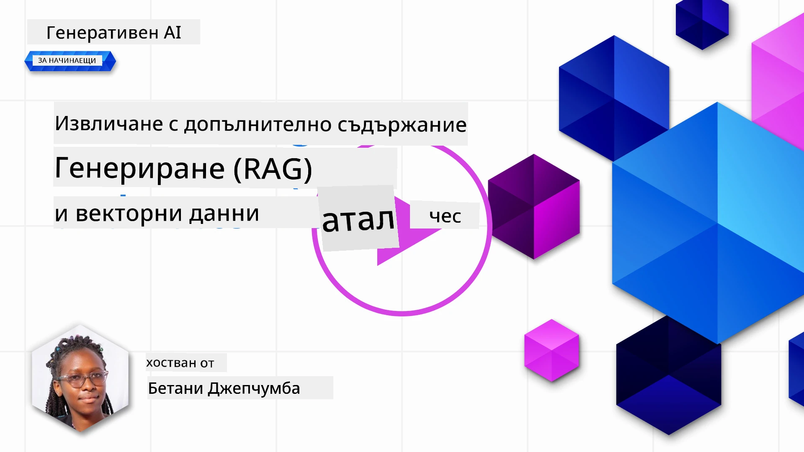
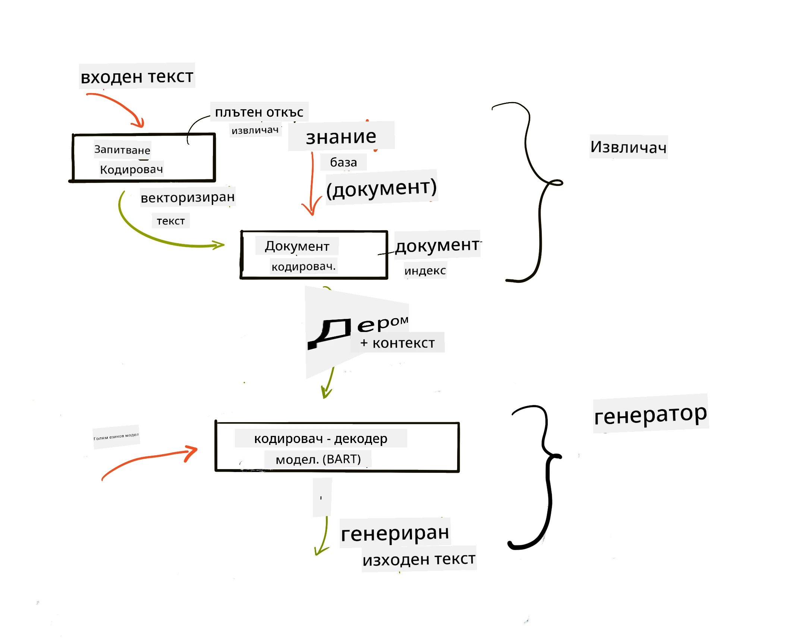
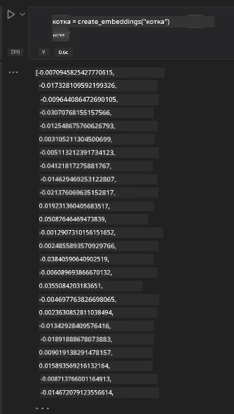

# Retrieval Augmented Generation (RAG) и Векторни Бази Данни

[](https://youtu.be/4l8zhHUBeyI?si=BmvDmL1fnHtgQYkL)

В уроците за приложения за търсене накратко научихме как да интегрираме собствените си данни в Големи Езикови Модели (LLMs). В този урок ще разгледаме по-подробно концепциите за „закотвяне“ на вашите данни в приложението на LLM, механиката на процеса и методите за съхранение на данни, включително както вграждания (embeddings), така и текст.

> **Видео скоро**

## Въведение

В този урок ще разгледаме следното:

- Въведение в RAG, какво представлява и защо се използва в изкуствения интелект (AI).

- Разбиране какво са векторните бази данни и създаване на такава за нашето приложение.

- Практически пример за интегриране на RAG в приложение.

## Учебни цели

След като завършите този урок, ще можете да:

- Обясните значението на RAG в извличането и обработката на данни.

- Настроите RAG приложение и закотвите данните си към LLM.

- Ефективно интегриране на RAG и Векторни бази данни в LLM приложения.

## Нашият сценарий: подобряване на LLM с наши собствени данни

За този урок искаме да добавим собствени бележки в образователния стартъп, което позволява на чатбота да получава повече информация за различните предмети. Използвайки наличните бележки, учащите ще могат да учат по-добре и да разбират различните теми, което улеснява подготовката им за изпити. За да създадем нашия сценарий, ще използваме:

- `Azure OpenAI:` LLM, който ще използваме за създаване на нашия чатбот

- `Урок "AI за начинаещи" за невронни мрежи:` това ще бъдат данните, върху които ще закотвим нашия LLM

- `Azure AI Search` и `Azure Cosmos DB:` векторна база данни за съхранение на данните и създаване на търсачен индекс

Потребителите ще могат да създават практични тестове от своите бележки, учебни флашкарти за преговор и да ги обобщават в кратки прегледи. За да започнем, нека разгледаме какво е RAG и как работи:

## Retrieval Augmented Generation (RAG)

Чатбот, задвижван от LLM, обработва входящи потребителски заявки, за да генерира отговори. Той е проектиран да бъде интерактивен и да взаимодейства с потребителите по широка гама от теми. Въпреки това, неговите отговори са ограничени до предоставения контекст и основните данни за обучение. Например, GPT-4 има краен срок на знанието до септември 2021 г., което означава, че няма информация за събития след този период. Освен това, данните, използвани за обучение на LLM, изключват поверителна информация като лични бележки или продуктовите ръководства на компанията.

### Как работят RAG (Retrieval Augmented Generation)


Да предположим, че искате да стартирате чатбот, който създава тестове от вашите бележки; ще ви е необходима връзка към базата знания. Тук идват на помощ RAG. RAG функционира по следния начин:

- **База знания:** Преди извличането тези документи трябва да бъдат заредени и предварително обработени, обикновено чрез разбиване на големи документи на по-малки части, преобразуване в текстови вграждания и съхранение в база данни.

- **Потребителска заявка:** потребителят задава въпрос

- **Извличане:** Когато потребител зададе въпрос, моделът за вграждане извлича релевантна информация от базата знания, за да осигури повече контекст, който ще бъде включен в заявката.

- **Усъвършенствано генериране:** LLM подобрява своя отговор въз основа на извлечените данни. Това позволява генерираният отговор да се основава не само на предварително обучени данни, но и на релевантна информация от добавения контекст. Извлечените данни се използват за обогатяване на отговорите на LLM. След това LLM връща отговор на въпроса на потребителя.



Архитектурата на RAG се реализира чрез трансформъри, състоящи се от две части: енкодер и декодер. Например, когато потребител зададе въпрос, входният текст се „кодира“ във вектори, които улавят значението на думите, а векторите се „декодират“ спрямо индекса на документите и генерират нов текст въз основа на заявката на потребителя. LLM използва модел енкодер-декодер за генериране на изхода.

Два подхода за внедряване на RAG според предложения документ: [Retrieval-Augmented Generation for Knowledge intensive NLP (natural language processing software) Tasks](https://arxiv.org/pdf/2005.11401.pdf?WT.mc_id=academic-105485-koreyst) са:

- **_RAG-Sequence_** използва извлечени документи, за да предскаже най-добрия възможен отговор на потребителска заявка

- **RAG-Token** използва документи, за да генерира следващата дума (токен), след което ги извлича, за да отговори на заявката на потребителя

### Защо да използвате RAG? 

- **Богатство на информация:** гарантира, че текстовите отговори са актуални и съвременни. Това подобрява изпълнението при задачи в дадена област чрез достъп до вътрешната база знания.

- Намалява измислиците, като използва **проверими данни** в базата знания за предоставяне на контекст на потребителските заявки.

- Това е **ефективно откъм разходи**, тъй като е по-икономично в сравнение с допълнително обучение на LLM.

## Създаване на база знания

Нашето приложение се базира на лични данни, т.е. урока за Невронни Мрежи от учебната програма AI За Начинаещи.

### Векторни бази данни

Векторната база данни, за разлика от традиционните бази данни, е специализирана база, проектирана да съхранява, управлява и търси вградени вектори. Тя съхранява числови представяния на документи. Разбиването на данни в числови вграждания улеснява нашата AI система да разбира и обработва данните.

Ние съхраняваме нашите вграждания във векторни бази данни, тъй като LLM имат лимити за броя на токени, които приемат като вход. Тъй като не можете да подадете цялото вграждане на LLM, трябва да ги разделим на части и когато потребител зададе въпрос, най-подходящите вграждания ще бъдат върнати заедно с подканата. Разделянето на части също намалява разходите за броя токени, подавани към LLM.

Някои популярни векторни бази данни включват Azure Cosmos DB, Clarifyai, Pinecone, Chromadb, ScaNN, Qdrant и DeepLake. Можете да създадете модел Azure Cosmos DB с помощта на Azure CLI с следната команда:

```bash
az login
az group create -n <resource-group-name> -l <location>
az cosmosdb create -n <cosmos-db-name> -r <resource-group-name>
az cosmosdb list-keys -n <cosmos-db-name> -g <resource-group-name>
```

### От текст към вграждания

Преди да съхраним данните, трябва да ги конвертираме във векторни вграждания, преди да бъдат записани в базата данни. Ако работите с големи документи или дълги текстове, можете да ги разделите на части според очакваните заявки. Разделянето може да се направи на ниво изречение или на ниво параграф. Тъй като разделянето извлича значението от думите около тях, можете да добавите и друг контекст към частта, например чрез добавяне на заглавието на документа или включване на текст преди или след частта. Можете да разделите данните по следния начин:

```python
def split_text(text, max_length, min_length):
    words = text.split()
    chunks = []
    current_chunk = []

    for word in words:
        current_chunk.append(word)
        if len(' '.join(current_chunk)) < max_length and len(' '.join(current_chunk)) > min_length:
            chunks.append(' '.join(current_chunk))
            current_chunk = []

    # Ако последният блок не достигне минималната дължина, все пак го добавете
    if current_chunk:
        chunks.append(' '.join(current_chunk))

    return chunks
```

След като са разделени, можем да вградим текста с различни модели за вграждане. Някои от моделите, които можете да използвате, включват: word2vec, ada-002 на OpenAI, Azure Computer Vision и много други. Изборът на модел зависи от използваните езици, типа съдържание (текст/изображения/аудио), размера на входа, който може да бъде кодиран, и дължината на изходното вграждане.

Пример за вграден текст с модела `text-embedding-ada-002` на OpenAI е:


## Извличане и Векторно Търсене

Когато потребител зададе въпрос, системата трансформира заявката във вектор, използвайки енкодера за заявки, след което търси в нашия документен търсачен индекс за релевантни вектори на бизнеса свързани с входа. След това конвертира както входния вектор, така и векторите на документите в текст и ги подава към LLM.

### Извличане

Извличането се извършва, когато системата се опитва бързо да намери документи от индекса, които удовлетворяват критериите за търсене. Целта на извличача е да намери документи, които ще се използват, за да се осигури контекст и „закотвяне“ на LLM върху вашите данни.

Има няколко начина за търсене в нашата база данни, като:

- **Търсене с ключова дума** - използва се за текстови търсения

- **Векторно търсене** - преобразува документи от текст във векторни представяния с помощта на модели за вграждане, което позволява **семантично търсене** чрез значението на думите. Извличането се извършва чрез заявка за документи, чиито векторни представяния са най-близки до въпроса на потребителя.

- **Хибридно** - комбинация от търсене по ключова дума и векторно търсене.

Проблем при извличането възниква, когато в базата няма подобен отговор на заявката, системата ще върне най-добрата налична информация, но може да използвате тактики като задаване на максимално разстояние за релевантност или използване на хибридно търсене, което комбинира и двата подхода. В този урок ще използваме хибридно търсене – комбинация от векторно и търсене по ключови думи. Ще съхраняваме данните в dataframe с колони, съдържащи както частите, така и вгражданията.

### Векторна прилика

Извличачът ще търси в базата знания за вграждания, които са близки един до друг, най-близкия съсед, тъй като тези текстове са сходни. В сценария, когато потребител зададе въпрос, той първо се вгражда, след което се съпоставя със сходни вграждания. Често използвана метрика за измерване на сходство между вектори е косинусното сходство, основано на ъгъла между два вектора.

Можем да измерим сходството и с други методи като Евклидово разстояние, което е правата линия между краищата на векторите, и скаларно произведение, което измерва сумата на произведенията на съответните елементи на два вектора.

### Търсачен индекс

При извличане трябва да изградим търсачен индекс за нашата база знания преди да извършим търсене. Индексът съхранява нашите вграждания и може бързо да извлича най-подходящите части дори и в голяма база данни. Можем да създадем индекса локално, като използваме:

```python
from sklearn.neighbors import NearestNeighbors

embeddings = flattened_df['embeddings'].to_list()

# Създайте индекса за търсене
nbrs = NearestNeighbors(n_neighbors=5, algorithm='ball_tree').fit(embeddings)

# За да направите запитване към индекса, можете да използвате метода kneighbors
distances, indices = nbrs.kneighbors(embeddings)
```

### Пренареждане

След като сте заявили в базата данни, може да се наложи да сортирате резултатите от най-релевантните. Пренареждащ LLM използва машинно обучение за подобряване на релевантността на резултатите, като ги подрежда от най-релевантния. Използвайки Azure AI Search, пренареждането се извършва автоматично чрез семантичен пренареждач. Пример как работи пренареждането използвайки най-близки съседи:

```python
# Намерете най-подобните документи
distances, indices = nbrs.kneighbors([query_vector])

index = []
# Отпечатайте най-подобните документи
for i in range(3):
    index = indices[0][i]
    for index in indices[0]:
        print(flattened_df['chunks'].iloc[index])
        print(flattened_df['path'].iloc[index])
        print(flattened_df['distances'].iloc[index])
    else:
        print(f"Index {index} not found in DataFrame")
```

## Обединяване на всичко

Последната стъпка е да добавим нашия LLM, за да можем да получаваме отговори, закотвени на нашите данни. Можем да го реализираме по следния начин:

```python
user_input = "what is a perceptron?"

def chatbot(user_input):
    # Преобразувайте въпроса в вектор на заявката
    query_vector = create_embeddings(user_input)

    # Намерете най-подобните документи
    distances, indices = nbrs.kneighbors([query_vector])

    # добавете документи към заявката, за да осигурите контекст
    history = []
    for index in indices[0]:
        history.append(flattened_df['chunks'].iloc[index])

    # комбинирайте историята и потребителския вход
    history.append(user_input)

    # създайте обект съобщение
    messages=[
        {"role": "system", "content": "You are an AI assistant that helps with AI questions."},
        {"role": "user", "content": "\n\n".join(history) }
    ]

    # използвайте чат завършване за генериране на отговор
    response = openai.chat.completions.create(
        model="gpt-4",
        temperature=0.7,
        max_tokens=800,
        messages=messages
    )

    return response.choices[0].message

chatbot(user_input)
```

## Оценка на приложението

### Метрики за оценка

- Качество на предоставените отговори, като се гарантира, че звучат естествено, гладко и човешки

- Закотвеност на данните: оценка дали отговорът е базиран на предоставените документи

- Релевантност: оценка дали отговорът съвпада и е свързан със зададения въпрос

- Гладкост – дали отговорът е граматически правилен

## Приложения за използване на RAG (Retrieval Augmented Generation) и векторни бази данни

Има много различни случаи, при които извикванията на функции могат да подобрят вашето приложение, като:

- Въпроси и отговори: закотвяне на данните на компанията в чат, който може да бъде използван от служителите за задаване на въпроси.

- Системи за препоръки: където можете да създадете система, която съпоставя най-близките стойности, например филми, ресторанти и др.

- Чатбот услуги: можете да съхранявате историята на чата и да персонализирате разговора въз основа на потребителските данни.

- Търсене на изображения въз основа на векторни вграждания, полезно при разпознаване на изображения и откриване на аномалии.

## Резюме

Обхванахме основните области на RAG – добавяне на нашите данни към приложението, потребителската заявка и изхода. За опростяване на създаването на RAG можете да използвате рамки като Semantic Kernel, Langchain или Autogen.

## Задание

За да продължите обучението си по Retrieval Augmented Generation (RAG) можете да изградите:

- Изградете front-end за приложението, използвайки избраната от вас рамка

- Използвайте рамка като LangChain или Semantic Kernel и пресъздайте вашето приложение.

Поздравления за завършването на урока 👏.

## Обучението не спира тук, продължете пътешествието

След като завършите този урок, разгледайте нашата [Колекция за обучение по Генеративен AI](https://aka.ms/genai-collection?WT.mc_id=academic-105485-koreyst), за да продължите да повишавате знанията си в Генеративния AI!

---

<!-- CO-OP TRANSLATOR DISCLAIMER START -->
**Отказ от отговорност**:
Този документ е преведен с помощта на AI преводаческа услуга [Co-op Translator](https://github.com/Azure/co-op-translator). Въпреки че се стремим към точност, моля, имайте предвид, че автоматизираните преводи могат да съдържат грешки или неточности. Оригиналният документ на неговия естествен език трябва да се счита за авторитетен източник. За критична информация се препоръчва професионален човешки превод. Не носим отговорност за никакви недоразумения или неправилни тълкувания, възникнали от използването на този превод.
<!-- CO-OP TRANSLATOR DISCLAIMER END -->