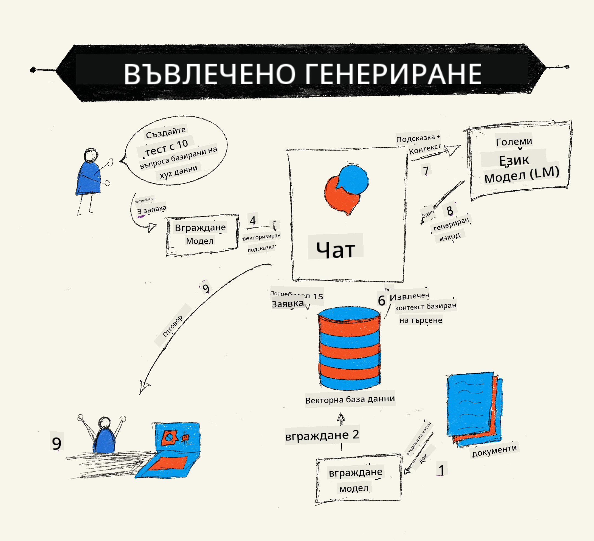
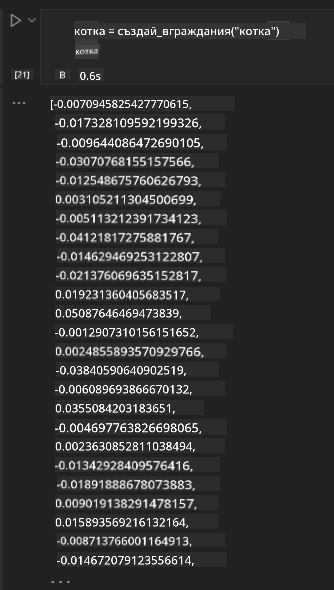

<!--
CO_OP_TRANSLATOR_METADATA:
{
  "original_hash": "e2861bbca91c0567ef32bc77fe054f9e",
  "translation_date": "2025-07-09T16:20:32+00:00",
  "source_file": "15-rag-and-vector-databases/README.md",
  "language_code": "bg"
}
-->
# Retrieval Augmented Generation (RAG) и векторни бази данни

[](https://aka.ms/gen-ai-lesson15-gh?WT.mc_id=academic-105485-koreyst)

В урока за търсещите приложения накратко разгледахме как да интегрираме собствените си данни в големи езикови модели (LLMs). В този урок ще навлезем по-дълбоко в концепциите за основаване на данните в приложението с LLM, механиката на процеса и методите за съхранение на данни, включително както embeddings, така и текст.

> **Видео скоро**

## Въведение

В този урок ще разгледаме следното:

- Въведение в RAG, какво представлява и защо се използва в изкуствения интелект (AI).

- Разбиране какво са векторните бази данни и създаване на такава за нашето приложение.

- Практически пример за интегриране на RAG в приложение.

## Цели на обучението

След завършване на този урок ще можете да:

- Обясните значението на RAG при извличане и обработка на данни.

- Настроите RAG приложение и да основете данните си в LLM.

- Ефективно интегрирате RAG и векторни бази данни в LLM приложения.

## Нашият сценарий: подобряване на LLM с наши собствени данни

За този урок искаме да добавим собствените си бележки в образователния стартъп, което позволява на чатбота да получава повече информация по различни предмети. Използвайки бележките, които имаме, учащите ще могат да учат по-добре и да разбират различните теми, което улеснява подготовката за изпити. За да създадем нашия сценарий, ще използваме:

- `Azure OpenAI:` LLM, който ще използваме за създаване на нашия чатбот

- `Урок за AI за начинаещи за невронни мрежи:` това ще бъде данните, на които ще основем нашия LLM

- `Azure AI Search` и `Azure Cosmos DB:` векторна база данни за съхранение на данните и създаване на индекс за търсене

Потребителите ще могат да създават тренировъчни тестове от своите бележки, флашкарти за преговор и да ги обобщават в кратки прегледи. За да започнем, нека разгледаме какво е RAG и как работи:

## Retrieval Augmented Generation (RAG)

Чатбот, задвижван от LLM, обработва потребителски заявки, за да генерира отговори. Той е проектиран да бъде интерактивен и да взаимодейства с потребителите по широк кръг теми. Въпреки това, отговорите му са ограничени до предоставения контекст и основните му обучителни данни. Например, GPT-4 има краен срок на знанията си септември 2021 г., което означава, че няма информация за събития след този период. Освен това, данните, използвани за обучение на LLM, изключват поверителна информация като лични бележки или ръководство за продукт на компания.

### Как работят RAG (Retrieval Augmented Generation)



Да предположим, че искате да пуснете чатбот, който създава тестове от вашите бележки, ще ви трябва връзка с базата знания. Тук RAG идва на помощ. RAG работят по следния начин:

- **База знания:** Преди извличане, тези документи трябва да бъдат заредени и предварително обработени, обикновено чрез разбиване на големи документи на по-малки части, преобразуване в текстови embeddings и съхранение в база данни.

- **Потребителски въпрос:** потребителят задава въпрос

- **Извличане:** Когато потребителят зададе въпрос, embedding моделът извлича релевантна информация от базата знания, за да предостави повече контекст, който ще бъде включен в заявката.

- **Подсилено генериране:** LLM подобрява отговора си въз основа на извлечените данни. Това позволява отговорът да се базира не само на предварително обучени данни, но и на релевантна информация от добавения контекст. Извлечените данни се използват за подсилване на отговорите на LLM. След това LLM връща отговор на въпроса на потребителя.


Архитектурата на RAG се реализира с помощта на трансформъри, състоящи се от две части: енкодер и декодер. Например, когато потребител зададе въпрос, входният текст се „кодира“ във вектори, улавящи значението на думите, а векторите се „декодират“ в нашия индекс на документи и генерират нов текст въз основа на потребителската заявка. LLM използва модел енкодер-декодер за генериране на изхода.

Два подхода при реализиране на RAG според предложената статия: [Retrieval-Augmented Generation for Knowledge intensive NLP Tasks](https://arxiv.org/pdf/2005.11401.pdf?WT.mc_id=academic-105485-koreyst) са:

- **_RAG-Sequence_** използва извлечени документи, за да предскаже най-добрия възможен отговор на потребителски въпрос

- **RAG-Token** използва документи за генериране на следващия токен, след което ги извлича, за да отговори на въпроса на потребителя

### Защо да използвате RAG?

- **Богатство на информацията:** гарантира, че текстовите отговори са актуални и съвременни. Това подобрява представянето при задачи, специфични за дадена област, чрез достъп до вътрешната база знания.

- Намалява измислиците, като използва **проверими данни** в базата знания, за да предостави контекст на потребителските въпроси.

- **Икономически ефективно** е, тъй като е по-евтино в сравнение с фина настройка на LLM.

## Създаване на база знания

Нашето приложение се базира на личните ни данни, т.е. урока за невронни мрежи от учебната програма AI за начинаещи.

### Векторни бази данни

Векторната база данни, за разлика от традиционните бази, е специализирана база, предназначена за съхранение, управление и търсене на вградени вектори. Тя съхранява числови представяния на документи. Разбиването на данните на числови embeddings улеснява нашата AI система да разбира и обработва данните.

Съхраняваме embeddings в векторни бази данни, тъй като LLM имат ограничение за броя токени, които приемат като вход. Тъй като не можете да подадете цялото embedding на LLM, трябва да ги разделим на части, а когато потребител зададе въпрос, embeddings, най-близки до въпроса, ще бъдат върнати заедно със заявката. Разделянето също намалява разходите за броя токени, подавани към LLM.

Някои популярни векторни бази данни включват Azure Cosmos DB, Clarifyai, Pinecone, Chromadb, ScaNN, Qdrant и DeepLake. Можете да създадете модел в Azure Cosmos DB с помощта на Azure CLI със следната команда:

```bash
az login
az group create -n <resource-group-name> -l <location>
az cosmosdb create -n <cosmos-db-name> -r <resource-group-name>
az cosmosdb list-keys -n <cosmos-db-name> -g <resource-group-name>
```

### От текст към embeddings

Преди да съхраним данните, трябва да ги преобразуваме във векторни embeddings. Ако работите с големи документи или дълги текстове, можете да ги разделите на части според очакваните заявки. Разделянето може да се направи на ниво изречение или параграф. Тъй като разделянето извлича значения от околните думи, можете да добавите и друг контекст към частта, например заглавието на документа или някакъв текст преди или след частта. Можете да разделите данните по следния начин:

```python
def split_text(text, max_length, min_length):
    words = text.split()
    chunks = []
    current_chunk = []

    for word in words:
        current_chunk.append(word)
        if len(' '.join(current_chunk)) < max_length and len(' '.join(current_chunk)) > min_length:
            chunks.append(' '.join(current_chunk))
            current_chunk = []

    # If the last chunk didn't reach the minimum length, add it anyway
    if current_chunk:
        chunks.append(' '.join(current_chunk))

    return chunks
```

След като са разделени, можем да вградим текста с различни embedding модели. Някои модели, които можете да използвате, са: word2vec, ada-002 на OpenAI, Azure Computer Vision и много други. Изборът на модел зависи от езиците, които използвате, типа съдържание (текст/изображения/аудио), размера на входа, който може да кодира, и дължината на embedding изхода.

Пример за вграден текст с модела `text-embedding-ada-002` на OpenAI е:


## Извличане и векторно търсене

Когато потребител зададе въпрос, извличащият го преобразува във вектор с помощта на query encoder, след което търси в нашия индекс за търсене на документи релевантни вектори, свързани с входа. След това преобразува както входния вектор, така и векторите на документите в текст и ги подава на LLM.

### Извличане

Извличането се случва, когато системата се опитва бързо да намери документи от индекса, които отговарят на критериите за търсене. Целта на извличащия е да намери документи, които да предоставят контекст и да основат LLM на вашите данни.

Има няколко начина за търсене в базата данни, като:

- **Търсене по ключова дума** - използва се за текстови търсения

- **Семантично търсене** - използва семантичното значение на думите

- **Векторно търсене** - преобразува документи от текст във векторни представяния с embedding модели. Извличането се извършва чрез заявка към документи, чиито векторни представяния са най-близки до въпроса на потребителя.

- **Хибридно** - комбинация от търсене по ключова дума и векторно търсене.

Проблем при извличането възниква, когато няма подобен отговор на заявката в базата данни; системата тогава връща най-добрата налична информация. Въпреки това, можете да използвате тактики като задаване на максимално разстояние за релевантност или да използвате хибридно търсене, което комбинира ключови думи и векторно търсене. В този урок ще използваме хибридно търсене, комбинация от векторно и търсене по ключова дума. Ще съхраняваме данните си в dataframe с колони, съдържащи частите и embeddings.

### Векторна сходство

Извличащият ще търси в базата знания embeddings, които са близки един до друг, най-близкия съсед, тъй като това са текстове с подобно съдържание. В сценария, когато потребител зададе въпрос, той първо се вгражда и след това се съпоставя с подобни embeddings. Често използваната мярка за сходство между вектори е косинусова близост, която се базира на ъгъла между два вектора.

Можем да измерваме сходството и с други методи като Евклидово разстояние, което е правата линия между краищата на векторите, и скаларно произведение, което измерва сумата от произведенията на съответните елементи на двата вектора.

### Индекс за търсене

При извличане трябва да изградим индекс за търсене на базата знания преди да извършим търсене. Индексът съхранява embeddings и може бързо да извлича най-подобните части дори в голяма база данни. Можем да създадем индекса локално с:

```python
from sklearn.neighbors import NearestNeighbors

embeddings = flattened_df['embeddings'].to_list()

# Create the search index
nbrs = NearestNeighbors(n_neighbors=5, algorithm='ball_tree').fit(embeddings)

# To query the index, you can use the kneighbors method
distances, indices = nbrs.kneighbors(embeddings)
```

### Пренареждане

След като сте направили заявка към базата данни, може да се наложи да сортирате резултатите от най-релевантните. Пренареждащ LLM използва машинно обучение, за да подобри релевантността на резултатите от търсенето, като ги подрежда от най-релевантните. С Azure AI Search пренареждането се извършва автоматично чрез семантичен пренареждач. Пример за това как работи пренареждането с най-близки съседи:

```python
# Find the most similar documents
distances, indices = nbrs.kneighbors([query_vector])

index = []
# Print the most similar documents
for i in range(3):
    index = indices[0][i]
    for index in indices[0]:
        print(flattened_df['chunks'].iloc[index])
        print(flattened_df['path'].iloc[index])
        print(flattened_df['distances'].iloc[index])
    else:
        print(f"Index {index} not found in DataFrame")
```

## Обединяване на всичко

Последната стъпка е да добавим нашия LLM, за да можем да получаваме отговори, основаващи се на нашите данни. Можем да го реализираме по следния начин:

```python
user_input = "what is a perceptron?"

def chatbot(user_input):
    # Convert the question to a query vector
    query_vector = create_embeddings(user_input)

    # Find the most similar documents
    distances, indices = nbrs.kneighbors([query_vector])

    # add documents to query  to provide context
    history = []
    for index in indices[0]:
        history.append(flattened_df['chunks'].iloc[index])

    # combine the history and the user input
    history.append(user_input)

    # create a message object
    messages=[
        {"role": "system", "content": "You are an AI assistant that helps with AI questions."},
        {"role": "user", "content": history[-1]}
    ]

    # use chat completion to generate a response
    response = openai.chat.completions.create(
        model="gpt-4",
        temperature=0.7,
        max_tokens=800,
        messages=messages
    )

    return response.choices[0].message

chatbot(user_input)
```

## Оценка на нашето приложение

### Метрики за оценка

- Качество на предоставените отговори – да звучат естествено, плавно и човешки

- Основаване на данните: оценка дали отговорът идва от предоставените документи

- Релевантност: оценка дали отговорът съвпада и е свързан със зададения въпрос

- Плавност – дали отговорът е граматически смислен

## Приложения за използване на RAG (Retrieval Augmented Generation) и векторни бази данни

Има много различни случаи, в които извиквания на функции могат да подобрят вашето приложение, като например:

- Въпроси и отговори: основаване на фирмените данни в чат, който служителите могат да използват за задаване на въпроси.

- Системи за препоръки: където можете да създадете система, която съпоставя най-подобните стойности, напр. филми, ресторанти и много други.

- Чатбот услуги: можете да съхранявате история на чата и да персонализирате разговора според данните на потребителя.

- Търсене на изображения на базата на векторни embeddings, полезно при разпознаване на изображения и откриване на аномалии.

## Обобщение

Обхванахме основните области на RAG – от добавяне на данни в приложението, потребителската заявка и изхода. За да опростите създаването на RAG, можете да използвате рамки като Semantic Kernel, Langchain или Autogen.

## Задача

За да продължите обучението си по Retrieval Augmented Generation (RAG), можете да изградите:

- Фронтенд за приложението, използвайки рамката по ваш избор

- Използвайте рамка, като LangChain или Semantic Kernel, и пресъздайте приложението си.

Поздравления за завършването на урока 👏.

## Обучението не спира тук, продължете пътешествието

След като завършите този урок, разгледайте нашата [колекция за обучение по Generative AI](https://aka.ms/genai-collection?WT.mc_id=academic-105485-koreyst), за да продължите да развивате знанията си в областта на генеративния AI!

**Отказ от отговорност**:  
Този документ е преведен с помощта на AI преводаческа услуга [Co-op Translator](https://github.com/Azure/co-op-translator). Въпреки че се стремим към точност, моля, имайте предвид, че автоматизираните преводи могат да съдържат грешки или неточности. Оригиналният документ на неговия роден език трябва да се счита за авторитетен източник. За критична информация се препоръчва професионален човешки превод. Ние не носим отговорност за каквито и да е недоразумения или неправилни тълкувания, произтичащи от използването на този превод.