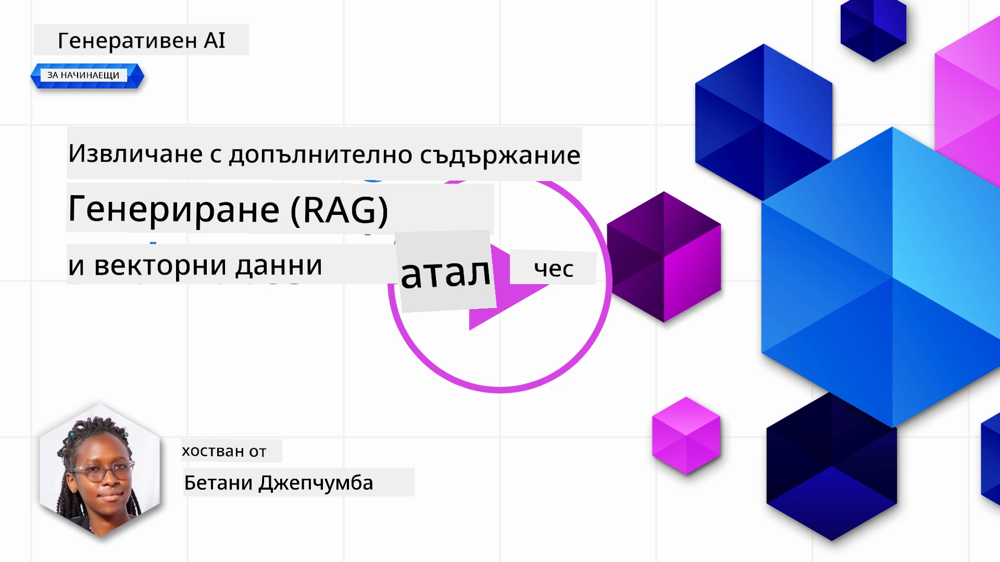
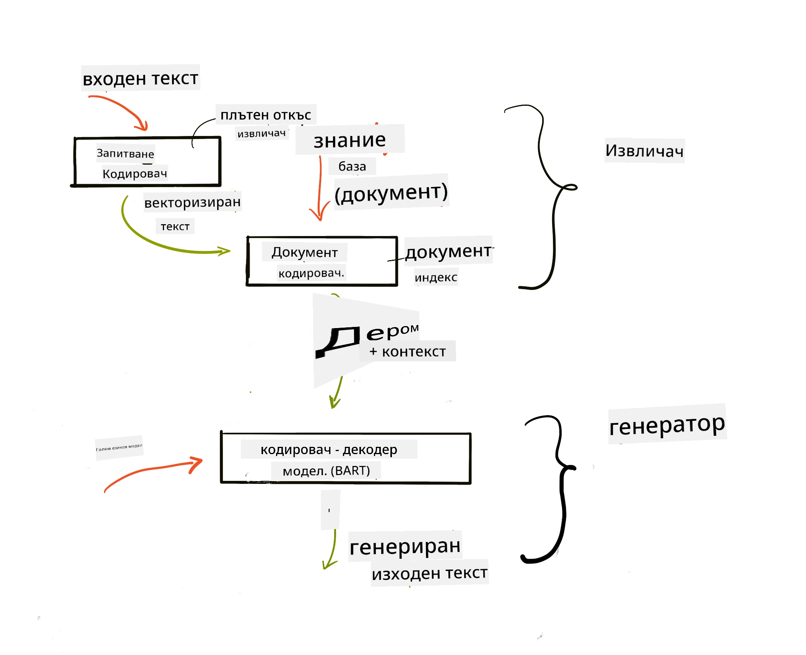
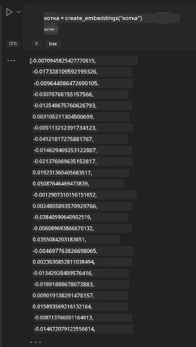

# Генериране с подсилване чрез извличане (RAG) и векторни бази данни

[](https://youtu.be/4l8zhHUBeyI?si=BmvDmL1fnHtgQYkL)

В урока за приложения за търсене накратко научихме как да интегрираме собствените си данни в големи езикови модели (LLM). В този урок ще разгледаме по-подробно концепциите за заземяване на вашите данни в приложението с LLM, механиката на процеса и методите за съхранение на данни, включително както вгражданията, така и текста.

> **Видео предстои скоро**

## Въведение

В този урок ще разгледаме следното:

- Въведение в RAG, какво е и защо се използва в изкуствения интелект (AI).

- Разбиране какво са векторните бази данни и създаване на такава за нашето приложение.

- Практически пример за интегриране на RAG в приложение.

## Цели на обучението

След завършване на този урок ще можете да:

- Обясните значението на RAG при извличането и обработката на данни.

- Настроите RAG приложение и да заземите вашите данни в LLM.

- Ефективно интегриране на RAG и векторни бази данни в LLM приложения.

## Нашият сценарий: подобряване на LLM с наши собствени данни

За този урок искаме да добавим собствени бележки в образователния стартъп, което позволява на чатбота да получава повече информация за различните предмети. Използвайки наличните бележки, учащите ще могат да учат по-добре и да разберат различните теми, което ги прави по-лесни за преговор преди изпити. За да създадем нашия сценарий, ще използваме:

- `Azure OpenAI:` LLM, който ще използваме за създаване на нашия чатбот

- `Урок „AI за начинаещи“ за невронни мрежи`: това ще бъде данните, на които ще заземим нашия LLM

- `Azure AI Search` и `Azure Cosmos DB:` векторна база данни за съхранение на данните и създаване на индекс за търсене

Потребителите ще могат да създават тестови въпроси от бележките си, картони за преговор и да ги обобщават в кратки прегледи. За да започнем, нека разгледаме какво е RAG и как работи:

## Генериране с подсилване чрез извличане (RAG)

Чатбот, захранван от LLM, обработва потребителски въпроси, за да генерира отговори. Той е проектиран да е интерактивен и комуникира с потребителите по широк кръг теми. Въпреки това, отговорите му са ограничени от предоставения контекст и основните обучителни данни. Например, знанието на GPT-4 е ограничено до септември 2021 г., което означава, че няма информация за събития, случили се след тази дата. Освен това обучаващите данни за LLM изключват конфиденциална информация като лични бележки или ръководство за продукт на компания.

### Как работят RAG (Генериране с подсилване чрез извличане)


Да предположим, че искате да пуснете чатбот, който създава тестове от вашите бележки, ще ви е нужна връзка с базата знание. Тук се намесва RAG. RAG работи по следния начин:

- **База знание:** Преди извличането тези документи трябва да бъдат заредени и предварително обработени, обикновено чрез разбиване на големи документи на по-малки части, трансформиране в текстови вграждания и съхранение в база данни.

- **Потребителски въпрос:** потребителят задава въпрос

- **Извличане:** Когато потребителят зададе въпрос, моделът за вграждане извлича релевантна информация от базата знание, за да осигури повече контекст, който да се включи в запитването.

- **Подсилено генериране:** LLM подобрява отговора си на база извлечените данни. Това позволява отговорът да се генерира не само въз основа на предварително обучени данни, но и на релевантна информация от добавения контекст. Извлечените данни се използват за подсилване на отговорите на LLM. След това LLM връща отговор на потребителския въпрос.



Архитектурата на RAG се изпълнява с помощта на трансформатори, състоящи се от две части: енкодер и декодер. Например, когато потребител зададе въпрос, входният текст се "криптира" в вектори, които улавят значението на думите, а векторите се "декриптират" според нашия индекс на документи и генерират нов текст въз основа на въпроса на потребителя. LLM използва както енкодер-декодер модел, за да генерира изхода.

Два подхода при изпълнението на RAG според предложената статия: [Retrieval-Augmented Generation for Knowledge intensive NLP (natural language processing software) Tasks](https://arxiv.org/pdf/2005.11401.pdf?WT.mc_id=academic-105485-koreyst) са:

- **_RAG-Последователност_** използва извлечени документи, за да предскаже най-добрия възможен отговор на потребителския въпрос

- **RAG-Токен** използва документи, за да генерира следващия токен, след което ги извлича за отговор на въпроса на потребителя

### Защо да използвате RAG? 

- **Богатство на информацията:** гарантира, че текстовите отговори са актуални и съвременни. Това повишава изпълнението на задачи в специфични домейни чрез достъп до вътрешната база знание.

- Намалява фалшифицирането, като използва **проверими данни** в базата знание, за да предостави контекст към потребителските въпроси.

- Това е **рентабилно**, тъй като е по-икономично в сравнение с фино настройване на LLM.

## Създаване на база знание

Нашето приложение се базира на лични данни, т.е. урока за невронни мрежи от учебната програма AI За начинаещи.

### Векторни бази данни

Векторна база данни, за разлика от традиционните бази данни, е специализирана база, предназначена да съхранява, управлява и търси вложени вектори. Тя съхранява цифрови представяния на документи. Разчленяването на данни до цифрови вграждания улеснява нашата AI система да разбира и обработва данните.

Съхраняваме нашите вграждания във векторни бази данни, тъй като LLM имат лимит на броя токени, които приемат като вход. Тъй като не можете да подадете цялото вграждане на LLM, ще трябва да ги разделим на части и когато потребител задава въпрос, най-близките вграждания към въпроса ще бъдат върнати заедно със заявката. Разделянето на части също намалява разходите за брой токени, обработвани чрез LLM.

Някои популярни векторни бази данни включват Azure Cosmos DB, Clarifyai, Pinecone, Chromadb, ScaNN, Qdrant и DeepLake. Можете да създадете модел на Azure Cosmos DB с помощта на Azure CLI със следната команда:

```bash
az login
az group create -n <resource-group-name> -l <location>
az cosmosdb create -n <cosmos-db-name> -r <resource-group-name>
az cosmosdb list-keys -n <cosmos-db-name> -g <resource-group-name>
```

### От текст към вграждания

Преди да съхраним данните, трябва да ги преобразуваме във векторни вграждания преди запис в базата данни. Ако работите с големи документи или дълги текстове, можете да ги разделите на части въз основа на очакваните запитвания. Разделянето може да се извърши на ниво изречение или параграф. Тъй като разделянето извлича значения от думи около тях, можете да добавите и друг контекст към частта, например, като добавите заглавие на документа или включите някакъв текст преди или след частта. Можете да разделите данните по следния начин:

```python
def split_text(text, max_length, min_length):
    words = text.split()
    chunks = []
    current_chunk = []

    for word in words:
        current_chunk.append(word)
        if len(' '.join(current_chunk)) < max_length and len(' '.join(current_chunk)) > min_length:
            chunks.append(' '.join(current_chunk))
            current_chunk = []

    # Ако последният блок не достигне минималната дължина, го добавете въпреки това
    if current_chunk:
        chunks.append(' '.join(current_chunk))

    return chunks
```

След разделянето можем да вградим текста си с помощта на различни модели за вграждане. Някои модели, които можете да използвате, включват: word2vec, ada-002 от OpenAI, Azure Computer Vision и много други. Изборът на модел ще зависи от езиците, които използвате, типа на кодираното съдържание (текст/изображения/аудио), размера на входа, който може да кодира, и дължината на вграждания изход.

Пример за вграден текст, използващ модела `text-embedding-ada-002` на OpenAI, е:


## Извличане и векторно търсене

Когато потребител зададе въпрос, устройството за извличане го преобразува във вектор с помощта на енкодер за запитвания, след което търси в индекса на документите за релевантни вектори, свързани с входа. След това конвертира както входния вектор, така и векторите на документите в текст и ги подава към LLM.

### Извличане

Извличането се случва, когато системата се опитва бързо да намери документи от индекса, които отговарят на критериите за търсене. Целта на извличащата част е да получи документи, които ще се използват за осигуряване на контекст и заземяване на LLM върху вашите данни.

Съществуват няколко начина за извършване на търсене в нашата база данни, като например:

- **Търсене по ключова дума** - използва се за текстови търсения

- **Векторно търсене** - преобразува документи от текст във векторни представяния с помощта на модели за вграждане, позволявайки **семантично търсене** чрез значението на думите. Извличането се извършва чрез заявяване на документи, чиито векторни представяния са най-близки до въпроса на потребителя.

- **Хибридно** - комбинация от търсене по ключова дума и векторно търсене.

Предизвикателство при извличането възниква, когато няма подобен отговор на запитването в базата данни, тогава системата връща най-добрата налична информация, но можете да използвате тактики като задаване на максимално разстояние за релевантност или хибридно търсене, което комбинира ключови думи и векторно търсене. В този урок ще използваме хибридно търсене, комбинация от векторно и по ключова дума. Ще съхраняваме данните си в датафрейм с колони, съдържащи както частите, така и вгражданията.

### Сходство на вектори

Устройството за извличане ще търси в базата знание вграждания, които са близо едно до друго, най-близкия съсед, тъй като са текстове с подобно съдържание. В сценария, когато потребителът зададе въпрос, той първо се вгражда, след което се съпоставя с подобни вграждания. Обичайната метрика за измерване колко подобни са различни вектори е косинусното сходство, което се базира на ъгъла между два вектора.

Можем да измерваме сходство и с други алтернативи като Евклидово разстояние, което е правата линия между крайните точки на векторите, и скаларно произведение, което мери сумата от произведенията на съответстващите елементи на два вектора.

### Индекс за търсене

При извличането ще трябва да изградим индекс за търсене за нашата база знание преди да извършим търсенето. Индексът ще съхранява нашите вграждания и може бързо да извлича най-подобните части дори при голяма база данни. Можем да създадем нашия индекс локално с помощта на:

```python
from sklearn.neighbors import NearestNeighbors

embeddings = flattened_df['embeddings'].to_list()

# Създайте индекса за търсене
nbrs = NearestNeighbors(n_neighbors=5, algorithm='ball_tree').fit(embeddings)

# За да извършите заявка към индекса, можете да използвате метода kneighbors
distances, indices = nbrs.kneighbors(embeddings)
```

### Пренареждане

След като направите заявка към базата данни, може да се наложи да сортирате резултатите от най-релевантните. LLM за пренареждане използва машинно обучение, за да подобри релевантността на резултатите от търсенето, като ги подрежда от най релевантните. Използвайки Azure AI Search, пренареждането се извършва автоматично с помощта на семантичен пренареждач. Пример за това как работи пренареждането с помощта на най-близки съседи:

```python
# Намерете най-подобните документи
distances, indices = nbrs.kneighbors([query_vector])

index = []
# Отпечатайте най-подобните документи
for i in range(3):
    index = indices[0][i]
    for index in indices[0]:
        print(flattened_df['chunks'].iloc[index])
        print(flattened_df['path'].iloc[index])
        print(flattened_df['distances'].iloc[index])
    else:
        print(f"Index {index} not found in DataFrame")
```

## Обобщение

Последната стъпка е да добавим нашия LLM към микса, за да можем да получим отговори, които са заземени на нашите данни. Можем да го изпълним по следния начин:

```python
user_input = "what is a perceptron?"

def chatbot(user_input):
    # Преобразувайте въпроса във вектор на заявката
    query_vector = create_embeddings(user_input)

    # Намерете най-подобните документи
    distances, indices = nbrs.kneighbors([query_vector])

    # добавете документи към заявката за осигуряване на контекст
    history = []
    for index in indices[0]:
        history.append(flattened_df['chunks'].iloc[index])

    # комбинирайте историята и потребителския вход
    history.append(user_input)

    # създайте обект на съобщението
    messages=[
        {"role": "system", "content": "You are an AI assistant that helps with AI questions."},
        {"role": "user", "content": "\n\n".join(history) }
    ]

    # използвайте Responses API за генериране на отговор
    response = client.responses.create(
        model="gpt-4o-mini",
        temperature=0.7,
        max_output_tokens=800,
        input=messages,
        store=False,
    )

    return response.output_text

chatbot(user_input)
```

## Оценка на нашето приложение

### Метрики за оценка

- Качество на предоставените отговори, гарантирайки, че звучат естествено, гладко и човешки

- Заземяване на данните: оценка дали отговорът идва от подадените документи

- Релевантност: оценка дали отговорът съвпада и е свързан с зададения въпрос

- Гладираност – дали отговорът е граматически смислен

## Приложения за използване на RAG (Генериране с подсилване чрез извличане) и векторни бази данни

Има много различни приложения, където извикванията на функции могат да подобрят вашето приложение, като например:

- Въпроси и отговори: заземените фирмени данни към чат, който може да се използва от служители за задаване на въпроси.

- Рекламенни системи: където може да се създаде система, която съвпада най-подобните стойности, напр. филми, ресторанти и други.

- Чатбот услуги: можете да съхранявате история на чат и да персонализирате разговора според данните на потребителя.

- Търсене на изображения на база векторни вграждания, полезно при разпознаване на изображения и откриване на аномалии.

## Обобщение

Разгледахме основните области на RAG от добавяне на нашите данни в приложението, потребителското запитване и изхода. За опростяване на създаването на RAG можете да използвате рамки като Semantic Kernel, Langchain или Autogen.

## Задание

За да продължите обучението си по Генериране с подсилване чрез извличане (RAG) можете да изградите:

- Създайте потребителски интерфейс за приложението с рамка по ваш избор

- Използвайте рамка, като LangChain или Semantic Kernel, и пресъздайте вашето приложение.

Честито за завършването на урока 👏.

## Обучението не спира тук, продължете пътуването

След завършване на този урок разгледайте нашата [колекция за обучение по генеративен AI](https://aka.ms/genai-collection?WT.mc_id=academic-105485-koreyst), за да продължите да надграждате знанията си по генеративен AI!

---

<!-- CO-OP TRANSLATOR DISCLAIMER START -->
**Отказ от отговорност**:
Този документ е преведен с помощта на AI преводачески услуга [Co-op Translator](https://github.com/Azure/co-op-translator). Въпреки че се стремим към точност, моля имайте предвид, че автоматизираните преводи могат да съдържат грешки или неточности. Оригиналният документ на неговия роден език трябва да се счита за авторитетен източник. За критична информация се препоръчва професионален човешки превод. Ние не носим отговорност за каквито и да е недоразумения или неправилни тълкувания, произтичащи от използването на този превод.
<!-- CO-OP TRANSLATOR DISCLAIMER END -->