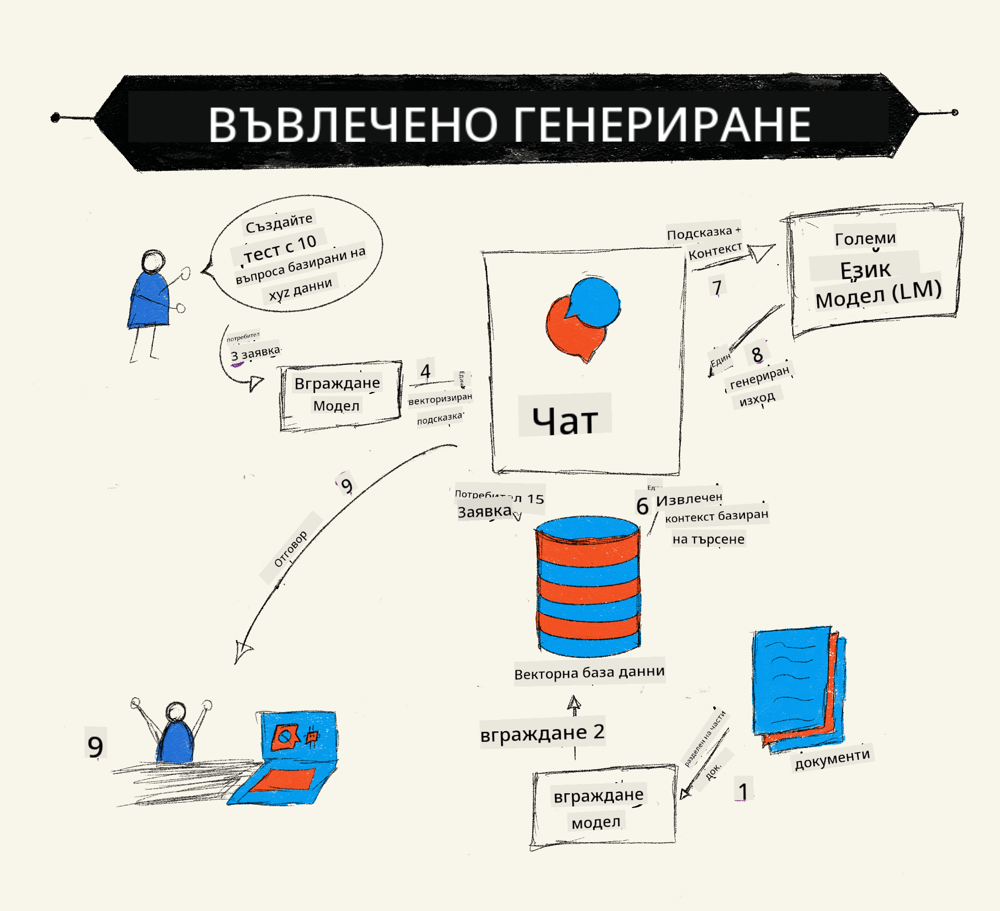
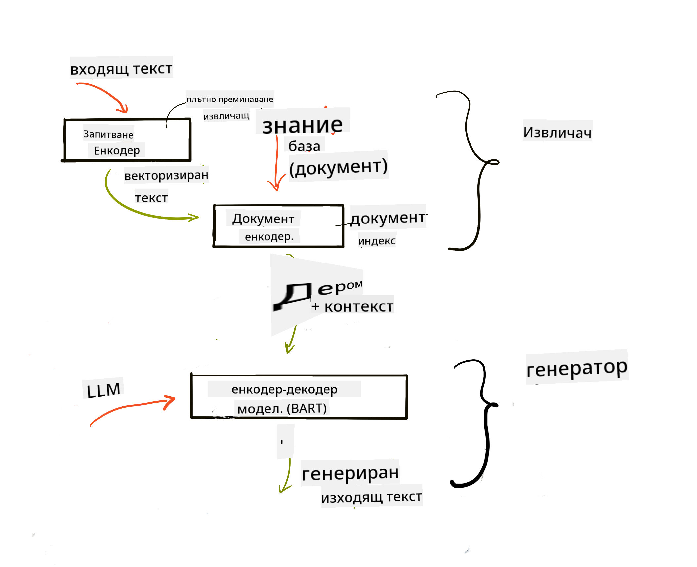
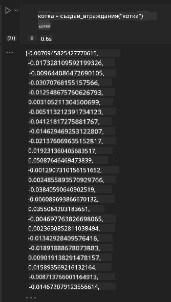

<!--
CO_OP_TRANSLATOR_METADATA:
{
  "original_hash": "e2861bbca91c0567ef32bc77fe054f9e",
  "translation_date": "2025-06-25T22:46:40+00:00",
  "source_file": "15-rag-and-vector-databases/README.md",
  "language_code": "bg"
}
-->
# Възстановяване с увеличено генериране (RAG) и векторни бази данни

[](https://aka.ms/gen-ai-lesson15-gh?WT.mc_id=academic-105485-koreyst)

В урока за приложения за търсене научихме накратко как да интегрирате вашите собствени данни в Големи езикови модели (LLMs). В този урок ще разгледаме по-дълбоко концепциите за основаване на вашите данни в приложението ви с LLM, механиката на процеса и методите за съхранение на данни, включително както вграждания, така и текст.

> **Видео скоро**

## Въведение

В този урок ще покрием следното:

- Въведение в RAG, какво е и защо се използва в изкуствения интелект (AI).

- Разбиране какво са векторните бази данни и създаване на такава за нашето приложение.

- Практически пример за интегриране на RAG в приложение.

## Цели на обучението

След завършване на този урок, ще можете:

- Да обясните значението на RAG в възстановяването и обработката на данни.

- Да настроите приложение с RAG и да основете данните си към LLM

- Ефективна интеграция на RAG и векторни бази данни в приложения с LLM.

## Нашият сценарий: подобряване на нашите LLM с нашите собствени данни

За този урок искаме да добавим нашите собствени бележки към образователния стартъп, което позволява на чатбота да получи повече информация за различните предмети. Използвайки бележките, които имаме, учащите ще могат да учат по-добре и да разбират различните теми, правейки ги по-лесни за преглед за изпитите си. За да създадем нашия сценарий, ще използваме:

- `Azure OpenAI:` LLM, който ще използваме за създаване на нашия чатбот

- `AI for beginners' lesson on Neural Networks`: това ще бъдат данните, на които ще основем нашия LLM

- `Azure AI Search` и `Azure Cosmos DB:` векторна база данни за съхранение на нашите данни и създаване на индекс за търсене

Потребителите ще могат да създават тренировъчни тестове от бележките си, карти за преглед и да ги обобщават в кратки прегледи. За да започнем, нека разгледаме какво е RAG и как работи:

## Възстановяване с увеличено генериране (RAG)

Чатбот, захранван от LLM, обработва потребителски запитвания, за да генерира отговори. Той е проектиран да бъде интерактивен и ангажира с потребителите по широк спектър от теми. Въпреки това, неговите отговори са ограничени до предоставения контекст и основните данни за обучение. Например, крайният срок за знанията на GPT-4 е септември 2021 г., което означава, че липсват знания за събития, настъпили след този период. Освен това, данните, използвани за обучение на LLM, изключват поверителна информация като лични бележки или ръководство за продукти на компания.

### Как работят RAGs (Възстановяване с увеличено генериране)



Да предположим, че искате да внедрите чатбот, който създава тестове от вашите бележки, ще ви е необходима връзка към базата знания. Тук идва на помощ RAG. RAGs работят по следния начин:

- **База знания:** Преди възстановяване, тези документи трябва да бъдат погълнати и предварително обработени, обикновено разбивайки големи документи на по-малки части, трансформирайки ги в текстово вграждане и съхранявайки ги в база данни.

- **Потребителско запитване:** потребителят задава въпрос

- **Възстановяване:** Когато потребителят зададе въпрос, моделът за вграждане възстановява релевантна информация от нашата база знания, за да предостави повече контекст, който ще бъде включен в запитването.

- **Увеличено генериране:** LLM подобрява своя отговор въз основа на възстановените данни. Това позволява генерираният отговор да бъде не само основан на предварително обучени данни, но и релевантна информация от добавения контекст. Възстановените данни се използват за увеличаване на отговорите на LLM. След това LLM връща отговор на въпроса на потребителя.



Архитектурата за RAGs се реализира с помощта на трансформатори, състоящи се от две части: енкодер и декодер. Например, когато потребителят задава въпрос, входният текст се 'кодира' във вектори, които улавят значението на думите, и векторите се 'декодират' в нашия индекс на документи и генерират нов текст въз основа на потребителското запитване. LLM използва както модел енкодер-декодер, за да генерира изхода.

Два подхода при внедряване на RAG според предложената статия: [Възстановяване с увеличено генериране за задачи на NLP (натурална езикова обработка)](https://arxiv.org/pdf/2005.11401.pdf?WT.mc_id=academic-105485-koreyst) са:

- **_RAG-Sequence_** използване на възстановени документи за предсказване на най-добрия възможен отговор на потребителското запитване

- **RAG-Token** използване на документи за генериране на следващия токен, след това възстановяването им за отговор на потребителското запитване

### Защо бихте използвали RAGs? 

- **Богатство на информация:** осигурява текстови отговори, които са актуални и съвременни. Следователно, подобрява производителността на задачи, специфични за домейн, чрез достъп до вътрешната база знания.

- Намалява фалшифицирането чрез използване на **проверими данни** в базата знания, за да предостави контекст на потребителските запитвания.

- Това е **икономически ефективно**, тъй като те са по-икономични в сравнение с фино настройване на LLM.

## Създаване на база знания

Нашето приложение се основава на нашите лични данни, т.е. урокът за невронни мрежи от учебната програма за AI за начинаещи.

### Векторни бази данни

Векторна база данни, за разлика от традиционните бази данни, е специализирана база данни, предназначена за съхранение, управление и търсене на вградени вектори. Тя съхранява числени представяния на документи. Разбиването на данни на числени вграждания улеснява нашата AI система да разбере и обработи данните.

Съхраняваме нашите вграждания във векторни бази данни, тъй като LLMs имат ограничение на броя на токените, които приемат като вход. Тъй като не можете да предадете цялото вграждане на LLM, ще трябва да ги разбивате на части и когато потребителят зададе въпрос, вгражданията, които най-много приличат на въпроса, ще бъдат върнати заедно със запитването. Разбиването също така намалява разходите за броя на токените, преминаващи през LLM.

Някои популярни векторни бази данни включват Azure Cosmos DB, Clarifyai, Pinecone, Chromadb, ScaNN, Qdrant и DeepLake. Можете да създадете модел Azure Cosmos DB, използвайки Azure CLI със следната команда:

```bash
az login
az group create -n <resource-group-name> -l <location>
az cosmosdb create -n <cosmos-db-name> -r <resource-group-name>
az cosmosdb list-keys -n <cosmos-db-name> -g <resource-group-name>
```

### От текст до вграждания

Преди да съхраним данните си, ще трябва да ги конвертираме във векторни вграждания, преди да бъдат съхранени в базата данни. Ако работите с големи документи или дълги текстове, можете да ги разбивате въз основа на запитвания, които очаквате. Разбиването може да се направи на ниво изречение или на ниво параграф. Тъй като разбиването извежда значения от думите около тях, можете да добавите някакъв друг контекст към част, например, като добавите заглавие на документ или включите някакъв текст преди или след частта. Можете да разбивате данните по следния начин:

```python
def split_text(text, max_length, min_length):
    words = text.split()
    chunks = []
    current_chunk = []

    for word in words:
        current_chunk.append(word)
        if len(' '.join(current_chunk)) < max_length and len(' '.join(current_chunk)) > min_length:
            chunks.append(' '.join(current_chunk))
            current_chunk = []

    # If the last chunk didn't reach the minimum length, add it anyway
    if current_chunk:
        chunks.append(' '.join(current_chunk))

    return chunks
```

След като бъдат разбити, можем да вградим нашия текст, използвайки различни модели за вграждане. Някои модели, които можете да използвате, включват: word2vec, ada-002 от OpenAI, Azure Computer Vision и много други. Изборът на модел за използване ще зависи от езиците, които използвате, типа на съдържанието, което се кодира (текст/изображения/аудио), размера на входа, който може да кодира и дължината на вграждането.

Пример за вграден текст, използвайки модела `text-embedding-ada-002` на OpenAI, е:


## Възстановяване и векторно търсене

Когато потребителят зададе въпрос, възстановителят го трансформира във вектор, използвайки кодиращия запитванията, след това търси през нашия индекс за търсене на документи за релевантни вектори в документа, които са свързани с входа. След като бъде направено, той конвертира както входния вектор, така и документните вектори в текст и ги предава през LLM.

### Възстановяване

Възстановяването се случва, когато системата се опитва бързо да намери документите от индекса, които отговарят на критериите за търсене. Целта на възстановителя е да получи документи, които ще бъдат използвани за предоставяне на контекст и основаване на LLM на вашите данни.

Има няколко начина за извършване на търсене в нашата база данни, като например:

- **Търсене по ключови думи** - използвано за текстови търсения

- **Семантично търсене** - използва семантичното значение на думите

- **Векторно търсене** - конвертира документи от текст в векторни представяния, използвайки модели за вграждане. Възстановяването ще бъде направено чрез запитване на документи, чиито векторни представяния са най-близки до потребителския въпрос.

- **Хибридно** - комбинация от търсене по ключови думи и векторно търсене.

Предизвикателство при възстановяването възниква, когато няма подобен отговор на запитването в базата данни, системата ще върне най-добрата информация, която може да получи, но можете да използвате тактики като задаване на максимално разстояние за релевантност или използване на хибридно търсене, което комбинира както ключови думи, така и векторно търсене. В този урок ще използваме хибридно търсене, комбинация от векторно и търсене по ключови думи. Ще съхраним нашите данни в датафрейм с колони, съдържащи частите, както и вграждания.

### Векторна сходност

Възстановителят ще търси през базата знания за вграждания, които са близо един до друг, най-близкия съсед, тъй като те са текстове, които са подобни. В случай, че потребителят зададе запитване, то първо се вгражда, след това се съпоставя с подобни вграждания. Общото измерване, което се използва, за да се определи колко подобни са различни вектори, е косинусната сходност, която се основава на ъгъла между два вектора.

Можем да измерим сходността, използвайки други алтернативи като Евклидово разстояние, което е правата линия между крайни точки на вектори и точков продукт, който измерва сумата от продуктите на съответстващите елементи на два вектора.

### Индекс за търсене

При извършване на възстановяване ще трябва да създадем индекс за търсене за нашата база знания, преди да извършим търсене. Индексът ще съхранява нашите вграждания и може бързо да възстанови най-подобните части, дори в голяма база данни. Можем да създадем нашия индекс локално, използвайки:

```python
from sklearn.neighbors import NearestNeighbors

embeddings = flattened_df['embeddings'].to_list()

# Create the search index
nbrs = NearestNeighbors(n_neighbors=5, algorithm='ball_tree').fit(embeddings)

# To query the index, you can use the kneighbors method
distances, indices = nbrs.kneighbors(embeddings)
```

### Пренареждане

След като сте запитали базата данни, може да се наложи да сортирате резултатите от най-релевантните. Пренареждащ LLM използва Машинно обучение, за да подобри релевантността на резултатите от търсенето, като ги подрежда от най-релевантните. Използвайки Azure AI Search, пренареждането се извършва автоматично за вас, използвайки семантичен пренареждач. Пример за това как работи пренареждането, използвайки най-близки съседи:

```python
# Find the most similar documents
distances, indices = nbrs.kneighbors([query_vector])

index = []
# Print the most similar documents
for i in range(3):
    index = indices[0][i]
    for index in indices[0]:
        print(flattened_df['chunks'].iloc[index])
        print(flattened_df['path'].iloc[index])
        print(flattened_df['distances'].iloc[index])
    else:
        print(f"Index {index} not found in DataFrame")
```

## Събиране на всичко заедно

Последната стъпка е добавянето на нашия LLM към сместа, за да можем да получим отговори, които са основани на нашите данни. Можем да го внедрим по следния начин:

```python
user_input = "what is a perceptron?"

def chatbot(user_input):
    # Convert the question to a query vector
    query_vector = create_embeddings(user_input)

    # Find the most similar documents
    distances, indices = nbrs.kneighbors([query_vector])

    # add documents to query  to provide context
    history = []
    for index in indices[0]:
        history.append(flattened_df['chunks'].iloc[index])

    # combine the history and the user input
    history.append(user_input)

    # create a message object
    messages=[
        {"role": "system", "content": "You are an AI assistant that helps with AI questions."},
        {"role": "user", "content": history[-1]}
    ]

    # use chat completion to generate a response
    response = openai.chat.completions.create(
        model="gpt-4",
        temperature=0.7,
        max_tokens=800,
        messages=messages
    )

    return response.choices[0].message

chatbot(user_input)
```

## Оценка на нашето приложение

### Метрики за оценка

- Качество на предоставените отговори, осигурявайки че звучат естествено, гладко и човешки

- Основаност на данните: оценка дали отговорът идва от предоставените документи

- Релевантност: оценка дали отговорът съответства и е свързан с зададения въпрос

- Гладкост - дали отговорът има смисъл граматически

## Приложения за използване на RAG (Възстановяване с увеличено генериране) и векторни бази данни

Има много различни приложения, където извикванията на функции могат да подобрят вашето приложение като:

- Въпроси и отговори: основаване на данните на вашата компания към чат, който може да се използва от служители за задаване на въпроси.

- Системи за препоръки: където можете да създадете система, която съпоставя най-подобните стойности, напр. филми, ресторанти и много други.

- Услуги за чатботи: можете да съхранявате история на чата и да персонализирате разговора въз основа на потребителските данни.

- Търсене на изображения въз основа на векторни вграждания, полезно при разпознаване на изображения и откриване на аномалии.

## Резюме

Покрихме основните области на RAG от добавянето на нашите данни към приложението, потребителското запитване и изхода. За да опростите създаването на RAG, можете да използвате рамки като Semanti Kernel, Langchain или Autogen.

## Задание

За да продължите обучението си по Възстановяване с увеличено генериране (RAG) можете да създадете:

- Създайте преден край за приложението, използвайки рамката по ваш избор

- Използвайте рамка, или LangChain или Semantic Kernel, и възпроизведете вашето приложение.

Поздравления за завършването на урока 👏.

## Обучението не спира тук, продължете пътуването

След завършване на този урок, разгледайте нашата [Колекция за обучение по генеративен AI](https://aka.ms/genai-collection?WT.mc_id=academic-105485-koreyst), за да продължите да усъвършенствате знанията

**Отказ от отговорност**:
Този документ е преведен с помощта на AI услуга за превод [Co-op Translator](https://github.com/Azure/co-op-translator). Въпреки че се стремим към точност, моля, имайте предвид, че автоматичните преводи може да съдържат грешки или неточности. Оригиналният документ на неговия роден език трябва да се счита за авторитетен източник. За критична информация се препоръчва професионален човешки превод. Не носим отговорност за каквито и да е недоразумения или неправилни тълкувания, произтичащи от използването на този превод.