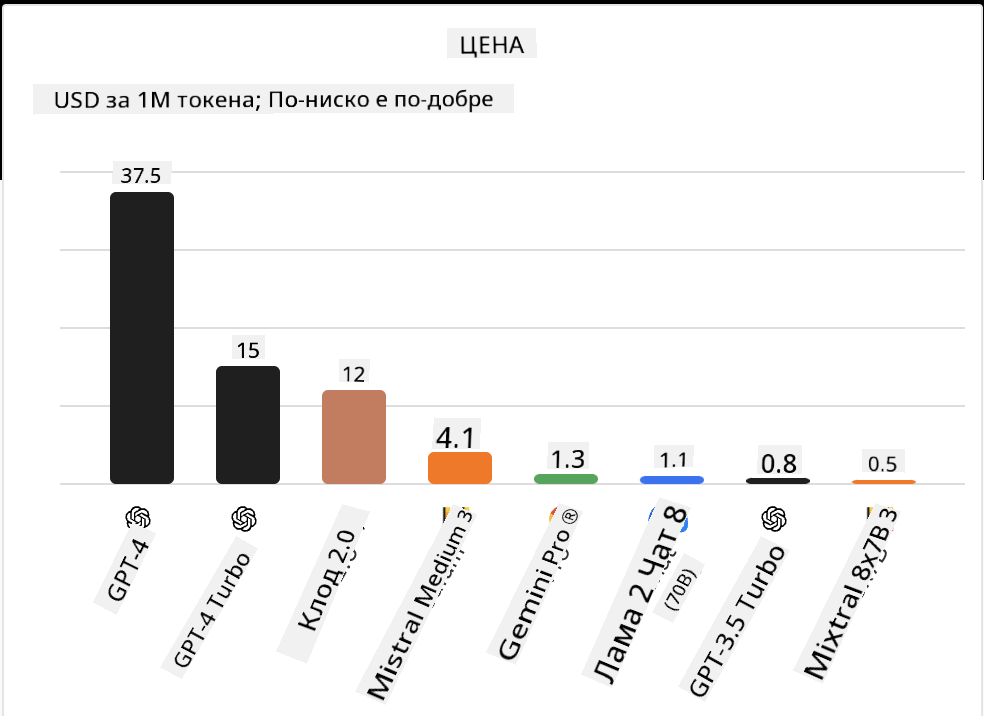
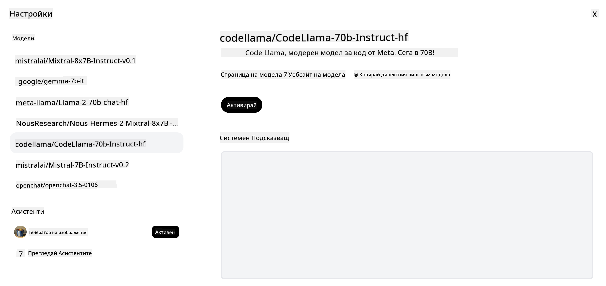

<!--
CO_OP_TRANSLATOR_METADATA:
{
  "original_hash": "0bba96e53ab841d99db731892a51fab8",
  "translation_date": "2025-05-20T07:04:08+00:00",
  "source_file": "16-open-source-models/README.md",
  "language_code": "bg"
}
-->

## Въведение

Светът на отворените LLM модели е вълнуващ и постоянно се развива. Този урок има за цел да предостави задълбочен поглед върху отворените модели. Ако търсите информация за това как се сравняват патентованите модели с отворените модели, отидете на урока ["Изследване и сравняване на различни LLM модели"](../02-exploring-and-comparing-different-llms/README.md?WT.mc_id=academic-105485-koreyst). Този урок също ще обхване темата за фино настройване, но по-подробно обяснение може да бъде намерено в урока ["Фино настройване на LLM модели"](../18-fine-tuning/README.md?WT.mc_id=academic-105485-koreyst).

## Цели на обучението

- Получаване на разбиране за отворените модели
- Разбиране на ползите от работата с отворени модели
- Изследване на наличните отворени модели в Hugging Face и Azure AI Studio

## Какво представляват отворените модели?

Отвореният софтуер играе ключова роля в растежа на технологиите в различни области. Инициативата за отворен код (OSI) е определила [10 критерия за софтуер](https://web.archive.org/web/20241126001143/https://opensource.org/osd?WT.mc_id=academic-105485-koreyst), за да бъде класифициран като отворен. Изходният код трябва да бъде открито споделен под лиценз, одобрен от OSI.

Докато разработването на LLM модели има подобни елементи с разработването на софтуер, процесът не е точно същият. Това предизвика много дискусии в общността относно дефиницията на отворен код в контекста на LLM модели. За да бъде един модел съобразен с традиционната дефиниция на отворен код, следната информация трябва да бъде публично достъпна:

- Данните, използвани за обучение на модела.
- Пълни тегла на модела като част от обучението.
- Кодът за оценка.
- Кодът за фино настройване.
- Пълни тегла на модела и метрики за обучение.

Понастоящем има само няколко модела, които отговарят на тези критерии. [Моделът OLMo, създаден от Allen Institute for Artificial Intelligence (AllenAI)](https://huggingface.co/allenai/OLMo-7B?WT.mc_id=academic-105485-koreyst) е един от тях.

За целите на този урок, ще наричаме моделите "отворени модели", тъй като те може да не отговарят на горепосочените критерии към момента на писане.

## Ползи от отворените модели

**Висока персонализация** - Тъй като отворените модели са пуснати с подробна информация за обучението, изследователите и разработчиците могат да модифицират вътрешността на модела. Това позволява създаването на силно специализирани модели, които са фино настроени за конкретна задача или област на изследване. Някои примери за това са генериране на код, математически операции и биология.

**Цена** - Цената на токен за използване и внедряване на тези модели е по-ниска от тази на патентованите модели. Когато изграждате приложения за генерираща AI, трябва да се разглежда производителността спрямо цената при работа с тези модели за вашия случай на употреба.

 Източник: Artificial Analysis

**Гъвкавост** - Работата с отворени модели ви позволява да бъдете гъвкави по отношение на използването на различни модели или комбинирането им. Пример за това е [HuggingChat Assistants](https://huggingface.co/chat?WT.mc_id=academic-105485-koreyst), където потребителят може да избере модела, който се използва директно в потребителския интерфейс:

## Изследване на различни отворени модели

### Llama 2

[LLama2](https://huggingface.co/meta-llama?WT.mc_id=academic-105485-koreyst), разработен от Meta, е отворен модел, който е оптимизиран за чат приложения. Това се дължи на метода му за фино настройване, който включва голямо количество диалог и обратна връзка от хора. С този метод моделът произвежда повече резултати, които са съобразени с очакванията на хората, което осигурява по-добро потребителско изживяване.

Някои примери за фино настроени версии на Llama включват [Japanese Llama](https://huggingface.co/elyza/ELYZA-japanese-Llama-2-7b?WT.mc_id=academic-105485-koreyst), който се специализира в японски, и [Llama Pro](https://huggingface.co/TencentARC/LLaMA-Pro-8B?WT.mc_id=academic-105485-koreyst), който е подобрена версия на базовия модел.

### Mistral

[Mistral](https://huggingface.co/mistralai?WT.mc_id=academic-105485-koreyst) е отворен модел със силен фокус върху високата производителност и ефективност. Той използва подхода Mixture-of-Experts, който комбинира група от специализирани експертни модели в една система, където в зависимост от входа, определени модели се избират за използване. Това прави изчисленията по-ефективни, тъй като моделите се занимават само с входовете, в които са специализирани.

Някои примери за фино настроени версии на Mistral включват [BioMistral](https://huggingface.co/BioMistral/BioMistral-7B?text=Mon+nom+est+Thomas+et+mon+principal?WT.mc_id=academic-105485-koreyst), който е фокусиран върху медицинската област, и [OpenMath Mistral](https://huggingface.co/nvidia/OpenMath-Mistral-7B-v0.1-hf?WT.mc_id=academic-105485-koreyst), който извършва математически изчисления.

### Falcon

[Falcon](https://huggingface.co/tiiuae?WT.mc_id=academic-105485-koreyst) е LLM, създаден от Института за технологични иновации (**TII**). Falcon-40B е обучен върху 40 милиарда параметъра, което се оказва по-добро от GPT-3 с по-малък бюджет за изчисления. Това се дължи на използването на алгоритъма FlashAttention и много-заявъчно внимание, което му позволява да намали изискванията за памет по време на извод. С този намален изводен време, Falcon-40B е подходящ за чат приложения.

Някои примери за фино настроени версии на Falcon са [OpenAssistant](https://huggingface.co/OpenAssistant/falcon-40b-sft-top1-560?WT.mc_id=academic-105485-koreyst), асистент, изграден на базата на отворени модели, и [GPT4ALL](https://huggingface.co/nomic-ai/gpt4all-falcon?WT.mc_id=academic-105485-koreyst), който предоставя по-висока производителност от базовия модел.

## Как да изберем

Няма един отговор за избора на отворен модел. Добро място за начало е използването на функцията за филтриране по задача в Azure AI Studio. Това ще ви помогне да разберете за какви видове задачи е обучен моделът. Hugging Face също поддържа лидерборд за LLM, който ви показва най-добре представящите се модели въз основа на определени метрики.

Когато искате да сравнявате LLM модели в различни типове, [Artificial Analysis](https://artificialanalysis.ai/?WT.mc_id=academic-105485-koreyst) е друг страхотен ресурс:

 Източник: Artifical Analysis

Ако работите по специфичен случай на употреба, търсенето на фино настроени версии, които са фокусирани върху същата област, може да бъде ефективно. Експериментирането с множество отворени модели, за да видите как се представят според вашите и на потребителите ви очаквания, е друга добра практика.

## Следващи стъпки

Най-хубавото на отворените модели е, че можете да започнете да работите с тях доста бързо. Вижте [Azure AI Studio Model Catalog](https://ai.azure.com?WT.mc_id=academic-105485-koreyst), който включва специфична колекция от Hugging Face с тези модели, които обсъдихме тук.

## Обучението не спира тук, продължете пътуването

След завършване на този урок, разгледайте нашата [Колекция за обучение по генерираща AI](https://aka.ms/genai-collection?WT.mc_id=academic-105485-koreyst), за да продължите да повишавате знанията си за генерираща AI!

**Отказ от отговорност**:  
Този документ е преведен с помощта на AI услуга за превод [Co-op Translator](https://github.com/Azure/co-op-translator). Въпреки че се стремим към точност, моля, имайте предвид, че автоматизираните преводи могат да съдържат грешки или неточности. Оригиналният документ на неговия роден език трябва да се счита за авторитетен източник. За критична информация се препоръчва професионален човешки превод. Не носим отговорност за каквито и да е недоразумения или погрешни тълкувания, произтичащи от използването на този превод.