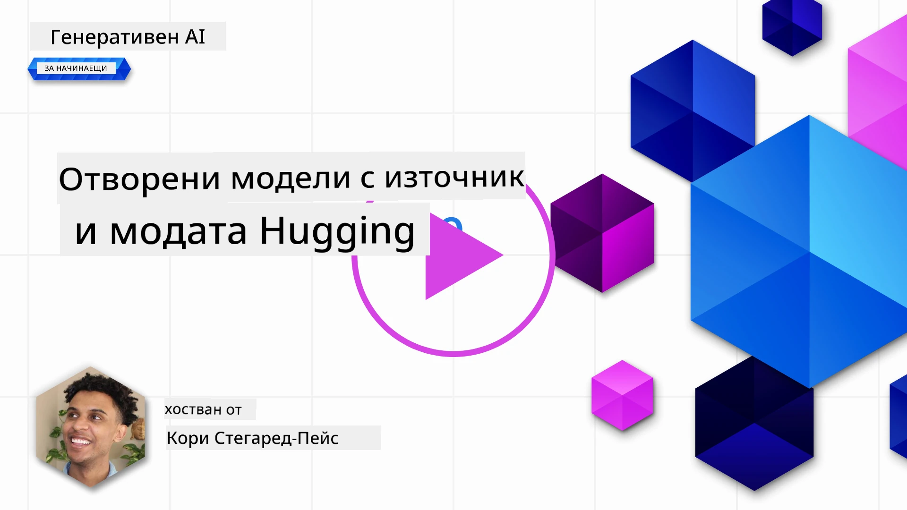
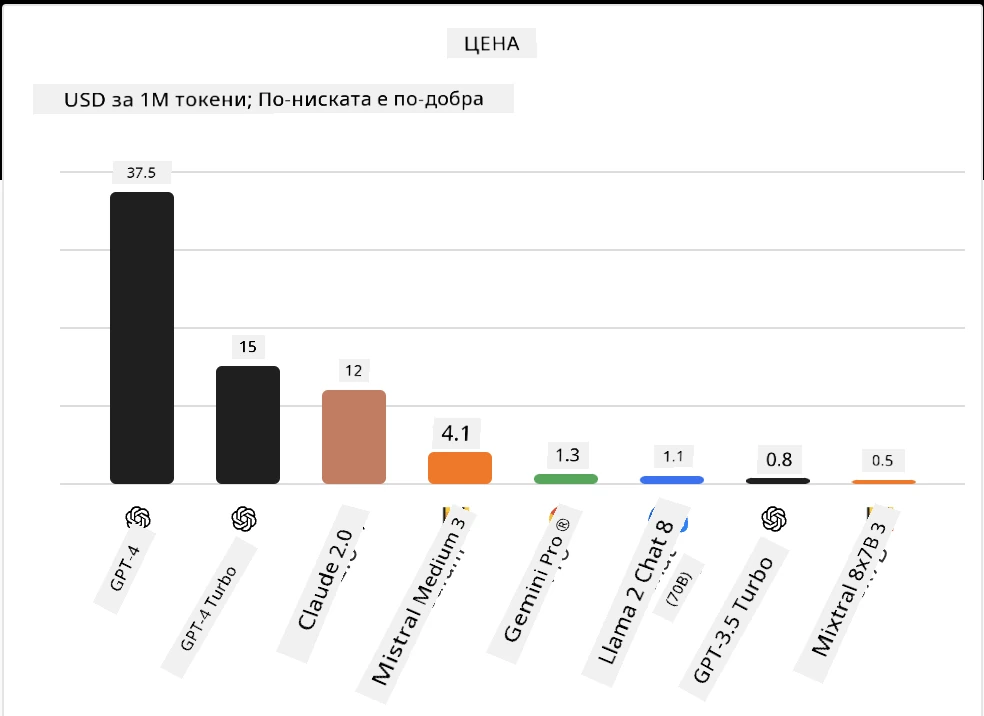
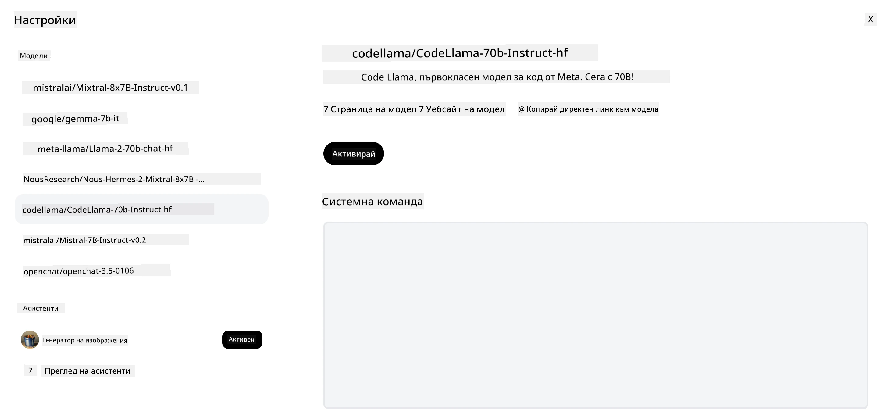
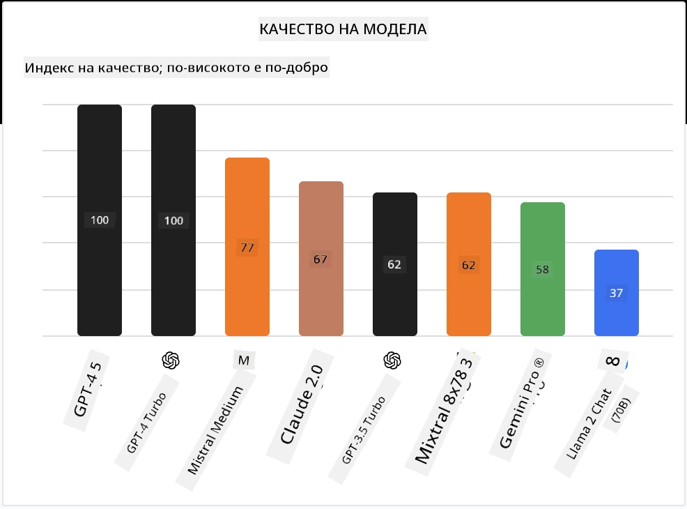

<!--
CO_OP_TRANSLATOR_METADATA:
{
  "original_hash": "85b754d4dc980f270f264d17116d9a5f",
  "translation_date": "2025-12-19T17:06:33+00:00",
  "source_file": "16-open-source-models/README.md",
  "language_code": "bg"
}
-->

## Въведение

Светът на отворените LLM е вълнуващ и постоянно се развива. Този урок има за цел да предостави задълбочен поглед върху отворените модели. Ако търсите информация за това как собствени модели се сравняват с отворените модели, отидете на урока ["Изследване и сравнение на различни LLM"](../02-exploring-and-comparing-different-llms/README.md?WT.mc_id=academic-105485-koreyst). Този урок също ще разгледа темата за финото настройване, но по-подробно обяснение може да намерите в урока ["Фино настройване на LLM"](../18-fine-tuning/README.md?WT.mc_id=academic-105485-koreyst).

## Цели на обучението

- Да се придобие разбиране за отворените модели
- Разбиране на ползите от работата с отворени модели
- Изследване на отворените модели, налични в Hugging Face и Azure AI Studio

## Какво са отворени модели?

Отвореният софтуер играе ключова роля в развитието на технологиите в различни области. Инициативата за отворен код (OSI) е дефинирала [10 критерия за софтуер](https://web.archive.org/web/20241126001143/https://opensource.org/osd?WT.mc_id=academic-105485-koreyst), за да бъде класифициран като отворен код. Изходният код трябва да бъде открито споделен под лиценз, одобрен от OSI.

Въпреки че разработката на LLM има сходни елементи с разработката на софтуер, процесът не е точно същият. Това е довело до много дискусии в общността относно дефиницията на отворен код в контекста на LLM. За да съответства моделът на традиционната дефиниция за отворен код, следната информация трябва да бъде публично достъпна:

- Данните, използвани за обучение на модела.
- Пълните тегла на модела като част от обучението.
- Кодът за оценка.
- Кодът за фино настройване.
- Пълните тегла на модела и метриките от обучението.

В момента има само няколко модела, които отговарят на тези критерии. [OLMo моделът, създаден от Allen Institute for Artificial Intelligence (AllenAI)](https://huggingface.co/allenai/OLMo-7B?WT.mc_id=academic-105485-koreyst) е един от тях.

За този урок ще се отнасяме към моделите като "отворени модели", тъй като те може да не отговарят на горните критерии към момента на писане.

## Ползи от отворените модели

**Висока персонализация** - Тъй като отворените модели се пускат с подробна информация за обучението, изследователите и разработчиците могат да модифицират вътрешностите на модела. Това позволява създаването на силно специализирани модели, които са фино настроени за конкретна задача или област на изследване. Някои примери за това са генериране на код, математически операции и биология.

**Цена** - Цената на токен за използване и внедряване на тези модели е по-ниска в сравнение със собствени модели. При изграждане на генеративни AI приложения, трябва да се разгледа съотношението производителност към цена при работа с тези модели за вашия конкретен случай.

Източник: Artificial Analysis

**Гъвкавост** - Работата с отворени модели ви позволява да бъдете гъвкави по отношение на използването на различни модели или комбинирането им. Пример за това са [HuggingChat асистентите](https://huggingface.co/chat?WT.mc_id=academic-105485-koreyst), където потребителят може да избере модела, който се използва директно в потребителския интерфейс:

## Изследване на различни отворени модели

### Llama 2

[LLama2](https://huggingface.co/meta-llama?WT.mc_id=academic-105485-koreyst), разработен от Meta, е отворен модел, оптимизиран за чат базирани приложения. Това се дължи на метода му на фино настройване, който включва голямо количество диалог и човешка обратна връзка. С този метод моделът произвежда повече резултати, съобразени с човешките очаквания, което осигурява по-добро потребителско изживяване.

Някои примери за фино настроени версии на Llama включват [Japanese Llama](https://huggingface.co/elyza/ELYZA-japanese-Llama-2-7b?WT.mc_id=academic-105485-koreyst), който е специализиран в японски език, и [Llama Pro](https://huggingface.co/TencentARC/LLaMA-Pro-8B?WT.mc_id=academic-105485-koreyst), който е подобрена версия на базовия модел.

### Mistral

[Mistral](https://huggingface.co/mistralai?WT.mc_id=academic-105485-koreyst) е отворен модел с голям акцент върху висока производителност и ефективност. Той използва подхода Mixture-of-Experts, който комбинира група специализирани експертни модели в една система, където в зависимост от входа се избират определени модели за използване. Това прави изчисленията по-ефективни, тъй като моделите адресират само входовете, в които са специализирани.

Някои примери за фино настроени версии на Mistral включват [BioMistral](https://huggingface.co/BioMistral/BioMistral-7B?text=Mon+nom+est+Thomas+et+mon+principal?WT.mc_id=academic-105485-koreyst), който е фокусиран върху медицинската област, и [OpenMath Mistral](https://huggingface.co/nvidia/OpenMath-Mistral-7B-v0.1-hf?WT.mc_id=academic-105485-koreyst), който извършва математически изчисления.

### Falcon

[Falcon](https://huggingface.co/tiiuae?WT.mc_id=academic-105485-koreyst) е LLM, създаден от Technology Innovation Institute (**TII**). Falcon-40B е обучен на 40 милиарда параметри и е показал по-добра производителност от GPT-3 с по-малък бюджет за изчисления. Това се дължи на използването на алгоритъма FlashAttention и multiquery attention, които намаляват изискванията за памет по време на извеждане. С този намален време за извеждане, Falcon-40B е подходящ за чат приложения.

Някои примери за фино настроени версии на Falcon са [OpenAssistant](https://huggingface.co/OpenAssistant/falcon-40b-sft-top1-560?WT.mc_id=academic-105485-koreyst), асистент, базиран на отворени модели, и [GPT4ALL](https://huggingface.co/nomic-ai/gpt4all-falcon?WT.mc_id=academic-105485-koreyst), който осигурява по-висока производителност от базовия модел.

## Как да изберем

Няма единствен отговор при избора на отворен модел. Добро начало е да използвате функцията за филтриране по задача в Azure AI Studio. Това ще ви помогне да разберете за какви типове задачи е обучен моделът. Hugging Face също поддържа LLM класация, която показва най-добре представящите се модели според определени метрики.

При сравняване на LLM от различни типове, [Artificial Analysis](https://artificialanalysis.ai/?WT.mc_id=academic-105485-koreyst) е още един отличен ресурс:

Източник: Artificial Analysis

Ако работите по конкретен случай, търсенето на фино настроени версии, фокусирани върху същата област, може да бъде ефективно. Експериментирането с няколко отворени модела, за да видите как се представят според вашите и очакванията на потребителите, е друга добра практика.

## Следващи стъпки

Най-хубавото при отворените модели е, че можете да започнете да работите с тях доста бързо. Разгледайте [Azure AI Foundry Model Catalog](https://ai.azure.com?WT.mc_id=academic-105485-koreyst), който включва специална колекция от Hugging Face с тези модели, които обсъдихме тук.

## Обучението не спира тук, продължете пътешествието

След като завършите този урок, разгледайте нашата [колекция за обучение по генеративен AI](https://aka.ms/genai-collection?WT.mc_id=academic-105485-koreyst), за да продължите да развивате знанията си в областта на генеративния AI!

---

<!-- CO-OP TRANSLATOR DISCLAIMER START -->
**Отказ от отговорност**:
Този документ е преведен с помощта на AI преводаческа услуга [Co-op Translator](https://github.com/Azure/co-op-translator). Въпреки че се стремим към точност, моля, имайте предвид, че автоматизираните преводи могат да съдържат грешки или неточности. Оригиналният документ на неговия роден език трябва да се счита за авторитетен източник. За критична информация се препоръчва професионален човешки превод. Ние не носим отговорност за каквито и да е недоразумения или неправилни тълкувания, произтичащи от използването на този превод.
<!-- CO-OP TRANSLATOR DISCLAIMER END -->