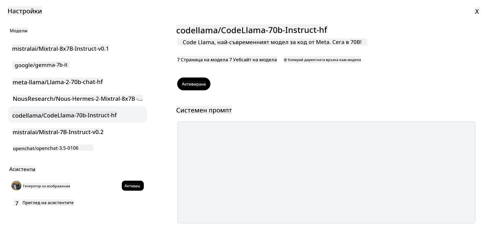

<!--
CO_OP_TRANSLATOR_METADATA:
{
  "original_hash": "0bba96e53ab841d99db731892a51fab8",
  "translation_date": "2025-07-09T17:15:09+00:00",
  "source_file": "16-open-source-models/README.md",
  "language_code": "bg"
}
-->

## Въведение

Светът на отворените LLM модели е вълнуващ и постоянно се развива. Този урок има за цел да предостави задълбочен поглед върху отворените модели. Ако търсите информация за това как собствени модели се сравняват с отворените, посетете урока ["Exploring and Comparing Different LLMs"](../02-exploring-and-comparing-different-llms/README.md?WT.mc_id=academic-105485-koreyst). Този урок също ще разгледа темата за финото настройване, но по-подробно обяснение може да намерите в урока ["Fine-Tuning LLMs"](../18-fine-tuning/README.md?WT.mc_id=academic-105485-koreyst).

## Цели на обучението

- Да придобиете разбиране за отворените модели  
- Да разберете ползите от работата с отворени модели  
- Да разгледате наличните отворени модели в Hugging Face и Azure AI Studio  

## Какво са отворени модели?

Отвореният софтуер играе ключова роля в развитието на технологиите в различни области. Open Source Initiative (OSI) е дефинирала [10 критерия за софтуер](https://web.archive.org/web/20241126001143/https://opensource.org/osd?WT.mc_id=academic-105485-koreyst), за да бъде класифициран като отворен. Изходният код трябва да бъде публично споделен под лиценз, одобрен от OSI.

Въпреки че разработката на LLM модели има сходни елементи с разработката на софтуер, процесът не е напълно идентичен. Това предизвика много дискусии в общността относно дефиницията на отворен код в контекста на LLM. За да отговаря един модел на традиционната дефиниция за отворен код, следната информация трябва да е публично достъпна:

- Данните, използвани за обучението на модела  
- Пълните тегла на модела като част от обучението  
- Кодът за оценка  
- Кодът за фино настройване  
- Пълните тегла на модела и метриките от обучението  

В момента има само няколко модела, които отговарят на тези критерии. [OLMo моделът, създаден от Allen Institute for Artificial Intelligence (AllenAI)](https://huggingface.co/allenai/OLMo-7B?WT.mc_id=academic-105485-koreyst) е един от тях.

В този урок ще използваме термина "отворени модели", тъй като те може да не отговарят напълно на горните критерии към момента на писане.

## Ползи от отворените модели

**Висока степен на персонализация** – Тъй като отворените модели се предоставят с подробна информация за обучението, изследователи и разработчици могат да модифицират вътрешната структура на модела. Това позволява създаването на силно специализирани модели, фино настроени за конкретна задача или област на изследване. Примери за това са генериране на код, математически операции и биология.

**Цена** – Цената на токен при използване и внедряване на тези модели е по-ниска в сравнение със собствени модели. При изграждане на генеративни AI приложения е важно да се направи оценка на съотношението производителност/цена за конкретния случай на употреба.

  
Източник: Artificial Analysis

**Гъвкавост** – Работата с отворени модели ви дава възможност да бъдете гъвкави при използването на различни модели или тяхното комбиниране. Пример за това са [HuggingChat Assistants](https://huggingface.co/chat?WT.mc_id=academic-105485-koreyst), където потребителят може да избира модела директно в потребителския интерфейс:

## Разглеждане на различни отворени модели

### Llama 2

[LLama2](https://huggingface.co/meta-llama?WT.mc_id=academic-105485-koreyst), разработен от Meta, е отворен модел, оптимизиран за чат приложения. Това се дължи на метода му на фино настройване, който включва голямо количество диалози и човешка обратна връзка. Този подход позволява моделът да генерира резултати, по-близки до човешките очаквания, което подобрява потребителското изживяване.

Някои примери за фино настроени версии на Llama са [Japanese Llama](https://huggingface.co/elyza/ELYZA-japanese-Llama-2-7b?WT.mc_id=academic-105485-koreyst), специализиран в японски език, и [Llama Pro](https://huggingface.co/TencentARC/LLaMA-Pro-8B?WT.mc_id=academic-105485-koreyst), подобрена версия на базовия модел.

### Mistral

[Mistral](https://huggingface.co/mistralai?WT.mc_id=academic-105485-koreyst) е отворен модел с акцент върху висока производителност и ефективност. Той използва подхода Mixture-of-Experts, който комбинира група специализирани експертни модели в една система, където в зависимост от входа се избират определени модели за използване. Това прави изчисленията по-ефективни, тъй като моделите обработват само входовете, в които са специализирани.

Някои примери за фино настроени версии на Mistral са [BioMistral](https://huggingface.co/BioMistral/BioMistral-7B?text=Mon+nom+est+Thomas+et+mon+principal?WT.mc_id=academic-105485-koreyst), фокусиран върху медицинската област, и [OpenMath Mistral](https://huggingface.co/nvidia/OpenMath-Mistral-7B-v0.1-hf?WT.mc_id=academic-105485-koreyst), който изпълнява математически изчисления.

### Falcon

[Falcon](https://huggingface.co/tiiuae?WT.mc_id=academic-105485-koreyst) е LLM, създаден от Technology Innovation Institute (**TII**). Falcon-40B е обучен на 40 милиарда параметри и е показал по-добра производителност от GPT-3 с по-малък изчислителен бюджет. Това се дължи на използването на алгоритъма FlashAttention и multiquery attention, които намаляват изискванията за памет по време на извеждане. С намаленото време за извеждане Falcon-40B е подходящ за чат приложения.

Някои примери за фино настроени версии на Falcon са [OpenAssistant](https://huggingface.co/OpenAssistant/falcon-40b-sft-top1-560?WT.mc_id=academic-105485-koreyst), асистент, базиран на отворени модели, и [GPT4ALL](https://huggingface.co/nomic-ai/gpt4all-falcon?WT.mc_id=academic-105485-koreyst), който предлага по-висока производителност от базовия модел.

## Как да изберем

Няма единствен отговор при избора на отворен модел. Добро начало е да използвате филтъра по задача в Azure AI Studio. Това ще ви помогне да разберете за какви типове задачи е обучен моделът. Hugging Face също поддържа LLM Leaderboard, който показва най-добре представящите се модели според определени метрики.

При сравняване на LLM модели от различни типове, [Artificial Analysis](https://artificialanalysis.ai/?WT.mc_id=academic-105485-koreyst) е още един полезен ресурс:

  
Източник: Artificial Analysis

Ако работите по конкретен случай на употреба, търсенето на фино настроени версии, фокусирани върху същата област, може да бъде ефективно. Експериментирането с няколко отворени модела, за да видите как се представят според вашите и потребителските очаквания, също е добра практика.

## Следващи стъпки

Най-хубавото при отворените модели е, че можете да започнете да работите с тях много бързо. Разгледайте [Azure AI Studio Model Catalog](https://ai.azure.com?WT.mc_id=academic-105485-koreyst), който включва специална колекция от Hugging Face с моделите, които обсъдихме тук.

## Обучението не спира тук, продължете пътешествието

След като завършите този урок, разгледайте нашата [Generative AI Learning collection](https://aka.ms/genai-collection?WT.mc_id=academic-105485-koreyst), за да продължите да развивате знанията си в областта на генеративния AI!

**Отказ от отговорност**:  
Този документ е преведен с помощта на AI преводаческа услуга [Co-op Translator](https://github.com/Azure/co-op-translator). Въпреки че се стремим към точност, моля, имайте предвид, че автоматизираните преводи могат да съдържат грешки или неточности. Оригиналният документ на неговия роден език трябва да се счита за авторитетен източник. За критична информация се препоръчва професионален човешки превод. Ние не носим отговорност за каквито и да е недоразумения или неправилни тълкувания, произтичащи от използването на този превод.