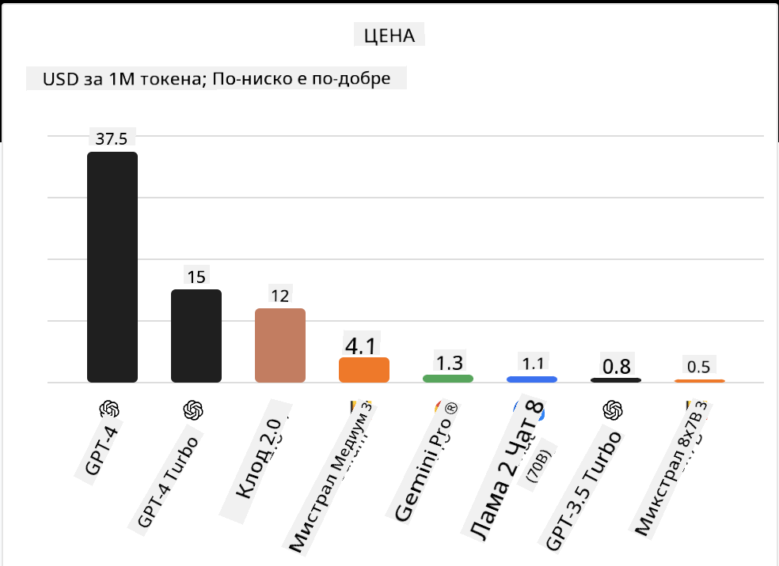
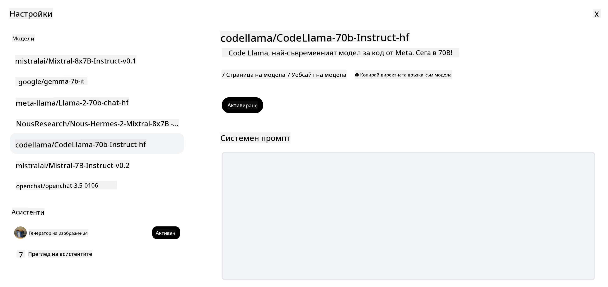

<!--
CO_OP_TRANSLATOR_METADATA:
{
  "original_hash": "0bba96e53ab841d99db731892a51fab8",
  "translation_date": "2025-06-26T00:04:12+00:00",
  "source_file": "16-open-source-models/README.md",
  "language_code": "bg"
}
-->

## Въведение

Светът на LLMs с отворен код е вълнуващ и постоянно се развива. Тази лекция има за цел да предостави задълбочен поглед върху моделите с отворен код. Ако търсите информация за това как се сравняват моделите с отворен код с проприетарните модели, преминете към урока ["Изследване и сравняване на различни LLMs"](../02-exploring-and-comparing-different-llms/README.md?WT.mc_id=academic-105485-koreyst). Тази лекция ще обхване и темата за фина настройка, но по-подробно обяснение може да се намери в урока ["Фина настройка на LLMs"](../18-fine-tuning/README.md?WT.mc_id=academic-105485-koreyst).

## Цели на обучението

- Получаване на разбиране за модели с отворен код
- Разбиране на предимствата от работата с модели с отворен код
- Изследване на наличните отворени модели в Hugging Face и Azure AI Studio

## Какво представляват моделите с отворен код?

Софтуерът с отворен код играе ключова роля в растежа на технологиите в различни области. Инициативата за отворен код (OSI) е дефинирала [10 критерия за софтуер](https://web.archive.org/web/20241126001143/https://opensource.org/osd?WT.mc_id=academic-105485-koreyst), за да бъде класифициран като отворен код. Изходният код трябва да бъде споделен открито под лиценз, одобрен от OSI.

Докато разработката на LLMs има подобни елементи на разработката на софтуер, процесът не е точно същият. Това е предизвикало много дискусии в общността относно дефиницията на отворен код в контекста на LLMs. За да бъде моделът в съответствие с традиционната дефиниция на отворен код, следната информация трябва да бъде публично достъпна:

- Данни, използвани за обучение на модела.
- Пълни тегла на модела като част от обучението.
- Код за оценка.
- Код за фина настройка.
- Пълни тегла на модела и метрики за обучение.

В момента има само няколко модела, които отговарят на тези критерии. [Моделът OLMo, създаден от Allen Institute for Artificial Intelligence (AllenAI)](https://huggingface.co/allenai/OLMo-7B?WT.mc_id=academic-105485-koreyst) е един от тях.

За тази лекция, ще се отнасяме към моделите като "отворени модели" занапред, тъй като те може да не отговарят на горепосочените критерии към момента на писане.

## Предимства на отворените модели

**Високо персонализируеми** - Тъй като отворените модели се публикуват с подробна информация за обучение, изследователи и разработчици могат да модифицират вътрешностите на модела. Това позволява създаването на високо специализирани модели, които са фино настроени за конкретна задача или област на изследване. Някои примери за това са генериране на код, математически операции и биология.

**Цена** - Цената на токен за използване и внедряване на тези модели е по-ниска от тази на проприетарните модели. При изграждане на приложения за генеративен AI, трябва да се разглежда производителност спрямо цена при работа с тези модели за вашия случай на използване.

 Източник: Artificial Analysis

**Гъвкавост** - Работата с отворени модели ви позволява да бъдете гъвкави по отношение на използването на различни модели или комбинирането им. Пример за това е [HuggingChat Assistants](https://huggingface.co/chat?WT.mc_id=academic-105485-koreyst), където потребителят може да избере модела, който се използва директно в потребителския интерфейс:

## Изследване на различни отворени модели

### Llama 2

[LLama2](https://huggingface.co/meta-llama?WT.mc_id=academic-105485-koreyst), разработен от Meta, е отворен модел, който е оптимизиран за приложения, базирани на чат. Това се дължи на метода му за фина настройка, който включва голямо количество диалог и обратна връзка от хора. С този метод моделът произвежда повече резултати, които са в съответствие с очакванията на човека, което осигурява по-добро потребителско изживяване.

Някои примери за фино настроени версии на Llama включват [Japanese Llama](https://huggingface.co/elyza/ELYZA-japanese-Llama-2-7b?WT.mc_id=academic-105485-koreyst), който се специализира в японския и [Llama Pro](https://huggingface.co/TencentARC/LLaMA-Pro-8B?WT.mc_id=academic-105485-koreyst), който е подобрена версия на базовия модел.

### Mistral

[Mistral](https://huggingface.co/mistralai?WT.mc_id=academic-105485-koreyst) е отворен модел с голям акцент върху високата производителност и ефективност. Той използва подхода Mixture-of-Experts, който комбинира група от специализирани експертни модели в една система, където в зависимост от входа, се избират определени модели за използване. Това прави изчислението по-ефективно, тъй като моделите се справят само с входовете, в които са специализирани.

Някои примери за фино настроени версии на Mistral включват [BioMistral](https://huggingface.co/BioMistral/BioMistral-7B?text=Mon+nom+est+Thomas+et+mon+principal?WT.mc_id=academic-105485-koreyst), който се фокусира върху медицинската област и [OpenMath Mistral](https://huggingface.co/nvidia/OpenMath-Mistral-7B-v0.1-hf?WT.mc_id=academic-105485-koreyst), който извършва математически изчисления.

### Falcon

[Falcon](https://huggingface.co/tiiuae?WT.mc_id=academic-105485-koreyst) е LLM, създаден от Института за технологични иновации (**TII**). Falcon-40B е обучен на 40 милиарда параметри, което се е показало като по-добро от GPT-3 с по-малък бюджет за изчисления. Това се дължи на използването на алгоритъма FlashAttention и многозапитващото внимание, което му позволява да намали изискванията за памет по време на инференция. С намаленото време за инференция, Falcon-40B е подходящ за чат приложения.

Някои примери за фино настроени версии на Falcon са [OpenAssistant](https://huggingface.co/OpenAssistant/falcon-40b-sft-top1-560?WT.mc_id=academic-105485-koreyst), асистент, изграден на базата на отворени модели и [GPT4ALL](https://huggingface.co/nomic-ai/gpt4all-falcon?WT.mc_id=academic-105485-koreyst), който осигурява по-висока производителност от базовия модел.

## Как да изберем

Няма еднозначен отговор за избора на отворен модел. Добро начало е използването на функцията за филтриране по задача в Azure AI Studio. Това ще ви помогне да разберете какви типове задачи моделът е бил обучен за. Hugging Face също поддържа LLM Leaderboard, който ви показва най-добре представящите се модели въз основа на определени метрики.

Когато искате да сравните LLMs между различните типове, [Artificial Analysis](https://artificialanalysis.ai/?WT.mc_id=academic-105485-koreyst) е друг отличен ресурс:

 Източник: Artifical Analysis

Ако работите върху специфичен случай на използване, търсенето на фино настроени версии, които се фокусират върху същата област, може да бъде ефективно. Експериментирането с множество отворени модели, за да видите как те се представят според вашите и очакванията на вашите потребители, е друга добра практика.

## Следващи стъпки

Най-добрата част от отворените модели е, че можете да започнете да работите с тях доста бързо. Разгледайте [Каталога на модели в Azure AI Studio](https://ai.azure.com?WT.mc_id=academic-105485-koreyst), който представя специфична колекция от Hugging Face с моделите, които обсъдихме тук.

## Обучението не спира тук, продължете пътешествието

След като завършите този урок, разгледайте нашата [колекция за обучение по генеративен AI](https://aka.ms/genai-collection?WT.mc_id=academic-105485-koreyst), за да продължите да повишавате знанията си за генеративен AI!

**Отказ от отговорност**:  
Този документ е преведен с помощта на AI услуга за превод [Co-op Translator](https://github.com/Azure/co-op-translator). Въпреки че се стремим към точност, моля, имайте предвид, че автоматичните преводи могат да съдържат грешки или неточности. Оригиналният документ на неговия роден език трябва да се счита за авторитетния източник. За критична информация се препоръчва професионален човешки превод. Не носим отговорност за каквито и да било недоразумения или погрешни интерпретации, произтичащи от използването на този превод.