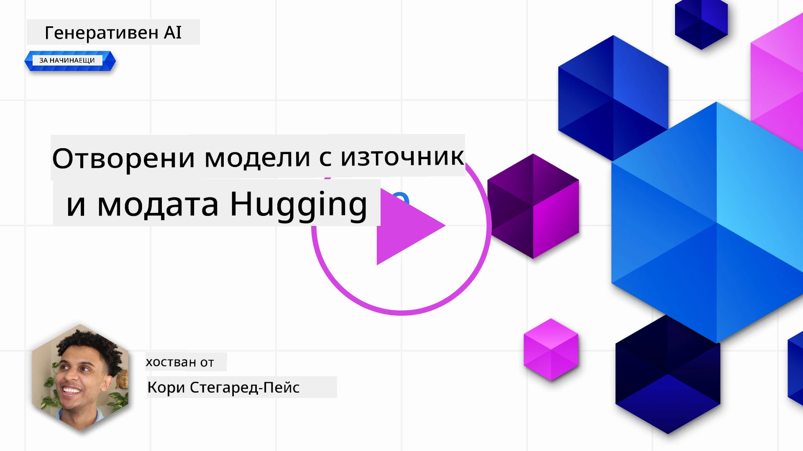
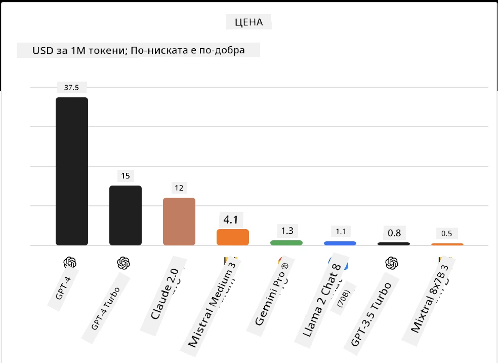
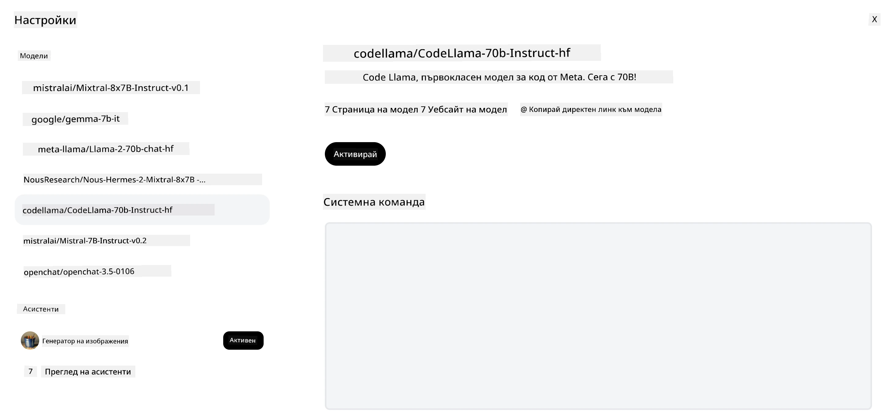
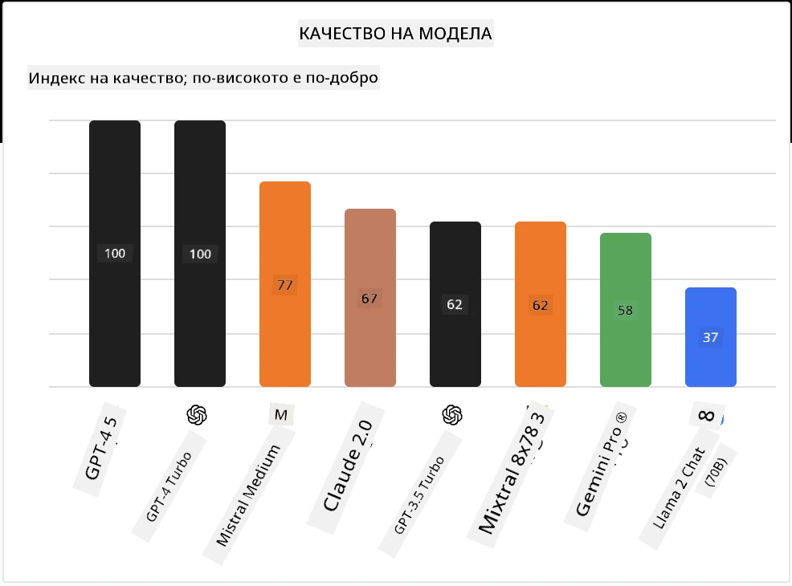

## Въведение

Светът на отворените LLM е вълнуващ и постоянно се развива. Този урок има за цел да предостави задълбочен поглед върху отворените модели. Ако търсите информация за това как собствени модели се сравняват с отворените модели, посетете урока ["Проучване и сравнение на различни LLM" ](../02-exploring-and-comparing-different-llms/README.md?WT.mc_id=academic-105485-koreyst). Този урок също обхваща темата за донастройването, но по-подробно обяснение може да намерите в урока ["Донастройване на LLM"](../18-fine-tuning/README.md?WT.mc_id=academic-105485-koreyst).

## Цели на обучението

- Да придобиете разбиране за отворените модели
- Разбиране на предимствата при работа с отворени модели
- Проучване на наличните отворени модели в Hugging Face и каталога на модели на Microsoft Foundry

## Какво са отворените модели?

Отвореният код има ключова роля за развитието на технологиите в различни области. Инициативата за отворен код (OSI) е определила [10 критерия за софтуер](https://web.archive.org/web/20241126001143/https://opensource.org/osd?WT.mc_id=academic-105485-koreyst), които трябва да се удовлетворят, за да бъде софтуер с отворен код. Изходният код трябва да бъде публично споделен под лиценз, одобрен от OSI.

Въпреки сходствата между разработването на LLM и разработването на софтуер, процесът не е напълно еднакъв. Това предизвика много обсъждания в общността за определението на отворения код в контекста на LLM. За да съответства моделът на традиционното определение за отворен код, следната информация трябва да бъде публично достъпна:

- Данни, използвани за обучение на модела.
- Пълни тегла на модела като част от обучението.
- Код за оценка.
- Код за донастройване.
- Пълни тегла на модела и метрики от обучението.

Понастоящем има само няколко модела, които отговарят на тези критерии. [Моделът OLMo, създаден от Allen Institute for Artificial Intelligence (AllenAI)](https://huggingface.co/allenai/OLMo-7B?WT.mc_id=academic-105485-koreyst) е един от тях.

В този урок по-нататък ще наричаме тези модели "отворени модели", тъй като може да не отговарят напълно на горните критерии към момента на писане.

## Ползи от отворените модели

**Висока възможност за персонализация** - Тъй като отворените модели се пускат с подробна информация за обучението, изследователите и разработчиците могат да модифицират вътрешните компоненти на модела. Това дава възможност за създаване на силно специализирани модели, донастроени за конкретна задача или област на знание. Някои примери за това са генериране на код, математически операции и биология.

**Цена** - Разходите на токен при използване и внедряване на тези модели са по-ниски в сравнение със собствени модели. При изграждане на генеративни AI приложения, трябва да се разглежда съотношението производителност към цена при работа с тези модели за вашия конкретен случай.

Източник: Artificial Analysis

**Гъвкавост** - Работата с отворени модели ви позволява да бъдете гъвкави, използвайки различни модели или комбинирайки ги. Пример за това са [HuggingChat Асистентите](https://huggingface.co/chat?WT.mc_id=academic-105485-koreyst), където потребителят може да избира модела директно в потребителския интерфейс:

## Проучване на различни отворени модели

### Llama 2

[LLama2](https://huggingface.co/meta-llama?WT.mc_id=academic-105485-koreyst), разработен от Meta, е отворен модел, оптимизиран за чат-базирани приложения. Това се дължи на метода му на донастройване, който включва голямо количество диалог и човешка обратна връзка. С този метод моделът произвежда резултати, които по-добре съответстват на човешките очаквания и осигуряват по-добро потребителско изживяване.

Някои примери за донастройвани версии на Llama включват [Japanese Llama](https://huggingface.co/elyza/ELYZA-japanese-Llama-2-7b?WT.mc_id=academic-105485-koreyst), специализиран в японски език, и [Llama Pro](https://huggingface.co/TencentARC/LLaMA-Pro-8B?WT.mc_id=academic-105485-koreyst), който е подобрена версия на базовия модел.

### Mistral

[Mistral](https://huggingface.co/mistralai?WT.mc_id=academic-105485-koreyst) е отворен модел с акцент върху висока производителност и ефективност. Той използва подхода Mixture-of-Experts, който комбинира група от специализирани експертни модели в една система, при която в зависимост от входа се избират определени модели за използване. Това прави изчисленията по-ефективни, тъй като моделите обработват само входовете, в които са специализирани.

Някои примери за донастройвани версии на Mistral включват [BioMistral](https://huggingface.co/BioMistral/BioMistral-7B?text=Mon+nom+est+Thomas+et+mon+principal?WT.mc_id=academic-105485-koreyst), насочен към медицинската област, и [OpenMath Mistral](https://huggingface.co/nvidia/OpenMath-Mistral-7B-v0.1-hf?WT.mc_id=academic-105485-koreyst), който изпълнява математически изчисления.

### Falcon

[Falcon](https://huggingface.co/tiiuae?WT.mc_id=academic-105485-koreyst) е LLM, създаден от Technology Innovation Institute (**TII**). Falcon-40B е обучаван с 40 милиарда параметри и е показал по-добра производителност от GPT-3 при по-нисък изчислителен бюджет. Това се дължи на използването на алгоритъма FlashAttention и multiquery attention, които намаляват изискванията за памет при изпълнение. С този намален период за извеждане Falcon-40B е подходящ за чат приложения.

Някои примери за донастройвани версии на Falcon са [OpenAssistant](https://huggingface.co/OpenAssistant/falcon-40b-sft-top1-560?WT.mc_id=academic-105485-koreyst), асистент, изграден върху отворени модели, и [GPT4ALL](https://huggingface.co/nomic-ai/gpt4all-falcon?WT.mc_id=academic-105485-koreyst), който осигурява по-висока производителност от базовия модел.

## Как да изберем

Няма еднозначен отговор за избора на отворен модел. Добро начало е да се използва филтърът по задача в каталога на модели на Microsoft Foundry. Това ще ви помогне да разберете за какви задачи е бил обучаван моделът. Hugging Face също поддържа класация на LLM, която показва най-добре представящите се модели според определени метрики.

Ако искате да сравните LLM от различни видове, [Artificial Analysis](https://artificialanalysis.ai/?WT.mc_id=academic-105485-koreyst) е друг чудесен ресурс:

Източник: Artificial Analysis

Ако работите по конкретен случай, намирането на донастройвани версии, насочени към същата област, може да бъде ефективно. Експериментирането с няколко отворени модела, за да видите как се представят спрямо вашите и на вашите потребители очаквания, е още една добра практика.

## Следващи стъпки

Най-хубавото на отворените модели е, че можете да започнете да работите с тях много бързо. Прегледайте [каталога на модели на Microsoft Foundry](https://ai.azure.com?WT.mc_id=academic-105485-koreyst), който съдържа специална колекция от Hugging Face с тези модели, които обсъдихме тук.

## Обучението не спира тук, продължете пътешествието

След като завършите този урок, разгледайте нашата [колекция за обучение по Генеративен AI](https://aka.ms/genai-collection?WT.mc_id=academic-105485-koreyst), за да продължите да развивате знанията си в областта на Генеративния AI!

---

<!-- CO-OP TRANSLATOR DISCLAIMER START -->
**Отказ от отговорност**:
Този документ е преведен с помощта на AI преводачески услуга [Co-op Translator](https://github.com/Azure/co-op-translator). Въпреки че се стремим към точност, моля имайте предвид, че автоматизираните преводи могат да съдържат грешки или неточности. Оригиналният документ на неговия роден език трябва да се счита за авторитетен източник. За критична информация се препоръчва професионален човешки превод. Ние не носим отговорност за каквито и да е недоразумения или неправилни тълкувания, произтичащи от използването на този превод.
<!-- CO-OP TRANSLATOR DISCLAIMER END -->