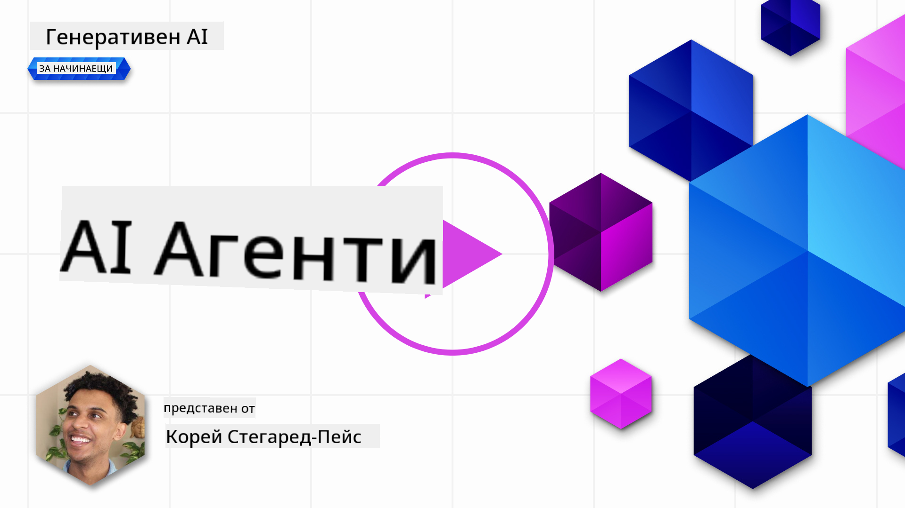
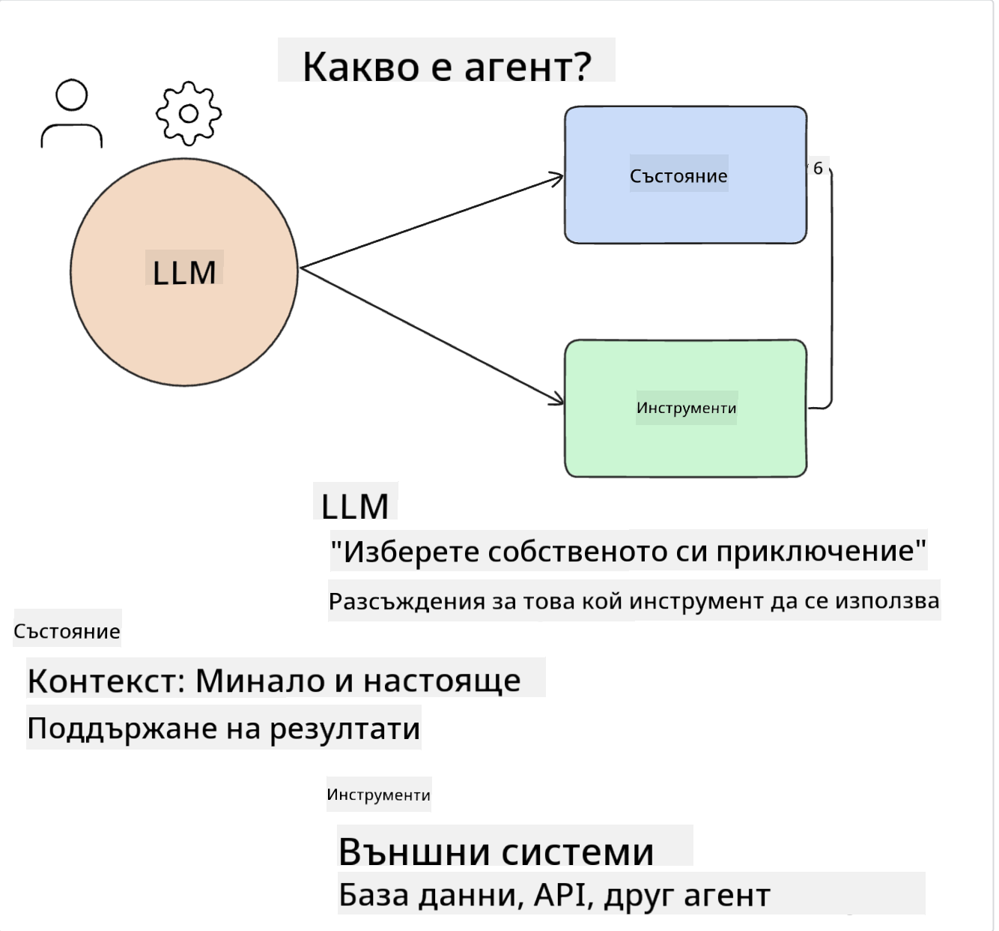
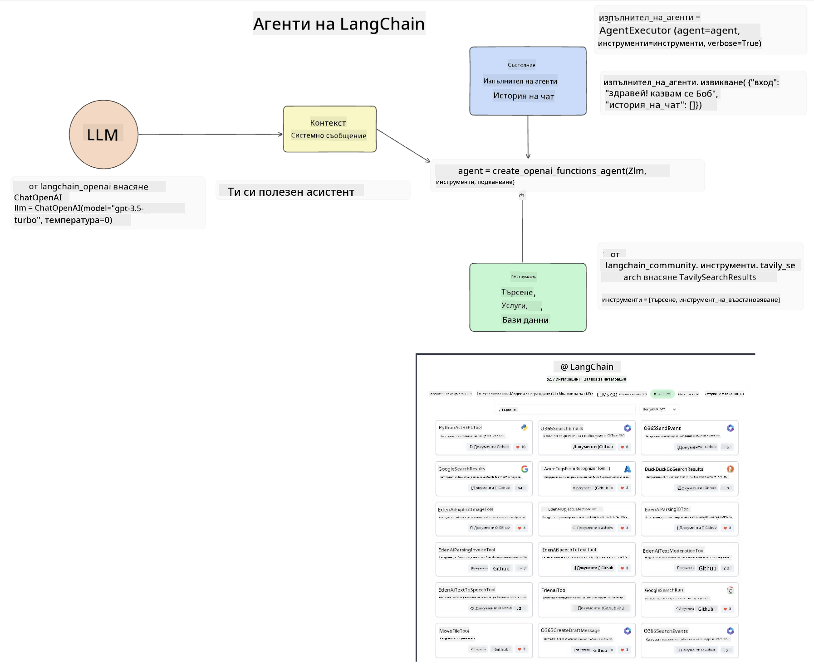
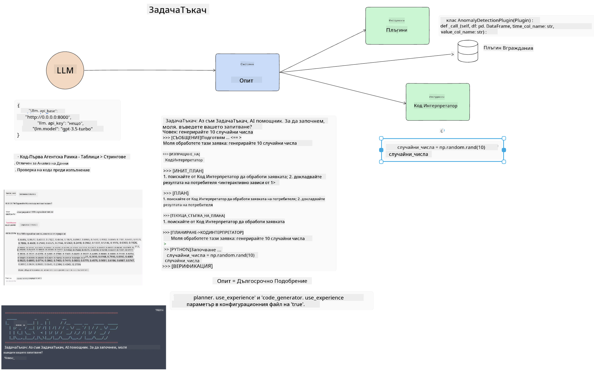
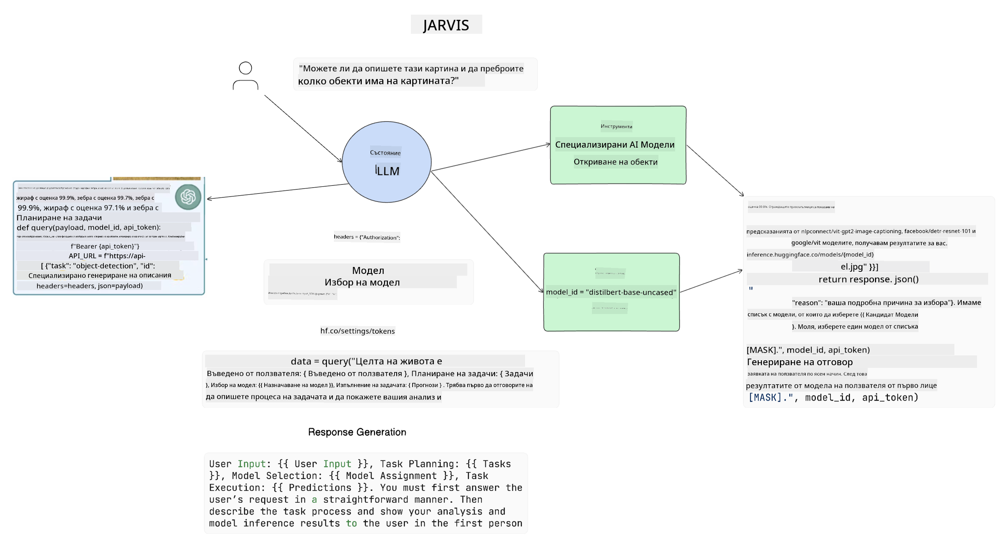

<!--
CO_OP_TRANSLATOR_METADATA:
{
  "original_hash": "11f03c81f190d9cbafd0f977dcbede6c",
  "translation_date": "2025-07-09T17:31:34+00:00",
  "source_file": "17-ai-agents/README.md",
  "language_code": "bg"
}
-->
[](https://aka.ms/gen-ai-lesson17-gh?WT.mc_id=academic-105485-koreyst)

## Въведение

AI Agents представляват вълнуващо развитие в областта на Генеративния AI, позволявайки на Големите Езикови Модели (LLMs) да се развият от асистенти в агенти, способни да предприемат действия. Рамките за AI агенти дават възможност на разработчиците да създават приложения, които предоставят на LLM достъп до инструменти и управление на състоянието. Тези рамки също така подобряват видимостта, позволявайки на потребителите и разработчиците да следят планираните от LLM действия, което подобрява управлението на потребителското изживяване.

В урока ще разгледаме следните теми:

- Какво представлява AI агентът - Какво точно е AI агент?
- Изследване на четири различни рамки за AI агенти - Какво ги прави уникални?
- Прилагане на тези AI агенти в различни случаи на употреба - Кога трябва да използваме AI агенти?

## Цели на обучението

След като преминете този урок, ще можете да:

- Обясните какво са AI агентите и как могат да се използват.
- Разберете разликите между някои от популярните рамки за AI агенти и как се различават.
- Разберете как функционират AI агентите, за да можете да изграждате приложения с тях.

## Какво са AI агенти?

AI агентите са много вълнуваща област в света на Генеративния AI. С това вълнение понякога идва и объркване относно термините и тяхното приложение. За да опростим нещата и да включим повечето инструменти, които се отнасят до AI агенти, ще използваме следното определение:

AI агентите позволяват на Големите Езикови Модели (LLMs) да изпълняват задачи, като им предоставят достъп до **състояние** и **инструменти**.



Нека дефинираме тези термини:

**Големи Езикови Модели** – Това са моделите, споменавани в този курс, като GPT-3.5, GPT-4, Llama-2 и др.

**Състояние** – Това се отнася до контекста, в който работи LLM. LLM използва контекста на предишните си действия и текущия контекст, който насочва вземането на решения за следващите действия. Рамките за AI агенти улесняват разработчиците в поддържането на този контекст.

**Инструменти** – За да изпълни задачата, която потребителят е поискал и която LLM е планирал, LLM се нуждае от достъп до инструменти. Примери за инструменти могат да бъдат база данни, API, външно приложение или дори друг LLM!

Тези определения ще ви дадат добра основа, докато разглеждаме как те се реализират. Нека разгледаме няколко различни рамки за AI агенти:

## LangChain Agents

[LangChain Agents](https://python.langchain.com/docs/how_to/#agents?WT.mc_id=academic-105485-koreyst) е реализация на горните определения.

За управление на **състоянието** използва вградена функция, наречена `AgentExecutor`. Тя приема дефинирания `agent` и наличните `tools`.

`AgentExecutor` също така съхранява историята на чата, за да осигури контекста на разговора.



LangChain предлага [каталог с инструменти](https://integrations.langchain.com/tools?WT.mc_id=academic-105485-koreyst), които могат да бъдат импортирани във вашето приложение и до които LLM може да получи достъп. Те са създадени от общността и от екипа на LangChain.

След това можете да дефинирате тези инструменти и да ги предадете на `AgentExecutor`.

Видимостта е още един важен аспект при говорене за AI агенти. Важно е за разработчиците на приложения да разбират кой инструмент използва LLM и защо. За това екипът на LangChain е разработил LangSmith.

## AutoGen

Следващата рамка за AI агенти, която ще разгледаме, е [AutoGen](https://microsoft.github.io/autogen/?WT.mc_id=academic-105485-koreyst). Основният фокус на AutoGen са разговорите. Агентите са както **способни на разговор**, така и **персонализируеми**.

**Способни на разговор** – LLM могат да започват и продължават разговор с друг LLM, за да изпълнят задача. Това се постига чрез създаване на `AssistantAgents` и задаване на конкретно системно съобщение.

```python

autogen.AssistantAgent( name="Coder", llm_config=llm_config, ) pm = autogen.AssistantAgent( name="Product_manager", system_message="Creative in software product ideas.", llm_config=llm_config, )

```

**Персонализируеми** – Агентите могат да бъдат дефинирани не само като LLM, но и като потребител или инструмент. Като разработчик можете да дефинирате `UserProxyAgent`, който отговаря за взаимодействието с потребителя за обратна връзка при изпълнение на задача. Тази обратна връзка може да продължи изпълнението на задачата или да я прекрати.

```python
user_proxy = UserProxyAgent(name="user_proxy")
```

### Състояние и инструменти

За да променя и управлява състоянието, асистент агент генерира Python код за изпълнение на задачата.

Ето пример за процеса:


#### LLM дефиниран със системно съобщение

```python
system_message="For weather related tasks, only use the functions you have been provided with. Reply TERMINATE when the task is done."
```

Това системно съобщение насочва конкретния LLM кои функции са релевантни за неговата задача. Запомнете, с AutoGen можете да имате няколко дефинирани AssistantAgents с различни системни съобщения.

#### Чатът е иницииран от потребител

```python
user_proxy.initiate_chat( chatbot, message="I am planning a trip to NYC next week, can you help me pick out what to wear? ", )

```

Това съобщение от user_proxy (човек) стартира процеса, при който агентът изследва възможните функции, които трябва да изпълни.

#### Функцията се изпълнява

```bash
chatbot (to user_proxy):

***** Suggested tool Call: get_weather ***** Arguments: {"location":"New York City, NY","time_periond:"7","temperature_unit":"Celsius"} ******************************************************** --------------------------------------------------------------------------------

>>>>>>>> EXECUTING FUNCTION get_weather... user_proxy (to chatbot): ***** Response from calling function "get_weather" ***** 112.22727272727272 EUR ****************************************************************

```

След като първоначалният чат бъде обработен, агентът ще изпрати предложението за инструмент, който да извика. В този случай това е функцията `get_weather`. В зависимост от конфигурацията, тази функция може да се изпълни автоматично и да бъде прочетена от агента или да се изпълни на базата на потребителски вход.

Можете да намерите списък с [AutoGen примерни кодове](https://microsoft.github.io/autogen/docs/Examples/?WT.mc_id=academic-105485-koreyst), за да разгледате по-подробно как да започнете да изграждате.

## Taskweaver

Следващата рамка за агенти, която ще разгледаме, е [Taskweaver](https://microsoft.github.io/TaskWeaver/?WT.mc_id=academic-105485-koreyst). Тя е известна като "code-first" агент, защото вместо да работи само със `strings`, може да работи с DataFrames в Python. Това е изключително полезно за задачи, свързани с анализ и генериране на данни. Това могат да бъдат неща като създаване на графики и диаграми или генериране на случайни числа.

### Състояние и инструменти

За управление на състоянието на разговора, TaskWeaver използва концепцията `Planner`. `Planner` е LLM, който приема заявката от потребителите и планира задачите, които трябва да бъдат изпълнени, за да се изпълни тази заявка.

За изпълнение на задачите `Planner` има достъп до колекция от инструменти, наречени `Plugins`. Това могат да бъдат Python класове или общ кодов интерпретатор. Тези плъгини се съхраняват като embeddings, за да може LLM по-добре да търси правилния плъгин.



Ето пример за плъгин за откриване на аномалии:

```python
class AnomalyDetectionPlugin(Plugin): def __call__(self, df: pd.DataFrame, time_col_name: str, value_col_name: str):
```

Кодът се проверява преди изпълнение. Друга функция за управление на контекста в Taskweaver е `experience`. Experience позволява контекстът на разговора да се съхранява дългосрочно в YAML файл. Това може да се конфигурира така, че LLM да се подобрява с времето по определени задачи, като се базира на предишни разговори.

## JARVIS

Последната рамка за агенти, която ще разгледаме, е [JARVIS](https://github.com/microsoft/JARVIS?tab=readme-ov-file?WT.mc_id=academic-105485-koreyst). Това, което прави JARVIS уникален, е че използва LLM за управление на `състоянието` на разговора, а `инструментите` са други AI модели. Всеки от AI моделите е специализиран за изпълнение на определени задачи като откриване на обекти, транскрипция или генериране на описания на изображения.



LLM, като модел с общо предназначение, получава заявката от потребителя и идентифицира конкретната задача и всички аргументи/данни, необходими за изпълнението ѝ.

```python
[{"task": "object-detection", "id": 0, "dep": [-1], "args": {"image": "e1.jpg" }}]
```

След това LLM форматира заявката по начин, който специализираният AI модел може да интерпретира, например в JSON формат. След като AI моделът върне своята прогноза на базата на задачата, LLM получава отговора.

Ако са необходими няколко модела за изпълнение на задачата, LLM ще интерпретира и отговорите от тези модели, преди да ги обедини и генерира отговора към потребителя.

Примерът по-долу показва как това би работило, когато потребител иска описание и брой на обектите на снимка:

## Задача

За да продължите обучението си за AI агенти, можете да изградите с AutoGen:

- Приложение, което симулира бизнес среща с различни отдели на образователен стартъп.
- Създайте системни съобщения, които насочват LLM в разбирането на различни персонажи и приоритети, и позволяват на потребителя да представи нова продуктова идея.
- След това LLM трябва да генерира последващи въпроси от всеки отдел, за да усъвършенства и подобри представянето и идеята за продукта.

## Обучението не спира тук, продължете пътешествието

След като завършите този урок, разгледайте нашата [колекция за обучение по Генеративен AI](https://aka.ms/genai-collection?WT.mc_id=academic-105485-koreyst), за да продължите да развивате знанията си в областта на Генеративния AI!

**Отказ от отговорност**:  
Този документ е преведен с помощта на AI преводаческа услуга [Co-op Translator](https://github.com/Azure/co-op-translator). Въпреки че се стремим към точност, моля, имайте предвид, че автоматизираните преводи могат да съдържат грешки или неточности. Оригиналният документ на неговия роден език трябва да се счита за авторитетен източник. За критична информация се препоръчва професионален човешки превод. Ние не носим отговорност за каквито и да е недоразумения или неправилни тълкувания, произтичащи от използването на този превод.