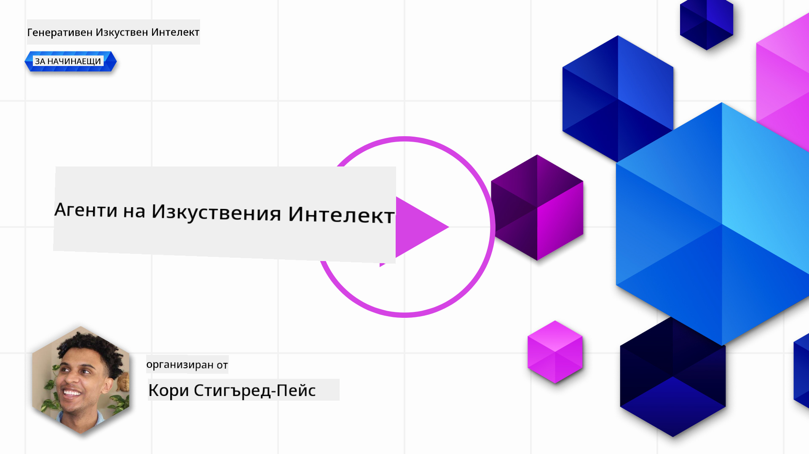
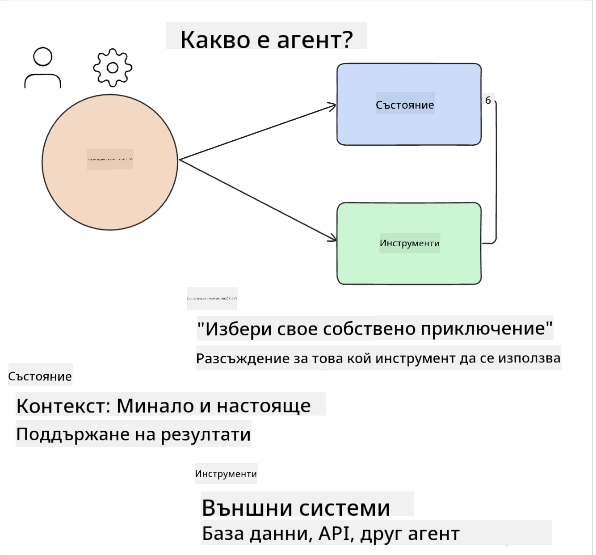
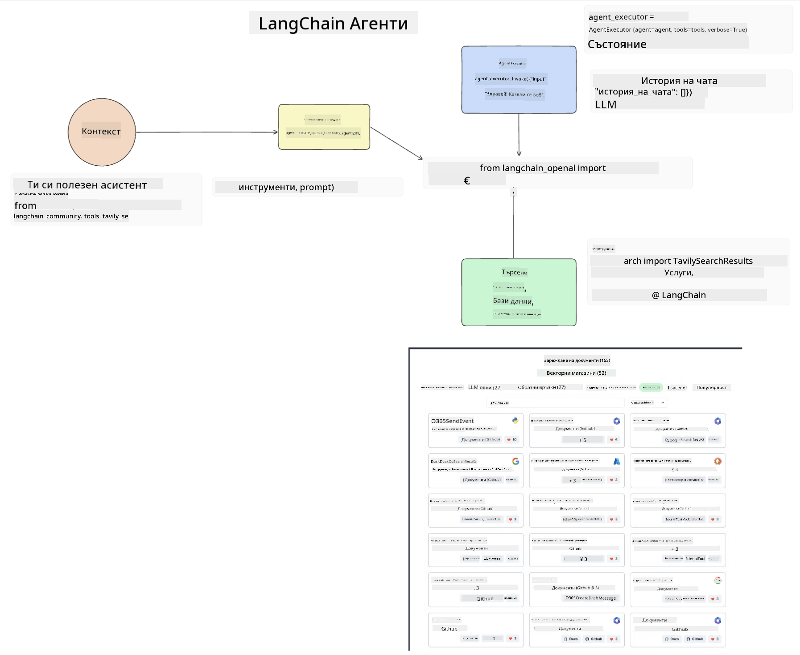
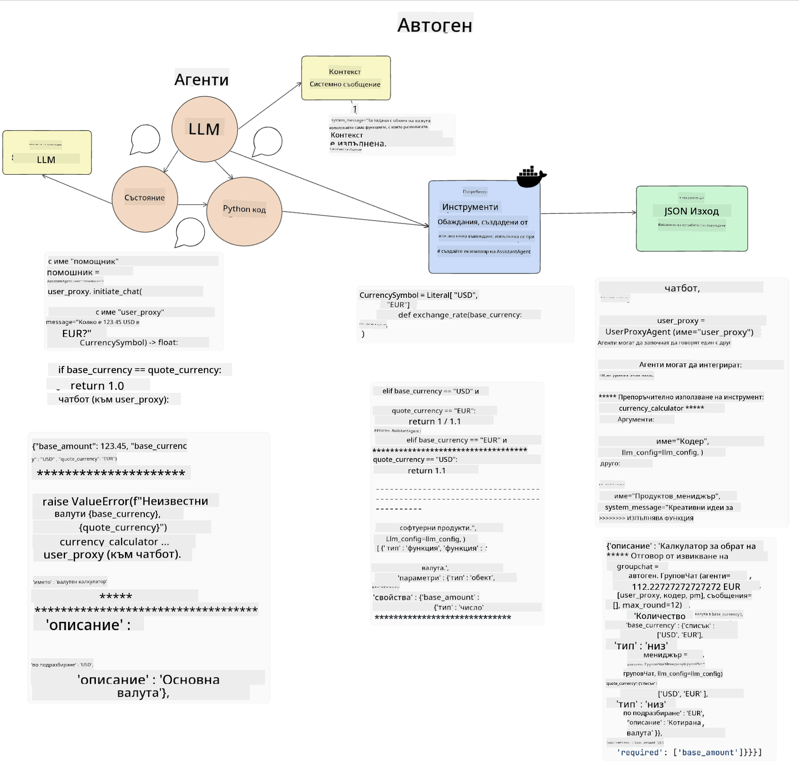
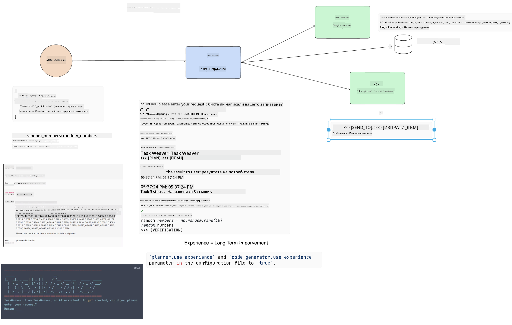
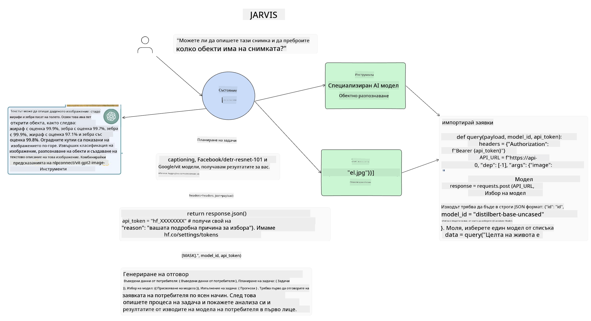

<!--
CO_OP_TRANSLATOR_METADATA:
{
  "original_hash": "11f03c81f190d9cbafd0f977dcbede6c",
  "translation_date": "2025-05-20T07:32:04+00:00",
  "source_file": "17-ai-agents/README.md",
  "language_code": "bg"
}
-->
[](https://aka.ms/gen-ai-lesson17-gh?WT.mc_id=academic-105485-koreyst)

## Въведение

AI агентите представляват вълнуващо развитие в Генеративния AI, позволявайки на Големите Езикови Модели (LLMs) да се развият от асистенти в агенти, способни да предприемат действия. AI агентските рамки позволяват на разработчиците да създават приложения, които дават на LLMs достъп до инструменти и управление на състоянието. Тези рамки също така подобряват видимостта, позволявайки на потребителите и разработчиците да следят действията, планирани от LLMs, като по този начин подобряват управлението на опита.

Урокът ще обхване следните области:

- Разбиране какво е AI агент - Какво точно представлява AI агент?
- Изследване на четири различни AI агентски рамки - Какво ги прави уникални?
- Прилагане на тези AI агенти в различни случаи на употреба - Кога трябва да използваме AI агенти?

## Учебни цели

След преминаването на този урок, ще можете:

- Да обясните какво са AI агентите и как могат да бъдат използвани.
- Да разберете разликите между някои от популярните AI агентски рамки и как те се различават.
- Да разберете как функционират AI агентите, за да изградите приложения с тях.

## Какво са AI агенти?

AI агентите са много вълнуващо поле в света на Генеративния AI. С това вълнение понякога идва объркване на термините и тяхното приложение. За да запазим нещата прости и обхващащи повечето от инструментите, които се отнасят до AI агенти, ще използваме следната дефиниция:

AI агентите позволяват на Големите Езикови Модели (LLMs) да изпълняват задачи, като им дават достъп до **състояние** и **инструменти**.



Нека дефинираме тези термини:

**Големи Езикови Модели** - Това са моделите, споменати в този курс, като GPT-3.5, GPT-4, Llama-2 и др.

**Състояние** - Това се отнася до контекста, в който LLM работи. LLM използва контекста на своите минали действия и текущия контекст, ръководейки своето вземане на решения за следващите действия. AI агентските рамки позволяват на разработчиците да поддържат този контекст по-лесно.

**Инструменти** - За да изпълни задачата, която потребителят е поискал и която LLM е планирал, LLM трябва да има достъп до инструменти. Някои примери за инструменти могат да бъдат база данни, API, външно приложение или дори друг LLM!

Тези дефиниции се надяваме да ви дадат добра основа за напред, докато разглеждаме как те са реализирани. Нека разгледаме няколко различни AI агентски рамки:

## LangChain агенти

[LangChain агенти](https://python.langchain.com/docs/how_to/#agents?WT.mc_id=academic-105485-koreyst) са реализация на дефинициите, които предоставихме по-горе.

За да управлява **състоянието**, той използва вградена функция, наречена `AgentExecutor`. Това приема определените `agent` и `tools`, които са налични за него.

`Agent Executor` също съхранява историята на чата, за да предостави контекста на чата.



LangChain предлага [каталог от инструменти](https://integrations.langchain.com/tools?WT.mc_id=academic-105485-koreyst), които могат да бъдат импортирани в вашето приложение, в което LLM може да получи достъп до тях. Те са създадени от общността и от екипа на LangChain.

Можете да дефинирате тези инструменти и да ги предадете на `Agent Executor`.

Видимостта е друг важен аспект, когато говорим за AI агенти. Важно е за разработчиците на приложения да разбират кой инструмент LLM използва и защо. За това екипът на LangChain е разработил LangSmith.

## AutoGen

Следващата AI агентска рамка, която ще обсъдим, е [AutoGen](https://microsoft.github.io/autogen/?WT.mc_id=academic-105485-koreyst). Основният фокус на AutoGen е разговорите. Агенти са както **разговорливи**, така и **персонализируеми**.

**Разговорливи -** LLMs могат да започнат и продължат разговор с друг LLM, за да изпълнят задача. Това се прави чрез създаване на `AssistantAgents` и даването им на специфично системно съобщение.

```python

autogen.AssistantAgent( name="Coder", llm_config=llm_config, ) pm = autogen.AssistantAgent( name="Product_manager", system_message="Creative in software product ideas.", llm_config=llm_config, )

```

**Персонализируеми** - Агенти могат да бъдат дефинирани не само като LLMs, но и като потребител или инструмент. Като разработчик, можете да дефинирате `UserProxyAgent`, който е отговорен за взаимодействие с потребителя за обратна връзка при изпълнение на задача. Тази обратна връзка може да продължи изпълнението на задачата или да я спре.

```python
user_proxy = UserProxyAgent(name="user_proxy")
```

### Състояние и инструменти

За да променя и управлява състоянието, помощник агент генерира Python код за изпълнение на задачата.

Ето пример за процеса:



#### LLM дефиниран със системно съобщение

```python
system_message="For weather related tasks, only use the functions you have been provided with. Reply TERMINATE when the task is done."
```

Това системно съобщение насочва този конкретен LLM към кои функции са релевантни за неговата задача. Помнете, с AutoGen можете да имате множество дефинирани AssistantAgents с различни системни съобщения.

#### Чатът е иницииран от потребителя

```python
user_proxy.initiate_chat( chatbot, message="I am planning a trip to NYC next week, can you help me pick out what to wear? ", )

```

Това съобщение от user_proxy (Human) е това, което ще започне процеса на агента да изследва възможните функции, които трябва да изпълни.

#### Функцията е изпълнена

```bash
chatbot (to user_proxy):

***** Suggested tool Call: get_weather ***** Arguments: {"location":"New York City, NY","time_periond:"7","temperature_unit":"Celsius"} ******************************************************** --------------------------------------------------------------------------------

>>>>>>>> EXECUTING FUNCTION get_weather... user_proxy (to chatbot): ***** Response from calling function "get_weather" ***** 112.22727272727272 EUR ****************************************************************

```

След като първоначалният чат е обработен, агентът ще изпрати предложението за инструмент за извикване. В този случай това е функция, наречена `get_weather`. Depending on your configuration, this function can be automatically executed and read by the Agent or can be executed based on user input.

You can find a list of [AutoGen code samples](https://microsoft.github.io/autogen/docs/Examples/?WT.mc_id=academic-105485-koreyst) to further explore how to get started building.

## Taskweaver

The next agent framework we will explore is [Taskweaver](https://microsoft.github.io/TaskWeaver/?WT.mc_id=academic-105485-koreyst). It is known as a "code-first" agent because instead of working strictly with `strings` , it can work with DataFrames in Python. This becomes extremely useful for data analysis and generation tasks. This can be things like creating graphs and charts or generating random numbers.

### State and Tools

To manage the state of the conversation, TaskWeaver uses the concept of a `Planner`. The `Planner` is a LLM that takes the request from the users and maps out the tasks that need to be completed to fulfill this request.

To complete the tasks the `Planner` is exposed to the collection of tools called `Plugins`. Това могат да бъдат Python класове или общ интерпретатор на код. Тези плъгини се съхраняват като вграждания, за да може LLM по-добре да търси правилния плъгин.



Ето пример за плъгин за обработка на откриване на аномалии:

```python
class AnomalyDetectionPlugin(Plugin): def __call__(self, df: pd.DataFrame, time_col_name: str, value_col_name: str):
```

Кодът се проверява преди изпълнение. Друга функция за управление на контекста в Taskweaver е `experience`. Experience allows for the context of a conversation to be stored over to the long term in a YAML file. This can be configured so that the LLM improves over time on certain tasks given that it is exposed to prior conversations.

## JARVIS

The last agent framework we will explore is [JARVIS](https://github.com/microsoft/JARVIS?tab=readme-ov-file?WT.mc_id=academic-105485-koreyst). What makes JARVIS unique is that it uses an LLM to manage the `state` на разговора и `tools` са други AI модели. Всеки от AI моделите са специализирани модели, които изпълняват определени задачи като откриване на обекти, транскрипция или описание на изображения.



LLM, като общ модел, получава заявката от потребителя и идентифицира специфичната задача и всякакви аргументи/данни, които са необходими за изпълнение на задачата.

```python
[{"task": "object-detection", "id": 0, "dep": [-1], "args": {"image": "e1.jpg" }}]
```

LLM след това форматира заявката по начин, който специализираният AI модел може да интерпретира, като например JSON. След като AI моделът върне своето предсказание въз основа на задачата, LLM получава отговора.

Ако са необходими множество модели за изпълнение на задачата, той също така ще интерпретира отговора от тези модели, преди да ги събере, за да генерира отговора към потребителя.

Примерът по-долу показва как това би работило, когато потребителят иска описание и броене на обектите в картинка:

## Задание

За да продължите обучението си за AI агенти, можете да изградите с AutoGen:

- Приложение, което симулира бизнес среща с различни отдели на образователен стартъп.
- Създайте системни съобщения, които насочват LLMs в разбирането на различни персонажи и приоритети и позволяват на потребителя да представи нова идея за продукт.
- LLM трябва след това да генерира последващи въпроси от всеки отдел, за да усъвършенства и подобри представянето и идеята за продукта.

## Обучението не спира тук, продължете пътешествието

След като завършите този урок, разгледайте нашата [колекция за обучение по Генеративен AI](https://aka.ms/genai-collection?WT.mc_id=academic-105485-koreyst), за да продължите да развивате знанията си за Генеративния AI!

**Отказ от отговорност**: 
Този документ е преведен с помощта на AI услуга за превод [Co-op Translator](https://github.com/Azure/co-op-translator). Докато се стремим към точност, моля, имайте предвид, че автоматичните преводи могат да съдържат грешки или неточности. Оригиналният документ на неговия роден език трябва да се счита за авторитетния източник. За критична информация се препоръчва професионален човешки превод. Ние не носим отговорност за каквито и да било недоразумения или погрешни тълкувания, произтичащи от използването на този превод.