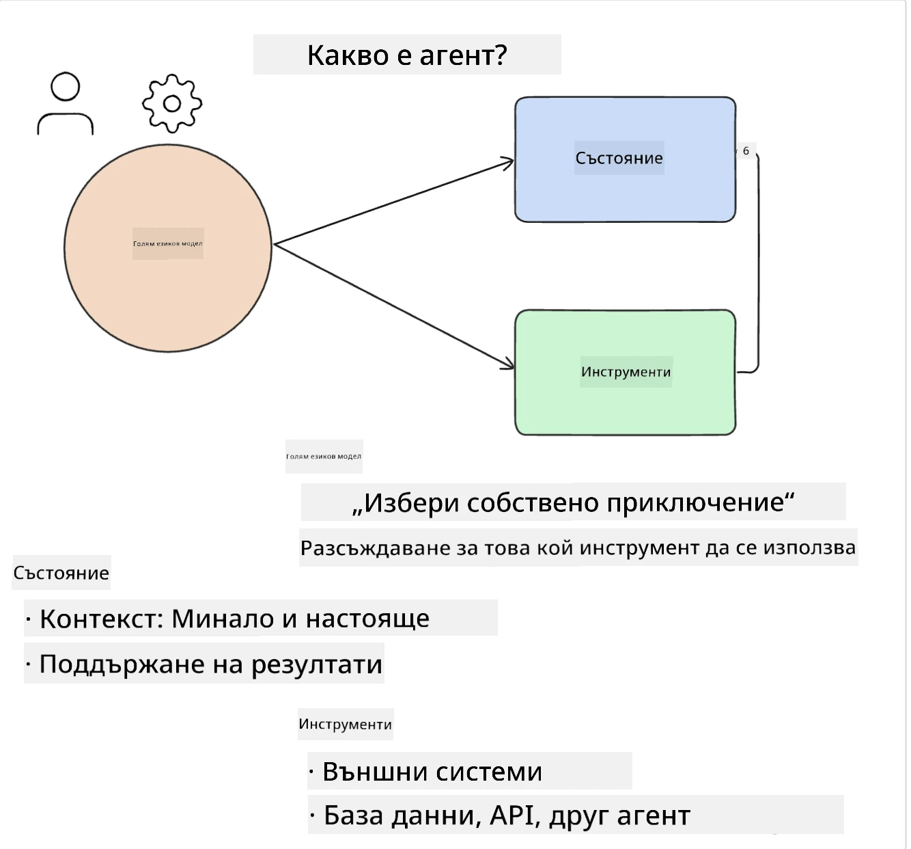
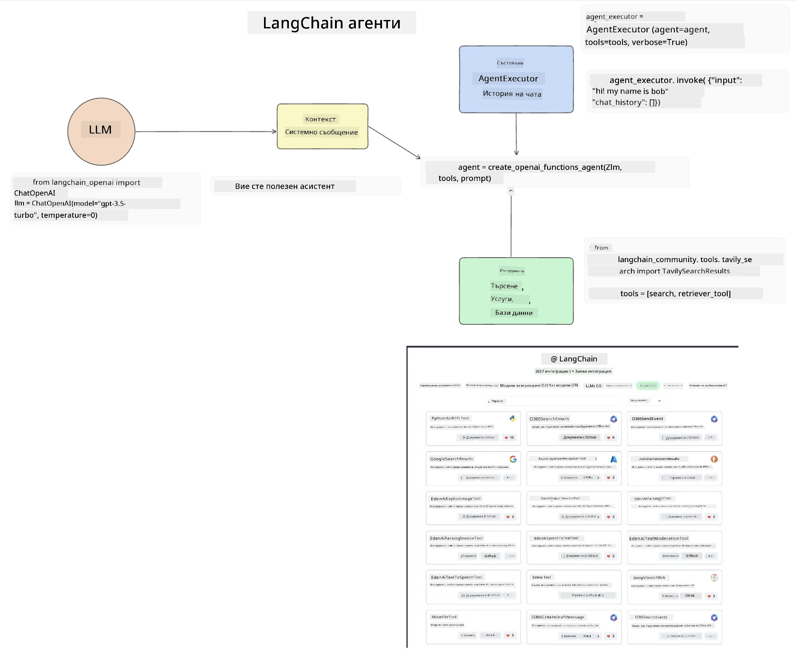
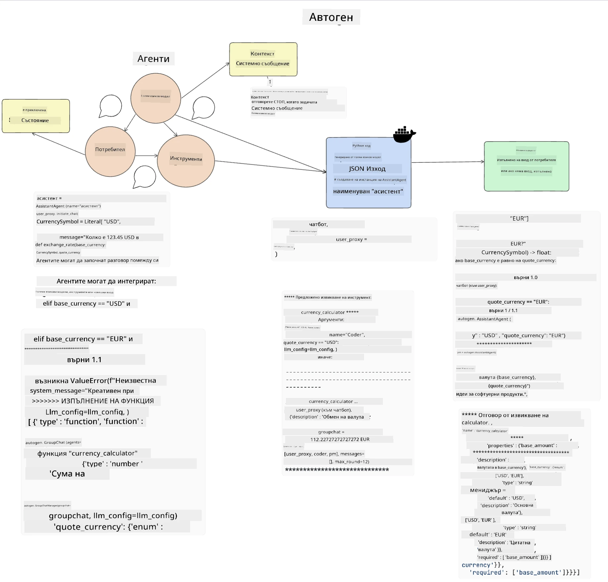
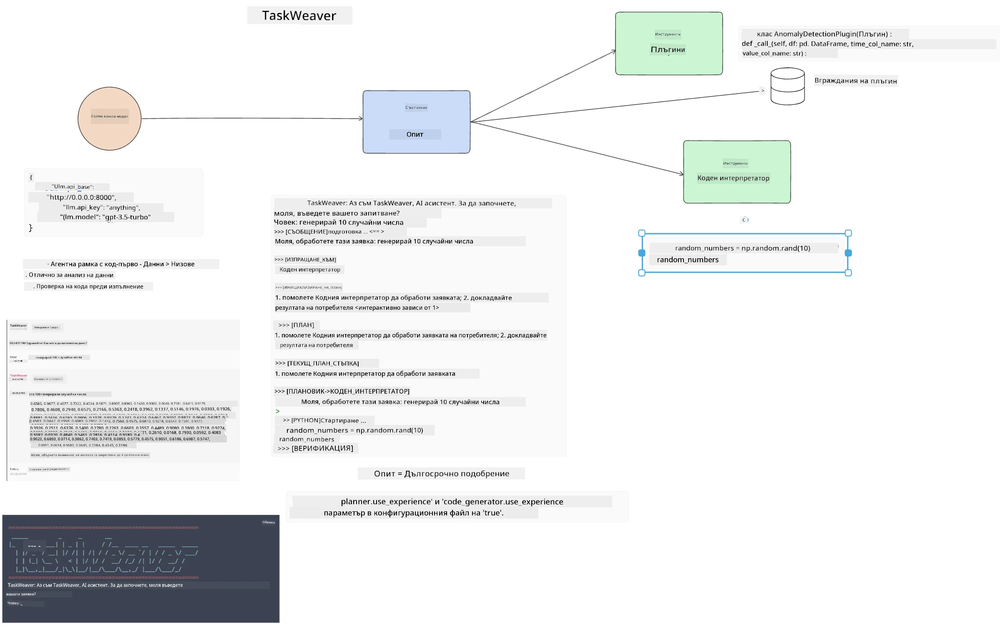
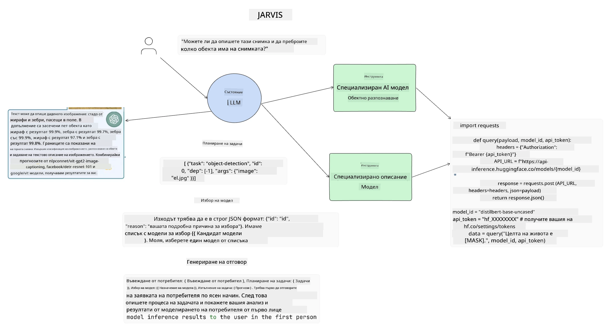

[](https://youtu.be/yAXVW-lUINc?si=bOtW9nL6jc3XJgOM)

## Въведение

AI агентите представляват вълнуващо развитие в генеративния AI, позволяващо на големите езикови модели (LLM) да се развият от асистенти в агенти, способни да предприемат действия. Рамките за AI агенти позволяват на разработчиците да създават приложения, които осигуряват на LLM достъп до инструменти и управление на състоянието. Тези рамки също подобряват видимостта, позволявайки на потребителите и разработчиците да наблюдават действията, планирани от LLM, като по този начин се подобрява управлението на потребителския опит.

Урокът ще покрие следните области:

- Разбиране какво е AI агент - Какво точно представлява AI агентът?
- Изследване на четири различни рамки за AI агенти - Какво ги прави уникални?
- Прилагане на тези AI агенти в различни случаи на употреба - Кога трябва да използваме AI агенти?

## Цели на обучението

След като преминете този урок, ще можете да:

- Обясните какво са AI агентите и как могат да се използват.
- Разбирате разликите между някои от популярните рамки за AI агенти и как се различават те.
- Разбирате как функционират AI агентите, за да изграждате приложения с тях.

## Какво са AI агенти?

AI агентите са много вълнуваща област в света на генеративния AI. С тази вълнение понякога идва и объркване на термините и тяхното приложение. За да бъде всичко просто и включващо повечето инструменти, които се отнасят до AI агенти, ще използваме следното определение:

AI агентите позволяват на големите езикови модели (LLM) да изпълняват задачи, като им дават достъп до **състояние** и **инструменти**.



Нека дефинираме тези термини:

**Големи езикови модели** - Това са моделите, използвани в целия курс като GPT-3.5, GPT-4, Llama-2 и др.

**Състояние** - Това се отнася до контекста, в който LLM работи. LLM използва контекста на своите предишни действия и текущия контекст, който насочва неговото вземане на решения за следващите действия. Рамките за AI агенти позволяват на разработчиците по-лесно да поддържат този контекст.

**Инструменти** - За да завърши задачата, която потребителят е поискал и която LLM е планирал, LLM се нуждае от достъп до инструменти. Някои примери за инструменти могат да бъдат база данни, API, външно приложение или дори друг LLM!

Тези определения ще ви дадат добра основа, докато разглеждаме как са реализирани. Нека разгледаме няколко различни рамки за AI агенти:

## LangChain агенти

[LangChain агенти](https://python.langchain.com/docs/how_to/#agents?WT.mc_id=academic-105485-koreyst) е реализация на определенията, които дадохме по-горе.

За управление на **състоянието**, използва вградена функция, наречена `AgentExecutor`. Тя приема дефинирания `agent` и наличните `tools`.

`AgentExecutor` също съхранява историята на чата, за да предостави контекст на разговора.



LangChain предлага [каталог с инструменти](https://integrations.langchain.com/tools?WT.mc_id=academic-105485-koreyst), които могат да бъдат импортирани в приложението ви и до които LLM може да получи достъп. Те са създадени от общността и от екипа на LangChain.

След това можете да дефинирате тези инструменти и да ги предадете на `AgentExecutor`.

Видимостта е друг важен аспект при разговор за AI агенти. За разработчиците на приложения е важно да разбират кой инструмент използва LLM и защо. За това екипът на LangChain е разработил LangSmith.

## AutoGen

Следващата рамка за AI агенти, която ще разгледаме, е [AutoGen](https://microsoft.github.io/autogen/?WT.mc_id=academic-105485-koreyst). Основният фокус на AutoGen са разговорите. Агентите са едновременно **способни на разговор** и **настройваеми**.

**Способни на разговор -** LLM могат да започнат и продължат разговор с друг LLM, за да завършат задача. Това става чрез създаване на `AssistantAgents` и предоставяне на специфично системно съобщение.

```python

autogen.AssistantAgent( name="Coder", llm_config=llm_config, ) pm = autogen.AssistantAgent( name="Product_manager", system_message="Creative in software product ideas.", llm_config=llm_config, )

```

**Настройваеми** - Агентите могат да се дефинират не само като LLM, но и като потребител или инструмент. Като разработчик можете да дефинирате `UserProxyAgent`, който е отговорен за взаимодействие с потребителя за обратна връзка при изпълнение на задача. Тази обратна връзка може да продължи изпълнението на задачата или да я прекрати.

```python
user_proxy = UserProxyAgent(name="user_proxy")
```

### Състояние и Инструменти

За да променя и управлява състоянието, един асистент агент генерира Python код за изпълнение на задачата.

Ето пример на този процес:



#### LLM дефиниран със системно съобщение

```python
system_message="For weather related tasks, only use the functions you have been provided with. Reply TERMINATE when the task is done."
```

Това системно съобщение насочва конкретния LLM кои функции са подходящи за неговата задача. Запомнете, с AutoGen можете да имате множество дефинирани AssistantAgents с различни системни съобщения.

#### Chat е иницииран от потребителя

```python
user_proxy.initiate_chat( chatbot, message="I am planning a trip to NYC next week, can you help me pick out what to wear? ", )

```

Това съобщение от user_proxy (човек) ще стартира процеса, в който агентът изследва възможните функции, които трябва да изпълни.

#### Функцията се изпълнява

```bash
chatbot (to user_proxy):

***** Suggested tool Call: get_weather ***** Arguments: {"location":"New York City, NY","time_periond:"7","temperature_unit":"Celsius"} ******************************************************** --------------------------------------------------------------------------------

>>>>>>>> EXECUTING FUNCTION get_weather... user_proxy (to chatbot): ***** Response from calling function "get_weather" ***** 112.22727272727272 EUR ****************************************************************

```

След като първоначалният чат е обработен, агентът ще предложи инструмента за извикване. В този случай, това е функция, наречена `get_weather`. В зависимост от конфигурацията ви, тази функция може да бъде автоматично изпълнена и прочетена от агента или да се изпълни според вход от потребителя.

Можете да намерите списък с [AutoGen примерен код](https://microsoft.github.io/autogen/docs/Examples/?WT.mc_id=academic-105485-koreyst), за да разгледате повече как да започнете да изграждате.

## Taskweaver

Следващата рамка, която ще разгледаме, е [Taskweaver](https://microsoft.github.io/TaskWeaver/?WT.mc_id=academic-105485-koreyst). Тя е известна като "code-first" агент, защото вместо да работи строго с `стрингове`, може да работи с DataFrames в Python. Това става изключително полезно за задачи за анализ и генериране на данни. Може да включва неща като създаване на графики и диаграми или генериране на случайни числа.

### Състояние и инструменти

За управление на състоянието на разговора TaskWeaver използва концепцията за `Planner`. `Planner` е LLM, който приема заявката от потребителите и планира задачите, които трябва да бъдат изпълнени, за да се изпълни тази заявка.

За да изпълни задачите, `Planner` има достъп до колекция от инструменти, наречени `Plugins`. Това могат да бъдат Python класове или общ кодов интерпретатор. Тези плъгини се съхраняват като embedding-и, за да може LLM да търси по-добре подходящия плъгин.



Ето пример за плъгин за обработка на откриване на аномалии:

```python
class AnomalyDetectionPlugin(Plugin): def __call__(self, df: pd.DataFrame, time_col_name: str, value_col_name: str):
```

Кодът се проверява преди изпълнение. Друга функция за управление на контекста в Taskweaver е `experience`. Experience позволява контекстът на разговор да се съхранява за дългосрочно използване в YAML файл. Това може да се конфигурира така, че LLM да се подобрява с времето в определени задачи, като има достъп до предишните разговори.

## JARVIS

Последната рамка, която ще разгледаме, е [JARVIS](https://github.com/microsoft/JARVIS?tab=readme-ov-file&WT.mc_id=academic-105485-koreyst). Това, което прави JARVIS уникален е, че използва LLM да управлява `състоянието` на разговора, а `инструментите` са други AI модели. Всеки от AI моделите е специализиран модел, който изпълнява определени задачи, като обектно разпознаване, транскрипция или осигуряване на описание на изображения.



LLM, като модел за общо предназначение, получава заявката от потребителя и определя конкретната задача и всички аргументи/данни, необходими за изпълнението ѝ.

```python
[{"task": "object-detection", "id": 0, "dep": [-1], "args": {"image": "e1.jpg" }}]
```

След това LLM форматира заявката по начин, който специализираният AI модел може да интерпретира, например като JSON. След като AI моделът върне своята прогноза на базата на задачата, LLM получава отговора.

Ако са необходими няколко модела за изпълнение на задачата, LLM също интерпретира отговорите от тези модели, преди да ги обедини и създаде отговор за потребителя.

Примерът по-долу показва как това би работило, когато потребител иска описание и брой на обектите на снимка:

## Задача

За да продължите обучението си по AI агенти, можете да изградите с AutoGen:

- Приложение, което симулира бизнес среща с различни отдели на образователен стартъп.
- Създайте системни съобщения, които насочват LLM в разбирането на различни персонажи и приоритети, и позволяват на потребителя да предложи нова продуктова идея.
- След това LLM трябва да генерира последващи въпроси от всеки отдел, за да доразвие и подобри предложението и идеята за продукта.

## Обучението не спира тук, продължете пътешествието

След като завършите този урок, разгледайте нашата [генеративна AI обучителна колекция](https://aka.ms/genai-collection?WT.mc_id=academic-105485-koreyst), за да повишите вашите умения в генеративния AI!

---

<!-- CO-OP TRANSLATOR DISCLAIMER START -->
**Отказ от отговорност**:
Този документ е преведен с помощта на AI преводаческа услуга [Co-op Translator](https://github.com/Azure/co-op-translator). Въпреки че се стремим към точност, моля имайте предвид, че автоматичните преводи могат да съдържат грешки или неточности. Оригиналният документ на неговия роден език трябва да се счита за авторитетен източник. За критична информация се препоръчва професионален човешки превод. Ние не носим отговорност за каквито и да е недоразумения или неправилни тълкувания, произтичащи от използването на този превод.
<!-- CO-OP TRANSLATOR DISCLAIMER END -->