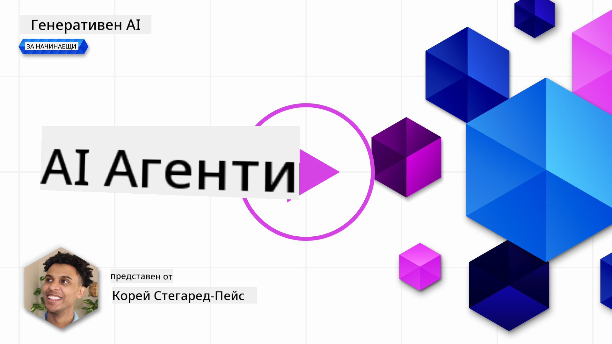
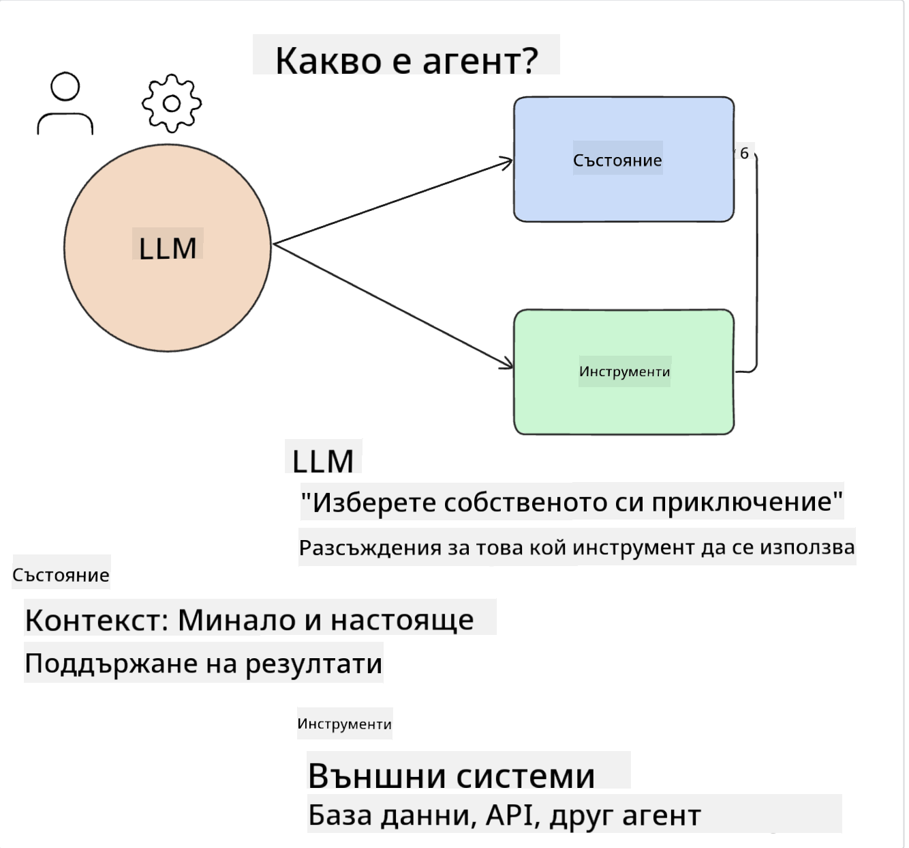
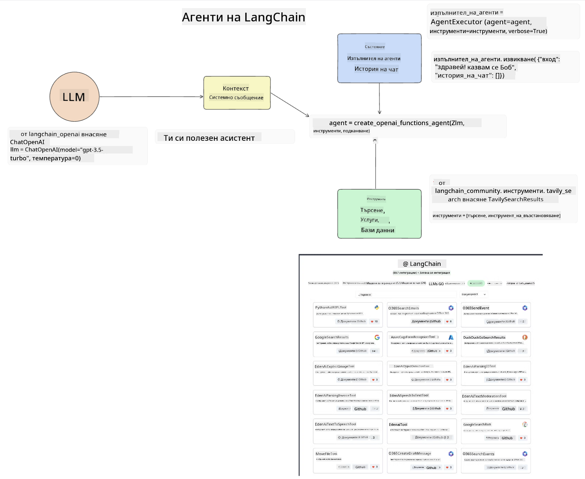
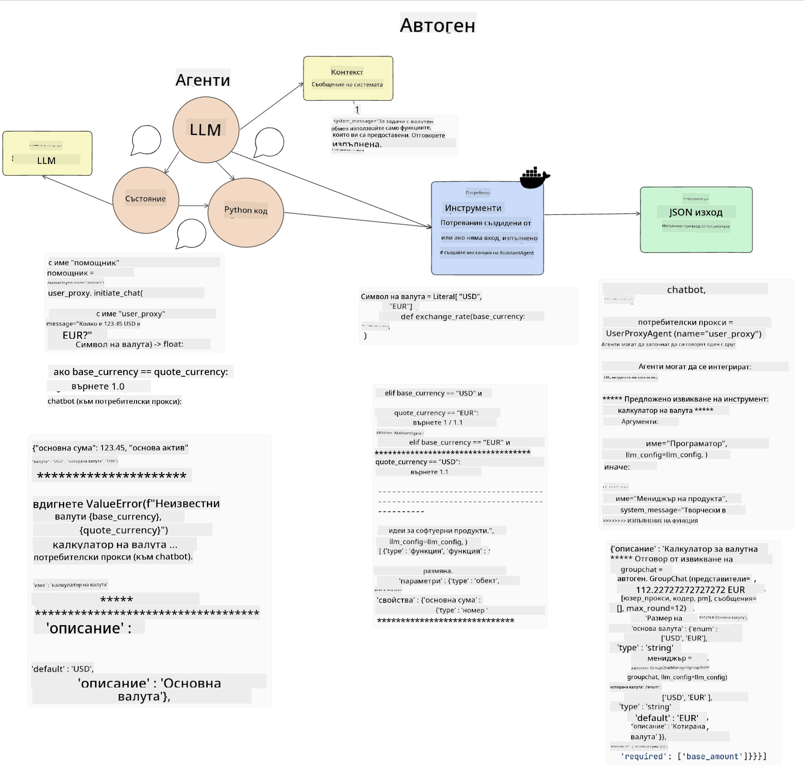
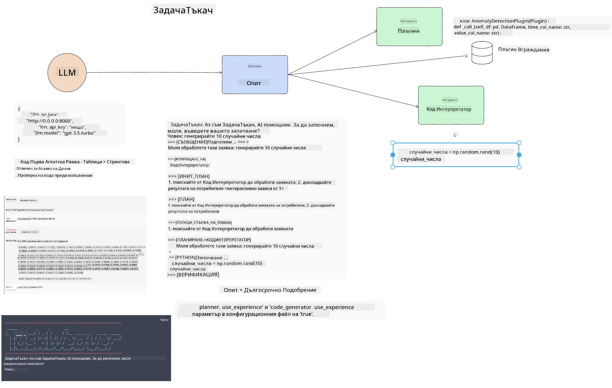
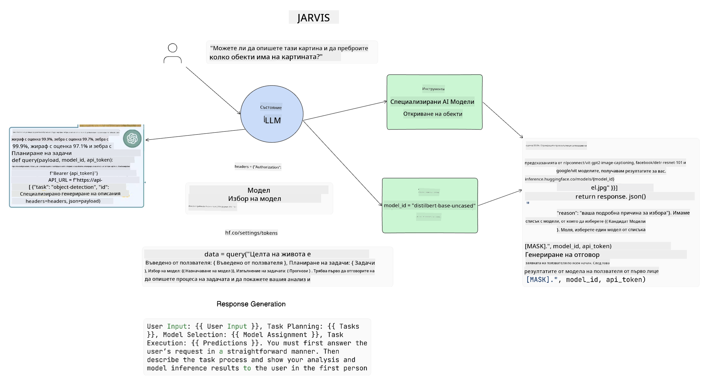

<!--
CO_OP_TRANSLATOR_METADATA:
{
  "original_hash": "11f03c81f190d9cbafd0f977dcbede6c",
  "translation_date": "2025-06-26T00:25:36+00:00",
  "source_file": "17-ai-agents/README.md",
  "language_code": "bg"
}
-->
[](https://aka.ms/gen-ai-lesson17-gh?WT.mc_id=academic-105485-koreyst)

## Въведение

AI Агентите представляват вълнуващо развитие в Генеративния AI, позволявайки на Големите Езикови Модели (LLMs) да се развиват от асистенти в агенти, способни да предприемат действия. Рамките за AI Агентите позволяват на разработчиците да създават приложения, които дават на LLMs достъп до инструменти и управление на състоянието. Тези рамки също така подобряват видимостта, позволявайки на потребителите и разработчиците да наблюдават действията, планирани от LLMs, като по този начин подобряват управлението на опита.

Урокът ще обхване следните области:

- Разбиране на това какво представлява AI Агент - Какво точно е AI Агент?
- Изследване на четири различни рамки за AI Агент - Какво ги прави уникални?
- Приложение на тези AI Агентите в различни случаи на употреба - Кога трябва да използваме AI Агентите?

## Цели на обучението

След този урок, ще можете:

- Да обясните какво представляват AI Агентите и как могат да бъдат използвани.
- Да разберете разликите между някои от популярните рамки за AI Агентите и как те се различават.
- Да разберете как функционират AI Агентите, за да изградите приложения с тях.

## Какво представляват AI Агентите?

AI Агентите са много вълнуваща област в света на Генеративния AI. С тази вълнуваща област понякога идва и объркване на термините и тяхното приложение. За да поддържаме нещата прости и включващи повечето инструменти, които се отнасят до AI Агентите, ще използваме следното определение:

AI Агентите позволяват на Големите Езикови Модели (LLMs) да изпълняват задачи, като им дават достъп до **състояние** и **инструменти**.



Нека дефинираме тези термини:

**Големи Езикови Модели** - Това са моделите, споменати в този курс, като GPT-3.5, GPT-4, Llama-2 и т.н.

**Състояние** - Това се отнася до контекста, в който работи LLM. LLM използва контекста на своите минали действия и текущия контекст, ръководейки своето вземане на решения за следващите действия. Рамките за AI Агентите позволяват на разработчиците да поддържат този контекст по-лесно.

**Инструменти** - За да завърши задачата, която потребителят е поискал и която LLM е планирал, LLM се нуждае от достъп до инструменти. Някои примери за инструменти могат да бъдат база данни, API, външно приложение или дори друг LLM!

Тези определения се надяваме да ви дадат добра основа, докато разглеждаме как се прилагат. Нека изследваме няколко различни рамки за AI Агентите:

## LangChain Агентите

[LangChain Агентите](https://python.langchain.com/docs/how_to/#agents?WT.mc_id=academic-105485-koreyst) са реализация на определенията, които предоставихме по-горе.

За управление на **състоянието**, използва вградена функция, наречена `AgentExecutor`. Тази функция приема дефинираните `agent` и `tools`, които са налични.

`Agent Executor` също съхранява историята на чата, за да предостави контекста на разговора.



LangChain предлага [каталог с инструменти](https://integrations.langchain.com/tools?WT.mc_id=academic-105485-koreyst), които могат да бъдат импортирани във вашето приложение, за което LLM може да получи достъп. Те са създадени от общността и екипа на LangChain.

Можете да дефинирате тези инструменти и да ги предадете на `Agent Executor`.

Видимостта е друг важен аспект, когато говорим за AI Агентите. Важно е за разработчиците на приложения да разбират кой инструмент използва LLM и защо. За това екипът на LangChain е разработил LangSmith.

## AutoGen

Следващата рамка за AI Агентите, която ще обсъдим, е [AutoGen](https://microsoft.github.io/autogen/?WT.mc_id=academic-105485-koreyst). Основният фокус на AutoGen е върху разговорите. Агентите са както **разговорни**, така и **персонализируеми**.

**Разговорни -** LLMs могат да започнат и продължат разговор с друг LLM, за да завършат задача. Това се прави чрез създаване на `AssistantAgents` и даване на специфично системно съобщение.

```python

autogen.AssistantAgent( name="Coder", llm_config=llm_config, ) pm = autogen.AssistantAgent( name="Product_manager", system_message="Creative in software product ideas.", llm_config=llm_config, )

```

**Персонализируеми** - Агентите могат да бъдат дефинирани не само като LLMs, но и като потребител или инструмент. Като разработчик, можете да дефинирате `UserProxyAgent`, който е отговорен за взаимодействие с потребителя за обратна връзка при изпълнение на задача. Тази обратна връзка може или да продължи изпълнението на задачата, или да я спре.

```python
user_proxy = UserProxyAgent(name="user_proxy")
```

### Състояние и Инструменти

За да променя и управлява състоянието, помощен Агент генерира Python код за изпълнение на задачата.

Ето пример за процеса:



#### LLM Дефиниран със Системно Съобщение

```python
system_message="For weather related tasks, only use the functions you have been provided with. Reply TERMINATE when the task is done."
```

Тези системни съобщения насочват конкретния LLM към това кои функции са релевантни за неговата задача. Помнете, с AutoGen можете да имате множество дефинирани AssistantAgents с различни системни съобщения.

#### Чатът е Иницииран от Потребителя

```python
user_proxy.initiate_chat( chatbot, message="I am planning a trip to NYC next week, can you help me pick out what to wear? ", )

```

Това съобщение от user_proxy (Човек) е това, което ще стартира процеса на Агентът да изследва възможните функции, които трябва да изпълни.

#### Функцията е Изпълнена

```bash
chatbot (to user_proxy):

***** Suggested tool Call: get_weather ***** Arguments: {"location":"New York City, NY","time_periond:"7","temperature_unit":"Celsius"} ******************************************************** --------------------------------------------------------------------------------

>>>>>>>> EXECUTING FUNCTION get_weather... user_proxy (to chatbot): ***** Response from calling function "get_weather" ***** 112.22727272727272 EUR ****************************************************************

```

След като първоначалният чат е обработен, Агентът ще изпрати предложен инструмент за извикване. В този случай това е функция, наречена `get_weather`. Depending on your configuration, this function can be automatically executed and read by the Agent or can be executed based on user input.

You can find a list of [AutoGen code samples](https://microsoft.github.io/autogen/docs/Examples/?WT.mc_id=academic-105485-koreyst) to further explore how to get started building.

## Taskweaver

The next agent framework we will explore is [Taskweaver](https://microsoft.github.io/TaskWeaver/?WT.mc_id=academic-105485-koreyst). It is known as a "code-first" agent because instead of working strictly with `strings` , it can work with DataFrames in Python. This becomes extremely useful for data analysis and generation tasks. This can be things like creating graphs and charts or generating random numbers.

### State and Tools

To manage the state of the conversation, TaskWeaver uses the concept of a `Planner`. The `Planner` is a LLM that takes the request from the users and maps out the tasks that need to be completed to fulfill this request.

To complete the tasks the `Planner` is exposed to the collection of tools called `Plugins`. Това могат да бъдат Python класове или общ кодов интерпретатор. Тези плъгини се съхраняват като вграждания, за да може LLM по-добре да търси правилния плъгин.



Ето пример за плъгин за обработка на откриване на аномалии:

```python
class AnomalyDetectionPlugin(Plugin): def __call__(self, df: pd.DataFrame, time_col_name: str, value_col_name: str):
```

Кодът се проверява преди изпълнение. Друга функция за управление на контекста в Taskweaver е `experience`. Experience allows for the context of a conversation to be stored over to the long term in a YAML file. This can be configured so that the LLM improves over time on certain tasks given that it is exposed to prior conversations.

## JARVIS

The last agent framework we will explore is [JARVIS](https://github.com/microsoft/JARVIS?tab=readme-ov-file?WT.mc_id=academic-105485-koreyst). What makes JARVIS unique is that it uses an LLM to manage the `state` на разговора и `tools` са други AI модели. Всеки от AI моделите са специализирани модели, които изпълняват определени задачи като откриване на обекти, транскрипция или надписване на изображения.



LLM, като общ модел, получава заявката от потребителя и идентифицира конкретната задача и всички аргументи/данни, които са необходими за изпълнение на задачата.

```python
[{"task": "object-detection", "id": 0, "dep": [-1], "args": {"image": "e1.jpg" }}]
```

LLM след това форматира заявката по начин, който специализираният AI модел може да интерпретира, като JSON. След като AI моделът върне своята прогноза въз основа на задачата, LLM получава отговора.

Ако са необходими множество модели за изпълнение на задачата, той също ще интерпретира отговора от тези модели, преди да ги обедини, за да генерира отговора към потребителя.

Примерът по-долу показва как това би работило, когато потребителят иска описание и брой на обектите в картинка:

## Задание

За да продължите своето обучение по AI Агентите, можете да изградите с AutoGen:

- Приложение, което симулира бизнес среща с различни отдели на образователен стартъп.
- Създайте системни съобщения, които насочват LLMs в разбирането на различни персонажи и приоритети, и позволете на потребителя да представи нова идея за продукт.
- LLM след това трябва да генерира последващи въпроси от всеки отдел, за да усъвършенства и подобри предложението и идеята за продукта.

## Обучението не спира тук, продължете пътуването

След като завършите този урок, разгледайте нашата [колекция за обучение по Генеративен AI](https://aka.ms/genai-collection?WT.mc_id=academic-105485-koreyst), за да продължите да развивате своите знания в областта на Генеративния AI!

**Отказ от отговорност**:  
Този документ е преведен с помощта на AI услуга за превод [Co-op Translator](https://github.com/Azure/co-op-translator). Докато се стремим към точност, моля, имайте предвид, че автоматизираните преводи могат да съдържат грешки или неточности. Оригиналният документ на неговия оригинален език трябва да се счита за авторитетен източник. За критична информация се препоръчва професионален човешки превод. Ние не носим отговорност за никакви недоразумения или погрешни тълкувания, произтичащи от използването на този превод.