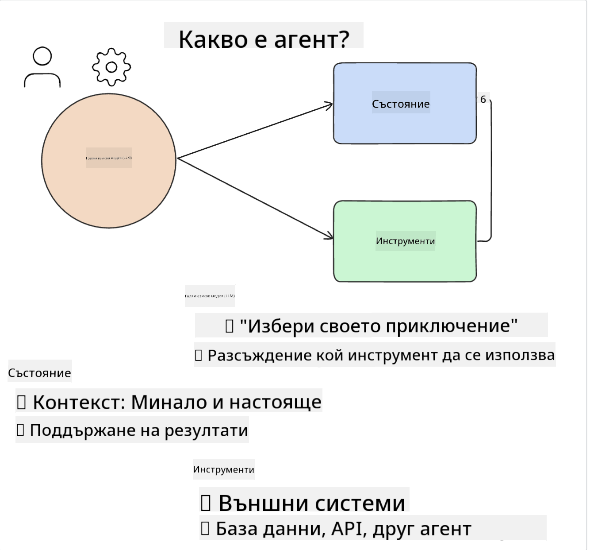
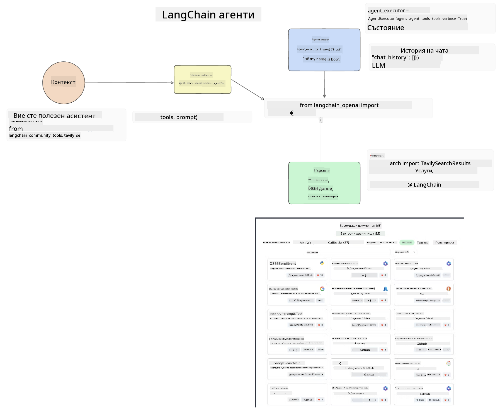
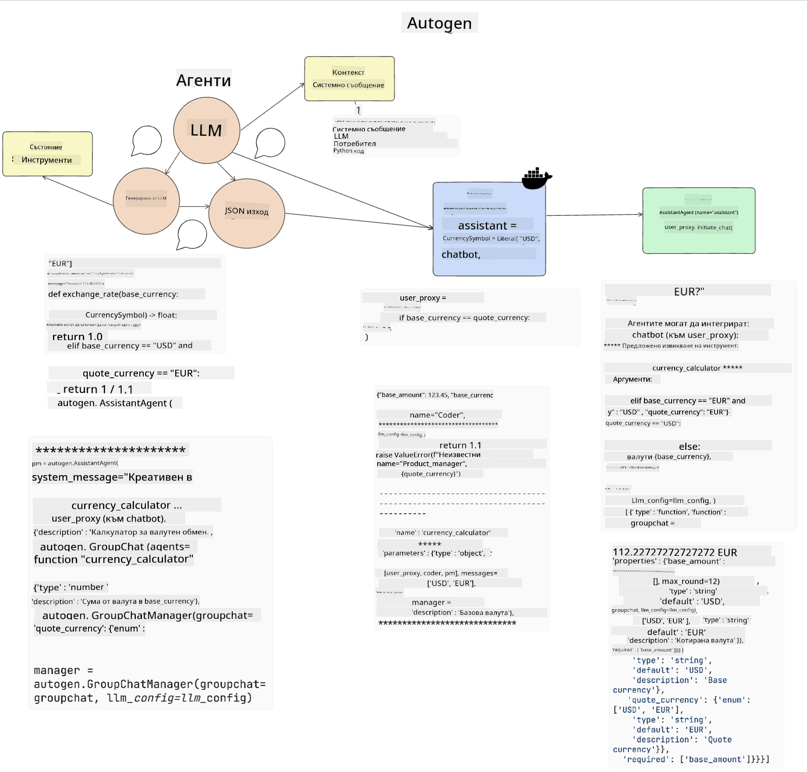
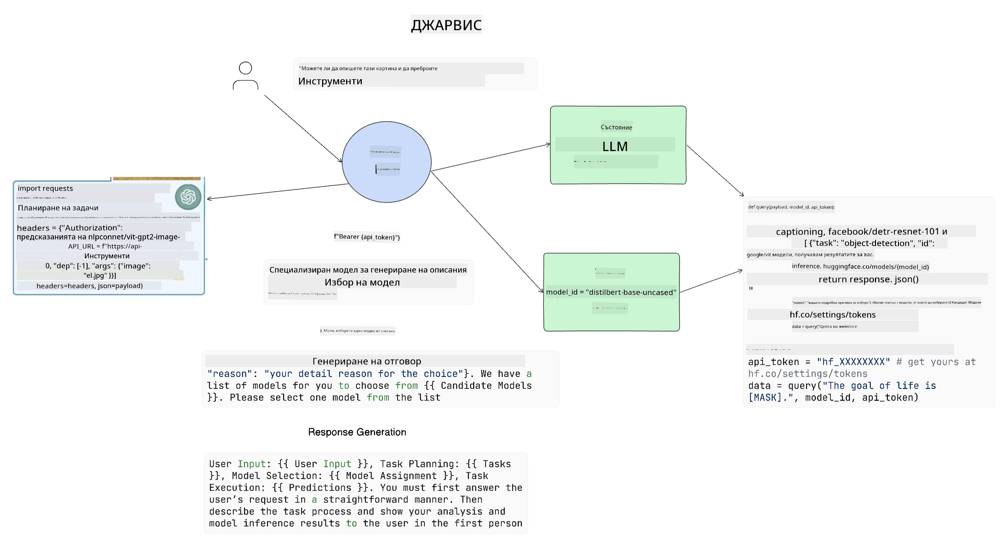

<!--
CO_OP_TRANSLATOR_METADATA:
{
  "original_hash": "8e8d1f6a63da606af7176a87ff8e92b6",
  "translation_date": "2025-10-17T22:23:06+00:00",
  "source_file": "17-ai-agents/README.md",
  "language_code": "bg"
}
-->
[](https://youtu.be/yAXVW-lUINc?si=bOtW9nL6jc3XJgOM)

## Въведение

AI агентите представляват вълнуващо развитие в областта на Генеративния AI, позволявайки на големите езикови модели (LLMs) да се развиват от асистенти в агенти, способни да предприемат действия. Рамките за AI агенти дават възможност на разработчиците да създават приложения, които предоставят на LLMs достъп до инструменти и управление на състоянието. Тези рамки също така подобряват видимостта, позволявайки на потребителите и разработчиците да наблюдават действията, планирани от LLMs, като по този начин подобряват управлението на опита.

Урокът ще обхване следните области:

- Разбиране какво представлява AI агент - Какво точно е AI агент?
- Изследване на четири различни рамки за AI агенти - Какво ги прави уникални?
- Приложение на тези AI агенти в различни случаи - Кога трябва да използваме AI агенти?

## Цели на обучението

След като преминете този урок, ще можете:

- Да обясните какво представляват AI агентите и как могат да бъдат използвани.
- Да разберете разликите между някои от популярните рамки за AI агенти и как се различават.
- Да разберете как функционират AI агентите, за да изграждате приложения с тях.

## Какво представляват AI агентите?

AI агентите са много вълнуваща област в света на Генеративния AI. С това вълнение понякога идва и объркване относно термините и тяхното приложение. За да опростим нещата и да включим повечето инструменти, които се отнасят до AI агенти, ще използваме следното определение:

AI агентите позволяват на големите езикови модели (LLMs) да изпълняват задачи, като им предоставят достъп до **състояние** и **инструменти**.



Нека дефинираме тези термини:

**Големи езикови модели** - Това са моделите, споменати в този курс, като GPT-3.5, GPT-4, Llama-2 и др.

**Състояние** - Това се отнася до контекста, в който LLM работи. LLM използва контекста на своите предишни действия и текущия контекст, за да насочва вземането на решения за следващите действия. Рамките за AI агенти позволяват на разработчиците да поддържат този контекст по-лесно.

**Инструменти** - За да изпълни задачата, която потребителят е поискал и която LLM е планирал, LLM се нуждае от достъп до инструменти. Някои примери за инструменти могат да бъдат база данни, API, външно приложение или дори друг LLM!

Тези определения се надяваме да ви дадат добра основа за напред, докато разглеждаме как се прилагат. Нека разгледаме няколко различни рамки за AI агенти:

## LangChain агенти

[LangChain агенти](https://python.langchain.com/docs/how_to/#agents?WT.mc_id=academic-105485-koreyst) са реализация на определенията, които предоставихме по-горе.

За управление на **състоянието** се използва вградена функция, наречена `AgentExecutor`. Тя приема дефинирания `agent` и наличните за него `tools`.

`AgentExecutor` също така съхранява историята на чата, за да предостави контекста на разговора.



LangChain предлага [каталог с инструменти](https://integrations.langchain.com/tools?WT.mc_id=academic-105485-koreyst), които могат да бъдат импортирани във вашето приложение, за да получи LLM достъп до тях. Те са създадени от общността и екипа на LangChain.

След това можете да дефинирате тези инструменти и да ги предадете на `AgentExecutor`.

Видимостта е друг важен аспект, когато става въпрос за AI агенти. Важно е разработчиците на приложения да разбират кой инструмент използва LLM и защо. За тази цел екипът на LangChain е разработил LangSmith.

## AutoGen

Следващата рамка за AI агенти, която ще обсъдим, е [AutoGen](https://microsoft.github.io/autogen/?WT.mc_id=academic-105485-koreyst). Основният фокус на AutoGen е върху разговорите. Агенти са едновременно **разговорливи** и **персонализируеми**.

**Разговорливи -** LLMs могат да започнат и продължат разговор с друг LLM, за да изпълнят задача. Това се прави чрез създаване на `AssistantAgents` и предоставяне на специфично системно съобщение.

```python

autogen.AssistantAgent( name="Coder", llm_config=llm_config, ) pm = autogen.AssistantAgent( name="Product_manager", system_message="Creative in software product ideas.", llm_config=llm_config, )

```

**Персонализируеми** - Агенти могат да бъдат дефинирани не само като LLMs, но и като потребител или инструмент. Като разработчик, можете да дефинирате `UserProxyAgent`, който е отговорен за взаимодействие с потребителя за обратна връзка при изпълнение на задача. Тази обратна връзка може или да продължи изпълнението на задачата, или да го спре.

```python
user_proxy = UserProxyAgent(name="user_proxy")
```

### Състояние и инструменти

За да променя и управлява състоянието, асистент агент генерира Python код за изпълнение на задачата.

Ето пример за процеса:



#### LLM, дефиниран със системно съобщение

```python
system_message="For weather related tasks, only use the functions you have been provided with. Reply TERMINATE when the task is done."
```

Това системно съобщение насочва конкретния LLM към функциите, които са релевантни за неговата задача. Запомнете, че с AutoGen можете да имате множество дефинирани AssistantAgents с различни системни съобщения.

#### Чатът се инициира от потребителя

```python
user_proxy.initiate_chat( chatbot, message="I am planning a trip to NYC next week, can you help me pick out what to wear? ", )

```

Това съобщение от user_proxy (човек) е това, което ще започне процеса на агента да изследва възможните функции, които трябва да изпълни.

#### Функцията се изпълнява

```bash
chatbot (to user_proxy):

***** Suggested tool Call: get_weather ***** Arguments: {"location":"New York City, NY","time_periond:"7","temperature_unit":"Celsius"} ******************************************************** --------------------------------------------------------------------------------

>>>>>>>> EXECUTING FUNCTION get_weather... user_proxy (to chatbot): ***** Response from calling function "get_weather" ***** 112.22727272727272 EUR ****************************************************************

```

След като първоначалният чат бъде обработен, агентът ще предложи инструмент за използване. В този случай това е функция, наречена `get_weather`. В зависимост от вашата конфигурация, тази функция може да бъде автоматично изпълнена и прочетена от агента или да бъде изпълнена въз основа на вход от потребителя.

Можете да намерите списък с [примерни кодове на AutoGen](https://microsoft.github.io/autogen/docs/Examples/?WT.mc_id=academic-105485-koreyst), за да разгледате по-подробно как да започнете да изграждате.

## Taskweaver

Следващата рамка за агенти, която ще разгледаме, е [Taskweaver](https://microsoft.github.io/TaskWeaver/?WT.mc_id=academic-105485-koreyst). Тя е известна като агент "първо код", защото вместо да работи строго със `strings`, може да работи с DataFrames в Python. Това става изключително полезно за задачи, свързани с анализ на данни и генериране. Това може да включва създаване на графики и диаграми или генериране на случайни числа.

### Състояние и инструменти

За управление на състоянието на разговора TaskWeaver използва концепцията за `Planner`. `Planner` е LLM, който приема заявката от потребителите и планира задачите, които трябва да бъдат изпълнени, за да се изпълни тази заявка.

За да изпълни задачите, `Planner` има достъп до колекция от инструменти, наречени `Plugins`. Това могат да бъдат Python класове или общ интерпретатор на код. Тези плъгини се съхраняват като embeddings, за да може LLM по-добре да търси правилния плъгин.


Ето пример за плъгин за обработка на откриване на аномалии:

```python
class AnomalyDetectionPlugin(Plugin): def __call__(self, df: pd.DataFrame, time_col_name: str, value_col_name: str):
```

Кодът се проверява преди изпълнение. Друга функция за управление на контекста в Taskweaver е `experience`. Experience позволява контекстът на разговор да се съхранява дългосрочно в YAML файл. Това може да бъде конфигурирано така, че LLM да се подобрява с времето при определени задачи, като се излага на предишни разговори.

## JARVIS

Последната рамка за агенти, която ще разгледаме, е [JARVIS](https://github.com/microsoft/JARVIS?tab=readme-ov-file?WT.mc_id=academic-105485-koreyst). Това, което прави JARVIS уникален, е, че използва LLM за управление на `състоянието` на разговора, а `инструментите` са други AI модели. Всеки от AI моделите е специализиран модел, който изпълнява определени задачи като разпознаване на обекти, транскрипция или описание на изображения.



LLM, като общ модел, получава заявката от потребителя и идентифицира конкретната задача и всички аргументи/данни, които са необходими за изпълнение на задачата.

```python
[{"task": "object-detection", "id": 0, "dep": [-1], "args": {"image": "e1.jpg" }}]
```

LLM след това форматира заявката по начин, който специализираният AI модел може да интерпретира, като JSON. След като AI моделът върне своята прогноза въз основа на задачата, LLM получава отговора.

Ако са необходими множество модели за изпълнение на задачата, той също така интерпретира отговора от тези модели, преди да ги обедини, за да генерира отговор за потребителя.

Примерът по-долу показва как това би работило, когато потребителят поиска описание и броене на обектите в снимка:

## Задача

За да продължите обучението си за AI агенти, можете да изградите с AutoGen:

- Приложение, което симулира бизнес среща с различни отдели на стартираща компания в сферата на образованието.
- Създайте системни съобщения, които насочват LLMs към разбирането на различни роли и приоритети, и позволете на потребителя да представи идея за нов продукт.
- LLM след това трябва да генерира последващи въпроси от всеки отдел, за да усъвършенства и подобри представянето и идеята за продукта.

## Обучението не спира тук, продължете своето пътешествие

След като завършите този урок, разгледайте нашата [колекция за обучение по Генеративен AI](https://aka.ms/genai-collection?WT.mc_id=academic-105485-koreyst), за да продължите да развивате знанията си за Генеративния AI!

---

**Отказ от отговорност**:  
Този документ е преведен с помощта на AI услуга за превод [Co-op Translator](https://github.com/Azure/co-op-translator). Въпреки че се стремим към точност, моля, имайте предвид, че автоматизираните преводи може да съдържат грешки или неточности. Оригиналният документ на неговия роден език трябва да се счита за авторитетен източник. За критична информация се препоръчва професионален човешки превод. Ние не носим отговорност за каквито и да било недоразумения или погрешни интерпретации, произтичащи от използването на този превод.