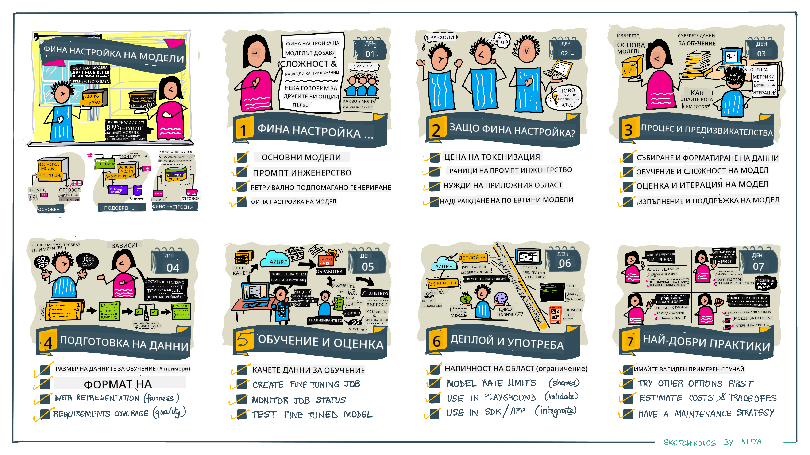

<!--
CO_OP_TRANSLATOR_METADATA:
{
  "original_hash": "68664f7e754a892ae1d8d5e2b7bd2081",
  "translation_date": "2025-07-09T17:50:00+00:00",
  "source_file": "18-fine-tuning/README.md",
  "language_code": "bg"
}
-->

# Фина настройка на вашия LLM

Използването на големи езикови модели за създаване на генеративни AI приложения носи нови предизвикателства. Един от ключовите въпроси е осигуряването на качество на отговорите (точност и релевантност) в съдържанието, генерирано от модела за дадена потребителска заявка. В предишните уроци разгледахме техники като prompt engineering и retrieval-augmented generation, които се опитват да решат проблема чрез _модифициране на входния prompt_ към съществуващия модел.

В днешния урок ще обсъдим трета техника, **фина настройка**, която се стреми да реши предизвикателството чрез _претрениране на самия модел_ с допълнителни данни. Нека разгледаме детайлите.

## Учебни цели

Този урок въвежда концепцията за фина настройка на предварително обучени езикови модели, разглежда ползите и предизвикателствата на този подход и дава насоки кога и как да използвате фина настройка, за да подобрите представянето на вашите генеративни AI модели.

Към края на урока трябва да можете да отговорите на следните въпроси:

- Какво представлява фина настройка за езикови модели?
- Кога и защо е полезна фина настройка?
- Как мога да фина настройвам предварително обучен модел?
- Какви са ограниченията на фина настройка?

Готови ли сте? Да започваме.

## Илюстрирано ръководство

Искате ли да получите обща представа за това, което ще разгледаме, преди да навлезем в детайлите? Вижте това илюстрирано ръководство, което описва учебния път за този урок – от изучаване на основните концепции и мотивацията за фина настройка, до разбирането на процеса и най-добрите практики за изпълнение на задачата по фина настройка. Това е увлекателна тема за изследване, затова не забравяйте да посетите страницата с [Ресурси](./RESOURCES.md?WT.mc_id=academic-105485-koreyst) за допълнителни връзки, които да подпомогнат вашето самостоятелно обучение!

## Какво е фина настройка за езикови модели?

По дефиниция, големите езикови модели са _предварително обучени_ върху големи количества текст, събран от различни източници, включително интернет. Както научихме в предишните уроци, имаме нужда от техники като _prompt engineering_ и _retrieval-augmented generation_, за да подобрим качеството на отговорите на модела на въпросите на потребителя („prompts“).

Популярна техника в prompt engineering е да се даде на модела повече насоки за това какво се очаква в отговора, като се предоставят _инструкции_ (явни насоки) или _няколко примера_ (косвени насоки). Това се нарича _few-shot learning_, но има две ограничения:

- Ограниченията на броя токени на модела могат да ограничат броя на примерите, които можете да дадете, и да намалят ефективността.
- Разходите за токени могат да направят добавянето на примери към всеки prompt скъпо и да ограничат гъвкавостта.

Фината настройка е често използвана практика в машинното обучение, при която взимаме предварително обучен модел и го претренираме с нови данни, за да подобрим представянето му по конкретна задача. В контекста на езиковите модели можем да фина настройваме предварително обучен модел _с подбрана селекция от примери за дадена задача или приложна област_, за да създадем **персонализиран модел**, който може да бъде по-точен и релевантен за конкретната задача или област. Допълнително предимство на фина настройка е, че може да намали броя на необходимите примери за few-shot learning – намалявайки използването на токени и свързаните с това разходи.

## Кога и защо трябва да фина настройваме модели?

В _този_ контекст, когато говорим за фина настройка, имаме предвид **супервизирана** фина настройка, при която претренирането се извършва чрез **добавяне на нови данни**, които не са били част от оригиналния тренировъчен набор. Това се различава от несупервизирания подход, при който моделът се претренира върху оригиналните данни, но с различни хиперпараметри.

Ключовото, което трябва да запомните, е, че фина настройка е напреднала техника, която изисква определено ниво на експертиза, за да се постигнат желаните резултати. Ако се направи неправилно, може да не донесе очакваните подобрения и дори да влоши представянето на модела за вашата целева област.

Затова, преди да научите „как“ да фина настройвате езикови модели, трябва да знаете „защо“ да изберете този път и „кога“ да започнете процеса на фина настройка. Започнете, като си зададете следните въпроси:

- **Случай на употреба**: Какъв е вашият _случай на употреба_ за фина настройка? Кой аспект на текущия предварително обучен модел искате да подобрите?
- **Алтернативи**: Опитвали ли сте _други техники_, за да постигнете желаните резултати? Използвайте ги, за да създадете базова линия за сравнение.
  - Prompt engineering: Опитайте техники като few-shot prompting с примери за релевантни отговори на prompt-ове. Оценете качеството на отговорите.
  - Retrieval Augmented Generation: Опитайте да обогатите prompt-овете с резултати от търсене във вашите данни. Оценете качеството на отговорите.
- **Разходи**: Идентифицирали ли сте разходите за фина настройка?
  - Възможност за настройка – наличен ли е предварително обученият модел за фина настройка?
  - Усилия – за подготовка на тренировъчни данни, оценка и усъвършенстване на модела.
  - Изчислителни ресурси – за изпълнение на задачите по фина настройка и разгръщане на фино настроения модел.
  - Данни – достъп до достатъчно качествени примери за ефективна фина настройка.
- **Ползи**: Потвърдили ли сте ползите от фина настройка?
  - Качество – надмина ли фино настроеният модел базовия?
  - Разходи – намалява ли използването на токени чрез опростяване на prompt-овете?
  - Разширяемост – можете ли да използвате базовия модел за нови области?

Отговаряйки на тези въпроси, трябва да можете да решите дали фина настройка е правилният подход за вашия случай. Идеално, подходът е валиден само ако ползите надвишават разходите. След като решите да продължите, е време да помислите _как_ да фина настройвате предварително обучен модел.

Искате ли повече информация за процеса на вземане на решение? Гледайте [To fine-tune or not to fine-tune](https://www.youtube.com/watch?v=0Jo-z-MFxJs)

## Как можем да фина настройваме предварително обучен модел?

За да фина настройвате предварително обучен модел, трябва да имате:

- предварително обучен модел за фина настройка
- набор от данни за фина настройка
- тренировъчна среда за изпълнение на задачата по фина настройка
- хостинг среда за разгръщане на фино настроения модел

## Фина настройка в действие

Следните ресурси предоставят стъпка по стъпка уроци, които ви водят през реален пример с избран модел и подбран набор от данни. За да работите с тези уроци, ви е необходим акаунт при съответния доставчик, както и достъп до съответния модел и набори от данни.

| Доставчик   | Урок                                                                                                                                                                         | Описание                                                                                                                                                                                                                                                                                                                                                                                                                          |
| ----------- | ---------------------------------------------------------------------------------------------------------------------------------------------------------------------------- | -------------------------------------------------------------------------------------------------------------------------------------------------------------------------------------------------------------------------------------------------------------------------------------------------------------------------------------------------------------------------------------------------------------------------------- |
| OpenAI      | [How to fine-tune chat models](https://github.com/openai/openai-cookbook/blob/main/examples/How_to_finetune_chat_models.ipynb?WT.mc_id=academic-105485-koreyst)              | Научете как да фина настройвате `gpt-35-turbo` за конкретна област („асистент за рецепти“) чрез подготовка на тренировъчни данни, изпълнение на задачата по фина настройка и използване на фино настроения модел за извличане на отговори.                                                                                                                                                                                     |
| Azure OpenAI| [GPT 3.5 Turbo fine-tuning tutorial](https://learn.microsoft.com/azure/ai-services/openai/tutorials/fine-tune?tabs=python-new%2Ccommand-line?WT.mc_id=academic-105485-koreyst) | Научете как да фина настройвате модел `gpt-35-turbo-0613` **в Azure**, като създавате и качвате тренировъчни данни, изпълнявате задачата по фина настройка, разгръщате и използвате новия модел.                                                                                                                                                                                                                                   |
| Hugging Face| [Fine-tuning LLMs with Hugging Face](https://www.philschmid.de/fine-tune-llms-in-2024-with-trl?WT.mc_id=academic-105485-koreyst)                                           | Този блог пост ви води през фина настройка на _отворен LLM_ (например `CodeLlama 7B`) с помощта на библиотеката [transformers](https://huggingface.co/docs/transformers/index?WT.mc_id=academic-105485-koreyst) и [Transformer Reinforcement Learning (TRL)](https://huggingface.co/docs/trl/index?WT.mc_id=academic-105485-koreyst) с отворени [набори от данни](https://huggingface.co/docs/datasets/index?WT.mc_id=academic-105485-koreyst) в Hugging Face. |
|             |                                                                                                                                                                              |                                                                                                                                                                                                                                                                                                                                                                                                                                  |
| 🤗 AutoTrain| [Fine-tuning LLMs with AutoTrain](https://github.com/huggingface/autotrain-advanced/?WT.mc_id=academic-105485-koreyst)                                                       | AutoTrain (или AutoTrain Advanced) е Python библиотека, разработена от Hugging Face, която позволява фина настройка за много различни задачи, включително LLM фина настройка. AutoTrain е решение без код и фина настройка може да се извърши във вашия собствен облак, в Hugging Face Spaces или локално. Поддържа уеб базиран GUI, CLI и обучение чрез yaml конфигурационни файлове.                                                                                 |
|             |                                                                                                                                                                              |                                                                                                                                                                                                                                                                                                                                                                                                                                  |

## Задача

Изберете един от горните уроци и го преминете. _Може да създадем версия на тези уроци в Jupyter Notebooks в това хранилище само за справка. Моля, използвайте оригиналните източници директно, за да получите най-актуалните версии_.

## Отлична работа! Продължете с обучението си.

След като завършите този урок, разгледайте нашата [колекция за обучение по генеративен AI](https://aka.ms/genai-collection?WT.mc_id=academic-105485-koreyst), за да продължите да развивате знанията си в областта на генеративния AI!

Поздравления!! Завършихте последния урок от серията v2 за този курс! Не спирайте да учите и да създавате. \*\*Разгледайте страницата с [РЕСУРСИ](RESOURCES.md?WT.mc_id=academic-105485-koreyst) за списък с допълнителни предложения по тази тема.

Нашата серия уроци v1 също е обновена с повече задачи и концепции. Отделете минута да освежите знанията си – и моля, [споделете въпросите и обратната си връзка](https://github.com/microsoft/generative-ai-for-beginners/issues?WT.mc_id=academic-105485-koreyst), за да ни помогнете да подобрим тези уроци за общността.

**Отказ от отговорност**:  
Този документ е преведен с помощта на AI преводаческа услуга [Co-op Translator](https://github.com/Azure/co-op-translator). Въпреки че се стремим към точност, моля, имайте предвид, че автоматизираните преводи могат да съдържат грешки или неточности. Оригиналният документ на неговия роден език трябва да се счита за авторитетен източник. За критична информация се препоръчва професионален човешки превод. Ние не носим отговорност за каквито и да е недоразумения или неправилни тълкувания, произтичащи от използването на този превод.