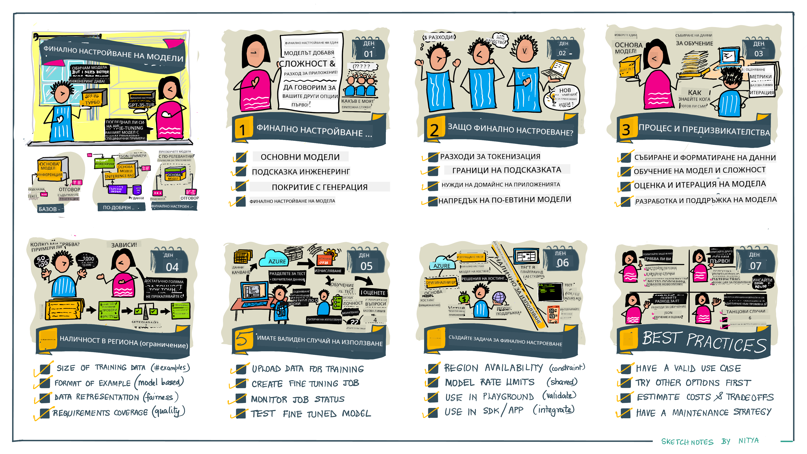

<!--
CO_OP_TRANSLATOR_METADATA:
{
  "original_hash": "68664f7e754a892ae1d8d5e2b7bd2081",
  "translation_date": "2025-05-20T07:59:03+00:00",
  "source_file": "18-fine-tuning/README.md",
  "language_code": "bg"
}
-->

# Финално Настройване на Вашия LLM

Използването на големи езикови модели за изграждане на приложения за генерираща AI води до нови предизвикателства. Основен проблем е осигуряването на качеството на отговорите (точност и релевантност) в съдържанието, генерирано от модела за дадена потребителска заявка. В предишните уроци обсъдихме техники като инженеринг на подканите и генериране с добавено извличане, които се опитват да решат проблема чрез _модифициране на входа на подканата_ към съществуващия модел.

В днешния урок обсъждаме трета техника, **финално настройване**, която се опитва да се справи с предизвикателството чрез _повторно обучение на самия модел_ с допълнителни данни. Нека се потопим в подробностите.

## Учебни Цели

Този урок въвежда концепцията за финално настройване на предварително обучени езикови модели, изследва ползите и предизвикателствата на този подход и предоставя насоки кога и как да използвате финално настройване за подобряване на представянето на вашите генериращи AI модели.

До края на този урок трябва да можете да отговорите на следните въпроси:

- Какво е финално настройване за езикови модели?
- Кога и защо е полезно финалното настройване?
- Как мога да финално настроя предварително обучен модел?
- Какви са ограниченията на финалното настройване?

Готови ли сте? Да започваме.

## Илюстрирано Ръководство

Искате ли да получите обща представа за това, което ще покрием, преди да се потопим? Разгледайте това илюстрирано ръководство, което описва учебното пътуване за този урок - от изучаване на основните концепции и мотивация за финално настройване, до разбиране на процеса и най-добрите практики за изпълнение на задачата за финално настройване. Това е завладяваща тема за изследване, така че не забравяйте да проверите страницата [Resources](./RESOURCES.md?WT.mc_id=academic-105485-koreyst) за допълнителни връзки, които да подкрепят вашето самостоятелно учебно пътуване!

## Какво е финално настройване за езикови модели?

По дефиниция, големите езикови модели са _предварително обучени_ върху големи количества текст, извлечен от разнообразни източници, включително интернет. Както научихме в предишните уроци, имаме нужда от техники като _инженеринг на подканите_ и _генериране с добавено извличане_, за да подобрим качеството на отговорите на модела на въпросите на потребителя ("подканите").

Популярна техника за инженеринг на подканите включва даване на модела повече насоки за това, което се очаква в отговора, като се предоставят _инструкции_ (експлицитни насоки) или _даването му на няколко примера_ (имплицитни насоки). Това се нарича _обучение с малко примери_, но има две ограничения:

- Ограниченията на токените на модела могат да ограничат броя на примерите, които можете да дадете, и да ограничат ефективността.
- Разходите за токени на модела могат да направят скъпо добавянето на примери към всяка подканата и да ограничат гъвкавостта.

Финалното настройване е обичайна практика в системите за машинно обучение, където вземаме предварително обучен модел и го обучаваме отново с нови данни, за да подобрим представянето му на конкретна задача. В контекста на езиковите модели можем да финално настроим предварително обучен модел _с подбрана серия от примери за дадена задача или приложение_, за да създадем **персонализиран модел**, който може да бъде по-точен и релевантен за конкретната задача или домейн. Странична полза от финалното настройване е, че то може също да намали броя на необходимите примери за обучение с малко примери - намалявайки използването на токени и свързаните разходи.

## Кога и защо трябва да финално настроим модели?

В _този_ контекст, когато говорим за финално настройване, имаме предвид **супервизирано** финално настройване, където повторното обучение се извършва чрез **добавяне на нови данни**, които не са били част от оригиналния тренировъчен набор от данни. Това е различно от несупервизирано финално настройване, където моделът се обучава отново върху оригиналните данни, но с различни хиперпараметри.

Основното, което трябва да запомните, е че финалното настройване е усъвършенствана техника, която изисква определено ниво на експертиза, за да се постигнат желаните резултати. Ако не се извърши правилно, то може да не предостави очакваните подобрения и дори да влоши представянето на модела за вашия целеви домейн.

Затова, преди да научите "как" да финално настроите езикови модели, трябва да знаете "защо" трябва да изберете този път и "кога" да започнете процеса на финално настройване. Започнете, като си зададете тези въпроси:

- **Случай на Използване**: Какъв е вашият _случай на използване_ за финално настройване? Какъв аспект на текущия предварително обучен модел искате да подобрите?
- **Алтернативи**: Опитали ли сте _други техники_ за постигане на желаните резултати? Използвайте ги, за да създадете базова линия за сравнение.
  - Инженеринг на подканите: Опитайте техники като подканване с малко примери с примери на релевантни отговори на подканите. Оценете качеството на отговорите.
  - Генериране с Добавено Извличане: Опитайте да добавите подканите с резултати от заявки, извлечени чрез търсене във вашите данни. Оценете качеството на отговорите.
- **Разходи**: Идентифицирали ли сте разходите за финално настройване?
  - Настройваемост - наличен ли е предварително обучен модел за финално настройване?
  - Усилие - за подготовка на тренировъчни данни, оценка и усъвършенстване на модела.
  - Изчисления - за изпълнение на задачи за финално настройване и разгръщане на финално настроен модел.
  - Данни - достъп до достатъчно качествени примери за влияние на финалното настройване.
- **Ползи**: Потвърдили ли сте ползите от финалното настройване?
  - Качество - надмина ли финално настроеният модел базовата линия?
  - Разходи - намалява ли използването на токени чрез опростяване на подканите?
  - Разширяемост - можете ли да преизползвате базовия модел за нови домейни?

Отговаряйки на тези въпроси, трябва да можете да решите дали финалното настройване е правилният подход за вашия случай на използване. Идеално, подходът е валиден само ако ползите надвишават разходите. След като решите да продължите, време е да помислите _как_ можете да финално настроите предварително обучен модел.

Искате ли да получите повече прозрения за процеса на вземане на решения? Гледайте [Да финално настроим или не](https://www.youtube.com/watch?v=0Jo-z-MFxJs)

## Как можем да финално настроим предварително обучен модел?

За да финално настроите предварително обучен модел, трябва да имате:

- предварително обучен модел за финално настройване
- набор от данни за използване при финалното настройване
- тренировъчна среда за изпълнение на задачата за финално настройване
- хостинг среда за разгръщане на финално настроен модел

## Финално Настройване в Действие

Следните ресурси предоставят стъпка по стъпка уроци, които ще ви преведат през реален пример, използвайки избран модел с подбран набор от данни. За да преминете през тези уроци, ви е необходим акаунт при конкретния доставчик, заедно с достъп до съответния модел и набори от данни.

| Доставчик    | Урок                                                                                                                                                                       | Описание                                                                                                                                                                                                                                                                                                                                                                                                                        |
| ------------ | ------------------------------------------------------------------------------------------------------------------------------------------------------------------------------ | ---------------------------------------------------------------------------------------------------------------------------------------------------------------------------------------------------------------------------------------------------------------------------------------------------------------------------------------------------------------------------------------------------------------------------------- |
| OpenAI       | [Как да финално настроим модели за чат](https://github.com/openai/openai-cookbook/blob/main/examples/How_to_finetune_chat_models.ipynb?WT.mc_id=academic-105485-koreyst)                | Научете се да финално настроите `gpt-35-turbo` за конкретен домейн ("асистент за рецепти") чрез подготовка на тренировъчни данни, изпълнение на задачата за финално настройване и използване на финално настроения модел за изводи.                                                                                                                                                                                                                                              |
| Azure OpenAI | [Урок за финално настройване на GPT 3.5 Turbo](https://learn.microsoft.com/azure/ai-services/openai/tutorials/fine-tune?tabs=python-new%2Ccommand-line?WT.mc_id=academic-105485-koreyst) | Научете се да финално настроите `gpt-35-turbo-0613` модел **в Azure** чрез предприемане на стъпки за създаване и качване на тренировъчни данни, изпълнение на задачата за финално настройване. Разгръщане и използване на новия модел.                                                                                                                                                                                                                                                                 |
| Hugging Face | [Финално настройване на LLMs с Hugging Face](https://www.philschmid.de/fine-tune-llms-in-2024-with-trl?WT.mc_id=academic-105485-koreyst)                                               | Тази публикация в блога ви превежда през финално настройване на _отворен LLM_ (напр. `CodeLlama 7B`) използвайки библиотеката [transformers](https://huggingface.co/docs/transformers/index?WT.mc_id=academic-105485-koreyst) и [Transformer Reinforcement Learning (TRL)](https://huggingface.co/docs/trl/index?WT.mc_id=academic-105485-koreyst]) с отворени [набори от данни](https://huggingface.co/docs/datasets/index?WT.mc_id=academic-105485-koreyst) на Hugging Face. |
|              |                                                                                                                                                                                |                                                                                                                                                                                                                                                                                                                                                                                                                                    |
| 🤗 AutoTrain | [Финално настройване на LLMs с AutoTrain](https://github.com/huggingface/autotrain-advanced/?WT.mc_id=academic-105485-koreyst)                                                         | AutoTrain (или AutoTrain Advanced) е библиотека на Python, разработена от Hugging Face, която позволява финално настройване за много различни задачи, включително финално настройване на LLM. AutoTrain е решение без код и финално настройване може да се извърши в вашия собствен облак, на Hugging Face Spaces или локално. Поддържа както уеб-базиран GUI, CLI и обучение чрез yaml конфигурационни файлове.                                                                               |
|              |                                                                                                                                                                                |                                                                                                                                                                                                                                                                                                                                                                                                                                    |

## Задание

Изберете един от горепосочените уроци и преминете през него. _Можем да репликираме версия на тези уроци в Jupyter Notebooks в този репо за справка само. Моля, използвайте оригиналните източници директно, за да получите последните версии_.

## Отлична Работа! Продължете Вашето Обучение.

След завършване на този урок, разгледайте нашата [Колекция за Обучение по Генерираща AI](https://aka.ms/genai-collection?WT.mc_id=academic-105485-koreyst), за да продължите да повишавате вашите знания за Генерираща AI!

Поздравления!! Завършихте последния урок от v2 серията за този курс! Не спирайте да учите и изграждате. \*\*Разгледайте страницата [RESOURCES](RESOURCES.md?WT.mc_id=academic-105485-koreyst) за списък с допълнителни предложения само за тази тема.

Нашата v1 серия от уроци също е актуализирана с повече задания и концепции. Така че отделете минута да освежите знанията си - и моля [споделете вашите въпроси и обратна връзка](https://github.com/microsoft/generative-ai-for-beginners/issues?WT.mc_id=academic-105485-koreyst), за да ни помогнете да подобрим тези уроци за общността.

**Отказ от отговорност**:  
Този документ е преведен с помощта на AI услуга за превод [Co-op Translator](https://github.com/Azure/co-op-translator). Въпреки че се стремим към точност, моля, имайте предвид, че автоматизираните преводи може да съдържат грешки или неточности. Оригиналният документ на неговия роден език трябва да се счита за авторитетен източник. За критична информация се препоръчва професионален човешки превод. Не носим отговорност за недоразумения или погрешни тълкувания, произтичащи от използването на този превод.