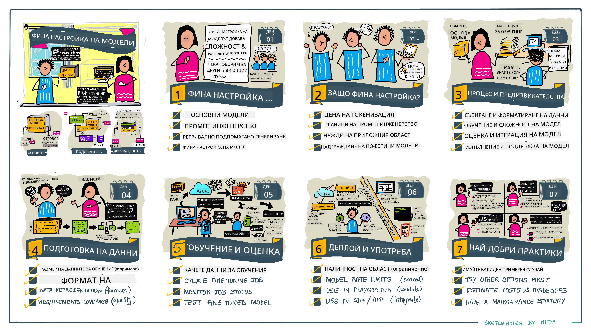

<!--
CO_OP_TRANSLATOR_METADATA:
{
  "original_hash": "68664f7e754a892ae1d8d5e2b7bd2081",
  "translation_date": "2025-06-26T00:52:10+00:00",
  "source_file": "18-fine-tuning/README.md",
  "language_code": "bg"
}
-->

# Подобряване на Вашия LLM

Използването на големи езикови модели за създаване на приложения за генеративен AI идва с нови предизвикателства. Основен проблем е осигуряването на качество на отговорите (точност и релевантност) в съдържанието, генерирано от модела за дадено потребителско искане. В предишните уроци обсъдихме техники като инженеринг на подсказки и генериране с допълнително извличане, които се опитват да решат проблема чрез _модифициране на входящата подсказка_ към съществуващия модел.

В днешния урок обсъждаме трета техника, **подобряване на модела**, която се опитва да адресира предизвикателството чрез _преподготовка на самия модел_ с допълнителни данни. Нека се потопим в подробностите.

## Учебни цели

Този урок въвежда концепцията за подобряване на предварително обучени езикови модели, изследва ползите и предизвикателствата на този подход и предоставя насоки кога и как да използвате подобряването, за да подобрите производителността на вашите генеративни AI модели.

До края на този урок трябва да можете да отговорите на следните въпроси:

- Какво е подобряване на езиковите модели?
- Кога и защо е полезно подобряването?
- Как мога да подобря предварително обучен модел?
- Какви са ограниченията на подобряването?

Готови ли сте? Да започваме.

## Илюстрирано ръководство

Искате ли да получите обща представа за това, което ще разгледаме, преди да се потопим? Разгледайте това илюстрирано ръководство, което описва учебното пътешествие за този урок - от изучаването на основните концепции и мотивацията за подобряване, до разбирането на процеса и най-добрите практики за изпълнение на задачата за подобряване. Това е завладяваща тема за изследване, затова не забравяйте да проверите страницата [Ресурси](./RESOURCES.md?WT.mc_id=academic-105485-koreyst) за допълнителни връзки, които да подкрепят вашето самостоятелно учебно пътешествие!

## Какво е подобряване на езиковите модели?

По дефиниция, големите езикови модели са _предварително обучени_ на големи количества текст, извлечен от разнообразни източници, включително интернет. Както научихме в предишните уроци, се нуждаем от техники като _инженеринг на подсказки_ и _генериране с допълнително извличане_, за да подобрим качеството на отговорите на модела на въпросите на потребителя ("подсказки").

Популярна техника за инженеринг на подсказки включва даване на модела повече указания за това какво се очаква в отговора, или чрез предоставяне на _инструкции_ (явно ръководство), или _даване на няколко примера_ (неявно ръководство). Това се нарича _обучение с малко примери_, но има две ограничения:

- Ограниченията на токените на модела могат да ограничат броя на примерите, които можете да дадете, и да ограничат ефективността.
- Разходите за токени на модела могат да направят скъпо добавянето на примери към всяка подсказка и да ограничат гъвкавостта.

Подобряването е често срещана практика в системите за машинно обучение, при която вземаме предварително обучен модел и го преподготвяме с нови данни, за да подобрим неговото представяне на специфична задача. В контекста на езиковите модели, можем да подобрим предварително обучен модел _с подбран набор от примери за дадена задача или приложение_, за да създадем **персонализиран модел**, който може да бъде по-точен и релевантен за тази конкретна задача или домейн. Допълнителна полза от подобряването е, че може също така да намали броя на необходимите примери за обучение с малко примери - намалявайки използването на токени и свързаните разходи.

## Кога и защо трябва да подобряваме модели?

В _този_ контекст, когато говорим за подобряване, се отнасяме до **супервизирано** подобряване, при което преподготовката се извършва чрез **добавяне на нови данни**, които не са част от оригиналния тренировъчен набор от данни. Това е различно от подхода на несупервизирано подобряване, при който моделът се преподготвя на оригиналните данни, но с различни хиперпараметри.

Ключовото нещо, което трябва да запомните, е че подобряването е сложна техника, която изисква определено ниво на експертиза, за да постигнете желаните резултати. Ако не е направено правилно, може да не предостави очакваните подобрения и дори да влоши представянето на модела за вашия целеви домейн.

Така че, преди да научите "как" да подобрите езикови модели, трябва да знаете "защо" трябва да изберете този подход и "кога" да започнете процеса на подобряване. Започнете, като си зададете тези въпроси:

- **Случай на използване**: Какъв е вашият _случай на използване_ за подобряване? Кой аспект на текущия предварително обучен модел искате да подобрите?
- **Алтернативи**: Опитали ли сте _други техники_, за да постигнете желаните резултати? Използвайте ги, за да създадете базова линия за сравнение.
  - Инженеринг на подсказки: Опитайте техники като подсказване с малко примери с примери на релевантни отговори. Оценете качеството на отговорите.
  - Генериране с допълнително извличане: Опитайте да допълните подсказките с резултати от заявки, извлечени чрез търсене на вашите данни. Оценете качеството на отговорите.
- **Разходи**: Идентифицирали ли сте разходите за подобряване?
  - Възможност за настройка - дали предварително обучен модел е наличен за подобряване?
  - Усилие - за подготовка на тренировъчни данни, оценка и усъвършенстване на модела.
  - Изчисления - за изпълнение на задачи за подобряване и разполагане на подобрен модел.
  - Данни - достъп до достатъчно качествени примери за въздействие на подобряването.
- **Ползи**: Потвърдили ли сте ползите от подобряването?
  - Качество - дали подобреният модел надминава базовата линия?
  - Разходи - дали намалява използването на токени, като опростява подсказките?
  - Разширяемост - можете ли да използвате базовия модел за нови домейни?

Отговаряйки на тези въпроси, трябва да можете да решите дали подобряването е правилният подход за вашия случай на използване. Идеално, подходът е валиден само ако ползите надвишават разходите. След като решите да продължите, е време да помислите за _как_ можете да подобрите предварително обучен модел.

Искате ли да получите повече прозрения за процеса на вземане на решения? Гледайте [Да подобрим или не да подобрим](https://www.youtube.com/watch?v=0Jo-z-MFxJs)

## Как можем да подобрим предварително обучен модел?

За да подобрите предварително обучен модел, трябва да имате:

- предварително обучен модел за подобряване
- набор от данни за използване при подобряване
- тренировъчна среда за изпълнение на задачата за подобряване
- хостинг среда за разполагане на подобрения модел

## Подобряване в действие

Следните ресурси предоставят стъпка по стъпка уроци, които ви водят през реален пример, използвайки избран модел с подбран набор от данни. За да преминете през тези уроци, се нуждаете от акаунт при конкретния доставчик, заедно с достъп до съответния модел и набори от данни.

| Доставчик    | Урок                                                                                                                                                                           | Описание                                                                                                                                                                                                                                                                                                                                                                                                                        |
| ------------ | ------------------------------------------------------------------------------------------------------------------------------------------------------------------------------ | ---------------------------------------------------------------------------------------------------------------------------------------------------------------------------------------------------------------------------------------------------------------------------------------------------------------------------------------------------------------------------------------------------------------------------------- |
| OpenAI       | [Как да подобрим модели за чат](https://github.com/openai/openai-cookbook/blob/main/examples/How_to_finetune_chat_models.ipynb?WT.mc_id=academic-105485-koreyst)                | Научете как да подобрите `gpt-35-turbo` за специфичен домейн ("асистент за рецепти"), като подготвите тренировъчни данни, изпълните задачата за подобряване и използвате подобрения модел за извеждане.                                                                                                                                                                                                                                              |
| Azure OpenAI | [Урок за подобряване на GPT 3.5 Turbo](https://learn.microsoft.com/azure/ai-services/openai/tutorials/fine-tune?tabs=python-new%2Ccommand-line?WT.mc_id=academic-105485-koreyst) | Научете как да подобрите `gpt-35-turbo-0613` модел **в Azure**, като предприемете стъпки за създаване и качване на тренировъчни данни, изпълните задачата за подобряване. Разположете и използвайте новия модел.                                                                                                                                                                                                                                                                 |
| Hugging Face | [Подобряване на LLMs с Hugging Face](https://www.philschmid.de/fine-tune-llms-in-2024-with-trl?WT.mc_id=academic-105485-koreyst)                                               | Тази публикация в блога ви води през подобряване на _отворен LLM_ (например `CodeLlama 7B`) с помощта на библиотеката [transformers](https://huggingface.co/docs/transformers/index?WT.mc_id=academic-105485-koreyst) и [Reinforcement Learning на трансформери (TRL)](https://huggingface.co/docs/trl/index?WT.mc_id=academic-105485-koreyst]) с отворени [набори от данни](https://huggingface.co/docs/datasets/index?WT.mc_id=academic-105485-koreyst) на Hugging Face. |
|              |                                                                                                                                                                                |                                                                                                                                                                                                                                                                                                                                                                                                                                    |
| 🤗 AutoTrain | [Подобряване на LLMs с AutoTrain](https://github.com/huggingface/autotrain-advanced/?WT.mc_id=academic-105485-koreyst)                                                         | AutoTrain (или AutoTrain Advanced) е библиотека на Python, разработена от Hugging Face, която позволява подобряване за много различни задачи, включително подобряване на LLM. AutoTrain е решение без код и подобряването може да се извърши във вашия собствен облак, на Hugging Face Spaces или локално. Поддържа както уеб-базирано GUI, CLI, така и обучение чрез yaml конфигурационни файлове.                                                                               |
|              |                                                                                                                                                                                |                                                                                                                                                                                                                                                                                                                                                                                                                                    |

## Задание

Изберете един от горепосочените уроци и преминете през него. _Може да репликираме версия на тези уроци в Jupyter Notebooks в този репо само за справка. Моля, използвайте оригиналните източници директно, за да получите най-новите версии_.

## Отлична работа! Продължете вашето обучение.

След като завършите този урок, разгледайте нашата [Колекция за обучение по генеративен AI](https://aka.ms/genai-collection?WT.mc_id=academic-105485-koreyst), за да продължите да повишавате знанията си за генеративен AI!

Поздравления!! Завършихте последния урок от v2 серията за този курс! Не спирайте да учите и изграждате. \*\*Разгледайте страницата [РЕСУРСИ](RESOURCES.md?WT.mc_id=academic-105485-koreyst) за списък с допълнителни предложения само за тази тема.

Нашата v1 серия от уроци също е актуализирана с повече задания и концепции. Затова отделете минута, за да освежите знанията си - и моля, [споделете вашите въпроси и обратна връзка](https://github.com/microsoft/generative-ai-for-beginners/issues?WT.mc_id=academic-105485-koreyst), за да ни помогнете да подобрим тези уроци за общността.

**Отказ от отговорност**:  
Този документ е преведен с помощта на AI услуга за превод [Co-op Translator](https://github.com/Azure/co-op-translator). Докато се стремим към точност, моля, имайте предвид, че автоматичните преводи могат да съдържат грешки или неточности. Оригиналният документ на неговия роден език трябва да се счита за авторитетен източник. За критична информация се препоръчва професионален човешки превод. Ние не носим отговорност за каквито и да било недоразумения или неправилни тълкувания, произтичащи от използването на този превод.