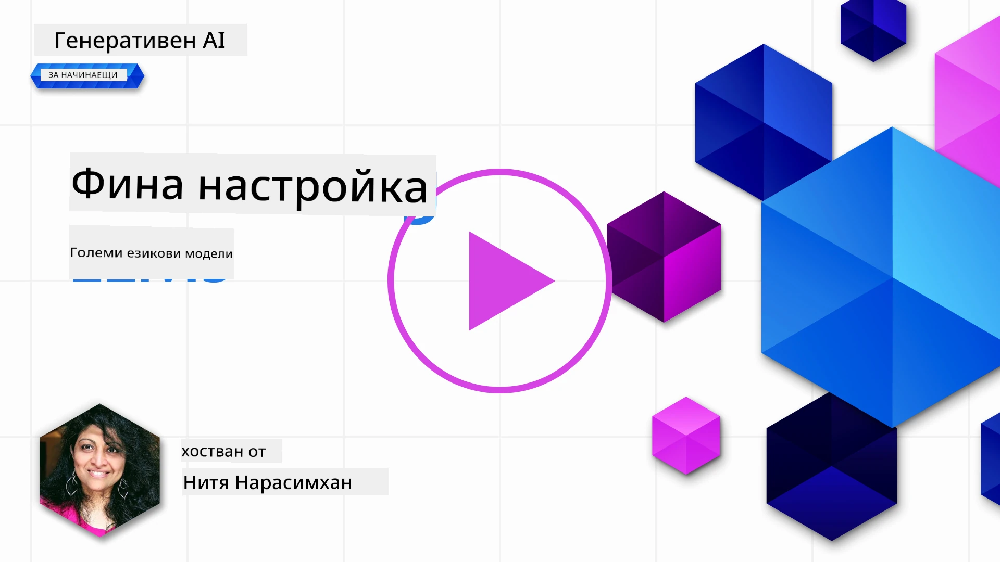
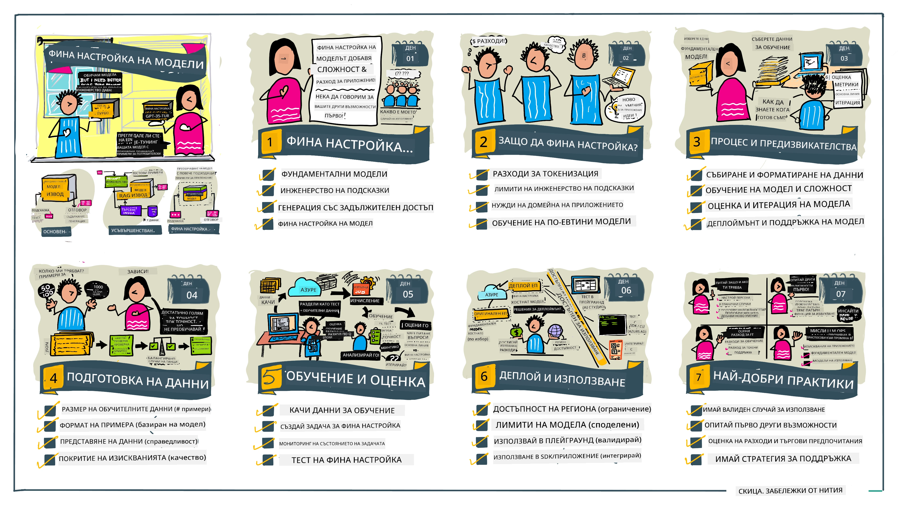

# Фина настройка на вашия LLM

Използването на големи езикови модели за създаване на генеративни AI приложения носи нови предизвикателства. Основен въпрос е осигуряването на качество на отговорите (точност и релевантност) в съдържанието, генерирано от модела за дадена потребителска заявка. В предишни уроци обсъдихме техники като инженерство на подсказките и генериране с допълнително извличане, които се опитват да решат проблема чрез _модифициране на подадената подсказка_ към съществуващия модел.

В днешния урок ще обсъдим трета техника, **фина настройка**, която се опитва да адресира предизвикателството чрез _преобучаване на самия модел_ с допълнителни данни. Нека се потопим в детайлите.

## Цели на обучението

Този урок въвежда концепцията за фина настройка на предварително обучени езикови модели, разглежда ползите и предизвикателствата на този подход и предоставя насоки кога и как да използвате фина настройка за подобряване на представянето на вашите генеративни AI модели.

Към края на урока трябва да можете да отговорите на следните въпроси:

- Какво представлява фина настройка за езикови модели?
- Кога и защо фина настройка е полезна?
- Как мога да настроя предварително обучен модел?
- Какви са ограниченията на фината настройка?

Готови ли сте? Нека започваме.

## Илюстрирано ръководство

Искате ли да получите обща представа за това, което ще покрием, преди да се впуснем? Вижте това илюстрирано ръководство, което описва учебното пътешествие за този урок - от изучаването на основните концепции и мотивацията за фина настройка, до разбирането на процеса и най-добрите практики за изпълнение на задачата за фина настройка. Това е завладяваща тема за изследване, така че не забравяйте да разгледате страницата с [Ресурси](./RESOURCES.md?WT.mc_id=academic-105485-koreyst) за допълнителни връзки, които да подкрепят вашето самостоятелно обучение!

## Какво е фина настройка на езикови модели?

По дефиниция големите езикови модели са _предварително обучени_ върху големи количества текст, събран от различни източници, включително интернет. Както научихме в предишни уроци, имаме нужда от техники като _инженерство на подсказки_ и _генериране с допълнително извличане_, за да подобрим качеството на отговорите на модела на въпросите на потребителя ("подсказки").

Популярна техника за инженерство на подсказки включва даване на повече насоки на модела какво се очаква в отговора, или чрез предоставяне на _инструкции_ (явни насоки), или _даване на няколко примера_ (косвени насоки). Това се нарича _few-shot обучение_, но има две ограничения:

- Ограниченията за токени на модела могат да ограничат броя на примерите, които можете да дадете, и да намалят ефективността.
- Разходите за токени могат да направят скъпо добавянето на примери към всяка подсказка и да ограничат гъвкавостта.

Фината настройка е честа практика в системите за машинно обучение, при която вземаме предварително обучен модел и го преобучаваме с нови данни, за да подобрим представянето му по конкретна задача. В контекста на езиковите модели, можем да финно настроим предварително обучения модел _с кураторски набор от примери за конкретна задача или област на приложение_, за да създадем **специализиран модел**, който може да е по-точен и релевантен за конкретната задача или област. Допълнителна полза от фината настройка е, че тя може да намали броя на нужните примери за few-shot обучение - намалявайки използването на токени и свързаните разходи.

## Кога и защо трябва да настройваме модели?

В _този_ контекст, когато говорим за фина настройка, имаме предвид **контролирана** фина настройка, където преобучаването се прави чрез **добавяне на нови данни**, които не са били част от първоначалния тренировъчен набор. Това е различно от неконтролирана фина настройка, при която моделът се преобучава върху оригиналните данни, но с различни хиперпараметри.

Ключовото нещо, което трябва да запомните, е че фината настройка е напреднала техника, която изисква определено ниво на експертиза, за да се постигнат желаните резултати. Ако се направи неправилно, може да не осигури очакваните подобрения и дори да влоши представянето на модела за вашата целева област.

Затова, преди да се научите "как" да настройвате езикови модели, трябва да разберете "защо" трябва да изберете този път и "кога" да започнете процеса на фина настройка. Започнете, като си зададете тези въпроси:

- **Случай на употреба**: Какъв е вашият _случай на употреба_ за финна настройка? Кой аспект на текущия предварително обучен модел искате да подобрите?
- **Алтернативи**: Опитвали ли сте _други техники_ да постигнете желаните резултати? Използвайте ги, за да създадете базова линия за сравнение.
  - Инженерство на подсказки: Опитайте техники като few-shot подсказване с примери на релевантни отговори. Оценете качеството на отговорите.
  - Генериране с допълнително извличане: Опитайте да обогатите подсказките с резултати от търсене във вашите данни. Оценете качеството на отговорите.
- **Разходи**: Определили ли сте разходите за финна настройка?
  - Възможност за настройка - наличен ли е предварително обучен модел за финна настройка?
  - Усилия - за подготовка на тренировъчните данни, оценяване и усъвършенстване на модела.
  - Изчислителни ресурси - за изпълнение на задачи за фина настройка и внедряване на финно настроения модел.
  - Данни - достъп до достатъчно качествени примери за въздействието на фината настройка.
- **Ползи**: Потвърдили ли сте ползите от фината настройка?
  - Качество - превъзхожда ли финно настроеният модел базовия?
  - Разходи - намалява ли използването на токени чрез опростяване на подсказките?
  - Разширяемост - можете ли да пренасочите базовия модел към нови области?

Отговаряйки на тези въпроси, трябва да можете да решите дали фината настройка е правилният подход за вашия случай на употреба. Идеално е, подходът да е валиден само ако ползите надвишават разходите. След като решите да продължите, е време да обмислите _как_ да настроите предварително обучен модел.

Искате ли повече прозрения за процеса на вземане на решения? Гледайте [Да настройваме или да не настройваме](https://www.youtube.com/watch?v=0Jo-z-MFxJs).

## Как можем да настроим предварително обучен модел?

За да направите фина настройка на предварително обучен модел, трябва да имате:

- предварително обучен модел за настройка
- набор от данни за фина настройка
- тренировъчна среда за изпълнение на задачата за финна настройка
- среда за хостинг за внедряване на финно настроения модел

## Фина настройка в действие

Следните ресурси предоставят стъпка по стъпка уроци, които ви водят през реален пример с избран модел и кураторски набор от данни. За да работите с тези уроци, ви е необходим акаунт при съответния доставчик, както и достъп до съответния модел и набори от данни.

| Доставчик   | Урок                                                                                                                                                                         | Описание                                                                                                                                                                                                                                                                                                                                                                                                                             |
| ----------- | ---------------------------------------------------------------------------------------------------------------------------------------------------------------------------- | ----------------------------------------------------------------------------------------------------------------------------------------------------------------------------------------------------------------------------------------------------------------------------------------------------------------------------------------------------------------------------------------------------------------------------------- |
| OpenAI      | [Как да настроим чат модели](https://github.com/openai/openai-cookbook/blob/main/examples/How_to_finetune_chat_models.ipynb?WT.mc_id=academic-105485-koreyst)               | Научете как да финно настроите `gpt-35-turbo` за конкретна област ("асистент за рецепти") чрез подготовка на тренировъчни данни, изпълнение на задачата за финна настройка и използване на финно настроения модел за предсказания.                                                                                                                                                                                                 |
| Azure OpenAI| [Урок за финна настройка на GPT 3.5 Turbo](https://learn.microsoft.com/azure/ai-services/openai/tutorials/fine-tune?tabs=python-new%2Ccommand-line&WT.mc_id=academic-105485-koreyst) | Научете как да финно настроите модел `gpt-35-turbo-0613` **в Azure**, като преминете през създаване и качване на тренировъчни данни, изпълнение на задачата за финна настройка, внедряване и използване на новия модел.                                                                                                                                                                                                              |
| Hugging Face| [Фина настройка на LLMs с Hugging Face](https://www.philschmid.de/fine-tune-llms-in-2024-with-trl?WT.mc_id=academic-105485-koreyst)                                         | Тази блог публикация ви води през финна настройка на _отворен LLM_ (например `CodeLlama 7B`) с помощта на библиотеката [transformers](https://huggingface.co/docs/transformers/index?WT.mc_id=academic-105485-koreyst) и [Transformer Reinforcement Learning (TRL)](https://huggingface.co/docs/trl/index?WT.mc_id=academic-105485-koreyst), използвайки отворени набори от данни на Hugging Face. |
|             |                                                                                                                                                                              |                                                                                                                                                                                                                                                                                                                                                                                                                                     |
| 🤗 AutoTrain | [Фина настройка на LLMs с AutoTrain](https://github.com/huggingface/autotrain-advanced/?WT.mc_id=academic-105485-koreyst)                                                     | AutoTrain (или AutoTrain Advanced) е python библиотека, разработена от Hugging Face, която позволява фина настройка за много различни задачи, включително LLM. AutoTrain е решение без код, а финната настройка може да бъде извършена във вашия собствен облак, в Hugging Face Spaces или локално. Поддържа уеб-базирани GUI, CLI и обучение чрез yamл конфигурационни файлове.                                        |
|             |                                                                                                                                                                              |                                                                                                                                                                                                                                                                                                                                                                                                                                     |
| 🦥 Unsloth | [Фина настройка на LLMs с Unsloth](https://github.com/unslothai/unsloth)                                                           | Unsloth е с отворен код рамка, която поддържа фина настройка и обучение чрез подсилване (RL) на LLM. Unsloth улеснява локално обучение, оценка и внедряване с готови [notebooks](https://github.com/unslothai/notebooks). Поддържа също обработка на текст в реч (TTS), BERT и мултимодални модели. За да започнете, прочетете тяхното стъпка по стъпка [Ръководство за фина настройка на LLMs](https://docs.unsloth.ai/get-started/fine-tuning-llms-guide).                        |
|             |                                                                                                                                                                              |                                                                                                                                                                                                                                                                                                                                                                                                                                     |
## Задача

Изберете един от горните уроци и го преминете. _Можем да възпроизведем версия на тези уроци в Jupyter Notebooks в това хранилище само за справка. Моля, използвайте оригиналните източници директно, за да получите най-актуалните версии_.

## Отлична работа! Продължете ученето си.

След завършване на този урок разгледайте нашата [колекция за обучение по генеративен AI](https://aka.ms/genai-collection?WT.mc_id=academic-105485-koreyst), за да продължите да надграждате знанията си за генеративен AI!

Поздравления!! Завършихте последния урок от серията v2 за този курс! Не спирайте да учите и създавате. **Разгледайте страницата с [РЕСУРСИ](RESOURCES.md?WT.mc_id=academic-105485-koreyst) за списък с допълнителни предложения по точно тази тема.

Нашата серия уроци v1 също беше актуализирана с повече задачи и концепции. Затова отделете минута, за да освежите знанията си - и моля [споделете вашите въпроси и обратна връзка](https://github.com/microsoft/generative-ai-for-beginners/issues?WT.mc_id=academic-105485-koreyst), за да ни помогнете да подобрим тези уроци за общността.

---

<!-- CO-OP TRANSLATOR DISCLAIMER START -->
**Отказ от отговорност**:  
Този документ е преведен с помощта на AI преводаческа услуга [Co-op Translator](https://github.com/Azure/co-op-translator). Въпреки че се стремим към точност, моля, имайте предвид, че автоматизираните преводи могат да съдържат грешки или неточности. Оригиналният документ на неговия роден език трябва да се счита за авторитетен източник. За критична информация се препоръчва професионален човешки превод. Не носим отговорност за никакви недоразумения или неправилни тълкувания, произтичащи от използването на този превод.
<!-- CO-OP TRANSLATOR DISCLAIMER END -->