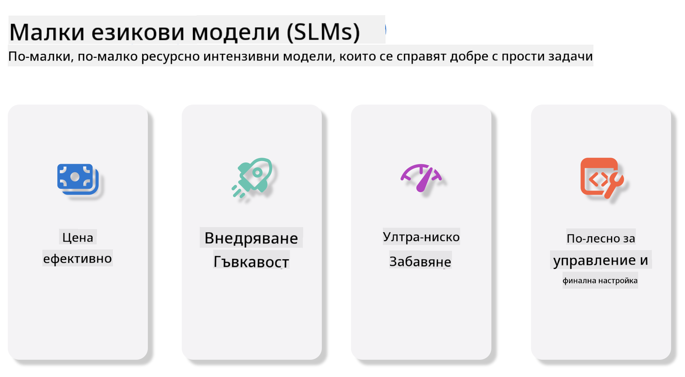
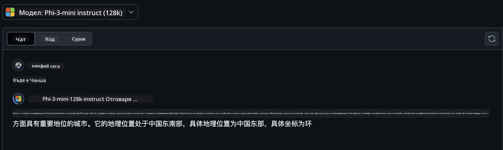
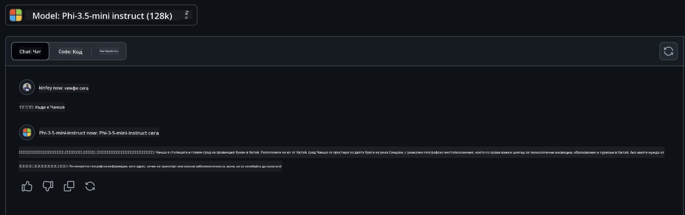

<!--
CO_OP_TRANSLATOR_METADATA:
{
  "original_hash": "124ad36cfe96f74038811b6e2bb93e9d",
  "translation_date": "2025-05-20T10:36:04+00:00",
  "source_file": "19-slm/README.md",
  "language_code": "bg"
}
-->
# Въведение в малките езикови модели за генеративен AI за начинаещи

Генеративният AI е завладяваща област на изкуствения интелект, която се фокусира върху създаването на системи, способни да генерират ново съдържание. Това съдържание може да варира от текст и изображения до музика и дори цели виртуални среди. Едно от най-вълнуващите приложения на генеративния AI е в сферата на езиковите модели.

## Какво представляват малките езикови модели?

Малък езиков модел (SLM) представлява мащабирана версия на голям езиков модел (LLM), използвайки много от архитектурните принципи и техники на LLM, докато показва значително намален изчислителен отпечатък. SLM са подмножество на езиковите модели, предназначени да генерират текст, подобен на човешкия. За разлика от техните по-големи аналози, като GPT-4, SLM са по-компактни и ефективни, което ги прави идеални за приложения, където изчислителните ресурси са ограничени. Въпреки по-малкия си размер, те все още могат да изпълняват разнообразни задачи. Обикновено SLM се конструират чрез компресиране или дистилиране на LLM, като се стремят да запазят значителна част от функционалността и езиковите способности на оригиналния модел. Това намаляване на размера на модела намалява общата сложност, правейки SLM по-ефективни както по отношение на използването на паметта, така и на изчислителните изисквания. Въпреки тези оптимизации, SLM все още могат да изпълняват широк спектър от задачи за обработка на естествен език (NLP):

- Генериране на текст: Създаване на свързани и контекстуално релевантни изречения или параграфи.
- Завършване на текст: Прогнозиране и завършване на изречения въз основа на даден подтик.
- Превод: Конвертиране на текст от един език на друг.
- Обобщение: Сгъстяване на дълги текстове в по-кратки, по-лесно смилаеми резюмета.

Макар и с някои компромиси в производителността или дълбочината на разбиране в сравнение с техните по-големи аналози.

## Как работят малките езикови модели?

SLM се обучават върху огромни количества текстови данни. По време на обучението те научават моделите и структурите на езика, което им позволява да генерират текст, който е както граматически правилен, така и контекстуално подходящ. Процесът на обучение включва:

- Събиране на данни: Събиране на големи набори от текст от различни източници.
- Предварителна обработка: Почистване и организиране на данните, за да ги направят подходящи за обучение.
- Обучение: Използване на алгоритми за машинно обучение за обучаване на модела как да разбира и генерира текст.
- Фина настройка: Настройване на модела за подобряване на производителността му при специфични задачи.

Развитието на SLM съответства на нарастващата нужда от модели, които могат да бъдат внедрени в среди с ограничени ресурси, като мобилни устройства или платформи за периферни изчисления, където пълномащабните LLM може да са непрактични поради тежките си изисквания към ресурсите. Чрез фокусиране върху ефективността, SLM балансират производителността с достъпността, позволявайки по-широко приложение в различни области.



## Цели на обучението

В този урок се надяваме да въведем знанията за SLM и да ги комбинираме с Microsoft Phi-3, за да научим различни сценарии в текстово съдържание, визия и MoE. До края на този урок трябва да можете да отговорите на следните въпроси:

- Какво е SLM
- Каква е разликата между SLM и LLM
- Какво представлява семейството Microsoft Phi-3/3.5
- Как да извлечете информация от семейството Microsoft Phi-3/3.5

Готови ли сте? Да започваме.

## Различията между големите езикови модели (LLM) и малките езикови модели (SLM)

Както LLM, така и SLM са изградени върху основни принципи на вероятностното машинно обучение, следвайки подобни подходи в архитектурния си дизайн, методологии на обучение, процеси на генериране на данни и техники за оценка на модела. Въпреки това, няколко ключови фактора разграничават тези два типа модели.

## Приложения на малките езикови модели

SLM имат широк спектър от приложения, включително:

- Чатботове: Осигуряване на поддръжка на клиенти и ангажиране с потребители в разговорен начин.
- Създаване на съдържание: Помагане на писатели чрез генериране на идеи или дори писане на цели статии.
- Образование: Помагане на ученици с писмени задачи или изучаване на нови езици.
- Достъпност: Създаване на инструменти за лица с увреждания, като системи за преобразуване на текст в реч.

**Размер**

Основно разграничение между LLM и SLM е мащабът на моделите. LLM, като ChatGPT (GPT-4), могат да съдържат приблизително 1,76 трилиона параметри, докато отворените SLM като Mistral 7B са проектирани със значително по-малко параметри — приблизително 7 милиарда. Това несъответствие се дължи основно на разликите в архитектурата на модела и процесите на обучение. Например, ChatGPT използва механизъм за самовнимание в рамките на енкодер-декодер, докато Mistral 7B използва внимание с плъзгащ се прозорец, което позволява по-ефективно обучение в модел само с декодер. Това архитектурно различие има дълбоки последици за сложността и производителността на тези модели.

**Разбиране**

SLM обикновено са оптимизирани за производителност в специфични области, което ги прави силно специализирани, но потенциално ограничени в способността си да предоставят широко контекстуално разбиране в множество области на знание. За разлика от тях, LLM се стремят да симулират човешкия интелект на по-обширно ниво. Обучени на огромни, разнообразни набори от данни, LLM са проектирани да се представят добре в различни области, предлагайки по-голяма гъвкавост и адаптивност. Следователно, LLM са по-подходящи за по-широк спектър от задачи надолу по веригата, като обработка на естествен език и програмиране.

**Изчисления**

Обучението и внедряването на LLM са процеси, изискващи значителни ресурси, често изискващи значителна изчислителна инфраструктура, включително големи GPU клъстери. Например, обучението на модел като ChatGPT от нулата може да изисква хиляди GPU за продължителни периоди. За разлика от тях, SLM, с по-малкия си брой параметри, са по-достъпни по отношение на изчислителните ресурси. Модели като Mistral 7B могат да бъдат обучени и изпълнени на локални машини, оборудвани с умерени GPU възможности, въпреки че обучението все още изисква няколко часа на множество GPU.

**Пристрастия**

Пристрастията са известен проблем в LLM, главно поради естеството на данните за обучение. Тези модели често разчитат на сурови, открито достъпни данни от интернет, които могат да представят неправилно или неправилно определени групи, да въведат погрешно етикетиране или да отразят езикови пристрастия, повлияни от диалект, географски вариации и граматически правила. Освен това сложността на архитектурите на LLM може неволно да засили пристрастията, които може да останат незабелязани без внимателна фина настройка. От друга страна, SLM, обучени на по-ограничени, специфични за домейна набори от данни, са по-малко податливи на такива пристрастия, въпреки че не са имунизирани срещу тях.

**Извеждане**

Намаленият размер на SLM им предоставя значително предимство по отношение на скоростта на извеждане, позволявайки им да генерират изходи ефективно на локален хардуер без нужда от обширна паралелна обработка. За разлика от тях, LLM, поради размера и сложността си, често изискват значителни паралелни изчислителни ресурси, за да постигнат приемливи времена за извеждане. Наличието на множество едновременни потребители допълнително забавя времето за реакция на LLM, особено когато са внедрени в мащаб.

В обобщение, въпреки че както LLM, така и SLM споделят основа в машинното обучение, те се различават значително по отношение на размера на модела, изискванията за ресурси, контекстуалното разбиране, податливостта на пристрастия и скоростта на извеждане. Тези различия отразяват съответната им пригодност за различни случаи на употреба, като LLM са по-гъвкави, но ресурсно тежки, а SLM предлагат по-специфична за домейна ефективност с намалени изчислителни изисквания.

***Забележка: В тази глава ще представим SLM, използвайки Microsoft Phi-3 / 3.5 като пример.***

## Представяне на семейството Phi-3 / Phi-3.5

Семейството Phi-3 / 3.5 основно се насочва към текстови, визуални и агентни (MoE) приложения:

### Phi-3 / 3.5 Instruct

Предимно за генериране на текст, завършване на чат и извличане на информация от съдържание и др.

**Phi-3-mini**

Моделът с 3,8 милиарда параметри е наличен в Microsoft Azure AI Studio, Hugging Face и Ollama. Моделите Phi-3 значително надминават езиковите модели с равен и по-голям размер на ключови критерии (вижте числата на критериите по-долу, по-високите числа са по-добри). Phi-3-mini надминава модели два пъти по-големи от него, докато Phi-3-small и Phi-3-medium надминават по-големи модели, включително GPT-3.5.

**Phi-3-small & medium**

Със само 7 милиарда параметри, Phi-3-small надминава GPT-3.5T в разнообразие от езикови, логически, кодиращи и математически критерии. Phi-3-medium с 14 милиарда параметри продължава тази тенденция и надминава Gemini 1.0 Pro.

**Phi-3.5-mini**

Можем да го разглеждаме като надграждане на Phi-3-mini. Докато параметрите остават непроменени, той подобрява способността за поддръжка на множество езици (поддържа над 20 езика: арабски, китайски, чешки, датски, холандски, английски, фински, френски, немски, иврит, унгарски, италиански, японски, корейски, норвежки, полски, португалски, руски, испански, шведски, тайландски, турски, украински) и добавя по-силна поддръжка за дълги контексти. Phi-3.5-mini с 3,8 милиарда параметри надминава езиковите модели със същия размер и е равен с модели два пъти по-големи от него.

### Phi-3 / 3.5 Vision

Можем да разглеждаме модела Instruct на Phi-3/3.5 като способността на Phi да разбира, а Vision е това, което дава на Phi очи да разбира света.

**Phi-3-Vision**

Phi-3-vision, с само 4,2 милиарда параметри, продължава тази тенденция и надминава по-големи модели като Claude-3 Haiku и Gemini 1.0 Pro V в задачи за общо визуално разсъждение, OCR и задачи за разбиране на таблици и диаграми.

**Phi-3.5-Vision**

Phi-3.5-Vision също е надграждане на Phi-3-Vision, добавяйки поддръжка за множество изображения. Можете да го разглеждате като подобрение на визията, не само може да вижда снимки, но и видеа. Phi-3.5-vision надминава по-големи модели като Claude-3.5 Sonnet и Gemini 1.5 Flash в задачи за OCR, разбиране на таблици и графики и е равен в задачи за общо визуално знание и разсъждение. Поддържа многокадрово въвеждане, т.е. извършва разсъждение върху множество входни изображения.

### Phi-3.5-MoE

***Смес от експерти (MoE)*** позволява моделите да бъдат предварително обучени с много по-малко изчислителна мощност, което означава, че можете драстично да увеличите размера на модела или набора от данни със същия изчислителен бюджет като плътен модел. По-конкретно, MoE моделът трябва да постигне същото качество като своя плътен аналог много по-бързо по време на предварително обучение. Phi-3.5-MoE включва 16x3.8B експертни модули. Phi-3.5-MoE с само 6,6 милиарда активни параметри постига подобно ниво на разсъждение, разбиране на езика и математика като много по-големи модели.

Можем да използваме модела от семейството Phi-3/3.5 въз основа на различни сценарии. За разлика от LLM, можете да внедрите Phi-3/3.5-mini или Phi-3/3.5-Vision на периферни устройства.

## Как да използвате моделите от семейството Phi-3/3.5

Надяваме се да използваме Phi-3/3.5 в различни сценарии. Следващото, ще използваме Phi-3/3.5 въз основа на различни сценарии.


### Разлика в извеждането

API на облака

**GitHub Модели**

GitHub
Моделите са най-прекият начин. Можете бързо да получите достъп до модела Phi-3/3.5-Instruct чрез GitHub Models. В комбинация с Azure AI Inference SDK / OpenAI SDK, можете да получите достъп до API чрез код, за да завършите извикването на Phi-3/3.5-Instruct. Можете също така да тествате различни ефекти чрез Playground. - Демонстрация: Сравнение на ефектите на Phi-3-mini и Phi-3.5-mini в китайски сценарии   **Azure AI Studio** Или ако искаме да използваме модели за визия и MoE, можете да използвате Azure AI Studio, за да завършите извикването. Ако сте заинтересовани, можете да прочетете Phi-3 Cookbook, за да научите как да извикате Phi-3/3.5 Instruct, Vision, MoE чрез Azure AI Studio [Кликнете тук](https://github.com/microsoft/Phi-3CookBook/blob/main/md/02.QuickStart/AzureAIStudio_QuickStart.md?WT.mc_id=academic-105485-koreyst) **NVIDIA NIM** Освен облачните решения за Model Catalog, предоставени от Azure и GitHub, можете също да използвате [Nivida NIM](https://developer.nvidia.com/nim?WT.mc_id=academic-105485-koreyst), за да завършите свързаните извиквания. Можете да посетите NIVIDA NIM, за да завършите API извикванията на Phi-3/3.5 Family. NVIDIA NIM (NVIDIA Inference Microservices) е набор от ускорени микроуслуги за извеждане, създадени да помогнат на разработчиците да внедряват AI модели ефективно в различни среди, включително облаци, центрове за данни и работни станции. Ето някои ключови характеристики на NVIDIA NIM: - **Лесно внедряване:** NIM позволява внедряването на AI модели с една команда, което го прави лесно за интегриране в съществуващи работни потоци. - **Оптимизирана производителност:** Той използва предварително оптимизираните двигатели за извеждане на NVIDIA, като TensorRT и TensorRT-LLM, за да осигури ниска латентност и висока производителност. - **Скалируемост:** NIM поддържа автоматично мащабиране на Kubernetes, което му позволява ефективно да се справя с променливи натоварвания. - **Сигурност и контрол:** Организациите могат да запазят контрол над своите данни и приложения, като самостоятелно хостват NIM микроуслуги на собствена управлявана инфраструктура. - **Стандартни API:** NIM предоставя индустриално стандартни API, което улеснява създаването и интегрирането на AI приложения като чатботове, AI асистенти и други. NIM е част от NVIDIA AI Enterprise, което има за цел да опрости внедряването и оперативизацията на AI модели, като гарантира, че те работят ефективно на NVIDIA GPU. - Демонстрация: Използване на Nividia NIM за извикване на Phi-3.5-Vision-API [[Кликнете тук](../../../19-slm/python/Phi-3-Vision-Nividia-NIM.ipynb)] ### Извеждане Phi-3/3.5 в локална среда Извеждането във връзка с Phi-3 или който и да е езиков модел като GPT-3 се отнася до процеса на генериране на отговори или прогнози въз основа на входа, който получава. Когато предоставите подкана или въпрос на Phi-3, той използва своята обучена невронна мрежа, за да извлече най-вероятния и релевантен отговор, като анализира модели и връзки в данните, върху които е обучен. **Hugging Face Transformer** Hugging Face Transformers е мощна библиотека, създадена за обработка на естествен език (NLP) и други задачи за машинно обучение. Ето някои ключови точки за нея: 1. **Предварително обучени модели**: Тя предоставя хиляди предварително обучени модели, които могат да се използват за различни задачи, като класификация на текст, разпознаване на именувани обекти, отговаряне на въпроси, резюмиране, превод и генериране на текст. 2. **Интероперативност на рамката**: Библиотеката поддържа множество рамки за дълбоко обучение, включително PyTorch, TensorFlow и JAX. Това ви позволява да обучите модел в една рамка и да го използвате в друга. 3. **Мултимодални възможности**: Освен NLP, Hugging Face Transformers също поддържа задачи в компютърното зрение (например класификация на изображения, откриване на обекти) и аудио обработка (например разпознаване на реч, класификация на аудио). 4. **Лесна употреба**: Библиотеката предлага API и инструменти за лесно изтегляне и фина настройка на модели, което я прави достъпна както за начинаещи, така и за експерти. 5. **Общество и ресурси**: Hugging Face има жизнено общество и обширна документация, уроци и ръководства, които да помогнат на потребителите да започнат и да извлекат максимума от библиотеката. [официална документация](https://huggingface.co/docs/transformers/index?WT.mc_id=academic-105485-koreyst) или техния [GitHub репозиториум](https://github.com/huggingface/transformers?WT.mc_id=academic-105485-koreyst). Това е най-често използваният метод, но също така изисква ускорение с GPU. В крайна сметка сцени като Vision и MoE изискват много изчисления, които ще бъдат много ограничени в CPU, ако не са квантизирани. - Демонстрация: Използване на Transformer за извикване на Phi-3.5-Instuct [Кликнете тук](../../../19-slm/python/phi35-instruct-demo.ipynb) - Демонстрация: Използване на Transformer за извикване на Phi-3.5-Vision[Кликнете тук](../../../19-slm/python/phi35-vision-demo.ipynb) - Демонстрация: Използване на Transformer за извикване на Phi-3.5-MoE[Кликнете тук](../../../19-slm/python/phi35_moe_demo.ipynb) **Ollama** [Ollama](https://ollama.com/?WT.mc_id=academic-105485-koreyst) е платформа, създадена да улесни работата с големи езикови модели (LLMs) локално на вашата машина. Тя поддържа различни модели като Llama 3.1, Phi 3, Mistral и Gemma 2, наред с други. Платформата опростява процеса, като обединява теглата на модела, конфигурацията и данните в един пакет, което я прави по-достъпна за потребителите да персонализират и създават свои собствени модели. Ollama е налична за macOS, Linux и Windows. Това е чудесен инструмент, ако искате да експериментирате или внедрите LLMs без да разчитате на облачни услуги. Ollama е най-прекият начин, просто трябва да изпълните следното изявление. ```bash

ollama run phi3.5

``` **ONNX Runtime за GenAI** [ONNX Runtime](https://github.com/microsoft/onnxruntime-genai?WT.mc_id=academic-105485-koreyst) е кросплатформен ускорител за извеждане и обучение на машинно обучение. ONNX Runtime за Generative AI (GENAI) е мощен инструмент, който ви помага да стартирате генеративни AI модели ефективно на различни платформи. ## Какво е ONNX Runtime? ONNX Runtime е проект с отворен код, който позволява високопроизводително извеждане на модели за машинно обучение. Той поддържа модели във формат Open Neural Network Exchange (ONNX), който е стандарт за представяне на модели за машинно обучение. Извеждането с ONNX Runtime може да осигури по-бързи клиентски преживявания и по-ниски разходи, поддържайки модели от рамки за дълбоко обучение като PyTorch и TensorFlow/Keras, както и класически библиотеки за машинно обучение като scikit-learn, LightGBM, XGBoost и др. ONNX Runtime е съвместим с различни хардуери, драйвери и операционни системи и предоставя оптимална производителност, като използва хардуерни ускорители, където е приложимо, заедно с оптимизации и трансформации на графики ## Какво е Generative AI? Generative AI се отнася до AI системи, които могат да генерират ново съдържание, като текст, изображения или музика, въз основа на данните, върху които са обучени. Примери включват езикови модели като GPT-3 и модели за генериране на изображения като Stable Diffusion. Библиотеката ONNX Runtime за GenAI предоставя генеративния AI цикъл за ONNX модели, включително извеждане с ONNX Runtime, обработка на логити, търсене и семплиране, и управление на KV кеш. ## ONNX Runtime за GENAI ONNX Runtime за GENAI разширява възможностите на ONNX Runtime, за да поддържа генеративни AI модели. Ето някои ключови характеристики: - **Широка поддръжка на платформи:** Работи на различни платформи, включително Windows, Linux, macOS, Android и iOS. - **Поддръжка на модели:** Поддържа много популярни генеративни AI модели, като LLaMA, GPT-Neo, BLOOM и други. - **Оптимизация на производителността:** Включва оптимизации за различни хардуерни ускорители като NVIDIA GPU, AMD GPU и други2. - **Лесна употреба:** Предоставя API за лесна интеграция в приложения, позволявайки ви да генерирате текст, изображения и друго съдържание с минимален код - Потребителите могат да извикат метод generate() на високо ниво или да стартират всяка итерация на модела в цикъл, генерирайки един токен наведнъж и по избор да актуализират параметрите за генериране вътре в цикъла. - ONNX runtime също има поддръжка за жадно/лъчево търсене и TopP, TopK семплиране за генериране на последователности от токени и вградена обработка на логити като наказания за повторение. Можете също така лесно да добавите персонализирано оценяване. ## Започване За да започнете с ONNX Runtime за GENAI, можете да следвате тези стъпки: ### Инсталирайте ONNX Runtime: ```Python
pip install onnxruntime
``` ### Инсталирайте разширенията за Generative AI: ```Python
pip install onnxruntime-genai
``` ### Стартирайте модел: Ето един прост пример на Python: ```Python
import onnxruntime_genai as og

model = og.Model('path_to_your_model.onnx')

tokenizer = og.Tokenizer(model)

input_text = "Hello, how are you?"

input_tokens = tokenizer.encode(input_text)

output_tokens = model.generate(input_tokens)

output_text = tokenizer.decode(output_tokens)

print(output_text) 
``` ### Демонстрация: Използване на ONNX Runtime GenAI за извикване на Phi-3.5-Vision ```python

import onnxruntime_genai as og

model_path = './Your Phi-3.5-vision-instruct ONNX Path'

img_path = './Your Image Path'

model = og.Model(model_path)

processor = model.create_multimodal_processor()

tokenizer_stream = processor.create_stream()

text = "Your Prompt"

prompt = "<|user|>\n"

prompt += "<|image_1|>\n"

prompt += f"{text}<|end|>\n"

prompt += "<|assistant|>\n"

image = og.Images.open(img_path)

inputs = processor(prompt, images=image)

params = og.GeneratorParams(model)

params.set_inputs(inputs)

params.set_search_options(max_length=3072)

generator = og.Generator(model, params)

while not generator.is_done():

    generator.compute_logits()
    
    generator.generate_next_token()

    new_token = generator.get_next_tokens()[0]
    
    code += tokenizer_stream.decode(new_token)
    
    print(tokenizer_stream.decode(new_token), end='', flush=True)

``` **Други** Освен методите за справка ONNX Runtime и Ollama, можем също да завършим справката на количествени модели въз основа на методите за справка на моделите, предоставени от различни производители. Като Apple MLX рамка с Apple Metal, Qualcomm QNN с NPU, Intel OpenVINO с CPU/GPU и др. Можете също така да получите повече съдържание от [Phi-3 Cookbook](https://github.com/microsoft/phi-3cookbook?WT.mc_id=academic-105485-koreyst) ## Повече Научихме основите на Phi-3/3.5 Family, но за да научим повече за SLM, ни е необходимо повече знание. Можете да намерите отговорите в Phi-3 Cookbook. Ако искате да научите повече, моля, посетете [Phi-3 Cookbook](https://github.com/microsoft/phi-3cookbook?WT.mc_id=academic-105485-koreyst).

**Отказ от отговорност**: 
Този документ е преведен с помощта на AI услуга за превод [Co-op Translator](https://github.com/Azure/co-op-translator). Въпреки че се стремим към точност, моля, имайте предвид, че автоматизираните преводи могат да съдържат грешки или неточности. Оригиналният документ на неговия роден език трябва да се счита за авторитетен източник. За критична информация се препоръчва професионален човешки превод. Не носим отговорност за недоразумения или погрешни интерпретации, възникнали от използването на този превод.