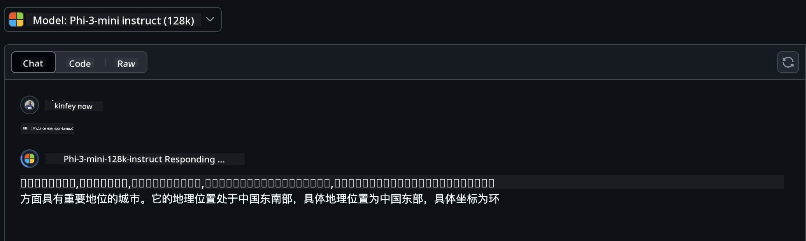
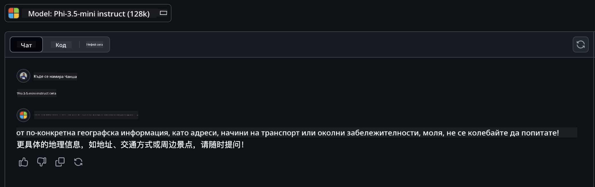

<!--
CO_OP_TRANSLATOR_METADATA:
{
  "original_hash": "124ad36cfe96f74038811b6e2bb93e9d",
  "translation_date": "2025-06-26T02:55:26+00:00",
  "source_file": "19-slm/README.md",
  "language_code": "bg"
}
-->

Моделите са най-прекият начин. Можете бързо да получите достъп до модела Phi-3/3.5-Instruct чрез GitHub Models. В комбинация с Azure AI Inference SDK / OpenAI SDK можете да получите достъп до API чрез код, за да завършите обаждането на Phi-3/3.5-Instruct. Можете също така да тествате различни ефекти чрез Playground. - Демонстрация: Сравнение на ефектите на Phi-3-mini и Phi-3.5-mini в китайски сценарии   **Azure AI Studio** Или ако искаме да използваме моделите за визия и MoE, можете да използвате Azure AI Studio, за да завършите обаждането. Ако сте заинтересовани, можете да прочетете Phi-3 Cookbook, за да научите как да извикате Phi-3/3.5 Instruct, Vision, MoE чрез Azure AI Studio [Кликнете върху тази връзка](https://github.com/microsoft/Phi-3CookBook/blob/main/md/02.QuickStart/AzureAIStudio_QuickStart.md?WT.mc_id=academic-105485-koreyst) **NVIDIA NIM** Освен решенията за облачен каталог на модели, предоставени от Azure и GitHub, можете също така да използвате [Nivida NIM](https://developer.nvidia.com/nim?WT.mc_id=academic-105485-koreyst), за да завършите свързаните обаждания. Можете да посетите NIVIDA NIM, за да завършите API обажданията на семейството Phi-3/3.5. NVIDIA NIM (NVIDIA Inference Microservices) е набор от ускорени микросервизи за извеждане, предназначени да помогнат на разработчиците да внедрят AI модели ефективно в различни среди, включително облаци, центрове за данни и работни станции. Ето някои ключови характеристики на NVIDIA NIM: - **Лесно внедряване:** NIM позволява внедряването на AI модели с една команда, което го прави лесно за интеграция в съществуващи работни потоци. - **Оптимизирана производителност:** Използва предварително оптимизирани механизми за извеждане на NVIDIA, като TensorRT и TensorRT-LLM, за да осигури ниска латентност и висока пропускателна способност. - **Мащабируемост:** NIM поддържа автоматично мащабиране на Kubernetes, което му позволява ефективно да се справя с различни работни натоварвания. - **Сигурност и контрол:** Организациите могат да запазят контрол над своите данни и приложения, като самостоятелно хостват NIM микросервизи на своя собствена управлявана инфраструктура. - **Стандартни API:** NIM предоставя API със стандарт в индустрията, което улеснява изграждането и интегрирането на AI приложения като чатботове, AI асистенти и други. NIM е част от NVIDIA AI Enterprise, което има за цел да опрости внедряването и оперативизацията на AI модели, като осигурява тяхната ефективна работа на NVIDIA GPU. - Демонстрация: Използване на Nividia NIM за извикване на Phi-3.5-Vision-API [[Кликнете върху тази връзка](../../../19-slm/python/Phi-3-Vision-Nividia-NIM.ipynb)] ### Извеждане Phi-3/3.5 в локална среда Извеждането във връзка с Phi-3 или който и да е езиков модел като GPT-3 се отнася до процеса на генериране на отговори или прогнози въз основа на входа, който получава. Когато предоставите подсказка или въпрос на Phi-3, той използва своята обучена невронна мрежа, за да изведе най-вероятния и релевантен отговор, като анализира модели и връзки в данните, върху които е обучен. **Hugging Face Transformer** Hugging Face Transformers е мощна библиотека, предназначена за обработка на естествен език (NLP) и други задачи за машинно обучение. Ето някои ключови точки за нея: 1. **Предварително обучени модели**: Тя предоставя хиляди предварително обучени модели, които могат да се използват за различни задачи като класификация на текст, разпознаване на именувани обекти, отговаряне на въпроси, резюмиране, превод и генериране на текст. 2. **Интероперабилност на рамката**: Библиотеката поддържа множество рамки за дълбоко обучение, включително PyTorch, TensorFlow и JAX. Това ви позволява да обучите модел в една рамка и да го използвате в друга. 3. **Мултимодални възможности**: Освен NLP, Hugging Face Transformers също поддържа задачи в компютърно зрение (напр. класификация на изображения, откриване на обекти) и аудио обработка (напр. разпознаване на реч, класификация на аудио). 4. **Лесна употреба**: Библиотеката предлага API и инструменти за лесно изтегляне и фина настройка на модели, което я прави достъпна както за начинаещи, така и за експерти. 5. **Общност и ресурси**: Hugging Face има жива общност и обширна документация, уроци и ръководства, които да помогнат на потребителите да започнат и да извлекат максимума от библиотеката. [официална документация](https://huggingface.co/docs/transformers/index?WT.mc_id=academic-105485-koreyst) или техния [GitHub репозиторий](https://github.com/huggingface/transformers?WT.mc_id=academic-105485-koreyst). Това е най-често използваният метод, но също така изисква ускорение на GPU. В крайна сметка сцени като Vision и MoE изискват много изчисления, които ще бъдат много ограничени в CPU, ако не са количествено оценени. - Демонстрация: Използване на Transformer за извикване на Phi-3.5-Instruct [Кликнете върху тази връзка](../../../19-slm/python/phi35-instruct-demo.ipynb) - Демонстрация: Използване на Transformer за извикване на Phi-3.5-Vision[Кликнете върху тази връзка](../../../19-slm/python/phi35-vision-demo.ipynb) - Демонстрация: Използване на Transformer за извикване на Phi-3.5-MoE[Кликнете върху тази връзка](../../../19-slm/python/phi35_moe_demo.ipynb) **Ollama** [Ollama](https://ollama.com/?WT.mc_id=academic-105485-koreyst) е платформа, предназначена да улесни изпълнението на големи езикови модели (LLMs) локално на вашата машина. Поддържа различни модели като Llama 3.1, Phi 3, Mistral и Gemma 2, наред с други. Платформата опростява процеса, като обединява тегла на модели, конфигурация и данни в един пакет, което го прави по-достъпен за потребителите да персонализират и създават свои собствени модели. Ollama е наличен за macOS, Linux и Windows. Това е чудесен инструмент, ако искате да експериментирате или внедрите LLMs без да разчитате на облачни услуги. Ollama е най-прекият начин, просто трябва да изпълните следното заявление. ```bash

ollama run phi3.5

``` **ONNX Runtime за GenAI** [ONNX Runtime](https://github.com/microsoft/onnxruntime-genai?WT.mc_id=academic-105485-koreyst) е многоплатформен ускорител за машинно обучение за извеждане и обучение. ONNX Runtime за Generative AI (GENAI) е мощен инструмент, който ви помага да изпълнявате модели за генеративен AI ефективно на различни платформи. ## Какво е ONNX Runtime? ONNX Runtime е проект с отворен код, който позволява високопроизводително извеждане на модели за машинно обучение. Поддържа модели във формат Open Neural Network Exchange (ONNX), който е стандарт за представяне на модели за машинно обучение. Извеждането с ONNX Runtime може да осигури по-бързи клиентски изживявания и по-ниски разходи, като поддържа модели от рамки за дълбоко обучение като PyTorch и TensorFlow/Keras, както и класически библиотеки за машинно обучение като scikit-learn, LightGBM, XGBoost и др. ONNX Runtime е съвместим с различни хардуерни устройства, драйвери и операционни системи и осигурява оптимална производителност, като използва хардуерни ускорители, където е приложимо, заедно с оптимизации на графики и трансформации. ## Какво е Generative AI? Generative AI се отнася до AI системи, които могат да генерират ново съдържание, като текст, изображения или музика, въз основа на данните, върху които са били обучени. Примери включват езикови модели като GPT-3 и модели за генериране на изображения като Stable Diffusion. Библиотеката ONNX Runtime за GenAI предоставя генеративния AI цикъл за ONNX модели, включително извеждане с ONNX Runtime, обработка на логити, търсене и избор и управление на KV кеш. ## ONNX Runtime за GENAI ONNX Runtime за GENAI разширява възможностите на ONNX Runtime, за да поддържа модели за генеративен AI. Ето някои ключови характеристики: - **Широка платформа поддръжка:** Работи на различни платформи, включително Windows, Linux, macOS, Android и iOS. - **Поддръжка на модели:** Поддържа много популярни модели за генеративен AI, като LLaMA, GPT-Neo, BLOOM и др. - **Оптимизация на производителността:** Включва оптимизации за различни хардуерни ускорители като NVIDIA GPU, AMD GPU и други2. - **Лесна употреба:** Предоставя API за лесна интеграция в приложения, позволявайки ви да генерирате текст, изображения и друго съдържание с минимален код - Потребителите могат да извикат метод generate() на високо ниво или да изпълняват всяка итерация на модела в цикъл, генерирайки един токен наведнъж и по желание да актуализират параметрите за генериране вътре в цикъла. - ONNX runtime също така има поддръжка за алчни/лъчеви търсения и TopP, TopK избор за генериране на токен последователности и вградена обработка на логити като наказания за повторение. Можете също така лесно да добавите персонализирано оценяване. ## Започване За да започнете с ONNX Runtime за GENAI, можете да следвате тези стъпки: ### Инсталирайте ONNX Runtime: ```Python
pip install onnxruntime
``` ### Инсталирайте разширенията за генеративен AI: ```Python
pip install onnxruntime-genai
``` ### Изпълнете модел: Ето прост пример на Python: ```Python
import onnxruntime_genai as og

model = og.Model('path_to_your_model.onnx')

tokenizer = og.Tokenizer(model)

input_text = "Hello, how are you?"

input_tokens = tokenizer.encode(input_text)

output_tokens = model.generate(input_tokens)

output_text = tokenizer.decode(output_tokens)

print(output_text) 
``` ### Демонстрация: Използване на ONNX Runtime GenAI за извикване на Phi-3.5-Vision ```python

import onnxruntime_genai as og

model_path = './Your Phi-3.5-vision-instruct ONNX Path'

img_path = './Your Image Path'

model = og.Model(model_path)

processor = model.create_multimodal_processor()

tokenizer_stream = processor.create_stream()

text = "Your Prompt"

prompt = "<|user|>\n"

prompt += "<|image_1|>\n"

prompt += f"{text}<|end|>\n"

prompt += "<|assistant|>\n"

image = og.Images.open(img_path)

inputs = processor(prompt, images=image)

params = og.GeneratorParams(model)

params.set_inputs(inputs)

params.set_search_options(max_length=3072)

generator = og.Generator(model, params)

while not generator.is_done():

    generator.compute_logits()
    
    generator.generate_next_token()

    new_token = generator.get_next_tokens()[0]
    
    code += tokenizer_stream.decode(new_token)
    
    print(tokenizer_stream.decode(new_token), end='', flush=True)

``` **Други** Освен ONNX Runtime и Ollama референтни методи, можем също така да завършим референцията на количествени модели въз основа на методите за референция на модели, предоставени от различни производители. Като Apple MLX рамка с Apple Metal, Qualcomm QNN с NPU, Intel OpenVINO с CPU/GPU и др. Можете също така да получите повече съдържание от [Phi-3 Cookbook](https://github.com/microsoft/phi-3cookbook?WT.mc_id=academic-105485-koreyst) ## Още Научихме основите на семейството Phi-3/3.5, но за да научим повече за SLM, ни е необходимо повече знание. Можете да намерите отговорите в Phi-3 Cookbook. Ако искате да научите повече, моля, посетете [Phi-3 Cookbook](https://github.com/microsoft/phi-3cookbook?WT.mc_id=academic-105485-koreyst).

**Отказ от отговорност**:  
Този документ е преведен с помощта на AI услуга за превод [Co-op Translator](https://github.com/Azure/co-op-translator). Въпреки че се стремим към точност, моля, имайте предвид, че автоматизираните преводи може да съдържат грешки или неточности. Оригиналният документ на неговия роден език трябва да се счита за авторитетен източник. За критична информация се препоръчва професионален човешки превод. Ние не носим отговорност за каквито и да е недоразумения или неправилни интерпретации, възникнали от използването на този превод.