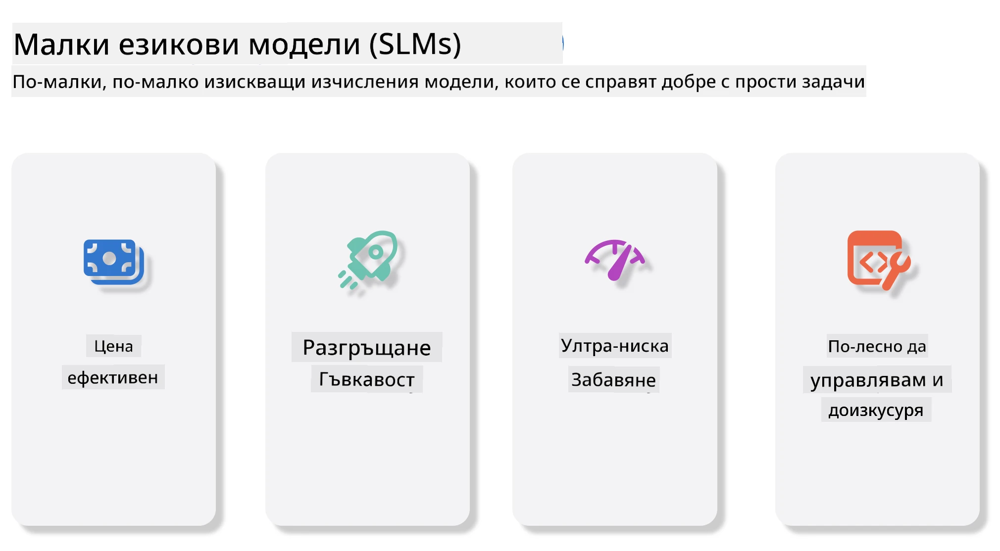
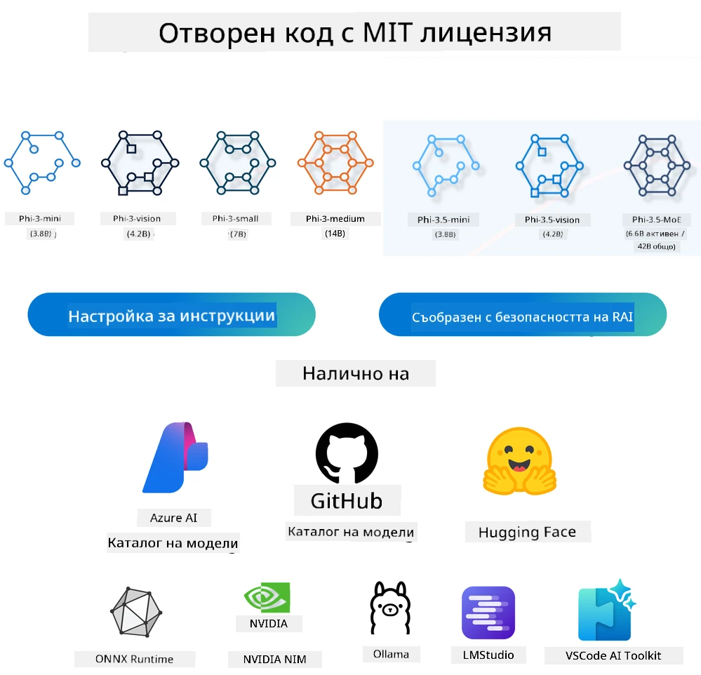
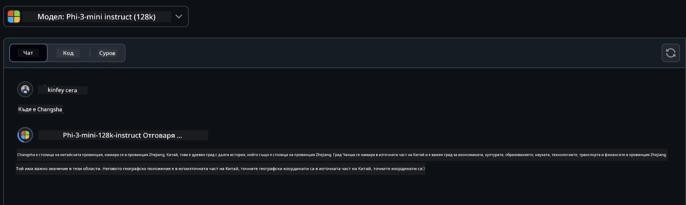
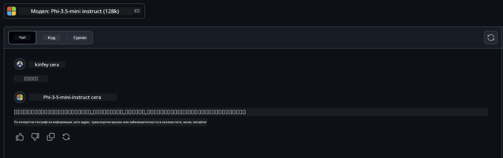

# Въведение в Малки Езикови Модели за Генеративен AI за Начинаещи
Генеративният AI е завладяваща област на изкуствения интелект, която се фокусира върху създаването на системи, способни да генерират ново съдържание. Това съдържание може да варира от текст и изображения до музика и дори цели виртуални среди. Едно от най-вълнуващите приложения на генеративния AI е в областта на езиковите модели.

## Какво са Малките Езикови Модели?

Малкият Езиков Модел (SLM) представлява намалена версия на голям езиков модел (LLM), използвайки много от архитектурните принципи и техники на LLM, като същевременно показва значително намален изчислителен отпечатък.

SLM са подмножество езикови модели, проектирани да генерират текст, подобен на човешкия. За разлика от техните по-големи аналози, като GPT-4, SLM са по-компактни и ефективни, което ги прави идеални за приложения, където изчислителните ресурси са ограничени. Въпреки по-малкия си размер, те все още могат да изпълняват разнообразни задачи. Обикновено SLM се конструират чрез компресиране или дистилация на LLM, с цел да се запази значителна част от функционалността и лингвистичните способности на оригиналния модел. Това намаление на размера на модела понижава общата сложност, правейки SLM по-ефективни както по отношение на използването на памет, така и на изчислителните изисквания. Въпреки тези оптимизации, SLM все още могат да изпълняват широк спектър от задачи за обработка на естествен език (NLP):

- Генериране на текст: Създаване на свързан и контекстуално уместен текст или параграфи.
- Допълване на текст: Предсказване и допълване на изречения базирано на даден водещ текст.
- Превод: Преобразуване на текст от един език на друг.
- Сумиране: Съкращаване на дълги текстове до по-кратки и по-лесно разбираеми резюмета.

Макар и с някои компромиси в производителността или дълбочината на разбирането, в сравнение с по-големите си аналози.

## Как Работят Малките Езикови Модели?
SLM се обучават на огромни количества текстови данни. По време на обучението, те изучават моделите и структурите на езика, което им позволява да генерират текст, който е както граматически правилен, така и контекстуално подходящ. Процесът на обучение включва:

- Събиране на данни: Събиране на големи набори от текстове от различни източници.
- Предобработка: Почистване и организиране на данните, за да станат подходящи за обучение.
- Обучение: Използване на алгоритми за машинно обучение, за да се научи моделът как да разбира и генерира текст.
- Финна настройка: Регулиране на модела за подобряване на представянето му по конкретни задачи.

Развитието на SLM съвпада с нарастващата нужда от модели, които могат да бъдат внедрени в среди с ограничени ресурси, като мобилни устройства или гранични изчислителни платформи, където пълномащабните LLM може да са непрактични поради техните големи изисквания. Чрез фокус върху ефективността, SLM балансират производителността с достъпността, позволявайки по-широко приложение в различни области.



## Учебни Цели

В този урок се надяваме да въведем знанията за SLM и да ги комбинираме с Microsoft Phi-3, за да научим различни сценарии в текстово съдържание, зрение и MoE.

Към края на урока, трябва да можете да отговорите на следните въпроси:

- Какво е SLM?
- Каква е разликата между SLM и LLM?
- Какво е семейството Microsoft Phi-3/3.5?
- Как да извършим инференция с Microsoft Phi-3/3.5?

Готови ли сте? Да започваме.

## Разликите между Големите Езикови Модели (LLM) и Малките Езикови Модели (SLM)

И LLM, и SLM са изградени върху основни принципи на вероятностно машинно обучение, следвайки подобни подходи в архитектурния дизайн, методологиите на обучение, процесите на генериране на данни и техниките за оценка на модела. Въпреки това, няколко ключови фактора ги разграничават.

## Приложения на Малките Езикови Модели

SLM имат широк обхват от приложения, включително:

- Чатботове: Предоставяне на клиентска поддръжка и комуникация с потребители по разговорен начин.
- Създаване на съдържание: Помощ на писатели чрез генериране на идеи или дори чернови на цели статии.
- Образование: Помощ на студенти с писмени задачи или изучаване на нови езици.
- Достъпност: Създаване на инструменти за хора с увреждания, като системи за преобразуване на текст в говор.

**Размер**

Основното различие между LLM и SLM е в мащаба на моделите. LLM като ChatGPT (GPT-4) могат да съдържат приблизително 1.76 трилиона параметри, докато отворенокодови SLM като Mistral 7B са проектирани с значително по-малко параметри — приблизително 7 милиарда. Тази разлика се дължи главно на различия в архитектурата на модела и процесите на обучение. Например, ChatGPT използва механизъм за самовнимание в рамките на енкодер-декодерна архитектура, докато Mistral 7B използва слайдър внимание, което позволява по-ефективно обучение в декодер-единствен модел. Тази архитектурна разлика има съществено значение за сложността и представянето на тези модели.

**Разбиране**

SLM обикновено са оптимизирани за представяне в специфични домейни, което ги прави високо специализирани, но възможно ограничени в способността си да осигурят широк контекстуален обхват в множество области на знанието. Обратното, LLM целят да симулират човешки интелект на по-широко ниво. Обучени върху огромни, разнообразни набори данни, LLM са създадени да се представят добре в различни области, предлагайки по-голяма гъвкавост и адаптивност. Следователно, LLM са по-подходящи за широк спектър от задачи, като обработка на естествен език и програмиране.

**Изчислителни ресурси**

Обучението и внедряването на LLM са ресурсоемки процеси, често изискващи значителна изчислителна инфраструктура, включително големи GPU клъстери. Например, обучението на модел като ChatGPT от нулата може да изисква хиляди GPU за продължителни периоди. Обратно, SLM с по-малък брой параметри са по-достъпни по отношение на изчислителните ресурси. Модели като Mistral 7B могат да се обучават и изпълняват на локални машини с умерени GPU възможности, въпреки че обучението все още отнема няколко часа при множество GPU.

**Пристрастия**

Пристрастията са познат проблем при LLM, главно поради естеството на обучителните данни. Тези модели често разчитат на сурови, отворени данни от интернет, които може да подценяват или неправилно представят определени групи, да въвеждат грешни етикети или да отразяват езикови пристрастия, повлияни от диалекти, географски вариации и граматически правила. Освен това, сложността на архитектурите на LLM може неволно да засили пристрастия, които да останат незабелязани без внимателна фина настройка. От друга страна, SLM, обучени върху по-ограничени, домейн-специфични набори данни, са по-малко уязвими на такива пристрастия, въпреки че не са напълно защитени.

**Инференция**

Намаленият размер на SLM им дава значително предимство по отношение на скоростта на инференция, позволявайки им да генерират изходи ефективно на локален хардуер, без необходимост от мащабна паралелна обработка. Обратно, LLM заради големината и сложността си често изискват значителни паралелни изчислителни ресурси за постигане на приемливи времена за инференция. Наличието на множество паралелни потребители допълнително забавя времето за отговор на LLM, особено при внедряване в голям мащаб.

В обобщение, въпреки че LLM и SLM споделят основа в машинното обучение, те се различават значително по размер на модела, изисквания към ресурсите, контекстуално разбиране, уязвимост към пристрастия и скорост на инференция. Тези различия отразяват тяхната съответна приложимост за различни случаи, като LLM са по-гъвкави, но ресурсоемки, а SLM предлагат по-специализирана ефективност с намалени изчислителни нужди.

***Забележка: В този урок ще представим SLM чрез примера на Microsoft Phi-3 / 3.5.***

## Представяне на Phi-3 / Phi-3.5 Семейство

Phi-3 / 3.5 Семейството основно насочва към текстови, визуални и Agent (MoE) сценарии на приложение:

### Phi-3 / 3.5 Инструкции

Основно за генериране на текст, завършване на чат и извличане на информация от съдържание и др.

**Phi-3-mini**

Езиковият модел с 3.8 милиарда параметри е наличен в Microsoft Azure AI Studio, Hugging Face и Ollama. Моделите Phi-3 превъзхождат значително езиковите модели със същия и по-голям размер в ключови бенчмаркове (вижте цифрите от бенчмарковете по-долу, по-високите числа са по-добри). Phi-3-mini превъзхожда модели с два пъти по-голям размер, докато Phi-3-small и Phi-3-medium превъзхождат по-големи модели, включително GPT-3.5.

**Phi-3-small & medium**

С едва 7 милиарда параметри, Phi-3-small надминава GPT-3.5T в разнообразни езикови, логически, кодиращи и математически бенчмаркове.

Phi-3-medium с 14 милиарда параметри продължава тази тенденция и превъзхожда Gemini 1.0 Pro.

**Phi-3.5-mini**

Можем да го разглеждаме като подобрение на Phi-3-mini. Докато параметрите остават непроменени, той подобрява възможността да поддържа множество езици (поддържа 20+ езика: арабски, китайски, чешки, датски, холандски, английски, фински, френски, немски, иврит, унгарски, италиански, японски, корейски, норвежки, полски, португалски, руски, испански, шведски, тайски, турски, украински) и добавя по-силна поддръжка за дълъг контекст.

Phi-3.5-mini с 3.8 милиарда параметри превъзхожда езиковите модели със същия размер и се сравнява с модели с два пъти по-голям размер.

### Phi-3 / 3.5 Визия

Може да разглеждаме Instruct модела на Phi-3/3.5 като способността на Phi да разбира, а Vision е това, което дава на Phi „очи“, за да разбира света.

**Phi-3-Vision**

Phi-3-vision, с едва 4.2 милиарда параметри, продължава тази тенденция и превъзхожда по-големи модели като Claude-3 Haiku и Gemini 1.0 Pro V при общи задачи по визуално разсъждение, OCR и разбиране на таблици и диаграми.

**Phi-3.5-Vision**

Phi-3.5-Vision също е подобрение на Phi-3-Vision, добавяйки поддръжка за множество изображения. Можете да го разглеждате като подобрение във визията: не само можете да виждате снимки, но и видеа.

Phi-3.5-vision превъзхожда по-големи модели като Claude-3.5 Sonnet и Gemini 1.5 Flash в задачи по OCR, разбиране на таблици и графики и е наравно при общи визуални задачи за разсъждение. Поддържа многокадров вход, т.е. извършване на разсъждения върху множество входни изображения.

### Phi-3.5-MoE

***Mixture of Experts (MoE)*** позволява моделите да се предобучават с много по-малко изчислителни ресурси, което означава, че можете драматично да увеличите размера на модела или набора от данни с един и същ изчислителен бюджет като на плътен модел. По-конкретно, MoE модел трябва да постигне същото качество като плътния си еквивалент много по-бързо по време на предобучението.

Phi-3.5-MoE се състои от 16 х 3.8 милиарда експертни модули. Phi-3.5-MoE с едва 6.6 милиарда активни параметри постига сходно ниво на разсъждение, езиково разбиране и математически способности като много по-големи модели.

Можем да използваме моделите от семейството Phi-3/3.5 в различни сценарии. За разлика от LLM, можете да внедрите Phi-3/3.5-mini или Phi-3/3.5-Vision на гранични устройства.

## Как да използваме моделите от Семейството Phi-3/3.5

Надяваме се да използваме Phi-3/3.5 в различни сценарии. След това ще използваме Phi-3/3.5 в различни сценарии.



### Инференция чрез Cloud API-та

**GitHub Models**

GitHub Models е най-прекият начин. Можете бързо да получите достъп до модела Phi-3/3.5-Instruct чрез GitHub Models. В комбинация с Azure AI Inference SDK / OpenAI SDK, можете да извършите API повиквания чрез код, за да направите повикване към Phi-3/3.5-Instruct. Можете също така да тествате различни резултати чрез Playground.

- Демонстрация: Сравнение на ефектите на Phi-3-mini и Phi-3.5-mini в китайски сценарии





**Azure AI Studio**

Или ако искаме да използваме визуалните и MoE модели, можете да използвате Azure AI Studio за изпълнение на повикванията. Ако сте заинтересовани, можете да прочетете Phi-3 Cookbook, за да научите как да извършвате повиквания към Phi-3/3.5 Instruct, Vision, MoE чрез Azure AI Studio [Кликнете тук](https://github.com/microsoft/Phi-3CookBook/blob/main/md/02.QuickStart/AzureAIStudio_QuickStart.md?WT.mc_id=academic-105485-koreyst)

**NVIDIA NIM**

Освен облачните решения за каталог на модели, предоставяни от Azure и GitHub, можете също да използвате [NVIDIA NIM](https://developer.nvidia.com/nim?WT.mc_id=academic-105485-koreyst) за осъществяване на съответните повиквания. Можете да посетите NVIDIA NIM, за да изпълнявате API повиквания на модела Phi-3/3.5. NVIDIA NIM (NVIDIA Inference Microservices) е набор от ускорени инференц микросървиси, предназначени да помогнат на разработчиците да внедрят AI модели ефективно в различни среди, включително облаци, центрове за данни и работни станции.

Ето някои ключови характеристики на NVIDIA NIM:
- **Лесно разгръщане:** NIM позволява разгръщането на AI модели с една команда, което го прави лесен за интегриране в съществуващи работни потоци.
- **Оптимизирана производителност:** Използва предварително оптимизирани inference енджини на NVIDIA, като TensorRT и TensorRT-LLM, за да осигури ниска латентност и висок капацитет.
- **Мащабируемост:** NIM поддържа автоматично мащабиране в Kubernetes, което позволява ефективно справяне с променливи натоварвания.
- **Сигурност и контрол:** Организациите могат да запазят контрол върху своите данни и приложения, като самостоятелно хостват NIM микросървиси на собствената си управлявана инфраструктура.
- **Стандартни API-та:** NIM предоставя индустриални стандартни API-та, което улеснява създаването и интегрирането на AI приложения като чатботове, AI асистенти и други.

NIM е част от NVIDIA AI Enterprise, която цели да опрости разгръщането и оперативната работа с AI модели, като гарантира, че те работят ефективно на NVIDIA GPU.

- Демонстрация: Използване на NVIDIA NIM за извикване на Phi-3.5-Vision-API  [[Кликнете тук](./python/Phi-3-Vision-Nividia-NIM.ipynb?WT.mc_id=academic-105485-koreyst)]


### Стартиране на Phi-3/3.5 локално
Inference във връзка с Phi-3, или с всеки езиков модел като GPT-3, се отнася до процеса на генериране на отговори или предсказания въз основа на предоставения вход. Когато дадете подкана или въпрос на Phi-3, той използва обучената си невронна мрежа, за да направи най-вероятния и релевантен отговор, анализирайки модели и връзки в данните, на които е бил обучен.

**Hugging Face Transformer**
Hugging Face Transformers е мощна библиотека, предназначена за обработка на естествен език (NLP) и други задачи в машинното обучение. Ето някои ключови моменти за нея:

1. **Предобучени модели:** Предоставя хиляди предварително обучени модели, които могат да се използват за различни задачи като класификация на текст, разпознаване на именовани обекти, отговаряне на въпроси, обобщаване, превод и генериране на текст.

2. **Съвместимост с множество рамки:** Библиотеката поддържа няколко дълбоки рамки за обучение, включително PyTorch, TensorFlow и JAX. Това ви позволява да обучавате модел в една рамка и да го използвате в друга.

3. **Мултимодални възможности:** Освен NLP, Hugging Face Transformers поддържа и задачи в компютърното зрение (например класификация на изображения, откриване на обекти) и аудио обработка (например разпознаване на реч, класификация на аудио).

4. **Лесна употреба:** Библиотеката предлага API-та и инструменти за лесно изтегляне и фино настрояване на модели, което я прави достъпна както за начинаещи, така и за експерти.

5. **Община и ресурси:** Hugging Face има активна общност и обширна документация, учебни материали и ръководства, които помагат на потребителите да започнат и да извлекат максимума от библиотеката.
[официална документация](https://huggingface.co/docs/transformers/index?WT.mc_id=academic-105485-koreyst) или тяхното [GitHub хранилище](https://github.com/huggingface/transformers?WT.mc_id=academic-105485-koreyst).

Това е най-често използваният метод, но изисква ускорение чрез GPU. Все пак, сценарии като Vision и MoE изискват много изчисления, които ще бъдат много бавни на CPU, ако не са квантизирани.


- Демонстрация: Използване на Transformer за извикване на Phi-3.5-Instruct [Кликнете тук](./python/phi35-instruct-demo.ipynb?WT.mc_id=academic-105485-koreyst)

- Демонстрация: Използване на Transformer за извикване на Phi-3.5-Vision [Кликнете тук](./python/phi35-vision-demo.ipynb?WT.mc_id=academic-105485-koreyst)

- Демонстрация: Използване на Transformer за извикване на Phi-3.5-MoE [Кликнете тук](./python/phi35_moe_demo.ipynb?WT.mc_id=academic-105485-koreyst)

**Ollama**
[Ollama](https://ollama.com/?WT.mc_id=academic-105485-koreyst) е платформа, предназначена да улесни стартирането на големи езикови модели (LLM) локално на вашата машина. Поддържа различни модели като Llama 3.1, Phi 3, Mistral и Gemma 2, между други. Платформата опростява процеса, като събира тежестите на модела, конфигурацията и данните в един пакет, което го прави по-достъпен за потребителите да персонализират и създават свои модели. Ollama е налична за macOS, Linux и Windows. Това е чудесен инструмент, ако искате да експериментирате с или разгръщате LLM без да разчитате на облачни услуги. Ollama е най-директният начин, просто трябва да изпълните следната команда.


```bash

ollama run phi3.5

```


**ONNX Runtime за GenAI**

[ONNX Runtime](https://github.com/microsoft/onnxruntime-genai?WT.mc_id=academic-105485-koreyst) е кросплатформен ускорител за inference и обучение на машинно обучение. ONNX Runtime за Генеративен ИИ (GENAI) е мощен инструмент, който ви помага да стартирате генериращи AI модели ефективно на различни платформи.

## Какво е ONNX Runtime?
ONNX Runtime е проект с отворен код, който позволява високопроизводително inference на модели за машинно обучение. Той поддържа модели във формат Open Neural Network Exchange (ONNX), който е стандарт за представяне на модели за машинно обучение. ONNX Runtime inference може да осигури по-бързи клиентски преживявания и по-ниски разходи, като поддържа модели от дълбоки рамки като PyTorch и TensorFlow/Keras, както и класически машинни библиотеки като scikit-learn, LightGBM, XGBoost и други. ONNX Runtime е съвместим с различен хардуер, драйвери и операционни системи и осигурява оптимална производителност, използвайки хардуерни ускорители, където е приложимо, заедно с оптимизации и преобразувания на графите.

## Какво е Генеративен AI?
Генеративен AI се отнася до AI системи, които могат да генерират ново съдържание като текст, изображения или музика въз основа на данните, на които са били обучени. Примери са езикови модели като GPT-3 и модели за генериране на изображения като Stable Diffusion. Библиотеката ONNX Runtime за GenAI осигурява генеративен AI цикъл за ONNX модели, включително inference с ONNX Runtime, обработка на логити, търсене и вземане на проби, и управление на KV кеш.

## ONNX Runtime за GENAI
ONNX Runtime за GENAI разширява възможностите на ONNX Runtime, за да поддържа генеративни AI модели. Ето някои ключови характеристики:

- **Широка платформа поддръжка:** Работи на различни платформи, включително Windows, Linux, macOS, Android и iOS.
- **Поддръжка на модели:** Поддържа много популярни generative AI модели, като LLaMA, GPT-Neo, BLOOM и други.
- **Оптимизация на производителността:** Включва оптимизации за различни хардуерни ускорители като NVIDIA GPU, AMD GPU и др.
- **Лесна употреба:** Осигурява API-та за лесна интеграция в приложения, позволявайки ви да генерирате текст, изображения и друго съдържание с минимален код.
- Потребителите могат да извикат високо ниво функция generate(), или да изпълнят всяка итерация на модела в цикъл, генерирайки един токен наведнъж и при желание да актуализират параметрите за генериране в рамките на цикъла.
- ONNX runtime също поддържа жадно/лъчево търсене и TopP, TopK вземане на проби за генериране на последователности от токени и вградена обработка на логити като наказания за повторения. Лесно може да се добави и персонализирано оценяване.

## Започване
За да започнете с ONNX Runtime за GENAI, можете да следвате тези стъпки:

### Инсталиране на ONNX Runtime:
```Python
pip install onnxruntime
```
### Инсталиране на Генеративни AI разширения:
```Python
pip install onnxruntime-genai
```

### Стартиране на модел: Ето един прост пример на Python:
```Python
import onnxruntime_genai as og

model = og.Model('path_to_your_model.onnx')

tokenizer = og.Tokenizer(model)

input_text = "Hello, how are you?"

input_tokens = tokenizer.encode(input_text)

output_tokens = model.generate(input_tokens)

output_text = tokenizer.decode(output_tokens)

print(output_text) 
```
### Демонстрация: Използване на ONNX Runtime GenAI за извикване на Phi-3.5-Vision


```python

import onnxruntime_genai as og

model_path = './Your Phi-3.5-vision-instruct ONNX Path'

img_path = './Your Image Path'

model = og.Model(model_path)

processor = model.create_multimodal_processor()

tokenizer_stream = processor.create_stream()

text = "Your Prompt"

prompt = "<|user|>\n"

prompt += "<|image_1|>\n"

prompt += f"{text}<|end|>\n"

prompt += "<|assistant|>\n"

image = og.Images.open(img_path)

inputs = processor(prompt, images=image)

params = og.GeneratorParams(model)

params.set_inputs(inputs)

params.set_search_options(max_length=3072)

generator = og.Generator(model, params)

while not generator.is_done():

    generator.compute_logits()
    
    generator.generate_next_token()

    new_token = generator.get_next_tokens()[0]
    
    output = tokenizer_stream.decode(new_token)
    
    print(tokenizer_stream.decode(new_token), end='', flush=True)

```


**Други**

Освен ONNX Runtime и Ollama препоръчителните методи, можем също така да допълним справката за квантитативни модели въз основа на справочните методи за модели, предоставяни от различните производители. Например Apple MLX framework с Apple Metal, Qualcomm QNN с NPU, Intel OpenVINO с CPU/GPU и други. Можете също да намерите повече съдържание в [Phi-3 Cookbook](https://github.com/microsoft/phi-3cookbook?WT.mc_id=academic-105485-koreyst)


## Повече

Научихме основите на Phi-3/3.5 фамилията, но за да научим повече за SLM, ни е нужна допълнителна информация. Можете да намерите отговорите в Phi-3 Cookbook. Ако искате да научите повече, моля посетете [Phi-3 Cookbook](https://github.com/microsoft/phi-3cookbook?WT.mc_id=academic-105485-koreyst).

---

<!-- CO-OP TRANSLATOR DISCLAIMER START -->
**Отказ от отговорност**:  
Този документ е преведен с помощта на AI преводаческа услуга [Co-op Translator](https://github.com/Azure/co-op-translator). Въпреки че се стремим към точност, моля, имайте предвид, че автоматизираните преводи могат да съдържат грешки или неточности. Оригиналният документ на неговия роден език трябва да се счита за авторитетен източник. За критична информация се препоръчва професионален човешки превод. Не носим отговорност за всякакви недоразумения или неправилни тълкувания, произтичащи от използването на този превод.
<!-- CO-OP TRANSLATOR DISCLAIMER END -->