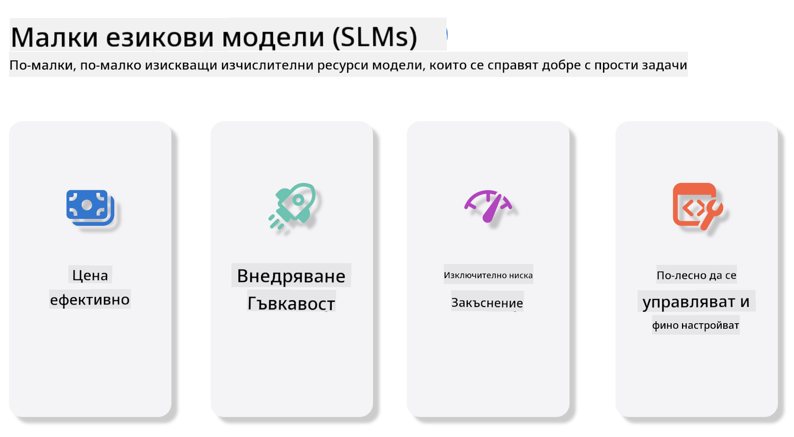
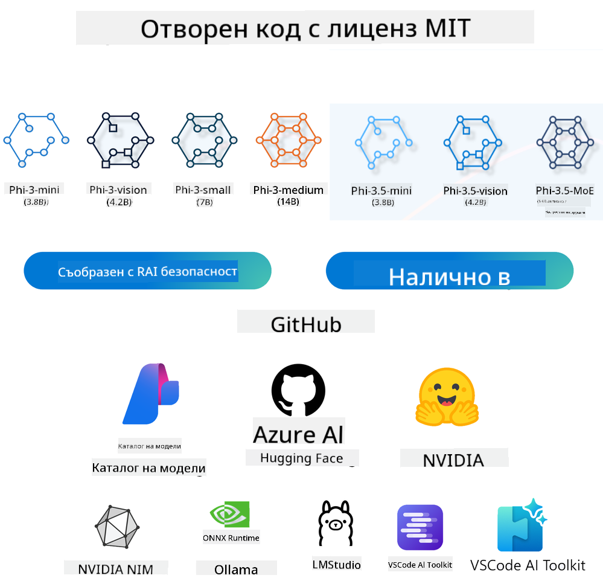
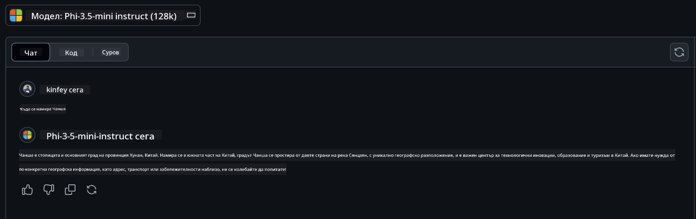

<!--
CO_OP_TRANSLATOR_METADATA:
{
  "original_hash": "124ad36cfe96f74038811b6e2bb93e9d",
  "translation_date": "2025-07-09T18:48:50+00:00",
  "source_file": "19-slm/README.md",
  "language_code": "bg"
}
-->
# Въведение в малките езикови модели за генеративен AI за начинаещи  
Генеративният AI е завладяваща област на изкуствения интелект, която се фокусира върху създаването на системи, способни да генерират ново съдържание. Това съдържание може да варира от текст и изображения до музика и дори цели виртуални среди. Едно от най-вълнуващите приложения на генеративния AI е в сферата на езиковите модели.

## Какво представляват малките езикови модели?  

Малкият езиков модел (SLM) представлява олекотена версия на големия езиков модел (LLM), използвайки много от архитектурните принципи и техники на LLM, но с значително по-малко изчислителни ресурси.  

SLM са подмножество от езиковите модели, предназначени да генерират текст, подобен на човешкия. За разлика от по-големите си аналози, като GPT-4, SLM са по-компактни и ефективни, което ги прави идеални за приложения с ограничени изчислителни ресурси. Въпреки по-малкия си размер, те могат да изпълняват разнообразни задачи. Обикновено SLM се създават чрез компресиране или дистилация на LLM, с цел да запазят значителна част от функционалността и езиковите способности на оригиналния модел. Това намаляване на размера на модела намалява общата сложност, правейки SLM по-ефективни както по отношение на използването на памет, така и на изчислителните изисквания. Въпреки тези оптимизации, SLM могат да изпълняват широк спектър от задачи в обработката на естествен език (NLP):

- Генериране на текст: Създаване на свързани и контекстуално релевантни изречения или параграфи.  
- Допълване на текст: Предсказване и завършване на изречения въз основа на даден подтик.  
- Превод: Преобразуване на текст от един език на друг.  
- Обобщение: Съкращаване на дълги текстове в по-кратки и по-лесно усвоими резюмета.  

Въпреки това, с някои компромиси в производителността или дълбочината на разбирането в сравнение с по-големите модели.

## Как работят малките езикови модели?  
SLM се обучават върху огромни количества текстови данни. По време на обучението те усвояват модели и структури на езика, което им позволява да генерират текст, който е както граматически правилен, така и контекстуално подходящ. Процесът на обучение включва:

- Събиране на данни: Събиране на големи текстови набори от различни източници.  
- Предварителна обработка: Почистване и организиране на данните, за да бъдат подходящи за обучение.  
- Обучение: Използване на алгоритми за машинно обучение, които учат модела как да разбира и генерира текст.  
- Финна настройка: Коригиране на модела за подобряване на представянето му в конкретни задачи.  

Развитието на SLM отговаря на нарастващата нужда от модели, които могат да бъдат внедрени в среди с ограничени ресурси, като мобилни устройства или edge изчислителни платформи, където пълномащабните LLM може да са непрактични заради големите си изисквания към ресурсите. Като се фокусират върху ефективността, SLM балансират между производителност и достъпност, позволявайки по-широко приложение в различни области.



## Учебни цели  

В този урок се надяваме да запознаем с концепцията за SLM и да я комбинираме с Microsoft Phi-3, за да разгледаме различни сценарии в текстово съдържание, визуално разпознаване и MoE.

Към края на урока трябва да можете да отговорите на следните въпроси:

- Какво е SLM  
- Каква е разликата между SLM и LLM  
- Какво представлява Microsoft Phi-3/3.5 Family  
- Как да извършваме инференция с Microsoft Phi-3/3.5 Family  

Готови ли сте? Да започваме.

## Разликите между големите езикови модели (LLM) и малките езикови модели (SLM)  

И двата типа модели, LLM и SLM, са изградени върху основни принципи на вероятностното машинно обучение, следвайки сходни подходи в архитектурния дизайн, методологиите на обучение, процесите на генериране на данни и техниките за оценка на моделите. Въпреки това, няколко ключови фактора ги различават.

## Приложения на малките езикови модели  

SLM имат широк спектър от приложения, включително:

- Чатботове: Осигуряване на клиентска поддръжка и взаимодействие с потребителите в разговорен стил.  
- Създаване на съдържание: Помощ на писатели чрез генериране на идеи или дори чернови на цели статии.  
- Образование: Подпомагане на ученици при писмени задачи или изучаване на нови езици.  
- Достъпност: Създаване на инструменти за хора с увреждания, като системи за преобразуване на текст в реч.  

**Размер**  

Основната разлика между LLM и SLM е в мащаба на моделите. LLM, като ChatGPT (GPT-4), могат да съдържат приблизително 1.76 трилиона параметри, докато отворените SLM като Mistral 7B са проектирани с значително по-малко параметри — около 7 милиарда. Тази разлика се дължи главно на архитектурните и обучителните процеси. Например, ChatGPT използва механизъм за самовнимание в рамките на енкодер-декодер архитектура, докато Mistral 7B използва плъзгащо се внимание, което позволява по-ефективно обучение в модел само с декодер. Тази архитектурна разлика има сериозни последици за сложността и производителността на моделите.

**Разбиране**  

SLM обикновено са оптимизирани за представяне в конкретни области, което ги прави силно специализирани, но потенциално ограничени в способността си да осигурят широко контекстуално разбиране в множество области на знанието. За разлика от тях, LLM се стремят да симулират човешка интелигентност на по-широко ниво. Обучени върху огромни и разнообразни набори от данни, LLM са проектирани да се представят добре в различни области, предлагайки по-голяма гъвкавост и адаптивност. Следователно, LLM са по-подходящи за по-широк спектър от задачи, като обработка на естествен език и програмиране.

**Изчислителни ресурси**  

Обучението и внедряването на LLM са ресурсоемки процеси, често изискващи значителна изчислителна инфраструктура, включително големи GPU клъстери. Например, обучението на модел като ChatGPT от нулата може да изисква хиляди GPU-та за продължителен период. За разлика от тях, SLM с по-малък брой параметри са по-достъпни по отношение на изчислителните ресурси. Модели като Mistral 7B могат да се обучават и изпълняват на локални машини с умерени GPU възможности, макар че обучението все още изисква няколко часа на няколко GPU-та.

**Пристрастия**  

Пристрастията са известен проблем при LLM, главно поради естеството на обучителните данни. Тези модели често използват сурови, публично достъпни данни от интернет, които могат да подценяват или изкривяват определени групи, да въвеждат грешно етикетиране или да отразяват езикови пристрастия, повлияни от диалекти, географски вариации и граматически правила. Освен това, сложността на архитектурите на LLM може неволно да засили тези пристрастия, които могат да останат незабелязани без внимателна финна настройка. От друга страна, SLM, обучени върху по-ограничени, домейн-специфични набори от данни, са по-малко податливи на такива пристрастия, макар че не са напълно имунизирани.

**Инференция**  

Намаленият размер на SLM им дава значително предимство по отношение на скоростта на инференция, позволявайки им да генерират резултати ефективно на локален хардуер без необходимост от обширна паралелна обработка. За разлика от тях, LLM, поради размера и сложността си, често изискват значителни паралелни изчислителни ресурси, за да постигнат приемливи времена за инференция. Наличието на множество едновременни потребители допълнително забавя времето за отговор на LLM, особено при внедряване в голям мащаб.

В обобщение, въпреки че LLM и SLM споделят основи в машинното обучение, те се различават значително по отношение на размера на модела, изискванията към ресурсите, контекстуалното разбиране, податливостта на пристрастия и скоростта на инференция. Тези различия отразяват тяхната пригодност за различни случаи на употреба, като LLM са по-гъвкави, но ресурсоемки, а SLM предлагат по-ефективна работа в конкретни области с по-ниски изчислителни изисквания.

***Note：В тази глава ще представим SLM, използвайки Microsoft Phi-3 / 3.5 като пример.***

## Представяне на Phi-3 / Phi-3.5 Family  

Phi-3 / 3.5 Family е насочена основно към текстови, визуални и Agent (MoE) приложения:

### Phi-3 / 3.5 Instruct  

Основно за генериране на текст, допълване на чат и извличане на съдържание и информация и др.

**Phi-3-mini**  

Езиковият модел с 3.8 милиарда параметри е достъпен в Microsoft Azure AI Studio, Hugging Face и Ollama. Моделите Phi-3 значително превъзхождат езиковите модели с равен или по-голям размер на ключови тестове (вижте числата от бенчмарковете по-долу, по-високите числа са по-добри). Phi-3-mini превъзхожда модели с два пъти по-голям размер, докато Phi-3-small и Phi-3-medium превъзхождат по-големи модели, включително GPT-3.5.

**Phi-3-small & medium**  

С едва 7 милиарда параметри, Phi-3-small побеждава GPT-3.5T в различни езикови, логически, кодиращи и математически тестове.  

Phi-3-medium с 14 милиарда параметри продължава тази тенденция и превъзхожда Gemini 1.0 Pro.

**Phi-3.5-mini**  

Можем да го разглеждаме като ъпгрейд на Phi-3-mini. Въпреки че броят на параметрите остава същият, подобрява способността за поддръжка на множество езици (поддържа над 20 езика: арабски, китайски, чешки, датски, холандски, английски, фински, френски, немски, иврит, унгарски, италиански, японски, корейски, норвежки, полски, португалски, руски, испански, шведски, тайландски, турски, украински) и добавя по-силна поддръжка за дълъг контекст.  

Phi-3.5-mini с 3.8 милиарда параметри превъзхожда езикови модели със същия размер и е наравно с модели с два пъти по-голям размер.

### Phi-3 / 3.5 Vision  

Можем да разглеждаме Instruct модела на Phi-3/3.5 като способността на Phi да разбира, а Vision е това, което дава на Phi „очи“, за да разбира света.

**Phi-3-Vision**  

Phi-3-vision, с едва 4.2 милиарда параметри, продължава тази тенденция и превъзхожда по-големи модели като Claude-3 Haiku и Gemini 1.0 Pro V в общи задачи за визуално разсъждение, OCR и разбиране на таблици и диаграми.

**Phi-3.5-Vision**  

Phi-3.5-Vision е ъпгрейд на Phi-3-Vision, добавяйки поддръжка за множество изображения. Можем да го разглеждаме като подобрение във визията — не само вижда снимки, но и видеа.  

Phi-3.5-vision превъзхожда по-големи модели като Claude-3.5 Sonnet и Gemini 1.5 Flash в OCR, разбиране на таблици и графики и е наравно в общи задачи за визуално знание и разсъждение. Поддържа многокадров вход, т.е. извършва разсъждения върху множество входни изображения.

### Phi-3.5-MoE  

***Mixture of Experts (MoE)*** позволява моделите да се предобучават с много по-малко изчислителни ресурси, което означава, че можете значително да увеличите размера на модела или набора от данни с бюджет за изчисления, равен на този на плътен модел. По-конкретно, MoE моделът трябва да постигне същото качество като плътния си аналог много по-бързо по време на предобучението.

Phi-3.5-MoE се състои от 16x3.8B експертни модула. Phi-3.5-MoE с едва 6.6 милиарда активни параметри постига подобно ниво на разсъждение, езиково разбиране и математика като много по-големи модели.

Можем да използваме моделите от Phi-3/3.5 Family в различни сценарии. За разлика от LLM, можете да внедрите Phi-3/3.5-mini или Phi-3/3.5-Vision на edge устройства.

## Как да използваме моделите от Phi-3/3.5 Family  

Надяваме се да използваме Phi-3/3.5 в различни сценарии. По-нататък ще разгледаме използването на Phi-3/3.5 в различни ситуации.



### Разлика в инференцията чрез Cloud API  

**GitHub Models**  

GitHub Models е най-прекият начин. Можете бързо да получите достъп до Phi-3/3.5-Instruct модела чрез GitHub Models. В комбинация с Azure AI Inference SDK / OpenAI SDK, можете да достъпите API чрез код, за да извършите повикване към Phi-3/3.5-Instruct. Можете също така да тествате различни ефекти чрез Playground.

- Демонстрация: Сравнение на ефектите на Phi-3-mini и Phi-3.5-mini в китайски сценарии




**Azure AI Studio**  

Или ако искаме да използваме vision и MoE моделите, можем да използваме Azure AI Studio за извършване на повиквания. Ако се интересувате, можете да прочетете Phi-3 Cookbook, за да научите как да извиквате Phi-3/3.5 Instruct, Vision, MoE чрез Azure AI Studio [Кликнете тук](https://github.com/microsoft/Phi-3CookBook/blob/main/md/02.QuickStart/AzureAIStudio_QuickStart.md?WT.mc_id=academic-105485-koreyst)

**NVIDIA NIM**  

Освен облачните решения за каталог на модели, предоставени от Azure и GitHub, можете да използвате и [NVIDIA NIM](https://developer.nvidia.com/nim?WT.mc_id=academic-105485-koreyst) за извършване на свързани повиквания. Можете да посетите NVIDIA NIM, за да извършите API повиквания към Phi-3/3.5 Family. NVIDIA NIM (NVIDIA Inference Microservices) е набор от ускорени микросервизи за инференция, предназначени
- **Сигурност и контрол:** Организациите могат да запазят контрола върху своите данни и приложения, като хостват сами NIM микросървиси на собствена управлявана инфраструктура.
- **Стандартни API-та:** NIM предоставя индустриално утвърдени API-та, което улеснява създаването и интеграцията на AI приложения като чатботове, AI асистенти и други.

NIM е част от NVIDIA AI Enterprise, чиято цел е да опрости внедряването и експлоатацията на AI модели, като гарантира тяхната ефективна работа на NVIDIA GPU.

- Демонстрация: Използване на Nvidia NIM за извикване на Phi-3.5-Vision-API  [[Кликнете тук](python/Phi-3-Vision-Nividia-NIM.ipynb)]


### Инференция на Phi-3/3.5 в локална среда
Инференцията във връзка с Phi-3, или с всеки езиков модел като GPT-3, се отнася до процеса на генериране на отговори или прогнози въз основа на подадения вход. Когато подадете заявка или въпрос към Phi-3, той използва своя обучен невронен модел, за да изведе най-вероятния и релевантен отговор, анализирайки модели и връзки в данните, на които е бил обучен.

**Hugging Face Transformer**  
Hugging Face Transformers е мощна библиотека, създадена за обработка на естествен език (NLP) и други задачи в машинното обучение. Ето някои ключови моменти за нея:

1. **Предварително обучени модели:** Предлага хиляди предварително обучени модели, които могат да се използват за различни задачи като класификация на текст, разпознаване на именувани обекти, отговаряне на въпроси, обобщаване, превод и генериране на текст.

2. **Съвместимост с различни рамки:** Библиотеката поддържа няколко дълбоки обучителни рамки, включително PyTorch, TensorFlow и JAX. Това позволява да обучите модел в една рамка и да го използвате в друга.

3. **Мултимодални възможности:** Освен NLP, Hugging Face Transformers поддържа задачи в компютърното зрение (например класификация на изображения, откриване на обекти) и аудио обработка (например разпознаване на реч, класификация на аудио).

4. **Лесна употреба:** Библиотеката предлага API-та и инструменти за лесно изтегляне и донастройка на модели, което я прави достъпна както за начинаещи, така и за експерти.

5. **Общност и ресурси:** Hugging Face разполага с активна общност и обширна документация, уроци и ръководства, които помагат на потребителите да започнат и да извлекат максимума от библиотеката.  
[официална документация](https://huggingface.co/docs/transformers/index?WT.mc_id=academic-105485-koreyst) или техния [GitHub репозиторий](https://github.com/huggingface/transformers?WT.mc_id=academic-105485-koreyst).

Това е най-често използваният метод, но изисква GPU ускорение. В крайна сметка, сцени като Vision и MoE изискват много изчисления, които ще бъдат силно ограничени на CPU, ако не са квантизирани.


- Демонстрация: Използване на Transformer за извикване на Phi-3.5-Instuct [Кликнете тук](python/phi35-instruct-demo.ipynb)

- Демонстрация: Използване на Transformer за извикване на Phi-3.5-Vision [Кликнете тук](python/phi35-vision-demo.ipynb)

- Демонстрация: Използване на Transformer за извикване на Phi-3.5-MoE [Кликнете тук](python/phi35_moe_demo.ipynb)

**Ollama**  
[Ollama](https://ollama.com/?WT.mc_id=academic-105485-koreyst) е платформа, създадена да улесни стартирането на големи езикови модели (LLM) локално на вашия компютър. Поддържа различни модели като Llama 3.1, Phi 3, Mistral и Gemma 2, сред други. Платформата опростява процеса, като обединява теглата на модела, конфигурацията и данните в един пакет, което прави по-лесно за потребителите да персонализират и създават свои собствени модели. Ollama е налична за macOS, Linux и Windows. Това е отличен инструмент, ако искате да експериментирате с LLM или да ги внедрите без да разчитате на облачни услуги. Ollama е най-прекият начин, просто трябва да изпълните следното изречение.


```bash

ollama run phi3.5

```


**ONNX Runtime за GenAI**

[ONNX Runtime](https://github.com/microsoft/onnxruntime-genai?WT.mc_id=academic-105485-koreyst) е кросплатформен ускорител за инференция и обучение на машинно обучение. ONNX Runtime за Generative AI (GENAI) е мощен инструмент, който ви помага да изпълнявате генеративни AI модели ефективно на различни платформи.

## Какво е ONNX Runtime?  
ONNX Runtime е проект с отворен код, който позволява високопроизводителна инференция на машинно обучителни модели. Той поддържа модели в Open Neural Network Exchange (ONNX) формат, който е стандарт за представяне на машинно обучителни модели. ONNX Runtime инференцията може да осигури по-бързо обслужване на клиентите и по-ниски разходи, като поддържа модели от дълбоки обучителни рамки като PyTorch и TensorFlow/Keras, както и класически библиотеки за машинно обучение като scikit-learn, LightGBM, XGBoost и други. ONNX Runtime е съвместим с различен хардуер, драйвери и операционни системи и осигурява оптимална производителност чрез използване на хардуерни ускорители, където е приложимо, заедно с оптимизации и трансформации на графа.

## Какво е Generative AI?  
Generative AI се отнася до AI системи, които могат да генерират ново съдържание, като текст, изображения или музика, базирано на данните, на които са били обучени. Примери са езикови модели като GPT-3 и модели за генериране на изображения като Stable Diffusion. ONNX Runtime за GenAI библиотеката предоставя генеративния AI цикъл за ONNX модели, включително инференция с ONNX Runtime, обработка на логити, търсене и семплиране, както и управление на KV кеш.

## ONNX Runtime за GENAI  
ONNX Runtime за GENAI разширява възможностите на ONNX Runtime, за да поддържа генеративни AI модели. Ето някои ключови характеристики:

- **Широка платформа поддръжка:** Работи на различни платформи, включително Windows, Linux, macOS, Android и iOS.
- **Поддръжка на модели:** Поддържа много популярни генеративни AI модели като LLaMA, GPT-Neo, BLOOM и други.
- **Оптимизация на производителността:** Включва оптимизации за различни хардуерни ускорители като NVIDIA GPU, AMD GPU и други.
- **Лесна употреба:** Предоставя API-та за лесна интеграция в приложения, позволявайки ви да генерирате текст, изображения и друго съдържание с минимален код.
- Потребителите могат да извикат високониво generate() метод или да изпълняват всяка итерация на модела в цикъл, генерирайки по един токен наведнъж и по желание да актуализират параметрите на генерацията в цикъла.
- ONNX runtime също поддържа greedy/beam търсене и TopP, TopK семплиране за генериране на последователности от токени и вградена обработка на логити като наказания за повторения. Можете лесно да добавите и персонализирано оценяване.

## Започване  
За да започнете с ONNX Runtime за GENAI, можете да следвате тези стъпки:

### Инсталиране на ONNX Runtime:  
```Python
pip install onnxruntime
```  
### Инсталиране на разширенията за Generative AI:  
```Python
pip install onnxruntime-genai
```

### Стартиране на модел: Ето един прост пример на Python:  
```Python
import onnxruntime_genai as og

model = og.Model('path_to_your_model.onnx')

tokenizer = og.Tokenizer(model)

input_text = "Hello, how are you?"

input_tokens = tokenizer.encode(input_text)

output_tokens = model.generate(input_tokens)

output_text = tokenizer.decode(output_tokens)

print(output_text) 
```  
### Демонстрация: Използване на ONNX Runtime GenAI за извикване на Phi-3.5-Vision


```python

import onnxruntime_genai as og

model_path = './Your Phi-3.5-vision-instruct ONNX Path'

img_path = './Your Image Path'

model = og.Model(model_path)

processor = model.create_multimodal_processor()

tokenizer_stream = processor.create_stream()

text = "Your Prompt"

prompt = "<|user|>\n"

prompt += "<|image_1|>\n"

prompt += f"{text}<|end|>\n"

prompt += "<|assistant|>\n"

image = og.Images.open(img_path)

inputs = processor(prompt, images=image)

params = og.GeneratorParams(model)

params.set_inputs(inputs)

params.set_search_options(max_length=3072)

generator = og.Generator(model, params)

while not generator.is_done():

    generator.compute_logits()
    
    generator.generate_next_token()

    new_token = generator.get_next_tokens()[0]
    
    code += tokenizer_stream.decode(new_token)
    
    print(tokenizer_stream.decode(new_token), end='', flush=True)

```


**Други**

Освен ONNX Runtime и Ollama като референтни методи, можем да завършим референцията на количествени модели, базирани на методите, предоставени от различни производители. Например Apple MLX framework с Apple Metal, Qualcomm QNN с NPU, Intel OpenVINO с CPU/GPU и др. Можете да намерите още съдържание в [Phi-3 Cookbook](https://github.com/microsoft/phi-3cookbook?WT.mc_id=academic-105485-koreyst)


## Още

Научихме основите на Phi-3/3.5 семейството, но за да разберем повече за SLM, ни е нужна допълнителна информация. Можете да намерите отговорите в Phi-3 Cookbook. Ако искате да научите повече, моля посетете [Phi-3 Cookbook](https://github.com/microsoft/phi-3cookbook?WT.mc_id=academic-105485-koreyst).

**Отказ от отговорност**:  
Този документ е преведен с помощта на AI преводаческа услуга [Co-op Translator](https://github.com/Azure/co-op-translator). Въпреки че се стремим към точност, моля, имайте предвид, че автоматизираните преводи могат да съдържат грешки или неточности. Оригиналният документ на неговия роден език трябва да се счита за авторитетен източник. За критична информация се препоръчва професионален човешки превод. Ние не носим отговорност за каквито и да е недоразумения или неправилни тълкувания, произтичащи от използването на този превод.